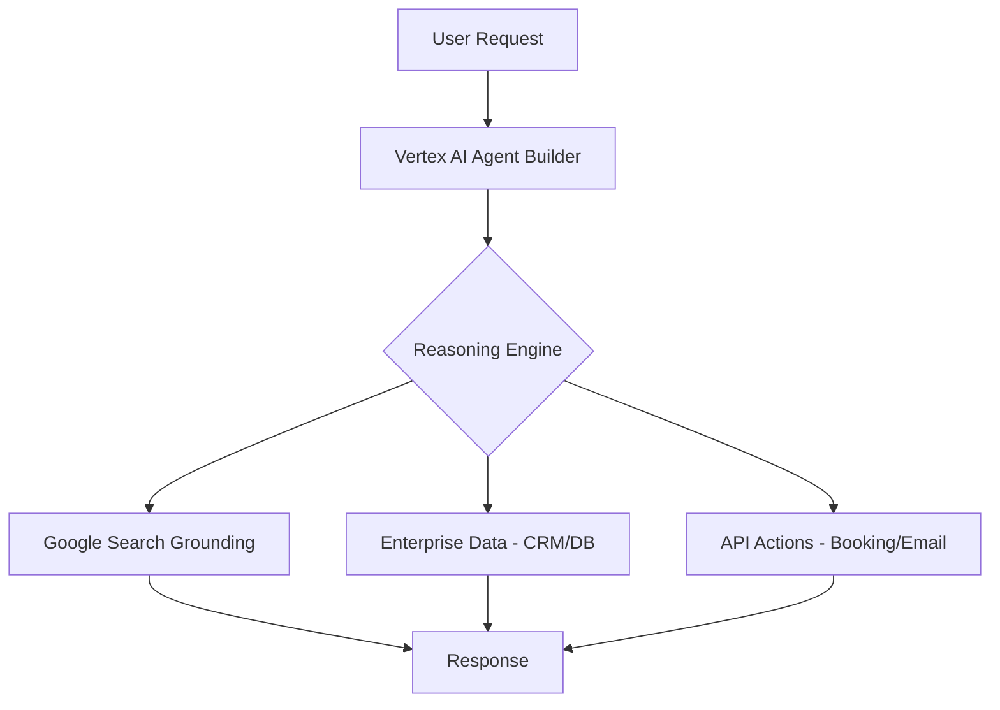

---

title: "Google Cloud Next 2024: The Complete Recap — Gemini 1.5 Pro, TPU v5p, and the Agent Stack Pitch"
slug: "google-cloud-next-2024-recap"
date: "2024-04-11"
lastModified: "2026-05-05"
author: "William Spurlock"
readingTime: 18  # ~3600 words / 200
categories:

- "AI Models and News"
tags:
- "Google Cloud Next 2024"
- "Gemini 1.5 Pro"
- "TPU v5p"
- "Google Axion"
- "Vertex AI"
- "AI Agents"
featured: true
draft: false
excerpt: "Google Cloud Next 2024 marked a massive shift from generative hype to 'agentic' reality. Here is the complete recap of Gemini 1.5 Pro, Axion, and the new Agent Stack."
coverImage: "/images/blog/google-cloud-next-2024-recap.png"
seoTitle: "Google Cloud Next 2024 Recap: Gemini 1.5 Pro & Agent Stack"
seoDescription: "A deep dive into Google Cloud Next 2024: Gemini 1.5 Pro's 1M context window, TPU v5p, Axion CPU, and the pivot to AI agents."
seoKeywords:
- "Google Cloud Next 2024 recap"
- "Gemini 1.5 Pro context window"
- "Google Axion CPU"
- "Vertex AI Agent Builder"
- "Gemini Code Assist vs GitHub Copilot"

# AIO/AEO Fields

aioTargetQueries:

- "what was announced at google cloud next 2024"
- "gemini 1.5 pro 1m context window impact"
- "google axion vs aws graviton"
- "how to build ai agents on vertex ai"
contentCluster: "conferences-industry"
pillarPost: true
entityMentions:
- "William Spurlock"
- "Google Cloud Next 2024"
- "Gemini 1.5 Pro"
- "Thomas Kurian"
- "Sundar Pichai"
- "Vertex AI"
- "TPU v5p"
- "Google Axion"

# Service Track Routing

## serviceTrack: "ai-automation"

## Table of Contents

1. [The Energy at Next '24: From Generative to Agentic](#the-energy-at-next-24-from-generative-to-agentic)
2. [Gemini 1.5 Pro: The 1 Million Token Context Window Breakthrough](#gemini-1-5-pro-the-1-million-token-context-window-breakthrough)
3. [Native Multimodality: Processing Audio and Video at Scale](#native-multimodality-processing-audio-and-video-at-scale)
4. [Gemini Code Assist: Google’s Direct Shot at GitHub Copilot](#gemini-code-assist-googles-direct-shot-at-github-copilot)
5. [Vertex AI Agent Builder: The No-Code to Pro-Code Agent Factory](#vertex-ai-agent-builder-the-no-code-to-pro-code-agent-factory)
6. [Grounding AI in Enterprise Truth: Google Search and Beyond](#grounding-ai-in-enterprise-truth-google-search-and-beyond)
7. [Infrastructure: TPU v5p and the AI Hypercomputer](#infrastructure-tpu-v5p-and-the-ai-hypercomputer)
8. [Google Axion: The Arm-Based CPU Challenge to AWS Graviton](#google-axion-the-arm-based-cpu-challenge-to-aws-graviton)
9. [The "Agent Stack" Pitch: Positioning for Enterprise Leadership](#the-agent-stack-pitch-positioning-for-enterprise-leadership)
10. [Six Classes of AI Agents: The New Enterprise Blueprint](#six-classes-of-ai-agents-the-new-enterprise-blueprint)
11. [Google Cloud vs. AWS vs. Azure: The State of the Race in April 2024](#google-cloud-vs-aws-vs-azure-the-state-of-the-race-in-april-2024)
12. [The Builder’s Take: Why the "Agentic" Pivot Changes Everything](#the-builders-take-why-the-agentic-pivot-changes-everything)
13. [Frequently Asked Questions](#frequently-asked-questions)

## The Energy at Next '24: From Generative to Agentic

**Google Cloud Next 2024 was the moment the industry moved past the "chat" phase and into the "agent" phase.** Walking through the Mandalay Bay in Las Vegas, the energy was palpably different from the previous year. In 2023, everyone was asking, "What can LLMs do?" In 2024, the answer was definitive: "They can act."

Google Cloud CEO Thomas Kurian and Alphabet CEO Sundar Pichai didn't just talk about better models; they talked about a new way to cloud. The "Agentic" pivot was everywhere. Google isn't just selling compute anymore; they are selling the "Agent Stack"—a comprehensive ecosystem designed to help enterprises build, deploy, and govern semi-autonomous AI agents that actually achieve business goals.


| Feature          | 2023 Focus (Generative) | 2024 Focus (Agentic)        |
| ---------------- | ----------------------- | --------------------------- |
| **Primary Goal** | Content Generation      | Task Completion             |
| **Interface**    | Chat / Prompting        | Autonomous Action           |
| **Data Source**  | Training Data           | Grounded Enterprise Data    |
| **Outcome**      | Drafts / Summaries      | Business Process Automation |


This shift represents a fundamental change in how we think about AI. It’s no longer about a human talking to a box; it’s about a box talking to your CRM, your codebase, and your customers to get work done.

## Gemini 1.5 Pro: The 1 Million Token Context Window Breakthrough

**The headline of the show was the public preview of Gemini 1.5 Pro, featuring a world-first 1 million token context window.** To put that in perspective, 1 million tokens is roughly equivalent to 1 hour of video, 11 hours of audio, 30,000 lines of code, or over 700,000 words.

While competitors like GPT-4 were hovering around 128k context windows at the time, Google’s leap to 1M changed the game for enterprise data processing. It effectively eliminates the "needle in a haystack" problem for massive datasets. You can now drop an entire project’s documentation, codebase, and Slack history into a single prompt and ask, "Where is the bug in our authentication flow?"

### Why Context Window Size Matters

For builders, a larger context window means less reliance on complex RAG (Retrieval-Augmented Generation) pipelines for certain use cases. Instead of chunking data and hoping your vector search finds the right piece, you can simply provide the entire context.

```typescript
// Example of how a 1M context window changes the game
const massiveContext = await loadEntireCodebase(); // 800,000 tokens
const prompt = "Analyze this entire codebase for architectural inconsistencies.";

const response = await gemini.generateContent([
  { text: massiveContext },
  { text: prompt }
]);
```

Google demonstrated this by processing an hour-long video and asking specific questions about events that happened at the 45-minute mark. The model didn't just summarize; it understood the temporal and visual context natively.

## Native Multimodality: Processing Audio and Video at Scale

**Gemini 1.5 Pro isn't just big; it's natively multimodal, meaning it was trained to understand audio, video, and text simultaneously.** Most previous models "cheated" by transcribing audio to text or converting video frames to images before processing. Gemini 1.5 Pro processes these streams directly.

At Next '24, Google announced that Gemini 1.5 Pro can now process audio streams natively in Vertex AI. This includes speech, music, and the audio portion of videos.

### Real-World Multimodal Use Cases:

- **Customer Service:** Analyzing hours of call center recordings to identify sentiment shifts and compliance issues without needing a separate transcription step.
- **Media & Entertainment:** Searching through massive video archives for specific visual or auditory cues (e.g., "Find every scene where a blue car honks its horn").
- **Legal & Compliance:** Reviewing earnings calls or investor meetings by asking cross-modal questions about both what was said and what was shown on slides.

> "The ability to process audio and video natively within the same context window as text allows for a level of reasoning that was previously impossible." — Thomas Kurian, CEO Google Cloud

## Gemini Code Assist: Google’s Direct Shot at GitHub Copilot

**Google rebranded Duet AI for Developers to Gemini Code Assist, signaling a major upgrade in capability and a direct challenge to Microsoft’s GitHub Copilot.** The standout feature is "Full Codebase Awareness," powered by Gemini 1.5 Pro’s 1M context window.

Unlike standard coding assistants that only see a few files at a time, Gemini Code Assist can ingest your entire repository. This allows it to perform complex refactors, add features that respect your project's unique architecture, and identify bugs that span multiple files.

### Key Capabilities of Gemini Code Assist:

1. **Full Codebase Awareness:** Understands dependencies and patterns across tens of thousands of lines of code.
2. **Code Transformation:** Use natural language to analyze, refactor, and optimize code (e.g., "Convert this entire legacy Java service to Go").
3. **Code Customization:** Connects to private repositories on GitLab, GitHub, and Bitbucket for hyper-personalized suggestions.
4. **Local Context:** Automatically retrieves relevant local files from your IDE workspace to provide better inline completions.


| Feature             | GitHub Copilot (April 2024)    | Gemini Code Assist                     |
| ------------------- | ------------------------------ | -------------------------------------- |
| **Model**           | GPT-4                          | Gemini 1.5 Pro                         |
| **Context Window**  | ~128k (via Copilot Enterprise) | 1M Tokens                              |
| **Enterprise Data** | GitHub Repos only              | Multi-source (GitLab, Bitbucket, etc.) |
| **Refactoring**     | File-level                     | Repository-level                       |


For developers, this means the assistant is no longer just a "smarter autocomplete"; it's a junior engineer that knows the entire project.

## Vertex AI Agent Builder: The No-Code to Pro-Code Agent Factory

**To accelerate the "Agentic" pivot, Google launched Vertex AI Agent Builder, a unified tool for creating and deploying AI agents.** It brings together Vertex AI Search and Conversation with a suite of new developer tools.

The goal is to lower the barrier to entry for building production-grade agents. Whether you are a business analyst using natural language or a senior engineer using LangChain, Agent Builder provides the infrastructure to connect models to enterprise data and take action.

### How it Works:

- **Natural Language Console:** Build an agent by simply describing what you want it to do (e.g., "Build a travel agent that can check flight availability and book tickets using our internal API").
- **Enterprise Data Integration:** Seamlessly connect agents to BigQuery, Salesforce, Workday, and other sources of truth.
- **Orchestration Frameworks:** Supports open-source frameworks like LangChain on Vertex AI for more complex, multi-step reasoning.




By providing a managed environment for agent orchestration, Google is solving the "last mile" problem of AI—turning a model's intelligence into a business outcome.

## Grounding AI in Enterprise Truth: Google Search and Beyond

**Hallucinations are the death of enterprise AI, and Google’s answer is "Grounding."** At Next '24, Google announced the public preview of grounding with Google Search in Vertex AI.

Grounding allows a model to check its answers against a live, verifiable source of information. This is critical for agents that handle customer-facing queries or financial data where accuracy is non-negotiable.

### Two Tiers of Grounding:

1. **Google Search Grounding:** The model uses Google’s search engine to find the most current information (e.g., "What is the current stock price of Google?").
2. **Enterprise Data Grounding:** The model uses your own internal data—from BigQuery datasets to PDF manuals in Cloud Storage—to provide answers specific to your business.

### The Impact on Reliability:

By grounding Gemini in Search and internal data, Google is effectively creating a "closed-loop" system where the AI's reasoning is constantly validated against reality. This reduces hallucinations and increases the trust that enterprises can place in autonomous agents.

## Infrastructure: TPU v5p and the AI Hypercomputer

**AI models are only as good as the hardware they run on, and Google announced that Cloud TPU v5p is now generally available.** This is Google’s most powerful AI accelerator to date, designed specifically for training and serving the most demanding generative AI models.

TPU v5p offers 4X the compute power of the previous generation and double the high-bandwidth memory. But Google isn't just selling chips; they are selling the "AI Hypercomputer" architecture.

### The AI Hypercomputer Layers:

- **Performance-Optimized Hardware:** TPU v5p, NVIDIA H100 (A3 Mega), and the new Axion CPU.
- **Open Software:** Support for JAX, PyTorch, and TensorFlow, plus the new JetStream inference engine for high-throughput serving.
- **Flexible Consumption:** Dynamic Workload Scheduler for guaranteed start times or optimized economics.

### Benchmarks and Performance:

Google shared that TPU v5p can train large language models up to 2.8X faster than TPU v4. For enterprises like Anthropic and Mistral AI, this infrastructure is the backbone that allows them to push the boundaries of what's possible in AI.

## Google Axion: The Arm-Based CPU Challenge to AWS Graviton

**In a move to reduce reliance on x86 architecture and compete with AWS Graviton, Google announced Axion, its first custom Arm-based CPU.** Axion is designed for the data center and offers significant performance and energy efficiency gains for general-purpose workloads.

### Axion Performance Stats:

- **30% better performance** than the fastest general-purpose Arm-based instances available in the cloud today.
- **50% better performance** than comparable current-generation x86-based instances.
- **60% better energy efficiency** than comparable x86-based instances.

This is a major strategic move. By building its own CPUs, Google can optimize the entire stack—from the silicon to the hypervisor to the AI models—resulting in better price-performance for customers. Axion will be available in preview later this year and is ideal for web servers, containerized microservices, and data analytics engines.

## The "Agent Stack" Pitch: Positioning for Enterprise Leadership

**Google is no longer just a "cloud provider"; they are positioning themselves as the "Agentic Cloud."** The "Agent Stack" is the conceptual framework Google is using to win the enterprise AI market.

It consists of three integrated layers:

1. **AI Infrastructure:** The foundation (TPUs, GPUs, Axion CPUs) that powers the models.
2. **Gemini Models:** The reasoning engine (Gemini 1.5 Pro, 1.0 Ultra) that provides the intelligence.
3. **Vertex AI Platform:** The developer surface (Agent Builder, Grounding, MLOps) that allows teams to build and deploy agents.

By tightly integrating these layers, Google argues they can offer better performance, lower latency, and more robust security than competitors who rely on a patchwork of different vendors. This "full-stack" approach is designed to give enterprises the confidence to move from experimental pilots to production-scale AI agents.

## Six Classes of AI Agents: The New Enterprise Blueprint

**Google identified six distinct types of AI agents that are emerging in the enterprise.** This classification helps businesses understand where to start their agentic journey.

1. **Customer Agents:** Improving customer experience across web, mobile, and call centers (e.g., IHG Hotels travel planner).
2. **Employee Agents:** Helping employees be more productive by summarizing communications and surfacing context (e.g., Uber’s employee support tools).
3. **Creative Agents:** Assisting with ideation and production of content, video, and design (e.g., the new Google Vids app).
4. **Data Agents:** Deriving insights from complex datasets using natural language (e.g., Gemini in BigQuery).
5. **Code Agents:** Helping developers write, test, and refactor code faster (e.g., Gemini Code Assist).
6. **Security Agents:** Detecting and responding to threats in near real-time (e.g., Gemini in Security Operations).

By defining these categories, Google is providing a roadmap for enterprise digital transformation. It’s not about "replacing" humans; it’s about giving every employee a team of specialized AI agents to handle the heavy lifting.

## Google Cloud vs. AWS vs. Azure: The State of the Race in April 2024

**The "Cloud Wars" have entered a new phase, and in April 2024, Google Cloud has a clear lead in context window size and native multimodality.** While AWS and Azure are formidable, Google’s systems-level approach to AI is starting to pay dividends.

### The Comparison Matrix:


| Feature                  | Google Cloud (April 2024) | AWS (April 2024)                 | Microsoft Azure (April 2024) |
| ------------------------ | ------------------------- | -------------------------------- | ---------------------------- |
| **Flagship Model**       | Gemini 1.5 Pro            | Claude 3 / Titan                 | GPT-4 / GPT-4o               |
| **Max Context Window**   | 1,000,000 Tokens          | 200,000 Tokens (Claude 3)        | 128,000 Tokens               |
| **Native Multimodality** | Text, Audio, Video, Code  | Primarily Text/Image             | Primarily Text/Image         |
| **Custom Silicon**       | TPU v5p / Axion CPU       | Trainium / Inferentia / Graviton | Cobalt 100 / Maia 100        |
| **Agent Strategy**       | Vertex AI Agent Builder   | Amazon Bedrock Agents            | Azure AI Studio / Copilot    |


### Key Differentiators:

- **Google Cloud:** The leader in "long-context reasoning." If your use case involves massive datasets or video analysis, Google is the obvious choice.
- **AWS:** The leader in "model choice." Amazon Bedrock allows you to swap between models from Anthropic, Meta, Mistral, and Amazon itself.
- **Microsoft Azure:** The leader in "enterprise integration." If you are already deep in the Microsoft 365 ecosystem, Azure’s Copilot integration is hard to beat.

Google’s strategy is to be the "most capable" AI cloud, leveraging its deep research from DeepMind and its custom hardware to offer capabilities that simply don't exist elsewhere.

## The Builder’s Take: Why the "Agentic" Pivot Changes Everything

**As someone who spends every day building AI automations and custom digital experiences, the announcements at Next '24 are more than just marketing—they are a new set of power tools.**

The shift from "generative" to "agentic" is the most significant development in AI since the launch of ChatGPT. For my clients, this means we are moving away from simple chatbots that answer questions and toward integrated systems that *do work*.

### Why I’m Bullish on the Agent Stack:

1. **Reduced Complexity:** Tools like Vertex AI Agent Builder and Gemini 1.5 Pro’s 1M context window allow us to build more powerful systems with less "glue code."
2. **Accuracy at Scale:** Grounding with Google Search and enterprise data solves the trust problem. I can now confidently tell a founder that their AI agent won't make up facts about their inventory or pricing.
3. **Multimodal Potential:** The ability to process video and audio natively opens up entire industries—like real estate, fitness, and education—to AI transformation that was previously too expensive or complex to implement.

At the end of the day, Google Cloud Next '24 was a reminder that we are still in the early innings of the AI revolution. The "Agent Stack" is the blueprint for the next decade of software engineering.

## Frequently Asked Questions

1. **What was the biggest announcement at Google Cloud Next 2024?**
  **The public preview of Gemini 1.5 Pro with its 1 million token context window was the most impactful announcement.** This breakthrough allows enterprises to process massive datasets, including hours of video and entire codebases, within a single prompt, fundamentally changing how we approach large-scale data reasoning.
2. **How does Gemini 1.5 Pro's context window compare to GPT-4?**
  **Gemini 1.5 Pro offers a 1,000,000 token context window, which is nearly 8 times larger than GPT-4's 128,000 token limit.** This allows for significantly deeper reasoning over larger datasets without the need for complex data chunking or RAG pipelines.
3. **What is Gemini Code Assist and how is it different from Duet AI?**
  **Gemini Code Assist is the evolution of Duet AI, now powered by Gemini 1.5 Pro and featuring full codebase awareness.** Unlike Duet AI, which focused on inline completions, Gemini Code Assist can analyze and refactor your entire repository, making it a much more powerful tool for complex software engineering tasks.
4. **What is Google Axion and why did Google build its own CPU?**
  **Google Axion is Google's first custom Arm-based CPU designed for data centers to improve performance and energy efficiency.** By building its own silicon, Google can optimize the entire hardware-software stack, delivering up to 50% better performance and 60% better energy efficiency than comparable x86-based instances.
5. **How does Vertex AI Agent Builder simplify agent development?**
  **Vertex AI Agent Builder provides a unified, low-code console for building and deploying AI agents using natural language.** It abstracts away the complexity of model orchestration, grounding, and enterprise data integration, allowing developers and business users to create production-ready agents in minutes.
6. **What does "grounding" mean in the context of Vertex AI?**
  **Grounding is the process of connecting an AI model to a live source of truth, such as Google Search or an internal enterprise database.** This ensures that the model's responses are accurate, current, and verifiable, significantly reducing the risk of hallucinations in production environments.
7. **Is TPU v5p better than NVIDIA H100 for AI training?**
  **Cloud TPU v5p is Google's most powerful AI accelerator, offering 4X the compute power of the previous generation and optimized specifically for large-scale LLM training.** While NVIDIA H100 remains the industry standard for general-purpose GPU compute, TPU v5p provides a highly competitive, integrated alternative within the Google Cloud ecosystem.
8. **What are the six types of AI agents Google identified?**
  **Google identified Customer, Employee, Creative, Data, Code, and Security agents as the primary categories for enterprise AI.** This framework helps businesses categorize their AI initiatives and prioritize the most impactful use cases for digital transformation.
9. **How does Google Cloud's AI strategy differ from Microsoft Azure's?**
  **Google Cloud focuses on a "full-stack" integrated approach with custom hardware and long-context models, while Azure leans heavily on its partnership with OpenAI and deep integration with Microsoft 365.** Google is positioning itself as the leader in raw AI capability and reasoning, whereas Azure is the leader in enterprise software integration.
10. **When will Gemini 1.5 Pro be generally available?**
  **Gemini 1.5 Pro entered public preview in Vertex AI during Google Cloud Next 2024 (April 2024).** General availability typically follows a few months of public preview as Google gathers feedback and scales the infrastructure.

---

### Ready to build your own Agent Stack?

The shift to agentic AI is here, and the tools announced at Google Cloud Next '24 have made it easier than ever to build high-leverage automations. Whether you need a custom AI agent to handle your customer support or a grounded data agent to analyze your business metrics, I can help you architect and ship the solution.

**[Book an AI automation strategy call](https://williamspurlock.com/contact)** and let's turn these breakthroughs into real growth for your business.

**Related Posts:**

- [The Rise of AI Agents: Why Your Business Needs a Multi-Agent System in 2024](/blog/rise-of-ai-agents)
- [n8n vs. Make: Why n8n is the King of AI Workflow Automation](/blog/n8n-vs-make-ai-automation)
- [Building Immersive Digital Experiences with Next.js and GSAP](/blog/immersive-web-design-gsap)

