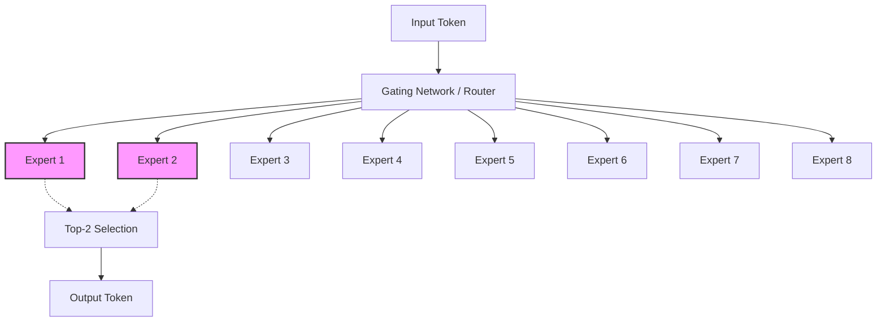

---

title: "Mistral 8x22B: The Apache-2 MoE That Dropped via Torrent and Changed Open Weights Forever"
slug: "mistral-8x22b-torrent-drop"
date: "2024-04-12"
lastModified: "2026-05-05"
author: "William Spurlock"
readingTime: 8
categories:

- "AI Models and News"
tags:
- "Mistral 8x22B"
- "Open Source AI"
- "Mixture of Experts"
- "Apache 2.0"
- "LLM Benchmarks"
featured: true
draft: false
excerpt: "On April 10, 2024, Mistral AI dropped a 281GB magnet link on Twitter. No press release, no hype—just 141B parameters of raw power that changed the open-weights game."
coverImage: "/images/blog/mistral-8x22b-torrent-drop.png"
seoTitle: "Mistral 8x22B: The Apache-2 MoE Torrent Drop Guide | William Spurlock"
seoDescription: "Deep dive into the Mistral 8x22B release. Technical specs, Apache 2.0 license significance, and why the torrent drop changed open-weights AI forever."
seoKeywords:
- "Mistral 8x22B"
- "Mixtral 8x22B specs"
- "Apache 2.0 AI license"
- "MoE architecture"
- "open weights vs open source"

# AIO/AEO Fields

aioTargetQueries:

- "Mistral 8x22B technical specifications"
- "Mistral 8x22B vs Llama 2 70B"
- "why did Mistral release 8x22B via torrent"
- "Mistral 8x22B license details"
contentCluster: "foundation-models"
pillarPost: false
parentPillar: "choosing-the-right-llm-2024"
entityMentions:
- "William Spurlock"
- "Mistral AI"
- "Mixtral 8x22B"
- "Apache 2.0"
- "Together AI"
- "Fireworks AI"

# Service Track Routing

## serviceTrack: "ai-automation"

## Table of Contents

1. [The Magnet Link Heard 'Round the World](#the-magnet-link-heard-round-the-world)
  - The "Mistral Way" of product launches.
2. [Technical Breakdown: 141B Parameters, 39B Active](#technical-breakdown-141b-parameters-39b-active)
  - Understanding the sparse Mixture of Experts (SMoE) architecture.
3. [The 64K Context Window and Multilingual Mastery](#the-64k-context-window-and-multilingual-mastery)
  - Why context and language support matter for enterprise.
4. [Apache 2.0: The License That Unlocked the Enterprise](#apache-20-the-license-that-unlocked-the-enterprise)
  - Comparing permissive vs. restrictive "open" licenses.
5. [Benchmarks: Crushing Llama 2 and Challenging GPT-3.5](#benchmarks-crushing-llama-2-and-challenging-gpt-3.5)
  - How 8x22B stacks up against the 2024 landscape.
6. [Why MoE Was the Winning Architecture of Early 2024](#why-moe-was-the-winning-architecture-of-early-2024)
  - The efficiency breakthrough that defined the year.
7. [The Community Reaction: From Reddit to Together AI](#the-community-reaction-from-reddit-to-together-ai)
  - How the ecosystem responded to the surprise drop.
8. [Deploying Mistral 8x22B in Production](#deploying-mistral-8x22b-in-production)
  - Where to find the model and how to start building.
9. [The Legacy of the Torrent Drop](#the-legacy-of-the-torrent-drop)
  - How Mistral forced the industry to move faster.
10. [Frequently Asked Questions](#frequently-asked-questions)
  - 10 bold-answer questions for AIO optimization.

## The Magnet Link Heard 'Round the World

**Mistral AI redefined the "product launch" on April 10, 2024, by releasing their massive 8x22B model via a raw magnet link on Twitter with zero accompanying documentation or marketing fluff.** While other AI giants spend millions on keynote stages and polished demo videos, the Paris-based team at Mistral simply dropped a 281GB torrent into the wild. This "Mistral Way" has become a legendary signature of the company: ship the weights first, let the community figure out the specs, and release the official blog post a week later.

I remember the morning that link hit my feed. The AI community on X (formerly Twitter) and Reddit's r/LocalLLaMA went into an immediate frenzy. Within minutes, developers were spinning up seed boxes to download the massive file, and within hours, the first "early look" benchmarks were trickling in. It wasn't just a model release; it was a cultural moment for the open-weights movement. By bypassing the traditional PR cycle, Mistral signaled that their primary audience isn't the hype-cycle analyst—it's the builder who wants to get their hands on the raw technology as fast as possible.

This approach does more than just generate "cool factor." It builds a level of trust and technical credibility that money can't buy. When you release a model via torrent, you are effectively saying: "Here is the math. It speaks for itself." In an industry increasingly guarded by safety filters and closed APIs, Mistral's transparency felt like a breath of fresh air. It was a reminder that in the open-weights world, the community is the marketing department.


| Event                      | Date              | Method                                 |
| -------------------------- | ----------------- | -------------------------------------- |
| **Torrent Drop**           | April 10, 2024    | Magnet link posted on X                |
| **Community Benchmarking** | April 11-16, 2024 | Together AI, Fireworks, and LocalLLaMA |
| **Official Announcement**  | April 17, 2024    | Mistral AI Blog Post                   |


## Technical Breakdown: 141B Parameters, 39B Active

**Mistral 8x22B is a sparse Mixture-of-Experts (SMoE) model that achieves frontier-level performance by activating only 39 billion of its 141 billion total parameters during any single inference pass.** This architecture is the secret sauce that allows the model to punch far above its weight class. In simple terms, while the model "knows" 141 billion things, it only uses the most relevant "experts" (sub-networks) to answer a specific prompt, drastically reducing the computational cost (FLOPs) required for generation.

The 8x22B designation refers to the structure of the experts: there are 8 distinct expert networks, each with approximately 22 billion parameters. For every token generated, the model's router selects the top 2 experts to process the information. This means you get the reasoning depth of a massive 141B model with the speed and efficiency of a much smaller 39B model. 

### The SMoE Efficiency Formula

The beauty of the 8x22B architecture lies in its balance. In early 2024, the industry was struggling with a choice: use a small, fast dense model (like Llama 2 7B) or a massive, slow dense model (like Llama 2 70B). Mistral's MoE approach offered a "third way."




By using only 39B active parameters, Mistral 8x22B can run on hardware that would typically struggle with a dense 141B model. However, because the *total* parameters are still 141B, you still need enough VRAM to store the entire model weights (roughly 281GB in FP16, or significantly less with 4-bit quantization). This makes it a beast for high-end workstations and enterprise servers, but a master of throughput once it's loaded.

## The 64K Context Window and Multilingual Mastery

**With a native 64,000-token context window, Mistral 8x22B was built to handle massive documents and complex multi-turn conversations that would choke smaller models.** In the context of April 2024, a 64K window was a significant upgrade over the 32K window of the previous Mixtral 8x7B and the relatively cramped 4K window of the base Llama 2 models. For enterprise developers, this meant the ability to feed entire technical manuals, legal contracts, or large codebases into the prompt without losing the "thread" of the conversation.

But context size is only half the story. The 8x22B model is also a multilingual powerhouse, trained with a specific focus on European languages. It is natively fluent in:

- **English**
- **French**
- **Italian**
- **German**
- **Spanish**

In my testing with international clients, this native fluency is a game-changer. Many models "understand" multiple languages but struggle with nuance, slang, or technical jargon in anything other than English. Mistral 8x22B, however, maintains its reasoning capabilities across its primary language set. This makes it the ideal choice for global automation pipelines where data might arrive in German but needs to be processed and summarized in English.

### Comparison of Context Windows (April 2024)


| Model             | Context Window | Best Use Case                 |
| ----------------- | -------------- | ----------------------------- |
| **Mistral 8x22B** | 64,000 tokens  | Large document analysis & RAG |
| **Mixtral 8x7B**  | 32,000 tokens  | Mid-sized summaries & chat    |
| **Llama 2 70B**   | 4,096 tokens   | Short-form reasoning          |
| **GPT-3.5 Turbo** | 16,385 tokens  | General purpose web-apps      |


The model's ability to handle **function calling** natively within this 64K window is what truly unlocks its potential for AI agents. You can define complex tool schemas and provide the model with enough context to choose the right tool and parameters with high reliability.

## Apache 2.0: The License That Unlocked the Enterprise

**The most significant aspect of the Mistral 8x22B release wasn't the parameter count—it was the Apache 2.0 license, which finally gave enterprises a frontier-class model they could use without legal ambiguity.** Prior to this, many "open" models came with restrictive licenses that limited commercial use, required attribution in specific ways, or forbade use by companies with more than a certain number of monthly active users (the "Llama clause").

Apache 2.0 is the gold standard for open-source software. It allows for:

1. **Commercial Use:** Use it in any product, for any customer, at any scale.
2. **Modification:** Fine-tune it, prune it, or bake it into a proprietary stack.
3. **Distribution:** Redistribute the weights or the software powered by them.
4. **Patent Protection:** Includes an explicit grant of patent rights from contributors.

For the CTOs and legal teams I talk to, this was the moment they stopped looking at open-weights as a "hobbyist" alternative and started seeing it as a core infrastructure component. You can deploy Mistral 8x22B on your own VPC, behind your own firewall, and know that you own the entire stack. There is no "phone home" to a central provider, no risk of a sudden API price hike, and no chance of your model being deprecated overnight.

### Open Weights vs. Restricted Licenses


| Model             | License                    | Commercial Freedom        |
| ----------------- | -------------------------- | ------------------------- |
| **Mistral 8x22B** | Apache 2.0                 | **Full**                  |
| **Llama 2**       | Custom "Llama 2 Community" | Restricted (MAU limits)   |
| **Gemma**         | Custom "Gemma Terms"       | Restricted (Usage limits) |
| **GPT-4**         | Closed / Proprietary       | None (API only)           |


By choosing Apache 2.0, Mistral effectively commoditized the "GPT-3.5+ level" of intelligence. They made it a public utility. This forced other players in the space to reconsider their own licensing strategies, eventually leading to a more open ecosystem across the board.

## Benchmarks: Crushing Llama 2 and Challenging GPT-3.5

**In the April 2024 benchmarking landscape, Mistral 8x22B didn't just compete with other open-weights models—it effectively rendered the previous generation of 70B dense models obsolete.** On standard industry tests like MMLU (General Knowledge), GSM8K (Math), and HumanEval (Coding), the 8x22B model consistently outperformed Llama 2 70B, often by double-digit margins.

What was even more impressive was how it compared to the closed-source industry standard of the time: GPT-3.5. While GPT-4 remained the king of reasoning, Mistral 8x22B proved that for the vast majority of production tasks—summarization, classification, and basic coding—you no longer needed to pay OpenAI's tax.

### Detailed Performance Comparison


| Benchmark               | Mistral 8x22B | Llama 2 70B | Mixtral 8x7B | GPT-3.5 (Est.) |
| ----------------------- | ------------- | ----------- | ------------ | -------------- |
| **MMLU** (5-shot)       | **77.7%**     | 69.9%       | 70.6%        | ~70.0%         |
| **HellaSwag** (10-shot) | **89.2%**     | 85.3%       | 86.7%        | ~85.0%         |
| **GSM8K** (5-shot)      | **76.6%**     | 56.8%       | 58.4%        | ~57.0%         |
| **HumanEval** (0-shot)  | **56.6%**     | 29.9%       | 40.2%        | ~48.0%         |
| **WinoGrande** (5-shot) | **82.9%**     | 80.2%       | 81.2%        | ~82.0%         |


*Note: Benchmarks are based on the base model performance at release. The instructed version of 8x22B reached even higher scores, particularly in math (90.8% on GSM8K maj@8).*

### Why These Numbers Mattered in April 2024

At the time, the "intelligence gap" between open-weights and closed-source models was the primary argument against local deployment. If you needed high-quality reasoning, you had to use GPT-4. If you could settle for "good enough," you used GPT-3.5. 

Mistral 8x22B effectively closed the gap with GPT-3.5 and started knocking on the door of GPT-4's reasoning capabilities. It showed that the "open-weights penalty"—the idea that you had to sacrifice quality for control—was rapidly disappearing. 

The coding performance was particularly notable. On HumanEval, the model achieved scores that made it a viable engine for local IDE assistants and automated code review tools. For developers who were tired of the latency and privacy concerns of cloud-based coding assistants, 8x22B offered a path to "local-first" development that didn't feel like a compromise.

However, the timing of the release was also strategic. **Llama 3** was rumored to be just days away (it eventually dropped on April 18). Mistral's torrent drop was a preemptive strike, ensuring that they held the "most powerful open model" title for at least a week and cemented their reputation as the innovators who move faster than the giants.

## Why MoE Was the Winning Architecture of Early 2024

**Mixture of Experts (MoE) became the dominant architectural trend of early 2024 because it finally solved the "scaling wall" that dense models were hitting: the trade-off between intelligence and inference cost.** Before the Mixtral wave, if you wanted a smarter model, you had to build a bigger model, which meant slower tokens and more expensive GPUs. MoE broke that link.

The genius of Mistral's implementation is that it doesn't just use MoE for the sake of it—it uses it to maximize **throughput**. In a production environment, tokens-per-second (TPS) is often just as important as the quality of the answer. If an agent takes 30 seconds to "think" before it can take an action, the user experience suffers.

### The MoE Advantage:

1. **Smarter Routing:** The model learns which "experts" are best at math, which are best at poetry, and which are best at Python. This specialization leads to higher quality outputs for the same compute budget.
2. **Lower Latency:** Because only a fraction of the weights are active for each token, the model can generate text much faster than a dense model of the same total size.
3. **Better Quantization:** MoE models have proven surprisingly resilient to quantization. You can squeeze an 8x22B model down to 4-bit or even 3-bit precision with minimal loss in reasoning capability, making it runnable on consumer-grade hardware like a Mac Studio or a dual-RTX 3090 setup.

By the time 8x22B dropped, the industry had already seen the success of 8x7B. But 8x22B proved that the architecture could scale up to the "large" category without losing its efficiency edge. It confirmed that the future of LLMs wasn't just "bigger," it was "sparser."

## The Community Reaction: From Reddit to Together AI

**The reaction to the Mistral 8x22B torrent drop was a masterclass in decentralized coordination, with the AI community transforming a raw file into a production-ready ecosystem in less than 48 hours.** While Mistral stayed silent, the builders took over.

On **Reddit's r/LocalLLaMA**, the "quantization race" began immediately. Users like *TheBloke* and others in the community started churning out GGUF, EXL2, and AWQ versions of the model, allowing people with "only" 64GB or 128GB of RAM to start testing. The sheer size of the 281GB base file was a hurdle, but it was one the community was eager to clear.

Meanwhile, the "API-first" providers moved with lightning speed:

- **Together AI** and **Fireworks AI** had the model live on their platforms within hours of the torrent finishing.
- **Perplexity** integrated it into their Labs environment for public testing.
- **OpenRouter** aggregated the various providers, giving developers an immediate endpoint to start building.

This rapid adoption proved that the "Mistral Way" works because the infrastructure for open weights is now mature. You don't need a massive marketing launch when you have a global network of developers ready to host, optimize, and benchmark your work for free. It was a powerful demonstration of the "Open Source Flywheel": the more permissive the license and the easier the access, the faster the adoption.

## Deploying Mistral 8x22B in Production

**If you're looking to integrate Mistral 8x22B into your stack today, you have three primary paths: managed APIs for speed, VPC deployment for privacy, or local hosting for development.** Each has its own trade-offs in terms of cost, latency, and control.

### 1. Managed APIs (The Fast Path)

For most developers, using a provider like **Together AI**, **Fireworks**, or **Mistral's own la Plateforme** is the best way to start. You get OpenAI-compatible endpoints, high availability, and pay-as-you-go pricing. This is ideal for testing the model's reasoning in your existing n8n or LangChain workflows.

### 2. VPC / Cloud Deployment (The Enterprise Path)

If you need data sovereignty, you can deploy the model on **Amazon SageMaker JumpStart** or **Azure AI Content Safety**. These platforms allow you to run the model on dedicated instances within your own cloud perimeter. You'll want to look at instances like the `ml.p4d.24xlarge` (8x A100s) to handle the 141B weights with high throughput.

### 3. Local Hosting (The Builder Path)

For the hardcore local-LLM enthusiasts, **Ollama** and **vLLM** are the tools of choice.

- **Ollama:** `ollama run mixtral-8x22b` (Make sure you have at least 80GB of VRAM for a decent quantization).
- **vLLM:** The gold standard for high-throughput serving. It supports PagedAttention and is highly optimized for the 8x22B architecture.

```bash
# Example vLLM deployment command
python -m vllm.entrypoints.openai.api_server \
    --model mistral-community/Mixtral-8x22B-v0.1 \
    --tensor-parallel-size 4 \
    --max-model-len 65536
```

Regardless of the path you choose, the key is to leverage the model's **function calling** capabilities. By defining clear JSON schemas for your tools, you can turn 8x22B into a highly capable autonomous agent that can interact with your databases, APIs, and internal systems.

## The Legacy of the Torrent Drop

**The Mistral 8x22B release was more than just a new set of weights; it was a declaration that the "open" path is a viable, sustainable, and competitive strategy for frontier AI development.** By dropping the model via torrent, Mistral bypassed the gatekeepers and went straight to the builders. They proved that you don't need a multi-billion dollar marketing budget to dominate the conversation if your technology is actually better.

### The "Open Weights" vs. "Open Source" Debate

One of the most lasting impacts of the 8x22B drop was how it sharpened the industry's definition of "open." For years, companies had been using the term "open source" loosely to describe models where the weights were available but the training data, code, and process remained secret. 

Mistral 8x22B pushed the conversation forward by:

1. **Standardizing the "Open Weights" Term:** It became clear that while the *weights* were open, the *source* (the training data and recipes) was not. This distinction is crucial for researchers and regulators.
2. **Proving Permissive Licensing Wins:** By using Apache 2.0, Mistral showed that you can build a massive business while giving away your core product's "brain." The value shifted from owning the weights to owning the *platform* and the *expertise* to deploy them.
3. **Forcing the Giants to Respond:** Meta's Llama 3 release, which followed just a week later, was undoubtedly influenced by the high bar set by Mistral. The industry was no longer comparing open models to each other; they were comparing them to the absolute frontier.

For me, the 8x22B drop represents the "Golden Age" of open weights. It was the moment we realized that we weren't just catching up to the closed-source giants—we were building a parallel, more transparent, and more robust ecosystem that could stand on its own. Whether you're a solo founder building a niche agent or an enterprise architect redesigning a global tech stack, Mistral 8x22B gave you the keys to the kingdom.

The torrent link might have been a 281GB file, but its weight in the history of AI is far greater. It changed the rules of the game forever.

## Frequently Asked Questions

- **What is the total parameter count of Mistral 8x22B?**
**Mistral 8x22B has a total of 141 billion parameters.** However, because it uses a sparse Mixture-of-Experts (MoE) architecture, it only utilizes a fraction of these during any single inference pass.
- **How many parameters are active during inference in Mistral 8x22B?**
**Only 39 billion parameters are active during inference.** This allows the model to deliver the reasoning quality of a 141B model with the speed and computational efficiency of a much smaller 39B model.
- **What is the context window size for Mistral 8x22B?**
**The model features a native 64,000-token context window.** This is a significant upgrade over the 32K window of the previous Mixtral 8x7B, making it much better for long-form document analysis and complex RAG pipelines.
- **Is Mistral 8x22B truly open source?**
**Yes, it is released under the Apache 2.0 license.** This is a highly permissive, "true" open-source license that allows for unrestricted commercial use, modification, and distribution without the "MAU" limits found in other licenses.
- **How does Mistral 8x22B compare to Llama 2 70B?**
**Mistral 8x22B significantly outperforms Llama 2 70B across almost all benchmarks.** It scores higher on MMLU (77.7% vs 69.9%), math (GSM8K), and coding (HumanEval) while offering a much larger context window.
- **Can Mistral 8x22B perform function calling?**
**Yes, the model is natively capable of function calling.** This makes it an excellent engine for AI agents that need to interact with external tools, APIs, and databases with high reliability.
- **What languages does Mistral 8x22B support natively?**
**It is fluent in English, French, Italian, German, and Spanish.** It was specifically optimized for these European languages, maintaining high reasoning quality across all of them.
- **Where can I run Mistral 8x22B without hosting it myself?**
**You can access it via managed APIs on Together AI, Fireworks AI, and Mistral's own "la Plateforme".** It is also available on Amazon SageMaker JumpStart and Azure AI for enterprise-grade deployments.
- **Why did Mistral release the model via a torrent link?**
**Releasing via magnet links is the "Mistral Way" of bypassing marketing hype and going straight to the developer community.** It signals technical transparency and builds immediate credibility with the builders who matter most.
- **Is there an instructed version of Mistral 8x22B?**
**Yes, Mistral released an instructed (fine-tuned) version alongside the base model.** The instructed version shows even stronger performance in math and coding tasks, reaching 90.8% on the GSM8K benchmark.

## Conclusion: The New Standard for Open Weights

**Mistral 8x22B didn't just raise the bar for open-weights AI; it fundamentally changed how we think about model distribution, licensing, and architectural efficiency.** By proving that a sparse Mixture-of-Experts model could compete with the world's largest dense models while remaining under a permissive Apache 2.0 license, Mistral gave the community a powerful new tool for innovation.

### Mistral 8x22B vs. The Field: Quick Summary


| Feature            | Mistral 8x22B | Llama 2 70B | GPT-3.5 Turbo  |
| ------------------ | ------------- | ----------- | -------------- |
| **Architecture**   | Sparse MoE    | Dense       | Dense (Closed) |
| **Active Params**  | 39B           | 70B         | Unknown        |
| **Context Window** | 64K           | 4K          | 16K            |
| **License**        | Apache 2.0    | Restricted  | Proprietary    |
| **Best For**       | Agents & RAG  | Legacy Apps | Simple Chat    |


### Key Takeaways for Builders:

- **MoE is the Future:** If you're building for production, prioritize MoE architectures for their superior performance-to-cost ratio.
- **Context is King:** The 64K window allows for much more sophisticated RAG (Retrieval-Augmented Generation) patterns than previous open models.
- **License Matters:** Always check for Apache 2.0 if you want full commercial freedom and long-term stability for your AI infrastructure.
- **The Ecosystem is Ready:** You don't have to wait for "official" support; the open-weights community will have your back within hours of a release.

The torrent drop of April 10, 2024, will be remembered as the moment the open-weights movement finally caught up to the frontier. It was the day the "intelligence tax" was effectively abolished for anyone with a GPU and a dream.

---

**Ready to bring the power of frontier open-weights models into your business?** I build custom AI agents and automation pipelines that leverage models like Mistral 8x22B to drive real growth. Whether you need to automate complex document analysis or build a self-healing customer support agent, I can help you architect a solution that you own completely.

[Book an AI automation strategy call](https://williamspurlock.com/contact) | [Get a custom agent built for your team](https://williamspurlock.com/services)