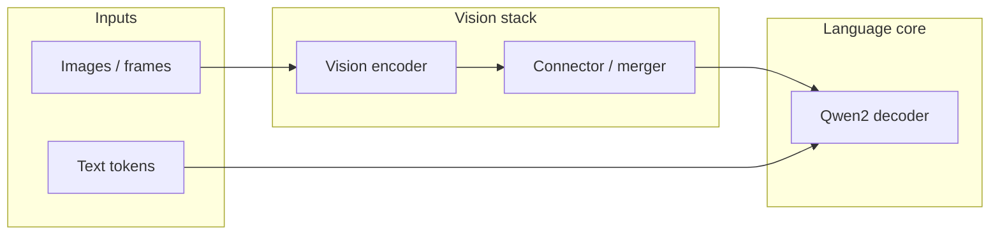

# Alibaba Qwen2-VL: The Open Multimodal Model Family You Missed

**If your news diet is mostly US labs, you are probably treating multimodal AI like a closed API feature—while Alibaba’s Qwen team keeps shipping open weights that cover the same workloads.** Qwen2 (the plain language stack) has been downloadable since June 2024 with 128K-class context on the mid-size and large instruct checkpoints, multilingual coverage, and MoE and dense variants sized for real production ladders. The missing piece was never “can Alibaba train a strong LLM?” It was “when does that backbone get native pixels and timelines instead of bolt-on CLIP-era encoders?”

That is the Qwen2-VL story—vision-language models built on top of Qwen2 instead of the older Qwen-VL pairing, aimed at documents, charts, long video, and agent-style control loops that need screenshots. Late August is when the public artifacts (weights, GitHub, and the long-form launch post) land together. This article is the field guide: what the family is optimizing for, how it differs from the [Llama 3.1](/blog/llama-3-1-405b-frontier-open-weights) moment, and where it fits next to GPT-4o-style omnis.

I care because multimodal automation is not a party trick—it is document pipelines, support consoles, compliance reviewers, and robotics-style tool loops. When those workloads run on weights you can host, the unit economics change the same way they changed when [Llama 3](/blog/meta-llama-3-open-weights-frontier) proved open text could chase the frontier.

---

## Table of Contents

1. [Why Multimodal Still Defaults to Closed APIs](#why-multimodal-still-defaults-to-closed-apis) — Structural reasons builders overweight GPT-4o and underweight open VL stacks
2. [What Qwen2 Already Proved in June](#what-qwen2-already-proved-in-june) — The language backbone you are probably already ignoring
3. [What Qwen2-VL Adds on Top](#what-qwen2-vl-adds-on-top) — Vision, video, and document paths that attach to that backbone
4. [How Qwen-VL and Qwen2-VL Differ](#how-qwen-vl-and-qwen2-vl-differ) — Encoder choices, training alignment, and why “VL refresh” is not a skin swap
5. [The Three-Tier Ladder You Should Plan For](#the-three-tier-ladder-you-should-plan-for) — Small, mid, and frontier-class checkpoints and where each wins
6. [Architecture Pattern: Encoder, Connector, LLM](#architecture-pattern-encoder-connector-llm) — Standard LVLM wiring and what usually breaks in production
7. [Dynamic Resolution and RoPE: Why They Matter](#dynamic-resolution-and-rope-why-they-matter) — Fixing the “everything is 224×224” failure mode
8. [Video Tokens and Memory: The Ops Story](#video-tokens-and-memory-the-ops-story) — Why long video is a sequence-length problem first
9. [Agent Loops and Screenshots](#agent-loops-and-screenshots) — Where VLMs stop being chat toys and start being controllers
10. [Open Weights vs GPT-4o-Class APIs: Trade Table](#open-weights-vs-gpt-4o-class-apis-trade-table) — Economics, latency, and governance in one view
11. [Integration Sketch: vLLM, Transformers, and Your Stack](#integration-sketch-vllm-transformers-and-your-stack) — Practical wiring notes without pretending your cluster is my cluster
12. [What I Am Doing This Week](#what-i-am-doing-this-week) — Checklist while the Hub pages finish settling
13. [FAQ](#faq)

---

## Why Multimodal Still Defaults to Closed APIs {#why-multimodal-still-defaults-to-closed-apis}

**Multimodal models are harder to run than text-only models, and closed APIs hide that pain behind someone else’s GPU bill—which makes them look “easier” even when they are more expensive at scale.** A single GPT-4o call that ingests an image feels like magic in a demo because OpenAI ate the preprocessing, batching, and autoscaling work. When you move the same workload to self-hosted weights, you inherit batch shapes, attention budgets, vision token inflation, and the reality that one high-res page scan can dwarf a paragraph of prose in VRAM.

The strategic mistake is assuming that difficulty equals “not ready.” It means **the integration layer matters more than the raw score on a leaderboard**. Alibaba’s Qwen line has repeatedly optimized for that integration path: permissive release patterns, checkpoints mirrored to Hugging Face and ModelScope, and a consistent instruct format that downstream toolmakers can target once.

If you are comparing against [GPT-4o’s omni positioning](/blog/gpt-4o-launch-openai-omni-model-free-tier) without also pricing Qwen-class open multimodal, you are comparing UX polish, not capability ceilings.

| Factor | Closed multimodal API | Open-weight VL stack |
| --- | --- | --- |
| Time-to-first-demo | Minutes | Hours to days |
| Unit cost at high volume | Per-token and per-image fees | Mostly fixed hardware + engineering |
| Customization | Prompting and a little fine-tuning | Full fine-tuning, LoRA, domain adapters |
| Data governance | Vendor policies | Your network boundary |
| Failure modes | Abstracted | You see OOMs and bad crops |

**The builder takeaway:** open multimodal is a capex and MLOps bet. If you are not willing to operate GPUs, you still want to know the open stack exists—because it sets the price ceiling on what API vendors can charge.

---

## What Qwen2 Already Proved in June {#what-qwen2-already-proved-in-june}

**Qwen2 is not a curiosity—it is a full ladder of base and instruct models that already includes dense sizes from sub-1B to 72B and a large MoE configuration, with documented 128K context behavior on selected instruct variants.** The June 2024 “Hello Qwen2” launch explicitly highlights five trained sizes—0.5B, 1.5B, 7B, 57B-A14B MoE, and 72B—plus broad multilingual training beyond English and Chinese, a move to Grouped-Query Attention across the board for cheaper inference, and a serious push on coding and math post-training.

That matters for Qwen2-VL because **multimodal quality is mostly language quality once the vision encoder is “good enough.”** Document QA fails when the LLM cannot follow instructions; video summarization fails when the model hallucinates temporal order. Shipping VL on top of Qwen2 is Alibaba betting that the upgraded tokenizer, alignment recipe, and long-context story are the right substrate for pixels—not whatever happened to be convenient when the original Qwen-VL shipped.

Practical implication for August: if you already prototyped Qwen2-7B-Instruct on text workflows, your agent prompts, JSON constraints, and tool schemas transfer far more cleanly to Qwen2-VL than to an unrelated VL checkpoint trained on an older text backbone.

---

## What Qwen2-VL Adds on Top {#what-qwen2-vl-adds-on-top}

**Qwen2-VL is the fusion checkpoint: Qwen2’s language model paired with a modern vision stack that handles heterogeneous image sizes, document screenshots, chart-heavy pages, and multi-minute video without pretending the world is a square thumbnail.** Alibaba’s public positioning for the family—rolled out in the same late-August window as the weights—emphasizes three workloads US teams obsess over in product rooms: sharp document OCR, long-horizon video QA, and operator-style control from screen observations.

None of that removes the need for evaluation on your data. It does mean **the “open alternative to GPT-4o on PDFs” narrative is finally anchored to a backbone that is not a generation behind on plain text**.

---

## How Qwen-VL and Qwen2-VL Differ {#how-qwen-vl-and-qwen2-vl-differ}

**Qwen-VL proved Alibaba could ship competitive open vision-language models early; Qwen2-VL is the reset that re-centers the LLM half on Qwen2’s training, alignment, and context-length story.** The older line inherited whatever tokenizer and post-training regime matched its era; Qwen2 moved the goalposts on multilingual coverage, attention efficiency, and long-context instruction following.

| Dimension | Qwen-VL era | Qwen2-VL era |
| --- | --- | --- |
| Text backbone | Earlier Qwen generation | Qwen2-trained LLM core |
| Instruction style | ChatML-era patterns | Updated Qwen2 instruct behaviors |
| Target workloads | Strong general VL | Docs + long video + agent screenshots |
| Release cadence | Established VL brand | Tied to Qwen2 umbrella |

**The blunt point:** if you wrote off “Chinese open VL” because a 2023 experiment felt flaky on your forms, the Qwen2-era refresh is a new evaluation event—not a patch note.

---

## The Three-Tier Ladder You Should Plan For {#the-three-tier-ladder-you-should-plan-for}

**Alibaba does not ship monoliths—it ships ladders. Expect a small on-device-class checkpoint, a mid “workhorse” model, and a frontier-tier checkpoint you will not casually quantize on a single consumer GPU.** That mirrors how Qwen2 itself launched: tiny models for edge experiments, 7B-class models for serious prototyping, and 72B-class models when quality—not cost—is the constraint.

| Tier | Typical role | Production sweet spot |
| --- | --- | --- |
| Small | Mobile, CPU+GPU hybrid demos, CI screenshots | High-volume, low-stakes extraction |
| Mid | Fleet processing, chat + attach, multilingual OCR | Most automation pipelines until CFO asks for margin |
| Frontier | Hard reasoning, tricky layouts, long video | When errors are expensive |

**Ops reality:** the mid tier usually wins for n8n-style automation because it is the largest model you can run with predictable latency on a finite GPU footprint. The frontier tier is the compliance-officer / analyst-copilot class workload.

---

## Architecture Pattern: Encoder, Connector, LLM {#architecture-pattern-encoder-connector-llm}

**Nearly every shipping LVLM is “ViT-family encoder → projector/connector → decoder LLM,” and Qwen2-VL is no exception—but the devil is how many visual tokens hit the decoder and how position information is represented.** Think of it as funneling a page image into a compressed sequence the LLM can attend over without blowing the context budget.



**What breaks first in production:** not “the model is dumb”—**token budgets**. A finance automation flow that happily runs 4K text tokens might fall over when a two-page scan becomes hundreds of visual tokens unless you batch, tile, or downsample deliberately.

---

## Dynamic Resolution and RoPE: Why They Matter {#dynamic-resolution-and-rope-why-they-matter}

**Fixed 224×224 thumbnails destroy structured data in real documents; dynamic tiling plus 2D position encoding is how open models claw back the detail API vendors brag about in demos.** The industry pattern Qwen2-VL leans into is naive dynamic resolution: admit more patches when the image needs them, pack them into a variable-length visual sequence, and teach the LLM to interpret that sequence with rotary-style positional structure rather than pretending every photo is the same grid.

| Approach | What you gain | What you pay |
| --- | --- | --- |
| Fixed small resize | Stable latency | Lost fine text |
| Naive dynamic tiling | Improved OCR and charts | Variable VRAM + tokens |
| Heavy preprocessing pipeline | Predictable caps | Engineering complexity |

**The builder move:** define a maximum visual token policy in your automation layer—similar to max output tokens—so an attacker cannot ship you a 12K×12K PNG and page-fault your cluster.

---

## Video Tokens and Memory: The Ops Story {#video-tokens-and-memory-the-ops-story}

**Long video is not magic; it is subsampled frames, temporal position encoding, and hard caps on how many visual tokens a clip may inject.** Teams that tried “just send the whole MP4” learned that LVLM context is still finite. Reasonable systems pre-sample FPS, chunk scenes, and summarize hierarchically—exactly the kind of glue n8n workflows are good at.

| Stage | Automation-friendly practice |
| --- | --- |
| Ingest | Normalize resolution; strip audio unless needed |
| Chunk | Scene or time-slice; parallelize summaries |
| Fuse | Let frontier-tier model merge chunk summaries |
| Store | Persist intermediate JSON—not giant tensors |

**Plain truth:** if you cannot chunk video, you do not have a video product—you have a demo waiting for an outage ticket.

---

## Agent Loops and Screenshots {#agent-loops-and-screenshots}

**The reason VLMs keep showing up in “agent” demos is that screens are the universal API for legacy software.** Typed coordinates, DOM snapshots, accessibility trees—each is brittle. Pixels lie less often than enterprise SAML configs, which is a depressing sentence but accurate.

For automation builders, **Qwen2-VL-class models matter when your tool loop needs to see**—not just read JSON. Think: internal admin panels, proprietary desktop apps, factory HMIs. You still need safety: human confirmation for destructive actions, trace logs, and sandboxed execution. The model is not the compliance layer.

---

## Open Weights vs GPT-4o-Class APIs: Trade Table {#open-weights-vs-gpt-4o-class-apis-trade-table}

**GPT-4o is the convergence product; Qwen2-VL is the sovereignty product. You pick based on who owns your failure modes.** I am not here to pretend one dominates every benchmark—August 2024 is too noisy for that. I am here to argue **portfolio diversification** matters when your CFO suddenly cares about inference line items.

| Question | API-first answer | Open-weight answer |
| --- | --- | --- |
| Fastest prototype | Yes | Only after GPU path works |
| Cheapest at 10⁹ tokens | Maybe not | Often yes if utilization > ~60% |
| Easiest security review | Sometimes | Depends on air-gap story |
| Best for exotic tuning | Limited | Strong |
| Best for “it just works” Friday night | API | Usually API |

**If you only remember one sentence:** treat Qwen2-VL like you treated Llama 3—a forced repricing of what multimodal “should cost” if you are willing to operate infrastructure.

---

## Integration Sketch: vLLM, Transformers, and Your Stack {#integration-sketch-vllm-transformers-and-your-stack}

**Assume Hugging Face Transformers for bring-up and vLLM (or equivalent) for throughput once shapes stabilize.** Your pipeline will look like: preprocess images to the model’s expected feature path, pack ChatML-style turns with vision placeholders, stream tokens to downstream consumers, and hard-cap concurrent multimodal requests so one oversized PDF cannot starve the queue.

Alibaba’s Hugging Face card recommends a `transformers` build that already registers `qwen2_vl` plus `qwen-vl-utils` for packing pixels. Skeleton (trimmed from the official README—pin versions in production):

```python
from transformers import Qwen2VLForConditionalGeneration, AutoProcessor
from qwen_vl_utils import process_vision_info

model_id = "Qwen/Qwen2-VL-7B-Instruct"

model = Qwen2VLForConditionalGeneration.from_pretrained(
    model_id, torch_dtype="auto", device_map="auto"
)
processor = AutoProcessor.from_pretrained(model_id)

messages = [
    {
        "role": "user",
        "content": [
            {"type": "image", "image": "file:///data/invoice.png"},
            {"type": "text", "text": 'Return JSON with keys vendor, date, total, line_items.'},
        ],
    }
]

text = processor.apply_chat_template(
    messages, tokenize=False, add_generation_prompt=True
)
image_inputs, video_inputs = process_vision_info(messages)
inputs = processor(
    text=[text],
    images=image_inputs,
    videos=video_inputs,
    padding=True,
    return_tensors="pt",
).to(model.device)

generated_ids = model.generate(**inputs, max_new_tokens=512)
trimmed = [out[len(inp) :] for inp, out in zip(inputs.input_ids, generated_ids)]
print(processor.batch_decode(trimmed, skip_special_tokens=True)[0])
```

**Why I still show code:** because “open weights” without a reproducible path is a press release. Pin versions, log prompts, cache images idempotently, and treat multimodal inference like any other high-risk RPC.

---

## What I Am Doing This Week {#what-i-am-doing-this-week}

**My checklist while the Qwen2-VL artifacts finish landing: mirror weights, run MY documents through the mid tier, measure tokens-per-page, then decide if frontier is worth the VRAM.** If you are building automation, skip benchmark Twitter until you have three real PDFs, two dashboard screenshots, and one screen recording that matter to a paying workflow.

Cross-reads if you want the broader open-weights summer context:

- [Llama 3.1 405B: GPT-4-class open weights](/blog/llama-3-1-405b-frontier-open-weights)
- [xAI Grok-1.5V multimodal preview](/blog/xai-grok-1-5v-multimodal-preview)
- [Mistral Codestral 22B—Europe’s coding model bet](/blog/mistral-codestral-22b-europe-coding-model)

---

## FAQ {#faq}

### Is Qwen2-VL “true” open source?

**It is best described as open-weights with published artifacts—weights and inference code on public hubs—not a full training replay you can recompile from scratch.** For most product teams, that is enough to fine-tune, host, and audit behavior on private data; it is not enough to replicate Alibaba’s data pipeline.

### How does Qwen2-VL compare to GPT-4o on multimodal tasks?

**GPT-4o still wins a lot of polished product UX and integrated tooling; Qwen2-VL’s purpose is to put a big fraction of that capability into a self-hosted envelope.** Your evaluation should be task-specific—forms, charts, handwriting, multilingual scans—not leaderboard anecdotes.

### What hardware do I need for the mid-tier checkpoint?

**Plan for a multi-GPU box or a single large accelerator if you insist on fp16; quantify with your own max image policy.** If someone quotes you a single number without your token cap and batch size, they are guessing.

### Can I use this in n8n or similar automation?

**Yes—treat the model as another inference HTTP endpoint with strict payload limits.** Put resizing, chunking, and retries in the workflow layer; do not let the model be the only fuse in your circuit.

### Is Chinese-origin weight governance a concern?

**It is a real procurement question for defense, finance, and HIPAA-class stacks—run legal review like any other vendor.** Technical openness does not automatically imply policy openness inside your org.

### Will dynamic resolution blow my budget?

**It can if you accept arbitrary user images without caps.** Fix maximum side lengths, tile count, and concurrent multimodal jobs the same way you cap LLM output tokens.

### Do I still need a separate OCR tool?

**Often no for clean modern PDFs; sometimes yes for fax-grade scans or rotated cams.** Keep Tesseract or a commercial OCR in your back pocket until your evals say otherwise.

### What is the single biggest mistake teams make when adopting VLMs?

**They benchmark on marketing slides instead of contractual PDFs.** Start ugly, automate boring, then chase flashy demos.

---

## Closing

**Multimodal is no longer a proprietary moat—it is an ops choice.** Qwen2-VL is the late-August reminder that open weights can cover pixels and timelines, not just tokens, if you are willing to run real infrastructure.

If you want help wiring vision-language models into production automation—queueing, guardrails, eval harnesses, and the n8n glue between them—**book an AI automation strategy call** and bring a nasty PDF from your actual backlog.

If you are planning a flagship web experience where multimodal copilots sit next to a premium front end, **start a custom website project** and we will make sure the UX matches the intelligence underneath.

---

*Tags: Qwen2-VL, Alibaba, open weights, multimodal AI, vision-language models, Hugging Face, Qwen2, August 2024*
