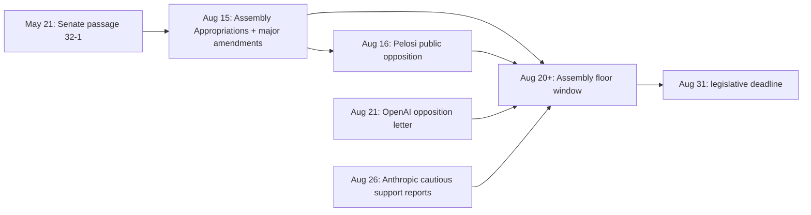

# California SB-1047 AI Safety Bill: The Industry Battle Over Frontier Model Regulation

**California’s SB-1047 is no longer an abstract ethics debate — it is a live legislative brawl over who bears legal responsibility when “frontier” foundation models scale past everyone’s red-team playbooks.** This week, the Capitol is racing the calendar: the bill must clear the Assembly by **August 31**, and the headlines are stacking faster than most teams can update their policy briefs. If you ship model-backed products, the fight is about your compliance surface area, your vendor contracts, and whether “reasonable care” becomes a phrase your general counsel memorizes.

I’m writing this on **August 30, 2024**, in the middle of that sprint. The Senate already sent SB-1047 forward. The Assembly Appropriations Committee advanced an amended package. National political figures have picked sides. Major labs have broken public ranks. The only honest frame is motion, not closure — anyone who tells you the “final shape” is settled is selling certainty the process has not finished delivering.

## What SB-1047 Is Trying to Regulate (and What It Ignores)

**SB-1047 targets a narrow slice of the AI stack: developers training or materially scaling the largest, most expensive models — not every SaaS wrapper, not every ChatGPT plugin, not every departmental RAG bot.**

The press materials and bill analysis circulating this month anchor “covered” systems to combinations of compute and spend that intentionally catch frontier pretraining while leaving ordinary commercial fine-tuning alone unless it crosses a new, explicit spend bar. Conceptually, the regime is “pre-deployment diligence + ongoing security + documentation + AG oversight,” not a universal license for Sacramento to micromanage prompt templates.

| Layer | Typical obligation under SB-1047 framing | Why builders care |
| --- | --- | --- |
| **Frontier pretraining** | Safety and security protocols, testing, cybersecurity, shutdown capability, recordkeeping | Determines whether your foundation vendor is carrying new CA exposure |
| **High-cost fine-tuning** | Coverage kicks in above a fine-tuning spend threshold (post-amendment framing emphasizes protecting smaller adapters) | Affects whether your customization triggers developer duties |
| **Downstream apps** | Largely outside the “developer of covered model” core | Less direct compliance, more second-order risk through model terms |

That narrow targeting is doing rhetorical work in Sacramento — and it is also why the fight is so intense. The bill is not “AI in general.” It is a laser on the handful of organizations whose checkpoints actually gate systemic risk in the scenarios safety researchers worry about: misuse for cyber offensive work, critical infrastructure pressure, and catastrophic misuse arcs that sound sci-fi until your threat model stops laughing.

## The Legislative Clock: Why Late August Feels Like a Tornado

**California’s legislative calendar is the hidden protagonist: an Assembly-pass deadline lands August 31, which means every amendment, op-ed, and letter to the governor is timed to pressure floor votes that are literally days away.**

The Senate’s bipartisan vote to pass SB-1047 came earlier in the session — 32–1 in May, per the author’s office — teeing up an Assembly process that always compresses the real bargaining into the final weeks. That May vote mattered symbolically (this is not a fringe proposal), but August is when industry coalitions actually mobilize because the text is concrete enough to model against revenue and risk.

If you are new to CA tech politics, the rhythm looks chaotic from outside: amendments drop, committees clear, bill texts lag on portals by a day or two, stakeholders argue from adjacent versions. From inside, it is coordinated chaos — every serious lobbyist knows the last session days are when language migrates fastest.

## The August 15 Amendments: What Actually Changed in Appropriations

**On August 15, Senator Wiener’s office announced that Assembly Appropriations advanced SB-1047 with a substantial rewrite shaped by months of industry, academic, and civil-society engagement — including shifting enforcement design and softening the most controversial punitive edge.**

The public summary from the author’s office is the cleanest checklist of what moved. These are not cosmetic tweaks; they change how nervous general counsels read the bill.

- **Criminal liability framing:** The package removes **perjury-linked criminal exposure** and leans on **civil** enforcement instead — a direct response to critics who warned prosecutors’ offices were a bad fit for fast-evolving ML release decisions.
- **Frontier Model Division:** The standalone **FMD** structure is out; proponents argue enforcement still runs through the Attorney General with some functions folded into existing government operations machinery rather than inventing a brand-new regulator from whole cloth.
- **Legal standard:** Developers’ attestation language shifts toward **“reasonable care”** — explicitly tied to common-law familiarity — rather than a “reasonable assurance” formulation opponents treated as arbitrarily strict.
- **Open-source-flavored fine-tuning carve-out:** A **$10 million** post-train spend threshold appears as a gate for whether fine-tuned models fall under coverage — aimed at carving out the long tail of adapters while preserving obligations for genuinely large derivative training runs.
- **Pre-harm enforcement:** The Attorney General’s ability to act **before** catastrophe manifests is **narrowed** — a pressure valve for companies that feared pre-enforcement lawsuits based on speculative harms.

The political read is straightforward: Wiener’s team is trying to hold the safety core (test, document, secure, be able to stop the bleeding) while stripping away the easy viral attacks about “throwing researchers in jail” or creating a duplicate federal AI bureaucracy in Sacramento.

## Battle Map: Who Is Lining Up Where (and Why That Split Matters)

**SB-1047 has become a fault line between “California should lead because Congress won’t” and “California is jumping the gun while DC is still drafting,” with heavyweight AI names on both sides.**

| Camp | Public anchors this month | Core argument |
| --- | --- | --- |
| **Safety + national-security framing** | Leading academic figures publicly backing the bill; retired national security voices cited in author materials | Frontier scale warrants duties; testing and cybersecurity are not optional luxuries |
| **Federal coordination skeptics** | Prominent House Democrats and Speaker Emerita Pelosi; academic warnings about ecosystem harm | Risk of patchwork, mis-calibrated rules, and discouraging California investment |
| **Large labs (mixed)** | Anthropic signaling **conditional** support after amendments; OpenAI surfacing opposition the same week | Competitive positioning meets genuine legal uncertainty |

That middle row — Pelosi’s office issuing an opposition statement on **August 16**, echoing concerns from members like Zoe Lofgren and citing Fei-Fei Li’s public warnings — is the sort of signal startup founders ignore at their peril. It does not predict a floor outcome by itself, but it frames Governor Gavin Newsom’s inbox if the bill reaches his desk: you do not want to be the product lead blindsided because you assumed “state politics” was Wiener’s problem alone.

## OpenAI’s Opposition and Wiener’s Counterpunch: A Federalism Stress Test

**OpenAI breaks its quiet stance this week with opposition framed around innovation, talent flight, and the primacy of federal law — and Wiener immediately fires back that the letter avoids engaging the bill’s operational requirements while recycling privacy-law fear tactics.**

The TechCrunch coverage timestamped **August 21** captures the dynamic: a major lab goes on record against SB-1047 while the author argues OpenAI has already committed to the kinds of evaluations the bill mandates. Wiener’s own **August 21** release leans hard on that juxtaposition — OpenAI not attacking specific safety mechanisms, but pushing the issue to Congress.

Whoever is “right” in the abstract, the builder-level takeaway is simpler: **your foundation model provider’s posture toward SB-1047 is now public diplomacy**, not just compliance policy. That affects enterprise procurement questionnaires almost overnight. Legal teams will ask vendors whether terms of service shift if California creates a private right of action landscape or new documentation duties.

## Anthropic’s “Cautious Support”: The Pivot That Reshapes Coalition Politics

**By August 26, reporting on Anthropic’s posture describes cautious support for an amended SB-1047 — not a clean endorsement, but enough to scramble the simplistic “labs vs Sacramento” narrative.**

Anthropic’s earlier critical feedback on prescriptive enforcement and pre-harm liability was loud enough to matter; the August Appropriations amendments are explicitly pitched as responses to that engagement. If you model interest groups like graph nodes, Anthropic’s move creates edges back toward Wiener’s graph that Meta-style opposition alone cannot isolate.

Practically, “cautious support” is the adult version of a letter of intent: it signals Anthropic believes the amended trajectory is directionally workable while preserving room to complain about **auditor relationships, Government Operations Agency guidance**, and residual enforcement paths. For customers, it is a clue that at least one major safety-conscious lab thinks diligence obligations can survive contact with real legal text — a North Star for internal policy teams wondering where Overton Window center sits.

## How This Connects to Federal Layering (EO 14110 and the Missing Congress)

**SB-1047’s proponents keep tying their script to President Biden’s October 2023 Executive Order on AI and Governor Newsom’s 2023 CA executive order — a deliberate story that this is scaffolding, not a rogue breakaway republic of random rules.**

Executive Order **14110** pushed NIST-shaped thinking, reporting triggers, and dual-use awareness into the federal bloodstream without replacing Congress’s absence on comprehensive AI statute. Wiener’s public messaging explicitly contrasts Congressional gridlock — the “no major tech regulation since floppy disks” riff — but federalist opponents counter with the House’s bipartisan AI task force narrative.

For operators, the layering looks like this in August 2024:

1. **Voluntary commitments** and White House process set norms for the largest labs.
2. **Drafting rooms in DC** still fight over preemption and risk tiers.
3. **California** tries to codify a “reasonable care” floor for the biggest models touching Californians.

None of those layers cleanly preempts the others today, which is why enterprise security teams hate the timeline — overlapping obligations without a single harmonized audit checklist.

## CalCompute, Whistleblowers, and the Innovation Bargain

**SB-1047 is not only sticks: CalCompute — a public compute cluster concept — plus whistleblower protections are the bill’s pitch that safety policy can redistribute access, not just restrict it.**

Supporters argue concentrated GPU moats are themselves a governance risk: if only incumbents can afford evaluations at frontier scale, evaluations become performative. Detractors argue state compute projects are easier to promise than to operationalize on timelines that matter for competitive AI markets.

I am not here to score the budget mechanics — appropriations fights have their own gravity. But strategically, CalCompute is the rebuttal to “this bill is pure Ludditism.” Whether that rebuttal survives contact with implementation is exactly the sort of question August chaos does not answer.

## The Builder’s Cheat Sheet: Questions to Ask Your Team Before September

**If SB-1047 passes as amended, legal uncertainty shifts from “if” to “how” — and your August homework is mapping dependency chains before procurement locks you into the wrong representations.**

Work through this checklist while the text is still stabilizing:

- **Vendor diligence:** Does your foundation provider publish pre-release risk assessments today? Will they attest under a “reasonable care” standard referencing NIST-aligned practices?
- **Fine-tune economics:** Are your internal LoRA or continued-pretraining budgets crossing the fine-tune threshold that triggers coverage? If yes, who signs the protocol?
- **Shutdown posture:** Does your deployment architecture assume always-on endpoints with zero kill switch? Regulators notice cultural opposition to halting models more than engineers expect.
- **Cross-border inference:** California’s jurisdictional hook is “doing business in California,” not headquarters ZIP codes — Wiener’s office has been explicit that relocation theater does not automatically shed obligations.

This is where my practice sits. I help teams wire **agents, eval harnesses, and operational guardrails** that survive legal and security review — not slide-deck AI. If your compliance group suddenly wants logging parity between your Claude tool-calling routes and your internal risk dashboards, that is alignment work, not buzzword theater.

## “Reasonable Care,” NIST, and Why Lawyers Suddenly Love Footnotes

**The Appropriations rewrite pushes SB-1047 toward negligence-language—“reasonable care” with room to reference prevailing industry practice and NIST-flavored risk management — which matters because it tells courts and regulators how to measure breach without micromanaging weight matrices.**

The point is not that Yoshua Bengio’s Fortune column or Geoffrey Hinton’s quotes magically bless the text. It is that **common-law standards drag in expert testimony, third-party auditors, and benchmarking against peer labs**. If your safety memo cites NIST AI RMF categories while your infra team disables logging on production agents, that tension becomes discoverable in a hurry.

| Document / standard family | Role in likely compliance narratives |
| --- | --- |
| **NIST AI Risk Management Framework (AI RMF)** | Vocabulary for identifying, measuring, and mitigating AI risks — easy for counsel to cite in “reasonable care” memos |
| **Voluntary White House commitments (2023–2024)** | Precedent that frontier labs already pledged evaluation steps SB-1047 tries to harden |
| **Developer-authored safety protocols** | Frontline artifacts AG offices will request in civil enforcement scenarios |

None of that is legal advice — it is engineering realism. Policy text becomes operational when **your CI pipeline, eval notebooks, and incident runbooks** can show continuous alignment to whatever protocol you published. SB-1047 is forcing that fantasy into Gantt charts.

## A Week-in-August Timeline (High-Signal Events Only)

**If you skim one visualization, make it a timeline — coalition shifts in AI regulation are path-dependent, and late August 2024 is a steep part of the curve.**

The diagram compresses drama into arrows, but the intuition holds: **committee clearance and national political statements land adjacent days**, which is how you get whiplash reading tech Twitter alongside LegiScan diffs.

## Counterarguments Worth Taking Seriously (Even If You Want the Bill)

**Good-faith opposition is not only “selfish labs afraid of lawyers” — it includes genuine worries about regulatory duplication, chilling open-weight release dynamics, and chilling hiring narratives that become self-fulfilling.**

- **Innovation geography:** Labs threaten relocation less as literal exit and more as **cap table storytelling** — investors price regulatory uncertainty into term sheets before anyone moves a HQ plaque.
- **Open research:** Hard thresholds can still miss exotic continuation-training recipes; **interpretive gray zones** push risk-averse orgs to hoard weights regardless of legislative intent.
- **Enforcement asymmetry:** Civil liability concentrated in the Attorney General’s office means **political turnover rewrites appetite** — startups should model enforcement variance, not just median outcomes.

Engaging those points makes you a better builder-advocate than quote-tweeting dunks. I still think frontier-scale models deserve duties stricter than blog disclaimers; I also think pretending away implementation friction is how policy loses technologists permanently.

## What Remains Unresolved as August 30 Closes

**The honest end-state for this post is uncertainty: floor votes, potential further amendments, and executive review are still live.**

I am not going to narrate outcomes that have not happened by the publication date — that would break the temporal frame this site uses for backfilled news commentary. What is knowable is the shape of the fight: amended core duties, narrowed enforcement, heavyweight political opposition, at least one major lab publicly opposed, another cautiously supportive, and a calendar forcing decisions before lawmakers scatter.

## Frequently Asked Questions

### What is California SB-1047 in one sentence?

**SB-1047 is California’s proposal to impose “reasonable care” safety, security, testing, and documentation duties on developers of the largest (frontier-scale) AI models, with Attorney General enforcement and whistleblower protections — plus a public compute access narrative via CalCompute.** It is aimed at pretraining-scale systems, not every AI product.

### Does SB-1047 criminalize AI researchers?

**The August 15 amendment package removes the prior perjury-linked criminal framing in favor of civil enforcement, according to the author’s published summary.** That shift responded directly to viral critiques about researcher prosecutions — though civil liability can still sting.

### Who publicly supports SB-1047 right now?

**The author’s office cites major academic figures like Geoffrey Hinton and Yoshua Bengio, newer industry voices such as Notion’s Simon Last in op-ed pages, and Anthropic signaling cautious support after amendments.** Coalitions can shift daily during deadline week — treat endorsements as timestamped.

### Why did OpenAI oppose SB-1047 in August 2024?

**OpenAI’s public letter frames federal primacy and warns about chilling innovation and talent movement — while Wiener argues the letter does not rebut the specific testing and shutdown mechanisms.** It is a classic federalism vs. state laboratory fight supercharged by national press.

### What triggered Pelosi’s August 16 opposition?

**Speaker Emerita Pelosi’s statement calls SB-1047 well-intentioned but ill-informed, points to House Democrats’ ongoing AI task force work, and highlights concerns from Zoe Lofgren and California representatives who wrote Governor Newsom.** That is a signal to executive-branch moderates, not just legislators.

### How does SB-1047 relate to the White House AI Executive Order?

**Proponents argue SB-1047 codifies and extends themes from EO 14110 for the biggest models serving Californians, filling gaps while Congress debates.** Opponents argue state standards risk conflicting with eventual federal harmonization.

### What is the fine-tuning threshold everyone is quoting?

**After Appropriations amendments, models fine-tuned below roughly $10 million in relevant spend fall outside coverage, insulating typical adapter work from developer obligations.** Large derivative trainers should model their spend honestly — rounding errors in compliance are still errors.

### What should startups do this week?

**Map whether you touch covered developer duties directly or only via API vendors, ask your providers for their SB-1047 stance in writing, and align your internal risk logs with whatever “reasonable care” documentation standard your counsel adopts.** If you are nowhere near frontier spend, track the debate for precedent value anyway — today's “frontier” definition is a moving compute-cost curve.

---

Hot takes age poorly when they pretend to be statutes. SB-1047 in late August 2024 is a case study in how fast “safety” becomes operational: not Philosophers Guild debates, but **AG enforcement theories, third-party audits starting in 2026 in circulated drafts, and private ordering among labs racing to shape text before summer recess**.

If you are building production AI systems and want help turning policy chaos into **eval coverage, automation pipelines, and documentation that legal can sign**, you should [**book an AI automation strategy call**](https://williamspurlock.com/contact). Bring your architecture diagram and your grumpy security officer — I work where code and liability meet.

### Related reading

- [AI Safety and Regulation: The July 2024 Landscape](/blog/ai-safety-regulation-july-2024) — broader governance context the month before SB-1047 hit peak drama
- [AI Coding Assistants July 2024 Comparison](/blog/ai-coding-assistants-july-2024-comparison) — how frontier access patterns flow into developer tooling teams should monitor
- [Cursor Raises $60M Series A at $400M Valuation](/blog/cursor-series-a-anysphere-2024) — why California remains ground zero for AI capital and talent fights that regulation inevitably targets

### Sources and further reading (August 2024 snapshot)

Press releases and statements referenced for timing and amendment specifics include Senator Wiener’s office materials on **Senate passage (May 21, 2024)**, **Assembly Appropriations advancement and amendments (August 15, 2024)**, **response to OpenAI (August 21, 2024)**, Speaker Emerita **Pelosi’s August 16, 2024** statement, and contemporaneous reporting such as **TechCrunch (August 21, 2024)** on OpenAI’s opposition; secondary summaries on **Anthropic’s amended-bill posture** circulated by **August 26, 2024**. Always verify against the current enrolled bill text on the California Legislature’s official portal when making legal decisions.
