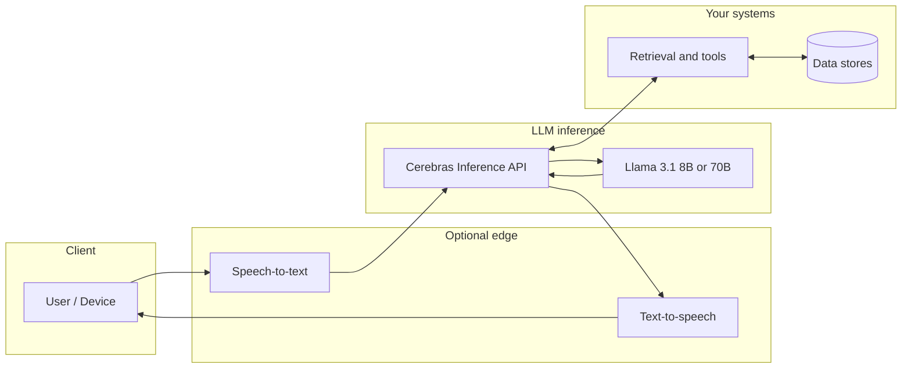

# Cerebras Inference Launch: Llama 3.1 at 1,800+ tok/s (8B) and 450+ tok/s (70B)

**Yesterday, August 27, 2024, Cerebras announced Cerebras Inference — a hosted API built on the same CS-3 systems and Wafer Scale Engine 3 (WSE-3) silicon the company already ships for training.** The headline throughput numbers are explicit in Cerebras' own press release: **1,800 tokens per second for Llama 3.1 8B** and **450 tokens per second for Llama 3.1 70B**, with third-party benchmark shop Artificial Analysis publicly quoting **above 1,800 output tokens per second** on 8B and **above 446 output tokens per second** on 70B.

If you are sizing an agent stack, a voice product, or any workflow that burns through long completions, those figures are not academic. They set a new public bar for how quickly an open-weight Llama-class model can stream tokens in production — at least for the configurations Cerebras and Artificial Analysis are measuring.

This piece is a builder-first read: what shipped, where the numbers come from, what the pricing claims are, and how I think about wiring something this fast into real systems.

---

## What shipped: Cerebras Inference in one paragraph

**Cerebras Inference is a managed inference service backed by CS-3 clusters, launching with Meta's Llama 3.1 8B and 70B in the mix.** The company positions it as the "fastest AI inference solution in the world" in its [August 27, 2024 press release](https://www.cerebras.ai/press-release/cerebras-launches-the-worlds-fastest-ai-inference), and it exposes an **OpenAI Chat Completions–compatible API** so existing clients can migrate without a rewrite.

The go-to-market story has three tiers (Free, Developer, Enterprise) and public per-token pricing for the two launch models on the developer track. Behind the marketing is the same hardware thesis Cerebras has repeated for years: **massive on-wafer memory bandwidth** as the lever that matters more than raw FLOPS for transformer inference.

---

## Throughput: separate the 8B headline from the 70B headline

**Do not conflate the models — the 1,800+ token-per-second class figures apply to Llama 3.1 8B; the 70B figure is ~450 tokens per second in Cerebras' own announcement language.**

| Claim | Model | Figure | Primary source |
|-------|-------|--------|----------------|
| Delivered throughput (vendor statement) | Llama 3.1 8B | 1,800 tokens/s | Cerebras press release, Aug 27, 2024 |
| Delivered throughput (vendor statement) | Llama 3.1 70B | 450 tokens/s | Same press release |
| Measured output speed (benchmark org) | Llama 3.1 8B | Above 1,800 output tok/s | Micah Hill-Smith (CEO, Artificial Analysis), quoted in same release |
| Measured output speed (benchmark org) | Llama 3.1 70B | Above 446 output tok/s | Same quote |

Cerebras also states the offering is **"20 times faster than NVIDIA GPU-based solutions in hyperscale clouds"** for these workloads — that is a vendor comparison, and the press release footnotes that **"performance comparisons are based on third-party benchmarking or internal testing"** with observed improvements varying by workload and configuration.

When you read hot takes on social feeds, people often grab the biggest number and elide which model it belongs to. For honest capacity planning, keep the table above next to your architecture notes.

---

## Why wafer-scale SRAM shows up in an inference launch at all

**Transformer decoding is memory-bandwidth bound long before it is "math bound," and Cerebras' pitch is that a dinner-plate-scale WSE-3 die packs enough high-bandwidth on-chip memory to keep weights and activations moving without behaving like a traditional GPU + HBM topology.**

The August 27 press release claims **"7,000x more memory bandwidth than the Nvidia H100"** for the WSE-3 — that is a vendor comparison, not an independent lab result, but it explains the mechanism story: Cerebras is not asking you to fall in love with core counts; it is asking you to believe **memory movement is the bottleneck** and that wafer-scale integration changes the shape of that bottleneck.

For builders, the practical translation is simpler:

- **Higher tokens per second** on long generations often correlates with **how little time you spend waiting on KV cache and layer activations** to shuffle through a narrow memory path.
- **Batching and multi-tenant contention** still matter — peak hero numbers rarely equal what you see on your worst-case tenant mix.

I treat the CS-3 numbers the same way I treat any cloud GPU benchmark: **bind them to a specific model revision, precision story, concurrent load assumptions, and third-party methodology before you bake them into an SLA.**

---

## Precision story: 16-bit end-to-end (per Cerebras)

**Cerebras says it stays in 16-bit for the full inference run, explicitly contrasting that path with approaches that trade accuracy for speed via aggressive quantization.**

Artificial Analysis' quoted validation in the same press release is worth filing under "things to track for RAG and code pipelines": they state Llama 3.1 8B and 70B on Cerebras Inference show **quality evaluation results in line with native 16-bit precision per Meta's official versions**.

If you have ever watched an 8-bit or 4-bit deployment eat a structured extraction task alive, you know why this matters. The throughput headline is useless if your JSON schema stops parsing.

---

## Pricing as announced (Developer tier)

**Cerebras lists pay-as-you-go pricing of 10 cents per million tokens for Llama 3.1 8B and 60 cents per million tokens for Llama 3.1 70B on the Developer tier**, per the August 27 press release. The Free tier is described as including **API access with generous usage limits** after login; Enterprise covers private cloud, on-prem, SLAs, and custom models.

| Tier | What Cerebras says it is for |
|------|------------------------------|
| **Free** | Logged-in API access; free tier with generous limits |
| **Developer** | Serverless API; 8B @ $0.10/M tok, 70B @ $0.60/M tok at launch |
| **Enterprise** | Fine-tuned models, SLAs, private Cerebras cloud or customer premise |

Always verify live pricing on-console before you quote it in a client proposal — inference SKUs move quickly, and blog posts age.

---

## API shape: OpenAI Chat Completions compatibility

**Cerebras Inference exposes an OpenAI Chat Completions–compatible HTTP API**, which means your existing Python or TypeScript clients that target `chat.completions.create` style endpoints are close to drop-in compatible.

That is a strategic play: the marginal cost of trying Cerebras on a branch is low because you are not rewriting your tool-calling scaffolding from scratch. For agent frameworks that already speak OpenAI, you can often swap base URL + model name and start comparing **latency, throughput, and tool-call reliability** on identical prompts.

One integration note from the market chatter around launch: third-party posts from Artificial Analysis mention an **8K context window** on the service at introduction versus the **128K** context the Llama 3.1 series supports in Meta's cards — if you are building long-context RAG, read the current docs before you assume native 128K.

---

## Ecosystem signal: who gets quoted, and what it implies

**Cerebras stacks launch quotes from Artificial Analysis, DeepLearning.AI, LiveKit, Perplexity, Meter, and enterprise voices like GSK** — the through-line is **agentic loops, voice stacks, and answer-engine latency**.

That lines up with how I think about inference economics this summer:

- **Agent workflows** burn tokens in bursts; **time-to-next-action** dominates perceived intelligence more than MMLU deltas.
- **Voice and video copilots** stack STT + LLM + TTS; shaving the LLM leg changes whether the product feels "real-time" or "walkie-talkie delay."

None of that requires you to pick Cerebras — but it explains why inference stopped being a footnote to training press releases.

---

## Competitive framing (without pretending silicon is religion)

**Groq, GPU clouds, and other ASIC paths all publish their own hero charts; the honest builder move is to benchmark on your prompts with your batch shape.**

Cerebras' launch narrative targets **NVIDIA GPU clouds** as the comparison point for both speed and **price-performance**, including a claimed **"100x higher price-performance for AI workloads"** alongside the 20× speed figure. Treat those as **hypotheses to test**, not laws of physics — your workload might be dominated by prefill, tool I/O, retrieval, or safety classifiers instead of decode throughput.

If you want parallel reading on how open-weights Llama fits the 2024 frontier, see my earlier take on [Llama 3.1 405B and the open-weights shift](/blog/llama-3-1-405b-frontier-open-weights) and the foundation story in [Meta Llama 3 8B + 70B](/blog/meta-llama-3-open-weights-frontier).

---

## Mermaid sketch: where inference sits in a product stack

If the LLM box shrinks horizontally in wall-clock time, the whole graph breathes — especially for **multi-hop agents** that would otherwise feel sluggish.

---

## What I would measure before I trust hero numbers in production

**Run five fixed scenarios: short QA, long summarization, JSON tool call, multi-turn dialog, and worst-case batch mix.**

| Measurement | Why it matters |
|-------------|----------------|
| Time to first token (TTFT) | Drives perceived snappiness in chat |
| Steady-state tokens/s after warm-up | What Cerebras/AA headline figures approximate |
| Error rate on structured outputs | Quantization / numerics issues show up here first |
| Cost per successful task | Tokens per successful tool round-trip, not raw tokens |
| P99 under load | Hero numbers rarely survive noisy neighbors |

Artificial Analysis focuses on **output speed** in its quoted figures — sensible for decode-heavy workloads — but your product might be **prefill-heavy** if users paste huge documents. Benchmark accordingly.

---

## Context for the LLM market this week

**Llama 3.1 already reshaped what "open weights" means in July; Cerebras is now bidding to make Llama inference feel closer to a utility than a batch job.**

The strategic point is not "buy wafer-scale or go home." It is that **inference is finally getting the same benchmarking attention training got** — which is overdue, because most end-user value touches inference, not training.

If you are stacking this against reasoning models instead of chat models, see [OpenAI o1 preview and the reasoning tax](/blog/openai-o1-preview-reasoning-launch): faster decode does not magically fix test-time compute strategies, but it changes how many refinement steps you can hide inside a single user-visible latency budget.

---

## Practical integration checklist (August 2024)

1. **Confirm model IDs, context limits, and rate limits** in the live Cerebras console — do not trust a blog for SLA details.
2. **Mirror prompts** from your incumbent provider; diff latency and quality on *your* eval set, not MMLU leaderboards.
3. **Instrument tool calls**: if you use JSON-mode or function calls, verify schema conformance at speed; some stacks regress before raw chat quality does.
4. **Cost model** against dollars per successful outcome, including retries — cheap tokens that hallucinate are expensive tokens.
5. **Fallback path**: keep a second provider warm if you are running customer-facing SLAs; ASIC inference capacity is still a young market.

---

## Risks, limitations, and honest skepticism

**Peak tok/s is one axis; governance, data residency, capacity, and ecosystem maturity are others.**

- Vendor comparisons to **"hyperscale GPU clouds"** aggregate many SKUs; your baseline might be a tuned dedicated cluster, not a vanilla API.
- **Hero throughput** may not translate to your **batch concurrency** or **KV cache footprint** if prompts are long or sessions fan out.
- **Context window** and **fine-tuned weights** policies may differ by tier — re-read enterprise docs if you need on-prem or regulated deployment.

The right mindset is **empirical**: let the measurements insult your assumptions.

---

## FAQ

### How many tokens per second does Cerebras Inference achieve on Llama 3.1 70B at launch?

**Cerebras states 450 tokens per second for Llama 3.1 70B in its August 27, 2024 press release; Artificial Analysis quotes above 446 output tokens per second for the same model class in the same announcement.**

### How many tokens per second does Cerebras Inference achieve on Llama 3.1 8B at launch?

**Cerebras states 1,800 tokens per second for Llama 3.1 8B; Artificial Analysis quotes above 1,800 output tokens per second on Llama 3.1 8B.**

### Is Cerebras Inference faster than NVIDIA GPU solutions?

**Cerebras claims it is "20 times faster than NVIDIA GPU-based solutions in hyperscale clouds" for these workloads**, per its press release, with the caveat that real deltas vary by configuration and workload.

### What does Cerebras say about precision and quantization?

**Cerebras advertises staying in the 16-bit domain for the entire inference run** and contrasts that with approaches that sacrifice accuracy for speed; Artificial Analysis is quoted verifying **16-bit-quality alignment** with Meta's official Llama 3.1 builds.

### What is the public API compatibility story?

**The service exposes an OpenAI Chat Completions–compatible API**, per Cerebras' August 27, 2024 materials — migration is pitched as a base-URL swap plus model selection.

### What are the launch list prices for developer inference?

**Cerebras lists $0.10 per million tokens for Llama 3.1 8B and $0.60 per million tokens for Llama 3.1 70B** on the Developer tier in the same press release.

### What hardware powers Cerebras Inference?

**CS-3 systems with Wafer Scale Engine 3 (WSE-3)** — Cerebras positions WSE-3 memory bandwidth as the centerpiece of its inference story.

### Does faster inference automatically make agents smarter?

**No — it shortens wall-clock loops**, which can let you run more tool calls or refinement steps inside the same user-visible latency, but reasoning quality still depends on model, prompts, and scaffolding.

### Where should I read the primary sources?

**Start with Cerebras' official [August 27, 2024 press release](https://www.cerebras.ai/press-release/cerebras-launches-the-worlds-fastest-ai-inference)** and cross-check benchmark methodology with **Artificial Analysis** as cited there.

---

## Closing: speed is a feature, but your eval suite is the product

**Cerebras Inference is a credible attempt to make Llama 3.1 inference feel instant by hardware standards — with numbers on the record from both Cerebras and Artificial Analysis.**

If you are building AI-native workflows — agents, retrieval pipelines, voice products, or growth systems that chain LLM steps — the interesting question is not who wins a benchmark chart this week. It is whether you can convert throughput into **shorter user wait times**, **cheaper successful outcomes**, and **cleaner tool graphs** without blowing up safety or data governance.

If you want help turning fast models into **production automation** (n8n, MCP, eval harnesses, multi-provider failover) or you need a **flagship web experience** that presents AI products without feeling like a generic chat wrapper, **[book a call with me](https://williamspurlock.com/contact)** — that is where I spend most of my time right now.

### Related reading

- *[Llama 3.1 405B: The Day GPT-4-Class Became Free for Builders](/blog/llama-3-1-405b-frontier-open-weights)* — the July open-weights inflection that makes fast inference economically relevant.
- *[Meta Llama 3 8B + 70B: The First Frontier-Grade Open Weights From a US Lab](/blog/meta-llama-3-open-weights-frontier)* — baseline context on the Llama lineage Cerebras is serving.
- *[OpenAI o1 Preview: Reasoning Models and the "Think Longer" Tax](/blog/openai-o1-preview-reasoning-launch)* — how reasoning stacks change latency budgets next to fast chat inference.

---

*Primary throughput and pricing figures in this article are sourced from Cerebras Systems' press release dated August 27, 2024 ("Cerebras Launches the World's Fastest AI Inference"), including quoted remarks attributed to Artificial Analysis. See the press release for vendor disclaimers on comparative performance.*
