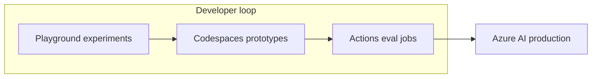

# GitHub Models Public Preview: OpenAI, Anthropic, and Mistral Inside GitHub

**GitHub just put frontier LLMs—OpenAI’s GPT-4o family, Mistral’s Large 2, Meta’s Llama 3.1, and Microsoft’s Phi-3—inside the same surface where you already manage repos, with a free playground, a Codespaces-shaped dev path, and Azure as the production door.** Yesterday’s [Introducing GitHub Models](https://github.blog/news-insights/product-news/introducing-github-models/) post (August 1, 2024) frames it bluntly: more than 100 million developers should be able to learn, compare, and ship model-backed software without losing the thread of their Git workflow.

**GitHub calls this a *limited public beta*, not general availability**—expect waitlists, SKU churn, and sharp edges. The strategic bet is still obvious: if your org already centralizes code on GitHub, anchoring **model experiments** there is much stickier than spinning up yet another LLM sandbox SaaS.

Below: first-wave models, how OpenAI and Mistral show up, where Anthropic sits outside the launch footnotes, and a pragmatic rollout sequence.

## What actually launched on August 1, 2024?

**GitHub Models is a new model playground plus integration path tied to GitHub accounts, starting as a limited public beta with explicit first-wave model names.** The announcement’s own roster is worth quoting tightly because it is easy to over-read:

| Named capability | Examples from GitHub’s post |
| --- | --- |
| OpenAI via Azure | **GPT-4o**, **GPT-4o mini** |
| Mistral | **Mistral Large 2** |
| Meta | **Llama 3.1** |
| Microsoft | **Phi-3** |

GitHub also stresses **Meta, Mistral, Azure OpenAI Service, Microsoft, and others** as the supplier mix behind private and open weights—language that matters if you are modeling lock-in risk.

Nothing in that first post promises every frontier lab on day one. **Anthropic is not listed among those named launch partners.** That does *not* mean GitHub is “anti‑Claude”; it means **GitHub Models v0 is explicitly anchored on the Azure + GitHub distribution channel that Microsoft can ship fastest**, with Mistral and Meta in the same shopping aisle. For Anthropic, **triangulate from three live facts**: Copilot’s chat lineup (still moving), bring-your-own Anthropic keys in Actions/Codespaces, and GitHub’s promise of more models on the road to GA.

## Why this is bigger than “yet another playground”

**GitHub Models tries to shorten the loop from *prompt toy* to *production contract* without making you rebuild identity, billing, and governance from scratch.**

The narrative GitHub is selling has three beats:

1. **Play** — tune prompts, temperature, and system instructions in a built-in playground **for free** (as pitched this week).
2. **Prototype** — lift patterns into **GitHub Codespaces** with sample inference code so you are not fighting laptop CUDA drift.
3. **Ship** — exchange the GitHub token path for **Azure AI** credentials when you need enterprise controls, regional availability, and provisioned throughput—GitHub cites **25+ Azure regions** for some models.

That ladder matters for teams who already treat GitHub orgs as the trust boundary. You are not asking security to bless a dozen random SaaS sandboxes; you are asking them to extend a policy they already half-own.

Privacy wording is crisp: **GitHub says prompts and outputs are not shared with model providers and are not used to train or improve those models**—still verify the latest docs before you paste regulated data.

## OpenAI inside GitHub: GPT-4o is the headline

**If you care about multimodal latency and a single flagship model that “does it all” in mid‑2024, GPT‑4o is the obvious GitHub Models star.**

GitHub’s own positioning mirrors what we are seeing in production: Mistral gets the “fast and cheap” superlative in their post, while **GPT‑4o is the multimodal workhorse** for audio, vision, and text in one conversational interface. For app builders, that split is how I mentally sort routes:

| Goal | Model bias (Aug 2024 framing) |
| --- | --- |
| Voice + vision + text UX | GPT‑4o |
| Tight latency / cost-sensitive fanout | Mistral Large 2 |
| Open weights + self-host story downstream | Llama 3.1 |
| Small, local-ish baselines | Phi‑3 |

None of that is a benchmark thesis—it is portfolio design. The win GitHub offers is **side-by-side evaluation inside your org culture**, not a leaderboard screenshot.

## Mistral inside GitHub: European strategy without leaving GitHub’s gravity

**Mistral Large 2 showing up in the first-wave list is a quiet acknowledgement that “OpenAI-or-bust” is not a serious enterprise default anymore.**

Mistral has spent 2024 owning the “fast, EU-credible option” lane. Surfacing **Large 2** beside GPT‑4o is GitHub admitting **multi-vendor inference is table stakes**, not a stretch goal—especially for teams that need an auditor-facing supplier story without leaving Microsoft’s orbit.

## Anthropic inside GitHub: read the org chart, not the press release

**In August 2024, Anthropic is not named in GitHub Models’ launch partner bullet list—but Anthropic is still one third of the “serious foundation model triangle” every full-stack team compares: OpenAI, Anthropic, Mistral.**

**Copilot** (chat, completions, [Workspace](/blog/github-copilot-workspace-technical-preview) orchestration) and **GitHub Models** (catalog + playground for *apps that call APIs*) are different layers—normal platform split, not a conspiracy. Teams that need **Claude today** still lean on Anthropic keys inside Actions/Codespaces or whatever Copilot allows on their SKU; GitHub Models’ first wave **does not replace** that—it standardizes the OpenAI/Mistral/Meta routes Microsoft can contract *now*.

Picture three lines into the same city: **OpenAI** and **Mistral** pull into the new GitHub Models station immediately; **Anthropic** is still entering via Copilot evolution, Azure maps, or direct API—not the August 1 footnotes.

## How GitHub wires Models into the rest of the toolchain

**GitHub is not launching a chat bubble in isolation; it is tying Models to Codespaces, the GitHub CLI, Actions, Copilot Extensions, and Azure.**

Concrete moves called out this week:

- **Codespaces** — sample inference flows so your prototype matches CI, not just your laptop.
- **GitHub CLI** — prompt eval workflows via JSON fixtures piped through a Models command (think golden-file testing for LLM behavior).
- **GitHub Copilot Extensions** — build vertical tools that call your chosen model route when the extension protocol allows.
- **Azure handoff** — swap personal access tokens for subscription credentials when security needs keys vault-side.

That diagram is how I sell the feature to engineering managers: **one narrative arc from “is this prompt sane?” to “is this prompt *deployed under policy*?”**

## Competitive context: Copilot, Cursor, and the editor wars

**GitHub Models does not replace a purpose-built AI editor; it complements the repository as system of record.**

Cursor and other AI-native editors still win when the task is aggressive multi-file refactors with local embedding indexes and composer-style rewiring—see my [July 2024 assistant comparison](/blog/ai-coding-assistants-july-2024-comparison) for the blunt scorecard. GitHub’s countermove is *distribution*: every enterprise that standardized on GitHub Enterprise Cloud now gets a sanctioned place to audition GPT‑4o beside Mistral without opening a brand-new procurement fight.

The timing sits one month before hype season reboots. Cursor’s funding velocity is real ([I covered the Series A here](/blog/cursor-series-a-anysphere-2024)), and GitHub’s answer is predictably platform-shaped: **meet developers where their artifacts already live.**

If you are choosing stacks this quarter, the decision is not “Cursor *or* GitHub”; it is **which layer owns model governance**—editor, repo host, cloud, or all three redundantly (welcome to 2024).

## What I would do this week on a real product team

**Treat GitHub Models as an eval and onboarding layer, not as your long-term inference monopoly.**

1. Stand up a private org sandbox, assign owners, and log who can mint tokens.
2. Build ten representative prompts from production failure logs—RAG augments, tool-calling stubs, guardrail tests—not vanity chat prompts.
3. Run GPT‑4o vs. Mistral Large 2 on latency, cost, and qualitative rubrics; snapshot scores in-repo Markdown so the audit trail is reviewable.
4. Wire the winning prompts into a Codespace template your juniors can launch in one click.
5. Only then negotiate Azure production SKUs—knowing which model family actually earns the spend.

If you skip step three, you will pay for the wrong SKU.

## Frequently asked questions

### What is GitHub Models in one sentence?

**GitHub Models is GitHub’s limited public beta for experimenting with hosted large language models—including GPT‑4o, Mistral Large 2, Llama 3.1, and Phi‑3—inside GitHub with a path toward Azure production.**

### Is GitHub Models the same as GitHub Copilot?

**No—Copilot is the pair programmer; GitHub Models is a model catalog and playground aimed at *building apps* that call models, with Codespaces and Azure exits.**

### Which OpenAI models are named at launch?

**GitHub’s August 1 post names GPT‑4o and GPT‑4o mini via Azure OpenAI Service.**

### Does GitHub Models include Anthropic Claude on day one?

**The launch post does not name Anthropic among the first-wave partners; expect Claude through other GitHub surfaces or your own Anthropic integration until GitHub expands the catalog.**

### What about Mistral?

**Mistral Large 2 is explicitly listed as part of the initial playground roster.**

### How does privacy work?

**GitHub states prompts and outputs in GitHub Models are not shared with model providers or used to train them—verify current docs before handing sensitive payloads.**

### How do I move from playground to production?

**GitHub describes swapping GitHub tokens for Azure AI credentials when you need enterprise controls and regional deployments.**

### Can I automate evaluations?

**Yes—the GitHub CLI workflow pitched this week is designed to pipe JSON fixtures through model calls for repeatable eval passes.**

## Closing

**GitHub Models is Microsoft betting it can monetize “AI engineer minutes” the way it monetized compute: own the graph where code lives, own eval muscle memory, own the Azure ramp.**

If you want automations, eval harnesses, or agents wired cleanly—not another roadmap PDF—book an [AI automation strategy call](/contact) and I’ll map GitHub Models, Copilot, and your orchestration layer into one spine you can actually ship.

---

### Related reading

- [GitHub Copilot Workspace: Technical Preview](/blog/github-copilot-workspace-technical-preview)
- [Cursor Raises $60M Series A](/blog/cursor-series-a-anysphere-2024)
- [AI Coding Assistants Compared (July 2024)](/blog/ai-coding-assistants-july-2024-comparison)
