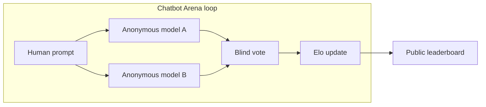

# Grok-2 + Grok-2 Mini Beta: The "Sus-Column-R" Model That Beat Claude 3.5 Sonnet on LMSYS

**Yesterday xAI published the Grok-2 rollout**, and the industry finally got a name for one of the weirdest leaderboard handles of the summer: **`sus-column-r` is an early Grok-2 build**, tested on the public [Chatbot Arena](https://lmarena.ai/) (the benchmark site long linked from LMSYS) under that anonymized column label. In xAI's own wording at launch, that Arena entry **was outperforming both Claude 3.5 Sonnet and GPT-4 Turbo on overall Elo at the time of their post**—while simultaneously shipping **Grok-2 mini** beside the full model and promising **enterprise API access later this month**.

This piece is not a victory lap for any one vendor. It is a builder's map of **what just changed**, **what the Arena actually measures**, and **where the PR headline diverges from the benchmark spreadsheet** xAI published in the same document—all written from where we stand **today**, mid-August 2024.

| Claim (source) | What it is really saying |
|----------------|--------------------------|
| xAI on Chatbot Arena Elo ([Grok-2 beta post](https://x.ai/news/grok-2), Aug 13, 2024) | Early Grok-2 (**sus-column-r**) led **overall Arena Elo** vs **Claude 3.5 Sonnet** and **GPT-4 Turbo** *at publication time* |
| xAI benchmark table (same post) | **Static evals** on GPQA, MMLU, coding, vision, etc.—often **not identical** ordering vs Arena preference |
| Product reality (same post) | **Grok-2** and **Grok-2 mini** in beta on **𝕏** for premium tiers; **API** described as coming later in August |

---

## Table of Contents

1. [The Headline: sus-column-r Unmasked as Grok-2](#the-headline-sus-column-r-unmasked-as-grok-2)
2. [What LMSYS Chatbot Arena Measures (and What It Does Not)](#what-lmsys-chatbot-arena-measures-and-what-it-does-not)
3. [xAI's Exact Arena Claims—Quoted and Scoped](#xais-exact-arena-claimsquoted-and-scoped)
4. [The Spreadsheet Story: Where Grok-2 Leads and Where It Trails](#the-spreadsheet-story-where-grok-2-leads-and-where-it-trails)
5. [Grok-2 mini: The Small Model whose Scores Punch Above Grok-1.5](#grok-2-mini-the-small-model-whose-scores-punch-above-grok-15)
6. [Product Rollout: 𝕏 Premium, Real-Time Feed, and the Coming API](#product-rollout-𝕏-premium-real-time-feed-and-the-coming-api)
7. [FLUX.1 and the Multimodal Roadmap Tease](#flux1-and-the-multimodal-roadmap-tease)
8. [What This Means for Production LLM Choice Right Now](#what-this-means-for-production-llm-choice-right-now)
9. [Governance, Eval Hygiene, and the Speed of Anonymized Arena Entries](#governance-eval-hygiene-and-the-speed-of-anonymized-arena-entries)
10. [FAQ](#faq)

---

## The Headline: sus-column-r Unmasked as Grok-2

**The punchline is official now:** xAI states plainly that an **early version of Grok-2** entered the LMSYS-linked **Chatbot Arena** labeled **`sus-column-r`**, and that—**at the time of their August 13 announcement**—it was **ahead of both Claude 3.5 Sonnet and GPT-4 Turbo on overall Elo**.

That single sentence is doing an enormous amount of narrative work on 𝕏 this week, so I am going to separate three layers people keep smearing together:

1. **Identity** — the anonymous **`sus-column-r`** column is **not** a random open-weight curiosity; xAI identifies it as **early Grok-2**.
2. **Metric** — **Arena Elo** is derived from **human preference in blind side-by-side chat** on the public leaderboard—not from a single reproducible academic script you can run in your own VPC.
3. **Time** — xAI ties the claim to **the moment of the post**. Leaderboards move when new models ship and when vote volume shifts. Treat snapshots as **snapshots**.

If you have been watching the Arena chatter this summer, the name finally explains why the column felt "too strong to be a hoax but too weird to be marketing-friendly." **`sus-column-r`** was simply **early Grok-2 playing by Arena anonymity rules**.

---

## What LMSYS Chatbot Arena Measures (and What It Does Not)

**Chatbot Arena (LMArena)** is the benchmark xAI points to when it links LMSYS and **overall Elo**. The high-level mechanics, stable for years and central to how builders should read this story:

| Layer | What happens | Why builders care |
|-------|----------------|-------------------|
| **Collection** | Humans chat with two anonymous models side-by-side | Captures **messy, open-ended prompts** closer to product reality than multiple-choice suites |
| **Scoring** | Wins, losses, and ties feed **Elo-style** updates | Produces a **global ordering** that is easy to quote—and easy to misread |
| **Blindness** | Model names are hidden during voting | Reduces **brand halo** but introduces **presentation variance** (length, formatting, confidence tone) |

**What Arena does not guarantee:**

- **Ground-truth factuality** — users reward **helpful, fluent** answers; correctness is not independently adjudicated in the vote.
- **Task-specific mastery** — a model can dominate broad chat **Elo** while losing narrowly on your internal coding eval or legal-RAG harness.
- **Stable ranking forever** — every major release from OpenAI, Anthropic, Google, Meta, Mistral, and xAI reshapes vote mixtures.

So when someone says **"Grok-2 beat Claude 3.5 Sonnet on LMSYS,"** the precise translation is: **"On Chatbot Arena's open-ended preference tournament, xAI reports that its early Grok-2 listing led Claude 3.5 Sonnet on overall Elo at their publication time."** That is a meaningful signal. It is **not** a substitute for **your** evaluation suite.

---

## xAI's Exact Arena Claims—Quoted and Scoped

**I am not paraphrasing the competitive claim beyond what xAI wrote.** Their [Grok-2 beta announcement](https://x.ai/news/grok-2) (dated **August 13, 2024**) includes at least two tightly related statements:

- They introduced an early Grok-2 version into Chatbot Arena **under the name `sus-column-r`**.
- **"At the time of this blog post,"** that entry **"is outperforming both Claude 3.5 Sonnet and GPT-4-Turbo"** on the **LMSYS leaderboard** framing they use alongside Arena.

They also summarize the same point in adjacent copy: early Grok-2 **outperforms both Claude and GPT-4 on the LMSYS leaderboard in terms of its overall Elo score**—again, **their** snapshot language paired with **their** graphs.

**What I am deliberately not doing:**

- Fabricating **exact Elo integers**—xAI shows charts in the post, but unless I transcribe pixels, the honest citation is **their qualitative snapshot + your live leaderboard check**.
- Claiming **permanent** superiority—**"at the time of this blog post"** is doing real legal and scientific work.

If you are shipping **today**, open Arena, filter to the categories you care about, and read **confidence intervals** if the UI exposes them. The PR story starts with xAI's claim; **the production story ends on your telemetry**.

---

## The Spreadsheet Story: Where Grok-2 Leads and Where It Trails

**The same xAI post that celebrates Arena Elo also publishes a wide benchmark table** comparing **Grok-1.5**, **Grok-2 mini**, **Grok-2**, **GPT-4 Turbo**, **Claude 3 Opus**, **Gemini Pro 1.5**, **Llama 3 405B**, **GPT-4o**, and **Claude 3.5 Sonnet**. Footnotes matter:

- **GPT-4 Turbo** and **GPT-4o** scores are attributed to **May 2024** releases.
- **Claude 3 Opus** and **Claude 3.5 Sonnet** scores are attributed to **June 2024** releases.
- Several Grok-2 family numbers are marked as evaluated with **0-shot chain-of-thought** on specific suites.

**Bold, fact-backed takeaway:** **Arena Elo and static benchmarks are correlated—but not identical.** Examples taken **directly from xAI's published table** (rounded to one decimal where shown):

| Benchmark (xAI table) | Grok-2 | Claude 3.5 Sonnet | Who leads (per xAI Aug 2024 post) |
|-----------------------|--------|-------------------|-----------------------------------|
| **GPQA** | 56.0% | **59.6%** | Claude 3.5 Sonnet |
| **MMLU** | **87.5%** | 88.3% | Claude slightly (0.8 pp) |
| **MMLU-Pro** | 75.5% | **76.1%** | Claude 3.5 Sonnet |
| **MATH** | **76.1%** | 71.1% | Grok-2 |
| **HumanEval** | 88.4% | **92.0%** | Claude 3.5 Sonnet |
| **MMMU** | 66.1% | **68.3%** | Claude 3.5 Sonnet |
| **MathVista** | **69.0%** | 67.7% | Grok-2 |
| **DocVQA** | 93.6% | **95.2%** | Claude 3.5 Sonnet |

**How to read that without losing your mind:**

- **Grok-2** is **not** "behind everywhere"—it is **ahead on MATH and MathVista** in xAI's posted numbers **right now**.
- **Claude 3.5 Sonnet** still wins several **code, vision reasoning, and document QA** cells in the same table.
- **GPT-4o** cells matter too—xAI positions against the whole frontier, not Anthropic alone.

This is why I tell founders to run **three lanes of eval**: **Arena-style preference panels** (cheap, noisy, fast signal), **static suites** (reproducible, narrow), and **online metrics** (revenue, task success, support tickets).

---

## Grok-2 mini: The Small Model whose Scores Punch Above Grok-1.5

**Grok-2 mini is the other half of the beta story**—a **smaller sibling** xAI positions as **speed–quality balanced**, while still showing large jumps vs **Grok-1.5** on the published grid.

Again using **only** what xAI prints in their comparison table:

| Benchmark | Grok-1.5 | Grok-2 mini | Delta (mini vs 1.5) |
|-----------|----------|-------------|---------------------|
| **MMLU** | 81.3% | **86.2%** | +4.9 pp |
| **MMLU-Pro** | 51.0% | **72.0%** | +21.0 pp |
| **MATH** | 50.6% | **73.0%** | +22.4 pp |
| **HumanEval** | 74.1% | **85.7%** | +11.6 pp |

**Operational translation for teams:**

- **mini** is your candidate when **latency and cost curves** dominate—think **high-volume routing**, **first-pass triage**, and **parallel fan-out** where you might promote only a fraction of threads to **full Grok-2**.
- **full Grok-2** remains the default for **hard single-shot reasoning** workloads where the table gaps vs mini are widest—xAI's own numbers show **mini** sitting between **1.5** and **2** across most rows.

I still want **third-party reproduction** before I bake **mini** into safety-critical pipelines, but **directionally**, xAI is telling a coherent story: **the small model is not an afterthought**—it is a **coverage SKU** aimed at the same 𝕏 surface area where latency matters.

---

## Product Rollout: 𝕏 Premium, Real-Time Feed, and the Coming API

**If you are not a researcher, the shipping path matters more than the Elo gossip.**

Per xAI's same announcement:

- **Availability:** **Grok-2** and **Grok-2 mini** land in **beta** on **𝕏** for **Premium** and **Premium+** subscribers (with an app update requirement spelled out in their post).
- **Differentiation:** **Grok-2** is described as **state-of-the-art** for **text + vision**, with **real-time 𝕏 information** wired into the product experience—**platform context** is part of the capability story, not an afterthought.
- **API:** xAI states both models will hit their **enterprise API platform later this month**, with **multi-region inference**, **mandatory MFA**, traffic analytics, and **management APIs** for billing/teams—**newsletter signup** is their call-to-action gate.

**For builders, the strategic read is:**

- **Consumer funnel** first (𝕏 tiers), **B2B plumbing** second (enterprise API).
- **Real-time feed access** is a **feature and a risk surface**—great for **breaking events**, dangerous for **treating chat as ground truth** without corroboration.

If your automation stack is **n8n / MCP / custom agents**, watch the **API pricing page** like a hawk once it drops—**latency tiering**, **tool-use schemas**, and **vision endpoints** will determine whether Grok-2 is a **router candidate** or a **specialist node**.

---

## FLUX.1 and the Multimodal Roadmap Tease

**xAI also names Black Forest Labs and FLUX.1** as part of the **on-platform image experimentation** story for Grok on 𝕏.

**What is new vs last season?**

- Earlier xAI work ([my Grok-1.5V preview rundown](/blog/xai-grok-1-5v-multimodal-preview)) focused on **vision understanding** benchmarks as the company chased multimodality.
- **This week's post** adds an **image-generation partnership thread** alongside **text+vision** assistant behavior—signaling that **creative tooling** is now part of Grok's **consumer retention** loop, not just chat scores.

**Roadmap cue:** xAI says a **preview of multimodal understanding** will become **core** to Grok on 𝕏 and API **soon**—language is forward-looking, so treat it as a **tease**, not a contract.

---

## What This Means for Production LLM Choice Right Now

**If you run production agents today, Grok-2's Arena story updates the "known unknown" list—it does not replace your harness.**

| Decision | Recommendation |
|----------|----------------|
| **Shortlisting models** | Add **Grok-2** to **side-by-side** panels where **general chat quality** drives retention; validate **coding** separately because **HumanEval** still favors **Claude 3.5 Sonnet** in xAI's own table |
| **Cost routing** | Pilot **Grok-2 mini** as a **fast acceptor/rejector** in multi-stage flows; measure **escalation rate** to full Grok-2 or another vendor |
| **Data policy** | Treat **𝕏-linked real-time context** as **untrusted user-supplied atmosphere**—great for **trend surfing**, risky for **compliance-grade claims** |
| **Eval cadence** | Re-run internal suites **weekly** this quarter—**August 2024** is a **knife fight** shipping cadence window |

If you want a **Claude-first automation pattern** while this shakes out, my **[n8n + Claude 3.5 Sonnet agent tutorial](/blog/n8n-claude-3-5-sonnet-production-agent-tutorial)** is still the conservative production baseline—**swap the model string** when your evals say so, not when the leaderboard meme cycle says so.

---

## Governance, Eval Hygiene, and the Speed of Anonymized Arena Entries

**The sus-column-r episode is a governance lesson, not just marketing.**

- **Anonymized Arena entries** let vendors test **candidate stacks** without immediately attaching brand risk—when unmasked, the **reputation shock** is concentrated.
- **Snapshot language** ("at the time of this blog post") is your reminder to **timestamp every benchmark screenshot** you put in board decks.
- **Mixing Arena and academic claims** without translation is how PMs accidentally **mislead execs**—your job is to **label the metric family**.

If you are the person who owns **model governance**, codify a rule: **no single leaderboard rules a buy decision** unless it matches **your task profile** and **your failure-cost curve**.

---

## FAQ

### What is `sus-column-r`?

**`sus-column-r` was the anonymized Chatbot Arena label for an early Grok-2 build**, according to xAI's **August 13, 2024** Grok-2 beta post. The name was a **leaderboard column**, not a separate foundation model product.

### Did Grok-2 beat Claude 3.5 Sonnet on LMSYS?

**xAI reports that at the time of their August 13, 2024 announcement, their early Grok-2 Arena entry outranked Claude 3.5 Sonnet and GPT-4 Turbo on overall Chatbot Arena Elo**—check the live leaderboard for today’s numbers because Elo moves with vote traffic and new releases.

### Is Chatbot Arena the same as academic benchmarks?

**No.** Arena Elo reflects **human preference** on **open-ended prompts**, while suites like **MMLU** or **HumanEval** are **scripted evaluations** with fixed datasets; xAI's own post shows **different ordering** across those families versus Arena claims.

### How does Grok-2 compare to Claude 3.5 Sonnet on xAI's published table?

**It depends on the row—e.g., xAI lists Grok-2 ahead on MATH and MathVista but Claude 3.5 Sonnet ahead on GPQA, HumanEval, MMMU, and DocVQA in their August 2024 chart**, using the footnoted model vintages they specify.

### When can developers use Grok-2 and Grok-2 mini via API?

**xAI states both models will arrive on their enterprise API platform later in August 2024**, with signup via their API newsletter; treat exact clock time as **vendor-scheduled**, not promised here.

### What is Grok-2 mini for?

**Grok-2 mini is pitched as a smaller, faster sibling** with substantially higher scores than Grok-1.5 across the benchmarks xAI publishes—**a practical latency tier**, not just a discount sticker.

### Does Grok-2 include vision?

**Yes—xAI describes Grok-2 as text + vision** on 𝕏 in this announcement, and points to **near-term multimodal previews** expanding further.

### Why does xAI mention FLUX.1?

**They point to collaboration with Black Forest Labs around FLUX.1** as part of expanding **image-related capabilities** inside Grok on 𝕏—separate from the core LLM benchmark table.

### Should I drop Claude 3.5 Sonnet from production today?

**No automatic switch—re-run your coding, tool-use, and retrieval evals**; xAI's own numbers still show **Claude 3.5 Sonnet** winning multiple rows you likely care about in agents, even while **Arena Elo** favors Grok-2 in xAI's snapshot.

### Where can I read xAI's primary source?

**Start at their official post:** [https://x.ai/news/grok-2](https://x.ai/news/grok-2) **(August 13, 2024)**—every competitive and benchmark claim in this article that is not general methodology traces back there.

---

## Closing

**Grok-2 and Grok-2 mini are the clearest signal yet that xAI intends to compete as a full-stack frontier lab—not only on 𝕏 mindshare, but on the LMSYS leaderboard columns engineers actually watch.** I am treating **sus-column-r** as a solved mystery with a real competitive footprint: **preference tournaments and static evals now agree that Grok-2 belongs in the frontier conversation**, even when they disagree on **which column should win your internal harness**.

If you are racing to ship **agents, retrieval pipelines, or multimodal products** and want help turning leaderboard noise into **repeatable eval + routing architecture**, **[book a strategy call](https://cal.com/williamspurlock/ai)** and bring your traces—I will help you **wire the models that survive contact with production**.

**Related reading:**

- [xAI Grok-1.5V Multimodal Preview](/blog/xai-grok-1-5v-multimodal-preview) — How xAI framed vision benchmarks before this Grok-2 leap
- [n8n + Claude 3.5 Sonnet Production Agent Tutorial](/blog/n8n-claude-3-5-sonnet-production-agent-tutorial) — A conservative agent baseline you can A/B against Grok-2 at API launch
- [GPT-4o mini Launch: Cost Collapse](/blog/gpt-4o-mini-launch-cost-collapse) — Why **small-model tiers** like Grok-2 mini matter for routing economics in mid-2024
