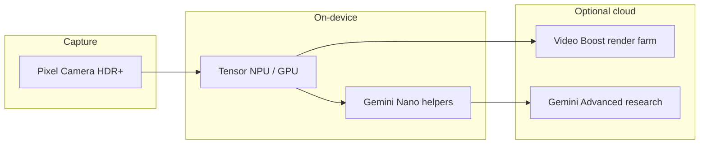

# Made by Google 2024: Pixel 9, Gemini Integration, and Pixel Studio Explained

**Google’s Made by Google 2024 keynote is underway in Mountain View, with hardware shipping earlier in the year than usual — and with Gemini, not legacy Assistant, positioned as the default intelligence layer on new Pixel phones.** Today I’m tracking the Pixel 9 family, Tensor G4, the on-device generative stack (including Pixel Studio and Imagen 3), and the consumer rollout of Gemini Live across Pixel and partner Android devices.

This year’s story is not “another phone refresh.” It is Google arguing it can own the full stack: custom silicon, on-device models, cloud Gemini, and Android distribution — without routing core experiences through third-party assistants or app silos. Whether that claim holds in day-to-day use is a product question; whether it resets developer and partner incentives is already answerable: **default assistant real estate, on-device generation APIs, and cross-device Gemini surfaces are now first-class platform bets.**

| Thread | What Google is signaling |
|--------|---------------------------|
| **Silicon** | Tensor G4 + DeepMind co-design; Gemini Nano multimodality |
| **UX** | Gemini as default assistant; Gemini Live as conversational modality |
| **Creation** | Pixel Studio + on-device Imagen 3; Magic Editor generative controls |
| **Ecosystem** | Pixel Watch 3, Buds Pro 2 with Tensor A1 / Gemini Live |

## What just happened at Made by Google 2024?

**The headline is a synchronized drop: new Pixel 9 models (including a refreshed foldable), wearables, and earbuds — each threaded to Gemini and Tensor-branded compute.** Rick Osterloh frames the Pixel 9 series as the **first phones designed for the Gemini era**, Sameer Samat emphasizes **rebuilding Android with AI at the core**, and the demos lean on end-to-end Google ownership (camera, on-device models, cloud research loops) rather than stitching together OEM-specific vendor AI.

Compared to prior Made by Google installments, timing lands roughly **two months earlier** in the calendar than the typical fall cadence — which reads as competitive positioning against Apple’s September window and a desire to **ship holiday inventory with Gemini Live and Tensor G4 narrative fully baked**. For builders, the more durable signal is **assistant defaults migrating off Assistant-branded UX and onto Gemini surfaces**, with Live interactions treated as a peer modality to typed prompts — including camera sharing in conversation as Project Astra-era capabilities start landing in consumer software.

## From Google I/O demos to Made by Google products: what graduated?

**Several storylines seeded in May at [Google I/O 2024](/blog/google-io-2024-ai-count-project-astra) resurface today as SKUs you can preorder — not slide-deck fiction.** The distinction matters for anyone burned by “coming soon” AI: hardware events force commit dates, carrier QA, and retail training.

| May 2024 (I/O) theme | August 2024 (Made by Google) packaging |
|----------------------|---------------------------------------|
| **Project Astra multimodal assistant** | **Gemini Live** with camera-in-session consumer positioning |
| **Gemini app momentum** | **Gemini as default Pixel 9 assistant** + cross-OEM Live rollout |
| **Long-context / research narratives** | **Research with Gemini** + continuous research loops teased for Gemini Advanced |
| **Imagen 3 as creative moat** | **Pixel Studio** on-device Imagen 3 user experience |

This table is not a literal feature mapping — Google marketing threads arcs across quarters. It is a **dependency graph for expectations**: if you bet product strategy on “Google will never ship multimodal live AI broadly,” today’s lineup weakens that assumption. If you bet on “Pixel is a niche sales slice; Android fragmentation will blunt Gemini,” **Samsung and Motorola on the same keynote slide** complicates the dismissal.

Samsung’s presence on a Pixel stage is unusual — and it previews a world where **Gemini distribution is explicitly multi-OEM**, not merely “available in Play.” If you maintain Android SDKs, expect **more variance in default assistants, preloads, and long-press gestures** across carriers even as Google controls the Pixel reference implementation.

## Pixel 9 lineup and pricing: the snapshot

**Google announces four smartphone tiers today — Pixel 9, Pixel 9 Pro, Pixel 9 Pro XL, and Pixel 9 Pro Fold — with pricing that pushes the foldable near premium laptop territory and keeps the base Pixel 9 as the volume SKU.** These figures matter for two reasons: they set consumer expectations before iPhone season, and they signal how aggressively Google is subsidizing (or not subsidizing) on-device AI through bill-of-materials spend on Tensor G4, thermals, and camera silicon.

| Model | Starting price (US, as announced) | Positioning notes |
|-------|-----------------------------------|-------------------|
| **Pixel 9** | **$799** | Entry “Gemini-first” phone; flagship feature subset |
| **Pixel 9 Pro** | **$999** | Compact Pro option Google says customers asked for |
| **Pixel 9 Pro XL** | **$1,099** | Large Pro; photography / video marketing focus |
| **Pixel 9 Pro Fold** | **$1,799** | Foldable refresh; “tablet + phone” story |

Google’s retail story today also includes **32 launch countries** for the Pixel 9 series (per live reporting from today’s event coverage) — meaningful for developers because **Play feature availability, SafetyNet / hardware attestation behaviors, and on-device model deployment** often track regional SKU and certification timelines. The **original Pixel Fold** is marked **no longer available** on the Google Store as the Pro Fold takes that slot, which usually shifts repair parts and test-device inventories for teams that standardized on the first foldable’s aspect ratios.

The **Pixel 9 series launches on Android 14** (explicitly noted in event-day reporting). That matters for API surfaces you might depend on: **short-term, you are still building against Android 14 behavior + Google’s Gemini app / system service integration**, not a mythical “Android 15-only” baseline. If you ship camera-adjacent or screenshot-search tooling, treat **Android 14 + Tensor G4** as the compatibility slice to validate first.

## Tensor G4 and Gemini Nano: what changed on the silicon

**Tensor G4 is positioned as the chip that lets Gemini Nano do more on-phone — including multimodal Nano — with Google citing DeepMind collaboration and a vapor-chamber thermal story for sustained performance.** On stage, Google claims **Gemini Nano on Pixel 9 is roughly three times more capable than the first Pixel 8 Pro–era Nano** (marketing language, not a standardized benchmark — but directionally it tells you they want buyers to equate “new phone” with “new on-device model generation,” not just faster CPUs).

For engineering teams, the practical decoding is simpler:

- **On-device inference headroom** affects latency for screenshot indexing, call transcription, weather copy generation, and in-camera ML — all features Google tie explicitly to **Tensor + Nano** in today’s announcements.
- **Multimodal Nano** implies the phone is carrying **vision + text (and related modalities) in a single on-device package** rather than splitting workloads across disconnected tiny models. That typically improves **routing simplicity** (one runtime to integrate) at the cost of **binary size, RAM footprint, and thermal budget**.
- **Fingerprint stack**: Google claims an **ultrasonic fingerprint sensor ~50% faster** on the new devices — a minor UX bullet that still affects UX research panels and conversion on secure flows.

Google also touts **2× durability vs Pixel 8** alongside a **“sculpted” industrial design** — not an AI metric, but relevant if you run **field beta programs** where device fragility skews telemetry.

| Layer | Builder-relevant implication |
|-------|------------------------------|
| **Nano multimodal** | More client-side pre-processing before cloud calls |
| **Thermals (vapor chamber)** | Longer sustained inference for video / batch jobs |
| **Tensor ↔ cloud Gemini** | Hybrid workflows become default product assumption |

## Gemini as default assistant and Gemini Live on Android

**On Pixel 9, Gemini is the default assistant as Google begins rolling Gemini Live wider across Android — including Samsung and Motorola devices shown in today’s narrative, not only Pixels.** That single product decision is larger than any one hardware spec: it moves **search, routines, and voice escalation** onto the Gemini product surface, and it reframes Google’s competitiveness against **Siri, ChatGPT voice modes, and OEM-branded assistants** as a fight over **default invocation**, not just model quality.

What Gemini Live adds in positioning (from today’s event framing):

- **Voice-first “work through something complex”** — Google is explicitly pitching conversation as the right UI for messy, multi-step problems rather than tap-heavy Settings flows.
- **Camera-in-conversation ties to the Project Astra arc** — share what the camera sees while you talk; the assistant reasons about live video context (consumer packaging of capabilities teased at [Google I/O 2024](/blog/google-io-2024-ai-count-project-astra)).
- **10 synthetic voices named after constellations** — a small detail, but it maps to **brand differentiation** and perceived personality, which matters for consumer retention studies.
- **Extensions for Live** — Google discusses extending Live with app integrations similar to the broader Gemini Extensions story; demos today reportedly hit friction in places (calendar/tasks), which is a useful reminder that **agentic demos ≠ agentic reliability** on day one.

Rollout language today points to **Gemini Live starting to reach Pixel, Samsung, and other Android phones now** — phrasing that matters for **QA matrices**. If you maintain Android apps that hook assistant intents or rely on **Assistant Shortcuts / voice invocation**, you should plan a regression pass against **Gemini as the default handler** on Pixel 9 retail images as soon as they hit your lab bench.

## Pixel Studio: on-device Imagen 3 and the generative image workflow

**Pixel Studio is Google’s new on-device generative image experience powered by Imagen 3 — meaning some image creation and editing can run without round-tripping every prompt to a cloud GPU.** That distinction matters for **latency, offline scenarios, and privacy narratives**, especially for user-generated content workflows where enterprises fear unstructured data leaving the device.

Pixel Studio lands adjacent to (not instead of) the broader **Gemini / cloud generation** story you see in AI Studio and Workspace. The consumer pitch today ties Pixel Studio directly to **Imagen 3 branding on hardware**, which signals Google’s roadmap:

- **Creative workflows move toward hybrid execution** — local for speed + privacy-sensitive drafts, cloud for highest fidelity or multi-modal reasoning chains.
- **Google continues to pair foundation-model branding (Imagen)** with **Tensor silicon** so retail buyers can repeat a simple sentence: *the model lives on the phone*.

For teams building **mobile creative tools**, the competitive read is blunt: **Platform vendors will bundle credible on-device diffusion / editing** into the default gallery pipeline. Differentiation shifts to **control nets, brand-safe fine-tunes, collaborative editing, asset management, and cross-platform sync** — not “we added a generator button.”

| Question | Practical answer (today’s framing) |
|----------|-----------------------------------|
| **Offline vs cloud** | Expect hybrid; marketing emphasizes on-device Imagen 3 |
| **Safety / policy** | Same moderation debates as cloud tools; device execution doesn’t remove responsibility |
| **API access** | Consumer app first; developer surfaces follow platform precedent |

## Camera stack, Magic Editor, and “computed video” claims

**Google leads with photography credibility today — HDR+ pipeline rebuild, Night Sight panoramas, and generative edits in Magic Editor — plus a Video Boost / Night Sight video story that leans on Tensor hardware plus cloud acceleration for faster renders.** Event coverage notes Google citing third-party accolades positioning Pixel as **“best smartphone for photography”** and highest-tier smartphone video; treat those labels as **marketing-reported scores**, not lab benchmarks, but they signal where Google invests compute.

Concrete camera / editor beats worth tracking:

- **HDR+ rebuilt** for skin tone and texture fidelity — the kind of change that affects **computational RAW pipelines** and third-party camera apps that piggyback on OEM processing.
- **Magic Editor gains generative moves**: reframing subjects and **“Reimagine”** prompt-driven background / scene alterations — effectively **user-authored inpainting** on top of Photos infrastructure.
- **Video Boost with Night Sight video**: Google claims **brighter, more detailed night video** and **~2× faster rendering** by leveraging **Tensor chips in the cloud** for parts of the workload — an honest acknowledgment that **some “phone video” features are hybrid jobs**, not pure on-device FFmpeg filters.

If you run **UGC moderation** or **content authenticity** programs, Magic Editor’s generative additions are the user-facing wedge for **synthetic imagery inside personal libraries**. That increases the importance of **C2PA / metadata / watermark strategies** in any product that ingests user photos verbatim.

## Pixel 9 Pro Fold, "Add Me," and cover-screen character moments

**The Pro Fold narrative today is iterative polish: Google presents it as a mainstream foldable that learned from earlier hinge and aspect-ratio mistakes, priced at $1,799, with cover-screen software tricks aimed at families and social proof.** Event demos include **“Add Me”** — AR-guided group photo stitching so the photographer can jump into the frame after the fact — and **“Made You Look,”** which animates characters on the **cover display** as a kid-magnet / party trick.

For AR and CV teams, Add Me is less about “magic” and more about **meshing depth cues with generative fill** under time pressure: consumers will judge it on **hairline seams and lighting continuity**, the same places inpainting historically fails.

| Experience | What to stress-test as a developer |
|-----------|-------------------------------------|
| **Add Me** | Permission prompts for camera + motion; GPU thermal throttling mid-capture |
| **Made You Look** | Battery draw on ambient cover display; burn-in mitigations |
| **Fold multitasking** | Resume stacks when users bounce camera ↔ Sheets ↔ Live |

If you ship **social camera apps**, assume **Google Photos + Camera** swallow casual users; your wedge is **creator controls**, **RAW flexibility**, or **live streaming** — not another “group selfie fixer.”

## Pixel Screenshots, Call Notes, Pixel Weather, and “Research with Gemini”

**Side features today are arguably the blueprint for how Google wants Nano to feel invisible: fast screenshot search, call recording + transcription, AI-flavored weather copy, and long-form research that terminates in Workspace exports.** None of these are “model releases” in the OpenAI/Anthropic sense — they are **integration releases**, the category that actually changes daily Android UX.

- **Pixel Screenshots**: Google credits **Tensor G4 + Gemini Nano** with **fast search** across saved captures, with Chrome screenshots remembering source URLs — an **implicit personal retrieval engine** layered on top of system screenshots rather than a standalone notes app.
- **Call Assist / Call Notes**: Full **recording + transcripts** for calls — an enormous productivity lever for sole founders and sales teams, with obvious **consent and wiretap-law** nuances varying by jurisdiction.
- **Pixel Weather**: **Gemini Nano generates custom weather reports** on-device for Pixel 9 phones — low-stakes text generation that still demonstrates **micro-model personalization** (tone, locality) without opening a browser.
- **Research with Gemini**: Google previews **deeper research loops** that understand you want analytical output, can maintain a **continuous research cycle**, and export to **Google Docs**; advanced tier messaging points to **Gemini Advanced** availability in coming months.

If you ship **B2B mobile tools**, read this cluster as **competition from the OS vendor**: users will ask why they need your snippet manager if **screenshot search + Doc export** is good enough. Your answer needs to be **team permissions, CRM integrations, compliance, structured templates**, not “we also store PNGs.”

### Pixel Screenshots vs your knowledge base (decision lens)

| Dimension | Pixel Screenshots | Enterprise knowledge base |
|-----------|-------------------|---------------------------|
| **Trust boundary** | Personal device account | Org-owned tenancy |
| **Retention policy** | Consumer controls | Legal hold + SSO |
| **Search scope** | Local gallery + linked URLs | Wikis, tickets, CRM |
| **Sharing** | Ad-hoc exports | ACL-aware links |

**Bottom line:** Pixel Screenshots wins for **solo operators** who live out of Chrome + Camera; it does not replace **governed knowledge** without substantial wrapper work.

## Wearables and audio: Pixel Watch 3 and Pixel Buds Pro 2 (the AI angle)

**Pixel Buds Pro 2 debut with Tensor A1 on-device silicon and Gemini Live integration at $229, while Pixel Watch 3 adds brighter displays, coaching-forward running features, and new safety sensors — EU/UK-first for Loss-of-Pulse Detection.** These skew more “consumer lifestyle” than developer infrastructure, but they complete Google’s **AI-everywhere** proof: conversational Gemini is not trapped on the phone screen.

| Product | Price (US) | AI / silicon hook |
|---------|------------|-------------------|
| **Pixel Buds Pro 2** | **$229** | Tensor A1 + **first earbuds with Gemini** positioning |
| **Pixel Watch 3 (41 mm)** | **$349** | Gemini-powered coaching narratives; brighter panel (up to **2,000 nits** cited) |
| **Pixel Watch 3 (45 mm)** | **$399** | Same feature stack; larger chassis for endurance athletes |

Loss-of-Pulse Detection joins **Car Crash** and **Fall Detection** as high-stakes sensor stories — **starting EU + UK** with broader regions promised. If you build **health telemetry apps**, expect heightened scrutiny on **how watch sensors expose intents and background tasks** alongside Google’s first-party safety stack.

Accessory trivia that still affects your procurement team: Google is **not** aligning Pixel 9 with **Qi2** wireless charging per event-day reporting — relevant if your office standardized on Qi2 desk pods expecting magnetic alignment.

## What this means if you ship software or AI products

**The strategic takeaway is that vertical integration just became easier for Google to narrate than for most app vendors to replicate: default Gemini, Tensor-tuned Nano, hybrid cloud video, and first-party creative tools in one retail story.** If you compete in productivity, search, creative, or assistant-adjacent categories on Android, you are now designing against **Gemini as system assistant**, not a neutral OS.

Implications worth folding into roadmap reviews this week:

1. **Intent coverage**: Audit **App Actions, shortcuts, voice invocation, and notification listeners** under Gemini default — regressions here often show up late because emulators still skew generic.
2. **Hybrid cost models**: Features like **Video Boost** normalize **client-orchestrated cloud compute**; your pricing story may need **transparent hybrid tiers** the way Google openly splits phone vs cloud processing.
3. **On-device differentiators**: If Gemini Nano routinely handles “good enough” summarization, **your moat is connectors** — enterprise data, permissions, workflow state — not commodity paraphrase.
4. **Regional parity**: Launch-country spread plus EU-first health features mean **staggered capability matrices**; publish clear support pages so account teams do not overpromise Pixel-only AI to global users.

### If you only track three specs today

1. **Assistant defaulting** — Does your surface behave when Gemini owns long-press home?
2. **Hybrid latency** — Where does your UX assume **pure offline** when Google openly mixes **Tensor + cloud** for heavy jobs?
3. **Generative provenance** — Do you log whether inbound media passed through **Magic Editor / Pixel Studio** pipelines?

Cross-link for longer-term Gemini platform context: my [Google I/O 2024 breakdown](/blog/google-io-2024-ai-count-project-astra) traces how Project Astra and Gemini 1.5-era capabilities set the stage for the Live / multimodal story you see shipping today. For builder tooling and API velocity, keep [Google AI Studio’s mid-year update log](/blog/google-ai-studio-gemini-july-updates) handy — cloud-side iteration will continue faster than hardware refresh cycles.

## Retail, Android, and the “no third parties” positioning

**Sameer Samat’s Android segment stresses bringing Gemini to more hardware tiers — including lower-end phones — framing broader access as an Android advantage.** Whether that reads as aspirational roadmap or imminent delivery matters less than the **buyer psychology**: Google wants CIOs and consumers alike to associate **Android upgrades** with **Gemini capability lifts**, not just security patches.

That narrative interacts with **RCS vs iMessage** politicking mentioned during the keynote — Apple’s 2024 RCS shifts are still fresh industry news, and Google benefits from painting **messaging fragmentation** as someone else’s fault while it owns the assistant layer.

For app developers, the tension is familiar: **OS vendors bundle aggressively; regulators stir slowly.** Your product org’s response should be **portfolio, not moral panic**:

- **If you are venture-backed SaaS on mobile**: assume **assistant-based discovery** and **screenshot search** shrink top-of-funnel traffic for “utility” micro-apps.
- **If you are an indie dev**: lean into **niche workflows** Gemini will not customize (domain ontologies, pro hardware, offline aviation/medical, etc.).
- **If you are enterprise**: sell **audited trails** — Gemini advances do not remove **SOX, HIPAA, or EU AI Act** anxieties; they increase them.

None of that diminishes the technical impressiveness of shipping **Imagen-class models on pocket hardware**. It grounds the work in **economic reality**: distribution beats marginal model gains when the OS owns the default assistant, and today Google is claiming both.

## Frequently asked questions

### What time is the Made by Google 2024 keynote?

**It streams at 10 a.m. PT / 1 p.m. ET / 5 p.m. GMT from Mountain View, with YouTube as the primary broadcast.** If you are coordinating live commentary or social coverage, bake in **Pacific time** as source-of-truth because accessory SKUs and pre-order pages track west-coast publishing.

### How much does the Pixel 9 Pro Fold cost?

**The Pixel 9 Pro Fold starts at $1,799 in today’s US pricing, slotting above the Pixel 9 Pro XL and squarely in ultra-premium foldable territory.** Compare against Samsung’s foldable cadence before you model mainstream adoption — this price class still selects for **early adopters and dual-device consolidators**, not median consumers.

### What is Pixel Studio on Pixel 9?

**Pixel Studio is an on-device creative app experience that uses Imagen 3 to generate and manipulate images without always sending prompts to the cloud.** For buyers, it is the tangible “AI art” demonstration; for builders, it is evidence that **Google treats generative imaging as an OS-level feature**.

### Is Gemini replacing Google Assistant on Pixel 9?

**On Pixel 9 phones, Gemini is positioned as the default assistant experience — the most aggressive defaulting story Google has shipped to date.** Practically, assume **voice and text assistant entry points route through Gemini surfaces** unless a user deliberately opts into legacy behaviors or unsupported regions block features.

### What is Gemini Live and when does it roll out?

**Gemini Live is Google’s conversational, low-latency voice mode for Gemini — pitched as the most natural way to talk through complex tasks — and today’s messaging says rollout begins now across Pixel plus Samsung and other Android devices.** Expect **staggered availability** by account tier, country, and app version; treat demos as **aspirational ceiling**, not floor.

### What is Tensor G4 and how does it relate to Gemini Nano?

**Tensor G4 is Google’s next Pixel SoC, co-developed with DeepMind-centric AI targets, and it runs a more capable multimodal Gemini Nano model than last year’s first Nano on Pixel 8 Pro.** Translation: **NPUs matter again** because Google ties specific Nano features (screenshot intelligence, weather prose) directly to silicon + OS integration.

### Does the Pixel 9 series ship with Android 14?

**Yes — event-day reporting specifies the Pixel 9 series debuts on Android 14, not a hypothetical next major dessert.** If your app gate-kept features behind Android 15 betas, assume **production users stay on 14 for months**.

### Which countries get the Pixel 9 at launch?

**Google cites 32 countries for Pixel 9 series availability on day one of announcements (per live coverage aggregating the keynote).** Check Google Store locales before you launch **geo-fenced AI features** — nothing tanks reviews faster than a model demo that errors with “not available in your region.”

### Does the Pixel 9 support Qi2 wireless charging?

**Coverage from today’s event notes Google did not adopt Qi2 for Pixel 9**, which matters if you standardize accessories around magnetic Qi2 alignment docks.

### What are Call Notes and Satellite SOS on Pixel 9?

**Call Notes refers to on-device call recording + transcription via Call Assist; Satellite SOS is positioned as a safety feature with introductory service terms (two years free called out in reporting).** Ship compliance reviews before you mirror similar features — **consent UI and regional law** are non-negotiable.

## Where to go next

If you are calibrating how fast Google is wiring **Gemini into every surface**, read the [Google I/O 2024](/blog/google-io-2024-ai-count-project-astra) pillar for the Project Astra + Gemini 1.5 story that foreshadows today’s Live rollout. For platform economics and publisher anxiety around AI summaries in search, see [Google AI Overviews launch analysis](/blog/google-ai-overviews-launch-search-pivot-publisher-panic). Cloud builders should keep [Google AI Studio (July 2024 updates)](/blog/google-ai-studio-gemini-july-updates) on the desk — consumer Pixels are only half the battlefield.

---

**Building hybrid AI products (mobile + cloud + automation) or a flagship web experience that has to stand next to OS-vendor “free” AI?** I design **AI automation stacks** (agents, workflows, MCP) and **custom immersive websites** for teams that cannot afford generic. **Book a short discovery call** — tell me whether you are wrestling with Android integration, model routing, or a site that needs to feel as intentional as Google’s best hardware storytelling.
