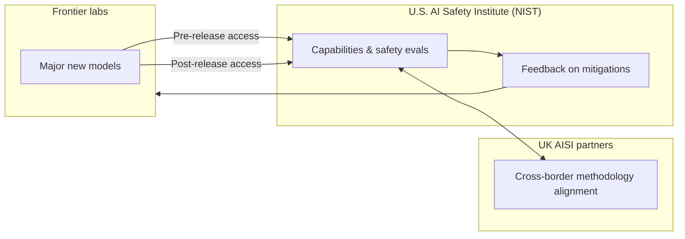

# OpenAI and Anthropic Strike Voluntary Safety MoUs with US AI Safety Institute

## Table of Contents

- **Introduction** — The headline: two frontier labs and the U.S. government just formalized AI safety collaboration.
- **What NIST Announced Today** — Memoranda of Understanding, not legislation: the concrete mechanics in plain language.
- **Why Pre- and Post-Release Access Actually Matters** — What early model access buys evaluators—and what it does not.
- **Voluntary MoUs vs. Hard Law** — Where power sits in the U.S. stack right now.
- **The UK Connection** — Why NIST explicitly names collaboration with the U.K. AI Safety Institute.
- **How This Fits the July 2024 Governance Arc** — Executive Order implementation, voluntary commitments, and the move toward measurable safety work.
- **What Serious Builders Should Track** — Evaluation science, transparency expectations, and procurement ripple effects.
- **Limits, Trust, and Incentive Design** — Honest accounting of what these agreements cannot solve.
- **AISI ↔ Lab Feedback Loop (Conceptual Map)** — A simple architecture diagram for how pre/post access and UK coordination fit together.
- **Checklist: Governance-Aware Automation Stacks** — What to wire *now* in n8n, agents, or internal tools without waiting for statute.
- **FAQ** — Direct answers on scope, enforcement, and next steps.
- **Closing** — Why this is infrastructure for anyone shipping AI-powered systems.

## Introduction: Two Lab Gates Open to the U.S. AI Safety Institute

**Today the U.S. AI Safety Institute (AISI), housed at the National Institute of Standards and Technology (NIST) under the Department of Commerce, announced memoranda of understanding with both OpenAI and Anthropic—establishing a formal framework for collaborative AI safety research, testing, and evaluation.** According to NIST’s release, each Memorandum of Understanding sets up AISI access to major new models from each company **before and after** public release, with joint work on how to evaluate capability and safety risks and how to mitigate them.

This is not a Senate bill. It is not a fine schedule. It *is* a institutional bridge between America’s measurement-science apparatus and the two American labs that, alongside Google and others, most visibly set the frontier API agenda this year.

If you are building agents, workflow automation, or customer-facing copilots, you should care for a boring reason: **evaluation norms drift from papers into procurement and insurance.** AISI-grade narratives show up in enterprise security reviews faster than most engineers expect.

Primary source for the announcement details below: NIST’s news item *[U.S. AI Safety Institute Signs Agreements Regarding AI Safety Research, Testing and Evaluation With Anthropic and OpenAI](https://www.nist.gov/news-events/news/2024/08/us-ai-safety-institute-signs-agreements-regarding-ai-safety-research)*, published **August 29, 2024**.

## What NIST Announced Today: The Deal in Bullets

**AISI signed parallel MoUs with OpenAI and Anthropic; each agreement frames ongoing technical collaboration rather than a one-time press moment.** Here is the structure NIST describes:

| Element | What NIST says publicly |
|--------|-------------------------|
| **Instrument** | Memorandum of Understanding with each company |
| **Model access** | AISI receives access to **major new models** **prior to** public release **and** **after** release |
| **Workstreams** | Collaborative research on evaluating **capabilities**, **safety risks**, and **mitigations** |
| **Feedback loop** | AISI plans to provide **feedback** to the labs on **potential safety improvements** |
| **International layer** | Work occurs **in close collaboration** with partners at the **U.K. AI Safety Institute** |
| **Policy lineage** | NIST ties the effort to the **Biden-Harris Executive Order on AI** and labs’ **voluntary commitments** to the administration |

NIST quotes **Elizabeth Kelly**, director of the U.S. AI Safety Institute, framing the agreements as an “important milestone” on the path toward “responsibly steward[ing] the future of AI”—while emphasizing they are a **start**, not the finish.

## Why Pre- and Post-Release Access Matters for Evaluation

**The eval window is where claims go to die—or survive.** Public benchmark suites lag real misuse economics; red-team findings from labs are informative but not always comparable across providers. Government-side evaluation capacity, backed by NIST’s standards history, is positioned to stress tests across **consistent methodology** rather than **marketing slides**.

**Access before release** matters because capability jumps often surface interactively—tool use, long-horizon agent behavior, multi-step persuasion patterns—not on static multiple-choice leaderboards. If AISI can run exploratory work during the private phase, the hope is fewer “we did not know it could do that in production” surprises.

**Access after release** matters because deployment feedback changes risk: fine-tuning, plugins, retrieval stacks, and enterprise system prompts rewrite the threat model. A model’s “safety profile” is not a single frozen artifact once customers wire it into CRMs, support desks, and code hosts.

| Phase | Evaluation emphasis | Typical risk shift |
|-------|---------------------|-------------------|
| **Pre-release** | Capability discovery, baseline refusal behavior, dangerous dual-use affordances | Undisclosed emergent behaviors |
| **Post-release** | Integration drift, jailbreak churn, scaling of misuse via product features | Real-world adversarial learning |

None of this **automatically** guarantees public transparency. AISI can deepen *internal* government understanding before narratives settle. Builders should still push for **publishable metrics** where possible, not because the MoU requires it—but because the ecosystem learns.

## Voluntary MoUs vs. Statutory Power: Where We Actually Are

**These agreements are voluntary frameworks; they do not replace Congressional rulemaking or agency rulemakings under existing statutes.** The U.S. innovation stack this decade runs on **two parallel tracks**:

1. **Hard law track** — Slow, jurisdictional, often industry-vertical (finance, health, defense procurement).
2. **Administrative + norms track** — Executive orders, NIST guidance, voluntary commitments, insurer questionnaires, and enterprise vendor attestations.

**MoUs sit firmly in the second track.** They coordinate personnel, data access, and research agendas. They do not, by themselves, create fines for shipping a misaligned model.

That distinction matters for builders:

- **If you serve regulated customers**, watch how AISI outputs refract into **contractual security appendices** even without new statutes.
- **If you ship developer tools**, expect **eval transparency** to become a sales requirement—not because MoUs mandate it, but because **downstream risk teams borrow government frames**.

For broader July context on how EU publication of the AI Act and U.S. administrative motion were already colliding this summer, see my earlier landscape post [AI Safety and Regulation: The July 2024 Landscape](/blog/ai-safety-regulation-july-2024).

## The UK AI Safety Institute Collaboration: Why NIST Named Them

**AISI explicitly plans to work with U.K. AI Safety Institute partners—an interoperability bet on evaluation methodology across jurisdictions.** Frontier labs operate globally; misuse patterns cross borders; frontier releases are rarely “U.S.-only events.”

| Reason cross-border coordination helps | Failure mode when it is missing |
|----------------------------------------|----------------------------------|
| Shared red-team taxonomies | Incompatible severity scales → incomparable headlines |
| Harmonized reporting triggers | Under- or over-reaction incidents based on local politics |
| Joint capability probes | Repeated private discoveries without synthesis |

If you export AI-powered products, treat **evaluation interoperability** as a first-class architecture concern—as boring as localization, but for **risk communication**.

## How This Fits the August 2024 Governance Arc

**By late August 2024, U.S. AI policy is no longer purely declarative; it is operationalizing through institutions with budgets, desks, and testing agendas.** NIST positions AISI as building on:

- The **Executive Order on Safe, Secure, and Trustworthy AI** (2023) that chartered AISI’s mission.
- **Voluntary commitments** from leading model developers to the administration—now feeding into concrete AISI collaboration rather than standing as PDFs alone.

The take for operators is simple: **safety work becomes staffing.** Labs hire evaluators; governments stand up institutes; enterprises hire former government evaluators. The labor market for “AI safety engineering” is about to look more like **security engineering**—ticket queues, dashboards, severity rubrics—less like blog debates.

## What Builders Shipping Automation Should Actually Watch

**Do not optimize for press releases—optimize for evaluation infrastructure you can audit.**

1. **NIST-leaning eval rubrics** — Expect customer RFP language to mirror AISI/NIST framing on capability and misuse categories.
2. **Pre-release API staging for enterprise** — If labs accelerate private-access programs for governments, similar staging patterns often appear for **large commercial** “trusted tester” pools.
3. **Cross-product risk** — Agents change the blast radius. Evaluations that ignore tool use miss what your stack actually does.
4. **Logging and traceability** — If AISI pushes reproducible testing, your internal **observability** becomes part of the compliance narrative.

For a companion read on why trust incidents with frontier models rip through product and policy simultaneously—see [The “Sky” Voice Scandal](/blog/sky-voice-scandal-scarlett-johansson-openai): different domain, same lesson that **governance follows perceived harm**.

## Honest Limits: What These MoUs Cannot Promise

**MoUs cannot guarantee timelines for public disclosure, prevent competitive races, or eliminate strategic incentives to downplay findings.** Even with good faith on all sides, structural tensions remain:

| Limitation | Why it persists |
|------------|-----------------|
| **Commercial sensitivity** | Early capability data can move markets and national-security deliberations |
| **Dual-use ambiguity** | Publishing some mitigations teaches attackers |
| **Institutional bandwidth** | AISI must prioritize; not every risk class gets equal cycles |
| **Political turnover** | Administrative priorities can shift faster than science |

Builders should still welcome the institution-building: **shared measurement beats vibes**, even when publishing lags understanding.

## AISI ↔ Lab Feedback Loop: Conceptual Map

**Picture the agreements as a closed loop between frontier capability and public measurement science—not a one-way data pipe.** Government-side testing, when done well, informs mitigations *before* scale; post-release testing catches integration-induced regressions.

This diagram is interpretive—NIST’s release does not publish internal org charts—but it matches the **stated** elements: dual-phase access, collaborative research, feedback to labs, and UK collaboration.

## Checklist: Governance-Aware Automation Stacks (You Can Ship This Month)

**MoUs at NIST do not write your runbooks—but enterprise buyers will increasingly ask for artifacts that rhyme with government eval framing.** If you orchestrate LLMs in production, align your stack with practices that survive security review:

| Practice | Why it tracks AISI-era expectations |
|----------|-------------------------------------|
| **Version-pin every model and prompt template** | Reproducibility is the substrate of credible evaluation |
| **Persist traces with PII redaction policies** | Incident review requires timelines, not vibes |
| **Human-in-the-loop for high-impact tool calls** | Maps to “human oversight” language crossing from policy to procurement |
| **Canary deployments for prompt/system changes** | Post-release drift is where real-world misuse concentrates |
| **External content allow-lists for retrieval** | Supply-chain attacks on RAG are in scope for serious threat models |

If you are on **n8n** or similar, treat model calls like payment webhooks: retries, idempotency keys, structured error taxonomy, and explicit escalation nodes when confidence thresholds fail. That is how you industrialize safety *engineering* without waiting for Congress.

## FAQ

### Did OpenAI and Anthropic sign binding law today?

**No—the instruments are voluntary memoranda of understanding coordinating collaboration, not statutes with fines attached.** NIST describes them as frameworks for research, testing, and evaluation with the U.S. AI Safety Institute.

### When did NIST announce the agreements?

**NIST published the announcement on August 29, 2024** in its newsroom under the title on AI safety research, testing, and evaluation with Anthropic and OpenAI.

### What access does AISI receive under the MoUs?

**AISI receives access to major new models from each company prior to public release and following release**, per NIST’s summary, to support collaborative evaluation of capabilities, risks, and mitigations.

### Will AISI give the labs feedback?

**Yes—NIST states AISI plans to provide feedback on potential safety improvements**, working closely with U.K. AI Safety Institute partners as part of the arrangement.

### Who leads the U.S. AI Safety Institute?

**NIST names Elizabeth Kelly as director of the U.S. AI Safety Institute** in its August 29, 2024 announcement.

### Is this tied to the Biden Executive Order on AI?

**Yes—NIST explicitly connects evaluations under these agreements to advancing safe AI consistent with the Biden-Harris Executive Order and prior voluntary commitments by leading developers.**

### Does this replace corporate red teaming?

**No—it complements it with a government-side evaluation channel and (aspirationally) more standardized methodology.** Corporate programs remain; AISI adds a public-institution layer.

### Should startups care if they are not training foundation models?

**Yes—downstream buyers import government evaluation language into vendor reviews.** Your stack inherits expectations through procurement even if you never touch pretraining.

## Closing: Measurement Beats Hype for Anyone Wiring AI Into Ops

**Today’s MoUs do not end frontier risk—but they signal where long-term leverage sits: reproducible evaluation, bilateral lab–government access, and cross-border alignment with the U.K. AISI.** If you automate workflows or ship agentic products, your practical move is unchanged and harder: **build traceability, staged rollouts, and test harnesses** like you would for payment systems—because that is where the industry is sliding.

If you want help designing **production-grade AI automation** with governance-aware logging, escalation paths, and human approvals baked in—not slides—book an **AI automation strategy call** with me through the site. For continued policy context alongside model releases, keep [July’s AI safety & regulation snapshot](/blog/ai-safety-regulation-july-2024) on your reading stack next to NIST’s AISI updates.

---

**Sources consulted:** NIST news release dated **August 29, 2024** — *U.S. AI Safety Institute Signs Agreements Regarding AI Safety Research, Testing and Evaluation With Anthropic and OpenAI* (`https://www.nist.gov/news-events/news/2024/08/us-ai-safety-institute-signs-agreements-regarding-ai-safety-research`).
