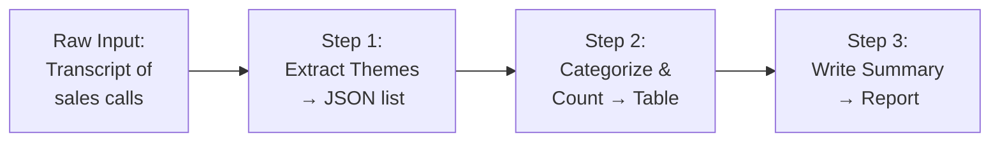

# Prompt Chaining and Task Decomposition for Complex Work

## Table of Contents

- [Why Complex Tasks Fail in One Prompt](#why-complex-tasks-fail-in-one-prompt)
- [What Task Decomposition Actually Means](#what-task-decomposition-actually-means)
- [The Anatomy of a Prompt Chain](#the-anatomy-of-a-prompt-chain)
- [The Four Fundamental Chain Patterns](#the-four-fundamental-chain-patterns)
- [Passing Structured Output Between Steps](#passing-structured-output-between-steps)
- [Debugging Chains: Finding the Broken Link](#debugging-chains-finding-the-broken-link)
- [When to Chain vs When to Use One Prompt](#when-to-chain-vs-when-to-use-one-prompt)
- [From Manual Chains to Automation](#from-manual-chains-to-automation)
- [Worked Example: Research to Memo Chain](#worked-example-research-to-memo-chain)
- [Reference: Prompt Chain Pattern Table](#reference-prompt-chain-pattern-table)
- [Frequently Asked Questions](#frequently-asked-questions)

## Why Complex Tasks Fail in One Prompt

**A single prompt asking a frontier model to perform multiple distinct cognitive operations produces shallow output on all of them because attention is a zero-sum resource — every additional instruction dilutes the depth applied to the previous one.** Claude 3.7 Sonnet, GPT-4o, and Gemini 2.5 Pro all have large context windows, but context window size and effective attention are different things. A model can hold 200K tokens in memory and still only focus deeply on a fraction of what you ask it to do.

I see this failure mode constantly in my client work. Someone sends a prompt like: "Research the competitive landscape for project management SaaS, identify the top three players, analyze their pricing strategies, and write a positioning memo recommending how we should differentiate." What comes back is a surface-level gloss on everything — a generic competitor list, pricing observations pulled from training data rather than actual analysis, and a memo that reads like it was written by someone who spent five minutes on each section. The model did exactly what it was told. It was told to do four different things in one breath, so it gave each about 25% of its working memory.

This isn't a capability problem. The same model, given the same total task broken into a sequence of focused prompts, produces work that passes scrutiny. The issue is what researchers call the "lost in the middle" effect: models pay disproportionate attention to the beginning and end of their context, and instructions buried in the middle of a multi-part request get attenuated. When you ask for research + analysis + synthesis + writing all at once, at least two of those operations are happening in the middle zone where attention is thinnest.

The result is what I call "averaging across operations." The model finds the statistically typical output for "competitive research" blended with the statistically typical output for "pricing analysis" and so on — producing something that looks competent at a glance and falls apart under any real examination. You can't tell which part failed because everything is fused into one undifferentiated blob. This is why complex tasks fail in monolithic prompts: not because models are weak, but because you're asking them to multitask in a way that defeats the mechanism they use to think deeply about anything.

## What Task Decomposition Actually Means

**Task decomposition is the practice of breaking a complex deliverable into a sequence of discrete operations, where each step produces an intermediate output that is complete enough to verify and structured enough to feed into the next step.** It is the single highest-leverage skill in advanced prompting, and it operates at a different level than the wording tricks most people associate with "prompt engineering." You can have perfect grammar, clever framing, and all the right magic words — if you're still asking for four things at once, you're going to get four shallow things.

The mental model that makes decomposition click is this: you're designing a pipeline, not writing an incantation. A factory doesn't assemble a car by asking one worker to mine ore, smelt steel, stamp panels, and install the engine. It stages the work: ore → steel → panels → assembly. Each station receives a complete intermediate, performs one transformation, and passes a new intermediate downstream. The output of station N is the input of station N+1. When the final car rolls off the line, you know exactly which station to check if something is wrong.

Decomposition works the same way for cognitive tasks. Instead of asking a model to "write a market analysis," you stage it:

1. **Research step:** Scan sources and return a structured list of competitors with key attributes
2. **Analysis step:** Take that list and identify pricing patterns, return as comparison table
3. **Synthesis step:** Take the table and extract 2–3 positioning gaps
4. **Writing step:** Take the gaps and compose the final memo

Each intermediate — the competitor list, the pricing table, the gap analysis — is testable on its own. You can read the list and know immediately if the research step found the right companies. You can look at the pricing table and see if the analysis correctly identified the freemium vs. enterprise split. When the final memo misses the mark, you don't start over; you look at which intermediate was faulty and fix that step.

This is what separates decomposition from "better prompting." Better prompting improves a single request. Decomposition changes the architecture from one request to many, each focused, each verifiable, each feeding into the next. It is the bridge between treating AI as a chatbot and treating it as a reliable component in a production system.

## The Anatomy of a Prompt Chain

**Every prompt chain follows the same fundamental pattern: input → Step 1 → structured intermediate A → Step 2 → structured intermediate B → ... → final output.** The magic is in what happens between steps. A valid intermediate is three things: it is **structured** (machine-readable format like JSON or a predictable markdown table), it is **testable** (a human can look at it and judge correctness without running the rest of the chain), and it is **complete** (it contains everything the next step needs, so that step can operate without guessing or hallucinating context).

The role of each step is transformation, not generation from nothing. Step 1 transforms raw input into a structured foundation. Step 2 transforms that foundation into analysis. Step 3 transforms analysis into synthesis. Step 4 transforms synthesis into presentation. Each step knows exactly what it receives and exactly what it must produce. This clarity eliminates the ambiguity that sinks monolithic prompts.

Here's a simple mermaid diagram of a basic three-step chain:



In this chain:

- **Step 1** receives raw transcript text and produces a JSON array of themes with quotes and timestamps
- **Step 2** receives that JSON and produces a markdown table: theme | count | example quote | trend direction
- **Step 3** receives the table and produces the final executive summary with recommendations

The critical design decision is the intermediate format. JSON works best when the next step is a machine or another model that needs to parse precisely. Markdown tables work well when a human might inspect between steps. XML tags work when you're feeding Claude, which has been fine-tuned to attend to XML-delimited sections. The format choice determines how reliably the handoff works — a sloppy intermediate, even if roughly correct, can cause the next step to misparse and go off track.

What makes a chain "valid" is that you could stop after any step, evaluate the output, and know whether the chain is on track. If Step 1's JSON is missing major themes, you fix Step 1 before running Step 2. If Step 2's table has wrong counts, you fix the categorization logic. This verifiability at each stage is what separates professional prompt chains from fragile prompt spaghetti.

## The Four Fundamental Chain Patterns

**There are four fundamental patterns that cover almost every production prompt chain you'll build: sequential, conditional/branching, map-reduce, and iterative refinement.** Each solves a different orchestration problem. Mastering when to use which separates chains that work in theory from chains that work in production. I use all four regularly in client automation projects and in my own n8n workflows.

| Pattern | What It Does | When to Use | Real-World Example |
|---------|--------------|-------------|-------------------|
| **Sequential** | Steps run in fixed order, each output feeds next input | Task has clear stages that must happen in sequence | Research → Analysis → Memo writing |
| **Conditional/Branching** | Steps run based on intermediate results | Different processing needed depending on what step N finds | Support ticket classification → route to either refund flow or technical flow |
| **Map-Reduce** | Same step runs in parallel over many items, then results aggregate | Processing many similar items that don't depend on each other | Analyze 100 customer reviews → extract sentiment per review → aggregate into summary stats |
| **Iterative Refinement** | Output of step N feeds back into step N+1 to improve same artifact | Quality matters more than speed, artifact needs polishing | Draft → critique → redraft → critique → final |

**Sequential chains** are the default. Most cognitive work naturally decomposes into stages: gather information, analyze it, synthesize findings, present conclusions. The customer support analysis chain I diagrammed earlier is sequential. Sequential chains are easiest to debug because the path is deterministic — step 2 always follows step 1 — and intermediates are easy to inspect.

**Conditional/branching chains** handle variability. Not all inputs need the same processing. A document classification step might output "invoice," "contract," or "correspondence." Each type then flows to a different extraction pipeline — invoices to line-item parsing, contracts to clause extraction, correspondence to sentiment scoring. In n8n, this is an IF node. In Claude Code, you might use subagents with routing logic. The key is that the classification step outputs a structured decision that the router can act on unambiguously.

**Map-reduce chains** handle volume. When you have 500 support tickets to analyze, running them one at a time is wasteful. Map-reduce fans out: step 1 runs in parallel over all 500, producing 500 intermediate outputs (say, sentiment scores). A reduce step then aggregates: count positive/negative/neutral, flag outliers, summarize common complaints. This pattern is essential for automation at scale — n8n's Split in Batches node, Python's multiprocessing, or OpenAI's batch API all support it.

**Iterative refinement chains** maximize quality. Some outputs — code, long-form writing, strategic recommendations — benefit from multiple passes. The pattern is: generate → evaluate against criteria → revise. The evaluation step might be a separate prompt asking "what's wrong with this draft?" or it might be the same model instructed to critique its own output. OpenAI's o1 and o3-mini reasoning models do this internally, but you can build explicit refinement loops with any model when you need more control over the evaluation criteria.

These patterns compose. A complex n8n workflow might use map-reduce to process a batch, sequential steps within each branch, and conditional routing based on intermediate results. The skill is recognizing which pattern fits the work, not forcing every task into a single shape.

## Passing Structured Output Between Steps

**The handoff between steps is where most prompt chains fail — not because the model misunderstood the task, but because step N produced prose when step N+1 needed JSON, or step N+2 couldn't find the data in the blob step N+1 sent.** Structured output between steps is non-negotiable. Unstructured intermediates force the next step to parse, which introduces brittleness, or to re-generate, which introduces duplication and hallucination. JSON has become the universal glue because every modern model can produce it, every programming language can parse it, and it supports the nested structure that real intermediates need.

The pattern is straightforward but strict: every step must be instructed on both its task and its output contract. Not "analyze these competitors" but "analyze these competitors and return ONLY valid JSON with this exact schema." The schema must be explicit — keys, types, and any constraints like "must be one of [low, medium, high]." The receiving step then knows exactly where to find the data it needs.

Here's a prompt template for a step that produces structured JSON for the next step:

```markdown
You are a competitive research analyst. Your task is to analyze the provided 
company descriptions and return a structured JSON object that will be consumed 
by the next step in an automated pipeline.

INPUT:
You will receive a list of company descriptions, each with name, website, 
and description.

OUTPUT FORMAT:
Return ONLY valid JSON matching this exact schema. No markdown code fences, 
no explanatory text before or after:

{
  "competitors": [
    {
      "name": "string - company name",
      "category": "string - one of: [direct, indirect, potential]",
      "primary_value_prop": "string - one-sentence description of main offering",
      "pricing_model": "string - one of: [freemium, flat_subscription, usage_based, enterprise_only, unknown]",
      "estimated_price_range": {
        "low": "number or null",
        "high": "number or null",
        "currency": "string - USD if specified, otherwise null"
      },
      "key_differentiators": ["string - max 3 distinctive features"],
      "threat_level": "string - one of: [high, medium, low]",
      "data_confidence": "string - one of: [high, medium, low] based on completeness of input"
    }
  ],
  "analysis_metadata": {
    "total_competitors_analyzed": "number",
    "direct_competitors_count": "number",
    "data_quality_warning": "string or null - note if descriptions were too vague for accurate analysis"
  }
}

RULES:
1. If pricing cannot be determined from the description, set pricing_model to "unknown" 
   and estimated_price_range to {low: null, high: null, currency: null}
2. category must be strictly one of the three allowed values
3. threat_level should consider both similarity to our offering AND resources/scale
4. Include ONLY competitors with sufficient data; omit if description is completely empty
5. The next step will parse this JSON programmatically — any syntax error breaks the chain
```

The constraints at the end matter. "The next step will parse this programmatically" creates stakes. "Any syntax error breaks the chain" makes the failure mode concrete. When models understand that their output is infrastructure, not conversation, they comply more reliably.

For Claude specifically, I often wrap the JSON instruction in XML tags for additional structure:

```
<instructions>
Analyze the competitors below and return valid JSON.
</instructions>

<competitor_data>
{{input_from_previous_step}}
</competitor_data>

<output_schema>
{{schema as above}}
</output_schema>

<warning>
The next step will parse this output with JSON.parse(). Return ONLY the JSON object, 
no markdown, no conversational wrapper.
</warning>
```

Claude's training includes heavy exposure to XML-delimited documents, and the tags help it separate its instructions from the data it must process. For GPT-4o, triple-backtick delimiters work similarly. The key is always the same: isolate what the model must do from what it must process, and specify the output contract with absolute precision.

## Debugging Chains: Finding the Broken Link

**The primary advantage of prompt chains over monolithic prompts is observability — when output is wrong, you can inspect each intermediate and know exactly which transformation failed, rather than debugging a black box.** This changes the economics of iteration. With a single giant prompt, every failure requires reasoning about the entire instruction set at once. With a chain, you binary-search your way to the problem: is step 1's output correct? Yes. Is step 2's? No. The bug is in step 2 or in step 2's prompt. The search space collapses from "everything" to "one component."

The debugging workflow is methodical:

1. **Run the chain and capture all intermediates** — every JSON blob, every table, every transformation output
2. **Verify each intermediate against its expected contract** — does the competitor list actually contain competitors? Does the pricing table have numbers where numbers belong?
3. **Find the first incorrect intermediate** — this is your breakpoint
4. **Fix the step that produced it** — usually the prompt needs tighter constraints, better examples, or a clearer output schema
5. **Re-run from that step forward** — earlier steps don't need re-execution if they were correct

This last point matters for cost and speed. When step 3 of a five-step chain fails, you don't pay for steps 1 and 2 again. You cache their outputs and resume from step 3. In n8n, this is automatic — the workflow stores node outputs. In Claude Code or Cursor, you manually paste the verified intermediate into the next prompt. Either way, you're not burning tokens repeating work that was already correct.

Here's the comparison between debugging approaches:

| Aspect | Monolithic Prompt | Prompt Chain |
|--------|-------------------|--------------|
| **Failure identification** | Must analyze entire output to guess which instruction was ignored | Inspect intermediates to find first failure point |
| **Iteration cost** | Full re-run every time | Re-run only from failed step |
| **Fix precision** | Change wording, hope it helps the right part | Modify specific step that failed |
| **Confidence in fix** | Unclear — did the change fix the right thing or just shift the failure? | High — you know exactly what changed and can verify the intermediate |
| **Human review required** | Expert must understand entire task to evaluate output | Non-expert can verify many intermediates ("is this a complete competitor list?") |
| **Automation readiness** | Must work perfectly before automating | Can automate verified steps while refining problematic ones |

The final row is why chains win for production work. A monolithic prompt is an all-or-nothing bet — it either works reliably enough to automate, or it doesn't. A chain can be partially automated. Steps 1 and 2 work perfectly? Automate them. Step 3 still needs human review? Keep it manual while you iterate. This staged automation is how I build n8n workflows for clients: ship the solid parts, keep the uncertain parts under supervision, tighten the uncertain parts until they're solid, then automate them too.

## When to Chain vs When to Use One Prompt

**You don't need a chain for every task — sometimes a single well-engineered prompt is faster, cheaper, and good enough.** The decision framework comes down to four factors: how many distinct cognitive modes the task requires, how critical quality is at each stage, whether you need human review between stages, and whether you're heading toward full automation. When three or more of these point toward decomposition, it's chain time.

| Factor | Single Prompt Wins | Chain Wins |
|--------|-------------------|------------|
| **Cognitive modes** | One: classification, summarization, rewriting | Multiple: research + analysis + synthesis + writing |
| **Quality criticality** | "Good enough" is acceptable | Errors at any stage compound |
| **Human checkpoints** | No review needed; straight to output | Need to verify research before analysis, verify analysis before writing |
| **Automation target** | One-shot API call, no orchestration | Part of larger workflow with conditionals, parallel processing |
| **Debugging requirement** | Output either works or doesn't; easy to eyeball | When wrong, need to know which sub-task failed |
| **Token efficiency** | Short task, short context | Long task where intermediates can be cached and reused |

The cognitive modes threshold is the clearest signal. A single cognitive mode is one type of thinking: classify this email, summarize this transcript, rewrite this paragraph in a different tone. These are transformations within one domain. When you need to switch modes — from gathering information to analyzing patterns, from analyzing to making judgments, from judging to persuading — you're asking the model to context-switch internally, and chains force that switch to be explicit and complete.

Human checkpoints are often overlooked. Some work inherently needs approval at stages: a legal team wants to review extracted contract clauses before a summary is written, a marketing lead wants to approve the competitor list before positioning is drafted. Chains bake these checkpoints into the structure — step 2 doesn't run until the human approves step 1's output. Single prompts can't do this; you get the final output all at once, and if something early was wrong, you're editing downstream text that was built on a faulty foundation.

Automation potential is the strategic factor. If you're building toward an n8n workflow that runs overnight processing support tickets, you need the reliability and debuggability that chains provide. Single prompts work for ad-hoc tasks. Chains work for infrastructure. The investment in designing intermediates and schemas pays back every time the workflow runs unsupervised.

That said, don't chain reflexively. A simple classification task — "is this review positive or negative" — doesn't need decomposition. Adding steps adds latency, token cost, and orchestration complexity. Start with the simplest approach that could work. Add a second step only when the first produces output that's too shallow, too unverified, or too fused to evaluate. Let the pain of debugging a monolith teach you where the seams belong.

## From Manual Chains to Automation

**A working manual prompt chain is a blueprint for an automation — the intermediate formats you designed for human inspection become the data structures that nodes pass to each other, and the prompts you refined through iteration become the system instructions for autonomous steps.** This is the bridge between "I can get AI to do this" and "AI does this every morning without me." The chain architecture you build manually is exactly the architecture you wire into n8n, into Claude Code with subagents, or into the new agent protocols that just dropped this week.

The progression has four stages:

1. **Manual chain:** You run each prompt, copy-paste intermediates, evaluate by eye. This proves the decomposition works.
2. **Assisted chain:** Tools like Claude Code run the chain for you — you specify the steps, it executes and surfaces intermediates for approval. This proves the orchestration logic works.
3. **Supervised automation:** n8n runs the full chain, but notifies you at checkpoints or for final review. This proves the unattended execution works.
4. **Full automation:** The workflow runs on schedule or trigger, with monitoring and error handling but no human in the loop. This is production.

Right now, in April 2025, the tooling for this progression has never been better. Claude Code supports subagents — you define a skill that runs a prompt chain, and the main agent delegates to it as a unit. The subagent handles the intermediate passing internally, returning only the final result to the parent. This mirrors exactly how you'd structure an n8n workflow: sub-workflows for reusable chain segments.

OpenAI's Responses API, released in March alongside the Agents SDK, gives you the same orchestration primitives programmatically: you define tools (which can be other prompts), the model calls them in sequence or in parallel based on the task, and you handle the state passing in code. The SDK includes tracing so you can see exactly which step in a chain produced what output — the same observability you get from manual inspection, but automated.

Google's Agent-to-Agent (A2A) protocol, announced April 9 at Google Cloud Next, is the newest entry. It defines a standard for agents to discover each other's capabilities, negotiate tasks, and exchange structured data. A2A uses JSON-RPC under the hood for the agent-to-agent communication — essentially formalizing the "step N produces JSON for step N+1" pattern at the protocol level. For multi-agent chains where different agents have different specialties (one does research, one does analysis, one does writing), A2A provides the interoperability layer.

And then there's n8n, which remains my default for client automation work. The OpenAI node, Anthropic node, and HTTP request node give you all the primitives to execute prompt chains at scale. The code node lets you transform intermediates between steps. The split-in-batches and merge nodes give you map-reduce. The IF and Switch nodes give you conditional routing. A chain you prove manually becomes a workflow you draw in n8n's canvas, test with the execution debugger, and schedule with the cron trigger.

The underlying principle never changes: chains that work manually will work automated. The only additions are error handling (what if step 3's API is down?), retry logic (what if the model returns malformed JSON?), and monitoring (how do I know the chain ran successfully last night?). The architecture — the decomposition, the intermediates, the schemas — transfers directly.

## Worked Example: Research to Memo Chain

**Here's a complete, production-ready chain I use for competitive intelligence work: research → competitor list → pricing analysis → positioning memo.** I'll show the exact prompt for each step and the intermediate it produces. This is the same pattern I automate in n8n for clients who need weekly competitive monitoring. The domain is project management SaaS, but the structure applies to any vertical.

### Step 1: Research

**Input:** Raw context about our product and target market.

**Prompt template:**

```markdown
You are a competitive research specialist focused on the project management 
SaaS market. Your task is to identify the most relevant competitors to analyze.

OUR PRODUCT CONTEXT:
- Target: Mid-market professional services firms (100-500 employees)
- Key features: Project tracking, resource allocation, client portals, invoicing
- Positioning: "Professional services command center" vs generic PM tools

TASK:
Based on your knowledge and the context above, identify 6-8 competitors that 
would be most relevant for a positioning analysis. Include:
- Direct competitors (similar focus on professional services)
- Indirect competitors (generic PM tools our audience also evaluates)
- Adjacent players (tools that solve the same problem differently, e.g., spreadsheets + manual processes)

OUTPUT FORMAT:
Return ONLY a JSON array with this exact schema. No markdown code fences, 
no explanatory text:

[
  {
    "company_name": "string",
    "website": "string - main domain only",
    "competitor_type": "string - one of: [direct, indirect, adjacent]",
    "target_audience": "string - who they primarily serve",
    "primary_category": "string - e.g., 'project management', 'resource planning', 'client management'",
    "reason_for_inclusion": "string - 1 sentence why this matters for our analysis"
  }
]

QUALITY CHECK:
- Verify all 6-8 companies actually exist and URLs are valid
- Ensure at least 2 direct, 2 indirect, and 1 adjacent are included
- Adjacent should be a credible alternative our prospects might actually use
```

**Intermediate output (JSON):**

```json
[
  {
    "company_name": "Accelo",
    "website": "accelo.com",
    "competitor_type": "direct",
    "target_audience": "Professional services firms, agencies, consultancies",
    "primary_category": "project management",
    "reason_for_inclusion": "Built specifically for professional services with project, retainer, and ticket workflows"
  },
  {
    "company_name": "Monday.com",
    "website": "monday.com",
    "competitor_type": "indirect",
    "target_audience": "General business teams, startups, enterprise",
    "primary_category": "project management",
    "reason_for_inclusion": "Market leader our prospects evaluate; need to show differentiation vs generic tool"
  },
  {
    "company_name": "Asana",
    "website": "asana.com",
    "competitor_type": "indirect",
    "target_audience": "Knowledge workers, marketing teams, general business",
    "primary_category": "project management",
    "reason_for_inclusion": "Top-of-mind for task management; competes for same budget"
  },
  {
    "company_name": "Float",
    "website": "float.com",
    "competitor_type": "direct",
    "target_audience": "Creative agencies, consultancies, architecture firms",
    "primary_category": "resource planning",
    "reason_for_inclusion": "Resource-first approach to professional services; similar positioning"
  },
  {
    "company_name": "Harvest + Forecast",
    "website": "getharvest.com",
    "competitor_type": "adjacent",
    "target_audience": "Small agencies, freelancers, consultancies",
    "primary_category": "time tracking + resource planning",
    "reason_for_inclusion": "Many prospects currently use this combo; represents status quo we displace"
  }
]
```

### Step 2: Pricing Analysis

**Input:** The JSON array from Step 1.

**Prompt template:**

```markdown
You are a pricing strategy analyst. Your task is to analyze the pricing 
models and positioning of the competitors provided.

INPUT COMPETITORS (JSON):
{{step_1_output}}

TASK:
For each competitor, research and analyze:
1. Pricing model (freemium, flat subscription, per-seat, usage-based, etc.)
2. Entry price point (if publicly available)
3. How they position value (what primary benefit they sell)
4. Any unique pricing mechanics (credits, tiers, annual discounts)

OUTPUT FORMAT:
Return ONLY a JSON object with this exact schema:

{
  "pricing_analysis": [
    {
      "company_name": "string",
      "pricing_model": "string - one of: [freemium, flat_subscription, per_seat, usage_based, hybrid, enterprise_only, undisclosed]",
      "entry_price": {
        "amount": "number or null",
        "period": "string - monthly/annual/null",
        "notes": "string - e.g., 'per user', 'flat', 'first tier'"
      },
      "value_positioning": "string - 1 sentence on how they justify their price",
      "notable_mechanics": "string - any unique pricing features, or 'standard'",
      "price_transparency": "string - one of: [full, partial, contact_sales]"
    }
  ],
  "patterns": {
    "most_common_model": "string",
    "price_range_low": "number or null",
    "price_range_high": "number or null",
    "positioning_themes": ["string - 2-3 recurring value props competitors use"],
    "market_maturity_signal": "string - what the pricing patterns suggest about market stage"
  }
}

ACCURACY NOTES:
- If pricing is not public, set entry_price fields to null and price_transparency to 'contact_sales'
- For freemium, note what the free tier includes and where paid starts
- positioning_themes should capture the competitive narrative, not just features
```

**Intermediate output (simplified JSON):**

```json
{
  "pricing_analysis": [
    {
      "company_name": "Accelo",
      "pricing_model": "per_seat",
      "entry_price": {"amount": 24, "period": "monthly", "notes": "per user, annual billing"},
      "value_positioning": "All-in-one professional services operations platform",
      "notable_mechanics": "Tiered by feature set, not seat count beyond minimum",
      "price_transparency": "full"
    },
    {
      "company_name": "Monday.com",
      "pricing_model": "hybrid",
      "entry_price": {"amount": 9, "period": "monthly", "notes": "Basic tier, 3 seat minimum"},
      "value_positioning": "Work OS that adapts to any workflow",
      "notable_mechanics": "Heavy feature gating between tiers, enterprise custom pricing",
      "price_transparency": "partial"
    }
  ],
  "patterns": {
    "most_common_model": "per_seat",
    "price_range_low": 9,
    "price_range_high": 40,
    "positioning_themes": ["all-in-one operations", "flexible workflows", "time and resource visibility"],
    "market_maturity_signal": "clear tier differentiation suggests market is segmenting by feature depth"
  }
}
```

### Step 3: Positioning Memo

**Input:** The patterns object and pricing_analysis array from Step 2.

**Prompt template:**

```markdown
You are a strategic positioning consultant writing for the executive team 
of a professional services SaaS company.

INPUT ANALYSIS:
{{step_2_output}}

OUR PRODUCT (for reference):
- Target: Mid-market professional services (100-500 employees)
- Key differentiators: Client portal integration, built-in invoicing, retainer management
- Positioning: "Command center" metaphor vs "tool" metaphor

TASK:
Write a 400-500 word positioning memo with three sections:
1. MARKET LANDSCAPE: 2-3 paragraphs summarizing the competitive pricing and positioning patterns
2. DIFFERENTIATION OPPORTUNITY: 2-3 specific gaps or positioning angles competitors are missing
3. RECOMMENDED POSITIONING: 2-3 paragraph recommendation on how we should position against this landscape

CONSTRAINTS:
- Write in executive memo style: clear, confident, specific
- Cite specific competitor examples to support each claim
- Avoid generic advice like "focus on customer service" — be specific about our actual differentiation
- Do not invent pricing data not present in the input
- End with 2-3 concrete messaging recommendations (headline approaches)

OUTPUT:
Plain text memo, no markdown headers beyond the three section titles.
```

**Final output:** A complete positioning memo ready for executive review.

This three-step chain turns raw context into a polished strategic document. Each step is independently testable — you can verify the competitor list is complete before worrying about pricing, verify the pricing patterns make sense before commissioning the memo. The final memo quality is higher because step 3 has structured, verified data to work with rather than having to research, analyze, and write simultaneously.

## Reference: Prompt Chain Pattern Table

**Use this reference table when designing a new chain or explaining the approach to stakeholders.** It maps chain patterns to their best-fit scenarios, shows the intermediate format typically used, and notes the primary tooling for automation. I've used every combination here in production workflows this year.

| Pattern | Best For | Typical Intermediate | Automation Tooling | Watch Out For |
|---------|----------|---------------------|-------------------|---------------|
| **Sequential** | Clear linear workflows: gather → analyze → write | JSON, markdown tables | n8n workflow nodes, Claude Code with subagents | Don't skip verification — early errors compound |
| **Conditional** | Variable processing based on content type | Structured decision field (category, priority) | n8n IF/Switch nodes, code-based routing | Ensure classification step has high accuracy; misrouted items are hard to recover |
| **Map-Reduce** | High-volume batch processing | Array of identical JSON objects | n8n Split in Batches, OpenAI Batch API, parallel HTTP | Rate limits, cost at scale — batch APIs are cheaper but asynchronous |
| **Iterative Refinement** | Quality-critical outputs: code, strategy docs | Draft document + critique notes | n8n loops with state, Claude Code loop skills, custom retry logic | Diminishing returns — usually 2-3 iterations hit peak; more is waste |
| **Hybrid (Sequential + Map)** | Multi-stage with parallel analysis | Stage N results arrays feeding sequential stage N+1 | n8n with merge nodes after parallel branches | Sync complexity — ensure all parallel branches complete before merge |
| **Human-in-Loop** | Regulatory review, high-stakes decisions | Same as pattern + human approval flag | n8n Wait for Webhook, Make scenario pauses, custom approval UI | Human latency — design for async, not blocking waits |

**Sequential chains** are your default. When in doubt, stage the work linearly. They're the easiest to debug, most intuitive to stakeholders, and most straightforward to automate. I use sequential chains for about 60% of client automation work.

**Conditional chains** are essential for document processing, support routing, and content classification. The key is the classification step must be accurate — a 95% accurate classifier means 5% of your volume gets misrouted, which at scale is significant. Invest in the classification prompt; use few-shot examples for edge cases.

**Map-reduce** is where you move from "AI-assisted" to "AI-at-scale." Processing 10 items manually is fine. Processing 10,000 requires map-reduce. The April 2025 landscape is good here: OpenAI's Batch API prices at 50% discount for asynchronous processing, and n8n's community nodes support it natively.

**Iterative refinement** is your quality lever. When a draft memo isn't good enough, the answer isn't a longer single prompt — it's a critique-and-rewrite loop. I find two iterations usually captures 80% of the possible improvement; three captures 95%. Beyond that, you're polishing prose that was already good enough.

**Hybrid patterns** emerge in real workflows. A competitor monitoring system might use map-reduce to scrape and analyze 50 sources in parallel, then sequential steps to synthesize trends and write the weekly report. The parallel phase feeds into the sequential phase — the merge node in n8n handles the array-to-single transition.

**Human-in-the-loop** is often overlooked in chain design. Some decisions shouldn't be automated — legal approvals, pricing changes, client-facing messages. Design your chain to pause, notify, and resume. The intermediate is held in waiting state until a webhook signals approval. This isn't a compromise; it's proper risk management for high-stakes operations.

## Frequently Asked Questions

### What is prompt chaining in simple terms?

**Prompt chaining is breaking one complex request into a sequence of smaller, focused prompts where each step's output becomes the next step's input.** Instead of asking an AI to research, analyze, and write all at once, you ask it to research first, then analyze those findings, then write based on that analysis. **Each intermediate output is structured and testable,** so you can verify the work at each stage rather than hoping the final output is built on solid foundations.

### How is task decomposition different from just writing better prompts?

**Better prompting improves a single request; task decomposition changes the architecture from one request to many, each with a specific transformation job.** You can write a brilliant monolithic prompt and still get shallow output on a four-part task because the model's attention splits across all four parts. Decomposition accepts that some tasks are inherently multi-stage and designs a pipeline instead of an incantation. **It is the difference between optimizing a sentence and designing a system.**

### When should I break a task into multiple prompts?

**Break a task into a chain when it requires three or more distinct cognitive modes, needs human verification between stages, or will eventually become an automation.** Single-cognitive-mode tasks — classify, summarize, rewrite — work fine in one prompt. Multi-mode tasks — research plus analysis plus synthesis plus writing — consistently produce better output when chained. **If errors at any stage would compromise downstream work,** chains give you the observability to catch and fix them early.

### What format should I use for intermediate outputs between chain steps?

**JSON is the universal standard for intermediates because every model can produce it and every system can parse it.** For human inspection between steps, markdown tables work well. For Claude specifically, XML-delimited sections can improve reliability. **The key is specifying the exact schema:** not "return JSON" but "return JSON with these exact keys and value types." The receiving step must know precisely where to find each piece of data it needs.

### Can I automate a prompt chain?

**Yes — a manual chain that works reliably is a blueprint for an automation, with the intermediates becoming the data structures that workflow nodes pass to each other.** In n8n, you wire prompts to OpenAI or Anthropic nodes, use code nodes for transformations, and direct outputs through IF nodes for conditional routing. Claude Code can run chains via subagent skills. **The Google A2A protocol announced April 9 and OpenAI's Agents SDK provide standardized ways** for agents to execute multi-step chains programmatically.

### How do I debug a chain when the final output is wrong?

**Inspect each intermediate output in sequence until you find the first one that fails its contract — that's your breakpoint.** Check if step 1's research actually found relevant competitors, if step 2's pricing table has real numbers, if step 3's analysis correctly identified patterns. **Fix the specific step that produced the bad intermediate,** then re-run from that point using cached correct outputs from earlier steps. This targeted debugging is impossible with monolithic prompts where everything is fused together.

### What tools can run prompt chains automatically?

**n8n remains the most accessible platform for production prompt chains, with native OpenAI, Anthropic, and HTTP nodes plus logic for branching, batching, and error handling.** Claude Code runs chains via subagent skills that handle intermediate passing internally. OpenAI's Agents SDK, released March 2025, gives developers programmatic chain orchestration with built-in tracing. **Google's new A2A protocol provides interoperability** for multi-agent chains where different specialized agents handle different steps.

### Is prompt chaining the same as AI agent workflows?

**Prompt chaining is the foundational pattern that makes AI agent workflows possible — chains are to agents what functions are to programs.** An agent workflow is essentially an automated prompt chain where the orchestration, intermediate handling, and error recovery run without human intervention. **The chain architecture you prove manually becomes the agent's instruction set when automated.** The leap from chain to agent is adding error handling, retry logic, and decision autonomy at branch points.

### What's the difference between sequential and conditional chains?

**Sequential chains run steps in fixed order regardless of content; conditional chains route to different branches based on what intermediate analysis reveals.** A research-to-memo pipeline is sequential — step 2 always follows step 1. A support ticket classifier that routes refunds to the billing workflow and technical issues to the engineering workflow is conditional. **The classification step must output a structured decision** (category, priority, type) that the router can act on unambiguously.

### How many steps should a prompt chain have?

**A chain should have exactly as many steps as the task has distinct cognitive transformations, and no more.** Most production chains I build have 3–5 steps. Fewer than 3 often means you're cramming multiple operations into one step and losing quality. More than 7 usually means you can merge adjacent steps without harm. **Each step should represent a meaningful, testable transformation** — a handoff point where a human could evaluate the work so far.

### Can I use prompt chains with Claude Code or Cursor?

**Yes — Claude Code supports chains via subagents, where you define a skill that runs a sequence of prompts and handles the intermediate passing internally.** The parent agent delegates to the subagent as a unit. Cursor's Composer can execute chains across multiple files but doesn't yet have the explicit subagent architecture that Claude Code offers. **For Cursor, you manually paste intermediates between prompts** or use custom rules files to simulate chain stages. Both editors benefit from the decomposition mindset even when automation isn't the goal.

### Does chaining increase token cost?

**Chaining can increase total token consumption but often reduces cost per unit of quality, and enables caching that makes iterative debugging far cheaper.** A monolithic prompt that fails must be fully re-run. A chain that fails at step 3 only re-runs step 3 onward, with earlier steps cached. **For production automation at scale, map-reduce patterns with batch APIs reduce cost** — OpenAI's Batch API prices at 50% discount for asynchronous processing of chain steps. The real metric is cost per acceptable output, not cost per API call.

## Turn Your Chains Into Automated Systems

Here's the core takeaway: hard tasks fail in one giant prompt and succeed as a chain of small ones. Decomposition — breaking a deliverable into sequential, testable steps — is the skill that separates people who occasionally get good AI output from people who reliably get great AI output and can automate the getting of it.

The progression is clear. You start with manual chains, copy-pasting intermediates, proving the decomposition works. You move to assisted chains with Claude Code or similar tools running the orchestration. You graduate to supervised automation with n8n, where the chain executes but stays visible. Finally, you reach full automation: the chain runs on triggers, handles errors, and delivers finished work without you.

Every chain that works manually is a blueprint for that final stage. The intermediate formats you designed for human inspection become the data structures that move between workflow nodes. The prompts you refined through debugging become the system instructions for autonomous steps. The verification logic you used becomes the monitoring and alerting that keeps production chains healthy.

**If you have workflows that you're manually chaining today — competitive intelligence, document processing, content analysis, report generation — they're ready to become automations.** I build custom AI agents and n8n pipelines that take working manual chains and put them on autopilot, saving teams hours every week on work that used to require dedicated attention.

**If you're ready to stop copy-pasting intermediates and start running chains that work while you sleep, [book an AI automation strategy call](/contact).** Bring the manual chain; I'll show you what the automated version looks like.

**Keep building your prompt engineering skills:**
- [How to Talk to AI: The Complete Prompt Engineering Guide](/blog/how-to-talk-to-ai-prompt-engineering-guide) — The pillar post covering all core techniques
- [Context Engineering: The Skill That Beats Prompt Engineering](/blog/context-engineering-vs-prompt-engineering) — Why what you feed the model matters more than how you phrase the request
- [Structured Output Prompting: JSON, XML Tags, and Schemas](/blog/structured-output-prompting-json-xml-schemas) — Deep dive on the intermediate formats that make chains reliable
- [Meta-Prompting: Using AI to Write Prompts](/blog/meta-prompting-using-ai-to-write-prompts) — How to have models help you design and refine chain steps
