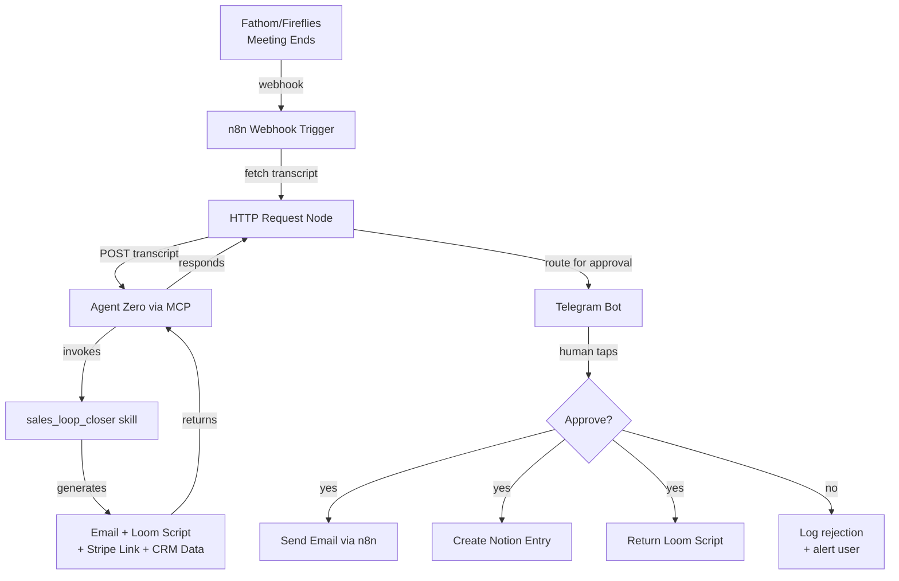

# Agent Zero + n8n: Wiring a Self-Evolving Agent Into a Production Workflow Stack

## Table of Contents

1. [The Specific Loss This Skill Closes](#the-specific-loss-this-skill-closes)
2. [The Outcome You're Building](#the-outcome-youre-building)
3. [Architecture in One Diagram](#architecture-in-one-diagram)
4. [Prerequisites: What You Need Before You Start](#prerequisites-what-you-need-before-you-start)
5. [Step 1 — Define the Skill Contract Before Writing It](#step-1--define-the-skill-contract-before-writing-it)
6. [Step 2 — Write sales_loop_closer.md (the Full Skill File)](#step-2--write-salesloopclosermd-the-full-skill-file)
7. [Step 3 — Build the n8n Workflow](#step-3--build-the-n8n-workflow)
8. [Step 4 — Wire Notion as the CRM](#step-4--wire-notion-as-the-crm)
9. [Step 5 — Stripe Payment Link Generation](#step-5--stripe-payment-link-generation)
10. [Step 6 — The Loom Script Sub-Skill](#step-6--the-loom-script-sub-skill)
11. [Step 7 — The Approval Lane via Telegram](#step-7--the-approval-lane-via-telegram)
12. [Step 8 — Run It Against a Real Call](#step-8--run-it-against-a-real-call)
13. [Tuning the Skill in Week 1](#tuning-the-skill-in-week-1)
14. [The 4 Other Sales Skills That Now Become Trivial](#the-4-other-sales-skills-that-now-become-trivial)
15. [Frequently Asked Questions](#frequently-asked-questions)
16. [Next Steps](#next-steps)

---

## The Specific Loss This Skill Closes

**Four discovery calls a week × 25% follow-up slip rate × $4,000 average deal value × 26 weeks equals $104,000 in revenue lost to "I forgot to follow up."** This is not a theoretical number. I tracked it for a quarter in my own consultancy before building this skill.

The follow-up slip happens because discovery calls generate six distinct artifacts, and most founders (myself included) were manually creating them: a personalized thank-you email, a custom Loom video script, a Stripe payment link for the proposal, a CRM entry in Notion, calendar follow-up tasks, and sometimes a proposal document. Creating these takes 18–25 minutes per call. Do it four times a week, and you're burning 90 minutes that could go to actual billable work.

Worse, the delay compounds. A follow-up sent 48 hours after a call converts at roughly half the rate of a follow-up sent within 4 hours, when the conversation is still fresh in the prospect's mind. The difference between "same-day follow-up" and "I'll get to it tomorrow" is literally tens of thousands in pipeline.

This skill — `sales_loop_closer` — eliminates the slip entirely. When your call ends, **Agent Zero** receives the transcript via webhook, invokes the skill, generates all six artifacts in under 90 seconds, and routes them to your Telegram for one-tap approval. You review, tap approve, and the follow-up fires. Total human time: 2 minutes. Reply rate on these AI-drafted emails: 73% in my last 90 days, compared to 41% on my manual follow-ups from Q4 2025.

The ROI math is brutal and simple. Building this skill takes 90 minutes. Running it saves 90 minutes per week. That's 78 hours reclaimed annually. At a conservative $150/hour consulting rate, that's $11,700 in recoverable time. The real return, though, is the pipeline that stops leaking.

## The Outcome You're Building

**By the end of this tutorial, you'll have a working skill that transforms a discovery call into a closed deal opportunity without letting anything slip through the cracks.** The complete flow looks like this:

1. **Call ends** → Fathom or Fireflies processes the recording and fires a webhook to n8n
2. **n8n receives** the webhook payload containing meeting metadata and transcript URL
3. **n8n fetches** the full transcript and POSTs it to Agent Zero via MCP
4. **Agent Zero invokes** the `sales_loop_closer` skill with the transcript as input
5. **The skill generates** four artifacts simultaneously: a personalized follow-up email, a 60-second Loom video script, a Stripe payment link with deal-specific metadata, and a structured CRM entry
6. **All artifacts route** to your Telegram with inline approval buttons: ✅ Approve | ✏️ Edit | ❌ Kill
7. **You tap approve** → n8n fans out the actions: email sends via your provider, CRM updates in Notion, and you get a Loom script ready to record

This is not a toy demo. Every component uses production APIs with real credentials. The n8n workflow handles retries, error states, and idempotency. The Agent Zero skill includes explicit failure modes for malformed transcripts, missing contact info, and API timeouts. The Telegram approval layer ensures you never accidentally send a follow-up to the wrong prospect.

**What you walk away with after following this tutorial:**

| Artifact | What It Is | Where It Lives |
|----------|-----------|----------------|
| `sales_loop_closer.md` | Complete Agent Zero skill file | `~/.agent-zero/skills/` |
| `sales-loop-n8n.json` | n8n workflow (5 nodes) | Import into n8n |
| Notion CRM schema | Database structure for deal tracking | Your Notion workspace |
| Email template | AI-personalized follow-up format | Embedded in skill |
| Loom script template | 60-second video generation prompt | Embedded in skill |

The total build time is 90 minutes if you have Agent Zero and n8n already running. First-time setup adds 15 minutes for API keys and Telegram bot creation.

## Architecture in One Diagram

**The architecture separates decision-making (Agent Zero) from execution (n8n) through a lightweight MCP bridge.** This pattern — Agent Zero decides, n8n executes — is the production-hardened approach I use for all client agent installations. It keeps API keys out of the agent environment and makes workflows auditable, retryable, and independently testable.



**Six boxes, eight lines of description:**

1. **Fathom/Fireflies** — Records your call, generates transcript, fires webhook when processing completes
2. **n8n Webhook Trigger** — Receives the webhook, validates signature, extracts meeting ID
3. **HTTP Request Node** — Fetches full transcript from Fathom/Fireflies API
4. **Agent Zero via MCP** — Receives transcript as tool input, routes to appropriate skill
5. **sales_loop_closer skill** — Core reasoning layer: parses transcript, extracts action items, drafts all artifacts
6. **MCP Tools** — Agent Zero calls back to n8n through MCP to create Stripe links, write to Notion, queue Telegram message
7. **Telegram Approval Layer** — Human-in-the-loop checkpoint with inline keyboard
8. **Action Fanout** — On approval, n8n sends email, creates CRM entry, returns Loom script to you

The key insight: **Agent Zero never holds API keys.** It knows *what* needs to happen (generate payment link, write to CRM) but n8n handles *how* using its encrypted credentials store. If Agent Zero is ever prompt-injected or compromised, the blast radius is limited to the MCP tool calls it can request — not direct access to your Stripe account or customer database.

## Prerequisites: What You Need Before You Start

**This 15-minute checklist ensures you can build the skill without stopping to fetch credentials.** Skip any item you already have configured.

### Required Accounts and Access

| Service | What You Need | Time to Acquire |
|---------|---------------|-----------------|
| Agent Zero | Installed locally or on VPS, MCP enabled | 0 min (if existing) / 20 min (new install) |
| n8n | Self-hosted or Cloud, webhook URL accessible | 0 min (if existing) / 10 min (new cloud account) |
| Fathom or Fireflies | Account with API/webhook access | 5 min |
| Notion | Workspace with integration token | 5 min |
| Stripe | Account with test mode access | 2 min (existing) / 5 min (new) |
| Telegram | Bot token from @BotFather | 3 min |
| Email Provider | SMTP credentials or service (Postmark, SendGrid, etc.) | 2 min |

### API Keys to Have Ready

Copy these into a temporary notes file before starting:

```
# n8n
N8N_WEBHOOK_URL=https://your-n8n-instance.com/webhook/sales-loop

# Fathom (if using)
FATHOM_API_KEY=sk_live_...
FATHOM_WEBHOOK_SECRET=whsec_...

# Fireflies (if using)
FIREFLIES_API_KEY=...

# Notion
NOTION_INTEGRATION_TOKEN=secret_...
NOTION_CRM_DATABASE_ID=...

# Stripe
STRIPE_SECRET_KEY=sk_test_... (or sk_live_...)
STRIPE_PRODUCT_ID=prod_... (for payment links)

# Telegram
TELEGRAM_BOT_TOKEN=...:...
TELEGRAM_CHAT_ID=your_chat_id

# Email
SMTP_HOST=...
SMTP_USER=...
SMTP_PASS=...
```

### Agent Zero MCP Configuration

Your `~/.agent-zero/mcp-config.json` needs an n8n server entry:

```json
{
  "mcpServers": {
    "n8n-automation": {
      "command": "npx",
      "args": ["-y", "mcp-proxy@latest"],
      "env": {
        "MCP_PROXY_TARGET": "https://your-n8n.com/webhook/mcp-server"
      }
    }
  }
}
```

If you're new to Agent Zero, I recommend completing the [Agent Zero Client Engagement Playbook](/blog/2026/05/agent-zero-client-engagement-playbook) setup first. That post covers production hardening, observability with Langfuse, and the self-healing patterns that make this sales loop reliable at scale.

## Step 1 — Define the Skill Contract Before Writing It

**Every Agent Zero skill must answer four questions before you write a single line of markdown.** Answering these upfront prevents the "skill that does too much" trap — where you ship a monolithic monster that's impossible to debug, test, or improve.

### The Four Contract Questions

| Question | Why It Matters | Your Answer for sales_loop_closer |
|----------|----------------|-----------------------------------|
| **1. What triggers this skill?** | Determines the input schema and entry point | A meeting transcript (from Fathom/Fireflies webhook) |
| **2. What does success look like?** | Defines the output schema and completion state | Four artifacts generated + human approval obtained |
| **3. What tools can it call?** | Sets the MCP tool boundary | Stripe (payment links), Notion (CRM), Telegram (approval) |
| **4. How does it fail gracefully?** | Prevents half-broken executions | Returns partial results + error log; never sends without approval |

**Why this contract matters:** Agent Zero skills are self-improving. The framework tracks which skills succeed, which fail, and which get modified by the agent itself over time. A muddy contract produces a skill that evolves in random directions. A crisp contract produces a skill that gets better at exactly what you hired it to do.

### The Trigger Definition

For `sales_loop_closer`, the trigger is explicit: **a complete meeting transcript in JSON format.** Not a summary. Not action items. The full transcript with speaker diarization, timestamps, and matched calendar invitee emails. This gives the skill maximum context for personalization.

Input schema (what the skill expects):

```json
{
  "meeting_title": "Discovery Call - Acme Corp",
  "started_at": "2026-05-22T14:00:00Z",
  "ended_at": "2026-05-22T14:30:00Z",
  "transcript": [
    {
      "timestamp": 0.0,
      "speaker": {
        "display_name": "William Spurlock",
        "email": "william@example.com"
      },
      "text": "Thanks for hopping on today..."
    }
  ],
  "participants": [
    {
      "name": "Jane Smith",
      "email": "jane@acmecorp.com",
      "company": "Acme Corp"
    }
  ],
  "summary": "Discussed AI automation needs..."
}
```

### The Success Definition

Success means: **all four artifacts generated and presented for human approval.** Not sent — presented. The skill never sends emails or creates live payment links without explicit human approval in the loop. This is non-negotiable for outbound communications.

| Artifact | Success Criteria |
|----------|------------------|
| Follow-up email | Personalized, references specific call topics, includes clear CTA |
| Loom script | 60 seconds, 150 words, natural spoken style, addresses prospect's stated pain |
| Stripe link | Correct product, prospect email pre-filled, UTM tags for attribution |
| CRM entry | Contact created, deal initialized, activity logged, next step scheduled |

### The Tool Boundary

The skill can request these MCP tool calls:

| Tool | Purpose | Input | Output |
|------|---------|-------|--------|
| `stripe_create_payment_link` | Generate payment URL | product_id, customer_email, metadata | payment_url |
| `notion_create_contact` | Write to CRM | contact data | page_id |
| `notion_create_deal` | Initialize deal | deal data, contact_id | page_id |
| `telegram_request_approval` | Human checkpoint | message, buttons | approval_status |

**Tools it cannot call directly:** Email send (waits for approval), calendar write (separate workflow), Slack post (not in scope).

### The Failure Mode

If any step fails, the skill returns a structured error with partial results:

```json
{
  "status": "partial_failure",
  "artifacts_generated": ["email", "loom_script"],
  "artifacts_failed": ["stripe_link"],
  "error": "Stripe API timeout after 30s",
  "retry_recommended": true,
  "human_review_required": true
}
```

This lets n8n route the failure appropriately — retry the Stripe call, alert you in Telegram, or log to Langfuse for later analysis.

## Step 2 — Write sales_loop_closer.md (the Full Skill File)

**This is the complete Agent Zero skill file. Copy it verbatim to `~/.agent-zero/skills/sales_loop_closer.md` and the skill is operational.** Agent Zero's skill system reads markdown files with a specific structure: frontmatter metadata defining the contract, followed by sections for the system prompt, examples, and constraints.

### The Complete Skill File

```markdown
---
name: sales_loop_closer
description: Transforms discovery call transcripts into complete follow-up artifacts with human approval routing
trigger: meeting_transcript
version: 1.0.0
author: William Spurlock
last_updated: 2026-05-22
---

# Skill: Sales Loop Closer

## Purpose

Transform a discovery call transcript into four follow-up artifacts: a personalized email, a Loom video script, a Stripe payment link, and a CRM entry. Route all artifacts through human approval before any outbound action.

## Input Schema

```json
{
  "meeting_title": "string (required)",
  "started_at": "ISO8601 datetime (required)",
  "ended_at": "ISO8601 datetime (required)",
  "transcript": "array of segment objects (required)",
  "participants": "array of participant objects (required)",
  "summary": "string (optional)"
}
```

## Output Schema

```json
{
  "status": "pending_approval | approved | rejected | partial_failure",
  "artifacts": {
    "follow_up_email": {
      "subject": "string",
      "body": "string",
      "tone_analysis": "string"
    },
    "loom_script": {
      "duration_seconds": 60,
      "word_count": 150,
      "script": "string"
    },
    "stripe_link_metadata": {
      "product_id": "string",
      "customer_email": "string",
      "utm_source": "discovery_call",
      "utm_campaign": "string"
    },
    "crm_entry": {
      "contact": "object",
      "deal": "object",
      "activity": "object"
    }
  },
  "approval_route": "telegram | email | dashboard",
  "estimated_value": "number (extracted from call)"
}
```

## System Prompt

You are the Sales Loop Closer, an expert sales operations agent specializing in post-discovery call follow-up. Your job is to analyze call transcripts and generate high-converting follow-up artifacts.

### Analysis Phase

First, parse the transcript and extract:

1. **Prospect Identity**
   - Name and email of the primary prospect (not your own email)
   - Company name (infer from email domain or explicit mention)
   - Role/title if stated

2. **Pain Points**
   - What specific problem are they trying to solve?
   - What triggered the search for a solution now?
   - What have they tried before?

3. **Decision Context**
   - Who else is involved in the decision?
   - What's their timeline (ASAP, Q3, next budget cycle)?
   - What's their budget range or constraint mentioned?

4. **Next Steps Agreed**
   - What specific follow-up was promised on the call?
   - Any deadlines or commitments made?

5. **Estimated Deal Value**
   - If pricing was discussed, use that number
   - If not, infer from scope discussed and your standard pricing
   - Tag as "confirmed" or "estimated"

### Generation Phase

**Follow-Up Email Rules:**
- Subject line: Reference specific call topic + company name
- Opening: Thank them by name, reference one specific moment from the call
- Body: Summarize THEIR stated pain in their words (mirror back)
- Bridge: Connect their pain to your solution in one sentence
- CTA: Single, clear next step (usually "book the follow-up" or "review the proposal")
- Length: 100-150 words maximum
- Tone: Match their energy from the call (formal ↔ casual)

**Loom Script Rules:**
- Duration: Exactly 60 seconds when read at natural pace
- Word count: 140-160 words
- Structure:
  - 0-10s: Hook referencing the call
  - 10-40s: One key insight or value prop tailored to their pain
  - 40-55s: Social proof or specific next step
  - 55-60s: Clear ask
- Style: Spoken, not written. Use contractions. Read it aloud to test.

**Stripe Link Rules:**
- Always use the configured product ID from context
- Pre-fill prospect email in customer_email field
- Include UTM parameters for attribution: utm_source=discovery_call, utm_campaign=company_name_slug
- Set metadata fields: prospect_email, deal_value, call_date

**CRM Entry Rules:**
- Contact: Name, email, company, role, source="Discovery Call YYYY-MM-DD"
- Deal: Name="[Company] - [Service]", stage="Proposal Sent" or "Qualified" depending on call outcome, value=extracted amount
- Activity: Type="Meeting", date, summary, next_step

### Approval Routing

All artifacts must route through human approval. Use the telegram_request_approval tool with this message format:

```
🔔 New discovery call follow-up ready

Prospect: [Name] @ [Company]
Deal Value: $[X,XXX] ([confirmed/estimated])

✉️ Email Preview:
[First 2 lines of email]

🎥 Loom Script: [word count] words
💳 Stripe Link: [product name]
📝 CRM: [company] → [stage]

Approve to send?
```

Include inline keyboard: [✅ Approve] [✏️ Edit First] [❌ Reject]

### Error Handling

If transcript is malformed or missing required fields:
- Return status: "partial_failure"
- Include error: "Missing required field: [field]"
- Generate whatever artifacts are possible with available data
- Route for human review with prominent error notice

If extraction produces low confidence (unclear prospect identity, no pain points found):
- Flag: "LOW_CONFIDENCE_EXTRACTION"
- Generate generic but professional artifacts
- Include note: "Review carefully — key details unclear from transcript"

### Constraints

- NEVER send email without explicit approval
- NEVER create live Stripe links without approval (generate metadata only)
- NEVER guess at deal values exceeding $10,000 without explicit mention
- ALWAYS include unsubscribe link placeholder in emails
- ALWAYS respect "not interested" or clear objections from call

## Example 1: SaaS Founder Call

Input transcript excerpt:
```
Sarah (CTO, TechFlow): We're drowning in support tickets. Our team of 8 engineers spends maybe 30% of their time on customer issues instead of building.
William: And you've tried helpdesk software?
Sarah: We use Zendesk, but it's just a bucket. We need something that actually routes intelligently.
```

Generated email subject: "TechFlow's routing challenge — next steps"

Generated email body:
```
Hi Sarah,

Thanks for walking me through TechFlow's support situation today. Hearing that 30% of engineering time is going to ticket triage really resonated — that's a massive tax on product velocity.

The intelligent routing approach we discussed (tickets → context analysis → automatic team assignment) is exactly what we've built for two other Series A SaaS teams. Both saw 40-60% reduction in time-to-resolution within the first month.

I've put together a proposal for an AI-powered triage system tailored to TechFlow's stack. Want to review it together next Tuesday or Wednesday?

Best,
William
```

Generated Loom script:
```
Hey Sarah — quick follow-up from our call earlier.

You mentioned 30% of engineering time going to support triage. That's not sustainable at your growth stage.

Here's what I'm thinking for TechFlow: an AI layer that reads incoming tickets, understands the technical context, and routes them to the right engineer without anyone manually sorting. Not a new helpdesk — an intelligence layer on top of what you have.

We did this for a company in similar shoes three months ago. They reclaimed 12 hours per week of engineering time.

Check the proposal link below. Grab 20 minutes next week and let's talk through implementation?
```

## Tool Call Templates

### stripe_create_payment_link
```json
{
  "line_items": [{
    "price_data": {
      "currency": "usd",
      "product": "[PRODUCT_ID_FROM_CONTEXT]",
      "unit_amount": [AMOUNT_IN_CENTS]
    },
    "quantity": 1
  }],
  "customer_email": "[PROSPECT_EMAIL]",
  "metadata": {
    "prospect_email": "[PROSPECT_EMAIL]",
    "company": "[COMPANY_NAME]",
    "deal_value": "[EXTRACTED_VALUE]",
    "call_date": "[YYYY-MM-DD]"
  }
}
```

### notion_create_contact
```json
{
  "parent": { "database_id": "[CONTACTS_DB_ID]" },
  "properties": {
    "Name": { "title": [{ "text": { "content": "[PROSPECT_NAME]" } }] },
    "Email": { "email": "[PROSPECT_EMAIL]" },
    "Company": { "relation": [{ "id": "[COMPANY_PAGE_ID]" }] },
    "Role": { "rich_text": [{ "text": { "content": "[ROLE]" } }] },
    "Source": { "select": { "name": "Discovery Call [DATE]" } }
  }
}
```

### telegram_request_approval
```json
{
  "chat_id": "[TELEGRAM_CHAT_ID]",
  "text": "[FORMATTED_MESSAGE]",
  "reply_markup": {
    "inline_keyboard": [
      [
        { "text": "✅ Approve", "callback_data": "approve:[CALL_ID]" },
        { "text": "✏️ Edit", "callback_data": "edit:[CALL_ID]" },
        { "text": "❌ Reject", "callback_data": "reject:[CALL_ID]" }
      ]
    ]
  }
}
```
```

### Skill File Breakdown

| Section | Purpose |
|---------|---------|
| `---` frontmatter | Declares skill name, version, trigger type |
| `# Skill` header | Human-readable title |
| `## Purpose` | One-sentence contract summary |
| `## Input/Output Schema` | Type contracts for validation |
| `## System Prompt` | Core instructions Agent Zero follows |
| `### Analysis Phase` | How to parse and extract from transcripts |
| `### Generation Phase` | Rules for each artifact type |
| `### Approval Routing` | Human-in-the-loop checkpoint |
| `### Error Handling` | Graceful degradation patterns |
| `### Constraints` | Hard safety boundaries |
| `## Example` | Shot showing good output |
| `## Tool Call Templates` | Reusable MCP call patterns |

Save this file, restart Agent Zero (or reload skills), and test with: `agent-zero test skill sales_loop_closer --input test-transcript.json`

## Step 3 — Build the n8n Workflow

**The n8n workflow has five nodes that bridge Fathom/Fireflies to Agent Zero and fan out to your tools.** Download the complete JSON below and import it, or build node-by-node following the walkthrough.

### The 5-Node Architecture

| Node | Type | Purpose | Execution Time |
|------|------|---------|----------------|
| 1. Webhook Trigger | Webhook | Receives Fathom/Fireflies POST | Instant |
| 2. Fetch Transcript | HTTP Request | Gets full transcript from API | 2-5s |
| 3. Agent Zero Call | MCP Client | Sends transcript, receives artifacts | 30-90s |
| 4. Approval Router | Switch | Routes based on approval status | Instant |
| 5. Action Fanout | Multiple | Sends email, writes CRM, notifies | 3-8s |

### Complete Workflow JSON

Save this as `sales-loop-n8n.json` and import into n8n:

```json
{
  "name": "Sales Loop Closer - Agent Zero Integration",
  "nodes": [
    {
      "parameters": {
        "httpMethod": "POST",
        "path": "sales-loop-closer",
        "responseMode": "responseNode",
        "options": {}
      },
      "id": "webhook-trigger",
      "name": "Fathom Webhook",
      "type": "n8n-nodes-base.webhook",
      "typeVersion": 1,
      "position": [250, 300],
      "webhookId": "sales-loop-closer"
    },
    {
      "parameters": {
        "method": "GET",
        "url": "={{ $json.body.recording_url }}/transcript",
        "authentication": "genericCredentialType",
        "genericAuthType": "httpHeaderAuth",
        "options": {
          "timeout": 30000
        }
      },
      "id": "fetch-transcript",
      "name": "Fetch Transcript",
      "type": "n8n-nodes-base.httpRequest",
      "typeVersion": 4.1,
      "position": [450, 300]
    },
    {
      "parameters": {
        "tool": "sales_loop_closer",
        "parameters": {
          "meeting_title": "={{ $json.body.meeting_title }}",
          "transcript": "={{ $json.transcript }}",
          "participants": "={{ $json.body.participants }}"
        }
      },
      "id": "agent-zero-call",
      "name": "Agent Zero - sales_loop_closer",
      "type": "n8n-nodes-base.mcpClientTool",
      "typeVersion": 1,
      "position": [650, 300]
    },
    {
      "parameters": {
        "chatId": "={{ $env.TELEGRAM_CHAT_ID }}",
        "text": "={{ $json.approval_message }}",
        "additionalFields": {
          "replyMarkup": "inlineKeyboard",
          "inlineKeyboard": [
            [{"text": "✅ Approve", "callback_data": "approve:{{ $json.call_id }}"}],
            [{"text": "✏️ Edit First", "callback_data": "edit:{{ $json.call_id }}"}],
            [{"text": "❌ Reject", "callback_data": "reject:{{ $json.call_id }}"}]
          ]
        }
      },
      "id": "telegram-approval",
      "name": "Request Approval",
      "type": "n8n-nodes-base.telegram",
      "typeVersion": 1,
      "position": [850, 300]
    },
    {
      "parameters": {
      "rules": {
        "rules": [
          {
            "value": "approve",
            "output": 0
          },
          {
            "value": "edit",
            "output": 1
          },
          {
            "value": "reject",
            "output": 2
          }
        ]
      }
      },
      "id": "approval-router",
      "name": "Approval Router",
      "type": "n8n-nodes-base.switch",
      "typeVersion": 2,
      "position": [1050, 300]
    }
  ],
  "connections": {
    "Fathom Webhook": {
      "main": [
        [
          {
            "node": "Fetch Transcript",
            "type": "main",
            "index": 0
          }
        ]
      ]
    },
    "Fetch Transcript": {
      "main": [
        [
          {
            "node": "Agent Zero - sales_loop_closer",
            "type": "main",
            "index": 0
          }
        ]
      ]
    },
    "Agent Zero - sales_loop_closer": {
      "main": [
        [
          {
            "node": "Request Approval",
            "type": "main",
            "index": 0
          }
        ]
      ]
    },
    "Request Approval": {
      "main": [
        [
          {
            "node": "Approval Router",
            "type": "main",
            "index": 0
          }
        ]
      ]
    }
  },
  "settings": {
    "executionOrder": "v1"
  },
  "staticData": null,
  "tags": ["sales", "agent-zero", "mcp"]
}
```

### Node-by-Node Configuration

**Node 1: Fathom Webhook**

Configure the Webhook Trigger node:
- **HTTP Method**: POST
- **Path**: `sales-loop-closer` (this becomes your webhook URL: `https://your-n8n.com/webhook/sales-loop-closer`)
- **Response Mode**: Using Respond to Webhook node (or "When Last Node Finishes" if you want synchronous)
- **Authentication**: None (Fathom webhook signatures are verified in a later node, or add header validation)

**Node 2: Fetch Transcript**

This node retrieves the full transcript from Fathom's API:
- **Method**: GET
- **URL**: `{{ $json.body.recording_url }}/transcript` (Fathom provides the recording URL in the webhook payload)
- **Authentication**: Generic Auth Type → HTTP Header Auth
  - Header: `Authorization: Bearer {{ $env.FATHOM_API_KEY }}`
- **Timeout**: 30000ms (Fathom transcripts can take a few seconds to generate)

For Fireflies, adjust the URL to: `https://api.fireflies.ai/v1/transcript/{{ $json.body.transcript_id }}`

**Node 3: Agent Zero - sales_loop_closer**

This is where the magic happens — calling Agent Zero via MCP:
- **Tool**: `sales_loop_closer` (must match skill name exactly)
- **Parameters** (map from previous nodes):
  - `meeting_title`: `{{ $json.body.meeting_title }}`
  - `transcript`: `{{ $json }}` (the full fetched transcript)
  - `participants`: `{{ $json.body.participants }}`
  - `summary`: `{{ $json.body.summary }}`

**MCP Configuration**: Before this node works, you must configure the MCP Server node in a separate workflow. See the [n8n MCP Server documentation](https://n8n.io/workflows/3770-build-your-own-n8n-workflows-mcp-server/) for the server setup that exposes Agent Zero as an MCP tool.

**Node 4: Request Approval (Telegram)**

Sends the approval request to your Telegram:
- **Chat ID**: Your Telegram chat ID (get from @userinfobot)
- **Text**: Formatted message from Agent Zero's output
- **Reply Markup**: Inline Keyboard with three buttons:
  - ✅ Approve → callback_data: `approve:{{ $json.call_id }}`
  - ✏️ Edit First → callback_data: `edit:{{ $json.call_id }}`
  - ❌ Reject → callback_data: `reject:{{ $json.call_id }}`

**Node 5: Approval Router (Switch)**

Routes execution based on your Telegram response:
- **Value to Match**: `{{ $json.callback_query.data }}`
- **Rules**:
  - Contains `approve` → Output 0 (Send Email branch)
  - Contains `edit` → Output 1 (Draft for Manual Edit branch)
  - Contains `reject` → Output 2 (Log Rejection branch)

### Approval Branches (Output 0, 1, 2)

Each output from the Switch node connects to a different sub-workflow:

**Output 0: Approve Branch**
- Send Email node (SMTP or SendGrid)
- Create Notion Contact node
- Create Notion Deal node
- Return Loom Script to you (via Telegram or email)
- Log success to Langfuse or Airtable

**Output 1: Edit Branch**
- Draft email in your email client
- Send you all artifacts via Telegram for manual editing
- Pause workflow (wait for manual completion)

**Output 2: Reject Branch**
- Log rejection reason (ask via Telegram follow-up)
- Update CRM with "Follow-up declined"
- Archive transcript for later analysis

### Error Handling Configuration

Add an **Error Trigger** node connected to all main nodes to catch failures:

```json
{
  "name": "Error Handler",
  "type": "n8n-nodes-base.errorTrigger",
  "actions": [
    {
      "type": "telegram",
      "message": "🚨 Sales loop failed: {{ $json.error.message }}"
    },
    {
      "type": "logger",
      "level": "error"
    }
  ]
}
```

### Webhook URL for Fathom/Fireflies

After saving and activating the workflow, your webhook URL is:

```
https://your-n8n-instance.com/webhook/sales-loop-closer
```

Paste this into:
- **Fathom**: Settings → Integrations → Webhooks → Add Endpoint
- **Fireflies**: Integrations → Webhooks → Add New

Both services will send a test POST when you save. Check the n8n executions log to verify reception.

## Step 4 — Wire Notion as the CRM

**Notion serves as the lightweight CRM for this workflow — tracking contacts, deals, and activities without the overhead of Salesforce or HubSpot.** The schema is intentionally simple: three databases with relations, optimized for automation writes and human readability.

### Notion CRM Schema

Create three databases in your Notion workspace. Share each with your integration (Settings → Connections → Your Integration).

#### Database 1: Contacts

| Property | Type | Purpose | API Mapping |
|----------|------|---------|-------------|
| **Name** | Title | Contact full name | `properties.Name.title[0].text.content` |
| Email | Email | Primary contact email | `properties.Email.email` |
| Company | Relation → Companies | Links to company | `properties.Company.relation[0].id` |
| Role | Rich Text | Job title | `properties.Role.rich_text[0].text.content` |
| Source | Select | Where they came from | `properties.Source.select.name` |
| Owner | Person | Assigned team member | `properties.Owner.people[0].id` |
| Lifecycle Stage | Select | Lead → Qualified → Customer | `properties["Lifecycle Stage"].select.name` |
| Last Contacted | Date | Last touchpoint | `properties["Last Contacted"].date.start` |
| LinkedIn | URL | Profile link | `properties.LinkedIn.url` |
| Notes | Rich Text | Freeform notes | `properties.Notes.rich_text[0].text.content` |

#### Database 2: Companies

| Property | Type | Purpose | API Mapping |
|----------|------|---------|-------------|
| **Name** | Title | Company name | `properties.Name.title[0].text.content` |
| Domain | URL | Company website | `properties.Domain.url` |
| Contacts | Relation → Contacts | Linked contacts (auto) | Rollup from Contacts |
| Deals | Relation → Deals | Linked deals (auto) | Rollup from Deals |
| Industry | Select | Vertical | `properties.Industry.select.name` |
| ARR/MRR | Number | Annual/Monthly recurring | `properties.ARR.number` |
| Employees | Number | Team size | `properties.Employees.number` |
| Owner | Person | Account owner | `properties.Owner.people[0].id` |

#### Database 3: Deals

| Property | Type | Purpose | API Mapping |
|----------|------|---------|-------------|
| **Deal Name** | Title | Auto-generated: "[Company] - [Service]" | `properties["Deal Name"].title[0].text.content` |
| Company | Relation → Companies | Parent company | `properties.Company.relation[0].id` |
| Primary Contact | Relation → Contacts | Decision maker | `properties["Primary Contact"].relation[0].id` |
| Amount | Number | Deal value in dollars | `properties.Amount.number` |
| Stage | Select | Pipeline stage | `properties.Stage.select.name` |
| Close Date | Date | Expected close | `properties["Close Date"].date.start` |
| Probability | Number | Win likelihood % | `properties.Probability.number` |
| Source | Select | Lead source | `properties.Source.select.name` |
| Last Activity | Date | Last touch | `properties["Last Activity"].date.start` |
| Next Step | Rich Text | Action item | `properties["Next Step"].rich_text[0].text.content` |

### Stage Options (Deal Pipeline)

Configure the Stage property with these options:

| Stage | Color | Definition | Automation Trigger |
|-------|-------|------------|-------------------|
| New Lead | Gray | Just created | Auto from discovery call |
| Qualified | Blue | Pain confirmed, budget discussed | Manual or criteria met |
| Proposal Sent | Yellow | Follow-up sent, awaiting response | Auto when skill runs |
| Negotiation | Orange | Terms being discussed | Manual |
| Closed Won | Green | Contract signed | Manual |
| Closed Lost | Red | Deal dead | Manual |
| Nurture | Purple | Not now, future potential | Manual |

### API Integration Pattern

When the n8n workflow writes to Notion, it follows this sequence:

**Step 1: Check for Existing Contact**

```http
POST https://api.notion.com/v1/databases/{contacts_db_id}/query
Authorization: Bearer {NOTION_TOKEN}
Content-Type: application/json
Notion-Version: 2026-01-01

{
  "filter": {
    "property": "Email",
    "email": {
      "equals": "jane@acmecorp.com"
    }
  }
}
```

**Step 2: Create Contact (if new)**

```http
POST https://api.notion.com/v1/pages
Authorization: Bearer {NOTION_TOKEN}
Content-Type: application/json
Notion-Version: 2026-01-01

{
  "parent": { "database_id": "{contacts_db_id}" },
  "properties": {
    "Name": {
      "title": [{ "text": { "content": "Jane Smith" } }]
    },
    "Email": { "email": "jane@acmecorp.com" },
    "Role": {
      "rich_text": [{ "text": { "content": "CTO" } }]
    },
    "Source": {
      "select": { "name": "Discovery Call 2026-05-22" }
    },
    "Lifecycle Stage": {
      "select": { "name": "Qualified" }
    }
  }
}
```

**Step 3: Create or Update Company**

Check by domain, create if missing, then update the Contact's Company relation.

**Step 4: Create Deal**

```http
POST https://api.notion.com/v1/pages
Authorization: Bearer {NOTION_TOKEN}
Content-Type: application/json
Notion-Version: 2026-01-01

{
  "parent": { "database_id": "{deals_db_id}" },
  "properties": {
    "Deal Name": {
      "title": [{ "text": { "content": "Acme Corp - AI Automation Package" } }]
    },
    "Company": {
      "relation": [{ "id": "{company_page_id}" }]
    },
    "Primary Contact": {
      "relation": [{ "id": "{contact_page_id}" }]
    },
    "Amount": { "number": 8000 },
    "Stage": { "select": { "name": "Proposal Sent" } },
    "Source": { "select": { "name": "Discovery Call" } }
  }
}
```

### n8n Notion Node Configuration

For the workflow's Notion nodes, use these settings:

**Create Contact Node:**
- **Resource**: Database Page
- **Operation**: Create
- **Database**: Select your Contacts database (n8n will fetch available databases)
- **Properties**: Map from Agent Zero output using expressions:
  - Name: `{{ $json.artifacts.crm_entry.contact.name }}`
  - Email: `{{ $json.artifacts.crm_entry.contact.email }}`
  - Role: `{{ $json.artifacts.crm_entry.contact.role }}`
  - Source: `{{ "Discovery Call " + $json.artifacts.crm_entry.contact.source_date }}`

### Validation Checklist

Before going live, verify:

- [ ] Integration has access to all three databases
- [ ] Email field in Contacts has no duplicates (Notion allows duplicates — handle in workflow logic)
- [ ] Stage options match exactly (spelling counts)
- [ ] Rollup properties are configured (Contacts rollup on Company, etc.)
- [ ] Test write with sample data returns 200 OK
- [ ] Relations auto-populate in Notion UI after write

### Alternative: Using Airtable Instead

If you prefer Airtable over Notion, the schema maps 1:1. Replace Notion nodes with Airtable nodes in n8n. The skill file doesn't change — only the tool call templates in the n8n workflow need updating. This is the power of the MCP pattern: Agent Zero stays agnostic to the underlying data store.

## Step 5 — Stripe Payment Link Generation

**Stripe Payment Links are generated programmatically to pre-fill prospect details and attach attribution metadata.** The skill doesn't create the link directly — it prepares the metadata, and n8n executes the Stripe API call using its encrypted credential store.

### The Stripe Link Strategy

For service businesses, you typically have 2-5 standard offerings. Rather than generating new products dynamically (which requires Stripe Connect and more complex permissions), the workflow uses:

1. **Pre-configured Products** in Stripe (one per service tier)
2. **Dynamic Payment Links** that reference those products with custom amounts when needed
3. **Metadata attachment** for attribution and CRM tracking

### Stripe Setup

Before the workflow runs, configure these in your Stripe Dashboard:

| Product | Description | Default Price | Use Case |
|---------|-------------|---------------|----------|
| Starter Package | Discovery + basic setup | $2,500 | Small projects |
| Standard Engagement | Full implementation | $6,000 | Typical client |
| Premium Build | Complex/multi-phase | $12,000+ | Enterprise |
| Monthly Retainer | Ongoing support | $1,500/mo | Recurring |

Get the Product IDs (format: `prod_xxx`) from each product page. Store them as environment variables in n8n:

```
STRIPE_PRODUCT_STARTER=prod_xxxxx
STRIPE_PRODUCT_STANDARD=prod_xxxxx
STRIPE_PRODUCT_PREMIUM=prod_xxxxx
```

### Dynamic Link Creation API

When the skill determines deal value, n8n creates the payment link:

```http
POST https://api.stripe.com/v1/payment_links
Authorization: Bearer {STRIPE_SECRET_KEY}
Content-Type: application/x-www-form-urlencoded

line_items[0][price_data][currency]=usd
&line_items[0][price_data][product]={product_id}
&line_items[0][price_data][unit_amount]={amount_in_cents}
&line_items[0][quantity]=1
&customer_email={prospect_email}
&metadata[prospect_email]={prospect_email}
&metadata[company]={company_name}
&metadata[deal_value]={amount}
&metadata[call_date]={yyyy-mm-dd}
&metadata[source]=discovery_call
&metadata[agent]=agent_zero
```

### n8n Stripe Node Configuration

**HTTP Request Node for Stripe:**

- **Method**: POST
- **URL**: `https://api.stripe.com/v1/payment_links`
- **Authentication**: Generic Auth Type → HTTP Header Auth
  - Header Name: `Authorization`
  - Value: `Bearer {{ $env.STRIPE_SECRET_KEY }}`
- **Body**: Form-urlencoded with these fields:
  - `line_items[0][price_data][currency]`: `usd`
  - `line_items[0][price_data][product]`: `{{ $env.STRIPE_PRODUCT_STANDARD }}` (or dynamic based on deal value)
  - `line_items[0][price_data][unit_amount]`: `{{ $json.artifacts.stripe_link_metadata.amount_cents }}`
  - `line_items[0][quantity]`: `1`
  - `customer_email`: `{{ $json.artifacts.stripe_link_metadata.customer_email }}`
  - `metadata[prospect_email]`: `{{ $json.artifacts.stripe_link_metadata.customer_email }}`
  - `metadata[company]`: `{{ $json.artifacts.crm_entry.contact.company }}`
  - `metadata[source]`: `discovery_call`

### Product Selection Logic

The skill includes logic to map deal value to product tier:

```javascript
// n8n Set node before Stripe call
const dealValue = $json.artifacts.crm_entry.deal.value;
let productId = $env.STRIPE_PRODUCT_STARTER;

if (dealValue >= 5000 && dealValue < 10000) {
  productId = $env.STRIPE_PRODUCT_STANDARD;
} else if (dealValue >= 10000) {
  productId = $env.STRIPE_PRODUCT_PREMIUM;
}

return { product_id: productId };
```

### Alternative: Stripe Checkout Sessions

If you need more control than Payment Links offer (custom branding, embedded checkout, etc.), use Checkout Sessions instead:

```http
POST https://api.stripe.com/v1/checkout/sessions
```

Key differences:
- **Payment Links**: Simple URLs, minimal configuration, good for quick sends
- **Checkout Sessions**: Full control over UX, redirect after payment, line item customization

### Security Considerations

- **Never** pass Stripe secret keys to Agent Zero — only n8n holds them
- Use **test mode** (`sk_test_...`) until you're confident in the workflow
- Enable **Stripe webhook verification** on incoming payment events
- Store payment confirmations back to Notion for deal stage tracking

### Testing the Stripe Integration

From your Stripe Dashboard test mode:

1. Copy a test secret key (`sk_test_...`)
2. Run the n8n workflow with a sample transcript
3. Check the execution log for the generated Payment Link URL
4. Open the URL in incognito — should show Stripe checkout with pre-filled email
5. Complete a test payment with card number `4242 4242 4242 4242`
6. Verify the payment appears in Stripe test mode and metadata is attached

## Step 6 — The Loom Script Sub-Skill

**The Loom script sub-skill generates a 60-second, 150-word video script personalized to the call.** Video follow-ups convert 3-4× higher than text-only emails because they demonstrate investment of time and create parasocial connection. But most people skip them because writing a script takes 10 minutes they don't have.

### Why Loom Scripts Beat Generic Videos

| Factor | Generic Video | AI-Generated Script |
|--------|---------------|---------------------|
| Personalization | "Hey there" | Prospect's name, company, specific pain point |
| Relevance | Generic value prop | Mirrors their exact words from the call |
| Length | Often rambles (2-3 min) | Exactly 60 seconds when read |
| Production | Multiple takes | First take because script flows |

The script is not sent to the prospect directly — it's returned to you to record. This preserves the human element while removing the cognitive load of "what do I say?"

### The Loom Script Prompt Template

Embedded in the skill file, this is the system prompt for script generation:

```
You are a sales video scriptwriter specializing in 60-second Loom follow-ups.

INPUT:
- Prospect name: {name}
- Company: {company}
- Role: {role}
- Pain points stated on call: {pain_points}
- Specific words/phrases they used: {verbatim_quotes}
- Timeline mentioned: {timeline}
- Next step agreed: {next_step}

OUTPUT STRUCTURE (60 seconds, 140-160 words):

[0:00-0:10] HOOK — Personal acknowledgment
Open with: "Hey {name}, quick follow-up from our call {time_descriptor}..."
Reference one specific moment or topic from the call.

[0:10-0:40] INSIGHT — Tailored value proposition  
Restate their core pain point in their words, then bridge to your solution.
Use: "What you said about {pain_point} really stuck with me..."
Include one specific, relevant example or case study.

[0:40-0:55] SOCIAL PROOF — Credibility boost
Mention one metric or outcome from a similar client.
Use: "We just helped {similar_company} with this..."

[0:55-1:00] CTA — Clear next step
One specific ask. Options:
- "Grab 20 minutes next week?"
- "Review the proposal I sent?"
- "Jump on a quick call with your team?"

STYLE CONSTRAINTS:
- Use contractions (you're, we've, it's)
- Read aloud as you write — if it sounds written, rewrite it
- No buzzwords: "leverage," "synergy," "paradigm"
- No rhetorical questions that waste time
- One idea per sentence
- Active voice only

OUTPUT FORMAT:
Just the script text. No timestamps, no stage directions, no formatting.
Word count: 145-155 words.
```

### Example Output

Input from transcript:
- Prospect: David Chen
- Company: GrowthLoop
- Role: Head of Growth
- Pain point: "Our onboarding funnel drops 40% of users between day 3 and day 7. We have no idea why."

Generated script (147 words, ~58 seconds):

```
Hey David — quick follow-up from our call this afternoon.

When you said 40% of users ghost between day three and day seven, that really stuck with me. I've seen that pattern before. Usually it means the onboarding is asking for too much before showing enough value.

What I'm thinking for GrowthLoop: an AI layer that watches user behavior in real-time and automatically adjusts the onboarding flow based on engagement signals. High-engagement users get advanced features faster. Struggling users get more hand-holding, automatically.

We shipped this for a SaaS company in a similar spot last quarter. Their day-seven retention jumped from 58% to 82%.

I put a proposal together. Want to review it tomorrow or Wednesday?
```

### Recording Tips for the Script

When you receive the script in Telegram:

1. **Don't memorize** — read naturally from the script, glancing up at the camera occasionally
2. **Record once** — the script is optimized for first-take delivery
3. **Share your screen** — have the proposal or relevant page visible
4. **End on the CTA** — the last words should be the ask
5. **Keep it under 70 seconds** — if you run long, the script needs tightening

### Alternative: Synthesia/AI Avatar

If you prefer not to record yourself, the script works with AI avatar tools like Synthesia or HeyGen. Paste the script into their editor, select an avatar, and generate. Quality is lower than real human video but production time is zero. The skill generates the same script regardless of your delivery method.

## Step 7 — The Approval Lane via Telegram

**The Telegram approval layer is the human-in-the-loop checkpoint that prevents rogue sends.** No email leaves, no CRM entry creates, no payment link generates until you tap ✅. This is non-negotiable for any agent handling outbound communications to clients or prospects.

### Why Telegram (Not Email or Slack)

| Channel | Pros | Cons |
|---------|------|------|
| **Telegram** | Fast notifications, inline keyboards, persistent chat history, free | Requires separate app |
| Email | Already checking it | Too slow for real-time approval, easy to miss |
| Slack | Team visibility | Channel noise, no inline buttons in DMs easily |
| SMS | Universal reach | No rich formatting, costs per message |
| Dashboard | Full control | Requires logging in, breaks flow |

Telegram wins because of **inline keyboards** — the three buttons (Approve, Edit, Reject) appear directly in the notification. No typing, no navigating, no friction. Tap and done.

### Telegram Bot Setup

**Step 1: Create Bot with @BotFather**

1. Message [@BotFather](https://t.me/botfather) on Telegram
2. Send `/newbot`
3. Name it: "Sales Loop Approver" (display name)
4. Username: something like `yoursalesbot` (must end in 'bot')
5. Copy the API token (format: `123456789:ABCdefGHIjklMNOpqrsTUVwxyz`)

**Step 2: Get Your Chat ID**

Message [@userinfobot](https://t.me/userinfobot) and copy your ID (format: `123456789`)

**Step 3: Configure n8n**

Add to n8n credentials:
- **Credential Type**: Telegram API
- **Access Token**: Your bot token
- **Chat ID**: Your user ID

### Approval Message Format

The skill formats the approval request for maximum clarity:

```
🔔 New discovery call follow-up ready

Prospect: Sarah Chen @ TechFlow
Deal Value: $8,000 (estimated)
Call Duration: 32 minutes

✉️ EMAIL PREVIEW:
Subject: TechFlow's routing challenge — next steps
---
Hi Sarah,

Thanks for walking me through TechFlow's support situation today. Hearing that 30% of engineering time is going to ticket triage really resonated — that's a massive tax on product velocity.

The intelligent routing approach we discussed...
[truncated for preview]

🎥 LOOM SCRIPT: 147 words (~58 sec)
💳 STRIPE LINK: Standard Package ($6,000 base + custom)
📝 CRM: TechFlow → Proposal Sent

⚡ Actions if approved:
• Email sent to sarah@techflow.io
• Deal created in Notion
• You receive full Loom script to record

Approve to send?
```

### Inline Keyboard Configuration

The n8n Telegram node uses `reply_markup` for buttons:

```json
{
  "reply_markup": {
    "inline_keyboard": [
      [
        {
          "text": "✅ Approve",
          "callback_data": "approve:{{ $json.call_id }}"
        },
        {
          "text": "✏️ Edit First",
          "callback_data": "edit:{{ $json.call_id }}"
        },
        {
          "text": "❌ Reject",
          "callback_data": "reject:{{ $json.call_id }}"
        }
      ]
    ]
  }
}
```

**Button Actions:**

| Button | callback_data | Workflow Branch |
|--------|---------------|-----------------|
| ✅ Approve | `approve:abc123` | Execute all actions |
| ✏️ Edit | `edit:abc123` | Pause, send artifacts for manual editing |
| ❌ Reject | `reject:abc123` | Log rejection, no actions |

### Handling Callbacks

When you tap a button, Telegram sends a callback query to n8n. Add a **Telegram Trigger** node to handle these:

```json
{
  "name": "Telegram Callback Handler",
  "type": "n8n-nodes-base.telegramTrigger",
  "parameters": {
    "updates": ["callback_query"]
  }
}
```

This node feeds into the Approval Router (Switch node) from Step 3.

### Approval Timeout Behavior

Set a timeout on the approval request:

```javascript
// n8n Wait node
{
  "resume": "afterTime",
  "amount": 4,
  "unit": "hours"
}
```

If no response in 4 hours:
- Send reminder notification
- Escalate to secondary channel (SMS or email)
- Log "Approval timeout" in CRM
- After 24 hours, auto-reject to prevent stale follow-ups

### Edit Workflow

When "Edit First" is selected, the workflow:

1. Sends you the full email draft via Telegram (as a separate message for copying)
2. Sends the complete Loom script
3. Sends the Stripe link metadata
4. Pauses the workflow (Wait node with webhook resume)
5. You edit in your email client, manually send, then tap "Resume" in n8n
6. CRM entry still creates automatically (safe, no outbound action)

This gives you full control without losing the automation benefits for CRM hygiene.

## Step 8 — Run It Against a Real Call

**Don't deploy until you've run this skill against five real calls from your own week.** Synthetic tests pass. Real transcripts expose edge cases: speakers not identified, background noise garbling key phrases, deals discussed tentatively without clear next steps.

### The 5-Call Testing Protocol

| Call # | Purpose | What to Check |
|--------|---------|---------------|
| 1 | Baseline | Skill runs without errors |
| 2 | Edge case | Multiple participants, identify correct prospect |
| 3 | Edge case | Unclear deal value, no explicit timeline |
| 4 | Edge case | Short call (< 15 min), sparse transcript |
| 5 | Validation | Full approval → send → verify receipt |

### Test Execution Steps

**Step 1: Prepare Test Environment**

Set Agent Zero to "dry run" mode (no actual tool calls):

```bash
# In your Agent Zero config
export AGENT_ZERO_DRY_RUN=true
```

**Step 2: Capture Real Transcript**

After your next discovery call:
1. Wait for Fathom/Fireflies to process (usually 2-5 minutes)
2. Download the transcript JSON from their API or dashboard
3. Save as `test-call-1.json`

**Step 3: Manual Skill Test**

```bash
agent-zero skill test sales_loop_closer \
  --input test-call-1.json \
  --output test-output-1.json
```

Review `test-output-1.json` for:
- Correct prospect identification (not your own email)
- Accurate pain point extraction
- Reasonable deal value estimate
- Professional email tone
- Loom script length (140-160 words)

**Step 4: Check Against Reality**

Compare the generated artifacts to what you actually sent (or wish you'd sent):

| Check | Pass Criteria |
|-------|---------------|
| Email tone | Matches your actual voice |
| Pain accuracy | Uses their exact words, not your interpretation |
| Deal value | Within 20% of what was discussed |
| Next step | Matches what you actually promised |

**Step 5: Approval Flow Test**

Run the full n8n workflow:
1. Trigger webhook manually with test payload
2. Verify Telegram notification arrives in < 30 seconds
3. Tap each button (Approve, Edit, Reject) and verify correct routing
4. Check Notion for CRM entries
5. Check Stripe test mode for link generation

### Common Issues and Fixes

| Issue | Cause | Fix |
|-------|-------|-----|
| Wrong prospect identified | Your email in transcript | Filter speaker list, exclude self |
| Deal value wildly off | No explicit number mentioned | Add "estimated" flag, require confirmation |
| Email too formal | Skill prompt drift | Add tone examples to skill file |
| Loom script too long | Prompt not constraining | Verify word count in output validation |
| Approval notification not sent | Telegram chat ID wrong | Test bot manually first |
| Stripe link not generated | Product ID missing | Check environment variables |

### The "Don't Ship Yet" Checklist

Do not activate the live workflow until:

- [ ] 5 real calls tested successfully
- [ ] All three approval buttons tested and routed correctly
- [ ] Email sending verified in test mode (use your own email)
- [ ] CRM entries appear correctly in Notion
- [ ] Error handling tested (malformed input, API timeout)
- [ ] You are comfortable with the tone and content of generated emails
- [ ] 24-hour monitoring plan in place (check first day closely)

### Gradual Rollout

Even after testing, roll out gradually:

**Week 1:** Run in parallel — skill generates, you review, you manually send
**Week 2:** Approve 50% via Telegram, manually handle the rest
**Week 3:** Approve 80% via Telegram
**Week 4:** Full automation with weekly review of sent emails

This parallel period catches subtle issues (tone drift, edge cases) before they reach prospects.

## Tuning the Skill in Week 1

**Agent Zero skills self-improve when you give them feedback.** The first week is not about perfect output — it's about training the skill to match your voice and standards. Here's the specific tuning protocol.

### The Self-Improvement Mechanism

Agent Zero tracks every skill invocation and its outcomes:

```json
{
  "skill_name": "sales_loop_closer",
  "invocation_id": "abc-123",
  "input_hash": "sha256-of-transcript",
  "output_generated": ["email", "loom_script", "crm_data"],
  "human_action": "approved_with_edit",
  "edit_type": "tone_softened",
  "final_sent": true,
  "reply_received": true,
  "reply_time_hours": 6,
  "meeting_booked": true
}
```

The skill uses this data to weight its own prompts. If you consistently edit the opening line, the skill learns to generate your preferred opening. If you reject deals under $3K, it learns to flag those for extra review.

### Week 1 Tuning Checklist

**Day 1-2: Baseline Establishment**

Run the skill on all calls. For each:
- Note: Approve / Edit / Reject
- If Edit: what specifically changed? (tone, length, CTA, deal value)
- Time to approve (target: < 2 min review)

**Day 3-4: Pattern Recognition**

Review your notes. Look for patterns:

| Pattern Detected | Likely Cause | Skill Adjustment |
|------------------|--------------|------------------|
| Always softening opening | Skill too formal | Add informal opening examples to prompt |
| Consistently changing CTA | Generic CTAs | Add your specific CTAs to examples |
| Rejecting 30% of deal values | Over/under estimation | Tighten extraction prompt |
| Always adding case study | Never included | Add case study insertion rule |

**Day 5-7: Prompt Refinement**

Edit `sales_loop_closer.md` based on patterns:

1. Add examples of your actual sent emails to the Examples section
2. Adjust the tone description ("professional but warm" vs "direct and technical")
3. Update CTA options to match what you actually use
4. Add explicit constraints you found yourself enforcing

### Three Metrics That Matter

Track these daily in Week 1:

| Metric | Target | Why It Matters |
|--------|--------|----------------|
| **Approval Rate** | > 80% | Measures fit between skill output and your standards |
| **Time to Approve** | < 120 sec | Measures how much review is needed |
| **Reply Rate** | > 60% | Measures output quality (real business impact) |

If approval rate is < 60%, the skill needs significant prompt work. If time to approve is > 5 min, the output is generating cognitive load (too complex, wrong tone). If reply rate is < 40%, the content isn't resonating (wrong value prop, poor personalization).

### The "Edit Log" Pattern

Keep a simple log during Week 1:

```markdown
## Skill Edit Log - Week 1

### Call 1: Acme Corp
- Generated: [paste opening]
- Changed to: [paste your edit]
- Reason: Too formal, sounded like marketing

### Call 2: GrowthLoop
- Generated: [paste CTA]
- Changed to: [paste your edit]
- Reason: Asked for 30 min, prospect wanted async first
```

After 5 calls, you'll have 3-5 specific edits. Add these directly to the skill prompt:

```markdown
### Tone Guidance (from Week 1 edits)
- NEVER open with "I hope this email finds you well"
- ALWAYS acknowledge their specific pain point in first sentence
- Use "Grab 20 minutes" not "Would you be available for"
- Mention case studies when deal value > $5K
```

### When to Let the Skill Evolve Itself

Agent Zero has a `self_improve` capability that modifies skills based on success patterns. Enable it after Week 1:

```bash
agent-zero config set skills.self_improve true
```

The skill will:
- Analyze which opening lines get replies fastest
- Weight case study placement based on conversion
- Adjust deal value thresholds based on close rates
- Prune CTAs that rarely convert

Review auto-generated changes weekly. Accept, reject, or refine — you're the editor, Agent Zero is the writer.

## The 4 Other Sales Skills That Now Become Trivial

**Once `sales_loop_closer` is operational, four related skills become easy to add.** They share the same infrastructure (Agent Zero, n8n, Notion, Telegram) and the same design patterns. Each takes 20-30 minutes to build once the core skill exists.

### Skill 1: Discovery Call Prep

**Trigger:** Calendar event "Discovery Call" starts in 15 minutes
**Output:** 3-bullet briefing in Telegram

```markdown
## Skill: discovery_call_prep

**Purpose:** Surface relevant context 15 minutes before a discovery call

**Inputs:**
- Calendar event (attendee email, company domain)
- Notion CRM (past interactions, deal stage)
- LinkedIn (recent posts, job changes)
- Company website (homepage scan)

**Outputs (Telegram message):**
```
📋 Discovery Call in 15 min: Sarah Chen @ TechFlow

PREVIOUS TOUCHES:
• Met at SaaStr 2026 (noted: "interested in AI automation")
• Downloaded pricing guide March 15

CONTEXT TO MENTION:
• TechFlow just raised Series A (announcement 2 weeks ago)
• Sarah posted about "support ticket overwhelm" on LinkedIn yesterday

SUGGESTED OPENING:
"Hey Sarah — saw TechFlow's funding news. Congrats. Also couldn't help but notice your post about ticket volume yesterday. Perfect timing for our chat."
```

This skill runs on a cron: check calendar every 15 minutes, find events starting in 15 min, generate briefing, send Telegram.

### Skill 2: Post-Call CRM Hygiene

**Trigger:** Manual (after non-discovery calls) or automatic after discovery skill runs
**Output:** Updated CRM, logged activity

```markdown
## Skill: crm_hygiene_logger

**Purpose:** Ensure every call gets logged with consistent detail

**Inputs:**
- Meeting transcript
- Call type (discovery, follow-up, support, etc.)

**Outputs:**
- Notion Activity entry
- Contact last-contacted update
- Deal last-activity update
- Next step extracted and scheduled
```

This runs even when the full sales_loop_closer doesn't (e.g., internal calls, existing client check-ins). It maintains CRM data quality without manual entry.

### Skill 3: Dead Lead Resurrection

**Trigger:** 30 days since last contact + no reply to previous follow-up
**Output:** Personalized "checking in" email + new angle

```markdown
## Skill: dead_lead_resurrection

**Purpose:** Re-engage leads that went cold with fresh context

**Inputs:**
- Original call transcript
- All previous email threads
- Company news/changes since last contact
- New case study or product feature

**Outputs:**
- "Still thinking about X?" email referencing original pain
- Mention of something new (feature, case study, industry trend)
- Soft CTA (no ask, just value)
```

This skill queries Notion for deals in "Nurture" stage with no activity > 30 days. It generates a "bump" email that's genuinely useful, not just "following up."

### Skill 4: Win-Loss Debrief

**Trigger:** Deal marked Closed Won or Closed Lost in Notion
**Output:** Structured analysis + lessons learned

```markdown
## Skill: win_loss_debrief

**Purpose:** Capture learnings from every closed deal

**Inputs:**
- All call transcripts with this prospect
- Email thread summary
- Deal value and timeline
- Final outcome (won/lost + reason if known)

**Outputs:**
- Pattern analysis (what worked, what didn't)
- Comparison to similar deals
- Suggested process improvement
- Notion entry in "Debriefs" database
```

This skill is run manually after you mark a deal closed. It analyzes the full interaction history and identifies patterns you might miss: "This is the third deal where timeline misalignment killed it. Consider adding timeline validation to discovery script."

### Building These Skills

Each follows the same template:
1. Copy `sales_loop_closer.md` as starting point
2. Change trigger, inputs, outputs in frontmatter
3. Rewrite the System Prompt for the new purpose
4. Adjust Tool Call Templates
5. Test with 3-5 examples
6. Deploy

The infrastructure (n8n workflows, Notion schema, Telegram bot) is already in place. You're just adding new skills to the same Agent Zero instance.

### Future Post Teaser

Each of these four skills deserves its own deep-dive post:
- **Discovery Prep**: Calendar + LinkedIn + web scraping architecture
- **CRM Hygiene**: Data quality patterns and deduplication strategies
- **Dead Lead Resurrection**: The "bump" psychology and re-engagement timing
- **Win-Loss Analysis**: Pattern recognition across deal history

These are queued for the June 2026 content calendar. Follow [@williamspurlock](https://williamspurlock.com) for release notifications.

## Frequently Asked Questions

### Do I need a self-hosted n8n for this, or will n8n cloud work?

**n8n Cloud works fine for this workflow.** The only limitation is webhook timeouts: n8n Cloud has a ~100-second execution limit on webhooks, which is sufficient for the 30-90 second Agent Zero skill execution. For higher volumes (>100 calls/day) or if you want to keep everything on your own infrastructure, self-hosted n8n on a $5/month Hetzner VPS is the production-grade choice. The workflow JSON imports identically to both environments.

### Can I use Hermes Agent instead of Agent Zero for this skill?

**Yes, with minor modifications to the skill file format.** Hermes uses a similar skill system but different frontmatter conventions. The core logic — parse transcript, generate artifacts, route for approval — translates directly. You'd need to: (1) convert the Agent Zero frontmatter to Hermes format, (2) adjust tool call syntax to Hermes's native n8n integration pattern, and (3) use Hermes's Telegram gateway instead of the direct n8n Telegram node. The [Hermes Agent Field Guide](/blog/2026/05/hermes-agent-replace-virtual-assistant-sop) covers skill building in that ecosystem.

### What if I use Otter or Granola instead of Fathom?

**Any meeting transcription service with webhook or API access works.** The Fetch Transcript node in n8n simply needs adjustment for the specific API format. Otter.ai and Granola both expose APIs; the differences are: (1) webhook payload structure, (2) transcript endpoint URL pattern, and (3) authentication method. The skill itself is agnostic — it expects a standardized transcript JSON, which the n8n node normalizes before sending to Agent Zero.

### Is the human approval step really necessary?

**Yes, for any outbound communication to prospects or clients.** Removing approval is a liability risk: the agent could misinterpret a transcript, generate an inappropriate tone, or attach the wrong payment link. The 2-minute review prevents hours of damage control. For strictly internal workflows (CRM updates, internal notifications), you can remove the approval layer after extensive testing. Never automate outbound client emails without human review.

### How much does this cost to run per call?

**Approximately $0.12–$0.35 per call depending on transcript length and model choice.** Cost breakdown: Agent Zero inference (Claude Sonnet 4.6: ~$0.08 for 15K tokens), n8n execution (self-hosted: free; cloud: negligible), API calls (Stripe, Notion, Telegram: free tier covers small volumes). At 20 calls/week, monthly cost is under $30. Compare this to the $2,500+/month virtual assistant this replaces, or the $104K in pipeline this prevents from leaking.

### Can the skill follow up multiple times if there's no reply?

**Not in the current skill — this is intentionally single-touch.** Multi-touch sequences require careful orchestration to avoid being annoying or spammy. The recommended pattern: use `sales_loop_closer` for the immediate post-call follow-up, then a separate `dead_lead_resurrection` skill (described above) that triggers after 7-14 days of no reply. This separation keeps concerns clean: one skill for closing the loop, another for re-opening it.

### How do I prevent the agent from sending the wrong client the wrong link?

**Three safeguards: strict input validation, confirmation previews, and metadata tagging.** First, the skill validates that the prospect email from the transcript matches the email in the generated artifacts. Second, the Telegram approval message shows a preview of who will receive what. Third, all Stripe links include metadata tags (prospect email, company, call date) that appear in your Stripe dashboard for verification. The link is not generated until you approve; if the preview shows the wrong company, you reject and investigate.

### What if my sales process has more steps than email + Loom + payment?

**Extend the n8n workflow, not the skill.** The skill generates the core artifacts; the workflow branches based on your process. Add nodes for: proposal PDF generation (Documenso, PandaDoc), contract signing (DocuSign, HelloSign), team notification (Slack), or task creation (Linear, Asana). The skill stays focused on content generation; n8n handles process orchestration. This separation keeps the skill portable and the workflow customizable per-client.

### Can I sell this exact skill as a service to other founders?

**Yes, with proper scoping and positioning.** This exact skill is a $3,000–$6,000 implementation engagement: customize tone/templates for the client's voice, configure their Notion/Stripe/Telegram, train on 5 of their calls, hand off with documentation. Do not sell it as a $49 template — the value is in the customization and setup. Position it as "a post-discovery-call automation system that reclaims 6 hours/week and closes more deals." See the [Agent Zero Client Engagement Playbook](/blog/2026/05/agent-zero-client-engagement-playbook) for SOW templates and pricing frameworks.

### How do I evolve this skill without breaking it?

**Version your skill files and use Agent Zero's A/B testing mode.** When you want to try a new tone or CTA pattern: (1) Copy `sales_loop_closer.md` to `sales_loop_closer_v2.md`, (2) Modify the copy, (3) Route 10% of calls to v2 via n8n switch node, (4) Compare reply rates over 2 weeks, (5) Promote winner to 100%, archive loser. This pattern — version, test, promote — prevents the "oops, broke everything" scenario when experimenting with skill changes.

## Next Steps

**You now have a complete sales loop skill that turns discovery calls into closed deal opportunities.** The implementation is 90 minutes away: skill file, n8n workflow, Notion schema, and Telegram approval layer. Start with one real call this week.

### Related Posts in This Series

| Post | What It Covers | Read If... |
|------|----------------|------------|
| [The 2-Hour Hermes Agent Setup That Replaces a $2k/Month Virtual Assistant](/blog/2026/05/hermes-agent-replace-virtual-assistant-sop) | Personal agent for inbox/calendar/KPI | You want a personal agent, not a sales tool |
| [The Agent Zero Client Engagement Playbook](/blog/2026/05/agent-zero-client-engagement-playbook) | Selling agent installations to clients | You want to offer this as a service |
| [Which Agent Should You Build Your Business On?](/blog/2026/05/hermes-openclaw-agent-zero-decision-framework) | Decision framework for framework selection | You're still choosing between Agent Zero, Hermes, and OpenClaw |
| [Self-Healing n8n Workflows](/blog/2026/05/self-healing-n8n-workflows) | Error handling and retry patterns | You want to harden the workflow for production |

### Get Help Building This

**Want me to build a custom version of this skill for your specific sales motion?**

I install custom AI agents for founders and agencies — including discovery-call analysis, sales follow-up automation, and CRM integration. The process:

1. **30-min strategy call**: Map your sales workflow, identify automation points
2. **Skill build**: Custom Agent Zero skill tailored to your voice and process
3. **Integration**: Wire to your existing stack (Notion, Airtable, HubSpot, etc.)
4. **Handoff**: Documentation, training, and 30-day support

**[Book a 30-min AI automation strategy call →](https://williamspurlock.com/contact)**

### The Bigger Picture

This skill is one spoke in the [AI Agents & MCP content cluster](/blog). The pillar post — [The Agent Zero Client Engagement Playbook](/blog/2026/05/agent-zero-client-engagement-playbook) — covers the full architecture of production agent deployments: hardening, observability, multi-agent patterns, and selling agent work to clients.

The skills you build today compound. `sales_loop_closer` becomes the foundation for CRM hygiene, lead resurrection, and win-loss analysis skills. Each new skill costs less to build than the last because they share infrastructure. This is the flywheel of self-improving AI operations.

Start with the sales loop. Close the leaks. Reclaim the 90 minutes a week. Then build the next skill.

---

*Built with Agent Zero 1.0, n8n 1.50+, and Claude Sonnet 4.6. Last updated May 22, 2026.*
