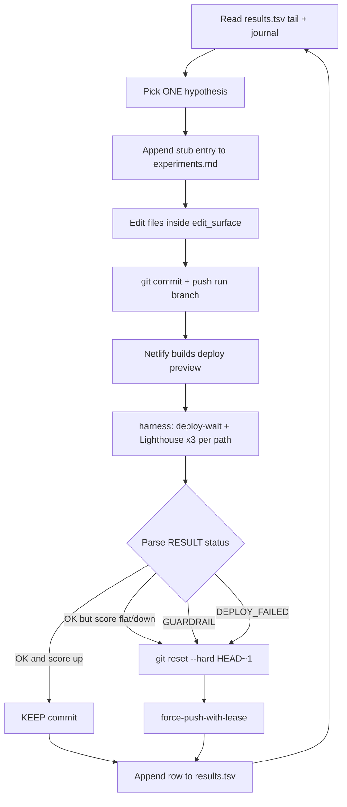

# AutoSEO: The Autonomous Agent Loop That Improves Your SEO While You Sleep

Most "AI SEO" is a dashboard that tells you what to fix. AutoSEO is an agent that fixes it, verifies the fix against a real deploy, and keeps the change only if a measured score went up. No human in the loop. The output isn't a report — it's a git history of validated improvements you can read in the morning.

I built it after watching Andrej Karpathy ship [autoresearch](https://github.com/karpathy/autoresearch) in March 2026 — a tiny loop where an agent edits a training script, runs a fixed evaluation, and keeps only the edits that move a single number. The insight that makes it work is brutal in its simplicity: **if you can collapse "did this help?" into one scalar, an agent can hill-climb it forever without supervision.** Karpathy's scalar was validation bits-per-byte. Mine is a composite Lighthouse score.

So I ported the pattern. Point AutoSEO at a deployed site, give it an edit surface, hand it a Lighthouse harness that prints exactly one `RESULT:` line, and let it run. Every round it forms a hypothesis ("preload the hero image to win LCP"), edits the source, commits to a dedicated branch, pushes, waits for the Netlify preview to go live, runs Lighthouse three times per page, and reads the score. If the number went up and no category cratered, the commit stays. If not, `git reset --hard HEAD~1` and try something else. The site can only get better, because the ratchet only turns one way.

Here's a real result before the architecture. I pointed it at a site that scored **44 on mobile and 66 on desktop** in PageSpeed at baseline — a heavy single-page app dragging an 11.9 MB autoplay video and a 1.1 MB icon font through the critical path. After 22 autonomous rounds in a single afternoon, **mobile performance climbed to 67 and desktop into the high 90s**, and largest-contentful-paint on the audited pages dropped **45%** (15.5s → 8.4s on throttled mobile). I did nothing during the run but read the journal it left behind.

This post is the full architecture: the three-file contract, the eval harness, the keep-or-revert ratchet, the deploy loop, the seed-idea library the agent draws from, the guardrails that stop it from gaming one metric, and the complete receipts from that run. I'll also be honest about where it breaks and where it stops being SEO and starts being something you shouldn't automate yet.

> **TL;DR.** AutoSEO is the autoresearch pattern adapted for SEO + performance. An AI agent runs an overnight experiment loop against your deployed site, scored by a read-only Lighthouse harness that emits one number. A git ratchet keeps only commits that raise the composite score without dropping any category below its floor. You wake up to validated improvements — and the rest auto-reverted — not a to-do list.

## What AutoSEO Actually Is

**AutoSEO is a closed optimization loop: an AI agent edits your site's source, deploys it, measures the result with Lighthouse, and keeps the edit only if a single composite score improved.** It is not a chatbot that gives advice and it is not a crawler that flags issues. It is a system that makes changes and proves they helped, autonomously, one commit at a time.

The whole thing rests on a measurement contract. The harness deploys whatever is on the run branch, runs Lighthouse three times per page across `performance`, `seo`, `best-practices`, and `accessibility`, and prints one line:

```text
RESULT: score=91.50 perf=67 seo=100 best=100 a11y=99 lcp_ms=8443 cls=0.001 inp_ms=13 status=OK commit=3d354b2
```

That `score` is the agent's entire world. Everything it does is in service of making that number bigger on the next round than it was on the last. Because the score is computed from the *real deployed site* — not a guess, not a localhost build — the agent can't hallucinate a win. The deploy either scored higher or it didn't.

In plain English, one round looks like this:

1. Read the last 20 rows of `results.tsv` and the experiment journal — what's been tried, what stuck.
2. Form one hypothesis. "The Material Symbols icon font ships ~1.1 MB; subset it to the 57 glyphs the site actually uses and LCP should drop."
3. Edit the source files (only those inside the allowed `edit_surface`).
4. Commit to the `autoseo/run-<tag>` branch and push.
5. Wait for the Netlify deploy preview of that exact commit to go `ready`.
6. Run Lighthouse, parse the `RESULT:` line.
7. **Decide:** score up and no guardrail tripped → keep the commit. Otherwise `git reset --hard HEAD~1` and force-push.
8. Append a row to `results.tsv`, write up the verdict, go to step 1.

Repeat 20–50 times. The site ratchets upward. You read the ledger in the morning.

## Why "Set It and Forget It" SEO Tools Fail

**Every SEO tool I've used stops at the recommendation. AutoSEO doesn't — and that gap is the entire reason it works.** A Lighthouse report, an Ahrefs site audit, a Search Console coverage list: all of them produce a list of things a human then has to interpret, prioritize, implement, deploy, and re-measure. The bottleneck was never *knowing* what to fix. It was the loop of implement → ship → verify → decide, repeated across dozens of small changes, most of which don't pan out.

Here's what breaks in practice with the recommendations-only model:

| Failure mode | Why it happens | What AutoSEO does instead |
|---|---|---|
| Recommendations rot | The audit is a snapshot; by the time you act, the site changed | Re-measures the live deploy every single round |
| No verification | You "fix" something and assume it helped | Keeps a change *only* if the measured score rose |
| One-axis tunnel vision | You chase a perf win and silently tank accessibility | Per-category floors reject any commit that drops a category |
| Noise gets mistaken for signal | A single Lighthouse run swings ±2 points | Median of 3 runs per page, mean across pages |
| Changes never get reverted | Failed experiments pile up as dead code | Non-wins are `git reset --hard` — the tree stays clean |

The deeper point: an audit optimizes your *attention*. AutoSEO optimizes the *site*. The difference is a feedback loop that closes without you. A recommendation is a hypothesis someone else has to test. AutoSEO tests its own hypotheses and throws away the ones that fail, which is most of them — in the real run below, 14 of 21 experiments were reverted. That's not a flaw. That's the system doing the tedious, low-yield work of elimination so you don't have to.

## The Three-File Contract Borrowed From Autoresearch

**Karpathy's autoresearch is three files: a candidate the agent edits, a read-only evaluator, and a human-edited "research org code" file. AutoSEO keeps that exact contract.** The genius of the three-file split is the separation of powers. The agent can only touch the candidate. The evaluator is sacred — if the agent could edit the thing that scores it, it would just rewrite the scorer to always return 100. And the research file is yours: the steering wheel you turn between runs.

| autoresearch | autoseo | Who edits it |
|---|---|---|
| `train.py` (agent-editable candidate) | the target site's source, scoped by an `edit_surface` glob | **The agent** |
| `prepare.py` (read-only eval harness) | `harness/eval.mjs` — deploys, waits, runs Lighthouse, prints one scalar | **Nobody** (the contract) |
| `program.md` (human-edited research org code) | `targets/<slug>/program.md` — goals, constraints, seed ideas | **You**, between runs |

There's a fourth artifact that isn't in Karpathy's original but earns its place: `results.tsv`, the ground-truth ledger. Twelve tab-separated columns, one row per experiment:

```text
commit_sha  score  perf  seo  best  a11y  lcp_ms  cls  inp_ms  status  hypothesis  category
```

`status` is one of `BASELINE | KEPT | REVERTED | GUARDRAIL | DEPLOY_FAIL`. `category` tags which pillar the hypothesis targeted — `PERF | TECH_SEO | ON_PAGE | A11Y | BEST_PRACTICES`. This file is the agent's memory across rounds and your analytics surface afterward. Want to know which category produced the most wins? One line of `awk`:

```bash
awk -F'\t' '$10=="KEPT" {print $12}' targets/<slug>/results.tsv | sort | uniq -c
```

The `edit_surface` is the safety boundary. It's a glob array where first-match-wins and `!`-prefixed entries are exclusions. The agent is told, in `program.md`, that it may edit *only* files matching the surface and may never touch `harness/`, `target.config.json`, `results.tsv`, CI configs, or `package.json` dependencies. That's how you let an autonomous agent loose on a real repo without it deciding to "fix" your deploy config at 3 a.m.

```json
"edit_surface": [
  "app/src/**/*.{ts,tsx,js,jsx,mjs,cjs,css,scss,html}",
  "app/public/**",
  "app/index.html",
  "!**/*.test.*",
  "!**/*.spec.*",
  "!app/node_modules/**",
  "!.autoseo/**"
]
```

## The Eval Harness: Turning SEO Into a Single Number

**The hard part of autonomous optimization isn't the agent — it's defining the scalar. AutoSEO's scalar is the mean of four Lighthouse categories, each scored 0–100.** That's it:

```text
score = mean(performance, seo, best_practices, accessibility)
```

A flat average is a deliberate choice. It refuses to let the agent treat SEO as a single axis. A site that's fast but inaccessible, or perfectly accessible but un-indexable, scores worse than a balanced one. The four categories are the four things Google's own tooling measures, so optimizing the mean is a decent proxy for "make this site objectively better across the board."

But a raw Lighthouse run is noisy, so the harness does two layers of aggregation before it trusts a number:

- **Median across runs, per page.** Each page is audited `lighthouse_runs` times (default 3). The harness takes the *median* per category and per vital — resilient to a single bad run where Chrome stalled or a network hiccup tanked one score.
- **Mean across pages.** The per-page medians are averaged. A three-page site can't be gamed by overfitting the homepage; if you list `/`, `/shop`, `/about`, and `/blog`, all four count equally.

Here's the actual reducer — pure functions, no I/O, unit-tested without a browser, because the scoring logic is too important to be entangled with Chrome:

```javascript
// score.mjs — median per category/path, mean across paths, 0..1 -> 0..100
export function score(pathResults, guardrail, prevBest = null) {
  const perPath = pathResults.map(medianPathRow);

  const perCategoryRaw = {};
  for (const k of CATEGORY_KEYS) {
    const vals = perPath.map((p) => p.categories[k] ?? 0);
    perCategoryRaw[k] = mean(vals) * 100;
  }

  const perCategory = {
    perf: round0(perCategoryRaw["performance"]),
    seo: round0(perCategoryRaw["seo"]),
    best: round0(perCategoryRaw["best-practices"]),
    a11y: round0(perCategoryRaw["accessibility"]),
  };

  const composite = round1(
    (perCategory.perf + perCategory.seo + perCategory.best + perCategory.a11y) / 4
  );

  const { status, guardrailViolations } = applyGuardrail(perCategory, guardrail, prevBest);
  return { composite, perCategory, vitals, status, guardrailViolations };
}
```

The harness also tracks the Core Web Vitals — LCP, CLS, and Total Blocking Time as the lab stand-in for INP (real INP needs field data; lab can't capture user input). Those vitals don't feed the composite directly, but they're logged every round so you can see *why* a perf score moved. In the real run, watching `lcp_ms` fall from 15,490 to 8,443 told the whole story even when the rounded perf score plateaued.

One more design rule worth stealing: **the harness is read-only and never modifies a file.** Its only output is stdout. On any failure — deploy timeout, Chrome crash, bad config — it still prints a `RESULT:` line with a failure status so the agent's parser never breaks:

```text
RESULT: score=0.00 perf=0 ... status=DEPLOY_FAILED commit=abc1234 error="..."
```

The agent treats anything that isn't `OK` or `REJECTED_GUARDRAIL` as "abort this round, revert, move on." Failures are just another verdict.

## The Ratchet: Keep-or-Revert as a Git Operation

**The ratchet is the part people underestimate. It's not a database or a state machine — it's `git`. A kept experiment is a commit that survives. A failed one is `git reset --hard HEAD~1`.** Because the only commits that stay on the branch are ones that raised the score, the branch is monotonic by construction. There is no way for the site to drift downward over a run, because every regression is physically erased from history.

The decision logic the agent runs after each `RESULT:` line:

```text
status=OK  and  score > best_score_so_far   → KEEP    (do nothing; the commit stays)
status=OK  and  score <= best_score_so_far  → REVERTED (git reset --hard HEAD~1)
status=REJECTED_GUARDRAIL                    → GUARDRAIL (revert)
status=DEPLOY_FAILED | EVAL_ERROR            → DEPLOY_FAIL (revert, don't retry same idea)
```

Note the **strict greater-than**. A tie reverts. This is intentional and slightly ruthless: if a change doesn't *beat* the current best, it doesn't earn a place in history. It keeps the branch tight and forces the agent toward changes with real signal instead of lateral shuffles. The cost is that genuinely-good changes sometimes lose to noise (more on that in the variance section) — which is exactly why the agent learns to *bundle* small wins so their combined delta clears the noise band.

The revert is a force-push-with-lease back to the run branch:

```bash
git -C "$TARGET_REPO" reset --hard HEAD~1
git -C "$TARGET_REPO" push --force-with-lease
```

`--force-with-lease` instead of `--force` is a guardrail of its own: it refuses to overwrite the remote if someone (or another process) pushed in the meantime. On a dedicated `autoseo/run-<tag>` branch that nobody else touches, that's belt-and-suspenders, but it's the kind of default that saves you the one time it matters.

This is why AutoSEO is safe to run unattended in a way that "let the AI refactor my site" is not. The blast radius of any single round is one commit on a throwaway branch, and the worst outcome of a bad idea is that it gets erased a minute later. You merge the run branch to `main` only after reviewing the diff yourself.

## The Deploy Loop: A Netlify Preview Is the Test Bench

**AutoSEO scores the deployed site, never localhost. The reason is simple: Google ranks the deployed site, so the deployed site is the only honest test bench.** Localhost lies. It has no CDN, no edge caching, no real TLS handshake, no production bundle splitting, no compression headers. A change that looks like a win against `vite dev` can be a wash — or a regression — once Netlify's pipeline gets hold of it. The only way to know is to ship it and measure the thing the world will actually load.

So every round pushes a commit, and the harness waits for Netlify to build and publish a deploy preview for *that exact commit SHA* before it runs Lighthouse. `deploy-wait.mjs` polls the Netlify deploys API and matches on `commit_ref`:

```javascript
// deploy-wait.mjs — poll until the deploy for this commit reaches a terminal state
const TERMINAL_OK = new Set(["ready"]);
const TERMINAL_FAIL = new Set(["error", "rejected"]);

export function pickDeployForCommit(deploys, commitSha) {
  return deploys.find(
    (d) => typeof d.commit_ref === "string" && d.commit_ref.startsWith(commitSha)
  ) ?? null;
}
```

It pulls the 20 most recent deploys each tick, finds the one whose commit matches, and watches its `state`. The in-flight states (`building`, `uploading`, `processing`, and a half-dozen others) mean "keep waiting." `ready` returns the preview URL; `error` or `rejected` throws a `DEPLOY_FAILED` the agent treats as a reverted round. The default timeout is 8 minutes, which covers cold builds on most sites — large SPAs on a fresh branch can need more, so it's an env knob (`AUTOSEO_DEPLOY_TIMEOUT_S`).

Two non-obvious gotchas the real run surfaced, both worth knowing before you wire this up:

- **Branch deploys must be enabled for the run branch.** Netlify defaults `allowed_branches` to `["main"]`. If the `autoseo/run-<tag>` branch isn't allowed, previews never trigger and every round times out. The fix is a one-time `PATCH /sites/:id` to add the run branch (and restore it after).
- **Prerendering uses a desktop viewport.** If the site uses a prerender step (Puppeteer, prerender.io, etc.), it likely renders at desktop size and runs `useEffect`. Any mobile-vs-desktop branching in components needs a user-agent check, or the static HTML that Lighthouse mobile scrapes won't match what real mobile users get. The agent actually tripped on this — its first "serve a light hero image on mobile" attempt failed because the prerendered HTML still embedded the desktop `<video>`. It diagnosed the cause from the journal and fixed it on the next round with a prerender-UA gate. More on that below.

The deploy loop is also the only provider-specific part of the whole system. Swap this one file and AutoSEO runs on Vercel or Cloudflare Pages — covered later.

## The Agent Loop, Round by Round

**You kick the agent off with one prompt that points it at `program.md` and tells it to run the loop until a stopping condition. From there it's autonomous.** The kickoff prompt is deliberately terse — all the real instructions live in `program.md`, which is the source of truth the agent re-reads each round:

```text
You are running an autoseo experiment loop for target "<slug>".

Read targets/<slug>/program.md and follow its "Experiment Loop" section exactly.
Source of truth for goals, constraints, edit_surface, and stopping rules is
program.md + target.config.json — do not improvise around them.

Continue this loop until ANY of these is true:
  - results.tsv has 50 or more rows since BASELINE.
  - 8 hours have elapsed since you started.
  - 5 consecutive rounds have ended in REVERTED, GUARDRAIL, or DEPLOY_FAIL.

When you stop, write a short summary to experiments.md.
Start now. Begin by reading program.md.
```

The flow of a single round, visualized:



Two procedural rules matter more than they look:

- **Write the journal stub *before* editing.** The agent appends a Round-N entry with the category and hypothesis to `experiments.md` before it touches a file. This forces it to commit to a falsifiable claim up front, so the journal reads like a lab notebook — hypothesis, then result, then verdict — instead of a post-hoc rationalization.
- **One hypothesis per round, diffs ≤ 30 LOC.** Small, isolated changes are the only way to attribute a score move to a cause. If the agent bundles five unrelated edits and the score drops, it has no idea which one did it. (The exception — bundling *confirmed-direction* wins to beat noise — comes later, and it's earned, not default.)

The stopping conditions deserve a note. The "5 consecutive non-wins" rule is the important one: it's the signal that the seed-idea list is exhausted *for this run*. When the agent hits it, the right move isn't to keep flailing — it's to stop, summarize what it learned, and let you iterate `program.md` with new ideas derived from the latest Lighthouse audit before cutting a fresh branch. The system is explicitly designed to hand control back to the human when it runs out of road.

## The Research Directions: What the Agent Actually Tries

**The seed-idea library in `program.md` is the actual "skill." It's a curated menu of Lighthouse-measurable SEO and performance levers, each tagged with the category it targets.** This is the file you iterate between runs — strike exhausted ideas, add new ones from the latest audit. The agent prefers untried items from this list and only invents its own hypotheses when the menu is spent.

The library is organized by the five categories that map to the `results.tsv` `category` column:

### Performance / Core Web Vitals (`PERF`)

- **LCP — preload the hero image.** Add `<link rel="preload" as="image" fetchpriority="high">` for the above-fold LCP element; never `loading="lazy"` it.
- **LCP — kill render-blocking above the fold.** Inline critical CSS (<10 KB), defer the rest with the `media="print"` onload swap.
- **LCP — reduce TTFB.** Edge-cache HTML; verify `Cache-Control: s-maxage`.
- **CLS — reserve space.** Explicit `width`/`height` or `aspect-ratio` on every image and embed; `font-display: swap` + `preconnect` for custom fonts.
- **INP/TBT — shrink main-thread JS.** Code-split routes; replace heavy synchronous third-party scripts.
- **Assets — convert and compress.** AVIF/WebP via `<picture>` + `srcset`; minify HTML/CSS/JS; Brotli at the CDN; `immutable` caching on versioned assets.

### Technical SEO (`TECH_SEO`)

- **Crawlability.** Audit `robots.txt` for accidental blocks; validate the XML sitemap returns 200 on every listed URL.
- **Canonicalization.** Self-referencing `<link rel="canonical">`; one canonical host; ≤1 redirect hop.
- **Structured data — highest rich-result ROI.** JSON-LD per page type: `WebSite` + `SearchAction` on `/`, `Person`/`Organization` on `/about`, `Article` on posts, `FAQPage` on FAQs, `BreadcrumbList` on inner pages.
- **HTTPS + security baseline.** Force HTTPS, eliminate mixed content, set HSTS — Best Practices depends on it.

### On-Page SEO (`ON_PAGE`)

- **Title tags.** Front-load the primary keyword, 50–60 chars, unique per page.
- **Meta descriptions.** 120–155 chars, benefit-driven, keyword-bearing; Lighthouse flags missing ones directly.
- **Heading hierarchy.** Exactly one H1 with the target keyword; logical H2/H3 nesting (this category produced a third of the real run's wins).
- **Image alt + filenames.** Descriptive alt (missing alt is an a11y deduction); keyword-rich hyphenated filenames.
- **Internal linking.** Hub-and-spoke with descriptive anchors; every key page gets ≥2 inbound internal links.

### Accessibility (`A11Y`) — direct composite impact

- **Semantic landmarks** (`<header>`, `<main>`, `<nav>`, `<footer>`) with `aria-label` on repeated regions.
- **Skip-to-content link** as the first focusable element.
- **Accessible labels** on icon-only buttons and links.
- **Color contrast ≥ 4.5:1** (WCAG AA) on every text/background pair.
- **`:focus-visible` rings** — kill global `outline: none`.

### Mobile / Best Practices (`BEST_PRACTICES`)

- **Viewport meta tag** present (SEO and Best Practices both flag its absence).
- **Tap targets ≥ 44×44 px** with ≥8 px spacing.
- **No deprecated/insecure APIs** (`document.write`, sync XHR, HTTP resources).
- **Open Graph + Twitter Card completeness** — `og:image` ≥1200×630, full card meta on every path.

That's the menu. Notice it's all *objective and measurable*. There's nothing in there like "improve content quality" — because Lighthouse can't score that, and a metric the agent can't measure is a metric it can't optimize. The discipline of the seed list is keeping every idea inside the harness's field of view.

## Guardrails: Stopping One-Axis Hill-Climbing

**A naive maximizer will happily trade 6 accessibility points for 4 performance points if the composite nets positive. The guardrails forbid that. Any commit that drops a single category more than its floor is rejected, even when the average went up.** This is the difference between optimizing a number and optimizing a site.

The floors are per-category and asymmetric, because the categories aren't equally fragile:

```json
"guardrail": {
  "perf_floor_drop": 5,
  "seo_floor_drop": 2,
  "best_floor_drop": 3,
  "a11y_floor_drop": 3
}
```

Performance gets the loosest floor (5 points) because it's the noisiest axis — a 3-point perf wobble is usually variance, not a real regression. SEO gets the tightest (2 points) because most SEO issues are binary cliffs: a page is either indexable or it isn't, the canonical tag is either right or wrong. A 2-point SEO drop almost always means something actually broke.

The check runs against the previous best, not the previous round, so the agent can never erode a hard-won category over time:

```javascript
// applyGuardrail — reject if any category fell more than its floor vs the best
export function applyGuardrail(perCategory, guardrail, prevBest) {
  if (!prevBest) return { status: "OK", guardrailViolations: [] };
  const floors = { perf: 5, seo: 2, best: 3, a11y: 3, ...guardrail };
  const violations = [];
  for (const k of Object.keys(floors)) {
    const drop = (prevBest[k] ?? 0) - (perCategory[k] ?? 0);
    if (drop > floors[k]) violations.push(`${k} dropped ${drop}pt (floor ${floors[k]}pt)`);
  }
  return {
    status: violations.length ? "REJECTED_GUARDRAIL" : "OK",
    guardrailViolations: violations,
  };
}
```

When a guardrail trips, the round is logged as `GUARDRAIL` and reverted exactly like a score regression. The agent sees the violation string in stderr and learns the category it just hurt, which steers its next hypothesis. In the real run the guardrails never actually fired — the floors are loose enough that they're a safety net, not a straitjacket — but their presence is what lets you walk away from the keyboard. Without them, an unsupervised maximizer on a long run *will* eventually find a perf win that quietly guts your accessibility, and you won't notice until a screen-reader user does.

## A Real Run: From a 44/66 Baseline Into the High 90s

**I ran AutoSEO against a real production site — a heavy React SPA for a cannabis brand — for one afternoon. It went from a 44 mobile / 66 desktop PageSpeed baseline to a 67 mobile / high-90s desktop, with a 45% LCP cut, across 22 autonomous rounds.** Inside the harness, the composite (mean of all four categories on throttled mobile) tracked from **87.00 to 91.50**. Here's the full progression of every commit that survived the ratchet:

| Round | What KEPT | Composite | Perf | A11Y | LCP (ms) |
|---|---|---|---|---|---|
| BASELINE | — | 87.00 | 56 | 92 | 15,490 |
| R3 | Heading order + footer contrast | 87.80 | 56 | 95 | 15,160 |
| R5 | Mobile hero still + prerender-UA gate | 88.80 | 60 | 95 | 15,381 |
| R6 | **Material Symbols subset to 57 icons** | 90.00 | 65 | 95 | 8,986 |
| R10 | Footer h4→h3 hierarchy | 90.30 | 65 | 96 | 8,968 |
| R11 | Shop decorative h3/h4 → p | 90.80 | 67 | 96 | 9,006 |
| R17 | **Bundled font/image preload + a11y fixes** | **91.50** | **67** | **99** | **8,443** |

The headline numbers from BASELINE to final:

- **Composite: 87.00 → 91.50** (+4.50)
- **Mobile performance: 56 → 67** in the harness (median-of-3, throttled); the one-shot PageSpeed baseline read 44, so the real-world mobile gain is even larger
- **Desktop performance: 66 → high 90s** (PageSpeed)
- **Accessibility: 92 → 99** (+7)
- **SEO + Best Practices: 100 → 100** (held — already maxed, guardrails kept them there)
- **LCP: 15,490 ms → 8,443 ms** (−45%)

And the part nobody advertises: **6 KEPT, 14 REVERTED, 0 guardrail/deploy failures** across 21 experiments (round 13 was aborted before running). Two-thirds of the agent's ideas didn't beat the ratchet and were erased. That's the system working. The single biggest win was R6 — subsetting the Material Symbols icon font from 1.12 MB down to 16 KB by passing only the 57 glyphs the site actually used. That one change nearly halved LCP across all four audited pages. The second-biggest, R17, wasn't a new idea at all — it was the agent *stacking four small previously-reverted wins* so their combined delta finally cleared the noise band. Which brings up the most interesting thing it learned.

## What the Agent Figured Out That I Wouldn't Have

**The journal is where AutoSEO earns its keep. Reading it back, the agent surfaced four insights about this specific codebase that I'd have spent days finding by hand.** These are pulled verbatim from the `experiments.md` it wrote during the run:

**1. Bundle small confirmed wins to beat variance.** Single-axis perf changes kept losing to Lighthouse's ±2 simulated-throttle noise — a preload that genuinely shaved 350 ms of LCP would register as a flat composite and get reverted. The agent noticed the pattern across rounds 14–16, then in R17 it stacked four small confirmed-direction wins (font preload + image preload + two contrast fixes) into one commit. Combined delta: +0.70 composite and the breakout to 91.50. It learned to fight noise with magnitude.

**2. Chase critical-path resources, not byte-weight audits.** Round 7 resized oversized product images — a textbook "wasted bytes" Lighthouse recommendation — and the score didn't move. Why? The product images were below the fold and lazy-loaded, so their weight never touched LCP. The agent wrote the lesson down: *"chase critical-path resources, not byte-weight audits, when LCP-blocked."* That's a senior-engineer instinct, derived empirically.

**3. Don't defer the stylesheet that registers your LCP element's font.** Three separate rounds tried the `media="print"` onload swap to defer Google Fonts CSS. All three reverted. The H1 was the LCP element, and it couldn't paint in its real font until `@font-face` registered — deferring the stylesheet pushed the final LCP paint *later*, not earlier. The agent concluded the preload-without-defer combo was strictly better for an H1-LCP page and stopped trying the swap.

**4. The prerender-UA gate.** Its first mobile-hero attempt (R4) failed because the Puppeteer prerenderer ran at a desktop viewport and embedded the heavy `<video>` into the static HTML that Lighthouse mobile scrapes. R5 fixed it by detecting the prerender user-agent and skipping the desktop swap, so the prerendered HTML kept the 46 KB still image. This is the non-obvious half of any mobile/desktop split on a prerendered site, and the agent found it by reading its own failure.

It also mapped the ceiling honestly. Every audited page's LCP was an H1 wrapped in a `framer-motion` `<motion.div>`, so the text couldn't paint until hydration. The agent's closing note: past 91.50 the composite oscillates in the low 90s, and breaking through requires a *structural* change — dropping framer-motion off the hero LCP wrapper or self-hosting the fonts — which it correctly flagged as the top hypothesis for the next run rather than burning rounds it couldn't win.

## The Variance Problem (and Why Median-of-3 Exists)

**Lighthouse simulated throttling has an inherent ±2-point swing between identical runs. Every honest automated-optimization system has to confront this, or it will chase ghosts forever.** Two consecutive audits of the byte-for-byte same deploy can read 65 and 67 on performance. If your ratchet trusts a single run, it will "keep" pure noise and "revert" real wins with equal confidence, and the run becomes a random walk.

AutoSEO handles variance with three compounding defenses:

| Defense | What it does | Why it matters |
|---|---|---|
| **Median of 3 runs/page** | Discards the outlier run | A single stalled audit can't tank a real win |
| **Mean across pages** | Averages per-page medians | One flickery page can't dominate the verdict |
| **Strict-greater ratchet** | Ties revert, only real gains stay | Prevents noise from being banked as progress |

The strict-greater rule is the controversial one. It means a change that's genuinely +0.5 better but lands inside the noise band on its measured round gets reverted — a false negative. The real run is full of these: R8, R16, R20 all made objectively correct changes (font preload that cut LCP 350 ms, inlined `@font-face`) that the score couldn't confirm. The system's answer isn't to loosen the ratchet — that would let noise through as wins. It's the bundling strategy the agent discovered: stack enough confirmed-direction changes that the *combined* delta exceeds the variance band. R17 cleared it; the single-change versions never could.

The practical tuning advice that falls out of this: **don't set your category floors below 2 unless you bump `lighthouse_runs` to 5+.** A floor tighter than the noise band will fire on phantom regressions. If you need finer resolution, buy it with more runs (more wall-clock per round) rather than a tighter floor (more false rejections). And one Lighthouse 12.x footgun the run uncovered the hard way: the `throttling` config value must be the exact string the version expects, or it silently reports `perf=0` — a reminder that the harness is only as honest as its configuration.

## Setting Up Your Own Target in Five Commands

**Bootstrapping a new site is two scripts and a config edit.** The repo is built so adding a target never touches the harness — you only ever configure and steer.

```bash
# 1. Install + set your Netlify token
cd ~/autoseo && npm install
cp .env.example .env          # set NETLIFY_AUTH_TOKEN

# 2. Bootstrap a target (creates targets/<slug>/)
./scripts/setup-target.sh personal-site /Users/me/wjs-site <netlify_site_id> wjs

# 3. Verify lighthouse_paths + edit_surface in the generated config
$EDITOR targets/personal-site/target.config.json

# 4. Cut a run branch + collect the BASELINE row
./scripts/new-run.sh personal-site may26

# 5. Open Cursor in ~/autoseo, paste the kickoff prompt, walk away
```

`setup-target.sh` does one clever thing worth calling out: it scans your local skill files (`seo-optimization`, `website-ui-ux-crack`) and appends any actionable bullets into the new target's `program.md` seed list. Your accumulated SEO knowledge becomes the agent's starting menu automatically.

The config knobs you actually tune, all in `target.config.json`:

| Field | What it controls |
|---|---|
| `lighthouse_paths` | URL paths to score. Composite = mean across all. Start with 1–3 representative pages. |
| `lighthouse_runs` | Median is taken across N runs. 3 is the default; bump to 5+ for tighter floors. |
| `form_factor` | `mobile` (what Google ranks on, default) or `desktop`. |
| `throttling` | `simulated` (deterministic, default), `devtools`, or `provided`. |
| `edit_surface` | Glob array of what the agent may touch. First match wins; `!` excludes. |
| `guardrail.*_floor_drop` | Per-category max allowed drop vs. the current best. |
| `deploy_url_override` | Pin a stable preview alias instead of the per-commit URL. |

The single most important setup decision is `lighthouse_paths`. Pick the pages that actually matter — homepage plus your two or three highest-intent templates. Every path you add multiplies the per-round wall-clock (deploy is shared, but it's `runs × paths` Lighthouse audits), so four paths at three runs is twelve audits per round. That's the right trade for a money site and overkill for a landing page.

## Adapting It to Vercel or Cloudflare Pages

**The deploy poller is the only provider-specific file in the entire system. The scoring, the ratchet, the guardrails, the agent loop — all of it is provider-agnostic.** That's a direct consequence of the read-only-harness contract: the harness only needs two things from your host, a way to know a commit's deploy is live and the URL to hit. Everything downstream operates on a URL and a commit SHA.

To port to Vercel or Cloudflare Pages you swap exactly one function — the equivalent of `waitForNetlifyDeploy` — to poll that platform's deployments API instead:

```javascript
// vercel adapter sketch — same contract: resolve a commit SHA to a ready URL
async function waitForVercelDeploy({ projectId, commitSha, token }) {
  // GET https://api.vercel.com/v6/deployments?projectId=...&meta-githubCommitSha=<sha>
  // poll until readyState === "READY", return { deployUrl: `https://${d.url}` }
}
```

Cloudflare Pages is the same shape against `GET /accounts/:id/pages/projects/:project/deployments`, matching on the deployment's commit hash and waiting for `latest_stage.status === "success"`. The terminal-state vocabulary differs per platform — Netlify says `ready`, Vercel says `READY`, Cloudflare nests it under stages — but the logic ("find the deploy for this commit, wait until it's live, hand back the URL") is identical. `config.deploy_provider` already exists as the switch; v1 just ships the Netlify path. Wiring a second adapter is an afternoon, not a rewrite, which is exactly the point of keeping the provider surface to one file.

A simpler universal fallback exists too: `deploy_url_override`. If your host gives you a stable branch-deploy alias (e.g. `branch-name--site.pages.dev`), pin it and the harness skips commit-matching entirely — it just waits a fixed beat and scores the alias. Less precise (you're trusting the alias updated), but provider-agnostic out of the box.

## Where AutoSEO Stops and AEO/GEO Begins

**AutoSEO optimizes classic SEO and performance because that's what Lighthouse measures. Answer Engine Optimization and Generative Engine Optimization — getting cited by AI Overviews, ChatGPT, and Perplexity — need a different scorer, and you must keep them separate.** This is a design rule, not a limitation I'm hand-waving past. The moment you blend "Lighthouse score" and "AI-citation readiness" into one composite, you've created a metric that means nothing, because the two measure fundamentally different things and trade off against each other in non-obvious ways.

What a future `--mode aeo` harness would score instead of Lighthouse categories:

- **Schema coverage and density** — `FAQPage`, `Article`, `HowTo`, `Organization` JSON-LD present and valid per page type.
- **`llms.txt` completeness** — the emerging convention for telling AI crawlers what your site is and where the good content lives.
- **Citation-ready chunking** — are answers extractable as self-contained blocks? Does each H2 lead with a direct answer an LLM can lift?
- **Entity disambiguation** — is it clear *which* "William Spurlock" / "AutoSEO" / "n8n" this page is about, via `sameAs` and consistent entity mentions?
- **FAQ schema density** — the single highest-leverage AEO move, since it doubles your structured-data surface for free.

The architectural decision is that AutoSEO runs in either `--mode lighthouse` (today) or `--mode aeo` (the roadmap), **never blended**. Two scorers, two ledgers, two ratchets. You'd run a Lighthouse pass to harden performance and a separate AEO pass to harden citation-readiness, and you'd read them as two independent reports. If you want the deep version of the AEO playbook, I broke it down in [Programmatic SEO at Scale](/blog/2026/05/programmatic-seo-10k-pages-n8n-workflow) and the quality-gate thinking that keeps generated content citable rather than spammy.

## Limits, Failure Modes, and the Honest Caveats

**AutoSEO is a Lighthouse maximizer, and Lighthouse is a proxy for quality, not quality itself. Treat the score as a floor to clear, not a god to worship.** Here's where it bites, stated plainly:

- **It can't see your design.** The biggest risk on a client site is the agent chasing a perf point by stripping something that mattered visually — removing a font weight, killing an animation, flattening a layout. Lighthouse won't flag it because Lighthouse doesn't know what the site is *supposed* to look like. **The mitigation is the v2 roadmap item I consider non-optional for client work: a Playwright screenshot-diff gate that rejects any commit whose rendering drifts past a threshold, before the score is even consulted.** Until that's wired, you review every diff before merging the run branch to `main`. I do not let AutoSEO touch `main` directly. Ever.
- **Lighthouse isn't revenue.** A 91 composite doesn't mean the page converts. The agent optimizes what it can measure, which is necessary but not sufficient. It hardens the technical foundation so your content and offer can do their job — it doesn't write the content or design the offer.
- **It plateaus on structural ceilings.** As the real run showed, once the easy wins are spent, further gains need architectural changes (drop framer-motion off the LCP path, self-host fonts) that exceed a 30-LOC experiment. The agent correctly *recognizes* these and hands them back to you rather than flailing — but it won't make them autonomously, and it shouldn't.
- **A single agent has no critic.** The current loop is a lone proposer. The strongest version — Karpathy floats this too — is a **proposer + critic pair**, where a second agent reviews each diff before commit and catches style regressions, over-aggressive deletions, and edits the scalar can't see. That's the next build.
- **The scalar is the whole game, so a bad scalar is a bad outcome.** If you measure the wrong pages, or set floors that let noise through, the agent will faithfully optimize garbage. The harness is honest, but it's only as honest as `target.config.json`.

None of these are reasons not to run it. They're the operating manual. AutoSEO does the tireless, low-glamour elimination work — try, measure, revert, repeat, fifty times overnight — that humans are bad at because it's boring and we get attached to our hypotheses. It hands you a clean branch of validated wins and an honest journal of what didn't work. You bring the judgment about whether a 45% LCP cut was worth the one font weight it dropped. That division of labor is the whole pitch.

## FAQ: Autonomous SEO Agents

### What is AutoSEO in one sentence?

**AutoSEO is an autonomous AI agent loop that edits your deployed site, scores the result with Lighthouse, and keeps only the commits that raise a single composite score — hands-off, overnight.** It's a port of Andrej Karpathy's autoresearch pattern with the metric swapped from validation bits-per-byte to the mean of Lighthouse's performance, SEO, best-practices, and accessibility scores. The output is a git branch of validated improvements, not a recommendations report.

### Is this just another AI SEO tool?

**No — most AI SEO tools stop at recommendations; AutoSEO closes the loop by implementing, deploying, measuring, and deciding.** A traditional tool audits your site and hands you a to-do list. AutoSEO runs that list itself: it forms a hypothesis, edits the source, ships it to a real deploy preview, measures with Lighthouse three times per page, and either keeps the change or `git reset --hard`s it. The bottleneck it removes isn't *knowing* what to fix — it's the tedious implement-ship-verify-revert loop that humans rarely sustain across dozens of micro-experiments.

### Does the agent ever make my site worse?

**No, by construction — the ratchet only keeps commits that beat the current best score, and per-category guardrails reject any change that drops a category below its floor.** Every failed experiment is physically erased with `git reset --hard HEAD~1`, so the run branch is monotonic. In the real 22-round run, 14 of 21 experiments were reverted with zero net regressions. The one risk Lighthouse can't catch is visual drift, which is why you review the diff before merging to `main` and why a screenshot-diff gate is the top v2 priority.

### How is this different from programmatic SEO?

**Programmatic SEO generates many new pages from a data source; AutoSEO optimizes the technical quality of pages that already exist.** They're complementary. You'd use [programmatic SEO](/blog/2026/05/programmatic-seo-10k-pages-n8n-workflow) to spin up 10,000 location or product pages from one n8n workflow, then point AutoSEO at the templates those pages render from to maximize their Lighthouse scores. One scales breadth, the other ratchets depth.

### Do I need to babysit the agent while it runs?

**No. You paste one kickoff prompt and walk away — the agent runs until it hits a stopping condition (50 rounds, 8 hours, or 5 consecutive non-wins).** It reads `program.md` each round for its instructions, logs every experiment to a journal, and writes a run summary when it stops. The deliberate stopping rule on consecutive non-wins exists precisely so it hands control back to you when its idea menu is exhausted, instead of spinning. You review the journal and the diff afterward.

### Why score a live deploy instead of localhost?

**Because Google ranks the deployed site, and localhost lies.** Localhost has no CDN, no edge caching, no production bundle, no real TLS handshake, and no compression headers. A change that looks like a win against the dev server can be a wash or a regression once the host's build pipeline processes it. AutoSEO pushes each commit, waits for the deploy preview of that exact SHA to go live, and scores the bytes the world will actually load. It's slower per round but it's the only honest measurement.

### Can it work on Vercel, Cloudflare, or a custom host?

**Yes — the deploy poller is the only provider-specific file; everything else is host-agnostic.** v1 ships the Netlify adapter. Porting to Vercel or Cloudflare Pages means swapping one function to poll that platform's deployments API and match a commit SHA to a ready URL — an afternoon of work, not a rewrite. There's also a `deploy_url_override` escape hatch that pins a stable branch-deploy alias for any host without writing an adapter at all.

### Will it optimize for AI search (AEO/GEO) too?

**Not in v1, and deliberately as a separate mode when it lands.** Lighthouse measures classic SEO and performance. Answer Engine and Generative Engine Optimization — schema density, `llms.txt`, citation-ready chunking, entity disambiguation — need their own scorer. The design rule is two modes, `--mode lighthouse` and `--mode aeo`, never blended into one composite, because mixing them produces a metric that means nothing. You'd run them as two independent passes with two independent ledgers.

### How much does a run cost in inference tokens?

**It depends on the agent model and round count, but a 22-round run is a few hours of an agentic coding model's time — the dominant cost is wall-clock on deploys and Lighthouse, not tokens.** Each round is one hypothesis, a small diff (≤30 LOC), and parsing a single `RESULT:` line, so per-round token use is modest. The roadmap includes a per-round cost tracker that logs tokens next to the score, so you can see which categories give the best score-gain per dollar of inference — useful for deciding where to point the next run.

### What kind of site benefits most from AutoSEO?

**Heavy, real-world sites with a lot of technical low-hanging fruit — large SPAs, image-heavy storefronts, sites with bloated fonts or render-blocking assets.** The bigger the gap between current and achievable Lighthouse scores, the more the agent has to work with; the real run started at a 44 mobile baseline precisely because the SPA was dragging an 11.9 MB video and a 1.1 MB icon font through the critical path. A site that's already a lean 98 has little for the agent to ratchet — though even there it'll find the last few accessibility and on-page points.

## Stop Auditing. Start Ratcheting.

The reason SEO debt accumulates isn't ignorance — it's that the implement → ship → measure → decide loop is tedious, and most experiments fail, so it never gets run consistently. AutoSEO turns that loop into something a machine does overnight while you sleep, and hands you a clean branch of validated wins in the morning. A 44/66 baseline into the high 90s, a 45% LCP cut, 14 dead-end ideas erased so you never had to chase them — that's one afternoon of an agent doing the boring part.

If you want this wired up for your own sites — the harness, the seed library tuned to your stack, the deploy adapter for your host, and the guardrails set so you can actually walk away — that's exactly the kind of autonomous growth-engineering system I build for clients.

**[Book a 30-minute AI automation strategy call](/contact)** and we'll scope an AutoSEO loop for your stack — target pages, edit surface, deploy adapter, and the steering file that turns your SEO knowledge into the agent's playbook.

---

*Continue your growth engineering journey with these related guides:*
- [Programmatic SEO at Scale: 10K Pages from One n8n Workflow](/blog/2026/05/programmatic-seo-10k-pages-n8n-workflow) — Generate the pages; let AutoSEO ratchet their quality.
- [Build a Self-Healing n8n Workflow with Claude as the Recovery Agent](/blog/2026/05/self-healing-n8n-workflow-claude-recovery) — The error-recovery pattern that keeps any autonomous loop running unattended.
- [The MCP Architecture Guide](/blog/2026/05/mcp-architecture-guide) — How agents talk to tools, the foundation under every autonomous system here.
