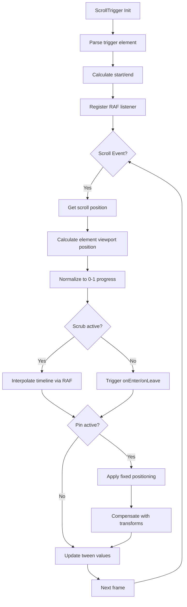

# GSAP ScrollTrigger Architecture: Pixel-Perfect Scroll Storytelling

**GSAP ScrollTrigger remains the dominant library for scroll-driven animations in 2026** because it offers unmatched timeline precision, hardware-accelerated transforms, and a battle-tested API that designers have relied on for over a decade. While CSS Scroll-Driven Animations have gained browser support, they lack the orchestration depth, scrubbing fidelity, and cross-browser consistency that premium brand experiences demand.

This is a technical deep-dive for designer-developers building $15k–$50k immersive websites. I cover the architecture patterns that separate amateur scroll effects from award-winning experiences: pinning strategies, parallax layering, horizontal scroll systems, timeline scrubbing, snap points, and scroll-linked video. Every pattern includes production-ready TypeScript/React code.

---

## Why ScrollTrigger Still Beats CSS Scroll-Driven Animations in 2026

**CSS Scroll-Driven Animations have reached production-ready status in Chromium and Safari, but they still lack the precision control, complex timeline orchestration, and cross-browser consistency that premium scroll experiences demand.** Firefox remains the holdout — CSS scroll timelines are still behind a feature flag as of May 2026. GSAP handles the edge cases CSS cannot: dynamic start/end points, scrubbed timelines with multiple overlapping tweens, pin management, snap behavior, and consistent 60fps performance across all major browsers.

### The CSS Scroll-Driven Animations Gap

Browser support for `animation-timeline: scroll()` has stabilized in Chrome 115+, Edge 115+, Safari 16.4+, and Samsung Internet 23+. Firefox 150+ still requires a user-enabled flag, making CSS scroll timelines a progressive enhancement rather than a primary architecture choice for sites serving Firefox users.

| Capability | CSS Scroll-Driven | GSAP ScrollTrigger |
|------------|-------------------|-------------------|
| Firefox support | ❌ Behind flag (2026) | ✅ Fully supported |
| Dynamic start/end points | ❌ Fixed CSS only | ✅ JavaScript-calculated |
| Scrubbed timeline with child tweens | ❌ Single animation | ✅ Full timeline composition |
| Snap to nearest section | ❌ Manual scroll-snap | ✅ ScrollTrigger snap plugin |
| Pin elements mid-scroll | ⚠️ Limited sticky | ✅ Full pin with transforms |
| Cross-browser consistency | ⚠️ Safari/Chromium only | ✅ Normalized engine |
| Debug/visualize triggers | ❌ Devtools only | ✅ Built-in visualizer |
| React state integration | ❌ Manual imperative | ✅ Clean useGSAP hook |

For simple fade-ins and basic parallax on modern Chrome/Safari audiences, CSS scroll timelines work. For complex scroll storytelling — where sections pin for 300% viewport height, scrub through 20+ layered animations with precise timing, and snap to exact positions — GSAP remains the only professional choice that works everywhere your clients' customers browse.

CSS Scroll-Driven Animations work for simple parallax or fade-ins. For complex scroll storytelling — where sections pin, scrub through 20+ layered animations, and snap to precise positions — GSAP is the only professional choice.

---

## ScrollTrigger Core Architecture: How the Engine Works

**ScrollTrigger operates on a scroll-position-to-timeline-progress mapping system.** It calculates where the trigger element sits relative to the viewport, converts that position to a 0–1 progress value, then drives a GSAP timeline (or direct tween) to the corresponding point. This decouples scroll position from animation frame timing, enabling butter-smooth scrubbing even on 120Hz displays.

### The ScrollTrigger Lifecycle



Understanding this flow matters because **performance issues almost always stem from scroll listener thrashing** — running heavy calculations on every scroll event. ScrollTrigger avoids this by using a single global scroll listener and `requestAnimationFrame`-based interpolation for scrubbed animations. The actual DOM writes happen on the animation frame, never the scroll thread, maintaining 60fps even during rapid scroll gestures.

### Key 2026 Pattern: matchMedia for Responsive Scroll

Modern ScrollTrigger implementations use `gsap.matchMedia()` to conditionally enable scroll effects based on viewport size. This prevents mobile devices from struggling with desktop-heavy pinning and scrubbing:

```typescript
import { gsap } from 'gsap';
import { ScrollTrigger } from 'gsap/ScrollTrigger';

gsap.registerPlugin(ScrollTrigger);

// Create responsive scroll effects
gsap.matchMedia().add({
  // Desktop: full scroll experience
  "(min-width: 1024px)": () => {
    const tl = gsap.timeline({
      scrollTrigger: {
        trigger: '.hero',
        start: 'top top',
        end: '+=200%',
        pin: true,
        scrub: 1,
      }
    });
    
    tl.to('.headline', { y: -100, opacity: 0 })
      .from('.next-section', { y: 100, opacity: 0 }, '<');
    
    // Return cleanup function
    return () => tl.kill();
  },
  
  // Tablet: reduced effects
  "(min-width: 768px) and (max-width: 1023px)": () => {
    gsap.to('.headline', {
      scrollTrigger: {
        trigger: '.hero',
        start: 'top 80%',
        end: 'top 20%',
        scrub: true,
      },
      y: -50,
      opacity: 0.5
    });
    
    return () => ScrollTrigger.getAll().forEach(st => st.kill());
  },
  
  // Mobile: minimal scroll effects, no pinning
  "(max-width: 767px)": () => {
    // Simple fades only
    gsap.utils.toArray('.reveal').forEach((el) => {
      gsap.from(el, {
        scrollTrigger: {
          trigger: el,
          start: 'top 85%',
          toggleActions: 'play none none reverse',
        },
        opacity: 0,
        y: 30,
        duration: 0.6
      });
    });
    
    return () => ScrollTrigger.getAll().forEach(st => st.kill());
  }
});
```

This architecture ensures premium desktop experiences without sacrificing mobile performance — a critical pattern for sites targeting diverse device ranges.

---

## Pinning Strategies for Section-Based Scroll Stories

**Pinning locks an element in place while the scroll position continues advancing, creating the illusion of scroll progression while content animates.** This is the core mechanic behind full-screen scroll sections, horizontal scroll takeovers, and complex reveal sequences. Get pinning wrong and your layout collapses; get it right and the experience feels cinematic.

### Basic Pin Pattern

The simplest pin locks a section while animations play through:

```typescript
import { gsap } from 'gsap';
import { ScrollTrigger } from 'gsap/ScrollTrigger';
import { useGSAP } from '@gsap/react';

gsap.registerPlugin(ScrollTrigger);

function PinnedHero() {
  useGSAP(() => {
    const tl = gsap.timeline({
      scrollTrigger: {
        trigger: '.hero-section',
        start: 'top top',
        end: '+=200%', // Pin for 2 viewport heights worth of scroll
        pin: true,
        scrub: 1, // 1-second lag for smooth feel
      }
    });

    tl.to('.headline', { y: -100, opacity: 0, duration: 0.3 })
      .to('.subhead', { y: -50, opacity: 0, duration: 0.2 }, '<')
      .from('.next-content', { y: 100, opacity: 0, duration: 0.5 });
  }, []);

  return (
    <section className="hero-section h-screen relative">
      <h1 className="headline absolute inset-0 flex items-center justify-center text-6xl">
        Pinned Headline
      </h1>
    </section>
  );
}
```

### Push vs. Overlay Pin Behavior

When pinning, ScrollTrigger must decide how to handle subsequent page content:

| Behavior | Setting | Effect |
|----------|---------|--------|
| Push | `pinSpacing: true` (default) | Adds spacer div equal to pin duration, pushing later content down |
| Overlay | `pinSpacing: false` | Later content scrolls underneath, pin overlays it |

Use `pinSpacing: true` for sequential storytelling where each section has its own viewport time. Use `pinSpacing: false` for overlapping transitions where one section fades over the next.

### Pin Performance: Avoiding Layout Thrash

The most common pin mistake is **animating width, height, or top/left properties** — these force layout recalculation on every frame. Always use transforms:

```typescript
// ❌ BAD — Triggers layout on every frame
gsap.to('.pinned', { width: '100vw', height: '100vh' });

// ✅ GOOD — GPU-accelerated transforms only
gsap.to('.pinned', { 
  scale: 1.2,
  y: -50,
  rotation: 5 
});
```

### Nested Pins and Z-Index Management

When pinning multiple sequential sections, z-index stacking determines which section appears on top during transitions:

```typescript
useGSAP(() => {
  // Section 1: base layer
  gsap.timeline({
    scrollTrigger: {
      trigger: '.section-1',
      start: 'top top',
      end: '+=150%',
      pin: true,
      pinSpacing: true,
    }
  });
  
  // Section 2: higher z-index to overlay section 1 exit
  gsap.timeline({
    scrollTrigger: {
      trigger: '.section-2',
      start: 'top top',
      end: '+=200%',
      pin: true,
      pinSpacing: true,
    }
  });
}, []);
```

```css
.section-1 { z-index: 10; }
.section-2 { z-index: 20; }
.section-3 { z-index: 30; }
```

This stacking ensures clean visual handoffs between pinned sections. Without proper z-index management, pinned elements can appear to "flicker" or render behind their predecessors during the unpin transition.

---

## Parallax Layering: Creating Depth Through Motion

**Parallax creates perceived depth by moving foreground and background layers at different speeds as the user scrolls.** ScrollTrigger makes this trivial with scrubbed tweens tied to scroll progress, but the *architecture* of your layers determines whether the effect feels polished or amateur.

### The Three-Layer Parallax Stack

Professional parallax uses three distinct depth planes:

```typescript
useGSAP(() => {
  // Background layer — slowest (0.2x scroll speed)
  gsap.to('.layer-bg', {
    y: 200,
    scrollTrigger: {
      trigger: '.parallax-container',
      start: 'top bottom',
      end: 'bottom top',
      scrub: true
    }
  });

  // Midground layer — medium (0.5x scroll speed)  
  gsap.to('.layer-mid', {
    y: 100,
    scrollTrigger: {
      trigger: '.parallax-container',
      start: 'top bottom',
      end: 'bottom top',
      scrub: true
    }
  });

  // Foreground layer — fastest (1x scroll speed, implicit)
  // Content scrolls normally, no transform needed
}, []);
```

### Will-Change and Layer Promotion

For smooth parallax on lower-end devices, hint the browser to promote layers to their own compositor surfaces:

```css
.parallax-layer {
  will-change: transform;
  /* Or use translateZ for older Safari */
  transform: translateZ(0);
}
```

Remove `will-change` after animation completes to free GPU memory:

```typescript
.onComplete(() => {
  gsap.set('.parallax-layer', { willChange: 'auto' });
})
```

### Parallax Depth Math

The perceived depth of a parallax layer depends on its speed ratio relative to scroll. Use this formula to calculate transform values:

```typescript
// depthRatio: 0 = stationary, 1 = normal scroll, >1 = faster than scroll
// 0.2 = background (moves 20% of scroll distance)
// 0.5 = midground (moves 50% of scroll distance)
// 0.8 = near-foreground (moves 80% of scroll distance)

function createParallaxLayer(
  element: string, 
  depthRatio: number, 
  maxScroll: number = 500
) {
  const moveDistance = maxScroll * (1 - depthRatio);
  
  gsap.fromTo(element, 
    { y: -moveDistance / 2 },
    {
      y: moveDistance / 2,
      scrollTrigger: {
        trigger: element,
        start: 'top bottom',
        end: 'bottom top',
        scrub: true,
      }
    }
  );
}

// Usage
createParallaxLayer('.bg-mountains', 0.2, 800);
createParallaxLayer('.midground-trees', 0.5, 400);
createParallaxLayer('.foreground-text', 0.9, 100);
```

This formula ensures your layers move at perceptually consistent speeds regardless of viewport height or content length.

---

## Horizontal Scroll Takeovers: The Architecture

**Horizontal scroll sections convert vertical scroll input into horizontal content movement, creating a narrative detour within a vertical page.** This pattern appears in nearly every Awwwards-winning brand site, but implementation details separate the professional from the broken.

### The Vertical-to-Horizontal Translation Pattern

```typescript
function HorizontalSection() {
  const containerRef = useRef<HTMLDivElement>(null);
  const trackRef = useRef<HTMLDivElement>(null);

  useGSAP(() => {
    const container = containerRef.current;
    const track = trackRef.current;
    if (!container || !track) return;

    const scrollWidth = track.scrollWidth - window.innerWidth;

    gsap.to(track, {
      x: -scrollWidth,
      ease: 'none',
      scrollTrigger: {
        trigger: container,
        start: 'top top',
        end: () => `+=${scrollWidth}`,
        pin: true,
        scrub: 1,
        invalidateOnRefresh: true, // Recalculate on resize
      }
    });
  }, []);

  return (
    <section ref={containerRef} className="h-screen overflow-hidden">
      <div ref={trackRef} className="flex h-full" style={{ width: 'fit-content' }}>
        <div className="w-screen flex-shrink-0">Panel 1</div>
        <div className="w-screen flex-shrink-0">Panel 2</div>
        <div className="w-screen flex-shrink-0">Panel 3</div>
      </div>
    </section>
  );
}
```

### Key Implementation Details

| Detail | Why It Matters |
|--------|----------------|
| `invalidateOnRefresh: true` | Recalculates scroll distance on resize — critical for responsive |
| `ease: 'none'` | Linear progress mapping — any easing breaks scroll-to-progress fidelity |
| `+=${scrollWidth}` dynamic end | Ensures scroll distance matches actual content width |
| `width: 'fit-content'` on track | Prevents flex wrapping, enables proper scrollWidth calculation |

### Horizontal Scroll with Panel-Specific Animations

Advanced horizontal scroll sections trigger panel-specific animations as each panel enters the viewport center:

```typescript
function HorizontalWithPanelAnimations() {
  const containerRef = useRef<HTMLDivElement>(null);
  const trackRef = useRef<HTMLDivElement>(null);

  useGSAP(() => {
    const panels = gsap.utils.toArray<HTMLElement>('.panel');
    const track = trackRef.current;
    if (!track) return;

    const scrollWidth = track.scrollWidth - window.innerWidth;

    // Main horizontal scroll timeline
    const horizontalTween = gsap.to(track, {
      x: -scrollWidth,
      ease: 'none',
      scrollTrigger: {
        trigger: containerRef.current,
        start: 'top top',
        end: () => `+=${scrollWidth}`,
        pin: true,
        scrub: 1,
        invalidateOnRefresh: true,
      }
    });

    // Panel-specific entrance animations
    panels.forEach((panel, i) => {
      const panelStart = (i / (panels.length - 1)) * scrollWidth;
      const panelEnd = ((i + 1) / (panels.length - 1)) * scrollWidth;
      
      // Animate panel content as it enters viewport
      gsap.from(panel.querySelector('.panel-content'), {
        scale: 0.8,
        opacity: 0,
        scrollTrigger: {
          trigger: containerRef.current,
          start: () => `top top-=${panelStart}`,
          end: () => `top top-=${panelEnd}`,
          scrub: true,
          containerAnimation: horizontalTween, // Links to horizontal scroll
        }
      });
    });
  }, []);

  return (
    <section ref={containerRef} className="h-screen overflow-hidden">
      <div ref={trackRef} className="flex h-full">
        {['Brand Strategy', 'Visual Identity', 'Digital Experience', 'Launch Campaign'].map((title, i) => (
          <div key={i} className="panel w-screen flex-shrink-0 flex items-center justify-center">
            <div className="panel-content text-center">
              <h2 className="text-6xl font-bold">{title}</h2>
              <p className="mt-4 text-xl opacity-80">Panel {i + 1} of 4</p>
            </div>
          </div>
        ))}
      </div>
    </section>
  );
}
```

This pattern creates the "Apple product page" effect — content within each horizontal panel animates independently as the user scrolls through the horizontal sequence.

---

## Timeline Scrubbing: Orchestrating Multi-Element Sequences

**Timeline scrubbing allows scroll position to drive complex multi-element choreography** — text fading as images scale, colors shifting as content reveals, particles dispersing as sections transition. The timeline becomes a score, and scroll progress is the conductor's baton.

### Nested Timeline Architecture

For complex sections, compose multiple timelines into a master:

```typescript
useGSAP(() => {
  const master = gsap.timeline({
    scrollTrigger: {
      trigger: '.choreography-section',
      start: 'top top',
      end: '+=300%',
      pin: true,
      scrub: 0.8, // Slight lag for organic feel
    }
  });

  // Phase 1: Introduction (0%–30% of scroll)
  const intro = gsap.timeline();
  intro.from('.hero-text', { y: 100, opacity: 0, duration: 1 })
       .from('.hero-image', { scale: 1.2, opacity: 0, duration: 1 }, '<');

  // Phase 2: Transition (30%–60% of scroll)
  const transition = gsap.timeline();
  transition.to('.hero-text', { y: -50, opacity: 0, duration: 0.5 })
            .to('.hero-image', { x: -100, filter: 'blur(5px)', duration: 0.5 }, '<')
            .from('.detail-panel', { x: 100, opacity: 0, duration: 0.5 });

  // Phase 3: Detail (60%–100% of scroll)
  const detail = gsap.timeline();
  detail.from('.feature-list li', { 
    y: 30, 
    opacity: 0, 
    stagger: 0.1,
    duration: 0.3 
  });

  // Compose into master with position labels
  master.add(intro, 0)
        .add(transition, 0.3)
        .add(detail, 0.6);
}, []);
```

### Relative Timing vs. Absolute Labels

The example above uses relative timing (0.3 = 30% through master timeline). For more precision, use labels:

```typescript
master.add('phase1End', 0.3)
      .add('phase2End', 0.6);

// Later, scrub to exact label
transition.tweenFromTo('phase1End', 'phase2End', {
  scrollTrigger: { /* ... */ }
});
```

### Timeline Time Scales and Easing

When scrubbing timelines, easing curves affect how animations feel relative to scroll speed:

```typescript
// Linear scrub — animation progress exactly matches scroll progress
gsap.timeline({
  scrollTrigger: {
    scrub: true // or scrub: 0 (no lag)
  }
});

// Smooth scrub — 1-second interpolation lag feels more organic
gsap.timeline({
  scrollTrigger: {
    scrub: 1 // 1 second of interpolation
  }
});
```

Timeline-level easing affects individual tweens differently when scrubbed:

```typescript
const tl = gsap.timeline({
  scrollTrigger: { scrub: 1 }
});

// This tween eases within its allocated timeline segment
tl.to('.el', { 
  y: -100, 
  ease: 'power2.out', // Easing still applies per-tween
  duration: 1 
}, 0);

// Even though scrub maps scroll-to-progress, 
// the ease curve determines HOW values interpolate within that progress
```

For complex scroll choreography, **tween-level easing provides more control** than timeline-level easing. Each segment of your scroll experience can have its own acceleration curve while maintaining the overall scroll-to-progress mapping.

---

## Snap Points: Creating Intentional Scroll Destinations

**Snap points force scroll position to settle at specific locations** — typically section boundaries or logical breakpoints in a horizontal scroll. Without snap, users land at awkward mid-animation positions. With snap, the experience feels intentional and polished.

### Global Snap Configuration

For a site with multiple pinned sections, configure snap globally:

```typescript
import { ScrollTrigger } from 'gsap/ScrollTrigger';

// After all ScrollTriggers are created
ScrollTrigger.create({
  snap: {
    snapTo: (progress) => {
      // Get all pinned ScrollTriggers, sorted by start position
      const pinned = ScrollTrigger.getAll()
        .filter(st => st.vars.pin)
        .sort((a, b) => a.start - b.start);
      
      if (!pinned.length) return progress;

      // Build array of snap targets (start of each pinned section)
      const snapTargets = pinned.map(st => st.start / ScrollTrigger.maxScroll(window));
      
      // Find nearest target
      const currentScroll = progress * ScrollTrigger.maxScroll(window);
      const target = snapTargets.reduce((closest, target) => {
        return Math.abs(target * ScrollTrigger.maxScroll(window) - currentScroll) < 
               Math.abs(closest * ScrollTrigger.maxScroll(window) - currentScroll) 
               ? target : closest;
      });

      return target;
    },
    duration: { min: 0.2, max: 0.5 },
    delay: 0,
    ease: 'power2.out'
  }
});
```

### Per-Section Snap

For a single horizontal scroll section, define snap inline:

```typescript
scrollTrigger: {
  snap: {
    snapTo: 1 / (panels.length - 1), // Evenly distributed
    duration: 0.3,
    ease: 'power1.inOut'
  }
}
```

### Delay and Direction-Aware Snap

Add direction awareness to make snap feel more responsive:

```typescript
ScrollTrigger.create({
  snap: {
    snapTo: (progress, direction) => {
      // direction: 1 = scrolling down, -1 = scrolling up
      const targets = getSnapTargets(); // Your snap points
      const current = progress * maxScroll;
      
      // When scrolling down, prefer the next target
      // When scrolling up, prefer the previous target
      if (direction === 1) {
        return targets.find(t => t * maxScroll > current) || targets[targets.length - 1];
      } else {
        return targets.slice().reverse().find(t => t * maxScroll < current) || targets[0];
      }
    },
    duration: { min: 0.15, max: 0.35 },
    delay: 0,
    ease: 'power2.out'
  }
});
```

This creates the "momentum snap" effect seen on high-end editorial sites — the scroll decelerates naturally, then snaps to the nearest logical section based on travel direction.

---

## Scroll-Linked Video: The Professional Approach

**Scroll-linked video uses scroll position to drive video playback, creating cinema-like storytelling where the user controls pacing.** This pattern appears in Apple's product pages and high-end agency portfolios. Implementation requires careful handling of video encoding, frame rates, and performance budgets.

### Video Encoding for Scroll Control

For smooth scrubbing, encode with these specifications:

| Parameter | Recommendation | Why |
|-----------|---------------|-----|
| Format | H.264 MP4 (baseline profile) | Broadest browser compatibility |
| Frame rate | 30fps | 60fps overkill for scrubbing, doubles file size |
| Keyframes | Every frame (keyint=1) | Enables frame-accurate seeking |
| Resolution | 1080p max | 4K chokes on mobile, minimal visual gain |
| Compression | High CRF (28–32) | Smaller files, user won't notice on scroll |

### Video Scrubbing Implementation

```typescript
function ScrollVideo({ src }: { src: string }) {
  const videoRef = useRef<HTMLVideoElement>(null);

  useGSAP(() => {
    const video = videoRef.current;
    if (!video) return;

    // Wait for metadata to get duration
    video.addEventListener('loadedmetadata', () => {
      const duration = video.duration;

      gsap.to(video, {
        currentTime: duration,
        ease: 'none',
        scrollTrigger: {
          trigger: video,
          start: 'top center',
          end: 'bottom center',
          scrub: true
        }
      });
    });
  }, []);

  return (
    <video
      ref={videoRef}
      src={src}
      playsInline
      muted // Required for autoplay/scroll behavior
      preload="auto"
      className="w-full"
    />
  );
}
```

### Performance Warning: Don't Animate Video Position

Never combine video scrubbing with position animations (parallax video). The combined GPU load of frame decoding + transform calculations drops frames on most devices. Keep scroll video static or use poster images for parallax layers.

### Alternative: Image Sequence for Maximum Control

For frame-accurate control without video compression artifacts, use an image sequence:

```typescript
function ScrollImageSequence({ 
  frameCount = 100, 
  basePath = '/frames/',
  extension = 'jpg'
}: { 
  frameCount: number;
  basePath: string;
  extension: string;
}) {
  const canvasRef = useRef<HTMLCanvasElement>(null);
  const imagesRef = useRef<HTMLImageElement[]>([]);
  const [loaded, setLoaded] = useState(false);

  // Preload images
  useEffect(() => {
    const loadImages = async () => {
      const images: HTMLImageElement[] = [];
      for (let i = 0; i < frameCount; i++) {
        const img = new Image();
        img.src = `${basePath}${String(i).padStart(4, '0')}.${extension}`;
        await new Promise(resolve => {
          img.onload = resolve;
        });
        images.push(img);
      }
      imagesRef.current = images;
      setLoaded(true);
    };
    loadImages();
  }, [frameCount, basePath, extension]);

  useGSAP(() => {
    if (!loaded || !canvasRef.current) return;
    
    const canvas = canvasRef.current;
    const ctx = canvas.getContext('2d');
    if (!ctx) return;

    const obj = { frame: 0 };

    gsap.to(obj, {
      frame: frameCount - 1,
      ease: 'none',
      scrollTrigger: {
        trigger: canvas,
        start: 'top center',
        end: 'bottom center',
        scrub: true,
      },
      onUpdate: () => {
        const frameIndex = Math.round(obj.frame);
        const img = imagesRef.current[frameIndex];
        if (img) {
          ctx.drawImage(img, 0, 0, canvas.width, canvas.height);
        }
      }
    });
  }, [loaded]);

  return (
    <canvas 
      ref={canvasRef} 
      width={1920} 
      height={1080}
      className="w-full h-auto"
    />
  );
}
```

Image sequences provide perfect frame accuracy and work better for 3D product renders where every frame matters. The tradeoff is bandwidth — 100 frames at 200KB each is 20MB, so lazy-load and use aggressive compression.

---

## React/Next.js Integration: The @gsap/react Pattern

**Modern React integration uses the `@gsap/react` package with the `useGSAP` hook** — this handles cleanup, context, and dependency tracking correctly. The old `useEffect` + manual `gsap.context()` pattern works but requires more boilerplate.

### The useGSAP Hook Pattern

```typescript
import { useRef } from 'react';
import { gsap } from 'gsap';
import { ScrollTrigger } from 'gsap/ScrollTrigger';
import { useGSAP } from '@gsap/react';

gsap.registerPlugin(ScrollTrigger);

function ScrollSection() {
  const containerRef = useRef<HTMLDivElement>(null);

  // useGSAP automatically creates context and handles cleanup
  useGSAP(() => {
    // All GSAP code here runs in a scoped context
    gsap.to('.animate-me', {
      scrollTrigger: {
        trigger: '.animate-me',
        start: 'top 80%',
      },
      y: 0,
      opacity: 1,
      duration: 1
    });
  }, { scope: containerRef }); // Scoped to this container

  return (
    <section ref={containerRef}>
      <div className="animate-me opacity-0 translate-y-10">
        Content
      </div>
    </section>
  );
}
```

### Next.js App Router Considerations

In Next.js App Router, GSAP must run client-side. Use the `'use client'` directive and consider lazy loading for below-fold animations:

```typescript
'use client';

import { lazy, Suspense } from 'react';

// Heavy ScrollTrigger sections load on demand
const HeavyScrollSection = lazy(() => import('./HeavyScrollSection'));

export default function Page() {
  return (
    <main>
      <HeroSection /> {/* Load immediately */}
      <Suspense fallback={<div className="h-screen" />}>
        <HeavyScrollSection /> {/* Load as user approaches */}
      </Suspense>
    </main>
  );
}
```

### Dependency Array Trap

A common bug is missing dependencies in `useGSAP`:

```typescript
// ❌ WRONG — animation uses `data` but it's not in deps
useGSAP(() => {
  gsap.to('.item', { y: data.offset });
}, []); // Stale closure!

// ✅ CORRECT — include reactive dependencies
useGSAP(() => {
  gsap.to('.item', { y: data.offset });
}, [data.offset]);
```

### ScrollTrigger Refresh on Route Change

In Next.js App Router with client-side navigation, ScrollTrigger positions become stale when route parameters change content dimensions:

```typescript
'use client';

import { useEffect } from 'react';
import { ScrollTrigger } from 'gsap/ScrollTrigger';
import { usePathname } from 'next/navigation';

export function ScrollTriggerRefresher() {
  const pathname = usePathname();

  useEffect(() => {
    // Small delay ensures DOM has settled
    const timer = setTimeout(() => {
      ScrollTrigger.refresh();
    }, 100);

    return () => clearTimeout(timer);
  }, [pathname]);

  return null;
}
```

Include this component in your root layout to automatically refresh ScrollTrigger calculations on every route change. Without this, triggers based on element positions will be offset incorrectly after navigation.

### Server Component Compatibility

GSAP cannot run in React Server Components. Use this pattern for scroll components:

```typescript
// ScrollSection.tsx — Server Component (default)
export default async function ScrollSection() {
  const data = await fetchData(); // Server fetch
  
  return (
    <section>
      <ClientScrollAnimation data={data} />
    </section>
  );
}

// ClientScrollAnimation.tsx — Client Component
'use client';

import { useGSAP } from '@gsap/react';
// ... GSAP imports and animation logic
```

This separation lets you server-fetch data while keeping animation logic client-side.

---

## Performance Budgets for Scroll-Driven Sites

**Scroll-heavy sites must respect performance budgets** or they will stutter on mid-tier devices, costing conversions and brand perception. GSAP is fast, but your implementation determines whether you maintain 60fps or drop to 30fps under load.

### The Scroll Performance Budget

| Metric | Target | Maximum |
|--------|--------|---------|
| Frame rate | 60fps | Never drop below 45fps |
| First Contentful Paint | < 1.5s | < 2.5s |
| Largest Contentful Paint | < 2.5s | < 4s |
| Cumulative Layout Shift | 0 | < 0.1 |
| Total Blocking Time | < 200ms | < 500ms |

### GSAP-Specific Optimizations

```typescript
// 1. Use transform-only animations
gsap.to(el, { x: 100, scale: 1.1 }); // ✅ GPU-accelerated
gsap.to(el, { left: 100, width: 200 }); // ❌ Layout thrash

// 2. Batch DOM reads/writes with gsap.context
useGSAP(() => {
  // All animations in one context share tick efficiently
}, { scope: containerRef });

// 3. Use 'will-change' strategically, then remove
gsap.set('.animating', { willChange: 'transform' });
gsap.to('.animating', { 
  x: 100,
  onComplete: () => gsap.set('.animating', { willChange: 'auto' })
});

// 4. Limit simultaneous tweens
// If you have 50+ elements animating, consider:
// - Staggering start times
// - Using CSS animations for simple effects
// - Virtualizing off-screen content
```

### React Re-render Prevention

Unnecessary React re-renders during scroll can destroy performance:

```typescript
// ❌ BAD — state update on every scroll frame
useGSAP(() => {
  ScrollTrigger.create({
    onUpdate: (self) => {
      setProgress(self.progress); // Triggers React re-render!
    }
  });
});

// ✅ GOOD — use refs for frequent updates, state for milestones
const progressRef = useRef(0);
const [activeSection, setActiveSection] = useState(0);

useGSAP(() => {
  ScrollTrigger.create({
    onUpdate: (self) => {
      progressRef.current = self.progress; // No re-render
    },
    onEnter: () => setActiveSection(1), // State update OK
    onLeave: () => setActiveSection(0),
  });
});
```

Use refs for values that update every frame. Only use React state for discrete changes that should trigger UI updates.

### Measuring Scroll Performance

Use Chrome DevTools Performance panel:

1. Enable "Screenshots" and "Web Vitals"
2. Record while scrolling through heavy sections
3. Look for:
   - Long "Recalculate Style" blocks (indicates layout thrash)
   - Dropped frames in the FPS meter
   - "Composite Layers" consuming > 16ms per frame

Fix by converting layout properties to transforms, reducing layer count, or simplifying animations.

---

## Award-Winning Scroll Storytelling: Pattern Analysis

**The best scroll experiences follow predictable architectural patterns.** Analyzing recent Awwwards Site of the Day winners reveals common structures that you can adapt for client work.

### Common Patterns from Awwwards Winners (2025–2026)

| Pattern | Frequency | Implementation |
|---------|-----------|----------------|
| Full-viewport pinned hero | 85% | `pin: true, end: '+=150%'` |
| Horizontal scroll section | 60% | Vertical-to-horizontal transform |
| Parallax background layers | 70% | Slow-transform background images |
| Text reveal (line-by-line) | 55% | SplitType.js + staggered tweens |
| Scroll-linked video | 30% | `currentTime` scrubbing |
| Color scheme transitions | 40% | Background-color tween tied to scroll |
| Sticky sidebar navigation | 25% | `position: sticky` with progress indicator |

### The "Agency Stack" Pattern

Most high-end creative agencies follow this structure:

```
1. Cinematic Hero (pinned, video or WebGL background)
   ↓
2. Statement Section (large typography, minimal motion)
   ↓
3. Horizontal Gallery (showcase work, pinned horizontal scroll)
   ↓
4. Process/About (parallax layers, reveals)
   ↓
5. Contact/CTA (clean, minimal, conversion-focused)
```

This pattern works because it **front-loads the impressive scroll effects** while keeping the conversion point distraction-free.

---

## GSAP Premium Plugins: Now Free for Everyone

**GSAP premium plugins — including SplitText, MorphSVG, DrawSVG, and ScrollSmoother — became completely free in April 2025** after Webflow acquired GreenSock in October 2024. This is one of the most significant developments in web animation history: professional-grade scroll storytelling tools are now accessible to every developer without licensing fees.

### What Changed in 2025

| Before April 2025 | After April 2025 |
|-------------------|------------------|
| Club GreenSock subscription required ($99–$199/year) | All plugins free |
| Private npm registry for premium plugins | Public npm registry |
| Business license tier for commercial work | Standard license covers all use |
| SplitText, MorphSVG behind paywall | Included in core GSAP package |

### Essential Premium Plugins for Scroll Stories

| Plugin | Purpose | Scroll Use Case |
|--------|---------|-----------------|
| SplitText | Animate text by char/word/line | Staggered headline reveals on scroll |
| MorphSVG | Animate between SVG shapes | Logo transitions as sections change |
| DrawSVG | Animate SVG stroke drawing | Path reveals synced to scroll progress |
| ScrollSmoother | Lenis-style smooth scrolling | Normalized scroll feel across browsers |
| CustomEase | Create custom easing curves | Signature motion feel for brand identity |
| Flip | Layout animation plugin | Smooth position changes on scroll updates |

### SplitText Scroll Animation Pattern

```typescript
import { SplitText } from 'gsap/SplitText';

gsap.registerPlugin(SplitText, ScrollTrigger);

useGSAP(() => {
  const split = new SplitText('.headline', { 
    type: 'lines,words,chars',
    linesClass: 'line-wrapper'
  });

  gsap.from(split.chars, {
    scrollTrigger: {
      trigger: '.headline',
      start: 'top 80%',
      end: 'top 50%',
      scrub: true,
    },
    opacity: 0.1,
    y: 50,
    rotateX: -90,
    stagger: 0.02,
    ease: 'power2.out'
  });
}, []);
```

This creates the kinetic typography effect seen on high-end editorial sites — each character animates into view as the user scrolls, creating a sense of text "materializing" from the scroll action itself.

### License Considerations (2026)

GSAP's standard license now covers:
- ✅ Commercial projects
- ✅ Client work and billing
- ✅ SaaS products with end users
- ✅ Templates and themes
- ✅ Unlimited developers per project

The only requirement is including the license header in distributed source code. For most web projects using GSAP via npm, this happens automatically.

---

## Cross-Link to the Immersive Web Design Manual

**ScrollTrigger is one pillar of the immersive web design architecture.** For the complete system — including Framer Motion for component-level motion, Three.js for WebGL hero sections, and the full decision matrix for choosing animation tools — see [The Immersive Web Design Manual](/blog/2026/05/immersive-web-design-manual). That post covers the broader ecosystem this deep-dive fits into.

---

## Frequently Asked Questions

### What is GSAP ScrollTrigger best used for?

**GSAP ScrollTrigger is the industry-standard tool for scroll-driven animations requiring precise timing, scrubbing fidelity, and cross-browser consistency.** It excels at pinned sections that lock content in place while scroll advances, horizontal scroll takeovers that convert vertical scroll to horizontal movement, and complex multi-element choreography where 20+ elements animate in coordinated sequence. Use ScrollTrigger when you need frame-accurate control, snap-to-section behavior, or effects that must work identically across Chrome, Safari, and Firefox.

### How much does GSAP cost in 2026? Are premium plugins still paid?

**GSAP and all premium plugins are now completely free for commercial and personal use as of April 2025.** Webflow acquired GreenSock in October 2024 and eliminated all subscription tiers — SplitText, MorphSVG, DrawSVG, ScrollSmoother, and CustomEase are now included in the standard GSAP package at no cost. The standard license covers client work, SaaS products, templates, and unlimited team members. This represents a shift from the previous $99–$199/year Club GreenSock pricing structure.

### Is GSAP ScrollTrigger better than Framer Motion for scroll animations?

**GSAP ScrollTrigger is the superior choice for scroll-driven page-level animations, while Framer Motion excels at component-level interactions within the React tree.** ScrollTrigger operates outside React's reconciliation cycle, directly manipulating the DOM via `requestAnimationFrame` — this produces smoother 60fps performance for pinned sections and scrubbed timelines where React state updates would cause jank. Framer Motion's layout animations, gestures, and AnimatePresence are unbeatable for in-component micro-interactions. Most professional React projects use both: GSAP for scroll orchestration, Framer Motion for UI feedback.

### How do I optimize ScrollTrigger performance on mobile devices?

**Use `gsap.matchMedia()` to serve lighter animations on mobile, limit pinned sections to 150% viewport height, and reduce parallax layers to three maximum.** Mobile GPUs have limited memory and processing power — complex scroll effects that maintain 60fps on desktop often drop to 30fps or lower on mid-tier phones. Disable pinning entirely on mobile breakpoints, convert scrubbed animations to simple triggered fades, and always test on physical devices rather than Chrome DevTools mobile emulation. WebKit-based browsers (Safari iOS) are particularly sensitive to simultaneous layer animations.

### What is the best way to integrate ScrollTrigger with React and Next.js?

**Use the `@gsap/react` package with the `useGSAP` hook for automatic cleanup, context scoping, and dependency tracking.** Install `@gsap/react` alongside `gsap`, register ScrollTrigger once at the application level, then wrap component-level animations in `useGSAP(() => { ... }, { scope: containerRef })`. The hook automatically creates a GSAP context and reverts all ScrollTriggers on unmount, preventing memory leaks in SPA navigation. For Next.js App Router, mark components with `'use client'` and use `Suspense` to lazy-load heavy scroll sections below the fold.

### Can I use CSS Scroll-Driven Animations instead of GSAP ScrollTrigger?

**CSS Scroll-Driven Animations via `animation-timeline: scroll()` are production-ready for simple effects in Chrome 115+, Edge 115+, and Safari 16.4+, but Firefox 150+ still requires a user-enabled flag.** CSS scroll timelines work for basic parallax and fade-in effects without JavaScript, but they lack the precision control, complex timeline composition, and pinning capabilities required for award-winning scroll storytelling. Browser support inconsistencies and the inability to snap to sections or drive multi-tween timelines make CSS a progressive enhancement rather than a replacement for GSAP in premium web experiences.

### How do I create horizontal scroll sections with ScrollTrigger?

**Calculate the total scrollable width of your horizontal track, then tween the track's `x` position from 0 to negative `scrollWidth` using `ease: 'none'` while pinning the container.** Use a function-based `end` value like `() => +=${scrollWidth}` so ScrollTrigger calculates the precise scroll distance needed. Set `pin: true` to lock the container in place during horizontal traversal, and include `invalidateOnRefresh: true` to recalculate dimensions on window resize. This converts the user's vertical scroll input into smooth horizontal content movement.

### What is the ScrollTrigger snap feature and how do I use it?

**ScrollTrigger snap forces scroll position to settle at specific destinations, typically the start of pinned sections or evenly-distributed panel positions in horizontal scroll.** Configure global snap with `ScrollTrigger.create({ snap: { snapTo: (progress) => ... } })` to affect all scroll behavior, or define per-trigger snap for individual sections. The snap function receives current scroll progress (0–1) and returns the target progress to animate to, with configurable duration and easing. This prevents users from landing at awkward mid-animation positions and creates the intentional, polished feel of premium editorial sites.

### How does ScrollTrigger pinning work under the hood?

**Pinning locks an element in fixed positioning while inserting a spacer element to maintain document flow.** When a ScrollTrigger with `pin: true` activates, it captures the element's current dimensions, applies `position: fixed` with transform compensation, and inserts a spacer `div` with the same dimensions at the original DOM position. The spacer pushes subsequent content down (or up, with `pinSpacing: false`), creating the illusion that the pinned element stays in view while scroll continues. When the pin duration ends, the element returns to normal flow and the spacer is removed.

### What causes ScrollTrigger animations to be choppy or stutter?

**Layout thrashing from animating non-transform properties, excessive simultaneous tweens, and React re-renders triggered on scroll frames are the most common causes of ScrollTrigger stutter.** Animating `width`, `height`, `top`, `left`, or `margin` forces the browser to recalculate layout on every frame — always use `transform` and `opacity` instead. More than 20 simultaneous tweens can overwhelm mobile GPUs. Calling `setState` inside `onUpdate` callbacks triggers React re-renders at 60fps, destroying performance — use refs for per-frame values and state only for discrete changes.

---

## Ready to Build Your Scroll Story?

Scroll-driven websites separate premium brands from template-driven competitors. The architecture patterns in this post — pinning, parallax layering, horizontal scroll, timeline scrubbing, and snap points — are the same techniques behind the $15k–$50k brand experiences that win awards and convert visitors.

I build immersive scroll experiences for brands that need more than a template. Whether you are launching a product, reimagining your brand presence, or creating a portfolio that demands attention — I can help.

**[Start a custom website project](/contact) →**

**[Book a 15-min discovery call](https://cal.com/william-spurlock) →**
