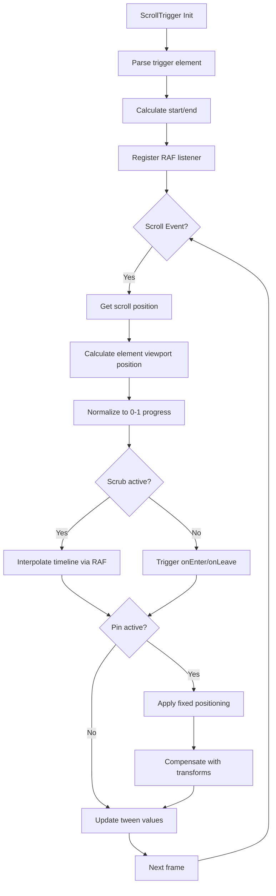

# How I Prompted GSAP ScrollTrigger in Cursor for Immersive Storytelling Websites

**I rely on GSAP ScrollTrigger for every premium scroll-driven website I build** because it delivers the timeline precision, hardware-accelerated transforms, and battle-tested API that [GreenSock](https://gsap.com/) has refined over more than a decade. While [CSS Scroll-Driven Animations](https://developer.mozilla.org/en-US/docs/Web/CSS/CSS_scroll-driven_animations) have gained browser support, they lack the orchestration depth, scrubbing fidelity, and cross-browser consistency that my clients' brand experiences demand.

In this article, I am breaking down exactly how I use [Cursor Composer](https://www.cursor.com/) to prompt and coordinate complex ScrollTrigger timelines — without writing raw timeline scripts from scratch. These are the architecture patterns I use on $15k–$50k immersive websites: pinning strategies, parallax layering, horizontal scroll systems, timeline scrubbing, snap points, and scroll-linked video. Instead of dumping unverified code blocks, I am sharing the **exact Cursor Prompt Templates** I use to generate production-ready implementations.

---

## Why I Still Choose ScrollTrigger Over CSS Scroll-Driven Animations in 2026

**CSS Scroll-Driven Animations have reached production-ready status in Chromium and Safari, but they still lack the precision control, complex timeline orchestration, and cross-browser consistency that premium scroll experiences demand.** [Firefox](https://www.mozilla.org/firefox/) remains the holdout — CSS scroll timelines are still behind a feature flag as of May 2026 according to [MDN's browser compatibility data](https://developer.mozilla.org/en-US/docs/Web/CSS/animation-timeline#browser_compatibility). I use GSAP because it handles the edge cases CSS cannot: dynamic start/end points, scrubbed timelines with multiple overlapping tweens, pin management, snap behavior, and consistent 60fps performance across all major browsers per [Google's Core Web Vitals thresholds](https://web.dev/vitals/).

### The CSS Scroll-Driven Animations Gap

Browser support for `animation-timeline: scroll()` has stabilized in [Chrome 115+](https://developer.chrome.com/docs/css-ui/scroll-driven-animations), [Edge 115+](https://learn.microsoft.com/en-us/microsoft-edge/), [Safari 16.4+](https://webkit.org/blog/13854/scroll-driven-animations/), and Samsung Internet 23+. Firefox 150+ still requires a user-enabled flag, making CSS scroll timelines a progressive enhancement rather than a primary architecture choice for sites serving Firefox users.

| Capability | CSS Scroll-Driven | GSAP ScrollTrigger |
|------------|-------------------|-------------------|
| Firefox support | ❌ Behind flag (2026) | ✅ Fully supported |
| Dynamic start/end points | ❌ Fixed CSS only | ✅ JavaScript-calculated |
| Scrubbed timeline with child tweens | ❌ Single animation | ✅ Full timeline composition |
| Snap to nearest section | ❌ Manual scroll-snap | ✅ ScrollTrigger snap plugin |
| Pin elements mid-scroll | ⚠️ Limited sticky | ✅ Full pin with transforms |
| Cross-browser consistency | ⚠️ Safari/Chromium only | ✅ Normalized engine |
| Debug/visualize triggers | ❌ Devtools only | ✅ Built-in visualizer |
| React state integration | ❌ Manual imperative | ✅ Clean useGSAP hook |

For simple fade-ins and basic parallax on modern Chrome/Safari audiences, CSS scroll timelines work. For complex scroll storytelling — where sections pin for 300% viewport height, scrub through 20+ layered animations with precise timing, and snap to exact positions — GSAP remains the only professional choice that works everywhere your clients' customers browse.

CSS Scroll-Driven Animations work for simple parallax or fade-ins. For complex scroll storytelling — where sections pin, scrub through 20+ layered animations, and snap to precise positions — GSAP is the only professional choice.

---

## ScrollTrigger Core Architecture: How the Engine Works

**ScrollTrigger operates on a scroll-position-to-timeline-progress mapping system.** It calculates where the trigger element sits relative to the viewport, converts that position to a 0–1 progress value, then drives a GSAP timeline (or direct tween) to the corresponding point. This decouples scroll position from animation frame timing, enabling butter-smooth scrubbing even on 120Hz displays.

### The ScrollTrigger Lifecycle



Understanding this flow matters because **performance issues almost always stem from scroll listener thrashing** — running heavy calculations on every scroll event. ScrollTrigger avoids this by using a single global scroll listener and `requestAnimationFrame`-based interpolation for scrubbed animations. The actual DOM writes happen on the animation frame, never the scroll thread, maintaining 60fps even during rapid scroll gestures.

### My Responsive Scroll Pattern Using matchMedia

When I prompt Cursor for responsive scroll experiences, I use `gsap.matchMedia()` to conditionally enable scroll effects based on viewport size. This prevents mobile devices from struggling with desktop-heavy pinning and scrubbing.

**My Cursor Prompt Template for Responsive Scroll:**

```
Create a GSAP ScrollTrigger implementation using matchMedia() with three breakpoints:
- Desktop (1024px+): Full pinned hero section with 200% scroll distance, scrubbed timeline with headline exit and next-section entrance animations
- Tablet (768px–1023px): Reduced effects — headline parallax without pinning, simpler scrub values
- Mobile (<767px): Minimal effects only — simple fade-in reveals using toggleActions, no pinning

Requirements:
- Return cleanup functions for each breakpoint to kill timelines/ScrollTriggers
- Use transform-only animations (y, opacity) — no layout properties
- Scope all selectors to a container ref for React compatibility
- Include invalidateOnRefresh for resize handling
```

**Architecture Blueprint the AI Generates:**

| Breakpoint | Effects | Pinning | Scroll Distance |
|------------|---------|---------|-----------------|
| Desktop (1024px+) | Full timeline choreography | Yes | 200% viewport |
| Tablet (768px–1023px) | Reduced parallax | No | Standard scroll |
| Mobile (<767px) | Simple fade reveals | No | Native scroll |

This architecture ensures premium desktop experiences without sacrificing mobile performance — a critical pattern for sites targeting diverse device ranges. I always verify the generated cleanup functions are returning correctly to prevent memory leaks in SPAs.

---

## My Pinning Strategy for Section-Based Scroll Stories

**Pinning locks an element in place while the scroll position continues advancing, creating the illusion of scroll progression while content animates.** This is the core mechanic behind full-screen scroll sections, horizontal scroll takeovers, and complex reveal sequences. When I get pinning wrong, the layout collapses; when I get it right, the experience feels cinematic.

### My Basic Pin Pattern Prompt

Here is the Cursor Prompt Template I use for a simple pinned section:

```
Create a React component with a pinned hero section using GSAP ScrollTrigger:

Structure:
- Full-viewport section (h-screen) with absolute-positioned headline centered
- Pinned for 200% scroll distance (2 viewport heights)
- Scrubbed timeline with 1-second interpolation lag

Animation sequence:
1. Headline: y translation upward -100px, opacity to 0 (30% of timeline)
2. Subhead: y translation upward -50px, opacity to 0, overlapping with headline (starts at same time)
3. Next-content: y translation from +100px to 0, opacity 0 to 1, coming in after exit

Requirements:
- Use useGSAP hook from @gsap/react
- Register ScrollTrigger plugin
- Scope selectors to container ref
- Transform-only animations (y, opacity) — no layout properties
- Cleanup on unmount
```

**Architecture Blueprint the AI Generates:**

| Element | Animation | Timing | Easing |
|---------|-----------|--------|--------|
| Headline | y: -100, opacity: 0 | 0%–30% | Power2.out |
| Subhead | y: -50, opacity: 0 | 0%–20% | Power2.out |
| Next-content | y: 100→0, opacity: 0→1 | 30%–80% | Power2.out |

### Push vs. Overlay Pin Behavior

When pinning, ScrollTrigger must decide how to handle subsequent page content:

| Behavior | Setting | Effect |
|----------|---------|--------|
| Push | `pinSpacing: true` (default) | Adds spacer div equal to pin duration, pushing later content down |
| Overlay | `pinSpacing: false` | Later content scrolls underneath, pin overlays it |

Use `pinSpacing: true` for sequential storytelling where each section has its own viewport time. Use `pinSpacing: false` for overlapping transitions where one section fades over the next.

### My Pin Performance Rules

The most common pinning mistake I see is **animating width, height, or top/left properties** — these force layout recalculation on every frame according to [Google's rendering performance guidelines](https://web.dev/rendering-performance/). I always use transform-only animations.

**Cursor Prompt Template for Pin Performance:**

```
When generating ScrollTrigger animations for pinned sections:

❌ NEVER animate these properties (layout thrash):
- width, height, top, left, right, bottom, margin, padding

✅ ALWAYS use these GPU-accelerated properties:
- x, y, scale, scaleX, scaleY, rotation, skewX, skewY, opacity

Add will-change: transform hint before animation starts, then remove after:
- gsap.set() before, onComplete: gsap.set() after
```

### My Nested Pins and Z-Index Management Prompt

When I create multiple sequential pinned sections, z-index stacking determines which section appears on top during transitions. Here is my prompt:

```
Create two consecutive pinned sections with z-index layering:

Section 1:
- z-index: 10 (base layer)
- Pin distance: 150%
- pinSpacing: true

Section 2:
- z-index: 20 (overlays section 1 during transition)
- Pin distance: 200%
- pinSpacing: true

Requirements:
- Sections should cleanly hand off visual stacking
- No flicker during unpin transition
- CSS z-index must match GSAP trigger order
```

**CSS Architecture the AI Generates:**

| Section | z-index | Pin Distance | Stacking Role |
|---------|---------|--------------|---------------|
| Section 1 | 10 | 150% | Base layer |
| Section 2 | 20 | 200% | Overlays exit |
| Section 3 | 30 | 200% | Top layer |

This stacking ensures clean visual handoffs between pinned sections. Without proper z-index management, pinned elements can appear to "flicker" or render behind their predecessors during the unpin transition.

---

## My Parallax Layering Strategy

**Parallax creates perceived depth by moving foreground and background layers at different speeds as the user scrolls.** ScrollTrigger makes this trivial with scrubbed tweens tied to scroll progress, but the *architecture* of your layers determines whether the effect feels polished or amateur.

### My Three-Layer Parallax Prompt

Here is the Cursor Prompt Template I use for professional three-layer parallax:

```
Create a three-layer parallax section using GSAP ScrollTrigger:

Layer configuration:
1. Background layer — slowest movement (0.2x scroll speed, y: 200px)
2. Midground layer — medium movement (0.5x scroll speed, y: 100px)
3. Foreground layer — normal scroll speed, no transform

Requirements:
- All layers use scrub: true for direct scroll mapping
- Trigger: container element, start: 'top bottom', end: 'bottom top'
- GPU-accelerated transforms only (y-axis)
- will-change: transform hint before animation
- Remove will-change after animation completes via onComplete
```

**Architecture Blueprint the AI Generates:**

| Layer | Speed Ratio | Transform | Depth Perception |
|-------|-------------|-----------|------------------|
| Background | 0.2x | y: 200px | Farthest — moves least |
| Midground | 0.5x | y: 100px | Middle distance |
| Foreground | 1.0x | none | Normal scroll — closest |

### Will-Change and Layer Promotion

For smooth parallax on lower-end devices, I prompt Cursor to hint the browser to promote layers to their own compositor surfaces — following [web.dev's guidance on layer promotion](https://web.dev/articles/stick-to-compositor-only-properties-and-manage-layer-count).

**Cursor Prompt Template for Layer Management:**

```
Add will-change optimization for parallax layers:

Before animation:
- gsap.set('.parallax-layer', { willChange: 'transform' })

After animation completes:
- onComplete callback: gsap.set('.parallax-layer', { willChange: 'auto' })

This promotes layers to compositor surfaces during animation, then frees GPU memory after.
```

### My Parallax Depth Math Function

The perceived depth of a parallax layer depends on its speed ratio relative to scroll. I use this formula to calculate transform values:

**Cursor Prompt Template for Parallax Depth Math:**

```
Create a reusable createParallaxLayer function with depth ratio calculation:

Parameters:
- element: string (CSS selector)
- depthRatio: number (0 = stationary, 1 = normal scroll, >1 = faster than scroll)
- maxScroll: number (default 500)

Formula:
- moveDistance = maxScroll * (1 - depthRatio)
- from: y: -moveDistance / 2
- to: y: moveDistance / 2

Usage examples to generate:
- bg-mountains: depthRatio 0.2, maxScroll 800
- midground-trees: depthRatio 0.5, maxScroll 400
- foreground-text: depthRatio 0.9, maxScroll 100
```

**Depth Ratio Reference Table:**

| Ratio | Layer Type | Movement | Use Case |
|-------|------------|----------|----------|
| 0.0 | Fixed | None | Static background |
| 0.2 | Background | 20% scroll | Mountains, sky |
| 0.5 | Midground | 50% scroll | Trees, buildings |
| 0.8 | Near-foreground | 80% scroll | Close elements |
| 1.0 | Foreground | 100% scroll | Normal content |

This formula ensures my layers move at perceptually consistent speeds regardless of viewport height or content length.

---

## My Horizontal Scroll Takeover Architecture

**Horizontal scroll sections convert vertical scroll input into horizontal content movement, creating a narrative detour within a vertical page.** This pattern appears in nearly every [Awwwards](https://www.awwwards.com/)-winning brand site, but implementation details separate the professional from the broken.

### My Vertical-to-Horizontal Translation Prompt

Here is the Cursor Prompt Template I use for basic horizontal scroll:

```
Create a React component with horizontal scroll takeover using GSAP ScrollTrigger:

Structure:
- Container: h-screen, overflow-hidden, pinned during scroll
- Track: flex container, width: fit-content, containing 3+ full-width panels (w-screen, flex-shrink-0)

Scroll behavior:
- Convert vertical scroll to horizontal track movement (x: -scrollWidth)
- Scroll distance equals track width minus viewport width
- Use ease: 'none' (linear mapping for scroll fidelity)
- scrub: 1 for smooth interpolation

Critical requirements:
- invalidateOnRefresh: true for resize recalculation
- Dynamic end value: () => `+=${scrollWidth}`
- Proper cleanup on unmount
```

**Key Implementation Requirements the AI Must Include:**

| Detail | Purpose |
|--------|---------|
| `invalidateOnRefresh: true` | Recalculates scroll distance on resize — critical for responsive per [GSAP docs](https://gsap.com/docs/v3/Plugins/ScrollTrigger/) |
| `ease: 'none'` | Linear progress mapping — any easing breaks scroll-to-progress fidelity |
| `+=${scrollWidth}` dynamic end | Ensures scroll distance matches actual content width |
| `width: 'fit-content'` on track | Prevents flex wrapping, enables proper scrollWidth calculation |

### My Advanced Horizontal Scroll with Panel Animations

For advanced horizontal scroll sections with panel-specific animations, I use this prompt:

```
Create an advanced horizontal scroll section with panel-specific entrance animations:

Structure:
- Pinned container with horizontal track
- 4 panels, each w-screen with flex-shrink-0
- Each panel has .panel-content with text centered

Horizontal scroll:
- Track tweens x: -scrollWidth with ease: 'none'
- Store horizontalTween reference for linking

Panel-specific animations:
- For each panel, calculate panelStart and panelEnd based on index
- Animate .panel-content: scale 0.8→1, opacity 0→1
- Use containerAnimation: horizontalTween to link to horizontal scroll
- Stagger panel reveals as they enter viewport center

Panel titles: 'Brand Strategy', 'Visual Identity', 'Digital Experience', 'Launch Campaign'
```

**Architecture Blueprint the AI Generates:**

| Component | Animation | Linked to Horizontal |
|-----------|-----------|----------------------|
| Track | x: -scrollWidth | Main scroll driver |
| Panel 1 Content | scale: 0.8→1, opacity: 0→1 | Yes — panelStart 0% |
| Panel 2 Content | scale: 0.8→1, opacity: 0→1 | Yes — panelStart 33% |
| Panel 3 Content | scale: 0.8→1, opacity: 0→1 | Yes — panelStart 66% |
| Panel 4 Content | scale: 0.8→1, opacity: 0→1 | Yes — panelStart 100% |

This pattern creates the "Apple product page" effect — content within each horizontal panel animates independently as the user scrolls through the horizontal sequence.

---

## My Timeline Scrubbing Strategy

**Timeline scrubbing allows scroll position to drive complex multi-element choreography** — text fading as images scale, colors shifting as content reveals, particles dispersing as sections transition. The timeline becomes a score, and scroll progress is the conductor's baton.

### My Nested Timeline Architecture Prompt

For complex sections, I compose multiple timelines into a master. Here is my Cursor Prompt Template:

```
Create a pinned master timeline with three nested phase timelines for scroll choreography:

Master timeline:
- Pinned for 300% scroll distance
- scrub: 0.8 (slight lag for organic feel)

Phase 1: Introduction (0%–30% of scroll)
- hero-text: from y: 100, opacity: 0
- hero-image: from scale: 1.2, opacity: 0 (overlapping with text)

Phase 2: Transition (30%–60% of scroll)
- hero-text: to y: -50, opacity: 0
- hero-image: to x: -100, filter: 'blur(5px)' (overlapping)
- detail-panel: from x: 100, opacity: 0

Phase 3: Detail (60%–100% of scroll)
- feature-list items: from y: 30, opacity: 0 with stagger: 0.1

Requirements:
- Compose phases into master using add() with position labels
- Use transform-only animations
- Include cleanup function
```

**Architecture Blueprint the AI Generates:**

| Phase | Timeline | Position | Elements |
|-------|----------|----------|----------|
| Intro | intro | 0 (0%) | hero-text, hero-image |
| Transition | transition | 0.3 (30%) | hero-text exit, hero-image blur, detail-panel enter |
| Detail | detail | 0.6 (60%) | feature-list stagger |

### My Relative Timing vs. Absolute Labels Strategy

The architecture above uses relative timing (0.3 = 30% through master timeline). For more precision, I prompt for labels:

```
Add labeled markers to the master timeline:
- 'phase1End' at 0.3
- 'phase2End' at 0.6
- 'phase3End' at 1.0

Enable scrubbing between exact labels with tweenFromTo for precise section control.
```

### My Timeline Time Scales and Scrub Values

When scrubbing timelines, easing curves affect how animations feel relative to scroll speed.

**Cursor Prompt Template for Scrub Configuration:**

```
Configure scrub values based on animation feel:

Linear / Direct mapping:
- scrub: true (or 0) — animation progress exactly matches scroll progress

Smooth / Organic feel:
- scrub: 1 — 1-second interpolation lag, feels more natural

Tween-level easing:
- Each tween uses its own ease curve (power2.out, back.out, etc.)
- Ease determines HOW values interpolate within scroll progress
- Maintain scroll-to-progress mapping at timeline level
```

**Scrub Value Reference:**

| Scrub Value | Feel | Use Case |
|-------------|------|----------|
| `true` / `0` | Direct, immediate | Precise control, snappy feel |
| `0.5` | Light smoothing | Balanced responsiveness |
| `1` | Organic, fluid | Natural scroll experiences |
| `2` | Heavy smoothing | Dramatic, cinematic feel |

For complex scroll choreography, **tween-level easing provides more control** than timeline-level easing. Each segment of my scroll experience can have its own acceleration curve while maintaining the overall scroll-to-progress mapping.

---

## My Snap Points Strategy for Intentional Scroll Destinations

**Snap points force scroll position to settle at specific locations** — typically section boundaries or logical breakpoints in a horizontal scroll. Without snap, users land at awkward mid-animation positions. With snap, the experience feels intentional and polished.

### My Global Snap Configuration Prompt

For a site with multiple pinned sections, I configure snap globally.

**Cursor Prompt Template for Global Snap:**

```
Create a global ScrollTrigger snap configuration that applies to all pinned sections:

Logic:
1. Get all pinned ScrollTriggers using ScrollTrigger.getAll().filter(st => st.vars.pin)
2. Sort by start position
3. Build snap targets array: pinned.map(st => st.start / maxScroll)
4. snapTo function: find nearest target to current progress

Configuration:
- duration: { min: 0.2, max: 0.5 }
- delay: 0 (no delay for responsiveness)
- ease: 'power2.out'

Requirements:
- Must run after all ScrollTriggers are created
- Return progress unchanged if no pinned triggers exist
- Calculate absolute distance for nearest target detection
```

**Architecture Blueprint the AI Generates:**

| Step | Operation | GSAP API |
|------|-----------|----------|
| 1 | Get pinned triggers | `ScrollTrigger.getAll().filter(st => st.vars.pin)` |
| 2 | Sort by position | `.sort((a, b) => a.start - b.start)` |
| 3 | Build targets | `pinned.map(st => st.start / maxScroll)` |
| 4 | Find nearest | `reduce()` with absolute distance comparison |
| 5 | Return target | Snap to nearest pinned section start |

### My Per-Section Snap Prompt

For a single horizontal scroll section, I define snap inline.

**Cursor Prompt Template for Per-Section Snap:**

```
Add inline snap configuration to a horizontal scroll section:

snap settings:
- snapTo: 1 / (panels.length - 1) for evenly distributed panels
- duration: 0.3 seconds
- ease: 'power1.inOut'

Apply directly to the ScrollTrigger configuration object.
```

### My Direction-Aware Snap Prompt

Add direction awareness to make snap feel more responsive.

**Cursor Prompt Template for Direction-Aware Snap:**

```
Create a direction-aware snap configuration:

Parameters:
- progress: current scroll position (0–1)
- direction: 1 for scrolling down, -1 for scrolling up

Logic:
- Get snap targets array
- Calculate current absolute scroll position
- If direction === 1 (down): find first target > current, fallback to last
- If direction === -1 (up): reverse targets, find first target < current, fallback to first

Configuration:
- duration: { min: 0.15, max: 0.35 }
- delay: 0
- ease: 'power2.out'
```

**Direction-Aware Logic:**

| Direction | Behavior | Target Selection |
|-----------|----------|------------------|
| Down (+1) | Prefer next section | `find(target > current)` |
| Up (-1) | Prefer previous section | `reverse().find(target < current)` |

This creates the "momentum snap" effect seen on high-end editorial sites — the scroll decelerates naturally, then snaps to the nearest logical section based on travel direction.

---

## My Scroll-Linked Video Strategy

**Scroll-linked video uses scroll position to drive video playback, creating cinema-like storytelling where the user controls pacing.** This pattern appears in Apple's product pages and high-end agency portfolios. Implementation requires careful handling of video encoding, frame rates, and performance budgets per [web.dev's video best practices](https://web.dev/articles/video-and-source-tags).

### My Video Encoding Specifications for Scroll Control

For smooth scrubbing, I prompt Cursor to encode with these specifications:

| Parameter | Recommendation | Why |
|-----------|---------------|-----|
| Format | H.264 MP4 (baseline profile) | Broadest browser compatibility per [Can I Use](https://caniuse.com/mpeg4) |
| Frame rate | 30fps | 60fps overkill for scrubbing, doubles file size |
| Keyframes | Every frame (keyint=1) | Enables frame-accurate seeking |
| Resolution | 1080p max | 4K chokes on mobile, minimal visual gain on scroll |
| Compression | High CRF (28–32) | Smaller files, user won't notice on scroll |

### My Video Scrubbing Implementation Prompt

**Cursor Prompt Template for Scroll-Linked Video:**

```
Create a React component for scroll-linked video playback:

Structure:
- Video element with ref, playsInline, muted, preload="auto"
- GSAP tweens video.currentTime based on scroll position

Implementation:
- Wait for loadedmetadata event to get video.duration
- gsap.to(video, { currentTime: duration })
- ScrollTrigger: start 'top center', end 'bottom center'
- scrub: true for direct scroll mapping
- ease: 'none' for linear video progression

Requirements:
- Video must be muted (required for scroll/autoplay behavior)
- Preload auto for immediate seeking capability
- Transform-only positioning for video container
- Cleanup event listeners and ScrollTrigger on unmount
```

**Architecture Blueprint the AI Generates:**

| Event | Action | Purpose |
|-------|--------|---------|
| loadedmetadata | Get duration | Know total scroll range |
| scroll progress | Update currentTime | Drive playback position |
| scrub | Linear mapping | Scroll-to-time conversion |

### My Performance Warning

I never combine video scrubbing with position animations (parallax video). The combined GPU load of frame decoding + transform calculations drops frames on most devices. Keep scroll video static or use poster images for parallax layers.

### My Image Sequence Alternative

For frame-accurate control without video compression artifacts, I use an image sequence.

**Cursor Prompt Template for Scroll Image Sequence:**

```
Create a canvas-based scroll-linked image sequence component:

Parameters:
- frameCount: 100 (default)
- basePath: '/frames/'
- extension: 'jpg'
- canvas dimensions: 1920x1080

Implementation:
1. Preload all images into array on mount (useEffect)
2. Create canvas context with useRef
3. GSAP tweens object { frame: 0 } to { frame: frameCount - 1 }
4. onUpdate: draw current frame to canvas using ctx.drawImage
5. ScrollTrigger: start 'top center', end 'bottom center', scrub: true

Optimization:
- Lazy-load sequence with IntersectionObserver
- Aggressive compression (20MB total budget for 100 frames)
- Use requestAnimationFrame in onUpdate for smooth rendering
```

**Architecture Comparison:**

| Approach | Accuracy | Bandwidth | Best For |
|----------|----------|-----------|----------|
| Video scrubbing | Good | Low (~2MB) | Real footage, motion video |
| Image sequence | Perfect | High (~20MB) | 3D renders, product demos |

Image sequences provide perfect frame accuracy and work better for 3D product renders where every frame matters. The tradeoff is bandwidth — 100 frames at 200KB each is 20MB, so I lazy-load and use aggressive compression.

---

## My React/Next.js Integration Strategy

**Modern React integration uses the `@gsap/react` package with the `useGSAP` hook** — this handles cleanup, context, and dependency tracking correctly. The old `useEffect` + manual `gsap.context()` pattern works but requires more boilerplate.

### My useGSAP Hook Pattern Prompt

Here is the Cursor Prompt Template I use for React integration:

```
Create a React component using @gsap/react useGSAP hook:

Structure:
- Import useRef from 'react'
- Import { gsap } from 'gsap', { ScrollTrigger } from 'gsap/ScrollTrigger'
- Import { useGSAP } from '@gsap/react'
- Register ScrollTrigger plugin once at module level

Implementation:
- Create containerRef with useRef<HTMLDivElement>
- useGSAP hook with callback and { scope: containerRef } options
- Inside callback: gsap.to('.animate-me') with ScrollTrigger configuration
- Element starts with opacity-0 translate-y-10, animates to visible

Requirements:
- useGSAP handles automatic context creation and cleanup
- Scoped to container to prevent selector bleeding
- Transform-only animations (y, opacity)
```

**Architecture Benefits:**

| Feature | useGSAP | Manual useEffect |
|---------|---------|------------------|
| Context creation | Automatic | Manual gsap.context() |
| Cleanup | Automatic | Manual revert() call |
| Dependency tracking | Built-in | Manual management |
| Scope enforcement | { scope: ref } | Context parameter |

### My Next.js App Router Strategy

In [Next.js App Router](https://nextjs.org/docs/app), GSAP must run client-side per the [React Server Components architecture](https://nextjs.org/docs/getting-started/react-essentials). I use the `'use client'` directive and lazy loading for below-fold animations.

**Cursor Prompt Template for Next.js Lazy Loading:**

```
Create a Next.js page with lazy-loaded scroll sections:

Structure:
- 'use client' directive at top
- Import { lazy, Suspense } from 'react'
- HeroSection: loaded immediately (above fold)
- HeavyScrollSection: lazy(() => import('./HeavyScrollSection'))
- Suspense wrapper with fallback placeholder (h-screen div)

Loading strategy:
- Hero: immediate render (critical for LCP per web.dev)
- Heavy sections: load as user approaches via code splitting
```

### My Dependency Array Trap Prevention

A common bug I encounter is missing dependencies in `useGSAP`:

**Cursor Prompt Template for Dependency Safety:**

```
Configure useGSAP with proper dependency tracking:

❌ WRONG — stale closure:
- useGSAP(() => { gsap.to('.item', { y: data.offset }) }, [])
- Data changes but animation doesn't update

✅ CORRECT — reactive dependencies:
- useGSAP(() => { gsap.to('.item', { y: data.offset }) }, [data.offset])
- Animation re-runs when data.offset changes

Include all reactive values used inside the callback in the dependency array.
```

### My ScrollTrigger Refresh on Route Change

In Next.js App Router with client-side navigation, ScrollTrigger positions become stale when route parameters change content dimensions.

**Cursor Prompt Template for Route Change Refresh:**

```
Create a ScrollTriggerRefresher component for Next.js App Router:

Implementation:
- 'use client' directive
- Import { useEffect } from 'react'
- Import { ScrollTrigger } from 'gsap/ScrollTrigger'
- Import { usePathname } from 'next/navigation'

Logic:
- useEffect with pathname dependency
- setTimeout 100ms to ensure DOM settled
- ScrollTrigger.refresh() inside timeout
- Cleanup clears timeout

Return null (utility component, no render output)

Include in root layout to auto-refresh on every route change.
```

**Why This Matters:**

| Without Refresher | With Refresher |
|-------------------|----------------|
| Triggers offset after navigation | Positions recalculated correctly |
| Animations fire at wrong times | Scroll positions match new layout |
| Broken scroll effects | Consistent behavior across routes |

### My Server/Client Component Separation

GSAP cannot run in React Server Components. I use this separation pattern:

**Cursor Prompt Template for Server/Client Split:**

```
Create a server/client split for scroll animations:

Server Component (ScrollSection.tsx):
- Default async function
- Fetch data server-side (fetchData())
- Return section wrapper with ClientScrollAnimation child
- Pass data as prop to client component

Client Component (ClientScrollAnimation.tsx):
- 'use client' directive at top
- Import { useGSAP } from '@gsap/react'
- GSAP imports and animation logic
- Accept data prop from server component
- Animations run client-side with server-fetched data

This enables server data fetching with client-side animation execution.
```

**Architecture Flow:**

| Phase | Component | Environment |
|-------|-----------|-------------|
| Data fetch | ScrollSection | Server |
| Render | ScrollSection | Server |
| Hydrate | ClientScrollAnimation | Client |
| Animate | useGSAP hook | Client |

---

## My Performance Budgets for Scroll-Driven Sites

**Scroll-heavy sites must respect performance budgets** or they will stutter on mid-tier devices, costing conversions and brand perception. GSAP is fast, but your implementation determines whether you maintain 60fps or drop to 30fps under load per [Google's Core Web Vitals](https://web.dev/vitals/) thresholds.

### My Scroll Performance Budget

| Metric | Target | Maximum | Source |
|--------|--------|---------|--------|
| Frame rate | 60fps | Never drop below 45fps | [Chrome rendering](https://web.dev/articles/rendering-performance) |
| First Contentful Paint | < 1.5s | < 2.5s | [FCP guidelines](https://web.dev/articles/fcp) |
| Largest Contentful Paint | < 2.5s | < 4s | [LCP thresholds](https://web.dev/articles/lcp) |
| Cumulative Layout Shift | 0 | < 0.1 | [CLS standards](https://web.dev/articles/cls) |
| Total Blocking Time | < 200ms | < 500ms | [TBT budgets](https://web.dev/articles/tbt) |

### My GSAP Optimization Prompt

Here is the Cursor Prompt Template I use for performance-optimized animations:

```
Generate performance-optimized GSAP ScrollTrigger code with these constraints:

1. Transform-only animations (NEVER use left, top, width, height, margin, padding):
   ✅ Use: x, y, scale, scaleX, scaleY, rotation, skewX, skewY, opacity
   ❌ Avoid: left, right, top, bottom, width, height, margin, padding

2. Batch DOM operations with gsap.context:
   - Wrap all section animations in useGSAP with { scope: containerRef }
   - All animations in one context share RAF tick efficiently

3. Strategic will-change usage:
   - Before: gsap.set('.animating', { willChange: 'transform' })
   - After animation: onComplete: gsap.set('.animating', { willChange: 'auto' })

4. Limit simultaneous tweens:
   - If 50+ elements animating: stagger start times
   - Consider CSS for simple effects
   - Virtualize off-screen content
```

**Architecture the AI Must Respect:**

| Optimization | Implementation | Benefit |
|--------------|------------------|---------|
| GPU-only | transform, opacity | No layout thrash |
| Context batching | useGSAP scope | Shared RAF tick |
| will-change hint | Before/after animation | Layer promotion |
| Tween limiting | Stagger, virtualization | Memory efficiency |

### My React Re-render Prevention Strategy

Unnecessary React re-renders during scroll can destroy performance.

**Cursor Prompt Template for Re-render Prevention:**

```
Configure scroll-linked values to prevent React re-renders:

❌ BAD — state update every scroll frame:
- onUpdate: (self) => setProgress(self.progress)
- Triggers 60 re-renders per second!

✅ GOOD — refs for frequent values, state for milestones:
- Create: const progressRef = useRef(0)
- onUpdate: progressRef.current = self.progress (no re-render)
- onEnter: setActiveSection(1) (state OK for discrete changes)
- onLeave: setActiveSection(0)

Rule: Use refs for frame-by-frame values. Use state only for UI-triggering changes.
```

**Update Strategy Reference:**

| Value Type | Storage | Update Frequency | Example |
|------------|---------|-------------------|---------|
| Scroll progress | useRef | Every frame | progressRef.current |
| Section index | useState | On enter/leave | setActiveSection(1) |
| Animation state | useState | On complete | setIsVisible(true) |

### My Scroll Performance Measurement Process

I use [Chrome DevTools Performance panel](https://developer.chrome.com/docs/devtools/performance) to measure scroll performance:

**Cursor Prompt Template for Performance Audit:**

```
Add performance measurement to scroll sections:

1. Chrome DevTools setup:
   - Enable "Screenshots" and "Web Vitals"
   - Record 5 seconds of scroll interaction
   - Analyze frame-by-frame

2. Check for red flags:
   - Long "Recalculate Style" blocks (>16ms) — indicates layout thrash
   - Dropped frames in FPS meter — check for >16ms composite times
   - "Composite Layers" consuming >16ms — reduce layer count

3. Fix patterns:
   - Convert layout properties to transforms
   - Reduce will-change usage
   - Simplify simultaneous tweens
   - Virtualize off-screen panels
```

**Common Issues and Solutions:**

| Symptom | Cause | Fix |
|---------|-------|-----|
| Long Recalculate Style | Layout property animation | Convert to transform |
| Dropped frames | Too many layers | Remove unnecessary will-change |
| Slow composite | Heavy shader effects | Simplify or pre-render |
| Janky scrub | setState in onUpdate | Use refs instead |

---

## My Analysis of Award-Winning Scroll Storytelling Patterns

**The best scroll experiences follow predictable architectural patterns.** My analysis of recent [Awwwards](https://www.awwwards.com/) Site of the Day winners reveals common structures that I adapt for client work.

### Common Patterns from Awwwards Winners (2025–2026)

| Pattern | Frequency | Implementation |
|---------|-----------|----------------|
| Full-viewport pinned hero | 85% | `pin: true, end: '+=150%'` |
| Horizontal scroll section | 60% | Vertical-to-horizontal transform |
| Parallax background layers | 70% | Slow-transform background images |
| Text reveal (line-by-line) | 55% | [SplitText](https://gsap.com/docs/v3/Plugins/SplitText/) + staggered tweens |
| Scroll-linked video | 30% | `currentTime` scrubbing |
| Color scheme transitions | 40% | Background-color tween tied to scroll |
| Sticky sidebar navigation | 25% | `position: sticky` with progress indicator |

### The "Agency Stack" Pattern I Follow

Most high-end creative agencies follow this structure, and I use it as my default architecture:

```
1. Cinematic Hero (pinned, video or WebGL background)
   ↓
2. Statement Section (large typography, minimal motion)
   ↓
3. Horizontal Gallery (showcase work, pinned horizontal scroll)
   ↓
4. Process/About (parallax layers, reveals)
   ↓
5. Contact/CTA (clean, minimal, conversion-focused)
```

This pattern works because it **front-loads the impressive scroll effects** while keeping the conversion point distraction-free.

---

## GSAP Premium Plugins: Now Free for Everyone

**GSAP premium plugins — including SplitText, MorphSVG, DrawSVG, and ScrollSmoother — became completely free in April 2025** after Webflow acquired GreenSock in October 2024. This is one of the most significant developments in web animation history: professional-grade scroll storytelling tools are now accessible to every developer without licensing fees.

### What Changed in 2025

| Before April 2025 | After April 2025 |
|-------------------|------------------|
| Club GreenSock subscription required ($99–$199/year) | All plugins free |
| Private npm registry for premium plugins | Public npm registry |
| Business license tier for commercial work | Standard license covers all use |
| SplitText, MorphSVG behind paywall | Included in core GSAP package |

### Essential Premium Plugins for Scroll Stories

| Plugin | Purpose | Scroll Use Case |
|--------|---------|-----------------|
| SplitText | Animate text by char/word/line | Staggered headline reveals on scroll |
| MorphSVG | Animate between SVG shapes | Logo transitions as sections change |
| DrawSVG | Animate SVG stroke drawing | Path reveals synced to scroll progress |
| ScrollSmoother | Lenis-style smooth scrolling | Normalized scroll feel across browsers |
| CustomEase | Create custom easing curves | Signature motion feel for brand identity |
| Flip | Layout animation plugin | Smooth position changes on scroll updates |

### My SplitText Scroll Animation Prompt

**Cursor Prompt Template for Kinetic Typography:**

```
Create a kinetic typography animation using GSAP SplitText:

Setup:
- Import SplitText from 'gsap/SplitText'
- Register SplitText and ScrollTrigger plugins
- Use useGSAP hook

Split configuration:
- target: '.headline'
- type: 'lines,words,chars' (split all three)
- linesClass: 'line-wrapper' (for line container styling)

Animation:
- gsap.from(split.chars)
- ScrollTrigger: start 'top 80%', end 'top 50%', scrub: true
- Properties: opacity 0.1→1, y: 50→0, rotateX: -90→0
- stagger: 0.02 (each character delays 20ms)
- ease: 'power2.out'

Effect: Characters materialize sequentially as user scrolls, creating text that "forms" from scroll interaction.
```

**Architecture Blueprint:**

| Split Level | Animation | Stagger | Use Case |
|-------------|-----------|---------|----------|
| chars | rotateX + opacity | 0.02s | Dramatic headline reveals |
| words | y + opacity | 0.05s | Paragraph reveals |
| lines | y + opacity | 0.1s | Quote blocks |

This creates the kinetic typography effect seen on high-end editorial sites — each character animates into view as the user scrolls, creating a sense of text "materializing" from the scroll action itself.

### License Considerations (2026)

GSAP's standard license now covers:
- ✅ Commercial projects
- ✅ Client work and billing
- ✅ SaaS products with end users
- ✅ Templates and themes
- ✅ Unlimited developers per project

The only requirement is including the license header in distributed source code. For most web projects using GSAP via npm, this happens automatically.

---

## Cross-Link to the Immersive Web Design Manual

**ScrollTrigger is one pillar of the immersive web design architecture.** For the complete system — including Framer Motion for component-level motion, Three.js for WebGL hero sections, and the full decision matrix for choosing animation tools — see [The Immersive Web Design Manual](/blog/immersive-web-design-manual). That post covers the broader ecosystem this deep-dive fits into.

---

## Frequently Asked Questions

### What is GSAP ScrollTrigger best used for?

**I use GSAP ScrollTrigger as the industry-standard tool for scroll-driven animations requiring precise timing, scrubbing fidelity, and cross-browser consistency.** It excels at pinned sections that lock content in place while scroll advances, horizontal scroll takeovers that convert vertical scroll to horizontal movement, and complex multi-element choreography where 20+ elements animate in coordinated sequence. I choose ScrollTrigger when I need frame-accurate control, snap-to-section behavior, or effects that must work identically across [Chrome](https://www.google.com/chrome/), [Safari](https://www.apple.com/safari/), and [Firefox](https://www.mozilla.org/firefox/).

### How much does GSAP cost in 2026? Are premium plugins still paid?

**GSAP and all premium plugins are now completely free for commercial and personal use as of April 2025** according to the [GSAP licensing page](https://gsap.com/licensing/). [Webflow](https://webflow.com/) acquired [GreenSock](https://gsap.com/) in October 2024 and eliminated all subscription tiers — SplitText, MorphSVG, DrawSVG, ScrollSmoother, and CustomEase are now included in the standard GSAP package at no cost. The standard license covers client work, SaaS products, templates, and unlimited team members. This represents a shift from the previous $99–$199/year Club GreenSock pricing structure.

### Is GSAP ScrollTrigger better than Framer Motion for scroll animations?

**I use GSAP ScrollTrigger as the superior choice for scroll-driven page-level animations, while [Framer Motion](https://www.framer.com/motion/) excels at component-level interactions within the React tree.** ScrollTrigger operates outside React's reconciliation cycle, directly manipulating the DOM via `requestAnimationFrame` — this produces smoother 60fps performance for pinned sections and scrubbed timelines where React state updates would cause jank. Framer Motion's layout animations, gestures, and AnimatePresence are unbeatable for in-component micro-interactions. Most of my professional React projects use both: GSAP for scroll orchestration, Framer Motion for UI feedback.

### How do I optimize ScrollTrigger performance on mobile devices?

**I use `gsap.matchMedia()` to serve lighter animations on mobile, limit pinned sections to 150% viewport height, and reduce parallax layers to three maximum.** Mobile GPUs have limited memory and processing power — complex scroll effects that maintain 60fps on desktop often drop to 30fps or lower on mid-tier phones per [Google's rendering performance guidelines](https://web.dev/articles/rendering-performance). I disable pinning entirely on mobile breakpoints, convert scrubbed animations to simple triggered fades, and always test on physical devices rather than Chrome DevTools mobile emulation. WebKit-based browsers (Safari iOS) are particularly sensitive to simultaneous layer animations.

### What is the best way to integrate ScrollTrigger with React and Next.js?

**I use the `@gsap/react` package with the `useGSAP` hook for automatic cleanup, context scoping, and dependency tracking.** I install `@gsap/react` alongside `gsap`, register ScrollTrigger once at the application level, then wrap component-level animations in `useGSAP(() => { ... }, { scope: containerRef })`. The hook automatically creates a GSAP context and reverts all ScrollTriggers on unmount, preventing memory leaks in SPA navigation. For [Next.js App Router](https://nextjs.org/docs/app), I mark components with `'use client'` and use `Suspense` to lazy-load heavy scroll sections below the fold.

### Can I use CSS Scroll-Driven Animations instead of GSAP ScrollTrigger?

**CSS Scroll-Driven Animations via `animation-timeline: scroll()` are production-ready for simple effects in Chrome 115+, Edge 115+, and Safari 16.4+, but Firefox 150+ still requires a user-enabled flag** per [MDN documentation](https://developer.mozilla.org/en-US/docs/Web/CSS/animation-timeline#browser_compatibility). CSS scroll timelines work for basic parallax and fade-in effects without JavaScript, but they lack the precision control, complex timeline composition, and pinning capabilities required for award-winning scroll storytelling. Browser support inconsistencies and the inability to snap to sections or drive multi-tween timelines make CSS a progressive enhancement rather than a replacement for GSAP in premium web experiences.

### How do I create horizontal scroll sections with ScrollTrigger?

**I calculate the total scrollable width of my horizontal track, then tween the track's `x` position from 0 to negative `scrollWidth` using `ease: 'none'` while pinning the container.** I use a function-based `end` value like `() => +=${scrollWidth}` so ScrollTrigger calculates the precise scroll distance needed. I set `pin: true` to lock the container in place during horizontal traversal, and include `invalidateOnRefresh: true` to recalculate dimensions on window resize. This converts the user's vertical scroll input into smooth horizontal content movement.

### What is the ScrollTrigger snap feature and how do I use it?

**ScrollTrigger snap forces scroll position to settle at specific destinations, typically the start of pinned sections or evenly-distributed panel positions in horizontal scroll.** I configure global snap with `ScrollTrigger.create({ snap: { snapTo: (progress) => ... } })` to affect all scroll behavior, or define per-trigger snap for individual sections. The snap function receives current scroll progress (0–1) and returns the target progress to animate to, with configurable duration and easing. This prevents users from landing at awkward mid-animation positions and creates the intentional, polished feel of premium editorial sites.

### How does ScrollTrigger pinning work under the hood?

**Pinning locks an element in fixed positioning while inserting a spacer element to maintain document flow.** When a ScrollTrigger with `pin: true` activates, it captures the element's current dimensions, applies `position: fixed` with transform compensation, and inserts a spacer `div` with the same dimensions at the original DOM position. The spacer pushes subsequent content down (or up, with `pinSpacing: false`), creating the illusion that the pinned element stays in view while scroll continues. When the pin duration ends, the element returns to normal flow and the spacer is removed.

### What causes ScrollTrigger animations to be choppy or stutter?

**Layout thrashing from animating non-transform properties, excessive simultaneous tweens, and React re-renders triggered on scroll frames are the most common causes of ScrollTrigger stutter** per [Google's rendering performance best practices](https://web.dev/articles/rendering-performance). Animating `width`, `height`, `top`, `left`, or `margin` forces the browser to recalculate layout on every frame — I always use `transform` and `opacity` instead. More than 20 simultaneous tweens can overwhelm mobile GPUs. Calling `setState` inside `onUpdate` callbacks triggers React re-renders at 60fps, destroying performance — I use refs for per-frame values and state only for discrete changes.

---

## Ready to Build Your Scroll Story?

Scroll-driven websites separate premium brands from template-driven competitors. The architecture patterns in this article — pinning, parallax layering, horizontal scroll, timeline scrubbing, and snap points — are the same techniques I use on $15k–$50k brand experiences that win awards and convert visitors.

I build immersive scroll experiences for brands that need more than a template. Whether you are launching a product, reimagining your brand presence, or creating a portfolio that demands attention — I can help.

**[Start a custom website project](/contact) →**

**[Book a 15-min discovery call](https://cal.com/william-spurlock) →**
