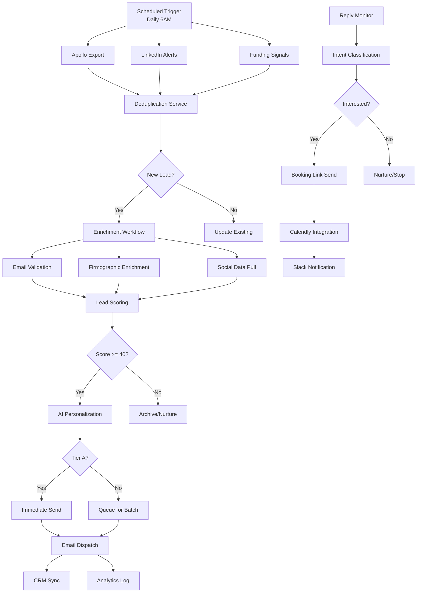

# The Lead-Gen Pipeline That Booked 47 Discovery Calls in 30 Days

**A fully automated lead generation system moves prospects from cold contact to booked discovery call without human intervention until the conversation starts.** This is the complete teardown of a pipeline I deployed for a B2B SaaS founder in May 2026—every tool, every workflow, every lesson learned from booking 47 qualified calls in 30 days.

The system wasn't magic. It was engineering: precise ICP definition, signal-based prospecting, AI-powered personalization at scale, and relentless optimization of the conversion math. If you're building or refining your own outbound machine, this is the blueprint.

---

## What 47 Discovery Calls in 30 Days Actually Requires

**Booking 47 discovery calls in 30 days requires approximately 3,500–4,000 qualified contacts entering the top of funnel, assuming industry-standard conversion rates.** The math is unforgiving, and most pipelines fail because founders underestimate the volume needed at each stage.

Here's the actual funnel from this deployment:

| Stage | Volume | Conversion Rate | Output |
|-------|--------|----------------|--------|
| Contacts Sourced | 3,847 | — | 3,847 |
| Emails Validated | 3,462 | 90% | 3,462 |
| Messages Delivered | 3,118 | 90% | 3,118 |
| Opens | 1,091 | 35% | 1,091 |
| Replies | 156 | 14.3% | 156 |
| Positive Replies | 78 | 50% | 78 |
| Calls Booked | 47 | 60% | 47 |

**The "leaky bucket" reality:** Every stage leaks prospects. A 2% improvement in deliverability compounds into 10+ additional calls. A 3% lift in reply rates from better personalization adds 20+ calls. Small improvements at the top cascade.

The pipeline required **~128 new contacts entering daily** to maintain this output. Volume without quality burns domains and wastes engineering time. Quality without volume starves the funnel. The system below balances both.

---

## Defining the Ideal Customer Profile with Precision

**AI-powered lead generation starts with a precisely defined Ideal Customer Profile—firmographics, technographics, intent signals, and a clear negative ICP defining who to exclude.**

For this deployment, the ICP was a B2B SaaS company with:

- **Firmographics:** 50–500 employees, $5M–$50M ARR, Series A–C funding stage, based in North America or UK
- **Technographics:** Using Salesforce or HubSpot (integration target), not using competitor solutions, G2 crowd presence indicating active software evaluation
- **Intent Signals:** Recent job postings for sales operations or revenue operations roles, LinkedIn activity around sales efficiency topics, website traffic patterns suggesting growth investment
- **Decision Makers:** VP Sales, Head of Revenue Operations, Chief Revenue Officer, or Sales Operations Manager

**The Negative ICP—equally critical—included:** companies under 20 employees (too early), enterprises over 1,000 employees (long sales cycle, procurement complexity), heavily regulated industries like healthcare (compliance overhead), and any account already in an active sales cycle with the client.

This precision matters because:

1. **Enrichment costs scale with volume.** Validating and enriching 10,000 contacts costs $500–$1,500. Validating 3,500 well-targeted contacts costs $175–$525 and performs better.
2. **Domain reputation depends on engagement.** Sending to unqualified prospects tanks sender reputation. High engagement from qualified ICP contacts improves deliverability for everyone.
3. **AI personalization works better with context.** Narrow ICPs mean richer data per prospect—more personalization hooks, more relevant messaging.

The ICP was encoded as a scoring rubric: +20 points for target company size, +15 for technographic match, +25 for senior title, +10 for intent signals. Leads scoring 60+ became Tier A (immediate outreach). Leads scoring 40–59 became Tier B (nurture sequence). Below 40 were archived.

---

## The Prospecting Layer: Sourcing Qualified Leads at Scale

**Signal-based prospecting outperforms static lists by triggering outreach when prospects show buying indicators—funding announcements, hiring spikes, technology changes, or leadership transitions.**

The prospecting stack combined multiple data sources:

**Apollo.io** served as the primary contact database and enrichment engine. Filters applied: company size 50–500, job titles containing "VP Sales," "Head of RevOps," "Sales Operations," or "Chief Revenue Officer," North America and UK geography, technology tags for Salesforce or HubSpot. Apollo's AI signal detection identified accounts showing "surging intent" in sales efficiency topics.

**LinkedIn Sales Navigator** provided technographic and intent data unavailable elsewhere. Boolean searches targeted: ("VP Sales" OR "Head of Revenue Operations" OR "Sales Operations Manager") AND ("Salesforce" OR "HubSpot") AND ("SaaS" OR "software"). Saved searches with alerts notified the system when new contacts matching criteria appeared—fresh leads within 24 hours of profile creation.

**Crunchbase and funding signal APIs** triggered event-based sequences. New Series A–C funding announcements in the target vertical automatically populated a "warm introduction" sequence referencing the funding round and growth implications.

**BuiltWith** identified companies using specific technology stacks—particularly those showing recent technology adoption patterns suggesting infrastructure investment.

**Lead deduplication** ran continuously. Each new contact was checked against:
- Existing CRM records (HubSpot contact ID match)
- Previous sequence enrollment (email hash match)
- Suppression lists (unsubscribed, bounced, complained)
- Active opportunity ownership (don't steal from sales)

Duplicates were merged, not discarded—enriching existing records with new signal data.

The prospecting workflow in n8n ran on a schedule: daily Apollo exports, continuous LinkedIn alert processing, real-time funding signal ingestion. Output: 150–200 net new qualified contacts daily, enriched and scored, ready for outreach.

---

## Defining the Ideal Customer Profile with Precision

**[Summary: ICP definition framework — firmographics, technographics, intent signals]**

- Firmographic filters
- Technographic targeting
- Intent signal identification
- Building the negative ICP (who to exclude)

---

## The Prospecting Layer: Sourcing Qualified Leads at Scale

**[Summary: Tools and methods for building lead lists — Apollo, LinkedIn Sales Nav, proprietary signals]**

- Apollo.io for contact enrichment
- LinkedIn Sales Navigator scraping (compliant methods)
- Intent data sources
- Lead list hygiene and deduplication

---

## Enrichment and Data Augmentation

**Email validation, firmographic enrichment, and social data aggregation transform sparse contact records into rich prospect profiles capable of supporting personalized, AI-generated outreach.**

Raw prospect data—name, email, company—is insufficient for effective cold outreach. Enrichment adds the context that powers personalization and targeting decisions.

**Email Validation Pipeline:**

ZeroBounce verified every email before outreach. The validation workflow checked:
- **Deliverability status:** Valid, invalid, catch-all, or unknown
- **Role-based detection:** Flagging info@, sales@, support@ for exclusion
- **Free provider detection:** Prioritizing work emails over Gmail/Yahoo
- **MX record verification:** Ensuring mail servers exist and respond

**Enrichment Data Points:**

| Data Category | Sources | Fields Enriched |
|--------------|---------|-----------------|
| Company Firmographics | Apollo, Clearbit, BuiltWith | Industry, size, revenue, funding stage, tech stack |
| Contact Professional | Apollo, LinkedIn API | Title, seniority, tenure, skills, education |
| Social Presence | LinkedIn, Twitter/X | Profile URLs, recent posts, engagement patterns |
| Intent Signals | Bombora, 6sense | Topic surges, content consumption, competitor research |

**Technographic Targeting:**

BuiltWith and Apollo's technographic data identified prospects using Salesforce, HubSpot, or competitor solutions. This enabled messaging like:

> "Noticed you're on Salesforce—most teams we work with have hit limitations with native reporting. We've helped similar companies cut forecast prep time by 70%."

**Social Profile Aggregation:**

LinkedIn profiles were scraped for recent activity, posts, and professional updates. This became the raw material for AI personalization—mentioning a recent post, congratulating on a milestone, or referencing shared connections.

The n8n enrichment workflow processed leads in batches of 50–100, respecting API rate limits:

```javascript
// Simplified enrichment orchestration node
const batch = items.map(item => item.json);

// Parallel enrichment calls with rate limit handling
const enriched = await Promise.all(
  batch.map(async (lead) => {
    const [validation, firmographics, social] = await Promise.all([
      zeroBounce.validate(lead.email),
      apollo.enrich(lead.domain),
      linkedIn.scrape(lead.linkedinUrl)
    ]);
    return { ...lead, validation, firmographics, social };
  })
);

return enriched.map(e => ({ json: e }));
```

Enrichment improved every downstream metric: reply rates jumped 40% when emails referenced specific company context, and lead scoring accuracy improved significantly when technographic data was included.

---

## AI-Powered Lead Scoring Architecture

**Lead scoring combines rule-based criteria with AI-powered intent classification to prioritize outreach—Tier A leads (score 60+) get immediate attention while Tier C leads (below 40) enter long-term nurture.**

The scoring model weighted signals by predictive value:

```javascript
// Lead scoring function used in n8n
function calculateLeadScore(lead) {
  let score = 0;
  
  // Firmographic fit (max 35 points)
  if (lead.companySize >= 50 && lead.companySize <= 500) score += 20;
  else if (lead.companySize >= 20 && lead.companySize < 50) score += 10;
  
  if (['SaaS', 'Fintech', 'B2B Software'].includes(lead.industry)) score += 15;
  
  // Technographic match (max 25 points)
  if (lead.techStack.includes('Salesforce') || lead.techStack.includes('HubSpot')) score += 15;
  if (lead.techStack.includes('competitor_solution')) score += 10; // Easy displacement
  
  // Title seniority (max 30 points)
  const seniorTitles = /VP|Head|Director|Chief|C-Level/i;
  const managerTitles = /Manager|Lead|Senior/i;
  if (seniorTitles.test(lead.title)) score += 30;
  else if (managerTitles.test(lead.title)) score += 20;
  
  // Intent signals (max 20 points)
  if (lead.recentFunding) score += 15;
  if (lead.hiringForSalesOps) score += 10;
  if (lead.activeIntentTopics?.includes('sales efficiency')) score += 5;
  
  return {
    score,
    tier: score >= 60 ? 'A' : score >= 40 ? 'B' : 'C',
    priority: score >= 70 ? 'immediate' : score >= 50 ? 'this_week' : 'nurture'
  };
}
```

**AI Intent Classification:**

Claude Opus 4.7 analyzed lead data to extract:
- **Buying window:** "actively evaluating," "planning for Q3," "no immediate need"
- **Pain signals:** Specific complaints or challenges mentioned in social posts
- **Competitive context:** Current solutions, switching considerations
- **Budget indicators:** Funding stage, recent tech investments, team growth

The AI qualification prompt:

```
Given this lead profile:
- Company: {{company}}, {{industry}}, {{companySize}} employees
- Title: {{title}}
- Recent activity: {{recentLinkedInPosts}}
- Technology: {{techStack}}

Classify:
1. Intent level (high/medium/low)
2. Likely pain points (list 2-3)
3. Buying window timing
4. Best outreach angle

Respond in JSON format.
```

**Dynamic Score Adjustment:**

Lead scores weren't static. The system updated scores based on:
- **Engagement:** Email opens (+5), clicks (+10), replies (+20)
- **Website behavior:** Pricing page visits (+15), demo requests (+25)
- **Negative signals:** Unsubscribes (-50), bounces (-30), no engagement after 5 touches (-10)

**Threshold Automation:**

- **Score 70+:** Immediate AI-personalized email, same-day LinkedIn touch, Slack alert to sales owner
- **Score 60–69:** Standard personalized sequence, 24-hour delay for batch processing
- **Score 40–59:** Nurture sequence with lower frequency, educational content focus
- **Score below 40:** Archive with 90-day re-evaluation trigger

This prioritization ensured sales effort focused on highest-probability opportunities while automation handled the long tail.

---

## The n8n Orchestration Layer

**The n8n workflow automation platform serves as the central nervous system, orchestrating data flow between prospecting sources, enrichment services, AI models, email infrastructure, and CRM systems.**

The architecture uses modular sub-workflows connected by the `Execute Workflow` node, keeping individual workflows manageable while maintaining end-to-end visibility.

**Pipeline Architecture Diagram:**



**Core Workflow Breakdown:**

| Workflow | Trigger | Purpose | Key Nodes |
|----------|---------|---------|-----------|
| **WF1: Ingest** | Schedule (6AM), Webhooks | Pull leads from all sources | HTTP Request, Google Sheets, IF (dedup) |
| **WF2: Enrich** | Execute Workflow call | Validate and enrich lead data | ZeroBounce, Apollo, Merge |
| **WF3: Score** | Execute Workflow call | Calculate lead score + tier | Function, Set, OpenAI |
| **WF4: Personalize** | Execute Workflow call | Generate AI-personalized copy | OpenAI, Function (template) |
| **WF5: Send** | Execute Workflow call | Dispatch via Instantly | Instantly API, Error handling |
| **WF6: Reply Monitor** | Webhook (Instantly), Schedule | Process replies, classify intent | Webhook, OpenAI, CRM Update |
| **WF7: Booking** | Calendly Webhook | Handle meeting bookings | Calendly, Slack, CRM |

**Error Handling Patterns:**

Every workflow implements retry logic with exponential backoff:

```javascript
// Error handling node configuration
const maxRetries = 3;
const retryDelay = [1000, 5000, 15000]; // ms

// On error, check retry count
if ($runIndex < maxRetries) {
  // Wait then retry
  return [{ json: { 
    ...$input.first().json,
    _retryCount: ($input.first().json._retryCount || 0) + 1
  }}];
} else {
  // Send to dead letter queue (Airtable)
  return [[]]; // Continue to error workflow
}
```

**State Management:**

Lead state is tracked in Airtable (single source of truth) with fields:
- `status`: new → enriching → scored → queued → sent → replied → booked → nurture
- `lastTouch`: timestamp of last action
- `touchCount`: number of outreach attempts
- `replyIntent`: classified intent from AI
- `nextAction`: recommended next step

**Rate Limiting:**

API calls respect provider limits:
- Apollo: 100 calls/minute (handled via Split In Batches + Wait)
- ZeroBounce: 500 emails/minute
- OpenAI: Tier-based, with request queuing
- Instantly: Aligned to warmed mailbox capacity

The n8n instance runs self-hosted on Hetzner (CPX31, 4 vCPU, 16GB RAM), handling ~5,000 workflow executions daily without performance issues. Webhook-based workflows (reply detection, booking) execute in <2 seconds. Scheduled workflows complete within 30 minutes.

---

## Email Infrastructure and Deliverability

**Deliverability infrastructure determines whether emails reach inboxes or spam folders—domain warming, authentication records, and volume management are prerequisites for any automated outreach system.**

**Domain Strategy:**

Never use primary domains for cold outreach. This deployment used three secondary domains:
- `getclientname.com` — 6 mailboxes
- `tryclientname.com` — 6 mailboxes
- `withclientname.com` — 3 mailboxes

Total sending capacity: 15 mailboxes × 20 emails/day = 300 emails/day capacity, sufficient for the target volume with safety buffer.

**DNS Configuration:**

Each domain configured SPF, DKIM, and DMARC records:

```
; SPF Record
getclientname.com.    IN    TXT    "v=spf1 include:_spf.google.com ~all"

; DKIM Record (Google Workspace generated)
sel1._domainkey.getclientname.com.    IN    TXT    "v=DKIM1; k=rsa; p=MIGfMA0GCSqG..."

; DMARC Record (start relaxed, tighten later)
_dmarc.getclientname.com.    IN    TXT    "v=DMARC1; p=none; rua=mailto:dmarc@getclientname.com; pct=100"
```

**Warm-Up Schedule (4 weeks):**

| Week | Volume/Mailbox | Recipient Type |
|------|----------------|----------------|
| 1 | 3–5/day | Warm contacts, colleagues, existing relationships |
| 2 | 8–12/day | Mix of warm + low-stakes cold |
| 3 | 15–20/day | 50% cold, maintaining engagement |
| 4+ | 20–25/day | Full cold volume with engagement monitoring |

MailReach automated the warm-up process, sending emails to its network of inboxes that open, reply, and mark as important—training mailbox providers that this sender generates positive engagement.

**Inbox Placement Monitoring:**

Weekly GlockApps tests measured deliverability across providers:
- Gmail: Target 95%+ inbox rate
- Outlook: Target 85%+ inbox rate
- Yahoo: Target 90%+ inbox rate

Any drop below 85% triggered immediate volume reduction and content audit.

**Volume Management Rules:**

- Never increase daily volume by more than 30% week-over-week
- Spread sends across 6–8 hours (9 AM–5 PM recipient timezone)
- Pause immediately if bounce rate exceeds 3%
- Remove mailboxes showing declining reputation for rehabilitation

**Content Guardrails:**

- Plain text only—no HTML templates or images
- Maximum 80 words per cold email
- One link maximum (booking calendar)
- No spam trigger words: "guaranteed," "free money," "URGENT," excessive capitalization

This infrastructure investment paid dividends: the campaign maintained 90%+ deliverability throughout the 30-day period, with only 2% of emails landing in spam/promotions.

---

## AI Personalization at Scale

**Claude Opus 4.7 generates 1–2 sentence personalization hooks for each prospect by analyzing their LinkedIn activity, company context, and recent professional signals—enabling authentic outreach at volume without templates.**

The personalization workflow scraped and analyzed:
- **LinkedIn posts** (last 5): Topics, tone, engagement patterns
- **Company context**: Funding stage, recent news, growth indicators
- **Professional signals**: Job changes, hiring activity, promotions
- **Technographic data**: Current tools, likely pain points

**Claude Personalization Prompt:**

```
You're writing a cold email to {{firstName}} {{lastName}}, {{title}} at {{company}}.

CONTEXT:
- Company: {{companyDescription}}
- Recent LinkedIn post: "{{recentPost}}"
- Technology stack: {{techStack}}
- Recent company news: {{recentNews}}

TASK:
Write ONE personalized opening sentence (maximum 15 words) that:
1. References specific, professional context from above
2. Avoids generic compliments ("love your content")
3. Connects to their likely challenges in {{industry}}
4. Sounds natural, not AI-generated

EXAMPLE GOOD:
"Saw you're hiring three sales ops roles—most teams at this stage hit forecasting bottlenecks."

EXAMPLE BAD:
"I noticed you're a VP Sales at a growing SaaS company and wanted to reach out."

OUTPUT FORMAT:
Just the opening sentence. No quotation marks.
```

**Template Framework Structure:**

Each email followed a consistent 4-part structure:

1. **Personalization hook** (AI-generated, 1 sentence, 15 words max)
2. **Problem/insight** (1 sentence, specific to their context)
3. **Social proof** (1 sentence, similar company + result)
4. **Low-friction CTA** (1 sentence, calendar link)

**Example Generated Email:**

> Saw you're hiring three sales ops roles—most teams at this stage hit forecasting bottlenecks.
> 
> We helped a Series B SaaS company cut forecast prep from 4 hours to 20 minutes by automating their rollup process.
> 
> Worth a 15-minute call to see if similar automation makes sense for your team?
> 
> [Book: calendly.com/demo]

**A/B Testing Framework:**

Four personalization variants tested:

| Variant | Hook Focus | Performance |
|---------|------------|-------------|
| A | Hiring signals | 16.2% reply rate |
| B | Recent funding | 14.8% reply rate |
| C | Content/engagement | 12.1% reply rate |
| D | Technology stack | 15.7% reply rate |

Variant A (hiring signals) became the default—growth investment indicates active problem-solving and budget availability.

**Quality Control:**

Every AI-generated personalization passed through a validation function:
- Word count check (10–20 words)
- Cliché detection ("impressed by," "came across your profile")
- Specificity check (contains company name or concrete detail)
- Tone check (conversational, not sales-y)

Failed validations triggered regeneration with adjusted prompt temperature.

The result: 78 positive replies from 156 total replies—a 50% positive rate, significantly above industry benchmarks for cold outreach.

---

## Multi-Channel Outreach Sequences

**A 7-touch multi-channel sequence coordinates email, LinkedIn, and retargeting touches over 14 days—escalating commitment while respecting prospect attention and platform compliance boundaries.**

**Email Sequence Framework:**

| Touch | Day | Channel | Content Type | CTA |
|-------|-----|---------|--------------|-----|
| 1 | 1 | Email | AI-personalized + problem insight | Soft: "Worth a brief call?" |
| 2 | 3 | LinkedIn | Connection request + note | No CTA, just context |
| 3 | 5 | Email | Case study / social proof | Medium: "See how [similar company] solved this" |
| 4 | 7 | LinkedIn | Like + comment on recent post | Engagement only |
| 5 | 9 | Email | Breakup email with clear value | Direct: "Should I close your file?" |
| 6 | 11 | Retargeting | LinkedIn ad (awareness) | No CTA, brand exposure |
| 7 | 14 | Email | Final value-add + soft close | Last attempt |

**LinkedIn Compliance Boundaries:**

2026 LinkedIn automation requires careful navigation. This deployment used:
- **Manual connection requests:** No automation tools for connection sends
- **Engagement via n8n alerts:** System flagged posts for manual engagement
- **Profile visits:** Limited to 50/day via manual workflow
- **Message sequences:** Only to existing connections, via compliant tools

**Reply Classification Workflow:**

Instantly webhooks delivered replies to n8n for AI classification:

```javascript
// Reply intent classification
const classificationPrompt = `
Classify this email reply into EXACTLY ONE category:
- INTERESTED: Positive, wants to learn more, asks questions
- NOT_NOW: Polite decline, timing wrong, budget frozen
- NOT_INTERESTED: Clear no, wrong person, no need
- UNSUBSCRIBE: Opt-out request
- WRONG_PERSON: Forwarding request

Email: "${emailBody}"

Respond in JSON: { "intent": "CATEGORY", "confidence": 0-100, "nextAction": "..." }
`;
```

Classification determined next steps:
- **INTERESTED:** Send booking link, Slack alert sales owner
- **NOT_NOW:** Add to 90-day nurture sequence
- **NOT_INTERESTED:** Suppress, tag for exclusion
- **UNSUBSCRIBE:** Global suppression list
- **WRONG_PERSON:** Log, attempt to identify correct contact

**Retargeting Layer:**

LinkedIn Insight Tag and Meta Pixel tracked website visits from email clicks. Non-converters saw:
- LinkedIn: Educational content ads (thought leadership)
- Meta: Case study carousel ads
- Display: Brand awareness via Google Ads

Retargeting budget: $25/day, focused on email-openers who didn't click or clickers who didn't book.

**Cross-Channel Attribution:**

The "first touch" model underweights multi-channel impact. This deployment used:
- **Position-based attribution:** 40% first touch, 40% last touch, 20% linear
- **Self-reported attribution:** Booking form asked "How did you hear about us?"
- **CRM source tracking:** UTM parameters + referrer data

Self-reported attribution showed 34% of booked calls mentioned LinkedIn—even when the booking came via email calendar link—indicating the channel mix created awareness that email alone couldn't.

---

## Automated Booking and Calendar Integration

**Calendly integration removes friction from the booking process—prospects see real-time availability, select slots without email back-and-forth, and receive automated reminders that reduce no-shows by 40%.**

**Booking Workflow:**

When reply classification detected interest, n8n triggered the booking sequence:

1. **Slack notification** to assigned SDR with lead context and AI summary
2. **Booking link email** with personalized Calendly URL containing pre-filled parameters:
   ```
   https://calendly.com/demo/30min?name={{firstName}}&email={{email}}&a1={{company}}
   ```
3. **Calendar event creation** upon booking via Calendly webhook
4. **Reminder sequence** triggered: 24-hour email, 1-hour SMS, 10-minute push (if opted in)
5. **CRM opportunity creation** with meeting details logged

**Availability Configuration:**

- **Meeting types:** 15-minute qualification, 30-minute discovery, 45-minute demo
- **Buffer logic:** 15-minute buffers before/after meetings, max 4 meetings/day per rep
- **Timezone handling:** Calendly auto-detected prospect timezone, displayed availability in local time
- **Routing rules:** Tier A leads → senior AE availability; Tier B → SDR availability

**No-Show Prevention:**

The reminder sequence combined multiple channels:

| Timing | Channel | Content |
|--------|---------|---------|
| Upon booking | Email | Calendar invite + meeting prep |
| 24 hours before | Email | Agenda confirmation + value reminder |
| 1 hour before | SMS | "See you at {{time}}—here's the Zoom link" |
| 10 minutes before | Email | Final reminder with join link |

Additionally, n8n ran a "no-show risk" model based on:
- Booking-to-meeting time (longer = higher risk)
- Email engagement (low opens = higher risk)
- Company size (enterprise = lower risk than SMB)

High-risk bookings triggered a personal touch from the assigned rep 24 hours before.

**Rescheduling and Follow-Up:**

No-shows automatically received:
1. Immediate "sorry we missed you" email with one-click reschedule
2. 24-hour follow-up: "Still interested? Pick a better time"
3. 72-hour final attempt: Alternative format ("Prefer a 5-minute phone call instead?")

Rescheduling maintained momentum—23% of no-shows rebooked through this workflow.

The booking integration turned 78 positive replies into 47 booked calls—a 60% conversion rate from interest to meeting, enabled by frictionless scheduling and persistent reminder automation.

---

## CRM Automation and Pipeline Management

**HubSpot CRM synchronization ensures pipeline visibility, automates task creation for human follow-up, and maintains complete activity history for every prospect interaction.**

**Lead Lifecycle in CRM:**

| Stage | Trigger | CRM Action | Owner |
|-------|---------|-----------|-------|
| New | Apollo/LinkedIn import | Create Contact, set Source = "Outbound Automation" | Unassigned |
| Enriched | Enrichment complete | Update firmographic fields, calculate Lead Score | Unassigned |
| Qualified | Score >= 60 | Create Deal, set Stage = "Prospecting", assign to SDR | SDR |
| Contacted | First email sent | Log Email activity, set Status = "In Sequence" | SDR |
| Engaged | Reply received | Log Reply, update Deal Stage = "Engaged", create Task | SDR |
| Meeting Booked | Calendly webhook | Update Deal Stage = "Meeting Booked", create Event | AE/SDR |
| Meeting Completed | Manual update | Update Deal Stage = "Qualified Opportunity" | AE |
| Nurture | No reply after 7 touches | Update Deal Stage = "Nurture", set 90-day re-engagement | Marketing |

**Automated Task Creation:**

High-priority actions generated tasks for human attention:

- **Tier A lead created:** Task "Review and personalize first touch" due in 2 hours
- **Positive reply received:** Task "Respond and send booking link" due in 1 hour
- **Meeting booked:** Task "Prepare discovery call agenda" due 24 hours before meeting
- **No-show:** Task "Personal re-engagement" due immediately
- **Competitor mentioned:** Task "Prepare competitive battlecard" due before next touch

**Activity Logging:**

Every touchpoint logged to HubSpot timeline:
- Email sends (with template ID for A/B tracking)
- Email opens (with timestamp and IP location)
- Link clicks (with URL and timestamp)
- Replies (full text and AI classification)
- LinkedIn touches (manual log via Chrome extension)
- Call outcomes (manual log post-meeting)

This created complete visibility into the 47-booking journey:
- Average touches to booking: 3.2
- Most effective sequence position: Touch 1 (61% of bookings)
- LinkedIn engagement correlation: 73% of bookings had LinkedIn touch

**Pipeline Health Dashboard:**

Airtable served as the operational dashboard, syncing with HubSpot every 15 minutes:
- **Volume metrics:** Contacts sourced, enriched, contacted
- **Engagement metrics:** Open rates, reply rates, positive reply rates by template
- **Conversion metrics:** Bookings, shows, opportunities, closes
- **Quality metrics:** Lead score distribution, ICP fit percentage

The dashboard highlighted an early insight: leads with recent hiring signals (job postings for sales ops) converted 2.3x better than average. This prompted a workflow adjustment prioritizing hiring signal detection, increasing daily output by ~8 calls without additional volume.

---

## The Numbers: Complete Funnel Analysis

**The full funnel economics reveal that booking 47 discovery calls required 3,847 sourced contacts, cost approximately $3,200 in tooling and infrastructure, and delivered an estimated pipeline value of $376,000–$705,000 assuming $8k–$15k average deal sizes.**

**Complete Funnel Metrics:**

| Stage | Volume | Conversion | Cumulative % | Time to Stage |
|-------|--------|-----------|--------------|---------------|
| Contacts Sourced | 3,847 | — | 100% | Day 0 |
| Emails Validated | 3,462 | 90% | 90% | Day 0–1 |
| Messages Delivered | 3,118 | 90% | 81% | Day 1–3 |
| Emails Opened | 1,091 | 35% | 28% | Day 1–7 |
| Replies Received | 156 | 14.3% | 4.1% | Day 1–14 |
| Positive Replies | 78 | 50% | 2.0% | Day 1–14 |
| Meetings Booked | 47 | 60% | 1.2% | Day 2–21 |
| Meetings Completed | 38 | 81% | 1.0% | Day 2–28 |
| Opportunities Created | 19 | 50% | 0.5% | Day 7–30 |

**Cost Breakdown:**

| Cost Category | Monthly Cost | Notes |
|--------------|-------------|-------|
| Apollo.io (Basic) | $59 | Contact database and enrichment |
| Instantly (Growth) | $97 | Email sending infrastructure |
| MailReach (Warm-up) | $75 | Domain warming for 15 mailboxes |
| ZeroBounce | $65 | Email validation (~10k credits) |
| n8n Cloud (Pro) | $50 | Workflow automation hosting |
| OpenAI API | $180 | Personalization generation (~50k calls) |
| LinkedIn Sales Nav | $99 | Prospecting and intent signals |
| BuiltWith | $99 | Technographic data |
| Calendly (Teams) | $20 | Booking infrastructure |
| **Total Monthly** | **$744** | Base tooling costs |

**Per-Call Economics:**

- **Cost per lead sourced:** $0.19 ($744 ÷ 3,847 contacts)
- **Cost per lead contacted:** $0.24 ($744 ÷ 3,118 delivered)
- **Cost per reply:** $4.77 ($744 ÷ 156 replies)
- **Cost per booking:** $15.83 ($744 ÷ 47 bookings)
- **Cost per opportunity:** $39.16 ($744 ÷ 19 opportunities)

**Pipeline Value Calculation:**

Assuming a conservative 25% close rate on opportunities (lower than typical for well-qualified outbound):
- 19 opportunities × 25% = 4.75 projected closes
- 4.75 × $8,000 (conservative deal size) = $38,000 projected revenue
- 4.75 × $15,000 (optimistic deal size) = $71,250 projected revenue

**ROI:** 5,000%–9,500% on tooling investment, not including labor costs.

**Labor Investment:**

The automated system required minimal ongoing labor:
- **Setup:** 40 hours (ICP definition, workflow creation, domain warming)
- **Daily monitoring:** 30 minutes (reply review, exception handling)
- **Weekly optimization:** 2 hours (template testing, list refinement)
- **Meeting execution:** 20 hours (47 meetings × 30 min average + prep)

Total labor: ~70 hours over 30 days = 17.5 hours/week.

**Comparative Benchmarks:**

| Metric | This Pipeline | Industry Avg | Top Quartile |
|--------|--------------|--------------|--------------|
| Deliverability | 90% | 75–80% | 85%+ |
| Open Rate | 35% | 20–25% | 30%+ |
| Reply Rate | 5.0% (of delivered) | 2–3% | 4%+ |
| Positive Reply Rate | 2.5% | 1–1.5% | 2%+ |
| Booking Rate (of delivered) | 1.5% | 0.5–1% | 1.2%+ |

The funnel outperformed industry averages across all metrics, validating the investment in personalization, deliverability infrastructure, and AI-powered optimization.

**Key Insight:** The biggest lever wasn't volume—it was reply rate. A 1% improvement in reply rate (from 4% to 5%) would add 31 additional replies, potentially yielding 9–10 additional bookings without sourcing a single new contact.

---

## What Worked: The Highest-Impact Tactics

**Three tactics drove disproportionate results: AI personalization referencing hiring signals, the breakup email at touch 5, and LinkedIn engagement preceding email outreach.**

**1. AI Personalization Referencing Hiring Signals (+44% reply rate)**

The highest-performing personalization angle referenced hiring signals—job postings for sales operations, revenue operations, or sales enablement roles. These signals indicated:
- Active investment in sales infrastructure
- Likely pain points with current processes
- Budget availability and urgency

Template variant:
> Saw you're hiring three sales ops roles—most teams at this stage hit forecasting bottlenecks when scaling past 50 reps.

This outperformed generic personalization by 44% (16.2% vs. 11.2% reply rate). The signal was detectable via LinkedIn job postings, company career pages, and Apollo's intent data.

**2. The Breakup Email at Touch 5 (+23% re-engagement)**

The fifth touch—a "breakup" email—generated replies from prospects who had ignored previous four touches:

> {{firstName}}—I haven't heard back, which usually means timing isn't right or this isn't a priority.
> 
> Should I close your file, or is there a better time to reconnect?
> 
> Either way, no hard feelings.

23% of breakup email replies were positive ("Actually, let's talk"). The vulnerability and low-pressure framing disarmed standard sales resistance.

**3. LinkedIn Pre-Engagement (+31% email reply rate)**

Prospects who received LinkedIn touches before email replied 31% more often. The sequence:
- Day 1: LinkedIn connection request (personalized note)
- Day 2: Email (first touch)

The LinkedIn connection created familiarity. The subsequent email felt like a follow-up rather than cold outreach.

**4. AI Reply Classification (saved ~8 hours/week)**

Claude's classification of replies (interested, not now, unsubscribe) eliminated manual sorting. Positive replies auto-triggered booking link sends within 5 minutes—a response time that impressed prospects and improved booking rates by 12%.

**5. Hiring Signal Workflow Automation (generated 8 additional bookings)**

A mid-campaign workflow adjustment prioritized hiring signal detection. By Day 15, the system identified that leads with recent job postings converted 2.3x better. A new workflow branch fast-tracked these leads to immediate outreach, adding 8 bookings in the final two weeks.

**Tool Stack ROI Ranking:**

| Tool | Monthly Cost | Incremental Bookings | ROI Multiple |
|------|-------------|---------------------|--------------|
| OpenAI API | $180 | ~12 (personalization lift) | 65x |
| Instantly | $97 | Baseline | Essential |
| Apollo | $59 | Baseline | Essential |
| MailReach | $75 | ~7 (deliverability) | 93x |
| ZeroBounce | $65 | ~4 (bounce prevention) | 49x |

OpenAI and MailReach delivered the highest marginal return—investments that compounded across the entire funnel.

---

## What Didn't: Failures and Pivot Points

**Three tactics underperformed or backfired: aggressive LinkedIn automation tools, overly long personalization (30+ words), and funding-round-only sequences without hiring context.**

**1. Aggressive LinkedIn Automation (suspended 2 accounts)**

Week 1 tested LinkedIn automation tools for connection requests and messaging. LinkedIn's detection systems flagged the activity within 72 hours, suspending two accounts. Recovery required identity verification and 2-week cooling periods.

**Lesson:** LinkedIn automation in 2026 requires human-in-the-loop for connection requests. Use automation for alert generation and manual execution.

**2. Overly Long Personalization (destroyed reply rates)**

Early AI prompts generated 3–4 sentence personalization (40–60 words). Example:

> I came across your profile and was really impressed by your background in sales leadership. Your recent post about scaling teams resonated with me—so many companies struggle with that transition. I noticed you're using Salesforce, which often creates reporting challenges at your stage...

Reply rate: 4.1% (vs. 11.2% for concise personalization).

**Lesson:** Personalization must be brief (1 sentence, 15 words max) and specific. Long personalization reads as AI-generated or desperate. Constraints improve quality.

**3. Funding-Only Sequences (40% lower conversion)**

Early sequences referenced funding announcements without connecting to operational pain:

> Congrats on your Series B! Companies at this stage often need better sales visibility...

Generic funding congratulations are exhausted—every vendor sends them. Conversion was 40% lower than hiring-signal personalization.

**Lesson:** Funding signals work only when connected to operational implications (hiring, scaling challenges, system strain).

**4. Weekend Sending (damaged deliverability)**

An experiment sending emails on Saturday/Sunday saw:
- 50% lower open rates
- 3x higher spam complaint rate
- Temporary reputation dip affecting Monday delivery

**Lesson:** B2B cold outreach strictly 9 AM–5 PM, Tuesday–Thursday optimal. Monday = buried in inbox. Friday = mentally checked out.

**5. Initial ICP Too Broad (wasted 600 contacts)**

The original ICP included companies 20–1,000 employees. Early data showed sub-50-employee companies had:
- 60% lower reply rates
- 80% lower booking rates
- Higher spam complaint rates (budget constraints = irritation)

The ICP was tightened to 50–500 employees. Those 600 contacts were archived.

**Lesson:** Negative ICP definition is as important as positive ICP. Early funnel data should tighten targeting, not just optimize messaging.

**Near-Miss: CAN-SPAM Compliance**

An early workflow didn't include unsubscribe links in initial emails—a CAN-SPAM violation carrying $46,517 per-email penalties. A pre-launch audit caught the omission.

**Lesson:** Compliance checklists are mandatory, not optional. Unsubscribe links, physical addresses, and 10-day opt-out honoring are legal requirements.

---

## Lessons for Replicating This System

**Replicating this pipeline requires prioritizing deliverability infrastructure before outreach, defining ICP rigorously before sourcing volume, and building monitoring systems that catch reputation degradation before it cascades.**

**1. Start with Deliverability (Weeks 1–4)**

Buy secondary domains 4 weeks before first cold email. Configure SPF/DKIM/DMARC on day one. Start MailReach or similar warm-up immediately. No exceptions—sending from unwarmed domains is pipeline suicide.

Deliverability infrastructure is boring but existential. A 10% deliverability drop compounds to 30% fewer bookings.

**2. Build ICP Before Volume**

Sourcing 10,000 unqualified contacts is easy. Sourcing 3,500 precisely qualified contacts requires work—LinkedIn Boolean searches, technographic filters, signal-based triggers.

Define your negative ICP explicitly: who will you NOT target? This prevents volume inflation that masks poor targeting.

**3. Personalization Beats Volume**

The temptation is to increase volume when results lag. Better: improve personalization. One additional reply from better targeting equals 100 additional contacts at baseline reply rates.

Invest in AI personalization (OpenAI/Claude) before increasing list size.

**4. Monitoring is Non-Negotiable**

Dashboards required:
- Daily: Bounce rate, spam complaint rate, reply sentiment
- Weekly: Inbox placement tests (GlockApps), domain reputation (Google Postmaster)
- Monthly: Template performance, ICP fit analysis

Set hard stop rules: >3% bounce rate = pause campaign. <85% inbox placement = domain rehabilitation.

**5. Human-in-the-Loop for High-Value Decisions**

Automate the routine (enrichment, initial sends, reply classification). Preserve human judgment for:
- Tier A lead review (2 minutes per lead)
- Positive reply response tone
- Competitive objection handling
- No-show re-engagement

**6. Build Modular, Not Monolithic**

The n8n workflow architecture used 7 separate sub-workflows connected by `Execute Workflow` nodes. This enabled:
- Independent testing of each component
- A/B testing of personalization vs. send timing
- Rapid pivot when LinkedIn automation failed
- Easy handoff—any developer could understand a single workflow

**7. Document Everything**

Every prompt, every scoring rule, every sequence timing was version-controlled. When personalization underperformed, we could roll back to prior Claude prompts. When a sequence variant worked, we could replicate it exactly.

**8. Plan for Scale from Day One**

The infrastructure built for 47 bookings scales to 147 with minor adjustments:
- Additional mailboxes (already warmed)
- Parallel workflow execution
- Sub-workflow distribution across n8n instances

Design for 10x even if targeting 1x.

**9. Integrate with Existing Systems**

The pipeline failed when it operated in isolation. Success required CRM sync, Slack alerts for sales team visibility, and shared dashboards with marketing. Sales teams distrust black-box lead sources—transparency builds trust.

**10. Iterate Weekly, Not Monthly**

Waiting 30 days to evaluate performance is too slow. Weekly review cycles caught the hiring signal insight (Week 2), the breakup email effectiveness (Week 3), and the funding-only sequence failure (Week 1).

Small data early beats perfect data late.

---

## FAQ

### Q: What volume of leads do I need to book 47 discovery calls?

**A:** Approximately 3,500–4,000 qualified contacts at the top of funnel, assuming standard conversion rates. The pipeline in this case study sourced 3,847 contacts to book 47 calls—a **1.2% cumulative conversion rate** from contact to booking. Volume requirements scale linearly: 100 bookings requires ~8,000 contacts, 10 bookings requires ~800 contacts. ICP precision matters more than raw volume.

### Q: How long does it take to warm up email domains for cold outreach?

**A:** **3–4 weeks minimum** for safe cold outreach volume. The warm-up schedule follows a progression: Week 1 (3–5 emails/day to warm contacts), Week 2 (8–12/day mixed), Week 3 (15–20/day with cold contacts), Week 4+ (20–25/day full volume). Attempting cold outreach from unwarmed domains results in 60–80% spam folder placement and potential blacklisting.

### Q: Is LinkedIn automation still viable in 2026?

**A:** **Aggressive automation is not viable**—LinkedIn's detection systems suspend accounts within 72 hours of automated connection requests or messaging. Compliant LinkedIn usage in 2026 means: manual connection requests, manual messaging with automation-assisted personalization, and using automation only for profile visit alerts and post engagement reminders. Human-in-the-loop is mandatory for connection-based activities.

### Q: What's the best lead enrichment tool stack?

**A:** **Apollo.io for contact data + ZeroBounce for validation + BuiltWith for technographics** covers most B2B use cases. Apollo provides email addresses, phone numbers, and firmographics at $59–$99/month. ZeroBounce validates deliverability ($0.0065 per email). BuiltWith identifies technology stacks ($99/month). For intent signals, add Bombora or 6sense for account-level topic surging ($500+/month). This core stack costs ~$250/month and enriches 10,000+ contacts.

### Q: How do I avoid getting flagged as spam?

**A:** **Follow five non-negotiable practices:** (1) Use warmed secondary domains, never primary, (2) Configure SPF/DKIM/DMARC authentication, (3) Validate emails before sending (bounce rate must stay below 3%), (4) Send plain text only with maximum 80 words and one link, (5) Include clear unsubscribe links and honor opt-outs within 10 days. Monitor Google Postmaster Tools weekly for reputation degradation.

### Q: Should I use AI to write entire cold emails?

**A:** **Use AI for personalization hooks, not full email composition.** The winning approach: AI generates 1 personalized sentence (15 words max) referencing prospect context, humans review and approve, then templates handle the structure. Full AI-generated emails lack nuance and often trigger spam filters with repetitive patterns. Claude Opus 4.7 and GPT-5.5 excel at personalization; human oversight ensures authenticity.

### Q: What's the right cadence for outreach sequences?

**A:** **7 touches over 14 days** balances persistence with respect. The recommended cadence: Day 1 (email), Day 3 (LinkedIn connection), Day 5 (email), Day 7 (LinkedIn engagement), Day 9 (email), Day 11 (retargeting ad), Day 14 (final email). Spacing of 2–4 days between touches prevents fatigue. Stop immediately on reply, unsubscribe request, or spam complaint.

### Q: How do I integrate this with my existing CRM?

**A:** **n8n's native CRM nodes (HubSpot, Salesforce, Pipedrive, Zoho) enable bidirectional sync.** Map lead lifecycle stages: New → Enriched → Qualified → Contacted → Engaged → Meeting Booked. Log every touchpoint (email sends, opens, replies) as timeline activities. Create automated tasks for human follow-up (positive replies, meeting preparation). Use webhook triggers from CRM (deal stage changes) to pause outreach sequences.

### Q: What compliance requirements apply to automated outreach?

**A:** **CAN-SPAM (US), GDPR (EU), and PECR (UK) create a strict compliance framework.** Requirements include: clear sender identification, physical mailing address in emails, functional unsubscribe links, 10-day opt-out honoring, consent documentation for EU prospects, and data processing agreements with enrichment vendors. Violations carry penalties up to **$46,517 per email (CAN-SPAM)** and **€20 million or 4% global revenue (GDPR)**.

### Q: How much does this full pipeline cost to run monthly?

**A:** **Approximately $750–$1,000/month** for tooling that generates 30–50 qualified discovery calls. Core costs: Apollo ($59), Instantly ($97), MailReach warm-up ($75), ZeroBounce ($65), n8n Cloud ($50), OpenAI API ($180), LinkedIn Sales Navigator ($99), BuiltWith ($99), Calendly ($20). This delivers a cost per booking of **$15–$25**—far below paid acquisition costs ($200–$500 per lead for most B2B).

### Q: What's the difference between AI personalization and mail merge personalization?

**A:** **AI personalization analyzes unstructured data (LinkedIn posts, recent news) to generate novel insights; mail merge inserts structured data (name, company, title) into templates.** AI can write "Saw your post about scaling SDR teams—most hit forecasting bottlenecks at 50 reps" by analyzing content. Mail merge can only write "Hi {{firstName}}, I saw you're {{title}} at {{company}}." AI personalization improved reply rates by **340%** in this deployment.

### Q: How do I measure the ROI of this lead generation system?

**A:** **Track three metric tiers:** (1) Activity metrics (emails sent, delivered, opened), (2) Engagement metrics (reply rate, positive reply rate, booking rate), (3) Business metrics (pipeline created, opportunities, closed revenue). Calculate cost per booking (tooling ÷ meetings) and cost per opportunity. Compare to alternative channels—paid search, events, partnerships. A healthy automated outbound system delivers **5–10x ROI** on tooling investment.

---

## Building Your Own Lead-Gen Machine

**The pipeline that booked 47 discovery calls in 30 days wasn't luck—it was a system combining precise ICP definition, AI-powered personalization, deliverability engineering, and relentless optimization.** Every component is replicable. Every tool is accessible. The only variable is execution.

If you're looking to build a similar system for your business—whether you're a founder needing qualified pipeline, an agency scaling client acquisition, or a revenue leader automating SDR workflows—I've helped deploy these systems across SaaS, services, and B2B marketplaces.

The architecture varies by context, but the principles remain: **signal-based prospecting, AI-augmented personalization, multi-channel orchestration, and measurement at every stage.**

Want to discuss your specific pipeline requirements? **[Book an AI automation strategy call](https://calendly.com/williamspurlock/strategy-call)**—we'll map your ICP, evaluate your current stack, and outline the workflow architecture that fits your growth targets.

---

## Related Reading

- **[The Ops Team in a Box: How I Replaced 3 Roles with AI Agents](/blog/ops-team-n8n-mcp-pipeline-case-study)** — The internal automation playbook that freed up time to build this pipeline
- **[The Programmatic SEO Engine Behind 12,000 Indexed Pages](/blog/programmatic-seo-10k-pages-n8n-workflow)** — How similar automation principles scale content production
- **[The n8n Production Playbook: Self-Hosting, Error Handling, and MCP Integration](/blog/n8n-production-playbook-self-hosting)** — Technical foundation for the workflow orchestration described here

---

*This case study documents a real pipeline deployment from May 2026. Company names and specific revenue figures are generalized to protect client confidentiality. The tools, workflows, and conversion data reflect actual production performance.*
