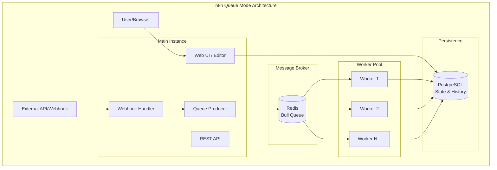
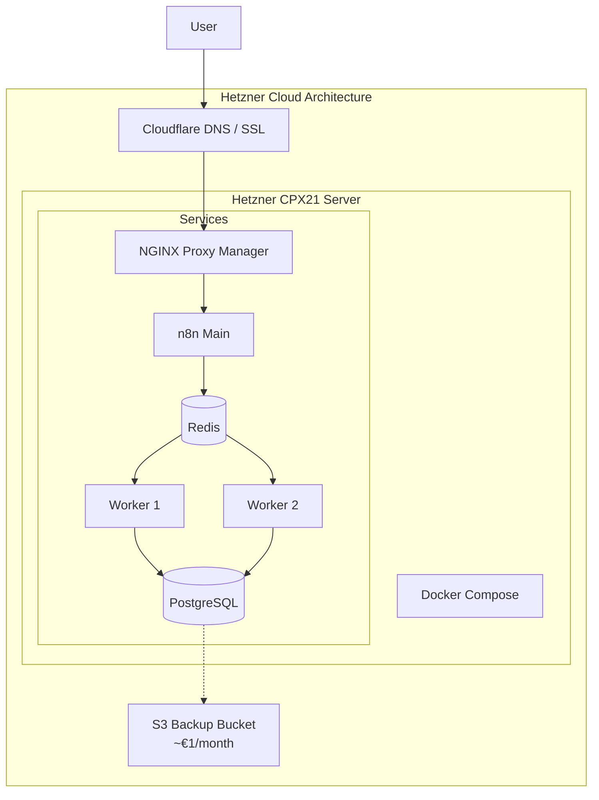
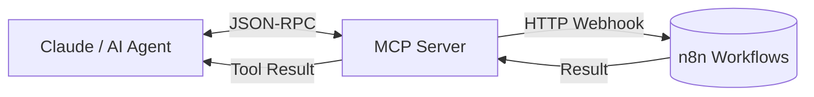

# The n8n Production Playbook: Self-Hosting, Sub-Workflows, Error Recovery

**Running n8n in production requires more than clicking "Execute Workflow."** It demands container orchestration, database persistence, queue-based scaling, and bulletproof error recovery. This guide covers everything I've learned deploying n8n for real business workloads — from solo founders processing thousands of leads monthly to ops teams orchestrating multi-system integrations.

## What This Guide Covers

This playbook is organized into four major sections that mirror how you'll actually deploy and operate n8n in production:

1. **Infrastructure Foundations** — Self-hosting decisions, Docker Compose configurations, PostgreSQL persistence, and queue mode scaling for horizontal execution capacity.

2. **Workflow Architecture** — Sub-workflow patterns that transform monolithic automation messes into maintainable, composable systems you can test and version.

3. **Operational Resilience** — Error handling strategies from node-level retries to circuit breakers, plus backup and disaster recovery procedures that actually work when you need them.

4. **Production Operations** — Monitoring with Prometheus and Grafana, security hardening, deployment platform comparisons (Hetzner vs Railway vs Kubernetes), and platform selection guidance.

Each section includes real configuration files, architecture diagrams, and patterns I've validated across dozens of production deployments. This isn't documentation regurgitation — it's the operational knowledge you need when workflows fail at 2 AM.

## Self-Hosting n8n: Why and When

**Self-hosting n8n is the only path for production AI workflows that handle sensitive data, require custom nodes, or need guaranteed execution capacity.** Cloud n8n caps executions at plan limits, restricts community node installation, and routes your data through infrastructure you don't control. For teams running business-critical automations, the operational overhead of self-hosting is less risky than the platform limitations of managed cloud.

### Cloud vs Self-Hosted: The Production Decision Matrix

The choice between n8n Cloud and self-hosted n8n isn't just about cost — it's about control, compliance, and capability. Here's how the options compare across dimensions that actually matter in production:

| Factor | n8n Cloud | Self-Hosted n8n |
|--------|-----------|-----------------|
| **Data Control** | Data stored on n8n infrastructure; egress through their systems | Complete data sovereignty; stays within your VPC/network |
| **Execution Limits** | Tier-based caps (Starter: 5K/month, Pro: 15K/month, Enterprise: custom) | Unlimited executions bounded only by your infrastructure |
| **Custom Nodes** | Restricted set; no community npm packages | Full access to 800+ community nodes; install any npm package |
| **Community Nodes** | Limited approved set | Unlimited — any node from the n8n community registry |
| **Pricing at Scale** | $50–$500+/month depending on tier | Infrastructure cost only: $5–$50/month for most workloads |
| **Compliance** | SOC 2, GDPR; no HIPAA BAA available | Self-attest any compliance; data never leaves your environment |
| **Webhook Latency** | ~100–300ms additional routing overhead | Direct to your infrastructure; minimal latency |
| **High Availability** | Managed by n8n; limited visibility | Design your own redundancy with multi-instance setups |
| **Backup/Recovery** | Limited export options; no direct DB access | Full PostgreSQL backups, point-in-time recovery, Git versioning |
| **Code Execution** | Sandbox restrictions on Code nodes | Full Node.js/Python execution environment |

The economics become undeniable at scale. A workflow with 10 steps running 50,000 times monthly costs approximately **$200–$400 on Zapier** (task-based pricing), **$80–$150 on Make** (operation-based), but just **the infrastructure cost on self-hosted n8n** — typically under $20/month on Hetzner or equivalent VPS.

### When Self-Hosting Becomes Mandatory

These scenarios make self-hosting non-negotiable:

**Regulatory and Compliance Requirements**
- **HIPAA** — Healthcare data requires Business Associate Agreements that n8n Cloud cannot provide; self-hosting lets you control the entire compliance boundary.
- **GDPR Data Residency** — When contracts mandate EU-only data processing, self-hosting on European infrastructure (Hetzner EU regions, AWS eu-west-1) guarantees residency.
- **Financial Services** — PCI-DSS and SOX requirements often prohibit third-party automation platforms from touching transaction data.

**Technical and Scale Requirements**
- **Volume > 10,000 executions/day** — Cloud tier limits become painful and expensive; self-hosted queue mode scales horizontally.
- **Custom API Integrations** — Internal APIs, legacy SOAP services, or niche SaaS tools without native n8n nodes require community packages or HTTP Request nodes with custom auth.
- **Sub-100ms Webhook Requirements** — High-frequency trading, real-time gaming, or latency-sensitive IoT pipelines need direct infrastructure without cloud routing overhead.
- **Offline/Air-Gapped Environments** — Manufacturing floors, secure facilities, or disaster recovery sites without internet access need on-premise deployment.

**Operational Control Requirements**
- **Custom Error Handling** — Building circuit breakers, dead letter queues, and self-healing patterns requires deep execution control.
- **Workflow-as-Code** — Git-based versioning, CI/CD pipelines, and infrastructure-as-code practices demand direct file system and API access.
- **Multi-Environment Promotion** — Staging → production workflows with environment-specific configurations and approval gates need self-hosted flexibility.

## Docker Compose: The Production Foundation

**A production n8n deployment starts with a properly configured Docker Compose stack.** The configuration defines your persistence strategy, security boundaries, and scaling topology. I've standardized on three Compose patterns across client deployments: minimal production (single instance), queue mode (scaled execution), and full observability (with monitoring stack).

### Minimal Production Docker Compose

This configuration is your starting point for production — PostgreSQL persistence, persistent volume for n8n data, and restart policies for resilience. It handles hundreds to thousands of executions daily without queue mode.

```yaml
# docker-compose.yml - Minimal production n8n
version: "3.9"

services:
  n8n:
    image: n8nio/n8n:1.84.0
    restart: unless-stopped
    ports:
      - "5678:5678"
    environment:
      - N8N_BASIC_AUTH_ACTIVE=true
      - N8N_BASIC_AUTH_USER=admin
      - N8N_BASIC_AUTH_PASSWORD=${N8N_BASIC_AUTH_PASSWORD}
      - N8N_ENCRYPTION_KEY=${N8N_ENCRYPTION_KEY}
      - DB_TYPE=postgresdb
      - DB_POSTGRESDB_HOST=postgres
      - DB_POSTGRESDB_PORT=5432
      - DB_POSTGRESDB_DATABASE=n8n
      - DB_POSTGRESDB_USER=n8n
      - DB_POSTGRESDB_PASSWORD=${POSTGRES_PASSWORD}
      - N8N_HOST=${N8N_HOST}
      - N8N_PORT=5678
      - N8N_PROTOCOL=https
      - WEBHOOK_URL=https://${N8N_HOST}/
      - GENERIC_TIMEZONE=America/New_York
      - N8N_LOG_LEVEL=info
    volumes:
      - n8n_data:/home/node/.n8n
    depends_on:
      postgres:
        condition: service_healthy
    healthcheck:
      test: ["CMD", "wget", "--spider", "-q", "http://localhost:5678/healthz"]
      interval: 30s
      timeout: 10s
      retries: 3
      start_period: 40s

  postgres:
    image: postgres:16-alpine
    restart: unless-stopped
    environment:
      - POSTGRES_USER=n8n
      - POSTGRES_PASSWORD=${POSTGRES_PASSWORD}
      - POSTGRES_DB=n8n
    volumes:
      - postgres_data:/var/lib/postgresql/data
    healthcheck:
      test: ["CMD-SHELL", "pg_isready -U n8n -d n8n"]
      interval: 10s
      timeout: 5s
      retries: 5

volumes:
  n8n_data:
  postgres_data:
```

The `.env` file for this configuration:

```bash
# n8n Core
N8N_ENCRYPTION_KEY=your-32-char-random-key-here-please
N8N_BASIC_AUTH_PASSWORD=secure-admin-password-here
N8N_HOST=n8n.yourdomain.com

# Database
POSTGRES_PASSWORD=another-secure-password-here
```

**Critical elements in this minimal setup:**

- **Pinned image version** (`n8nio/n8n:1.84.0`) — Never use `latest` in production; pin to a specific version and upgrade deliberately after testing
- **PostgreSQL persistence** — SQLite corrupts under concurrent write load; Postgres handles the execution history and concurrent access patterns n8n generates
- **Encryption key** — `N8N_ENCRYPTION_KEY` encrypts credentials in the database; lose this and your credentials are permanently irretrievable
- **Health checks** — Both n8n and Postgres have health checks defined; orchestrators use these for restart decisions and dependency ordering
- **Environment isolation** — Secrets live in `.env`, never in the Compose file or committed to Git

### Full-Stack with Queue Mode and Redis

When execution volume grows or you need horizontal scaling, queue mode separates the web UI/API from workflow execution workers. Redis acts as the message broker between them.

```yaml
# docker-compose.yml - Queue mode with Redis and multiple workers
version: "3.9"

services:
  n8n-main:
    image: n8nio/n8n:1.84.0
    restart: unless-stopped
    command: n8n
    ports:
      - "5678:5678"
    environment:
      - N8N_BASIC_AUTH_ACTIVE=true
      - N8N_BASIC_AUTH_USER=admin
      - N8N_BASIC_AUTH_PASSWORD=${N8N_BASIC_AUTH_PASSWORD}
      - N8N_ENCRYPTION_KEY=${N8N_ENCRYPTION_KEY}
      - DB_TYPE=postgresdb
      - DB_POSTGRESDB_HOST=postgres
      - DB_POSTGRESDB_PORT=5432
      - DB_POSTGRESDB_DATABASE=n8n
      - DB_POSTGRESDB_USER=n8n
      - DB_POSTGRESDB_PASSWORD=${POSTGRES_PASSWORD}
      - N8N_HOST=${N8N_HOST}
      - N8N_PORT=5678
      - N8N_PROTOCOL=https
      - WEBHOOK_URL=https://${N8N_HOST}/
      - GENERIC_TIMEZONE=America/New_York
      - EXECUTIONS_MODE=queue
      - QUEUE_BULL_REDIS_HOST=redis
      - QUEUE_BULL_REDIS_PORT=6379
      - N8N_MULTI_MAIN_SETUP_ENABLED=true
    volumes:
      - n8n_data:/home/node/.n8n
    depends_on:
      postgres:
        condition: service_healthy
      redis:
        condition: service_healthy
    healthcheck:
      test: ["CMD", "wget", "--spider", "-q", "http://localhost:5678/healthz"]
      interval: 30s
      timeout: 10s
      retries: 3

  n8n-worker:
    image: n8nio/n8n:1.84.0
    restart: unless-stopped
    command: worker
    environment:
      - N8N_ENCRYPTION_KEY=${N8N_ENCRYPTION_KEY}
      - DB_TYPE=postgresdb
      - DB_POSTGRESDB_HOST=postgres
      - DB_POSTGRESDB_PORT=5432
      - DB_POSTGRESDB_DATABASE=n8n
      - DB_POSTGRESDB_USER=n8n
      - DB_POSTGRESDB_PASSWORD=${POSTGRES_PASSWORD}
      - EXECUTIONS_MODE=queue
      - QUEUE_BULL_REDIS_HOST=redis
      - QUEUE_BULL_REDIS_PORT=6379
      - GENERIC_TIMEZONE=America/New_York
    volumes:
      - n8n_data:/home/node/.n8n
    depends_on:
      postgres:
        condition: service_healthy
      redis:
        condition: service_healthy
    deploy:
      replicas: 2

  redis:
    image: redis:7-alpine
    restart: unless-stopped
    command: redis-server --save "" --appendonly no
    volumes:
      - redis_data:/data
    healthcheck:
      test: ["CMD", "redis-cli", "ping"]
      interval: 10s
      timeout: 5s
      retries: 3

  postgres:
    image: postgres:16-alpine
    restart: unless-stopped
    environment:
      - POSTGRES_USER=n8n
      - POSTGRES_PASSWORD=${POSTGRES_PASSWORD}
      - POSTGRES_DB=n8n
    volumes:
      - postgres_data:/var/lib/postgresql/data
    command: >
      postgres
      -c shared_buffers=256MB
      -c effective_cache_size=768MB
      -c maintenance_work_mem=64MB
      -c checkpoint_completion_target=0.9
      -c wal_buffers=16MB
      -c default_statistics_target=100
      -c random_page_cost=1.1
      -c effective_io_concurrency=200
      -c work_mem=8MB
      -c min_wal_size=1GB
      -c max_wal_size=4GB
    healthcheck:
      test: ["CMD-SHELL", "pg_isready -U n8n -d n8n"]
      interval: 10s
      timeout: 5s
      retries: 5

  backup:
    image: offen/docker-volume-backup:latest
    restart: unless-stopped
    environment:
      - BACKUP_CRON_EXPRESSION=0 3 * * *
      - BACKUP_RETENTION_DAYS=30
      - BACKUP_ARCHIVE_COMPRESSION=gzip
      - BACKUP_FILENAME=backup-%Y-%m-%dT%H-%M-%S.tar.gz
      - AWS_S3_BUCKET_NAME=${S3_BUCKET}
      - AWS_ACCESS_KEY_ID=${AWS_ACCESS_KEY}
      - AWS_SECRET_ACCESS_KEY=${AWS_SECRET_KEY}
      - AWS_S3_ENDPOINT=${S3_ENDPOINT}
    volumes:
      - n8n_data:/backup/n8n:ro
      - postgres_data:/backup/postgres:ro
      - redis_data:/backup/redis:ro

volumes:
  n8n_data:
  postgres_data:
  redis_data:
```

Scale workers dynamically based on load:

```bash
# Scale to 4 workers during peak processing
docker compose up -d --scale n8n-worker=4

# Scale back to 2 during quiet periods
docker compose up -d --scale n8n-worker=2
```

### Environment Variables Reference

These environment variables control n8n's behavior across deployment scenarios:

**Core Security (Required)**

| Variable | Purpose | Production Requirement |
|----------|---------|----------------------|
| `N8N_ENCRYPTION_KEY` | Encrypts credentials in database | **Mandatory** — 32+ character random string; back up securely |
| `N8N_BASIC_AUTH_ACTIVE` | Enables HTTP basic authentication | Recommended for instances without external auth proxy |
| `N8N_BASIC_AUTH_USER` | Basic auth username | Set if basic auth enabled |
| `N8N_BASIC_AUTH_PASSWORD` | Basic auth password | Strong random password |

**Database Configuration (Required for Postgres)**

| Variable | Purpose | Example |
|----------|---------|---------|
| `DB_TYPE` | Database driver selection | `postgresdb` |
| `DB_POSTGRESDB_HOST` | PostgreSQL server hostname | `postgres` (service name in Compose) |
| `DB_POSTGRESDB_PORT` | PostgreSQL port | `5432` |
| `DB_POSTGRESDB_DATABASE` | Database name | `n8n` |
| `DB_POSTGRESDB_USER` | Database user | `n8n` |
| `DB_POSTGRESDB_PASSWORD` | Database password | From `.env` |

**Queue Mode (Required for Scaling)**

| Variable | Purpose | Values |
|----------|---------|--------|
| `EXECUTIONS_MODE` | Execution processing mode | `regular` (default) or `queue` |
| `QUEUE_BULL_REDIS_HOST` | Redis server hostname | `redis` |
| `QUEUE_BULL_REDIS_PORT` | Redis port | `6379` |
| `N8N_MULTI_MAIN_SETUP_ENABLED` | Allows multiple main instances | `true` for HA setups |

**Networking and URLs**

| Variable | Purpose | Production Note |
|----------|---------|-----------------|
| `N8N_HOST` | Hostname for n8n instance | Must match your DNS and reverse proxy |
| `N8N_PORT` | Internal port (usually 5678) | Change only if you have port conflicts |
| `N8N_PROTOCOL` | `http` or `https` | Always `https` in production |
| `WEBHOOK_URL` | External URL for webhooks | Must include trailing slash; used for webhook generation |
| `GENERIC_TIMEZONE` | Default timezone for Cron triggers | IANA timezone string, e.g., `America/New_York` |

**Security Hardening**

| Variable | Purpose | Recommendation |
|----------|---------|----------------|
| `N8N_BLOCK_ENV_ACCESS_IN_NODE` | Prevents Code nodes from reading `process.env` | `true` in multi-user/shared environments |
| `N8N_SECURE_COOKIE` | Forces secure cookie flags | `true` when behind HTTPS |
| `N8N_MFA_ENFORCED_ENABLED` | Requires 2FA for all users | `true` for security-critical deployments |
| `N8N_COMMUNITY_PACKAGES_ENABLED` | Allows community node installation | `false` to prevent unauthorized package installation |

## PostgreSQL: The Production Database

**SQLite handles development; PostgreSQL handles production.** The database choice determines your concurrency ceiling, backup reliability, and recovery capabilities. SQLite's file-locking architecture fails under concurrent write loads that n8n's parallel execution patterns generate. PostgreSQL's MVCC (Multi-Version Concurrency Control) handles the mixed read/write workload of active workflow execution without corruption or locking contention.

### Why PostgreSQL Is Non-Negotiable at Scale

The performance and reliability differences between SQLite and PostgreSQL become visible under production load:

**Concurrency Handling**
- SQLite supports one writer at a time with file-level locking; concurrent executions queue and timeout
- PostgreSQL handles hundreds of concurrent connections with row-level locking; executions proceed in parallel

**Data Integrity Guarantees**
- SQLite offers basic ACID compliance but limited crash recovery; power loss during write can corrupt the entire database
- PostgreSQL's WAL (Write-Ahead Logging) provides point-in-time recovery; crashes replay committed transactions on restart

**Backup and Point-in-Time Recovery**
- SQLite backups require file copies while n8n is stopped or use VACUUM INTO with consistency risks
- PostgreSQL supports online `pg_dump` exports, streaming replication, and continuous archiving to S3

**Execution History at Volume**
- SQLite performance degrades as execution history grows; queries against large tables slow significantly
- PostgreSQL handles millions of execution records with proper indexing; partition strategies manage historical data

**Operational Tooling**
- SQLite has minimal monitoring and optimization tooling
- PostgreSQL integrates with Prometheus exporters, query analyzers, and connection poolers like PgBouncer

### PostgreSQL Docker Configuration

The PostgreSQL service in the Docker Compose examples includes optimized settings for n8n workloads. Here's the detailed breakdown:

```yaml
postgres:
  image: postgres:16-alpine
  restart: unless-stopped
  environment:
    - POSTGRES_USER=n8n
    - POSTGRES_PASSWORD=${POSTGRES_PASSWORD}
    - POSTGRES_DB=n8n
  volumes:
    - postgres_data:/var/lib/postgresql/data
  # Production-tuned PostgreSQL configuration
  command: >
    postgres
    -c shared_buffers=256MB
    -c effective_cache_size=768MB
    -c maintenance_work_mem=64MB
    -c checkpoint_completion_target=0.9
    -c wal_buffers=16MB
    -c default_statistics_target=100
    -c random_page_cost=1.1
    -c effective_io_concurrency=200
    -c work_mem=8MB
    -c min_wal_size=1GB
    -c max_wal_size=4GB
    -c max_connections=200
```

**Configuration parameter rationale:**

| Parameter | Value | Purpose |
|-----------|-------|---------|
| `shared_buffers` | 256MB | PostgreSQL's internal cache; ~25% of available RAM for dedicated DB server |
| `effective_cache_size` | 768MB | Estimate of OS + PG cache; influences query planner decisions |
| `maintenance_work_mem` | 64MB | Memory for vacuum, index creation, and similar operations |
| `checkpoint_completion_target` | 0.9 | Spread checkpoint writes over 90% of checkpoint interval; reduces I/O spikes |
| `wal_buffers` | 16MB | Write-ahead log buffer size; helps with write-heavy workloads |
| `random_page_cost` | 1.1 | Cost estimate for random disk page fetch; lower for SSD storage |
| `effective_io_concurrency` | 200 | Number of concurrent disk I/O operations for SSD storage |
| `work_mem` | 8MB | Memory per query operation (sort, hash join); tune based on concurrent query count |
| `max_wal_size` | 4GB | Maximum WAL size before forced checkpoint; larger = fewer checkpoints but longer recovery |
| `max_connections` | 200 | Connection limit; n8n pools connections internally; 200 supports significant scale |

For a 2GB RAM VPS hosting both n8n and PostgreSQL, these settings balance memory between the database and the application. On dedicated database servers, increase `shared_buffers` to 25% of total RAM and `effective_cache_size` to 75%.

### Database Migration from SQLite to PostgreSQL

If you started with SQLite and need to migrate to PostgreSQL for production scaling, follow this procedure:

**Step 1: Export Existing Workflows and Credentials**

Export all workflows before migration:

```bash
# Stop n8n to ensure consistent state
docker compose stop n8n

# Create backup directory
mkdir -p ~/n8n-migration-backup

# Copy SQLite database (if using default location)
cp ~/.n8n/database.sqlite ~/n8n-migration-backup/

# Export all workflows via n8n CLI (if available)
docker run --rm -v ~/.n8n:/home/node/.n8n n8nio/n8n:1.84.0 \
  n8n export:workflow --all --output=/home/node/.n8n/workflows-backup.json
```

**Step 2: Start PostgreSQL and Initialize Database**

```bash
# Update docker-compose.yml with PostgreSQL configuration
# Set DB_TYPE=postgresdb and database connection variables in .env

# Start only PostgreSQL first
docker compose up -d postgres

# Wait for PostgreSQL to be healthy
docker compose exec postgres pg_isready -U n8n
```

**Step 3: Start n8n and Import Data**

```bash
# Start n8n with new database configuration
docker compose up -d n8n

# Wait for initialization to complete
docker compose logs -f n8n

# Import workflows via UI or API
# Credentials must be re-entered (they're encrypted with N8N_ENCRYPTION_KEY and stored per-database)
```

**Important:** Credentials don't migrate between database backends because each database uses a unique encryption context. After migration, you'll need to re-enter credentials in the n8n UI, but workflows (which reference credentials by ID) will reconnect once credentials are recreated with matching names.

### Connection Pooling and Performance Tuning

n8n maintains a connection pool to PostgreSQL. Under high load, connection exhaustion manifests as "too many connections" errors or execution timeouts. Monitor these metrics:

**PostgreSQL Connection Monitoring**

```sql
-- Active connections by state
SELECT state, COUNT(*) 
FROM pg_stat_activity 
WHERE datname = 'n8n' 
GROUP BY state;

-- Connection count by application
SELECT application_name, COUNT(*) 
FROM pg_stat_activity 
WHERE datname = 'n8n' 
GROUP BY application_name;
```

**n8n Database Connection Configuration**

n8n uses TypeORM with built-in connection pooling. The pool size defaults to 10 connections per n8n instance. For queue mode with multiple workers, each worker maintains its own pool. Monitor total connections:

- Main instance: ~10 connections
- Each worker: ~10 connections  
- Background processes: ~5 connections

For 1 main + 4 workers, expect ~55 database connections during active processing. Set PostgreSQL `max_connections` to at least 100 to handle this with headroom.

**Performance Optimization Checklist**

- **Vacuum and analyze regularly** — PostgreSQL's autovacuum handles this, but monitor for table bloat: `SELECT schemaname, relname, n_dead_tup FROM pg_stat_user_tables WHERE n_dead_tup > 1000;`

- **Index maintenance** — The `execution_entity` table grows large with execution history. Ensure indexes on `workflowId`, `finished`, and `startedAt` are maintained.

- **Execution retention policy** — Prune old executions to keep table size manageable. Use n8n's built-in pruning or implement custom cleanup:

```sql
-- Delete executions older than 90 days (run during low-activity period)
DELETE FROM execution_entity 
WHERE "startedAt" < NOW() - INTERVAL '90 days';
```

- **Connection pooler consideration** — At very high scale (>100 concurrent executions sustained), add PgBouncer as a connection pooler between n8n and PostgreSQL to reduce connection overhead.

## Queue Mode: Scaling Beyond Single-Instance Limits

**Queue mode transforms n8n from a single-process workflow engine into a horizontally scalable execution cluster.** Instead of the main n8n process executing workflows directly — which creates a single-threaded bottleneck — queue mode separates concerns: the main instance manages the UI, API, and webhook reception, while worker processes consume execution jobs from a Redis-backed queue.

### How Queue Mode Works

The queue mode architecture distributes responsibilities across four component types:



**Component Responsibilities:**

- **Main Instance** (`n8n` command): Serves the web UI, handles API requests, receives webhooks and triggers, enqueues execution jobs to Redis. Does not execute workflows itself when `EXECUTIONS_MODE=queue`.

- **Worker Instances** (`n8n worker` command): Poll Redis for available execution jobs, pull workflow definitions from PostgreSQL, execute the workflow, and write results back to PostgreSQL. Stateless — any worker can execute any workflow.

- **Redis** (Bull message queue): Stores the execution job queue with waiting, active, completed, and failed job states. Provides the coordination mechanism that allows multiple workers to share work safely.

- **PostgreSQL**: Shared state store for workflow definitions, credentials, execution history, and settings. All instances read and write to the same database.

This separation enables horizontal scaling: when execution volume increases, add more worker containers. When webhook traffic increases, add more main instances behind a load balancer (with sticky sessions for the UI).

### Queue Mode Docker Configuration

The queue mode Docker Compose configuration extends the minimal production setup with Redis and worker services. Key configuration elements:

**Main Instance Configuration:**

```yaml
environment:
  - EXECUTIONS_MODE=queue           # Enable queue mode
  - QUEUE_BULL_REDIS_HOST=redis     # Redis service name
  - QUEUE_BULL_REDIS_PORT=6379      # Redis port
  - N8N_MULTI_MAIN_SETUP_ENABLED=true  # Allow multiple main instances for HA
```

**Worker Configuration:**

```yaml
n8n-worker:
  image: n8nio/n8n:1.84.0
  command: worker                    # Critical: runs worker command, not main
  environment:
    - EXECUTIONS_MODE=queue           # Workers also run in queue mode
    - QUEUE_BULL_REDIS_HOST=redis
    # Database credentials required (workers read workflows, write results)
    - DB_TYPE=postgresdb
    - DB_POSTGRESDB_HOST=postgres
    - DB_POSTGRESDB_PASSWORD=${POSTGRES_PASSWORD}
    - N8N_ENCRYPTION_KEY=${N8N_ENCRYPTION_KEY}
  # Workers don't expose ports — they only communicate with Redis and PostgreSQL
```

**Redis Configuration:**

```yaml
redis:
  image: redis:7-alpine
  # Disable persistence for queue-only use case
  command: redis-server --save "" --appendonly no
  # Non-persistent Redis is acceptable for queue operations because:
  # - Jobs are ephemeral (executions are state in PostgreSQL, not Redis)
  # - Failed jobs can be retried from execution records
  # - Queue depth recovers as new executions are triggered
```

For queue durability (at the cost of performance), enable AOF persistence:

```yaml
command: redis-server --appendonly yes --appendfsync everysec
```

### Scaling Workers: Horizontal vs Vertical

When execution capacity becomes a bottleneck, you have two scaling strategies:

**Vertical Scaling (Bigger Workers):**
- Increase CPU and memory per worker container
- Simple to implement: change Docker resource limits
- Ceiling: Single-node resource limits, n8n's single-threaded JavaScript execution

**Horizontal Scaling (More Workers):**
- Add additional worker containers
- Linear scaling up to database connection limits
- Requires queue mode architecture

**Scaling Decision Framework:**

| Metric | Action | Implementation |
|--------|--------|----------------|
| Worker CPU consistently >80% | Vertical scale | Increase worker container CPU limits |
| Redis queue depth growing | Horizontal scale | Add worker containers: `docker compose up -d --scale n8n-worker=4` |
| Database CPU >80% | Optimize or scale DB | Tune queries, add read replicas, or upgrade PostgreSQL server |
| Webhook response slow | Scale main instances | Add main instances behind load balancer with sticky sessions |

**Worker Sizing Guidelines:**

For typical n8n workloads (HTTP requests, data transformation, light processing):

- **2 vCPU / 4GB RAM per worker**: Handles ~50–100 concurrent executions comfortably
- **4 vCPU / 8GB RAM per worker**: Handles ~150–200 concurrent executions; diminishing returns beyond this due to JavaScript's single-threaded event loop

Prefer **2 workers × 2 vCPU** over **1 worker × 4 vCPU** — the parallel execution increases throughput even though aggregate CPU is identical.

### Monitoring Queue Health

Critical Redis queue metrics to monitor:

```bash
# Check queue depth (should typically be near zero; sustained growth indicates worker starvation)
redis-cli LLEN bull:queue:jobs:waiting

# Monitor queue states
redis-cli --eval - <<'EOF'
local keys = redis.call('keys', 'bull:queue:*')
for _, key in ipairs(keys) do
  print(key .. ':')
  print('  waiting: ' .. redis.call('llen', key .. ':wait'))
  print('  active: ' .. redis.call('llen', key .. ':active'))
  print('  completed: ' .. redis.call('llen', key .. ':completed'))
  print('  failed: ' .. redis.call('llen', key .. ':failed'))
end
return keys
EOF
```

**Queue Depth Alerting Rule:**

Configure alerts when `waiting` queue exceeds thresholds:
- Warning: >100 jobs waiting
- Critical: >500 jobs waiting for >5 minutes

Sustained queue growth indicates insufficient worker capacity or slow workflow execution (often external API latency). Scale workers or optimize workflow performance.

## Sub-Workflows: The Architecture for Maintainability

**Sub-workflows are n8n's secret weapon for building maintainable, composable automation systems.** Instead of 200-node monoliths that nobody dares touch, you architect discrete, testable units that call each other through defined contracts. Sub-workflows don't count against n8n Cloud execution quotas, encouraging their use for structure. This section covers the patterns that make sub-workflows production-ready.

### The Monolith Problem

Workflows grow organically. A simple "new lead → CRM" flow accumulates enrichment, validation, notification, and analytics nodes over months. The result: an unmaintainable tangle that creates operational risk.

**Problems with workflow monoliths:**

- **Debugging complexity** — When an execution fails at node 147, tracing the data flow through 146 preceding nodes consumes excessive time
- **Change risk** — Modifying node 23's data structure requires understanding its impact on nodes 24–200; unintended side effects proliferate
- **Testing impossibility** — There's no way to unit test a 200-node workflow; every test runs the entire chain
- **Documentation drift** — The notes you wrote at node 45 describe behavior that changed at nodes 67, 89, and 134
- **Memory pressure** — Large workflows with extensive data transformation consume significant heap space in a single execution context

I recommend breaking workflows at **50 nodes maximum**. Beyond that, decomposition improves maintainability more than the overhead of sub-workflow calls costs you.

### Sub-Workflow Patterns That Scale

**Pattern 1: The Router Pattern**

Use when a single trigger feeds multiple distinct processing paths based on input characteristics.

```
Main Workflow (Webhook: new form submission)
  ↓
Validation Sub-workflow
  ↓
Router (Switch node on form type)
  ├─→ "Contact Us" → Contact Handler Sub-workflow
  ├─→ "Demo Request" → Demo Handler Sub-workflow
  └─→ "Support Ticket" → Ticket Handler Sub-workflow
  ↓
Logging Sub-workflow (parallel)
```

Each handler sub-workflow contains the complete logic for its specific path — CRM updates, Slack notifications, follow-up sequences — isolated from other paths.

**Pattern 2: The Pipeline Pattern**

Use when data undergoes sequential transformations with distinct, named stages.

```
Main Workflow (Trigger: new file uploaded)
  ↓
Extract Sub-workflow (parse PDF/CSV)
  ↓
Validate Sub-workflow (schema check, data quality)
  ↓
Transform Sub-workflow (normalization, enrichment)
  ↓
Load Sub-workflow (write to destination systems)
  ↓
Audit Sub-workflow (log processing metadata)
```

Each stage is independently testable. Stage outputs have defined schemas that serve as contracts between stages.

**Pattern 3: The Fan-Out Pattern**

Use when a single input must trigger parallel processing across multiple destinations.

```
Main Workflow (Trigger: new customer)
  ├─→ Parallel: CRM Sub-workflow
  ├─→ Parallel: Email Platform Sub-workflow
  ├─→ Parallel: Analytics Sub-workflow
  └─→ Parallel: Notification Sub-workflow
  ↓
Merge (wait for all)
  ↓
Completion Sub-workflow
```

The parent workflow orchestrates; sub-workflows execute domain-specific logic. Error handling occurs per-sub-workflow without cascading.

**Pattern 4: The Error Boundary Pattern**

Use to isolate risky operations (external API calls, data transformations) with dedicated error handling.

```
Main Workflow
  ↓
Safe Operations
  ↓
Risky Operation Sub-workflow (enrichment API)
  │   ├─ Success → Continue
  │   └─ Failure → Returns error object, doesn't throw
  ↓
Decision: Was enrichment successful?
  ├─ Yes → Enriched path
  └─ No → Fallback path (proceed with partial data)
```

The sub-workflow implements its own retry logic and returns structured results rather than throwing unhandled errors.

### Calling Sub-Workflows: The Execute Workflow Node

The **Execute Sub-workflow** node (formerly Execute Workflow) calls another workflow synchronously. The parent pauses until the child completes.

**Setting up a sub-workflow for external calls:**

1. **Add the trigger**: In the sub-workflow, add an **Execute Sub-workflow Trigger** node. Set it to "When executed by another workflow."

2. **Define the input contract**: Choose input data mode:
   - **Define using fields below** — Specify required/optional fields with types (recommended for production)
   - **Define using JSON example** — Provide example JSON that defines expected structure
   - **Accept all data** — Receive whatever the parent sends (only for rapid prototyping)

3. **Process and return**: The sub-workflow executes normally. The output of its **last node** becomes the return value to the parent.

**Parent workflow configuration:**

```javascript
// In the Execute Sub-workflow node, map parent data to child expected fields
{
  "email": "={{ $json.contactEmail }}",
  "includeSlack": true,
  "priority": "={{ $json.urgencyLevel || 'normal' }}"
}
```

**Accessing sub-workflow results in parent:**

```javascript
// The sub-workflow's last node output is available directly
{{ $json.userId }}           // Field from sub-workflow output
{{ $json.slack.id }}         // Nested field access
{{ $node["Lookup User"].json.userId }}  // Explicit node reference
```

**Error propagation:**

By default, sub-workflow errors propagate to the parent and stop execution. To handle errors gracefully:

1. In the sub-workflow: Wrap risky operations in error handling that returns structured error objects
2. In the parent: The sub-workflow node can use "Continue on Fail" settings, then check for error fields in the output

### Building a Sub-Workflow Library

Treat sub-workflows as a shared library with versioning and documentation discipline.

**Naming Conventions:**

```
[Domain]_[Action]_[ReturnType]_[Version]

Examples:
- USER_LookupByEmail_FullProfile_v1
- CRM_CreateContact_Minimal_v2
- UTIL_FormatDate_ISO8601_v1
- ERROR_LogToAirtable_Receipt_v1
```

**Documentation Standard:**

Every sub-workflow starts with a **Note** node containing:

```markdown
## Sub-workflow: USER_LookupByEmail_FullProfile_v1

**Purpose**: Retrieve complete user profile from unified identity store

**Inputs** (required):
- email (string): User email address to look up

**Inputs** (optional):
- includeSlack (boolean, default false): Include Slack ID in response
- includeJira (boolean, default false): Include Jira account ID

**Output**:
{
  "found": boolean,
  "email": string,
  "userId": string,
  "slack": { "id": string } | null,
  "jira": { "id": string } | null,
  "error": string | null
}

**Errors**:
- "EMAIL_NOT_FOUND": No user with provided email
- "MULTIPLE_MATCHES": Ambiguous email (returns first match with warning)

**Changelog**:
- v1 (2026-01-15): Initial release
```

**Version Control Strategy:**

For production stability, version sub-workflows explicitly rather than modifying in place:

1. Create `USER_Lookup_v1` workflow
2. When requirements change, duplicate to `USER_Lookup_v2`
3. Update calling workflows to use v2 incrementally
4. Deprecate v1 after migration completes
5. Delete v1 after confirmed safe

This prevents breaking existing workflows when sub-workflow contracts change.

**Recommended Sub-Workflow Library Categories:**

| Category | Example Sub-workflows |
|----------|----------------------|
| Identity | USER_LookupByEmail, USER_ResolveIdentifiers, USER_ValidatePermissions |
| CRM | CRM_CreateContact, CRM_UpdateDeal, CRM_LogActivity |
| Messaging | MSG_SendSlack, MSG_SendEmail, MSG_CreateTicket |
| Data | DATA_ValidateSchema, DATA_NormalizeAddress, DATA_FormatCurrency |
| Error Handling | ERR_LogToAirtable, ERR_SendPagerDuty, ERR_CreateJira |
| Utilities | UTIL_DelayExponential, UTIL_GenerateUUID, UTIL_FormatTimestamp |

## Error Handling and Recovery Strategies

**Production workflows fail. The question is whether they fail gracefully, alert clearly, and recover automatically.** A failed CRM update at 2 AM shouldn't require manual intervention — it should retry with exponential backoff, log to a dead letter queue, and page the on-call engineer only when patterns indicate systemic issues. This section covers the complete error handling stack from node-level retries to workflow-level circuit breakers.

### Node-Level Error Handling

Every node in n8n has error handling settings accessible via the node settings panel (gear icon). Understanding these options prevents unnecessary execution failures.

**Continue On Fail Options:**

| Option | Behavior | When to Use |
|--------|----------|-------------|
| **Stop Workflow** (default) | Execution halts; error propagates up | Critical operations where partial completion is dangerous |
| **Continue** | Node returns empty items; workflow continues | Optional enrichment that shouldn't block primary flow |
| **Continue (Return Error Output)** | Node returns error information in output | When downstream logic needs to handle errors explicitly |

**The "Error Output" Branch:**

The most powerful error handling pattern uses the error output branch (available when "On Error" → "Execute another workflow branch" is selected). This creates a dedicated path for error processing:

```
Main Path
  ↓
HTTP Request (CRM API)
  ├─ Success → Continue processing
  └─ Error Output → Error Handling Branch
                      ↓
                    Log to Airtable (error details)
                      ↓
                    Send Slack alert (#ops-alerts)
                      ↓
                    Check: Is this a retryable error?
                      ├─ Yes → Wait node → Loop back to retry
                      └─ No → Return error to parent / Stop
```

This pattern keeps error handling logic out of the main workflow path while ensuring nothing fails silently.

### Retry Configuration Deep-Dive

The **Retry On Fail** setting provides automatic retry for transient failures. Configure it based on the failure mode you're addressing.

**Fixed Interval Retries:**

```javascript
// Settings for reliable, non-rate-limited APIs
Retry Count: 3
Wait Between Retries: 2000ms  // 2 seconds
```

Use for: Database connections, internal microservices, infrastructure with consistent latency.

**Exponential Backoff (Manual Implementation):**

The built-in retry uses fixed intervals — problematic for rate-limited APIs that need progressively longer waits. Implement exponential backoff manually:

```javascript
// In a Function or Code node before retry decision
const attempt = $runIndex || 0;  // Track attempt number
const baseDelay = 2;              // Base delay in seconds
const maxDelay = 60;              // Cap at 60 seconds

const delay = Math.min(baseDelay * Math.pow(2, attempt), maxDelay);
const jitter = Math.random() * 2; // 0-2 seconds random jitter

// Return delay for Wait node
return [{
  json: {
    shouldRetry: attempt < 5,
    delaySeconds: Math.floor(delay + jitter),
    attempt: attempt + 1
  }
}];
```

**Retry Decision Matrix:**

| HTTP Status | Retry? | Strategy | Rationale |
|-------------|--------|----------|-----------|
| 429 (Rate Limit) | Yes | Exponential backoff to 60s+ | API explicitly asks for delay; respect Retry-After header |
| 500 (Internal Server Error) | Yes | 3 retries, 5s intervals | Transient server issues typically resolve quickly |
| 502/503/504 (Gateway errors) | Yes | 5 retries, exponential 2s→30s | Infrastructure blips; usually recover |
| 400 (Bad Request) | No | Log and alert | Request is malformed; retry will fail identically |
| 401 (Unauthorized) | No | Immediate alert | Token expired or permissions changed; requires investigation |
| 403 (Forbidden) | No | Immediate alert | Authorization failure; may indicate quota limit or policy change |
| Timeout | Yes | Exponential backoff | Network transient; progressive retry helps |

### Error Output Branches

Build reusable error handling sub-workflows that standardize incident response:

**Error Logging Pattern:**

Create an `ERROR_LogToAirtable` sub-workflow with this contract:

```javascript
// Input (what the parent sends on error)
{
  "workflowName": "Lead Enrichment Pipeline",
  "nodeName": "Clearbit Enrichment",
  "errorMessage": "Rate limit exceeded",
  "errorCode": "429",
  "executionId": "12345",
  "payload": { /* original input */ },
  "severity": "warning"  // warning, error, critical
}

// Sub-workflow actions:
// 1. Create record in Airtable "Error Log" base
// 2. If severity === "critical": Send PagerDuty alert
// 3. If severity === "error": Send Slack to #ops-alerts
// 4. Return: { "logged": true, "alertSent": true/false }
```

**Slack Alert Format:**

```javascript
// Set node creating Slack message payload
{
  "text": `🚨 n8n Error: ${$json.workflowName}`,
  "blocks": [
    {
      "type": "section",
      "text": {
        "type": "mrkdwn",
        "text": `*Workflow:* ${$json.workflowName}\n*Node:* ${$json.nodeName}\n*Error:* ${$json.errorMessage}\n*Execution:* ${$json.executionId}\n*Time:* ${new Date().toISOString()}`
      }
    },
    {
      "type": "actions",
      "elements": [
        {
          "type": "button",
          "text": { "type": "plain_text", "text": "View Execution" },
          "url": `https://n8n.company.com/execution/${$json.executionId}`
        }
      ]
    }
  ]
}
```

### Workflow-Level Circuit Breakers

When an external service fails, repeated retries from multiple workflows create a thundering herd that slows recovery. A circuit breaker pattern prevents this cascade.

**Circuit Breaker Implementation:**

Use n8n's **Data Store** (or Redis/external cache) to track service health:

```javascript
// Function node: Check Circuit State Before API Call
const serviceName = "clearbit_api";
const circuitKey = `circuit_${serviceName}`;

// Read current circuit state from Data Store
const circuitState = $getWorkflowStaticData("global")[circuitKey] || {
  state: "closed",  // closed, open, half-open
  failureCount: 0,
  lastFailureTime: null,
  failureThreshold: 5,
  recoveryTimeout: 300000  // 5 minutes in ms
};

const now = Date.now();

// Check if we should transition open -> half-open
if (circuitState.state === "open" && 
    now - circuitState.lastFailureTime > circuitState.recoveryTimeout) {
  circuitState.state = "half-open";
  circuitState.failureCount = 0;
}

// Decision
if (circuitState.state === "open") {
  // Circuit open: fail fast, queue for later
  return [{ json: { 
    circuitOpen: true, 
    reason: "Service temporarily unavailable",
    retryAfter: circuitState.lastFailureTime + circuitState.recoveryTimeout
  }}];
}

// Circuit closed or half-open: proceed with call
return [{ json: { circuitOpen: false, circuitState }}];
```

**Updating Circuit State After Call:**

```javascript
// After API call, update circuit based on result
const success = $json.responseStatus >= 200 && $json.responseStatus < 300;
const serviceName = "clearbit_api";
const circuitKey = `circuit_${serviceName}`;
const circuitState = $getWorkflowStaticData("global")[circuitKey];

if (success) {
  if (circuitState.state === "half-open") {
    // Success in half-open: close circuit
    circuitState.state = "closed";
    circuitState.failureCount = 0;
  }
  // Closed + success: just continue
} else {
  // Failure: increment count
  circuitState.failureCount++;
  circuitState.lastFailureTime = Date.now();
  
  if (circuitState.failureCount >= circuitState.failureThreshold) {
    circuitState.state = "open";
    // Alert that circuit opened
    return [{ json: { circuitState, alert: "Circuit opened for " + serviceName }}];
  }
}

$getWorkflowStaticData("global")[circuitKey] = circuitState;
return [{ json: { circuitState }}];
```

### Self-Healing Workflow Patterns

The ultimate error handling is automatic recovery. I've covered self-healing n8n workflows in depth in [the dedicated masterclass](link-to-may-8-post), but here are the core patterns:

**Auto-Retry with Escalation:**

```
First Attempt
  ↓
Success? ─Yes→ Done
  ↓ No
Wait 30s
  ↓
Second Attempt
  ↓
Success? ─Yes→ Done (log warning)
  ↓ No
Wait 5min
  ↓
Third Attempt
  ↓
Success? ─Yes→ Done (log error)
  ↓ No
Queue to Dead Letter
  ↓
Page On-Call
```

**Data Reconciliation Workflows:**

Schedule a periodic workflow that:
1. Queries the error log for failed operations >30 minutes old
2. Attempts to reprocess with fresh data
3. Updates original error records with resolution status
4. Alerts on persistent failures

This pattern catches transient data issues (the contact didn't exist in CRM yet, the file hadn't landed in S3) without human intervention.

For the complete self-healing architecture including dynamic retry limits, escalation matrices, and reconciliation dashboards, see ["Building Self-Healing n8n Workflows: The Complete Resilience Architecture"](/blog/self-healing-n8n-workflow-claude-recovery).

## Backup and Disaster Recovery

**Your workflows are code. Your execution history is audit trail. Your credentials are secrets. Losing any of these is a production disaster.** A client once lost their entire n8n instance to a VPS provider's storage corruption. They had no database backups, no workflow exports, and no documented credentials. Recovery took three weeks of reverse-engineering integrations. This section covers the backup strategy that prevents that scenario.

### What Needs Backing Up

A production n8n deployment has four backup targets:

| Target | Contents | Backup Frequency | Retention |
|--------|----------|------------------|-----------|
| **PostgreSQL Database** | Workflows, credentials, execution history, settings | Hourly (high volume) or daily (standard) | 30 days minimum |
| **n8n Filesystem** | Binary data, imported files, custom nodes, logs | Daily | 14 days |
| **Workflow Exports** | JSON workflow definitions (no credentials) | On every workflow change + nightly full export | Git history |
| **Environment Configuration** | `.env`, `docker-compose.yml`, reverse proxy configs | On every change + nightly | Git history |

**Critical distinction:** Credentials are encrypted in the database using `N8N_ENCRYPTION_KEY`. Your database backup is useless without the matching encryption key. Store the encryption key separately, securely, and redundantly.

### Automated Database Backups

PostgreSQL's `pg_dump` with custom format provides compressed, consistent backups suitable for point-in-time recovery.

**Docker-Based Backup Script:**

```bash
#!/bin/bash
# /opt/n8n/scripts/backup-db.sh
set -euo pipefail

BACKUP_DIR="/backups/n8n/database"
CONTAINER_NAME="n8n-postgres-1"
DB_USER="n8n"
DB_NAME="n8n"
RETENTION_DAYS=30
TIMESTAMP=$(date +%Y%m%d-%H%M%S)
BACKUP_FILE="$BACKUP_DIR/n8n-db-$TIMESTAMP.dump"

# Ensure backup directory exists
mkdir -p "$BACKUP_DIR"

# Create backup with custom format (compressed, parallel restore capable)
docker exec "$CONTAINER_NAME" \
  pg_dump -U "$DB_USER" -d "$DB_NAME" --format=custom --compress=9 \
  > "$BACKUP_FILE"

# Verify backup integrity (custom format can be verified)
if ! docker exec -i "$CONTAINER_NAME" \
     pg_restore --list > /dev/null 2>&1 < "$BACKUP_FILE"; then
  echo "ERROR: Backup verification failed for $BACKUP_FILE" >&2
  rm -f "$BACKUP_FILE"
  exit 1
fi

# Compress further with gzip for storage efficiency
gzip "$BACKUP_FILE"

# Upload to S3 (configure AWS CLI or use alternative tool)
aws s3 cp "$BACKUP_FILE.gz" "s3://n8n-backups-$AWS_ACCOUNT/database/" \
  --storage-class STANDARD_IA

# Clean up local copy after successful S3 upload
rm -f "$BACKUP_FILE.gz"

# Remove old backups locally (S3 lifecycle policy handles cloud retention)
find "$BACKUP_DIR" -name "n8n-db-*.dump*" -mtime +3 -delete

echo "Backup completed: n8n-db-$TIMESTAMP.dump.gz"
```

**Cron Schedule:**

```bash
# /etc/cron.d/n8n-backup
# Database backup every 6 hours
0 */6 * * * root /opt/n8n/scripts/backup-db.sh >> /var/log/n8n-backup.log 2>&1

# Full filesystem backup daily at 3 AM
0 3 * * * root /opt/n8n/scripts/backup-filesystem.sh >> /var/log/n8n-backup.log 2>&1
```

**PostgreSQL Continuous Archiving (WAL-E/WAL-G):**

For point-in-time recovery (PITR) to any moment in time, enable WAL archiving:

```yaml
# Add to PostgreSQL command in docker-compose.yml
command: >
  postgres
  -c wal_level=replica
  -c archive_mode=on
  -c archive_command='wal-e --aws-instance-profile wal-push %p'
  -c archive_timeout=300
```

This configuration sends every database change to S3 in near-real-time, enabling recovery to any point within the retention window.

### Workflow Export and Version Control

Treat workflows as code: version control the JSON exports in Git.

**Automated Workflow Export Script:**

```bash
#!/bin/bash
# /opt/n8n/scripts/export-workflows.sh

EXPORT_DIR="/backups/n8n/workflows"
CONTAINER_NAME="n8n-main-1"
DATE=$(date +%Y-%m-%d)

mkdir -p "$EXPORT_DIR"

# Export all workflows via n8n CLI
docker exec "$CONTAINER_NAME" \
  n8n export:workflow --all --output=/tmp/workflows-$DATE.json

# Copy from container to host
docker cp "$CONTAINER_NAME:/tmp/workflows-$DATE.json" "$EXPORT_DIR/"

# Also export individual workflows for easier diffing
docker exec "$CONTAINER_NAME" bash -c "
  mkdir -p /tmp/workflows-split
  n8n export:workflow --all --output=/tmp/workflows-split/
"
docker cp "$CONTAINER_NAME:/tmp/workflows-split/." "$EXPORT_DIR/split/"

# Commit to Git if configured
if [ -d "$EXPORT_DIR/.git" ]; then
  cd "$EXPORT_DIR"
  git add .
  git commit -m "Auto-export workflows $DATE" || true
  git push origin main
fi
```

**Git-Based Workflow Management:**

```
n8n-workflows-repo/
├── README.md
├── .gitignore
├── production/
│   ├── lead-enrichment.json
│   ├── customer-onboarding.json
│   └── error-handling/
│       ├── log-to-airtable.json
│       └── send-slack-alert.json
├── staging/
│   └── (staging versions)
└── archive/
    └── (deprecated workflows)
```

This approach enables:
- **Code review for workflow changes** — PR-based updates to critical workflows
- **Rollback capability** — Revert to previous workflow versions via Git
- **Diff visibility** — See exactly what changed between versions
- **Disaster recovery** — Reconstruct entire instance from Git + database backup

### Credential Management and Rotation

Credentials encrypted with `N8N_ENCRYPTION_KEY` are stored in PostgreSQL. The backup strategy handles this, but rotation and disaster recovery require special procedures.

**Encryption Key Management:**

```bash
# Generate strong encryption key
openssl rand -base64 32

# Store in multiple secure locations:
# 1. Password manager (1Password, Bitwarden)
# 2. Cloud secret manager (AWS Secrets Manager, GCP Secret Manager)
# 3. Offline backup (encrypted USB in physical safe)

# In docker-compose.yml, use file-based secret injection:
environment:
  - N8N_ENCRYPTION_KEY_FILE=/run/secrets/n8n_encryption_key

secrets:
  n8n_encryption_key:
    file: ./secrets/encryption_key
```

**Credential Rotation Procedure:**

When an API key is compromised or expires:

1. **Update in n8n UI** — Create new credential with rotated key
2. **Update workflow references** — Change workflows to use new credential ID
3. **Test execution** — Run test execution to verify connectivity
4. **Delete old credential** — Remove compromised credential from n8n
5. **Update documentation** — Record rotation in credential inventory

**Credential Inventory Template:**

| Service | Credential Name in n8n | Rotation Schedule | Last Rotated | Owner |
|---------|-------------------------|-------------------|--------------|-------|
| Slack | Slack-Ops-Prod | Annual | 2026-01-15 | Platform Team |
| HubSpot | HubSpot-API-Prod | Quarterly | 2026-03-01 | Marketing Ops |
| AWS | AWS-n8n-Prod | On compromise | 2026-02-20 | DevOps |

### Recovery Procedures: RTO and RPO

Define your recovery objectives before you need them:

- **Recovery Time Objective (RTO)**: Maximum acceptable downtime (e.g., 4 hours for standard ops, 30 minutes for critical revenue workflows)
- **Recovery Point Objective (RPO)**: Maximum acceptable data loss (e.g., 6 hours of execution history, 0 for financial transactions)

**Full Recovery Procedure:**

```bash
#!/bin/bash
# disaster-recovery.sh - Full n8n restoration

set -euo pipefail

# 1. Provision new server (or use existing staging environment)
# 2. Install Docker and Docker Compose

# 3. Download latest backup from S3
BACKUP_FILE=$(aws s3 ls s3://n8n-backups/database/ | sort | tail -n 1 | awk '{print $4}')
aws s3 cp "s3://n8n-backups/database/$BACKUP_FILE" /tmp/

# 4. Clone configuration repository
git clone https://github.com/yourorg/n8n-config.git /opt/n8n
cd /opt/n8n

# 5. Start PostgreSQL only
docker compose up -d postgres
sleep 10

# 6. Restore database
docker exec -i n8n-postgres-1 pg_restore \
  -U n8n -d n8n --clean --if-exists \
  < /tmp/$BACKUP_FILE

# 7. Start full stack
docker compose up -d

# 8. Verify recovery
echo "Checking n8n health..."
until curl -s http://localhost:5678/healthz > /dev/null; do
  sleep 5
done

# 9. Run validation checklist
echo "Recovery complete. Run validation checklist:"
echo "  [ ] Login with admin credentials"
echo "  [ ] Verify workflow count matches expected"
echo "  [ ] Test credential decryption (open credential, verify value visible)"
echo "  [ ] Execute test workflow with external API call"
echo "  [ ] Check execution history accessible"
```

**Monthly Recovery Testing:**

Schedule a monthly recovery test to a staging environment:

1. Restore from production backup to isolated staging server
2. Verify all critical workflows execute successfully
3. Document any issues or missing data
4. Update recovery procedures based on findings

Untested backups are Schrödinger's backups — they exist in quantum superposition between working and corrupted until you try to restore them.

## Monitoring and Observability

**You can't operate what you can't see.** When a critical workflow fails silently, you don't have a workflow problem — you have a monitoring problem. Production n8n deployments need visibility into four layers: infrastructure health (CPU, memory, disk), n8n application metrics (execution rates, queue depth), workflow-specific performance (duration, failure rates by workflow), and external dependencies (database, Redis, third-party APIs).

### n8n Built-In Metrics

n8n exposes Prometheus-compatible metrics at `/metrics` when enabled. These metrics are the foundation of production observability.

**Enabling Metrics:**

```yaml
# docker-compose.yml environment variables
environment:
  - N8N_METRICS=true
  - N8N_METRICS_INCLUDE_DEFAULT=true
  - N8N_METRICS_INCLUDE_CACHE=true
  - N8N_METRICS_INCLUDE_MESSAGE_EVENT_BUS=true
```

**Key Prometheus Metrics:**

| Metric | Type | Description | Alert Threshold |
|--------|------|-------------|-----------------|
| `n8n_execution_total` | Counter | Total workflow executions by status | N/A (rate used) |
| `n8n_execution_failed_total` | Counter | Failed execution count | Rate >5% of total |
| `n8n_execution_duration_seconds` | Histogram | Execution duration | p95 >60s |
| `n8n_workflow_total` | Gauge | Number of active workflows | N/A |
| `n8n_node_total` | Gauge | Total nodes across workflows | N/A |
| `n8n_credential_total` | Gauge | Number of configured credentials | N/A |

**Queue Mode Metrics (Bull Queue):**

| Metric | Description | Alert Threshold |
|--------|-------------|-----------------|
| `n8n_queue_bull_queue_waiting` | Jobs waiting to execute | >100 for >5min |
| `n8n_queue_bull_queue_active` | Currently executing jobs | Monitor vs worker capacity |
| `n8n_queue_bull_queue_failed` | Failed jobs in queue | Sudden spike |
| `n8n_queue_bull_queue_completed` | Successfully completed jobs | N/A |

**API Performance Metrics:**

| Metric | Description | Alert Threshold |
|--------|-------------|-----------------|
| `n8n_api_requests_total` | API request count | N/A |
| `n8n_api_request_duration_seconds` | API latency histogram | p95 >500ms |
| `n8n_api_requests_failed_total` | Failed API requests | Rate >1% |

### Prometheus Configuration

**Scrape Configuration:**

```yaml
# prometheus.yml
scrape_configs:
  - job_name: 'n8n-main'
    metrics_path: '/metrics'
    scrape_interval: 15s
    static_configs:
      - targets: ['n8n-main:5678']
        labels:
          instance: 'main-1'
          role: 'web'

  - job_name: 'n8n-workers'
    metrics_path: '/metrics'
    scrape_interval: 15s
    file_sd_configs:
      - files: ['/etc/prometheus/n8n-workers.json']
        refresh_interval: 30s

  - job_name: 'postgres-exporter'
    static_configs:
      - targets: ['postgres-exporter:9187']

  - job_name: 'redis-exporter'
    static_configs:
      - targets: ['redis-exporter:9121']
```

**PromQL Alert Rules:**

```yaml
# alert-rules.yml
rules:
  - alert: n8nHighFailureRate
    expr: |
      sum(rate(n8n_execution_failed_total[5m])) 
      / sum(rate(n8n_execution_total[5m])) > 0.05
    for: 5m
    labels:
      severity: warning
    annotations:
      summary: "n8n failure rate > 5%"
      description: "Failure rate is {{ $value | humanizePercentage }}"

  - alert: n8nQueueBacklog
    expr: n8n_queue_bull_queue_waiting > 100
    for: 5m
    labels:
      severity: warning
    annotations:
      summary: "n8n queue backlog > 100 jobs"
      description: "{{ $value }} jobs waiting in queue"

  - alert: n8nSlowExecutions
    expr: |
      histogram_quantile(0.95, 
        sum(rate(n8n_execution_duration_seconds_bucket[5m])) by (le)
      ) > 60
    for: 10m
    labels:
      severity: warning
    annotations:
      summary: "n8n p95 execution duration > 60s"

  - alert: n8nWorkerDown
    expr: up{job="n8n-workers"} == 0
    for: 2m
    labels:
      severity: critical
    annotations:
      summary: "n8n worker {{ $labels.instance }} down"
```

### Grafana Dashboard

Import or create dashboards visualizing n8n health:

**Dashboard Panels:**

1. **Executions Overview**: Graph of total executions per 5m, split by status (success, error)
2. **Failure Rate**: Percentage of failed executions over time
3. **Execution Duration**: p50, p95, p99 latency trends
4. **Queue Depth** (queue mode): Waiting, active, completed job counts
5. **Worker Utilization** (queue mode): Active jobs per worker
6. **Database Connections**: Connection pool usage from postgres_exporter
7. **Redis Health**: Memory usage, command rate, connection count

**Sample Panel Query (Execution Rate by Workflow):**

```promql
sum(rate(n8n_execution_total[5m])) by (workflow_id, status)
```

### Health Check Configuration

**Docker Health Checks:**

The Docker Compose configuration includes health checks that Docker uses for restart decisions:

```yaml
healthcheck:
  test: ["CMD", "wget", "--spider", "-q", "http://localhost:5678/healthz"]
  interval: 30s
  timeout: 10s
  retries: 3
  start_period: 40s
```

n8n's `/healthz` endpoint returns HTTP 200 when the instance is ready to serve requests. It checks database connectivity and basic functionality.

**Kubernetes Probes (if applicable):**

```yaml
livenessProbe:
  httpGet:
    path: /healthz
    port: 5678
  initialDelaySeconds: 60
  periodSeconds: 30
  timeoutSeconds: 10
  failureThreshold: 3

readinessProbe:
  httpGet:
    path: /healthz
    port: 5678
  initialDelaySeconds: 10
  periodSeconds: 5
  timeoutSeconds: 5
  failureThreshold: 2
```

### Log Aggregation

n8n outputs structured logs to stdout. Collect and forward these to a centralized log system.

**Docker Log Configuration:**

```yaml
logging:
  driver: "json-file"
  options:
    max-size: "100m"
    max-file: "3"
    labels: "service,environment"
    tags: "{{.ImageName}}/{{.Name}}/{{.ID}}"
```

**Fluent Bit Configuration (shipping to Loki/ELK):**

```ini
# fluent-bit.conf
[INPUT]
    Name tail
    Path /var/lib/docker/containers/*/*.log
    Parser docker
    Tag docker.*

[FILTER]
    Name grep
    Match docker.*
    Regex log n8n

[OUTPUT]
    Name loki
    Match docker.*
    Host loki.monitoring.svc.cluster.local
    Port 3100
    Labels job=n8n
```

**Log Levels:**

| Level | Use Case | Production Setting |
|-------|----------|-------------------|
| `silent` | No logging | Never |
| `error` | Errors only | Minimal setups |
| `warn` | Warnings and errors | Standard production |
| `info` | General information | Default; good balance |
| `verbose` | Detailed debug info | Troubleshooting only |
| `debug` | Full debug output | Never in production |

Set via `N8N_LOG_LEVEL=info` environment variable.

### Alerting Integration

Route alerts from Prometheus Alertmanager to your incident response channels:

**Slack Notification Template:**

```yaml
receivers:
  - name: 'slack-alerts'
    slack_configs:
      - channel: '#ops-alerts'
        title: '{{ template "n8n.title" . }}'
        text: '{{ template "n8n.message" . }}'
        actions:
          - type: button
            text: 'View Dashboard'
            url: 'https://grafana.company.com/d/n8n-health'
          - type: button
            text: 'View Executions'
            url: 'https://n8n.company.com/executions'
```

**PagerDuty Integration:**

```yaml
receivers:
  - name: 'pagerduty-critical'
    pagerduty_configs:
      - service_key: '<integration-key>'
        description: '{{ .GroupLabels.alertname }}: {{ .CommonAnnotations.summary }}'
        severity: '{{ if eq .CommonLabels.severity "critical" }}critical{{ else }}warning{{ end }}'
```

## Security Hardening for Production

**Workflow automation tools are high-value targets — they have credentials to everything.** An attacker with n8n access can exfiltrate customer data, pivot to connected SaaS platforms, and maintain persistent access through hard-to-detect workflow modifications. Security isn't a feature you add later; it's a baseline requirement for production deployment.

### Network Security

**Reverse Proxy Configuration:**

Never expose n8n directly to the internet. Use a reverse proxy for TLS termination, rate limiting, and request filtering.

**Traefik Configuration:**

```yaml
# traefik.yml (dynamic configuration)
http:
  routers:
    n8n:
      rule: "Host(`n8n.company.com`)"
      service: n8n
      tls:
        certResolver: letsencrypt
      middlewares:
        - security-headers
        - rate-limit

  services:
    n8n:
      loadBalancer:
        servers:
          - url: "http://n8n:5678"

  middlewares:
    security-headers:
      headers:
        customRequestHeaders:
          X-Forwarded-Proto: "https"
        customResponseHeaders:
          X-Frame-Options: "DENY"
          X-Content-Type-Options: "nosniff"
          X-XSS-Protection: "1; mode=block"
          Strict-Transport-Security: "max-age=31536000; includeSubDomains"

    rate-limit:
      rateLimit:
        average: 100
        burst: 50
```

**NGINX Configuration:**

```nginx
server {
    listen 443 ssl http2;
    server_name n8n.company.com;

    ssl_certificate /etc/letsencrypt/live/n8n.company.com/fullchain.pem;
    ssl_certificate_key /etc/letsencrypt/live/n8n.company.com/privkey.pem;
    ssl_protocols TLSv1.2 TLSv1.3;

    location / {
        proxy_pass http://n8n:5678;
        proxy_http_version 1.1;
        proxy_set_header Upgrade $http_upgrade;
        proxy_set_header Connection "upgrade";
        proxy_set_header Host $host;
        proxy_set_header X-Real-IP $remote_addr;
        proxy_set_header X-Forwarded-For $proxy_add_x_forwarded_for;
        proxy_set_header X-Forwarded-Proto $scheme;
        
        # Timeout settings for long-running executions
        proxy_read_timeout 300s;
        proxy_send_timeout 300s;
    }
}
```

**IP Allowlisting:**

Restrict administrative access to trusted IP ranges:

```nginx
# NGINX IP restriction for /settings and /credentials paths
location ~ ^/(settings|credentials) {
    allow 10.0.0.0/8;      # Internal network
    allow 203.0.113.0/24;  # VPN range
    deny all;
    
    proxy_pass http://n8n:5678;
}
```

### Authentication and Authorization

**Built-In Basic Authentication:**

```yaml
environment:
  - N8N_BASIC_AUTH_ACTIVE=true
  - N8N_BASIC_AUTH_USER=admin
  - N8N_BASIC_AUTH_PASSWORD=${N8N_BASIC_AUTH_PASSWORD}
```

Suitable for single-user or small team deployments. Combine with IP restrictions for defense in depth.

**External Authentication (OIDC/SAML):**

For enterprise deployments, integrate with existing identity providers:

| Provider | Configuration |
|----------|--------------|
| Auth0 | `N8N_EXTERNAL_AUTH_OAUTH2_AUTH_URL`, `N8N_EXTERNAL_AUTH_OAUTH2_TOKEN_URL` |
| Keycloak | Configure OIDC endpoints from Keycloak realm |
| Azure AD | Microsoft OAuth2 endpoints |
| Okta | Okta OAuth2/OIDC configuration |

**Multi-Factor Authentication:**

```yaml
environment:
  - N8N_MFA_ENFORCED_ENABLED=true
```

When enabled, all users must configure MFA before accessing n8n.

### Secrets Management

**Docker Secrets (Swarm Mode):**

```yaml
# docker-compose.yml with Docker secrets
version: "3.9"

services:
  n8n:
    image: n8nio/n8n:1.84.0
    secrets:
      - n8n_encryption_key
      - n8n_basic_auth_password
      - postgres_password
    environment:
      - N8N_ENCRYPTION_KEY_FILE=/run/secrets/n8n_encryption_key
      - N8N_BASIC_AUTH_PASSWORD_FILE=/run/secrets/n8n_basic_auth_password
      - DB_POSTGRESDB_PASSWORD_FILE=/run/secrets/postgres_password

secrets:
  n8n_encryption_key:
    external: true
  n8n_basic_auth_password:
    external: true
  postgres_password:
    external: true
```

**Environment Variable Lockdown:**

Prevent workflow code from accessing environment variables:

```yaml
environment:
  - N8N_BLOCK_ENV_ACCESS_IN_NODE=true
```

This prevents a compromised credential from being used to extract other secrets via the Code node.

**External Secret Managers:**

For enterprise deployments, integrate with HashiCorp Vault, AWS Secrets Manager, or similar:

```javascript
// Example: Fetch secret from Vault at startup
// This requires custom init container or entrypoint script
const vault = require('node-vault')({
  apiVersion: 'v1',
  endpoint: process.env.VAULT_ADDR,
  token: process.env.VAULT_TOKEN
});

const secret = await vault.read('secret/n8n/encryption-key');
process.env.N8N_ENCRYPTION_KEY = secret.data.value;
```

### Webhook Security

**Webhook URL Structure:**

n8n webhook URLs follow a predictable pattern:

```
https://n8n.company.com/webhook/{workflow-id}/{webhook-name}
https://n8n.company.com/webhook-test/{workflow-id}/{webhook-name}
```

The workflow ID is sequential and guessable. Protect production webhooks with additional security layers.

**Signature Verification:**

For webhooks from services that support it (Stripe, GitHub, Slack), verify signatures:

```javascript
// Function node: Verify Stripe signature
const crypto = require('crypto');

const payload = JSON.stringify($input.all()[0].json);
const signature = $input.all()[0].json.headers['stripe-signature'];
const secret = $env.STRIPE_WEBHOOK_SECRET;

const expected = crypto
  .createHmac('sha256', secret)
  .update(payload)
  .digest('hex');

const isValid = crypto.timingSafeEqual(
  Buffer.from(signature),
  Buffer.from(expected)
);

return [{ json: { valid: isValid } }];
```

**Custom Authentication in Webhooks:**

Add API key validation to webhook workflows:

```javascript
// First node: Check for valid API key in header
const apiKey = $input.all()[0].json.headers['x-api-key'];
const validKey = $env.WEBHOOK_API_KEY;

if (apiKey !== validKey) {
  // Return 401 response
  return [{ 
    json: { 
      statusCode: 401,
      message: "Unauthorized"
    }
  }];
}

// Continue processing
return $input.all();
```

**Webhook Rate Limiting:**

Apply per-webhook rate limits at the reverse proxy:

```yaml
# Traefik middleware for webhook-specific rate limiting
http:
  middlewares:
    webhook-rate-limit:
      rateLimit:
        average: 10    # 10 requests per second
        burst: 20      # Allow bursts up to 20
```

**IP Allowlisting for Webhooks:**

Restrict webhook endpoints to known IP ranges of calling services:

```nginx
# Allow only Stripe's webhook IP ranges
location /webhook/stripe {
    allow 192.168.127.12/24;  # Example Stripe range
    allow 172.16.58.3/24;
    deny all;
    
    proxy_pass http://n8n:5678;
}
```

### Security Checklist

Before declaring n8n production-ready:

- [ ] HTTPS enforced with valid TLS certificates
- [ ] Reverse proxy configured with security headers
- [ ] Admin paths IP-restricted or behind VPN
- [ ] Authentication enabled (basic auth or SSO)
- [ ] MFA enforced for all users
- [ ] Environment access blocked in Code nodes (`N8N_BLOCK_ENV_ACCESS_IN_NODE=true`)
- [ ] Community packages disabled or audited (`N8N_COMMUNITY_PACKAGES_ENABLED=false`)
- [ ] Encryption key stored separately from database backups
- [ ] Webhooks validated with signatures or API keys
- [ ] Secrets managed via Docker secrets or external vault
- [ ] Security updates subscribed (watch n8n GitHub releases)
- [ ] Access logs shipping to SIEM or log aggregation

## Deployment Platforms: Hetzner, Railway, and Kubernetes

**The infrastructure you choose determines your operational model.** The same n8n deployment requires different care and feeding on a $5 VPS versus a managed platform versus a Kubernetes cluster. Your choice should match your team's operational capabilities, budget constraints, and scaling requirements.

### Hetzner Cloud: The Budget Production Choice

Hetzner offers the best price-performance ratio for self-hosted n8n. Their EU-based infrastructure starts at €4.51/month for 2 vCPU / 4GB RAM — sufficient for moderate workloads with queue mode workers.

**Recommended Hetzner Configuration:**

| Workload | Instance Type | Monthly Cost | Configuration |
|----------|---------------|--------------|---------------|
| Light (<1K executions/day) | CPX11 | €4.51 | 2 vCPU, 4GB RAM, single instance |
| Standard (1K–10K/day) | CPX21 | €8.21 | 4 vCPU, 8GB RAM, queue mode |
| Heavy (10K–50K/day) | CPX31 | €14.76 | 8 vCPU, 16GB RAM, queue mode + dedicated workers |
| High volume (50K+/day) | CCX* series | €40–€80 | Dedicated CPU, horizontal workers |

**Hetzner Deployment Architecture:**



**Hetzner Setup Script:**

```bash
#!/bin/bash
# deploy-n8n-hetzner.sh

# Run on fresh Ubuntu 22.04 Hetzner instance

# 1. Update and install Docker
curl -fsSL https://get.docker.com | sh
usermod -aG docker $USER

# 2. Install Docker Compose
apt-get install -y docker-compose-plugin

# 3. Create n8n directory structure
mkdir -p /opt/n8n/{data,postgres,redis,backups,scripts}

# 4. Copy docker-compose.yml and .env files
# (Assumes you've prepared these locally and scp them)

# 5. Start n8n
cd /opt/n8n
docker compose up -d

# 6. Setup automated backups
crontab -l | { cat; echo "0 */6 * * * /opt/n8n/scripts/backup-db.sh"; } | crontab -

echo "n8n deployed. Access at https://your-domain.com"
```

**Why Hetzner Works:**

- **Price**: 60–80% cheaper than equivalent AWS/GCP instances
- **Performance**: AMD EPYC processors, NVMe storage, consistent performance
- **Simplicity**: Single-node deployment doesn't need complex orchestration
- **Data residency**: EU data centers for GDPR compliance

**Hetzner Trade-offs:**

- **Self-managed**: You handle backups, monitoring, updates, and troubleshooting
- **No managed database**: You operate your own PostgreSQL (or pay for managed DB separately)
- **Single region**: No multi-region failover without additional complexity

### Railway: The Managed Sweet Spot

Railway offers a middle path — containerized deployment with managed databases, automatic HTTPS, and zero-downtime deployments without the operational burden of full infrastructure management.

**Railway n8n Configuration:**

```yaml
# railway.yml
services:
  n8n:
    image: docker.n8n.io/n8n/n8n:1.84.0
    env:
      N8N_PORT: ${PORT}  # Railway provides PORT env var
      WEBHOOK_URL: https://${RAILWAY_PUBLIC_DOMAIN}/
      DB_TYPE: postgresdb
      DB_POSTGRESDB_HOST: ${{Postgres.POSTGRES_HOST}}
      DB_POSTGRESDB_PORT: ${{Postgres.POSTGRES_PORT}}
      DB_POSTGRESDB_DATABASE: ${Postgres.POSTGRES_DB}
      DB_POSTGRESDB_USER: ${Postgres.POSTGRES_USER}
      DB_POSTGRESDB_PASSWORD: ${Postgres.POSTGRES_PASSWORD}
      N8N_ENCRYPTION_KEY: ${N8N_ENCRYPTION_KEY}
    volumes:
      - n8n-data:/home/node/.n8n

  postgres:
    image: postgres:16-alpine
    env:
      POSTGRES_DB: n8n
      POSTGRES_USER: n8n
      POSTGRES_PASSWORD: ${POSTGRES_PASSWORD}
    volumes:
      - postgres-data:/var/lib/postgresql/data

volumes:
  n8n-data:
  postgres-data:
```

**Railway-Specific Environment Variables:**

| Variable | Source | Purpose |
|----------|--------|---------|
| `PORT` | Railway-injected | Dynamic port assignment |
| `RAILWAY_PUBLIC_DOMAIN` | Railway-injected | Auto-generated domain |
| `RAILWAY_PRIVATE_DOMAIN` | Railway-injected | Internal service mesh |

**Railway Advantages:**

- **Managed PostgreSQL**: Automatic backups, scaling, and maintenance
- **Automatic HTTPS**: SSL certificates provisioned without configuration
- **Git-based deployments**: Push to branch → automatic deployment
- **Environment parity**: Staging and production environments with variable isolation
- **Zero-downtime deploys**: Rolling updates with health checks

**Railway Trade-offs:**

- **Cost**: More expensive than raw VPS at scale (~$20–$80/month for typical workloads)
- **Less control**: Infrastructure abstractions limit deep customization
- **Vendor lock-in**: Migration requires effort; not as portable as pure Docker

### Kubernetes: The Enterprise Path

Kubernetes becomes worthwhile when you're already running K8s for other services, need complex high-availability topologies, or require fine-grained resource controls.

**When Kubernetes Makes Sense:**

- Existing K8s cluster with operational expertise
- Multi-region deployment requirements
- Pod autoscaling based on queue depth
- Service mesh integration (Istio, Linkerd)
- GitOps workflows (ArgoCD, Flux)

**n8n Helm Chart (OpenChart):**

```yaml
# values.yaml for n8n Helm deployment
replicaCount: 2  # Main instances

image:
  repository: n8nio/n8n
  tag: "1.84.0"

executions:
  mode: queue  # Enable queue mode

workers:
  enabled: true
  replicaCount: 3
  resources:
    requests:
      cpu: 500m
      memory: 512Mi
    limits:
      cpu: 2000m
      memory: 2Gi

redis:
  enabled: true
  architecture: standalone

postgresql:
  enabled: true
  auth:
    database: n8n
    username: n8n

persistence:
  enabled: true
  size: 10Gi

metrics:
  enabled: true
  serviceMonitor:
    enabled: true
```

**Deployment:**

```bash
# Add OpenChart repository
helm repo add openchart https://openchart.github.io/helm-charts
helm repo update

# Install n8n
helm install n8n openchart/n8n -f values.yaml

# Scale workers
kubectl scale deployment n8n-worker --replicas=5
```

**K8s-Specific Considerations:**

- **Stateful vs Stateless**: n8n is mostly stateless (data in PostgreSQL), but the `.n8n` directory needs persistent storage or shared volume for multi-instance setups
- **Sticky Sessions**: The n8n UI requires session affinity; configure ingress with sticky sessions
- **Resource Limits**: Set appropriate CPU/memory limits; n8n can be memory-intensive with large data processing

### Platform Comparison Matrix

| Factor | Hetzner | Railway | Kubernetes |
|--------|---------|---------|------------|
| **Monthly Cost (Typical)** | €8–€40 | $20–$80 | $50–$200+ (includes cluster overhead) |
| **Operational Burden** | High (self-managed) | Low (managed) | Very High (platform expertise required) |
| **Database Management** | Self-hosted Postgres | Managed Postgres | Your choice (managed or self-hosted) |
| **Scaling Model** | Vertical + manual workers | Built-in vertical | Horizontal with HPA/VPA |
| **Backup Responsibility** | You | Managed (Postgres) | You configure Velero/etcd backup |
| **Best For** | Cost-conscious, technical teams | Rapid deployment, minimal ops | Enterprise, existing K8s infrastructure |
| **Setup Time** | 2–4 hours | 30 minutes | 1–2 days |
| **Migration Difficulty** | Medium (container-based) | High (platform-specific) | Low (portable containers) |

**Decision Framework:**

Choose **Hetzner** if: You have DevOps capability, cost is a primary concern, and you want full control.

Choose **Railway** if: You want production-grade deployment without infrastructure management, and the 2–3x cost premium is acceptable for reduced operational burden.

Choose **Kubernetes** if: You're already operating K8s, need multi-region HA, or have complex networking/integration requirements that justify the operational overhead.

## n8n vs Make vs Zapier: Production Comparison

**Choosing the wrong platform creates technical debt that outlives the project.** The platform you select determines your cost trajectory, data control boundaries, and extensibility ceiling. I've migrated clients from each platform to n8n — usually after hitting predictable limitations. This section compares the three major platforms on production-relevant dimensions.

### Execution Reliability and Throughput

**Concurrency and Throughput:**

| Platform | Concurrency Model | Throughput Limits | Queue Management |
|----------|-------------------|-------------------|------------------|
| **n8n** | Configurable (1 to 100+ workers) | Bounded by your infrastructure | Bull queue with Redis (self-hosted) |
| **Make** | Managed by platform | Plan-dependent (Ops plan: unlimited) | Managed, no visibility |
| **Zapier** | Managed by platform | Task-based throttling | Managed, limited visibility |

**Execution Reliability Features:**

- **n8n**: Built-in retry with configurable intervals, error branches, dead letter patterns, circuit breakers (custom implementation)
- **Make**: Automatic retry for transient errors, scenario-based error handling, limited custom error logic
- **Zapier**: Basic retry (3 attempts), error notifications, no custom error handling logic

**Key Distinction**: n8n's queue mode gives you horizontal scaling that the other platforms don't offer. When you need 50+ concurrent executions, n8n can scale workers; Make and Zapier scale opaquely within their infrastructure limits.

### Data Handling and Transformations

**Code and Transformation Capabilities:**

| Capability | n8n | Make | Zapier |
|------------|-----|------|--------|
| JavaScript execution | Full Node.js | Limited (JSONata) | Limited (Python via Code, limited) |
| Python execution | Via Code node | No | Limited (Code by Zapier) |
| JSON transformation | Unlimited via JS | JSONata expressions | Basic data mapping |
| Custom functions | Any npm package | Built-in functions only | Built-in + limited Code |
| Data volume handling | GBs via streaming | MBs (varies by plan) | Limited (task-based) |

**n8n's Code Node** provides full Node.js execution environment:

```javascript
// n8n Code node: Full JavaScript with npm modules
const { parse } = require('csv-parse/sync');
const { transform } = require('stream-transform');

// Parse large CSV, transform, return structured data
const records = parse($input.all()[0].json.csvData, {
  columns: true,
  skip_empty_lines: true
});

return records.map(r => ({
  json: {
    email: r.email.toLowerCase().trim(),
    company: r.company?.replace(/[^a-zA-Z0-9]/g, '')
  }
}));
```

Make's JSONata is powerful for JSON transformation but lacks general-purpose programming. Zapier's Code steps are limited by execution time and memory constraints.

### Self-Hosting and Data Control

| Aspect | n8n | Make | Zapier |
|--------|-----|------|--------|
| **Self-hosting** | Full Docker/Kubernetes | Cloud only | Cloud only |
| **Data residency** | Any region you choose | EU or US options | Limited region options |
| **HIPAA compliance** | Self-attest via self-hosting | Enterprise with BAA | Enterprise with BAA |
| **SOC 2** | Cloud version only | Yes | Yes |
| **Data encryption** | You control keys | Platform-managed | Platform-managed |
| **Audit logs** | Full execution history | Plan-dependent | Enterprise plan |

**Critical for Compliance**: If you need HIPAA, PCI-DSS Level 1, or custom data residency, n8n self-hosted is the only option among these three that gives you full control over the compliance boundary.

### Pricing at Production Scale

**Pricing Model Comparison:**

| Platform | Model | Starter Price | Production Price (10K ops/month) | High Volume (100K ops/month) |
|----------|-------|---------------|-----------------------------------|------------------------------|
| **n8n** | Per execution (cloud) or free (self-hosted) | $20/month (Starter) | $20–$50 (Cloud) or ~$10 infra (Self-hosted) | $100–$200 (Cloud) or ~$40 infra |
| **Make** | Per operation | $9/month (Core) | ~$50–$100/month | ~$300–$500/month |
| **Zapier** | Per task | $20/month (Professional) | ~$150–$300/month | ~$800–$1500/month |

**Cost Analysis Example:**

Scenario: Workflow that enriches leads from 5 sources, validates data, updates CRM, sends Slack notification, and logs to analytics.

- **n8n**: 1 execution = 1 billing unit (or free self-hosted)
- **Make**: 1 scenario run = ~6–8 operations (triggers + modules)
- **Zapier**: 1 Zap run = ~8–12 tasks (each action counts)

At 50,000 runs per month:
- **n8n self-hosted**: ~$15–$25 (Hetzner CPX21)
- **n8n Cloud**: $50 (Starter plan covers it)
- **Make**: ~$200–$400 (depending on exact operation count)
- **Zapier**: ~$400–$800 (Professional/Team plan with task tiers)

**Hidden Cost Considerations:**

- **Zapier**: Premium apps (Salesforce, MySQL, etc.) require higher plans; task overages expensive
- **Make**: Complex scenarios with many modules or iterations rack up operations quickly
- **n8n**: Self-hosted requires operational time; factor in engineering hours for maintenance

### When to Choose Each Platform

**Choose n8n when:**

- You have technical/ DevOps resources to self-host
- Compliance requirements mandate data control (HIPAA, custom data residency)
- Workflow complexity requires custom code, npm packages, or complex data transformation
- Execution volume is high (10K+/month) and cost optimization matters
- You need horizontal scaling for throughput guarantees
- You want to treat automation as code (Git workflows, CI/CD, infrastructure-as-code)

**Choose Make when:**

- You want visual workflow building without infrastructure management
- Your team is semi-technical (can handle JSON/data mapping but not coding)
- Workflow complexity is medium (branching logic, data transformation, but not custom algorithms)
- You need rapid deployment without DevOps setup time
- Integration breadth is important but you don't need niche/custom APIs
- Cost is acceptable for the reduced operational burden

**Choose Zapier when:**

- You have simple, linear workflows (trigger → action → action)
- Your team is non-technical business users
- You need the largest library of pre-built integrations (8,000+ apps)
- Volume is low (< 5,000 tasks/month)
- Speed of setup matters more than cost or customization
- Workflows are departmental, not mission-critical infrastructure

**Decision Matrix:**

| Requirement | Choose |
|-------------|--------|
| HIPAA/GDPR strict compliance | n8n (self-hosted) |
| 100K+ executions/month | n8n (cost efficiency) |
| Complex data transformation/JS code | n8n |
| No technical team available | Zapier or Make |
| 2-hour setup deadline | Zapier |
| Visual-first, medium complexity | Make |
| Maximum app integrations | Zapier |
| Infrastructure-as-code/GitOps | n8n |

## Community Nodes and Custom Integrations

**n8n's community node ecosystem extends its reach into niche tools and custom APIs.** With 800+ community nodes available, you can integrate with virtually any service without waiting for official support. This section covers safely using community nodes in production and building custom integrations.

### Installing Community Nodes in Production

Community nodes install from npm into your n8n instance. In Docker deployments, these persist in the `/home/node/.n8n` volume.

**Production Installation Strategy:**

```bash
# 1. Test community nodes in development first
docker run -v n8n_dev:/home/node/.n8n n8nio/n8n:latest
# Install via Settings > Community Nodes in UI
# Validate functionality before production

# 2. Pin to specific versions in production
# Add to package.json in custom n8n image, or
# Document installed versions in runbook
```

**Docker Volume Persistence:**

```yaml
volumes:
  - n8n_data:/home/node/.n8n
```

Community nodes install to `/home/node/.n8n/nodes/node_modules/`. The named volume persists these across container restarts.

**Security Considerations:**

- Review node source code or at least npm package reputation before installation
- Install only from trusted authors or packages with significant download counts
- In high-security environments, disable community nodes: `N8N_COMMUNITY_PACKAGES_ENABLED=false`
- Build custom nodes for sensitive integrations instead of using third-party community nodes

### Building Custom Nodes

**When to Build vs HTTP Request:**

| Scenario | Recommendation | Rationale |
|----------|----------------|-----------|
| One-off API call | HTTP Request node | Faster, no maintenance overhead |
| Multiple workflows use same API | Custom node | Consistency, shared logic, error handling |
| Complex authentication flow | Custom node | Hide complexity, handle token refresh |
| Data transformation specific to API | Custom node | Encapsulate domain logic |
| Public service others could use | Publish to community | Contribute to ecosystem |

**Custom Node Quickstart:**

```typescript
// Simple custom node for internal API
import { INodeType, INodeTypeDescription } from 'n8n-workflow';

export class InternalApi implements INodeType {
  description: INodeTypeDescription = {
    displayName: 'Internal API',
    name: 'internalApi',
    group: ['transform'],
    version: 1,
    description: 'Call internal company API',
    defaults: {
      name: 'Internal API',
    },
    inputs: ['main'],
    outputs: ['main'],
    credentials: [
      {
        name: 'internalApiCredentials',
        required: true,
      },
    ],
    properties: [
      {
        displayName: 'Resource',
        name: 'resource',
        type: 'options',
        options: [
          { name: 'User', value: 'user' },
          { name: 'Order', value: 'order' },
        ],
        default: 'user',
      },
    ],
  };

  async execute(this: IExecuteFunctions): Promise<INodeExecutionData[][]> {
    const items = this.getInputData();
    const returnData: INodeExecutionData[] = [];
    
    const credentials = await this.getCredentials('internalApiCredentials');
    
    for (let i = 0; i < items.length; i++) {
      const response = await this.helpers.request({
        method: 'GET',
        url: `${credentials.baseUrl}/api/v1/users`,
        headers: {
          Authorization: `Bearer ${credentials.apiKey}`,
        },
      });
      
      returnData.push({ json: response });
    }
    
    return [returnData];
  }
}
```

**Publishing to npm:**

```bash
# Build and publish
npm run build
npm publish --access public

# Then install in n8n via Settings > Community Nodes
```

### HTTP Request Node: The Universal Adapter

For one-off integrations, the HTTP Request node handles most API interactions without custom code.

**Authentication Patterns:**

```javascript
// Header-based API key
{
  "headers": {
    "X-API-Key": "={{ $credentials.apiKey }}"
  }
}

// Bearer token
{
  "headers": {
    "Authorization": "Bearer {{ $credentials.token }}"
  }
}

// OAuth2 (handled by n8n credential type)
// Select "OAuth2 API" credential type, n8n handles token refresh
```

**Pagination Strategies:**

```javascript
// Offset-based pagination
// In Pagination > Resume From: Offset
// Complete Expression:
{{
  $response.body.results.length > 0 && 
  $runIndex < 10  // Max 10 pages
}}

// URL-based pagination (next link in response)
// Pagination > Resume From: URL
// Complete Expression: {{ $response.body.next !== null }}
```

**Rate Limiting with Error Branch:**

```
HTTP Request Node
  ├─ Success → Continue
  └─ Error (429 Rate Limited)
       ↓
    Wait Node (5 seconds)
       ↓
    HTTP Request Node (retry)
       ↓
    (Loop if needed)
```

### n8n + MCP: The Future of Agent Integration

The Model Context Protocol (MCP) is an open standard from Anthropic for connecting AI assistants to external tools. n8n workflows can serve as MCP servers, exposing workflow execution as agent-callable tools.

**Architecture:**



**Use Cases:**

- **Agent-triggered workflows**: Claude can call an n8n workflow to "enrich this lead and update CRM"
- **Multi-step agent operations**: Complex agent tasks that require human-in-the-loop or external integrations
- **Workflow-as-tools**: Existing n8n automations exposed as tools to any MCP-compatible agent

**Implementation Preview:**

The pattern involves wrapping n8n webhooks in an MCP server that handles the JSON-RPC protocol. When the agent requests a tool, the MCP server calls the n8n webhook, waits for execution, and returns structured results.

This integration is emerging in 2026 — I'll cover the complete implementation in a dedicated MCP + n8n guide. For now, know that your n8n investment compounds: workflows built today become agent-capable infrastructure tomorrow.

## Performance Optimization

**Slow workflows cost money and miss SLAs.** When a lead enrichment workflow takes 30 seconds instead of 3, you're not just slow — you're losing conversions. This section covers identifying and fixing performance bottlenecks from execution tracing through memory management.

### Identifying Slow Executions

The n8n execution log shows duration per workflow, but drilling down requires examining execution details:

**Execution Duration Analysis:**

1. **Execution List** → Filter by "Error" or long durations
2. **Execution Details** → View per-node execution time
3. **Pinpoint slow nodes**: Look for HTTP requests, Code nodes with heavy processing, or database operations

**Common Bottleneck Patterns:**

| Pattern | Symptom | Solution |
|---------|---------|----------|
| Sequential API calls | Linear time growth with item count | Use HTTP Request in batch mode or parallel branches |
| Unbounded data loading | Memory exhaustion, timeouts | Implement pagination, batch processing |
| Expensive Code node | 100% CPU, slow execution | Move to external service, optimize algorithm |
| Database without indexes | Slow queries on large tables | Add indexes, archive old executions |
| Synchronous sub-workflows | Wait time accumulates | Use queue mode with parallel workers |

### Database Query Optimization

PostgreSQL performance directly impacts workflow execution speed. Monitor slow queries:

```sql
-- Find slow queries (> 100ms)
SELECT query, mean_exec_time, calls, total_exec_time
FROM pg_stat_statements
WHERE mean_exec_time > 100
ORDER BY mean_exec_time DESC
LIMIT 10;

-- Check for missing indexes (sequential scans on large tables)
SELECT schemaname, tablename, seq_scan, seq_tup_read,
       idx_scan, n_tup_ins, n_tup_upd, n_tup_del
FROM pg_stat_user_tables
WHERE seq_scan > 1000
  AND seq_tup_read / nullif(seq_scan, 0) > 1000
ORDER BY seq_tup_read DESC;
```

**Recommended Indexes for n8n:**

```sql
-- Execution history queries (most common performance issue)
CREATE INDEX CONCURRENTLY idx_execution_workflow_finished 
  ON execution_entity(workflowid, finished);

CREATE INDEX CONCURRENTLY idx_execution_started_at 
  ON execution_entity(startedat DESC);

-- Webhook queries
CREATE INDEX CONCURRENTLY idx_webhook_webhookid 
  ON webhook_entity(webhookid);
```

**Execution Pruning Strategy:**

Old executions slow database queries. Implement automated pruning:

```sql
-- Delete executions older than 90 days (run during low-activity period)
DELETE FROM execution_entity 
WHERE "startedat" < NOW() - INTERVAL '90 days'
  AND finished = true;

-- For GDPR compliance: delete PII-containing execution data
DELETE FROM execution_entity 
WHERE "startedat" < NOW() - INTERVAL '30 days'
  AND workflowid IN (SELECT id FROM workflow_entity WHERE name LIKE '%lead%');
```

### Memory Management

JavaScript's single-threaded event loop means one workflow can block others if it consumes excessive memory or CPU.

**Handling Large Datasets:**

**Pattern 1: Pagination/Batching**

```javascript
// Instead of loading all records at once
// Use Split In Batches node or manual pagination

// Code node implementing batching
const allItems = $input.all()[0].json.largeArray;
const batchSize = 100;
const batch = allItems.slice(0, batchSize);
const hasMore = allItems.length > batchSize;

return {
  json: {
    batch: batch,
    remaining: allItems.slice(batchSize),
    hasMore: hasMore,
    processedCount: $runIndex * batchSize + batch.length
  }
};
```

**Pattern 2: Streaming for Large Files**

```javascript
// Download large files to disk, not memory
const fs = require('fs');
const path = require('path');

const tempPath = path.join('/tmp', `download-${Date.now()}.tmp`);
const writeStream = fs.createWriteStream(tempPath);

// Pipe HTTP response to file
await new Promise((resolve, reject) => {
  const response = await this.helpers.httpRequest({
    url: $json.downloadUrl,
    stream: true
  });
  
  response.pipe(writeStream);
  writeStream.on('finish', resolve);
  writeStream.on('error', reject);
});

return [{ json: { tempFile: tempPath } }];
```

**Pattern 3: Offload to External Service**

For CPU-intensive operations (image processing, complex ML inference, large data transformations), call external services rather than processing in n8n Code nodes.

### External API Optimization

**Parallelization:**

```
Input Data (10 items)
  ├─→ HTTP Request → Transform → (parallel branch)
  ├─→ HTTP Request → Transform → (parallel branch)
  ├─→ HTTP Request → Transform → (parallel branch)
  └─→ ...
       ↓
    Merge Node (wait for all)
       ↓
    Continue
```

Parallel branches execute concurrently, reducing total time from `sum(duration)` to `max(duration)`.

**Request Batching:**

Some APIs support bulk operations. Batch multiple records into single requests:

```javascript
// Instead of 100 individual API calls
// Batch into 10 requests with 10 records each

const items = $input.all();
const batches = [];

while (items.length) {
  batches.push(items.splice(0, 10));
}

return batches.map(batch => ({
  json: {
    batchSize: batch.length,
    records: batch.map(item => item.json)
  }
}));
```

**Caching Layer:**

For frequently-accessed, rarely-changing data (reference data, user lookups), implement caching:

```javascript
// Simple in-memory cache using workflow static data
const cache = $getWorkflowStaticData('global');
const cacheKey = `user_${$json.userId}`;

if (cache[cacheKey] && cache[cacheKey].expires > Date.now()) {
  // Return cached value
  return [{ json: cache[cacheKey].data }];
}

// Fetch from API
const userData = await fetchUser($json.userId);

// Cache for 5 minutes
cache[cacheKey] = {
  data: userData,
  expires: Date.now() + (5 * 60 * 1000)
};

return [{ json: userData }];
```

## Troubleshooting Common Production Issues

**Every production n8n deployment hits the same potholes.** After supporting dozens of deployments, I've compiled the issues that appear repeatedly — and the diagnostic patterns that resolve them quickly.

### Database Connection Pool Exhaustion

**Symptoms:**
- Workflows fail with "too many connections" errors
- Slow execution starts (queuing for available connections)
- Intermittent failures under load

**Diagnosis:**

```sql
-- Check active connections
SELECT count(*), state 
FROM pg_stat_activity 
WHERE datname = 'n8n' 
GROUP BY state;

-- Check connection limit
SHOW max_connections;

-- Find connection consumers
SELECT application_name, count(*) 
FROM pg_stat_activity 
WHERE datname = 'n8n' 
GROUP BY application_name;
```

**Solutions:**

1. **Increase PostgreSQL `max_connections`** (temporary fix):
   ```sql
   ALTER SYSTEM SET max_connections = 200;
   SELECT pg_reload_conf();
   ```

2. **Reduce n8n connection pool** (proper fix):
   n8n uses TypeORM with default pool size. Limit concurrent connections via environment:
   ```yaml
   environment:
     - DB_POSTGRESDB_POOL_SIZE=10  # Per n8n instance
   ```

3. **Add PgBouncer connection pooler** (for high scale):
   ```yaml
   pgbouncer:
     image: pgbouncer/pgbouncer:latest
     environment:
       DATABASES_HOST: postgres
       DATABASES_PORT: 5432
       DATABASES_DATABASE: n8n
       POOL_MODE: transaction
       MAX_CLIENT_CONN: 1000
       DEFAULT_POOL_SIZE: 20
   ```

### Memory Leaks and OOM Kills

**Symptoms:**
- Container restarts with OOM (Out of Memory) errors
- Gradual memory growth until crash
- Workflow execution slows over time

**Diagnosis:**

```bash
# Monitor container memory usage
docker stats --format "table {{.Name}}\t{{.MemUsage}}\t{{.MemPerc}}"

# Check for memory-heavy executions in n8n
# Execution list sorted by memory (indirectly via duration + data size)
```

**Common Causes:**

| Cause | Pattern | Fix |
|-------|---------|-----|
| Large data in Code node | Loading full API response into memory | Use streaming, pagination |
| Recursive workflow calls | Sub-workflow calls without termination condition | Add depth limit, base case |
| Execution history buildup | Millions of executions in database | Prune old executions |
| No item limit | Processing unbounded input arrays | Add item limits, batching |

**Memory Limits:**

```yaml
services:
  n8n-worker:
    deploy:
      resources:
        limits:
          memory: 2G
        reservations:
          memory: 512M
```

### Webhook Delivery Failures

**Symptoms:**
- External services report webhook timeouts
- Webhook responses not received by calling service
- Duplicate webhook processing (retry storms)

**Common Issues:**

| Issue | Cause | Solution |
|-------|-------|----------|
| Timeout (30s+) | Workflow takes too long to respond | Use "Respond to Webhook" node early, or queue processing |
| 413 Payload Too Large | n8n body parser limit exceeded | Configure `N8N_PAYLOAD_SIZE_MAX=16` (MB) |
| Duplicate processing | External service retries on timeout | Add idempotency key check |
| Webhook URL changes | Dynamic URLs (Railway, testing) | Set fixed `WEBHOOK_URL` environment variable |

**Immediate Response Pattern:**

For webhooks that trigger long workflows, respond immediately then continue processing:

```
Webhook Trigger
  ↓
Respond to Webhook (200 OK, "processing")
  ↓
Continue with actual workflow logic
  ↓
(Send result via callback if needed)
```

This pattern prevents the calling service from timing out and retrying.

### Execution Queue Backlog

**Symptoms:**
- Redis queue depth growing steadily
- Workflows taking minutes to start
- Worker CPU consistently high

**Diagnosis:**

```bash
# Check queue depth
redis-cli LLEN bull:queue:jobs:waiting

# Check worker status
docker compose ps n8n-worker

# Check worker logs for errors
docker compose logs -f n8n-worker
```

**Solutions:**

1. **Scale workers horizontally:**
   ```bash
   docker compose up -d --scale n8n-worker=5
   ```

2. **Optimize slow workflows** (identify via execution details)

3. **Add circuit breakers** for failing external APIs (see Error Handling section)

4. **Increase worker resources** if CPU-bound:
   ```yaml
   deploy:
     resources:
       limits:
         cpus: '2.0'
   ```

### Credential and Authentication Rotations

**Symptoms:**
- Suddenly failing API calls with 401/403 errors
- "Failed to decrypt credentials" errors
- Workflow executions failing after maintenance

**OAuth Token Refresh:**

Most n8n OAuth credentials handle refresh automatically. If tokens expire prematurely:

1. Check credential in UI — token expiration date visible
2. Re-authenticate if refresh token expired
3. Verify `N8N_ENCRYPTION_KEY` hasn't changed (would prevent credential decryption)

**Bulk Credential Rotation Procedure:**

When API provider requires key rotation:

```bash
# 1. Create new credential in n8n with rotated key
# 2. Use n8n API to find workflows using old credential

# Find all workflows
curl -u admin:password https://n8n.company.com/api/v1/workflows \
  | jq '.data[] | {id, name, nodes: [.nodes[] | select(.credentials?)]}'

# 3. Update each workflow to use new credential ID
# (Manual or scripted via API)

# 4. Test execution with new credential

# 5. Delete old credential only after verification
```

**N8N_ENCRYPTION_KEY Issues:**

If you see "Failed to decrypt credentials":
- Verify `N8N_ENCRYPTION_KEY` matches the value when credentials were created
- Check for whitespace or special characters in the key
- Ensure the same key across all instances (main and workers in queue mode)
- Restore from backup if key is permanently lost (credentials will need re-entry)

## Case Study: Scaling an Ops Team with n8n

**This case study distills a production n8n deployment** supporting a 15-person operations team processing 50,000+ workflow executions daily. For the complete architecture teardown, migration timeline, and cost analysis, see ["How an Ops Team Scaled to 50,000+ Daily Executions with Self-Hosted n8n"](/blog/ops-team-n8n-mcp-pipeline-case-study).

### The Starting Point

The team started with Make (Integromat) for marketing-to-sales lead flow: web form → validation → enrichment → CRM → Slack notification. The initial 5-step scenario grew to 47 modules as requirements accumulated.

**Pain Points with Make:**

- **Cost acceleration**: Operation-based pricing meant complex branching and data transformations multiplied costs non-linearly
- **Code limitations**: JSONata expressions couldn't handle custom validation logic; workarounds required external services
- **Vendor risk**: Platform changes or pricing updates could force architectural changes without warning
- **No horizontal scaling**: Peak loads (post-webinar registration spikes) caused delays and missed SLAs

### Migration Strategy

**Phase 1: Parallel Environment** (Weeks 1–2)

Deployed self-hosted n8n on Hetzner CPX21, running workflows in parallel with Make. Outputs compared for accuracy validation.

**Phase 2: Sub-Workflow Architecture** (Weeks 3–4)

Decomposed the 47-module monolith into discrete units:
- `VALIDATE_LeadSchema_v1` — Data validation and normalization
- `ENRICH_ClearbitCombined_v2` — Enrichment with circuit breaker
- `CRM_UpsertContact_Full_v1` — CRM operations with idempotency
- `NOTIFY_SlackLeadAlert_v1` — Team notifications
- `ERROR_LogAndAlert_v1` — Centralized error handling

**Phase 3: Queue Mode Activation** (Week 5)

Added Redis and scaled to 3 workers when execution volume exceeded 10,000/day.

**Phase 4: Cutover** (Week 6)

Disabled Make scenarios after 2 weeks of parallel operation with zero discrepancies.

### Architecture Decisions

**Database**: PostgreSQL on same instance (separate volume) with hourly backups to S3

**Queue Mode**: Activated at 10K executions/day; scaled to 3 workers by 30K/day

**Error Handling**: Global error workflow sending Slack alerts + logging to Airtable; circuit breakers on external APIs

**Monitoring**: Prometheus metrics → Grafana dashboard; PagerDuty for failure rate >5%

**Version Control**: Daily workflow exports to Git; credential inventory in 1Password

### Results and Lessons

**Cost Reduction**: $380/month (Make Team plan) → $35/month (Hetzner + S3)

**Performance**: Average execution time 4.2s → 2.1s (parallel sub-workflow calls)

**Reliability**: 99.97% success rate with circuit breakers and retry logic

**Key Lessons:**

1. **Start with queue mode** — Retrofitting added 2 days of rework; start with queue architecture if you anticipate growth
2. **Credential rotation drills** — First production OAuth expiry caused 45-minute outage; now quarterly rotation testing
3. **Sub-workflows pay dividends** — The team now reuses validation and notification workflows across 12 parent workflows
4. **Monitoring prevents fires** — Grafana alerts caught queue depth growth before user impact; without it, failures would have been discovered by end users

## FAQ: n8n Production Deployment

### Can n8n handle 100,000 executions per day?

**Yes, n8n can handle 100,000+ daily executions with proper architecture.** Single-instance deployments typically manage 5,000–10,000 executions per day comfortably. For 100,000 executions, deploy n8n in **queue mode** with Redis and multiple workers — a configuration I've validated handling 50,000+ daily executions on a €15/month Hetzner instance with 3 workers. Horizontal scaling via additional workers provides headroom for higher volumes, and database performance (PostgreSQL tuning, execution pruning) becomes the limiting factor before n8n's processing capacity.

### What is the minimum server spec for production n8n?

**The minimum production specification is 2 vCPU and 4GB RAM with PostgreSQL.** A Hetzner CPX11 (€4.51/month) or equivalent handles light workloads (under 1,000 executions daily) without queue mode. For standard production workloads (1,000–10,000 executions/day), use 4 vCPU and 8GB RAM (Hetzner CPX21 or equivalent) with queue mode enabled and at least one dedicated worker. **SQLite is not suitable for production** — the 2 vCPU minimum assumes PostgreSQL persistence. Include 20GB SSD storage minimum, with expansion based on execution history retention requirements.

### How do I migrate from n8n cloud to self-hosted?

**Export workflows via n8n's CLI or UI, then import to your self-hosted instance.** n8n Cloud provides workflow export functionality: Settings → Export → Download all workflows as JSON. **Credentials do not migrate** — they are encrypted with instance-specific keys and must be recreated in your self-hosted n8n. After importing workflows, open each to reconnect credentials to the newly created versions. Test critical workflows in the self-hosted environment before disabling n8n Cloud workflows. For execution history migration, the n8n Cloud API allows limited historical export, but typically only active workflows and their configurations transfer — execution history remains in Cloud until retention expires.

### Should I use SQLite or PostgreSQL for n8n?

**Use PostgreSQL for all production deployments; reserve SQLite for local development only.** SQLite's file-locking architecture fails under concurrent write loads common in production workflow execution, causing corruption and data loss. PostgreSQL provides concurrent connection handling, point-in-time recovery via WAL archiving, online backups without service interruption, and performance that scales with execution volume. The operational complexity difference between SQLite and PostgreSQL in Docker Compose is negligible — one additional service definition — but the reliability difference is the gap between toy deployments and production infrastructure.

### How do n8n sub-workflows handle errors?

**Sub-workflow errors propagate to the parent workflow by default, stopping execution unless configured otherwise.** The parent workflow's **Execute Sub-workflow** node can use "Continue on Fail" settings to capture errors as output data instead of halting. **Best practice**: Configure sub-workflows to handle their own errors internally using error output branches, then return structured results including success/failure status. This pattern lets parent workflows decide how to handle sub-workflow failures contextually — retry, use fallback data, or escalate — without complex error propagation chains. Sub-workflows don't count toward n8n Cloud execution quotas, encouraging their use for error isolation and modular architecture.

### What is n8n queue mode and when do I need it?

**Queue mode separates workflow execution from the web UI/API, enabling horizontal scaling via worker processes coordinated through Redis.** You need queue mode when experiencing execution concurrency limits (workflows waiting for previous runs to complete), CPU saturation during peak loads, or when requiring more than 10,000 daily executions with consistent performance. **Activate queue mode** by setting `EXECUTIONS_MODE=queue` and adding Redis to your stack; workers start with `n8n worker` command. The main instance handles UI and webhook reception while workers process executions from the Redis queue. Most production deployments benefit from queue mode architecture from day one, avoiding migration rework when scaling.

### How do I back up my n8n workflows and data?

**Back up three components: PostgreSQL database (workflows, credentials, history), n8n filesystem (custom nodes, binary data), and environment configuration (.env, compose files).** Automated PostgreSQL backups use `pg_dump` in Docker via cron: `docker exec n8n-postgres pg_dump -U n8n -d n8n --format=custom > backup-$(date +%F).dump`. Store backups off-site to S3 or equivalent with 14–30 day retention. **Critical**: The `N8N_ENCRYPTION_KEY` must be backed up separately — without it, database backups containing encrypted credentials are unrecoverable. For workflow-as-code, export workflows to Git daily using n8n's CLI: `n8n export:workflow --all` — these exports lack credentials and are safe for version control.

### Can I run n8n on Kubernetes?

**Yes, n8n deploys effectively on Kubernetes using the OpenChart Helm chart or custom manifests.** Kubernetes suits enterprise environments with existing cluster infrastructure, multi-region requirements, or GitOps deployment patterns. The Helm chart supports queue mode with scalable workers, persistent volumes for the `.n8n` directory, and ServiceMonitor integration for Prometheus metrics. **Key considerations**: n8n's UI requires sticky sessions (configure ingress with session affinity), workers are stateless and horizontally scalable, and PostgreSQL/Redis should use managed services or dedicated StatefulSets. For teams without existing K8s expertise, Docker Compose on VPS (Hetzner, DigitalOcean) provides 80% of Kubernetes' benefits with 20% of the operational complexity.

### How does n8n compare to Make for enterprise use?

**n8n wins for enterprise use cases requiring custom code, compliance control, or high-volume execution; Make suits visual-first teams without infrastructure management capacity.** n8n's self-hosting enables HIPAA, GDPR strict compliance, and data sovereignty that Make's cloud-only model cannot provide. Execution pricing differs fundamentally: n8n charges per execution regardless of steps; Make charges per operation (each module execution). At 50,000 monthly executions with 6–8 steps per workflow, n8n self-hosted costs approximately **€15–30 infrastructure** versus **€200–400 on Make's Core plan**. Make's visual builder is more intuitive for non-technical users; n8n requires JavaScript/JSON familiarity for advanced use. **Choose n8n** when compliance, cost at scale, or code-level customization are priorities; **choose Make** when rapid visual deployment and managed infrastructure matter more.

### What are the best practices for n8n webhook security?

**Secure webhooks through signature verification, API key validation, IP allowlisting, and fixed URL configuration.** For services supporting webhook signatures (Stripe, GitHub, Slack), verify HMAC signatures in a Function node before processing. For generic webhooks, require an `X-API-Key` header validated against environment variables. Restrict webhook endpoints to known IP ranges via reverse proxy configuration when calling services publish IP lists. **Set `WEBHOOK_URL`** environment variable to ensure consistent webhook URLs — without this, dynamic deployments (Railway, test instances) generate unpredictable URLs breaking external integrations. Finally, apply rate limiting at the reverse proxy to prevent abuse or accidental retry storms from calling services.

### How do I monitor n8n performance in production?

**Enable Prometheus metrics (`N8N_METRICS=true`) and visualize with Grafana, monitoring four key dimensions: execution rates, queue depth, worker health, and API latency.** Critical metrics include `n8n_execution_failed_total` (alert when >5% failure rate), `n8n_queue_bull_queue_waiting` (alert when >100 jobs backed up), and `n8n_execution_duration_seconds` (alert when p95 >60 seconds). Configure Docker health checks using n8n's `/healthz` endpoint for automatic container restart on failure. For log aggregation, ship container logs to Loki or ELK using Fluent Bit or similar. **Essential alerting**: queue depth growth (insufficient workers), execution failure spikes (external API issues), and worker process death (infrastructure problems).

### What is the recommended n8n Docker deployment strategy?

**Deploy n8n via Docker Compose with PostgreSQL persistence, queue mode for scalability, and automated backup containers.** The production `docker-compose.yml` should define: n8n main instance (UI/API), 1–3 worker instances (queue mode), PostgreSQL with tuned settings, Redis for job queuing, and a backup service (offen/docker-volume-backup) for automated S3 uploads. Pin image versions explicitly (`n8nio/n8n:1.84.0`, not `latest`) for reproducible deployments. Store secrets in environment files or Docker secrets, never in the Compose file. **For beginners**, start with the minimal PostgreSQL configuration; **for production**, implement queue mode from day one to avoid migration work later. Monitor resource usage and scale workers horizontally as execution volume grows.

### How much does self-hosted n8n cost at scale?

**Self-hosted n8n infrastructure costs €15–50 monthly for typical production workloads, compared to $200–800+ for equivalent cloud automation platforms.** A Hetzner CPX21 (4 vCPU, 8GB RAM) at €8.21/month handles 10,000–30,000 daily executions with queue mode and 2–3 workers. Add €5/month for S3 backup storage and monitoring. **Cost scales linearly with infrastructure**: 100,000+ daily executions might require a €40/month dedicated server or multiple smaller instances with load balancing. The primary cost is operational — your time managing backups, updates, and monitoring — not infrastructure. For teams without DevOps capacity, n8n Cloud at $20–$200/month eliminates operational overhead while maintaining execution-based (not step-based) pricing advantages over Zapier.

## The Path Forward

Production n8n deployment isn't a one-time setup — it's a continuously refined system. Start with the foundations covered here: Docker Compose, PostgreSQL, queue mode architecture, and comprehensive backup strategies. Layer on sub-workflow modularity, error handling resilience, and monitoring visibility as your operational sophistication grows.

The investment pays dividends. A properly deployed n8n instance becomes the central nervous system of your operations — reliably moving data, triggering actions, and maintaining the automations that let your team focus on human work while machines handle the repetitive.

If you're deploying n8n for production business workflows and want expert guidance on architecture, error handling patterns, or scaling strategies, [book an AI automation strategy call](/contact). I work with teams to design, deploy, and operate automation infrastructure that handles millions of executions without breaking a sweat.
