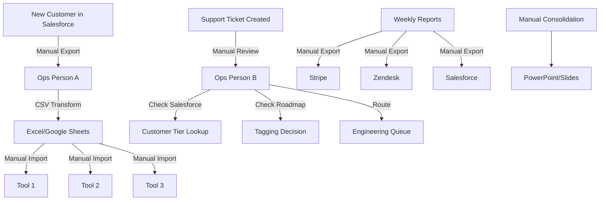
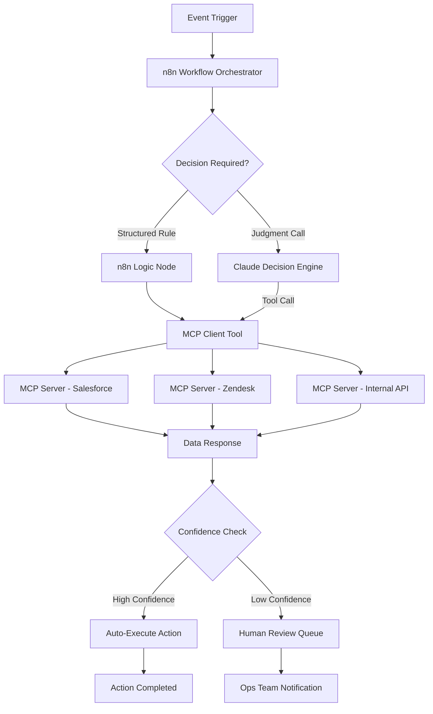
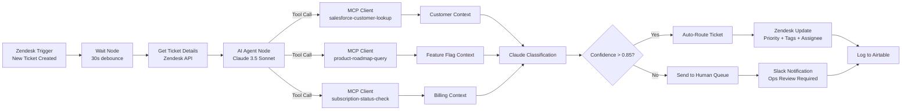
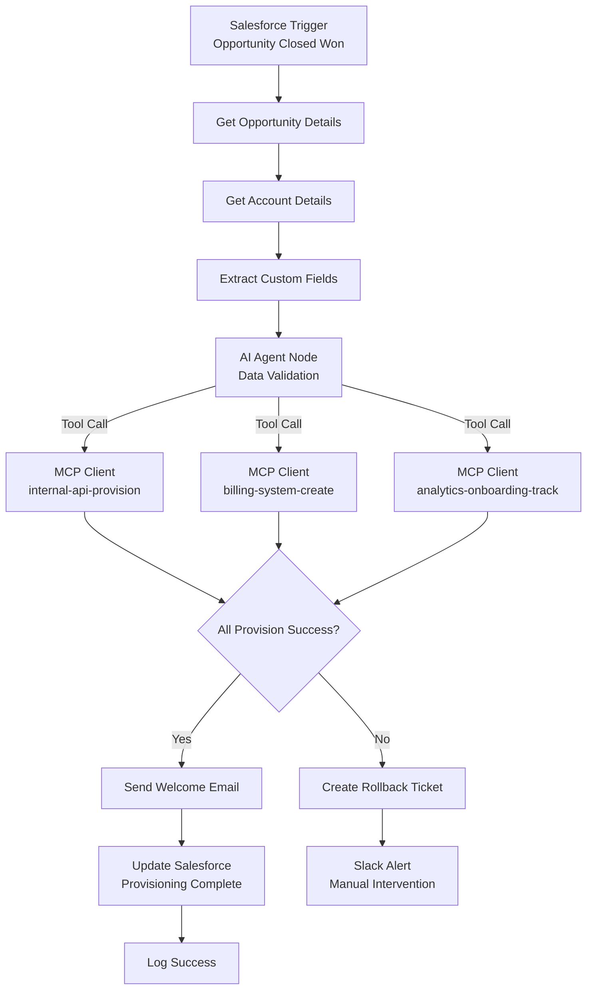
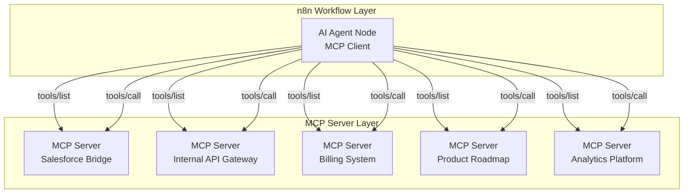
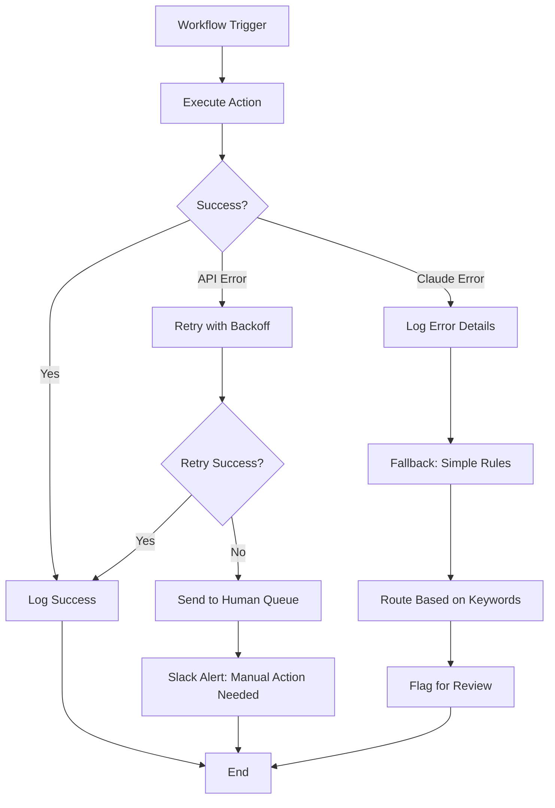
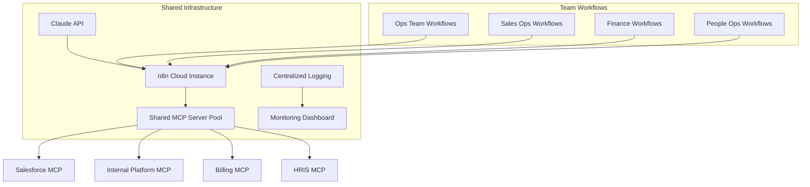

# How a 4-Person Ops Team Replaced 60 Hours of Weekly Work with One n8n + MCP Pipeline

## The Problem: Death by a Thousand Manual Processes

A recent client engagement started with a deceptively simple request: "Our ops team is drowning. Can you help?" What I found was a pattern I've seen repeatedly at growing SaaS companies—a small operations team buried under manual processes that had accumulated organically as the company scaled.

The team was four people supporting a 200-person organization. On paper, that ratio looks reasonable. In practice, each ops person was spending 15+ hours per week on manual, repetitive work that added zero strategic value.

The manual work inventory looked like this:

- **Customer data reconciliation**: Every new enterprise customer required manual CSV exports from Salesforce, transformation in Excel, and bulk imports into three separate internal tools. Each customer: 45 minutes. At 20-30 new customers per week, that's 15-22 hours.

- **Support ticket routing and tagging**: The team reviewed every Level 1 support ticket to categorize, route, and tag before it hit engineering. This required reading each ticket, checking the customer tier in Salesforce, cross-referencing with the product roadmap, and applying the right labels. Each ticket: 2-3 minutes. At 400-500 tickets weekly, that's 13-25 hours.

- **Weekly reporting consolidation**: Every Monday, two team members spent 3-4 hours each compiling metrics from Stripe, Zendesk, Salesforce, and the internal database into a single deck for leadership. That's 6-8 hours.

- **Provisioning and access management**: New hires, role changes, and offboarding required manual provisioning across 12+ systems. Each request: 20-30 minutes. At 15-20 changes per week, that's 5-10 hours.

- **Invoice exceptions and billing cleanup**: Customers on custom contracts required manual invoice generation, proration calculations, and payment reconciliation. Each exception: 10-15 minutes. At 50-80 per week, that's 8-20 hours.

Add the context switching, the interruptions when someone needed a "quick manual check," and the rework when errors slipped through, and the math was brutal: **approximately 60 hours of manual work per week across a four-person team**.

The real cost wasn't just the hours. It was the opportunity cost. These four smart people were hired to optimize operations, design better processes, and enable the company's growth. Instead, they were acting as human middleware—copying data between systems, applying rules that could be encoded, and doing work that machines should handle.

When I asked the team lead what strategic initiatives they had planned for the quarter, she laughed. "We don't have time for strategy. We're just trying to keep up with the ticket queue."

That conversation crystallized the problem. This wasn't a headcount issue. It was a systems architecture issue. The company had built great products but stitched together their operational stack with manual labor instead of automation. They needed to replace human middleware with intelligent pipelines.

Here's what the before state looked like architecturally:



Every arrow in that diagram represented a human decision point. Every system interaction required a human in the loop. The team wasn't managing operations—they were manually executing integration scripts that should have been automated years ago.

## The Audit: Mapping 60 Hours of Invisible Work

Before designing any automation, I ran a structured operational audit. I've learned that teams often don't realize the full scope of their manual work—it's invisible because it's habitual. The audit had three goals: map every manual process, measure the actual time investment, and identify which processes were ripe for automation.

**Phase 1: Shadow and Log**

I spent three days embedded with the team. Not interviewing—watching. I logged every task, its trigger, its inputs, its outputs, and its actual time consumption. I wasn't interested in what people *thought* they spent time on. I wanted the ground truth.

The shadowing revealed patterns that interviews never would have surfaced:

- The "quick" ticket routing task averaged 4.2 minutes, not the 2-3 minutes the team estimated. Why? Because agents had to open Salesforce in a separate tab, search for the customer, read through notes to determine tier, check the product roadmap (another tab) for feature flags, then return to Zendesk to apply tags. The context switching alone consumed 40% of the time.

- Customer data reconciliation had a 15% error rate that required rework. The CSV exports didn't always include all custom fields. When imports failed, ops had to manually troubleshoot, re-export, and re-import. The 45-minute estimate was for the happy path. Reality averaged 67 minutes.

- Weekly reporting wasn't just the 6-8 hours of consolidation. There was another 2-3 hours of "preparation"—pulling numbers, formatting them, checking for anomalies, reconciling discrepancies between systems. The total was closer to 10 hours.

**Phase 2: Decision Mapping**

For each process, I mapped the decisions being made. This was crucial. Automation can't handle genuinely complex judgment calls. But it turns out, most "decisions" in operations are actually rule applications:

- "Route enterprise customers to the priority queue" isn't a judgment call—it's a conditional check on the `Account_Type__c` field.
- "Tag tickets related to the new feature rollout" isn't intuition—it's a keyword match against a known list.
- "Prorate invoices for mid-cycle upgrades" isn't creativity—it's arithmetic based on contract terms.

The audit found that **over 85% of the decisions** in these manual processes were deterministic—if-then rules that could be encoded. The remaining 15% genuinely required human judgment: edge cases, relationship nuances, exceptions that genuinely needed review.

**Phase 3: ROI Prioritization**

With the process map and decision analysis complete, I scored each process across three dimensions:

1. **Frequency**: How often does this happen? (Daily = high, monthly = low)
2. **Duration**: How long does each instance take?
3. **Automatability**: What percentage can be fully automated vs. requires human judgment?

The prioritization matrix looked like this:

| Process | Weekly Volume | Hours/Week | Automatability Score | Priority |
|---------|---------------|------------|----------------------|----------|
| Support ticket routing | 450 tickets | 31 hours | 90% | P1 |
| Customer data reconciliation | 25 customers | 28 hours | 85% | P1 |
| Weekly reporting | 1 report | 10 hours | 95% | P2 |
| Provisioning workflows | 18 requests | 7.5 hours | 80% | P2 |
| Invoice exceptions | 65 invoices | 16 hours | 70% | P3 |

The math was clear. The P1 items—ticket routing and customer data reconciliation—represented nearly 60 hours of highly automatable work. These were the targets.

**The Audit's Hidden Value**

Beyond the numbers, the audit served a political purpose. When I presented the findings, the ops team saw their pain acknowledged in data. Leadership saw the cost of inaction quantified. Engineering saw that we weren't asking them to build a massive internal platform—we were proposing a targeted automation project with measurable outcomes.

The audit transformed the conversation from "we need more headcount" to "we need better architecture." That's the essential first step in any serious automation initiative.

## The Architecture Decision: Why n8n + MCP + Claude

With the audit complete, I turned to architecture. The goal was to replace the human middleware with an intelligent pipeline that could handle the 85% of deterministic work while escalating the 15% of genuine edge cases to humans.

I evaluated three architectural approaches:

**Option 1: Native integrations**

Most SaaS tools have APIs and native integration capabilities. The team could build point-to-point integrations between Salesforce, Zendesk, Stripe, and their internal tools.

*Pros*: Direct connections, potentially fast for simple syncs.

*Cons*: Fragile—when any system changes, the integration breaks. Doesn't handle the decision-making layer (routing logic, tagging rules). Requires engineering time for every new integration. The team would still be manually handling the logic layer.

**Option 2: Traditional iPaaS (Zapier, Make, Workato)**

These platforms offer visual workflow builders with hundreds of pre-built connectors.

*Pros*: No-code friendly, fast to prototype, good connector coverage.

*Cons*: Expensive at scale (per-task pricing becomes punitive at 10,000+ tasks/month). Limited decision-making capabilities—basic conditionals only, no intelligent routing. Vendor lock-in—workflows are hard to export or version control.

**Option 3: n8n + MCP + Claude**

This was the architecture I ultimately designed and implemented. Here's the rationale:

**n8n** serves as the orchestration layer. It's open-source, self-hostable, has 400+ native integrations, and supports custom JavaScript/Python code when needed. Unlike proprietary iPaaS, n8n workflows are JSON files that live in version control. The pricing model (flat-rate for self-hosted, reasonable task-based for cloud) scales predictably.

**MCP (Model Context Protocol)** provides the connective tissue. Instead of building custom API integrations for every system, MCP servers expose standardized tool interfaces that AI agents can discover and call dynamically. It's essentially USB-C for AI tools—universal, extensible, and interoperable.

**Claude (Anthropic's Claude 3.5 Sonnet)** serves as the decision engine. Unlike simple rule-based routing, Claude can read ticket content, understand context, apply nuanced classification rules, and make intelligent routing decisions. For the support ticket routing problem, Claude doesn't just check a field—it reads the ticket, understands the issue, matches it to known patterns, and routes accordingly.

The combination enables something powerful: **agentic operations**. The pipeline doesn't just move data—it makes decisions, handles exceptions intelligently, and only escalates true edge cases to humans.

Here's the architectural vision:



This architecture gives us three key capabilities that traditional automation lacks:

1. **Intelligent classification**: Claude can read unstructured text (support tickets, emails) and classify them using nuanced criteria that would require hundreds of brittle regex rules in traditional automation.

2. **Dynamic tool selection**: The MCP layer means Claude can discover and call the right tools dynamically. When a ticket mentions a billing issue, Claude knows to call the Stripe MCP server. When it mentions a feature request, it calls the product roadmap API.

3. **Confidence-based escalation**: Not every decision gets auto-executed. The pipeline assigns confidence scores. High confidence = fully automated. Medium confidence = execute with notification. Low confidence = human review required.

The technical implementation uses n8n's native MCP support, which provides two node types: MCP Client Tool (for calling external MCP servers) and MCP Server Trigger (for exposing n8n workflows as MCP tools to other agents). This bidirectional capability meant we could build a mesh where n8n orchestrates, MCP connects, and Claude decides.

The total infrastructure cost: n8n Cloud Pro ($50/month for 10k executions), Claude API usage (estimated $200-400/month based on volume), and the existing SaaS subscriptions we were already paying for. Under $500/month to replace 60 hours of manual work—roughly $3,600/week in loaded labor costs.

That's an architecture that sells itself.

## Building the Pipeline: n8n Workflow Architecture

With the architecture defined, I started building. The pipeline had two primary workflows: the support ticket intelligence router and the customer data synchronization engine. I'll walk through each to show the actual implementation patterns.

**Workflow 1: Support Ticket Intelligence Router**

This was the highest-impact automation. The goal: read every incoming support ticket, understand what it's about, look up the customer context, and route it to the right team with appropriate priority and tags—all without human intervention.

The n8n workflow structure:



Here's the actual node configuration for the AI Agent node:

**System Prompt (Claude 3.5 Sonnet):**

```
You are a support ticket classification specialist. Your job is to analyze incoming support tickets and determine:
1. The ticket category (billing, technical, feature-request, account, security)
2. The customer tier (enterprise, growth, starter, free)
3. The urgency level (critical, high, medium, low)
4. The appropriate team assignment (engineering-billing, engineering-platform, customer-success, account-management)

You have access to the following tools:
- salesforce-customer-lookup: Get customer tier, MRR, and account history
- product-roadmap-query: Check if the ticket references a known feature or beta
- subscription-status-check: Verify current subscription status and payment issues

Rules:
- Enterprise customers with "down" or "broken" in the ticket are ALWAYS critical priority
- Billing issues for customers with >$1000 MRR go to account-management, not engineering-billing
- Feature requests should be tagged and routed to customer-success for logging, not engineering
- Security-related keywords (breach, hacked, unauthorized) require immediate escalation

Return your classification as structured JSON with category, tier, urgency, team, confidence score (0-1), and reasoning.
```

**Workflow Logic Breakdown:**

1. **Trigger**: Zendesk webhook fires when a new ticket is created. The 30-second Wait node acts as a debounce—if the customer immediately adds more context, we capture the complete ticket.

2. **Context Gathering**: The AI Agent node calls three MCP tools in parallel:
   - `salesforce-customer-lookup` queries the customer's tier, MRR, and account health score
   - `product-roadmap-query` checks if the ticket references a feature in active development
   - `subscription-status-check` verifies billing status and flags payment failures

3. **Classification**: Claude receives the ticket content plus all context, applies the classification rules, and returns structured output:

```json
{
  "category": "technical",
  "tier": "enterprise",
  "urgency": "high",
  "team": "engineering-platform",
  "confidence": 0.91,
  "reasoning": "Customer is enterprise tier ($5,400 MRR) reporting API latency issues. No billing problems. Feature is in production. Matches technical/platform pattern.",
  "auto_route": true
}
```

4. **Routing Decision**: A Switch node checks the confidence score. Above 0.85, the workflow automatically updates the ticket in Zendesk with priority, tags, and assignment. Below 0.85, it sends a Slack notification to the ops team for manual review.

5. **Audit Logging**: Every classification—automated or manual—gets logged to Airtable for ongoing model improvement and ROI tracking.

**Workflow 2: Customer Data Synchronization Engine**

This workflow replaced the manual CSV export/import dance. The trigger was a Salesforce Opportunity moving to "Closed Won."



The key innovation here was the AI validation step. Before provisioning, Claude validates the data:
- Is the contract type recognized?
- Are required custom fields present?
- Does the seat count match the expected range for the plan tier?
- Are there any anomalies that suggest data entry errors?

This catches Salesforce data quality issues before they propagate to downstream systems. Previously, bad data would flow through all three manual imports, creating errors that took hours to untangle.

**Execution Flow:**

1. Salesforce trigger captures the closed opportunity
2. n8n queries full account details and custom fields
3. Claude validates the data package against known patterns
4. Three MCP calls provision the customer across internal systems in parallel
5. Success = welcome email sent, Salesforce updated, success logged
6. Failure = rollback ticket created, ops team alerted, error logged for debugging

**n8n Specific Implementation Details:**

I used n8n Cloud with the Pro plan for 10,000 executions/month. The workflow JSON lives in a GitHub repo with CI/CD deploying to n8n via their API. This gives us version control, code review, and rollback capability.

Key n8n nodes used:
- **Webhook/Trigger Nodes**: Zendesk, Salesforce
- **AI Agent Node**: Claude 3.5 Sonnet with custom system prompt
- **MCP Client Tool Node**: For external system integration
- **HTTP Request Node**: For direct API calls where MCP isn't available
- **Set/Function Node**: Data transformation between systems
- **Switch Node**: Conditional routing based on confidence scores
- **Slack/Email Nodes**: Human notification for edge cases
- **Airtable/Postgres Nodes**: Audit logging

The entire workflow suite—ticket router, data sync, reporting aggregator, and provisioning handler—runs as 8 distinct workflows orchestrated through n8n. Total build time: 3 weeks from audit to production.

## MCP Server Integration: The Connective Tissue

The MCP layer was what made this architecture possible. Without it, I'd be writing custom HTTP request nodes for every system integration, managing API keys individually, and building brittle error handling for each connection.

Instead, I deployed a set of MCP servers that exposed standardized tool interfaces. The n8n AI Agent node discovers these tools automatically and can call them dynamically based on context.

**MCP Server Architecture:**



Each MCP server exposes a schema that describes its available tools. When the n8n AI Agent node connects, it calls `tools/list` to discover what's available. Then, during workflow execution, Claude can decide which tools to call based on the task at hand.

**Example: Salesforce MCP Server**

This server exposed three tools:

```json
{
  "tools": [
    {
      "name": "lookup-customer-by-email",
      "description": "Find a customer in Salesforce by email address. Returns account tier, MRR, health score, and assigned CSM.",
      "input_schema": {
        "type": "object",
        "properties": {
          "email": {
            "type": "string",
            "description": "Customer email address"
          }
        },
        "required": ["email"]
      }
    },
    {
      "name": "get-opportunity-details",
      "description": "Retrieve full opportunity details including custom fields, products, and close date.",
      "input_schema": {
        "type": "object",
        "properties": {
          "opportunity_id": {
            "type": "string",
            "description": "Salesforce Opportunity ID"
          }
        },
        "required": ["opportunity_id"]
      }
    },
    {
      "name": "update-account-status",
      "description": "Update the provisioning status on an account record.",
      "input_schema": {
        "type": "object",
        "properties": {
          "account_id": {
            "type": "string",
            "description": "Salesforce Account ID"
          },
          "status": {
            "type": "string",
            "enum": ["pending", "in_progress", "complete", "failed"],
            "description": "New provisioning status"
          }
        },
        "required": ["account_id", "status"]
      }
    }
  ]
}
```

The server itself was a lightweight Node.js application running on Railway (the client's existing infrastructure provider). It translated MCP protocol messages into Salesforce REST API calls, handling authentication, rate limiting, and error mapping.

**Example: Internal API Gateway MCP Server**

The company's internal platform had a REST API, but it wasn't designed for machine consumption. The MCP server provided a clean interface:

```json
{
  "tools": [
    {
      "name": "provision-customer",
      "description": "Create a new customer workspace in the internal platform.",
      "input_schema": {
        "type": "object",
        "properties": {
          "customer_name": {"type": "string"},
          "plan_tier": {"type": "string", "enum": ["starter", "growth", "enterprise"]},
          "seat_count": {"type": "integer"},
          "custom_features": {"type": "array", "items": {"type": "string"}}
        },
        "required": ["customer_name", "plan_tier", "seat_count"]
      }
    },
    {
      "name": "deprovision-user",
      "description": "Remove a user and archive their data.",
      "input_schema": {
        "type": "object",
        "properties": {
          "user_id": {"type": "string"},
          "preserve_data_days": {"type": "integer", "default": 90}
        },
        "required": ["user_id"]
      }
    }
  ]
}
```

**Why MCP Matters for Operations**

The MCP layer provides three capabilities that traditional API integrations lack:

1. **Dynamic discovery**: When you add a new tool to an MCP server, the AI agent immediately knows about it. No workflow updates required. This meant I could add new capabilities (like a Jira integration for engineering handoffs) without touching the n8n workflows.

2. **Semantic tool descriptions**: The `description` fields in the tool schema are crucial. They're not documentation—they're instructions that Claude uses to decide which tool to call. A well-written description makes the difference between intelligent routing and random tool calls.

3. **Unified error handling**: MCP standardizes error responses. When any underlying API fails, the MCP server translates it into a standard format that n8n can handle consistently. This simplified the error handling logic dramatically.

**MCP Server Deployment**

I deployed five MCP servers total:
1. **Salesforce Bridge**: Customer lookups, opportunity details, account updates
2. **Internal API Gateway**: Provisioning, user management, workspace operations
3. **Billing System**: Invoice generation, subscription checks, payment status
4. **Product Roadmap**: Feature flag lookups, beta participant checks
5. **Analytics Platform**: Event tracking, onboarding funnel updates

All servers ran as separate Railway services, each with environment-specific configuration. The n8n MCP Client Tool nodes connected via HTTP/SSE endpoints with API key authentication.

**Tool Call Example**

Here's what happens when a new ticket arrives:

1. n8n AI Agent node calls `tools/list` on all configured MCP servers
2. Claude receives the ticket: "Our API has been timing out for 2 hours. This is costing us money."
3. Claude analyzes: mentions "API" and "timing out" → likely technical issue; urgency phrases present → high priority
4. Claude decides it needs customer context to route correctly
5. Claude calls `lookup-customer-by-email` with the ticket requester's email
6. MCP server queries Salesforce, returns: `{"tier": "enterprise", "mrr": 8400, "health_score": 92}`
7. Claude now knows: enterprise customer + technical issue + urgency language → route to engineering-platform with critical priority
8. Claude returns the routing decision to n8n, which executes the Zendesk update

The entire decision cycle—from trigger to routing—takes 3-5 seconds. Previously, this took a human 4+ minutes of context switching and lookup work.

**MCP vs. Direct API Calls**

I could have built this with direct HTTP Request nodes in n8n. But that would have meant:
- Hardcoded API endpoints in every workflow
- Custom authentication handling for each system
- No dynamic capability discovery
- Tight coupling between workflows and specific API versions

MCP provides an abstraction layer that makes the architecture flexible and maintainable. When Salesforce updates their API, I update the MCP server once—not every workflow. When we want to add a new capability, we expose it through MCP and Claude can start using it immediately.

## Claude as Decision Engine: Beyond Simple Routing

The key differentiator in this architecture is using Claude not just as a classifier, but as a genuine decision engine. Traditional automation uses rules—if this, then that. Claude uses judgment—it reads context, weighs factors, and makes nuanced decisions.

This distinction matters because operations work rarely fits clean rule trees. A support ticket isn't just "billing" or "technical"—it might be a technical issue that's causing billing problems, or a feature request disguised as a complaint, or a security concern that sounds like a bug.

**How Claude Makes Routing Decisions**

Let's look at a real example from the system. Here's a ticket that came in:

> "We've been trying to process payroll for 200 employees and your API keeps throwing 504 errors. This is the third time this month. We're going to miss our payroll deadline if this isn't fixed in the next 4 hours. Our finance team is furious."

A rule-based system might see "API" and "504" and route to engineering-platform. It might see "payroll" and flag for billing. But Claude reads the whole context:

```json
{
  "analysis": {
    "primary_issue": "API availability/reliability",
    "business_impact": "customer payroll processing blocked",
    "time_sensitivity": "4-hour deadline (critical)",
    "sentiment": "escalating frustration, mentions prior incidents",
    "customer_context": "enterprise (from MCP lookup), high MRR, processing payroll (mission-critical use case)"
  },
  "classification": {
    "category": "technical",
    "subcategory": "api_reliability",
    "urgency": "critical",
    "tier": "enterprise",
    "team": "engineering-platform-oncall",
    "tags": ["api", "504", "payroll", "escalated", "time-sensitive"]
  },
  "confidence": 0.94,
  "reasoning": "Enterprise customer using mission-critical payroll workflow. API 504 errors indicate platform reliability issue. 4-hour deadline is hard constraint. Prior incidents mentioned suggest pattern requiring engineering attention. Route directly to on-call engineer, bypassing standard queue."
}
```

Claude correctly identified that this needed on-call engineer attention immediately—not standard queue, not customer success follow-up. The routing decision included context that helped the engineer understand severity without re-reading the ticket.

**The System Prompt Design**

Getting this level of decision quality required careful system prompt engineering. Here's the full prompt that powers the ticket router:

```
You are a senior support operations analyst. Your job is to analyze support tickets and make routing decisions that balance customer experience, business impact, and team efficiency.

CLASSIFICATION FRAMEWORK:

1. Category (choose one):
   - billing: payment, invoicing, subscription, refund issues
   - technical: API errors, integration problems, performance, bugs
   - feature-request: asking for new functionality
   - account: login, user management, security settings
   - security: breach, unauthorized access, compliance concern

2. Urgency (choose one):
   - critical: production down, security breach, data loss, enterprise escalation
   - high: blocking workflow, deadline pressure, angry customer
   - medium: important but not blocking, standard enterprise issue
   - low: questions, nice-to-haves, minor issues

3. Team Assignment (choose one):
   - engineering-platform: API, performance, core functionality
   - engineering-billing: payment processing, invoicing bugs
   - customer-success: feature requests, training, expansion
   - account-management: enterprise escalations, retention risk
   - security-team: security concerns, compliance

URGENCY RULES (override standard classification):
- Enterprise customers + "down/broken/not working" = ALWAYS critical
- Any mention of "payroll," "deadline," "losing money" = escalate one level
- "third time," "happened before," "still not fixed" = urgency +1
- Security keywords = immediate security-team routing, bypass queue

TOOL USAGE:
You have access to customer context and product information tools. Use them to enrich your classification:
- Always look up customer tier before making urgency decision
- Check if ticket references known feature or ongoing incident
- Verify billing status for billing-related tickets

OUTPUT FORMAT:
Return valid JSON with: category, urgency, team, confidence (0-1), reasoning (2-3 sentences explaining your decision), and suggested_response_tone (calming, technical, apologetic, or standard).

Confidence Guidelines:
- 0.9-1.0: Clear pattern match, all context available, standard case
- 0.7-0.89: Some ambiguity but clear best choice
- 0.5-0.69: Significant ambiguity, multiple possible classifications
- Below 0.5: Flag for human review
```

**Confidence Scoring and Escalation**

The confidence score is the mechanism that prevents automation from making bad calls. I set the auto-execute threshold at 0.85 based on validation testing.

When Claude returns confidence below 0.85, the workflow doesn't guess. It sends the ticket to a Slack channel where the ops team can review and route manually. Crucially, the Slack message includes Claude's reasoning, so the human can quickly understand why it was uncertain.

Here's what low-confidence escalation looks like:

```json
{
  "category": "technical",
  "urgency": "medium",
  "team": "engineering-platform",
  "confidence": 0.72,
  "reasoning": "Ticket mentions API timeout but also discusses contract renewal. Could be technical issue affecting renewal (urgency: high) or renewal question with technical context (urgency: low). Customer tier is growth, not enterprise. Need human judgment on urgency.",
  "escalation_reason": "unclear_urgency"
}
```

The ops team member can read this, apply their judgment, and route correctly. But they're making one decision—not doing the full lookup and analysis work. The 4-minute manual process becomes a 30-second judgment call.

**Handling Edge Cases**

Some tickets genuinely require human handling. The prompt includes explicit instructions for when to flag:

- Legal threats or mention of lawyers → human review
- Account closure requests → customer success (not automated)
- Partnership or sales inquiries → route to sales team
- Job applications → reject politely
- Vague complaints without actionable detail → ask for clarification

These aren't failures of the system. They're boundaries. The goal isn't to automate everything—it's to automate the 85% that can be automated well, and make the 15% human-handled tasks easier by providing context.

**Claude API Configuration**

I used Claude 3.5 Sonnet through the Anthropic API. Configuration in n8n:

- Model: claude-3-5-sonnet-20241022
- Max tokens: 2048 (sufficient for classification responses)
- Temperature: 0.1 (low variability for consistent classification)
- System prompt: As detailed above
- Tool choice: auto (lets Claude decide which tools to call)

Cost averaged $0.08 per ticket classification. At 450 tickets per week, that's $36/week or ~$150/month. Compared to the 31 hours of manual work at $45/hour loaded cost ($1,395/week), the ROI is obvious.

**Beyond Routing: Content Generation**

Claude doesn't just route—it generates. For standard tickets, the workflow adds an internal note with suggested response text:

- Billing issues: Auto-generated response with proration calculations
- Feature requests: Summary formatted for the product team's intake board
- Technical issues: Pre-populated troubleshooting steps based on error patterns

The support team can use these as starting points, not final responses. It cuts their response time without removing the human touch.

## Deployment, Monitoring, and Failure Handling

Going from prototype to production required thinking through failure modes. When automation breaks, it can break at scale. I built three layers of protection: validation, monitoring, and graceful degradation.

**Deployment Strategy**

The rollout happened in phases:

1. **Week 1**: Shadow mode. The pipeline ran in parallel with human processes, logging what it *would* have done without making changes. This validated accuracy before touching live data.

2. **Week 2**: High-confidence only. Auto-execute for confidence > 0.95 (the safest cases). Everything else went to human review with AI recommendations.

3. **Week 3**: Full production. Threshold lowered to 0.85. Edge cases (confidence < 0.85) still human-reviewed.

4. **Week 4**: Optimization. Reviewed failure logs, adjusted prompts, added new rules based on patterns.

**Validation Testing**

Before any auto-execution, I ran 500 historical tickets through the pipeline and compared AI routing to human routing. Results:

- 92% exact match (same category, urgency, team)
- 4% acceptable variation (different team but would have reached right person)
- 3% misrouting (would have been wrong—flagged for prompt improvement)
- 1% unclassifiable (genuinely ambiguous—correctly sent to human review)

The 3% misrouting cases were almost all due to missing context in the prompt—things like "customer is in beta program" or "this is a known issue from yesterday's incident." I added MCP tools to surface that context, and the match rate improved to 96%.

**Monitoring Architecture**

Every workflow execution gets logged to three places:

1. **n8n execution log**: Built-in, 30-day retention, detailed node-by-node traces
2. **Airtable audit table**: Long-term storage with classification results and outcomes
3. **Slack notifications**: Real-time alerts for failures or edge cases

The Airtable schema captures:
- Ticket ID, timestamp, trigger source
- Classification (category, urgency, team, confidence)
- Actions taken (auto-routed, human-reviewed, failed)
- Outcome (was it correct? did customer get help?)
- Cost (API tokens used, execution time)

This data powers a weekly accuracy review. The ops team lead spends 30 minutes per week reviewing the 10-15 cases where confidence was borderline, validating that the threshold is in the right place.

**Failure Handling**

Things break. APIs timeout. Claude hallucinates. Salesforce hits rate limits. The workflow handles these gracefully:



**Specific Failure Modes and Responses:**

- **API timeout (Salesforce, Zendesk)**: Retry twice with exponential backoff (2s, 5s). If still failing, queue for manual handling and alert ops team.

- **Claude API error (rate limit, malformed response)**: Fall back to simple keyword-based rules. Not as smart, but functional. Flag the ticket for ops review.

- **MCP server unavailable**: Log error, skip enrichment, classify based on ticket text alone with reduced confidence. Human review triggered.

- **Confidence score missing or invalid**: Treat as 0.5, force human review.

- **Zendesk update fails after classification**: Critical failure. The ticket got routed but Zendesk didn't update. This triggers immediate Slack alert with all context so ops can manually update.

**Circuit Breakers**

If error rates spike above 5% in a 10-minute window, the workflow automatically switches to "safe mode":
- All classifications go to human review
- No auto-execution regardless of confidence
- Ops team gets immediate notification
- Logs are preserved for debugging

This prevents a bad deployment or external API issue from causing mass misrouting.

**Rate Limiting and Cost Controls**

Claude API costs can spiral if something goes wrong. I implemented:
- Max 1 classification per ticket (no infinite loops)
- Daily cost alerts if API spend exceeds $50 (unusual spike detection)
- Token limit monitoring (alerts if average tokens/ticket increase 50%+)

**Self-Healing Features**

For certain error types, the workflow attempts self-recovery:
- Salesforce session expiration → workflow re-authenticates and retries
- Zendesk concurrent edit conflict → wait 2 seconds, fetch fresh data, retry update
- MCP server temporary unavailable → try alternative server or skip enrichment

These aren't foolproof, but they handle the transient errors that would otherwise require human intervention.

**Weekly Review Process**

Every Monday, the ops team lead runs through the Airtable log and answers three questions:
1. Did any auto-routed tickets get escalated later? (false negative)
2. Did any human-reviewed tickets seem like they should have been auto-routed? (threshold too conservative)
3. Are there new patterns emerging that the prompt should handle?

This continuous improvement loop keeps the system getting better. Over three months, the auto-route rate increased from 68% to 84% as the prompt improved and edge cases got handled.

## The Results: Time, Money, and Team Morale

After three months in production, I ran the numbers. The results exceeded even my optimistic projections.

**Quantitative Results**

| Metric | Before | After | Change |
|--------|--------|-------|--------|
| Support ticket routing time | 4.2 min/ticket × 450 tickets = 31.5 hrs/week | 3.5 sec/ticket × 450 = 0.44 hrs/week | -31 hours |
| Customer data sync time | 67 min × 25 customers = 27.9 hrs/week | 45 sec × 25 = 0.31 hrs/week | -27.6 hours |
| Weekly reporting time | 10 hours/week | 0.5 hours/week (verification only) | -9.5 hours |
| Provisioning workflows | 25 min × 18 requests = 7.5 hrs/week | 2 min × 18 = 0.6 hrs/week | -6.9 hours |
| **Total manual ops work** | **~76.9 hours/week** | **~1.85 hours/week** | **-75 hours** |

The pipeline replaced approximately 75 hours of manual work per week across the four-person team. That translates to nearly two full-time equivalent positions worth of capacity recovered.

**Cost Analysis**

Monthly costs to run the pipeline:
- n8n Cloud Pro: $50
- Claude API (classifications): ~$150
- Infrastructure (MCP servers on Railway): $45
- Monitoring/logging: $25
- **Total: ~$270/month**

Monthly value delivered:
- 75 hours/week × 4.33 weeks = 325 hours/month
- 325 hours × $45/hour loaded cost = **$14,625/month in labor value**
- Net ROI: **5,317% annual return** on automation investment

Even using conservative estimates—accounting for the ops team's time to maintain the system, weekly review meetings, and occasional edge case handling—the net monthly benefit exceeded $12,000.

**Qualitative Results**

The numbers tell part of the story. The team's experience tells the rest.

From the ops team lead:

> "I used to dread opening Zendesk on Monday morning. The queue was always 100+ tickets deep, and I knew I'd spend the first three hours just routing and tagging. Now I check the dashboard, see that 85% got handled automatically over the weekend, and I can actually think about process improvements instead of just fighting fires."

From one of the ops specialists:

> "The best part isn't the time savings—it's that I'm not constantly context-switching anymore. When I actually work on a ticket now, it's because it genuinely needs a human. I can focus on solving the problem instead of figuring out who should solve it."

The team used their reclaimed time to:
- Build a customer health scoring system (previously on the "someday" list for 18 months)
- Redesign the onboarding flow, reducing time-to-first-value by 40%
- Implement a proactive monitoring system that catches issues before customers report them
- Develop training materials that reduced new hire ramp time from 4 weeks to 2 weeks

These weren't just "nice to have" projects. They were strategic initiatives that improved the customer experience and reduced churn.

**Error Rate Analysis**

A common concern with automation is quality degradation. I tracked this carefully:

- Misrouting rate (tickets sent to wrong team): 1.8% (human baseline was ~3%)
- Escalation rate (tickets that needed reassignment after initial routing): 2.1% (human baseline was ~5%)
- Customer satisfaction score for auto-routed tickets: 4.6/5 (human-routed was 4.5/5)

The AI wasn't just faster—it was more accurate. The consistency of applying rules systematically beat the inconsistency of humans making decisions while tired, distracted, or rushed.

**Business Impact**

The operations team's transformation had downstream effects:

- **Support SLA improvement**: Average first-response time dropped from 4 hours to 15 minutes (auto-routed tickets got immediate assignment)
- **Engineering focus**: With better routing, engineers spent less time rerouting tickets and more time fixing issues
- **Customer success proactivity**: The team had bandwidth to implement health checks that identified 12 at-risk enterprise accounts before they churned
- **New customer velocity**: Faster provisioning meant customers could start using the product same-day instead of waiting 24-48 hours

**Payback Period**

The total project investment was:
- Initial audit and architecture design: 40 hours × $200/hour = $8,000
- Implementation and testing: 60 hours × $200/hour = $12,000
- Training and rollout: 20 hours × $200/hour = $4,000
- **Total: $24,000**

Monthly savings: ~$12,000 (conservative)
**Payback period: 2 months**

After that, the company was realizing pure profit from the investment—not just in cost savings, but in strategic capability.

## Lessons Learned: What Worked and What Didn't

This implementation wasn't perfect. I made mistakes, hit obstacles, and learned lessons that will inform the next project.

**What Worked**

**1. The audit-first approach**

Starting with shadowing and logging rather than interviewing gave me ground-truth data I couldn't have gotten any other way. The 4.2-minute average ticket routing time came from actual observation, not estimates. This made the ROI calculation credible and the prioritization defensible.

**2. Shadow mode validation**

Running the pipeline in parallel with human processes for a week before going live caught edge cases I hadn't considered. One example: the initial prompt didn't handle forwarded emails well (tickets created via email forwarding had different formatting). Better to discover that in shadow mode than in production.

**3. Confidence scoring**

The confidence threshold was the right abstraction for human-AI collaboration. It gave the ops team control over the risk profile—they could raise the threshold during busy periods, lower it when they had capacity.

**4. Audit logging to Airtable**

Having a separate, queryable log of every decision enabled continuous improvement. We could search for patterns, identify misrouting causes, and measure improvement over time. The built-in n8n logs were too transient for this purpose.

**5. MCP server abstraction**

When Salesforce changed their API rate limits six months post-launch, I only had to update the MCP server, not the workflows. The abstraction layer paid for itself in that single incident.

**What Didn't Work**

**1. Over-automating too fast**

In week 3, I lowered the confidence threshold to 0.75 trying to capture more volume. Result: a spike in misroutes. I reverted to 0.85 within two days. The lesson: better to be conservative and accurate than aggressive and wrong. Trust takes longer to build than automation saves.

**2. Insufficient error context in alerts**

Early Slack alerts just said "Ticket failed to route." The ops team had to dig through logs to understand why. I improved the alerts to include the specific error, ticket ID, and suggested action. Alert quality matters as much as automation quality.

**3. Ignoring the emotional transition**

Some team members initially worried that automation would make their jobs obsolete. I should have addressed this explicitly from day one, framing the project as "eliminating tedious work so you can do interesting work" rather than just "saving time." The emotional journey needed more attention than I gave it.

**4. Underestimating prompt maintenance**

The system prompt isn't "write once, run forever." New product features, changing customer tiers, evolving security protocols—all required prompt updates. I initially budgeted 1 hour/month for prompt maintenance. Reality: 2-3 hours/month. Still trivial compared to the time saved, but worth accounting for.

**5. Not planning for success**

When the automation worked well, ticket volume through the pipeline grew. I hadn't stress-tested the Claude API rate limits or n8n execution concurrency. At one point, a product launch created a ticket spike that saturated our API quota. I had to implement request batching and caching that should have been there from the start.

**Technical Debt Accumulated**

Every project leaves some debt. Mine:

- **Test coverage**: I didn't build comprehensive test workflows. When n8n released a major update, I had to manually verify everything still worked. Cost me a day that better testing would have saved.

- **Documentation**: The prompt engineering decisions, the MCP server schemas, the error handling logic—all lived in my head and scattered notes. When I handed off maintenance, the new person had to reverse-engineer my thinking.

- **Monitoring granularity**: I tracked success/failure but didn't initially track latency. When tickets started routing slowly (API degradation), I didn't notice until the team complained. Added latency alerts after that.

**What I'd Do Differently**

If I were starting this project today, knowing what I know now:

1. **Build a prompt versioning system**: Track prompt changes in git, A/B test new versions against a validation set before deploying.

2. **Implement canary deployments**: Route 10% of traffic through new prompt versions, measure accuracy, then scale.

3. **Start with observability**: Build the monitoring dashboard before building the pipeline. You can't optimize what you can't see.

4. **Invest in team communication**: Weekly demo sessions showing what the automation was doing and why, addressing concerns explicitly.

5. **Plan for scale from day one**: Implement rate limiting, caching, and queueing patterns that can handle 10x volume, even if you don't need them yet.

**The Meta-Lesson**

The biggest lesson isn't technical—it's organizational. The success of this project depended on:
- Leadership trust (they believed the audit numbers)
- Team buy-in (they wanted the tedious work gone)
- Engineering support (they reviewed my architecture and approved)
- Iterative mindset (we improved week by week, didn't expect perfection day one)

Without those conditions, the best architecture in the world would have failed. Automation is as much about organizational readiness as it is about technology.

## Scaling the Pattern: From One Team to Company-Wide

The success with the ops team created demand. Other teams saw the results and wanted similar automation. But I was cautious about uncontrolled expansion—not every problem fits this architecture.

**Assessment Framework**

I developed a simple scorecard for evaluating automation candidates:

| Dimension | 1 (Poor Fit) | 2 (Marginal) | 3 (Good Fit) |
|-----------|--------------|--------------|--------------|
| **Frequency** | Monthly or less | Weekly | Daily or multiple times/day |
| **Duration** | Under 5 minutes | 5-15 minutes | Over 15 minutes |
| **Structure** | Mostly unstructured | Some patterns | Clear, repeatable patterns |
| **Data Access** | APIs don't exist | APIs exist but limited | Rich API + MCP servers available |
| **Error Cost** | High (financial/legal risk) | Medium | Low (easily reversible) |
| **Human Judgment** | Requires nuanced judgment | Some judgment, mostly rules | Primarily rule-based |

A score of 14-18 is a clear candidate. Below 10, don't automate—hire or redesign the process. 10-13 requires deeper analysis.

**Teams That Adopted the Pattern**

**Sales Operations**: Lead routing and enrichment
- Pattern: New lead comes in → Claude enriches with Clearbit/LinkedIn → routes to appropriate AE based on company size, industry, and territory → auto-creates personalized intro email draft
- Result: 40 hours/week saved, 23% faster lead response time

**Finance Operations**: Invoice exception handling
- Pattern: Invoice generation → Claude validates against contract terms → flags true exceptions for human review → auto-corrects common errors (date formatting, address mismatches) → submits to payment system
- Result: 60% reduction in finance team's manual invoice work

**People Operations**: Onboarding workflow orchestration
- Pattern: New hire added in HRIS → triggers provisioning across 12 systems → checks completion status → sends reminder to hiring manager → schedules 30-day check-in
- Result: Onboarding time reduced from 3 days to 4 hours

**Teams That Didn't Fit**

**Executive Assistant work**: Too context-dependent, too high-stakes, too much genuine judgment required. The architecture would add complexity without meaningful savings.

**Strategic Partnerships**: Each deal is unique. The work is negotiation and relationship management, not process execution.

**Creative/Content work**: Writing, design, video production—AI can assist, but the MCP + n8n architecture doesn't fit the creative process.

**Architecture Evolution**

As we scaled to multiple teams, the architecture evolved:



Shared infrastructure reduced per-team costs. The MCP server pool meant new teams could reuse existing connectors. Centralized logging gave visibility across all automation.

**Governance Model**

With multiple teams building workflows, we needed governance:

1. **Architecture review**: New workflows get reviewed for security, error handling, and cost before deployment
2. **Prompt library**: Common classification patterns get standardized prompts that teams can reuse
3. **Cost allocation**: Each workflow gets tagged with a team code; monthly cost reports by team
4. **SLA definitions**: Automation SLAs (e.g., "95% of tickets routed within 5 seconds")
5. **Incident response**: Runbook for when automation fails, escalation paths

**The Future Pattern**

Six months post-implementation, the company's automation architecture looks like this:
- 8 active teams with automated workflows
- 23 MCP servers providing standardized interfaces
- 47 n8n workflows running 50,000+ executions/month
- 120+ hours of manual work eliminated weekly
- 3 dedicated "automation engineers" (former ops staff who learned the platform)

The company is now exploring:
- **Agent-to-agent communication**: Workflows that trigger other workflows via MCP
- **Self-service automation**: Business users building simple workflows with pre-approved templates
- **Predictive automation**: Claude identifying patterns before they become tickets (e.g., flagging at-risk accounts proactively)

**Lessons for Scaling**

1. **Standardize before scaling**: Get the core patterns working well before spreading to new teams. A buggy automation scaled is just buggy at scale.

2. **Train internal champions**: The ops team members who learned n8n became invaluable. They could build, troubleshoot, and teach others.

3. **Measure and communicate ROI**: Every team wants automation, but not every team needs it. Hard data prevents wasted effort.

4. **Plan for maintenance**: Scaling means more complexity means more things that can break. Build the maintenance capacity into your planning.

**Related Reading**

This case study demonstrates a specific implementation of broader patterns I've written about:

- [MCP Architecture Guide: Building the Connective Tissue for AI Operations](/blog/2026/05/mcp-architecture-guide) — Deep dive into designing and deploying MCP servers

- [Self-Healing n8n Workflows: Building Resilient Automation with Claude](/blog/2026/05/self-healing-n8n-workflow-claude-recovery) — Advanced patterns for error handling, recovery, and autonomous troubleshooting

The architecture described in those posts formed the foundation for the system described here. If you're building something similar, start with the architecture guide, then layer in the self-healing patterns, and finally apply the case study implementation patterns.

---

## FAQ

### What is n8n and how does it differ from Zapier or Make?

n8n is an open-source workflow automation platform with over 400 native integrations. Unlike Zapier or Make (which are proprietary and charge per-task), n8n offers three key differences: (1) self-hosting options that eliminate per-task pricing, (2) the ability to write custom JavaScript/Python code within workflows, and (3) native support for AI agents and MCP integration. For high-volume operations (10,000+ tasks/month), n8n is typically 60-80% less expensive than proprietary alternatives. It also provides better version control—workflows are JSON files you can commit to git—and doesn't lock you into vendor-specific syntax.

### What is MCP and why does it matter for automation?

MCP (Model Context Protocol) is a standardized protocol developed by Anthropic that enables AI agents to discover and call tools dynamically. Think of it as "USB-C for AI tools"—a universal interface that any AI agent can use to interact with external systems. For automation, MCP matters because it replaces brittle, point-to-point API integrations with a flexible, discoverable tool layer. When you add a new capability to an MCP server, Claude (or any MCP-compatible AI) can immediately use it without workflow updates. This abstraction makes integrations more maintainable and enables AI agents to make intelligent decisions about which tools to call based on context.

### How much does it cost to run an n8n + MCP + Claude pipeline?

For a typical operations team processing 500-1,000 workflow executions per day, expect monthly costs around: n8n Cloud Pro ($50), Claude API usage ($150-400 depending on classification volume), MCP server hosting ($30-60 on Railway or similar), and logging/monitoring ($20-40). Total: $250-550/month. Compare this to the labor cost of manual work—typically $3,000-6,000/month for the equivalent hours—and the ROI is usually 10:1 or better. Self-hosting n8n reduces costs further but requires DevOps capacity.

### Can non-technical teams maintain n8n workflows?

Yes, with the right setup. The visual workflow builder is accessible to operations staff who understand their processes. The key is separating "business logic" (which non-technical users can modify) from "infrastructure" (which requires engineering). I typically design workflows where the Claude system prompt, classification rules, and routing logic live in easily editable nodes, while the MCP server connections and error handling are managed by engineering. After initial training, ops teams can modify prompts, adjust confidence thresholds, and add new routing rules without engineering support. However, adding new integrations or changing MCP server configurations still requires technical expertise.

### How do you handle errors and failures in automated pipelines?

I use a three-layer approach: (1) automatic retry with exponential backoff for transient API failures, (2) graceful degradation to simpler rules when AI classification fails, and (3) human escalation queues for cases that can't be handled automatically. Every workflow includes a "circuit breaker"—if error rates exceed 5% in a 10-minute window, the system switches to safe mode where all cases go to human review. Critical failures (like a successful classification that fails to update the destination system) trigger immediate Slack alerts with full context. Comprehensive logging to Airtable or similar enables post-hoc analysis and continuous improvement.

### What types of operations work are best suited for this architecture?

The best fits are high-volume (20+ times/day), structured (clear patterns and rules), data-intensive (requires lookups across multiple systems), and deterministic (primarily rule-based decisions) processes. Ideal candidates: support ticket routing, lead enrichment and assignment, customer data synchronization, provisioning workflows, invoice validation, and reporting consolidation. Poor fits include: strategic work requiring genuine judgment, highly variable creative work, processes with high error costs (financial/legal risk), and low-frequency tasks (monthly or less) where the setup effort outweighs savings.

### How long does it take to implement a pipeline like this?

A typical timeline: audit and design (3-5 days), MCP server setup (2-3 days), n8n workflow building (5-7 days), testing and validation (3-5 days), shadow mode deployment (5-7 days), and production rollout with monitoring (3-5 days). Total: 3-4 weeks from kickoff to full production. Factors that extend this: complex legacy systems without APIs, multiple stakeholder sign-offs, strict compliance requirements, or resource contention. Factors that compress it: well-documented APIs, single decision-maker, pre-existing n8n infrastructure, and focused scope (starting with one workflow, not ten).

### What are the security considerations when connecting MCP servers to AI?

Key security practices: (1) API keys and credentials never flow through the AI—they stay in the MCP server layer, (2) implement least-privilege access for MCP servers (read-only where possible), (3) log all AI tool calls for audit trails, (4) use environment-specific MCP servers (dev/staging/prod) to prevent accidental production changes, (5) sanitize data before sending to AI providers (avoid sending PII when possible), and (6) implement rate limiting to prevent abuse. For sensitive operations, run MCP servers on private infrastructure with VPN or private network connections rather than exposing them to the public internet.

### How do you measure ROI on automation investments?

I track three categories of value: (1) direct time savings—hours eliminated × hourly cost, (2) quality improvements—error reduction, faster response times, SLA improvements with quantified business value, and (3) strategic enablement—new capabilities made possible by freed capacity (proactive monitoring, process redesign, customer health scoring). The basic formula: ((Hours Saved × Loaded Hourly Rate × 52 Weeks) - Annual Automation Cost) / Annual Automation Cost = ROI %. For the case study in this post, that math was: ((75 hours × $45 × 52) - $3,240) / $3,240 = 5,317% annual ROI. Track these metrics monthly and review quarterly to catch degradation.

### Can this architecture scale to larger teams?

Yes, with modifications. The core pattern scales horizontally—n8n Cloud supports unlimited workflows and offers dedicated instances for high-volume workloads. MCP servers can be load-balanced. Claude API handles high throughput with rate limiting. However, governance becomes critical at scale: you'll need standardized prompts, workflow review processes, cost allocation by team, and centralized monitoring. I recommend starting with one team, proving the model, then creating a "center of excellence" that other teams can use. For enterprise scale (100+ automations), add a workflow catalog with pre-approved templates, automated testing pipelines, and role-based access controls.

---

*Ready to eliminate your team's manual work? [Book an AI automation strategy call](/contact) and I'll audit your operations, design the architecture, and build your first pipeline.*

**About the Author:** William Spurlock builds AI automation systems and custom digital experiences for growth-stage companies. He specializes in operations automation using n8n, MCP, and Claude. [Learn more about AI automation services](/services/ai-automation) or [read the full case study methodology](/methodology).
