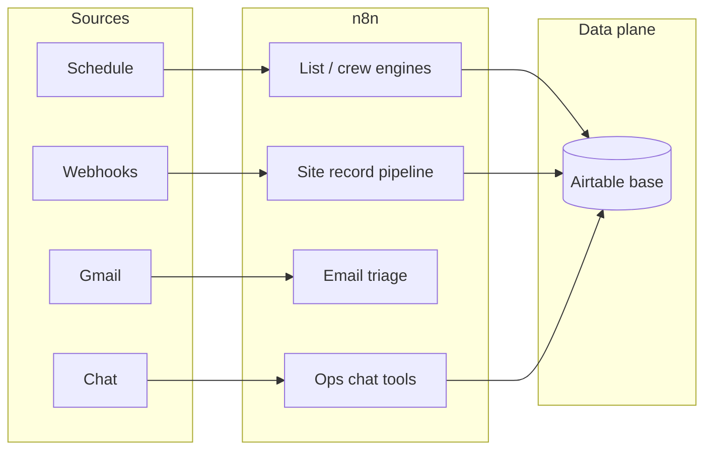

# Small Pool Builders & Maintenance Shops: n8n, AI, and Airtable for Field Ops That Actually Scale

**If you run a small pool business—weekly routes in maintenance or job-based crews in new construction—your margin lives or dies in the same place: the gap between what your office thinks is happening and what actually happens on site.**

This piece is for **owner-operators and lean teams**: a few trucks, a dispatcher who is also answering the phone, and a pile of tools (QuickBooks, Gmail, maybe a whiteboard) that do not talk to each other. I am going to walk through a **full automation layer** I shipped for one pool-centric operator using **n8n + Airtable + LLMs where they earn their keep**: morning lists, structured field data, English-language access to your own records, and guarded email triage. The mechanics below come from that build; you can map them onto **recurring routes** (maintenance) or **job phases and crew days** (builders) with the same architecture.

---

## Who This Is For (Be Honest)

- **Maintenance:** You sell routes and chemistry, not one-off miracles. You need fair distribution, skill-aware assignment, and visit logs you can bill from.
- **Builders:** You sell projects—dig, steel, shoot, tile, startup. You need **which crew hits which address on which day**, clean handoffs between phases, and fewer “did anyone log the startup chemistry?” gaps after turnover.

If you are big enough to run ServiceTitan with a dedicated admin, you already bought your pain relief. If you are **not**, you still need **one source of truth** and **automation that does not require a developer every Tuesday**.

---

## What “Full Stack” Ops Means for a Small Shop

“Full stack” here is not one giant workflow. It is **four patterns** your business actually asks for:

| Question | Pattern | Typical trigger |
|----------|---------|-----------------|
| Who works where today? | Scheduled assignment engine | Cron (before crews roll) |
| What did we document on site? | Ingest → interpret → persist | Webhook from forms, apps, or field tools |
| Can someone ask “where is this account?” in plain English? | Tool-backed chat | Slack, chat UI, or internal form |
| Which message actually needs the owner? | Classify → policy → escalate | Gmail or shared inbox |

**n8n** fits because small shops still need **branching, retries, credentials, and a little JavaScript**—without paying for an integration agency every time QuickBooks sneezes.

---

## Crew & Route Lists: Rules First, Drama Never

In the maintenance-style build I reference, two workflows drive **daily assignment** off the same Airtable model:

1. **Primary scheduled path** — Every morning, pull **today’s accounts** and **who is working**, run assignment logic, then **upsert** into a **`Daily Lists`** table so crews see one canonical sheet.
2. **Timer-style variant** — Same idea with the **calendar shape** that business actually runs (in this case, heavier load on specific weekdays—your shop might be Tue/Thu or “storm makeup Fridays”).

**If you build pools instead of maintaining them**, picture the same engine keyed on **jobs** instead of “weekly visit day”: excavation day, plumber call, electrician, startup blockouts—whatever fields you already track. The logic is still **eligible people × eligible sites × fair distribution**.

The interesting part is not drag-and-drop mapping. It is **Code nodes**:

- **Skill tiers** — Tough accounts or tricky equipment do not land on brand-new techs. Builders: swap “equipment tier” for **phase complexity** (e.g., first startup vs. acid wash assist) if that matches how you staff.
- **Geographic grouping** — Accounts carry a **group**; techs are filtered to **group + day** before round-robin.
- **Workload balance** — Nobody gets every “hour away” stop while someone else gets a tight cluster every week.

Your ops lead can **see** this in n8n; your developer (or vendor) can **diff** the JavaScript when you change the rules next season.

A third workflow exposes **`createList` as an on-demand tool**—same writes to `Daily Lists`, different entry (rerun after a sick call, ad hoc list for a float crew). **Small shops live off reruns.** Scheduled automation is not enough when a van goes in the shop at 6:12 a.m.

---

## Site Records: From Messy Notes to Rows You Can Trust

**Maintenance:** readings, chems, “customer says pump is loud,” algaecide added—if it stays on paper, you **cannot** price the next visit or defend a callback.

**Builders:** pre-plaster checklist, startup readings, warranty handoff photos—same problem, different noun.

The **record-keeper** pattern I wired looks like this:

1. **Webhook** accepts a payload (visit or job identifier, readings, raw notes).
2. **LLM** turns messy technician language into a **consistent summary** (original text stays attached for audit).
3. **Derived fields** — e.g. **Langelier Saturation Index (LSI)** from chemistry inputs so anyone scanning the row sees **balance risk** without opening a textbook.
4. **Upsert to Airtable** — one row per visit or service event, linked to **customer/job** and **tech/crew lead**.

That is **not** “fire your techs and hire ChatGPT.” It is **give the office searchable truth** so you stop playing telephone between the truck and QuickBooks.

---

## Ops Chat: Your Office Manager Should Not Be the Only Human Interface

Small shops get crushed by “quick questions”:

- “Did we service 14 Oak last week?”
- “Who is assigned to the Smith startup?”
- “Text me a map link—I am already driving.”

A dedicated **ops chat workflow** ties conversational input to **narrow tools** against the same Airtable base—search, update, create, **map links** for addresses. The model never gets raw SQL; it gets **buttons you designed in n8n**. That is how you avoid “the bot deleted my customer” horror stories.

---

## Email: The Inbox Is Still Where Small Businesses Bleed Hours

**Gmail automation** in this stack:

- **Trigger** on new mail.
- **Classifier** (this build: spam-ish / **customer** / **money**).
- **Trash path:** approval before delete—**always**, for a small business.
- **Customer path:** draft replies with **tools** when the thread needs lookups.
- **Money path:** **Slack** ping so invoices, draws, and lien-adjacent mail do not sit under newsletters.

Same pattern if you are a **builder** juggling subs, permit comments, and homeowner “can we move coping one inch?” threads. **Intent detection + policy** beats staring at a unified inbox at 9 p.m.

---

## How the Pieces Share One Brain

**Airtable** = what your team argues about in the **same language** (customers, jobs, crews, lists). **n8n** = what runs at 6:00 a.m. whether you slept or not. **LLMs** = language and intent—not your routing math.

---

## Failure Modes That Hurt Small Shops First

- **Silent empty runs** — If the employee query returns zero rows and the workflow still “succeeds,” you send crews out blind. **Alert** loud (Slack/SMS) when critical pulls are empty.
- **Duplicate lists** — Upsert on a **stable key** (customer + date + route key, or job + date + crew), not blind inserts.
- **Email deletes without a human** — Never. Not for a five-person company.
- **Garbage webhooks** — Validate shape at the door; park bad payloads somewhere you can **replay** after you fix the field app.

---

## Code Nodes vs. AI Nodes (The Bill-Control Line)

- **Code nodes:** routing, round-robin, tiers, geography—anything you can test with **last week’s real CSV export**.
- **AI nodes:** summaries, classification, chat retrieval—anything that starts as **messy human text**.

Mix them wrong and you get **surprise API bills** and **surprise crew assignments**. Small businesses feel both faster than enterprises do.

---

## FAQ

### We only have three techs and one office person. Is this overkill?

**No—if you are already losing margin to rework and “who had this account?”** You are not buying “enterprise automation.” You are buying **the minimum structure** so the owner can step off the phone long enough to bid the next job.

### Maintenance vs. builder data model—do we need two systems?

**Usually one base with different record types** (route accounts vs. active jobs), or **linked tables** for jobs under a long-term maintenance customer. n8n does not care; your **upsert keys** must match **how you actually sell**.

### Do we have to use Airtable?

**No.** Anything with an API (Supabase, Postgres + a simple UI, a vertical SaaS with webhooks) works. Airtable wins for **small pool shops** because your office can **fix bad data the same afternoon** without a ticket queue.

### Where does AI pay for itself first?

**Inbox triage** and **note-to-row cleanup**—both eat owner hours before you ever touch “fancy” agents. Scheduling stays **deterministic** unless you are doing serious drive-time optimization (and even then, keep the solver out of the LLM).

### How do we not lose workflows when someone quits?

**Export n8n JSON to Git** on every meaningful change. Name workflows like products: **“Daily Lists – Main Route,”** not **“Will’s workflow copy 7.”**

---

## Closing

**Small pool maintenance and local builders share one problem: the business is “field-first,” but the systems are still “spreadsheet-last-week.”** The companies that grow without imploding are the ones whose **daily lists, site records, and inbox** stay aligned—whether you are routing salt cells or steel.

If you are a **small shop** wondering whether **n8n + a real database + a little AI** can replace duct-taped Zaps and Sunday-night admin, it usually can—as long as you **encode rules in code** and **reserve models for language**.

I build these stacks for teams that cannot afford the wrong automation. **[Book an AI automation strategy call](https://williamspurlock.com/contact)**, tell me **maintenance or builder** and how many trucks you run, and we will see if your roughest constraint is ready to become a workflow.
