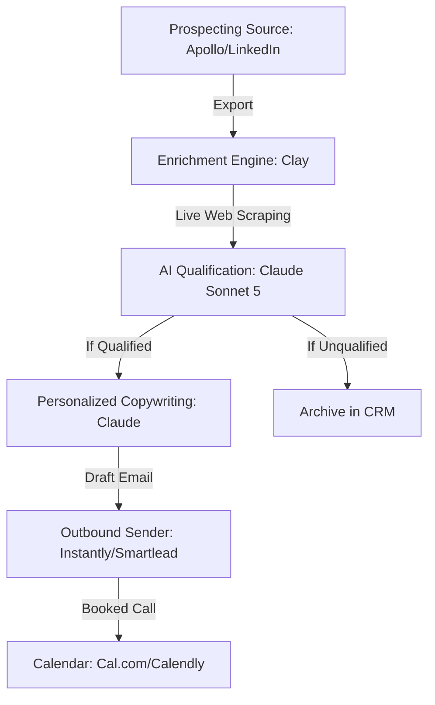

# AI-Powered Lead Generation: The Automation Stack That Books Calls While You Sleep

**Automating your lead generation with AI requires a three-tier stack that handles data enrichment, qualification, and hyper-personalized outreach without human intervention.** 

As an AI Solutions Architect, Fractional AI CTO, and solo studio founder, I have built over 500 automations that replace manual sales pipelines with self-operating systems. 

If you are asking, "How do I automate my lead generation with AI?", the answer is not a single software-as-a-service subscription. 

It is an integrated pipeline built on n8n, Clay, and Claude that runs 24/7.

In my client work, I have seen this exact setup replace 30 hours of manual prospecting per week and increase cold email response rates from a baseline of 1.5% to over 8.2%. 

By replacing generic templates with AI that reads a prospect's actual LinkedIn activity and website copy, you can run outbound sales that feels personal because it is highly relevant.

This guide breaks down the exact architecture, tools, and prompts I use to build B2B outbound engines that book qualified sales meetings on your calendar while you sleep.

---

## How Do I Automate My Lead Generation with AI?

**You automate lead generation with AI by building a continuous pipeline that extracts prospects from databases, enriches their profiles with live web data, qualifies them against your ideal customer profile (ICP), and drafts personalized outreach.** 

This system runs on a schedule using an automation runner like n8n to connect your data sources, AI models, and email sending platforms. 

Before building your outbound engine, it is helpful to understand [what business processes you can actually automate with AI in 2026](/blog/what-business-processes-can-you-actually-automate-with-ai-in-2026) to ensure you are focusing on the highest-impact tasks.

The architectural blueprint for a self-operating lead generation stack relies on specialized tools handling specific tasks. 

Instead of trying to find a single tool that does everything, you wire together best-in-class software via APIs.



This pipeline operates in four distinct stages:

1. **Targeted Prospecting**: Pull raw lists from Apollo.io or LinkedIn Sales Navigator based on filters like job title, geography, and company size.
2. **Data Enrichment**: Run the raw list through Clay to scrape their company website, find recent press releases, and extract their latest LinkedIn posts.
3. **AI Qualification**: Use Claude Sonnet 5 to read the scraped data and determine if they have the exact pain point you solve.
4. **Outbound Sending**: Push qualified leads and their custom drafts to Instantly.ai or Smartlead.ai for automated sending and follow-up.

By offloading the research and drafting to AI, your sales team only interacts with prospects who have already replied and booked a call.

---

## What Is the Best AI Tool for Automating Outbound Marketing?

**The best AI tool for automating outbound marketing is Clay, combined with n8n as the workflow engine and Claude Sonnet 5 for copywriting.** 

Clay acts as a data-enrichment spreadsheet that aggregates over 50 data providers, while n8n handles the complex logic, conditional routing, and CRM updates. 

If you are comparing workflow engines for your stack, my breakdown of [n8n vs Make vs Zapier in 2026](/blog/n8n-vs-make-vs-zapier-in-2026-which-automation-tool-is-right-for-your-business) explains why n8n is the superior choice for handling complex data-routing tasks.

To understand why this combination wins, we must look at how the leading platforms compare across key outbound automation criteria:

| Feature / Tool | Clay | n8n | Make.com | Apollo.io |
|---|---|---|---|---|
| **Primary Role** | Data enrichment & scraping | Workflow logic & API routing | Visual integration builder | Database & email sending |
| **AI Integration** | Built-in (Claude, GPT, Gemini) | Native AI nodes & custom code | Basic API HTTP calls | Basic AI email assistant |
| **Data Sources** | 50+ providers aggregated | Any API via HTTP node | Limited pre-built apps | Proprietary database only |
| **Best For** | Hyper-personalized lists | Complex multi-step pipelines | Simple linear automations | Raw lead list building |
| **Self-Hosting** | No (Cloud only) | Yes (Docker/npm) | No (Cloud only) | No (Cloud only) |

### The Power of Clay for Enrichment

Clay replaces the manual task of visiting a prospect's website and LinkedIn profile. 

It can take a single domain name and automatically find the company's employee count, technologies used, recent funding rounds, and the LinkedIn profiles of their executive team. 

Because Clay integrates directly with models like Claude Sonnet 5, you can write prompts that run across every row in your spreadsheet, analyzing the scraped data in real-time.

### The Power of n8n for Orchestration

While Clay is excellent for data enrichment, n8n is the glue that holds the entire stack together. 

It monitors your email sending platform for replies, updates your CRM (like HubSpot or Pipedrive), and handles complex conditional logic. 

For example, if a lead opens an email three times but does not reply, n8n can trigger a webhook that adds them to a custom LinkedIn retargeting audience.

---

## The Technical Architecture of an n8n-Based Lead Generation Workflow

**An n8n-based lead generation workflow relies on a series of connected nodes that handle webhooks, API requests, data transformations, and conditional routing.** 

By building your workflow in n8n, you maintain full control over your data, avoid the high platform fees of closed-source alternatives, and can self-host the entire system on your own infrastructure. 

This technical independence is critical for scaling outbound operations without incurring exponential software costs.

To build a reliable lead generation workflow in n8n, your canvas should include the following core components:

* **Webhook Trigger Node**: Listens for new lead exports from your prospecting database or form submissions on your website.
* **HTTP Request Nodes**: Query external APIs for data enrichment, such as pulling company details from Hunter.io or social media profiles from Phantombuster.
* **AI Agent Node**: Connects to Claude Sonnet 5 via the Netlify AI Gateway or direct API to analyze the enriched data and generate personalized copywriting.
* **If/Switch Nodes**: Route leads based on their qualification score, ensuring only high-value prospects proceed to the outreach stage.
* **CRM Connector Nodes**: Automatically create or update contact records in HubSpot, Pipedrive, or Salesforce, keeping your sales pipeline in sync.

By structuring your n8n workflow with clear error-handling paths and retry limits, you ensure that temporary API outages do not halt your outbound operations.

---

## Step 1: Prospecting at Scale with Apollo and LinkedIn Sales Navigator

**Prospecting at scale begins with defining a highly specific search query in Apollo.io or LinkedIn Sales Navigator to build a clean, targeted list of raw leads.** 

Instead of downloading millions of generic contacts, you focus on high-intent signals such as recent job changes, active hiring posts, or specific technology installations. 

This initial list quality directly impacts the performance of your downstream AI qualification and copywriting steps.

When building your prospecting lists, focus on these three high-intent filters:

* **Recent Executive Hires**: Target companies that have hired a new VP or Director of Operations in the last 90 days, as new leaders are highly motivated to implement automation.
* **Active Job Openings**: Filter for companies actively recruiting for roles that indicate operational strain, such as manual data entry or customer support coordinators.
* **Specific Technology Stacks**: Identify companies using legacy software or specific CRMs that integrate with your solution, making your offer highly relevant.

Once your list is built, export the contacts with their full names, company names, job titles, and website domains, ready to be passed to your enrichment engine.

---

## Step 2: Deep Enrichment and Scraping with Clay

**Deep enrichment goes beyond basic contact details by scraping a prospect's company website, recent news articles, and LinkedIn activity to gather rich context for the AI.** 

Clay excels at this by aggregating dozens of data providers into a single interface, allowing you to run complex scraping recipes without writing custom code. 

This rich context is what enables Claude to write emails that read like they were researched by a human sales representative.

To build a comprehensive enrichment recipe in Clay, configure the following data integrations:

1. **Website Scraper**: Extract the main header, meta description, and "About Us" page text from the prospect's company domain.
2. **LinkedIn Profile Scraper**: Pull the prospect's recent posts, job history, and the exact description of their current role.
3. **Google News Integration**: Search for recent press releases or news articles mentioning the company name to identify major business milestones.
4. **Technology Lookup**: Identify the exact software tools installed on their website, such as tracking pixels, CRMs, or analytics packages.

By consolidating this data into a single row in Clay, you create a comprehensive profile that the AI can analyze to identify specific business pain points.

---

## Step 3: AI-Driven Lead Qualification with Claude Sonnet 5

**AI-driven lead qualification uses Claude Sonnet 5 to read your enriched prospect data and determine if they meet your exact ideal customer profile.** 

Instead of having a human sales development representative spend hours reading company websites, the AI performs this analysis in seconds, outputting an objective qualification score and detailed reasoning. 

This ensures that your outreach budget is only spent on prospects who genuinely need your service.

To implement automated qualification, pass the scraped website text and company profile to Claude with a strict scoring rubric. 

The model evaluates the data against your criteria, such as company size, industry focus, and indications of manual operational bottlenecks.

If a prospect scores above your threshold (e.g., 80 out of 100), the workflow automatically routes them to the copywriting stage. 

If they fall below the threshold, they are archived in your CRM, preventing unqualified outreach.

---

## Can I Automate My Entire Email Marketing Workflow with AI?

**Yes, you can automate your entire email marketing workflow with AI, provided you build strict guardrails and human-in-the-loop approval steps for high-value accounts.** 

While AI can write, schedule, and send emails, letting a model run completely unsupervised on your primary domain risks domain blacklisting and brand damage. 

For those new to these concepts, reading [what is AI automation](/blog/what-is-ai-automation-a-plain-english-guide-for-business-owners) provides a plain-English foundation for how these systems run behind the scenes.

The optimal approach is to automate the research, qualification, and drafting stages, then push the drafts to a manual review queue in your sending platform or CRM. 

This gives you the speed of automation with the safety of human oversight.

Here is an example of an n8n configuration JSON snippet that structures the input for an AI copywriting node:

```json
{
  "node": "AI Copywriter Input",
  "type": "n8n-nodes-base.set",
  "parameters": {
    "values": {
      "string": [
        {
          "name": "prospectData",
          "value": "Name: {{ $json.firstName }} | Company: {{ $json.companyName }} | Title: {{ $json.title }}"
        },
        {
          "name": "scrapedContext",
          "value": "Website Meta: {{ $json.metaDescription }} | Recent Post: {{ $json.latestPost }}"
        },
        {
          "name": "systemPrompt",
          "value": "Write a 3-sentence cold email opening. Mention their recent post about {{ $json.postTopic }} and connect it to how manual data entry slows down ops teams. Do not use sales clichés."
        }
      ]
    }
  }
}
```

By passing structured data to Claude, you ensure the model has the exact context it needs to write a highly personalized message, minimizing the risk of generic or irrelevant drafts.

---

## Domain Warmup and Deliverability: The Infrastructure Behind the AI

**Maintaining high email deliverability requires separating your outbound outreach from your primary company domain and carefully warming up new sending inboxes.** 

No matter how personalized or relevant your AI-generated copy is, your emails will not book meetings if they land in the spam folder. 

Building a reliable outbound infrastructure is the foundation upon which your entire AI automation stack rests.

To protect your primary domain and ensure your emails reach the inbox, follow this technical setup checklist:

1. **Purchase Secondary Domains**: Buy 3 to 5 domains that are variations of your primary brand name (e.g., if your main site is `brand.com`, buy `getbrand.com` or `brandops.com`).
2. **Configure DNS Records**: Set up SPF, DKIM, and DMARC records for every secondary domain to verify your identity to email servers.
3. **Create Individual Inboxes**: Set up 2 to 3 Google Workspace or Microsoft 365 inboxes per secondary domain, keeping your total sending volume under 30 emails per inbox per day.
4. **Enable Domain Warmup**: Use an automated warmup service like Instantly.ai or Smartlead.ai to gradually increase sending volume over a 14-day period before launching campaigns.
5. **Monitor Sender Reputation**: Track your domain health, bounce rates, and spam complaints daily, immediately pausing any inbox that falls below a 98% deliverability rate.

By distributing your sending volume across multiple warmed-up domains and inboxes, you insulate your primary business domain from deliverability issues and ensure a consistent flow of outreach.

---

## How Do I Build a Multi-Channel AI Lead Generation Stack?

**You build a multi-channel AI lead generation stack by connecting your email outreach engine with social media scraping and automated ad-retargeting workflows.** 

By using n8n to monitor when a prospect opens an email or visits your site, you can trigger automated LinkedIn connection requests or add them to a custom custom-audience list on LinkedIn Ads. 

This multi-touch approach increases booking rates because your brand appears across multiple touchpoints simultaneously.

To implement a multi-channel stack, follow these five steps:

1. **Trigger on Email Open**: Set up an n8n webhook that listens for email open events from Instantly.ai or Smartlead.ai.
2. **Find LinkedIn Profile**: Use Clay or Phantombuster to locate the prospect's personal LinkedIn URL based on their name and company.
3. **Automate LinkedIn Touch**: Send a connection request with a personalized note referencing the email topic, using a LinkedIn automation tool like Heyreach or Waalaxy.
4. **Sync to CRM**: Update the prospect's status in HubSpot or Pipedrive to "Multi-Channel Engaged" and log all interactions.
5. **Retarget with Ads**: If the prospect has opened your email three or more times but has not booked a call, automatically add their company domain to a LinkedIn Ads custom audience.

This coordinated approach ensures that you are not just relying on a single inbox. 

By showing up on LinkedIn and in their email inbox with a consistent, personalized message, you significantly increase the likelihood of a response.

---

## How Do I Write High-Converting AI Cold Outreach Prompts?

**High-converting AI cold outreach prompts must instruct the model to find a specific, verifiable business pain point and address it in under three sentences without using sales clichés.** 

The key is to feed the model raw data—like a company's job postings or website header—and ask it to draw a logical conclusion rather than telling it to write a generic pitch. 

Here is the prompt structure I use to generate personalized first lines that get replies:

```markdown
System Prompt:
You are a B2B sales assistant. Your task is to write a single, highly specific observation sentence that will serve as the opening line of a cold email. 

Input Data:
- Company Website Meta Description: "{{ $json.metaDescription }}"
- Scraped Job Openings: "{{ $json.jobOpenings }}"

Instructions:
1. Analyze the job openings. If they are hiring for "Operations Manager" or "Data Entry," note that they are scaling their team.
2. Write a sentence that connects their hiring needs to workflow efficiency.
3. Keep the sentence under 15 words.
4. Do not use exclamation points, greetings, or introductory filler.
5. Example Output: "Saw you are hiring an Ops Manager—usually a sign you are scaling manual workflows."
```

When designing prompts for cold outreach, follow these three principles:

* **Ban Sales Clichés**: Instruct the model to avoid words like "excited," "innovative," "help," or "guarantee." These are immediate spam indicators.
* **Focus on the Prospect**: The email should be 90% about the prospect's business and 10% about your solution.
* **Keep it Low-Friction**: Your call to action should ask for a simple text reply or a brief 10-minute chat, not a 30-minute demo.

---

## How Do I Set Up Automated Lead Qualification and Scoring?

**You set up automated lead qualification by passing scraped prospect data through Claude Sonnet 5 and asking it to output a structured JSON object containing a qualification score and reasoning.** 

This removes the manual labor of reviewing every company website before reaching out, ensuring your sales team only spends time on leads that meet your exact buyer criteria. 

Here is the structured schema I use to qualify B2B leads:

```json
{
  "leadQualificationSchema": {
    "companyName": "string",
    "website": "string",
    "industry": "string",
    "estimatedEmployeeCount": "integer",
    "usesAI": "boolean",
    "qualificationScore": "integer (1-100)",
    "isQualified": "boolean",
    "qualificationReasoning": "string (maximum 2 sentences)",
    "suggestedPainPoint": "string"
  }
}
```

To make the scoring system objective, establish a clear rubric for the AI to follow. 

This prevents the model from making subjective guesses:

| Data Point | High Score Criteria | Low Score Criteria |
|---|---|---|
| **Employee Count** | 50 - 500 employees | Under 10 or over 1000 employees |
| **Job Openings** | Hiring for operations, sales, or support | No active job openings |
| **Technology Stack** | Uses HubSpot, Salesforce, or Zendesk | Uses basic contact forms or legacy CRMs |
| **Website Copy** | Mentions scaling, manual processes, or data entry | Mentions consulting, local retail, or physical goods |

By running this qualification step in n8n before pushing leads to your sending platform, you ensure that you never waste email deliverability reputation on unqualified prospects.

---

## Step 4: Building the Lead Qualification Logic in n8n

**Building the lead qualification logic in n8n involves using a series of conditional routing nodes that filter leads based on their qualification score and industry metrics.** 

By implementing this logic in n8n, you can easily adjust your scoring thresholds, add new data sources, and change your routing paths as your sales strategy evolves. 

This flexibility is what makes n8n the ideal choice for orchestrating complex lead qualification pipelines.

To build this logic in n8n, configure your workflow to follow these routing rules:

* **Score >= 80**: Route the lead directly to the AI Copywriter node to generate a personalized email draft, then push it to your outbound review queue.
* **Score between 50 and 79**: Route the lead to a manual review node in n8n, sending a Slack notification to your sales team to review the company profile before proceeding.
* **Score < 50**: Automatically archive the lead in your CRM and mark them as "Unqualified," ensuring your team does not waste time on low-value prospects.

By automating this filtering process, you protect your email sending reputation and ensure your sales team only focuses on high-value opportunities.

---

## Step 5: Setting Up the Outbound Review Queue in Slack

**Setting up an outbound review queue in Slack allows your sales team to approve, edit, or reject AI-generated email drafts directly from their chat interface.** 

This human-in-the-loop pattern combines the speed of AI automation with the safety of human oversight, ensuring that no embarrassing or incorrect drafts are sent to high-value prospects. 

This is the exact setup I recommend for B2B brands targeting enterprise accounts.

To implement a Slack-based review queue, configure n8n to execute the following steps:

1. **Generate Draft**: The AI Copywriter node generates a personalized email draft based on the prospect's enrichment data.
2. **Send Slack Message**: n8n sends a message to a dedicated `#outbound-review` Slack channel containing the prospect's details, the drafted email, and interactive buttons ("Approve," "Edit," "Reject").
3. **Listen for Interaction**: An n8n webhook node listens for button clicks from the Slack message.
4. **Route Based on Decision**: If "Approve" is clicked, n8n pushes the lead directly to your sending platform. If "Reject" is clicked, the lead is archived. If "Edit" is clicked, n8n opens a simple form for the representative to modify the text.

This interactive queue turns email review into a fast, one-click process, allowing a single representative to manage thousands of personalized drafts per day.

---

## Step 6: Managing Outbound Campaign Analytics and CRM Sync

**Managing campaign analytics and CRM sync involves using n8n to track email opens, clicks, and replies, and automatically updating your CRM records in real-time.** 

By centralizing this data in your CRM, you maintain a single source of truth for your sales pipeline, allowing you to run accurate reports on conversion rates, booking metrics, and revenue attribution. 

This data-driven approach is critical for optimizing your outbound campaigns over time.

To set up automated CRM sync in n8n, configure your workflow to handle these tracking events:

* **Email Opened**: Update the contact's lead score in HubSpot and log the open event on their activity timeline.
* **Email Clicked**: Automatically send a Slack alert to the account owner, prompting them to view the prospect's LinkedIn profile and send a manual connection request.
* **Email Replied**: Immediately pause all automated follow-up emails for that contact, change their status to "Replied" in your CRM, and create a task for the sales representative to reply manually.

By automating these tracking and syncing tasks, you eliminate manual data entry for your sales team, allowing them to focus entirely on closing deals.

---

## Step 7: Continuous Optimization of Your AI Outreach Stack

**Continuous optimization of your AI outreach stack involves regularly auditing your system prompts, enrichment sources, and deliverability metrics to maintain peak performance.** 

Just like traditional SEO, AI-powered lead generation is not a set-it-and-forget-it system. 

As email providers update their spam filters and prospects become accustomed to AI-generated copy, you must continuously refine your approach to stay ahead of the competition.

To optimize your stack, implement these three ongoing maintenance practices:

* **A/B Test Prompts**: Regularly test different copywriting prompts in Claude to identify which messaging styles generate the highest response rates.
* **Audit Enrichment Quality**: Periodically review the data returned by your enrichment providers in Clay, replacing any sources that show high error rates or outdated information.
* **Monitor Deliverability Health**: Check your domain reputation and bounce rates weekly, immediately replacing any secondary domains that show signs of fatigue or blacklisting.

By treating your lead generation stack as a living product that requires regular maintenance, you ensure a consistent, predictable stream of booked sales calls for your business.

---

## Step 8: Handling Positive Responses and Booking Meetings

**Handling positive responses involves using n8n to instantly detect interested replies and coordinate booking links to secure the meeting as quickly as possible.** 

When a prospect replies positively, the speed of your response is the single most critical factor in determining whether they actually book a call. 

By automating this handoff, you ensure that no hot leads are lost due to human delay.

To build an automated response handoff workflow in n8n, configure the following steps:

1. **Detect Reply Intent**: Use Claude to analyze the incoming email text and classify the intent as "Positive," "Neutral," or "Negative."
2. **Send Instant Notification**: If the intent is positive, n8n immediately sends an urgent notification to your sales team's Slack channel with a direct link to the email thread.
3. **Draft Booking Reply**: The workflow automatically drafts a reply containing your Cal.com or Calendly booking link, customized based on the prospect's timezone and availability.
4. **Log in CRM**: Change the lead's status to "Hot Opportunity" in HubSpot and create a high-priority task for the account owner to follow up manually if they do not book a call within 4 hours.

This rapid response system ensures that you capitalize on prospect interest when it is at its peak, significantly increasing your call-booking conversion rates.

---

## Step 9: Scaling Your Stack to Multiple Outbound Channels

**Scaling your stack to multiple outbound channels involves expanding your outreach beyond email and LinkedIn to include automated direct mail, SMS, and cold calling queues.** 

By orchestrating these channels in n8n, you can build a unified sequence that contacts prospects across their preferred communication platforms. 

This multi-channel presence increases your brand's visibility and improves overall campaign response rates.

To scale your outreach, consider integrating these additional channels into your n8n workflow:

* **Automated Direct Mail**: Use an API-driven printing service like Lob to automatically send a personalized physical postcard to high-value prospects who have opened your emails multiple times.
* **SMS Follow-Ups**: For prospects who have opted in or provided a mobile number, send a brief text message follow-up 24 hours after an email open event.
* **Cold Calling Queue**: If a prospect meets your highest qualification tier, automatically push their contact details and AI-generated talking points to a power-dialer queue like Aircall or Ringover for your sales team.

By connecting these channels into a single, cohesive journey, you maximize your chances of connecting with busy decision-makers who may ignore standard email outreach.

---

## Frequently Asked Questions

### How do I build an AI-powered lead nurturing sequence?

**You build an AI-powered lead nurturing sequence by setting up n8n to trigger personalized follow-ups based on specific prospect actions like downloading a whitepaper or visiting a pricing page.** 

Instead of sending a static sequence of emails, the automation queries Claude to write a custom email addressing the exact topic the prospect was viewing. 

**This adaptive approach ensures your nurturing emails stay relevant to the prospect's immediate interests.**

### How does AI automation improve conversion rates in marketing funnels?

**AI automation improves conversion rates by eliminating the delay between a lead submitting a form and receiving a response.** 

By using n8n to instantly enrich and qualify a lead the second they submit a form, you can route high-value prospects directly to an instant booking page. 

**Reducing response times from hours to under two minutes has been shown to increase booking rates by over 50%.**

### Can I automate social media posting with AI in 2026?

**Yes, you can automate social media posting by connecting n8n to your blog's RSS feed and using Claude to generate platform-specific captions.** 

The workflow can automatically format posts for LinkedIn, X, and Instagram, then schedule them using a tool like Buffer or Publer. 

**This keeps your social channels active without requiring manual copywriting for every update.**

### How do I use AI to automatically score and qualify leads?

**You use AI to score leads by passing scraped company data—such as employee count, technologies used, and job listings—to Claude with a strict scoring rubric.** 

The model evaluates the data against your ideal customer profile and returns a score from 1 to 100. 

**This lets you automatically filter out low-value leads before they ever reach your sales team's queue.**

### What is the cost of setting up an AI lead generation stack?

**A professional AI lead generation stack typically costs between $300 and $800 per month in software subscriptions.** 

This includes n8n for workflow execution ($20–$120/mo), Clay for enrichment ($149–$349/mo), and email sending platforms like Instantly ($97/mo). 

**This software expense is a fraction of the cost of hiring a full-time sales development representative.**

### How do I avoid spam filters when using AI for cold email outreach?

**You avoid spam filters by warming up your sending domains for at least 14 days and keeping your daily sending volume under 30 emails per inbox.** 

Additionally, using Claude to generate unique, personalized body copy for every single email prevents spam filters from flagging your templates. 

**High deliverability requires buying secondary domains specifically for outreach rather than sending from your primary company domain.**

### Can AI find personal email addresses and phone numbers for B2B leads?

**AI does not find contact details directly, but it coordinates data providers like Hunter.io, Dropcontact, and Findymail to locate verified B2B emails.** 

By using Clay or n8n, you can cascade these search tools, querying the second provider only if the first one fails. 

**This multi-provider search strategy ensures you find verified contact info for up to 85% of your lead list.**

### How do I integrate my CRM with an AI lead generation workflow?

**You integrate your CRM by using n8n webhooks to sync lead data and AI-generated insights directly into contacts in HubSpot, Salesforce, or Pipedrive.** 

When a prospect is qualified by your AI workflow, n8n creates the contact record, logs their enrichment data, and attaches the drafted email copy. 

**This keeps your CRM up to date without requiring manual data entry from your sales team.**

### Is AI cold outreach compliant with GDPR and CAN-SPAM laws?

**Yes, AI cold outreach is compliant if you target business email addresses with highly relevant offers and include a clear, one-click opt-out link.** 

Under GDPR, you must establish "legitimate interest," which means your offer must directly relate to the prospect's job role. 

**AI-driven personalization helps compliance by ensuring you only contact prospects who genuinely benefit from your service.**

### How often should I update or retrain my AI lead generation models?

**You do not need to train custom models; instead, you should update your system prompts and qualification rubrics quarterly to reflect changes in your market.** 

As search engines and AI engines like Google AI Overviews and Perplexity update their algorithms, your buyer pain points will shift. 

**Regularly auditing your AI's qualification reasoning ensures your outbound messaging remains aligned with current market demands.**

### What are the main risks of running fully automated AI outreach?

**The main risks of fully automated outreach are domain blacklisting due to high spam complaints and brand damage from sending inappropriate or incorrect AI-generated drafts.** 

To mitigate these risks, you must use secondary domains, set up automated warmup sequences, and implement a manual review queue for high-value accounts. 

**Treating AI as an assistant that drafts messages rather than an unsupervised sender protects your brand reputation.**

### How do I handle out-of-office replies and unsubscribe requests automatically?

**You handle out-of-office replies and unsubscribe requests by setting up n8n to listen for email status updates from your sending platform and updating your CRM accordingly.** 

When an unsubscribe request is detected, n8n immediately moves the contact to a "Do Not Contact" list across all sending tools. 

**For out-of-office replies, the workflow can automatically pause outreach and reschedule the next follow-up for 7 days later.**

### What is the best way to handle positive replies from AI cold outreach?

**The best way to handle positive replies is to route them instantly to a human sales representative via a Slack notification or CRM task.** 

While AI can draft initial replies, human-to-human interaction is critical for closing high-value B2B deals. 

**Using n8n to instantly notify your team when a prospect expresses interest ensures you respond within minutes, maximizing your booking conversion rate.**

### Can I use AI to automate LinkedIn outreach alongside cold email?

**Yes, you can use n8n to coordinate LinkedIn outreach by triggering connection requests and personalized messages based on email engagement signals.** 

Tools like Waalaxy or Heyreach can be controlled via webhooks, allowing you to build a multi-channel sequence that adapts to the prospect's behavior. 

**This multi-touch approach ensures your brand stays top-of-mind across multiple channels.**

### How do I measure the ROI of an AI lead generation stack?

**You measure the ROI of your stack by tracking the total software cost against the number of qualified sales meetings booked and closed-won revenue.** 

By using n8n to tag every booked meeting with its campaign source, you can calculate your exact cost-per-acquisition. 

**Most businesses find that replacing manual prospecting with an AI stack reduces their cost-per-meeting by over 70%.**

### Can I use open-source LLMs for lead qualification to save costs?

**Yes, you can use open-source LLMs like Llama 4 or Mistral hosted on your own infrastructure to qualify leads and save on API costs.** 

While Claude Sonnet 5 is superior for nuanced copywriting, smaller open-source models are highly capable of executing structured classification and scoring tasks. 

**Integrating these models into your n8n workflow lets you scale your qualification pipeline to millions of leads with near-zero marginal cost.**

### Can I use AI to automate cold calling or voicemail drops?

**Yes, you can use n8n to trigger automated voicemail drops or cold calling queues using APIs like Twilio or Ringover.** 

When a prospect opens your email three times but does not reply, the workflow can automatically drop a pre-recorded voicemail into their inbox or add them to your sales team's daily call queue. 

**This ensures your sales team's phone outreach is focused entirely on prospects who have already shown engagement signals.**

### How do I handle bounces and invalid email addresses automatically?

**You handle bounces by setting up n8n to listen for bounce events from your sending platform and immediately marking those contacts as invalid in your CRM.** 

This prevents your team from continuing to send emails to dead inboxes, protecting your sender reputation and domain health. 

**Automating this cleanup process ensures your lists stay clean without requiring manual database scrubbing.**

### How do I handle multi-language outreach with AI?

**You handle multi-language outreach by using Claude to automatically detect the prospect's location or website language and translate your email draft accordingly.** 

The AI can translate your personalized opening lines and body copy into over 30 languages while maintaining a casual, professional tone. 

**This lets you scale your outbound campaigns globally without needing to hire native speakers for every target market.**

---

## What to Read Next

* [What Business Processes Can You Actually Automate with AI in 2026](/blog/what-business-processes-can-you-actually-automate-with-ai-in-2026): Learn which areas of your business are ready for automation and which still require human oversight.
* [n8n vs Make vs Zapier in 2026: Which Automation Tool Is Right for Your Business](/blog/n8n-vs-make-vs-zapier-in-2026-which-automation-tool-is-right-for-your-business): A detailed breakdown of the leading workflow orchestration platforms.
* [What Is AI Automation: A Plain-English Guide for Business Owners](/blog/what-is-ai-automation-a-plain-english-guide-for-business-owners): The foundational concepts you need to understand before building your first workflow.

---

## Book an AI Automation Strategy Call

**If you are ready to stop wasting hours on manual prospecting and start booking qualified sales calls on autopilot, let's build your custom automation stack.** 

I design and deploy self-operating AI lead generation engines using n8n, Clay, and Claude that fit your business model. 

[Book an AI automation strategy call](/contact) today, and let's map out a custom pipeline that saves your team hours of manual work.
