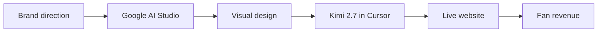

# How I Built Fordo's Official Artist Website Without Writing a Line of Code

## The Receipt: 52 Million Streams Deserves More Than a Link-in-Bio

**Fordo has 52M+ streams, 676K+ monthly listeners, and a Sony Music joint venture — but until this build, his online home didn't match the size of his audience.** Most signed artists still point fans to a link-in-bio page that kills momentum. I built him a site that converts attention into merchandise sales, email signups, and booking requests.

The numbers already proved the demand. My job was to build a destination that finally caught up to it.

| Metric | Number | What it means for the site |
|---|---|---|
| Total streams | 52M+ | Fans are already listening; the site just has to capture them |
| Monthly listeners | 676K+ | A warm audience ready to convert every month |
| TikTok followers | 381.4K+ | Discovery traffic that needs somewhere real to land |
| "JADED" single | 22.2M+ streams | A flagship song that deserves its own spotlight |
| Debut album "2001" | 12 tracks | A full world to merchandise and narrate |

This is not a vanity project. It is the central hub for a career that is already moving.

## What the Site Actually Feels Like

**It feels like walking into a curated world, not clicking through a template.** The first impression is dark, moody, and alive — motion responds to your cursor, pages fade into each other instead of reloading, and the whole thing feels like an experience you want to screenshot and send to a friend.

A casual listener who lands from TikTok or Spotify should immediately feel like they found someone already huge. That perceived stature is half the sale.

- A custom cursor that reacts as you move, so the site feels physically responsive
- Page transitions that make the whole journey feel like one continuous ride
- A persistent audio player so his music follows you through the whole site and never stops when you click around
- A smooth, frictionless journey from first click to checkout with no dead ends
- Typography and color choices pulled directly from the "2001" album world
- A mobile layout that keeps the same attitude without losing any functionality

The design language matches the music: polished, emotional, slightly rebellious. You do not land on this site and think "template." You think "artist." That standard is the whole point of my [immersive web design manual](/blog/immersive-web-design-manual).

## The Build Pipeline: AI Designed It, AI Coded It, I Directed It

**This site was not hand-coded. It was taste-directed.** I designed the look in Google AI Studio, then directed Kimi 2.7 inside Cursor to build it — I didn't hand-code it. My job was creative direction: the brand hierarchy, the motion language, the conversion path, the mobile behavior. The machine did the execution under my eye.

The reason this matters is speed and specificity. I could iterate on the visual direction in minutes, then translate that direction into a live site without a team of engineers. The result is custom-art-directed quality at a fraction of the traditional timeline. It is the same revenue-first build loop I broke down in my [AI Studio to revenue SOP](/blog/ai-studio-antigravity-vibe-code-revenue-sop).

My input at every stage was judgment. Which motion felt on-brand. Which layout made the store easiest to buy from. Which copy matched the Fordo Family voice. The AI handled the repetitive execution; I handled the taste calls that separate a memorable site from a forgettable one.

## Why the Music Never Stops

**The audio player stays with the fan across every page, which keeps listening time up and drop-off down.** On most artist sites, you click a link and the music dies. That trains fans to leave. Here, the player persists, so someone who lands on the merch page or press page still has the album running in the background.

That matters for three reasons:

- It increases the chance a casual listener becomes an actual fan before they bounce
- It makes merch browsing feel like part of the listening experience, not an interruption
- It turns the site into a playback destination, not just a reference page

When the music follows you, the site feels like an app. When it dies on every click, it feels like a PDF. Fordo's site feels like an app.

## Built for AI Search and the Next Wave of Fan Discovery

**I built it so AI search and Google know exactly who Fordo is, so when a fan asks an AI assistant about him, the answer is right.** This is not about tricking algorithms. It is about making sure every section of the site tells a clear story: artist name, album, songs, social proof, store, booking.

The next generation of fans will not just type "Fordo" into Google. They will ask ChatGPT, Perplexity, or whatever assistant ships with their phone. If those systems cannot confidently identify the artist, the album, and the official channels, the answer will be wrong or missing.

- Artist identity is marked clearly across every section
- Album "2001" and its 12 tracks are described with proper context
- Social and streaming links are tied directly to official profiles
- Merch, booking, and press pages are labeled so search engines understand their purpose
- Streaming milestones and release data are presented as facts, not buried in images

The result: a fan asking "Who is Fordo?" or "What is Fordo's album 2001?" gets a clean, accurate answer — and that answer points back to a site the artist controls.

## The Brand System: Fordo Family, Red Heart, 2001 World

**Fordo is not just a name — it is a fan identity, and the site turns that identity into something ownable.** The "Fordo Family" language, the red-heart mark, and the "2001" world named for his birth year give the brand the bones of a trademarkable system. The tagline "For those done asking permission to be themselves" is baked into the site copy.

Most artist brands live scattered across platforms. The profile picture on TikTok does not match the banner on Spotify, which does not match the merch drop on Instagram. That fragmentation weakens recall. This site consolidates the visual language into one place.

| Brand element | How it shows up on the site |
|---|---|
| Fordo Family | Fan-facing language and community identity |
| Red-heart mark | Recurring symbol across pages and merchandise |
| "2001" album world | Color, typography, and motion tied to the release |
| Tagline | Woven into homepage and press copy |
| Birth-year narrative | Used to anchor the album story and merch drops |

When a fan buys a shirt, they are not just buying cotton. They are buying membership in a world. The site makes that world feel real — the same brand-as-asset thinking behind the [anatomy of a $25K brand website](/blog/anatomy-25k-brand-website-decisions).

## The Merch Store: 12 Products, Zero Inventory, Real Margin

**There is a 12-product print-on-demand merch store ($12-$70) connected to the site with no inventory, no boxes in a garage, and no fulfillment overhead.** When a fan buys, the order prints and ships automatically. The artist keeps margin without touching a box.

This is the part that changes the economics for independent and signed artists alike. You do not need a label advance to stock a warehouse. You do not need to guess sizes. You do not need to ship anything yourself.

| Product tier | Price range | Role in the store |
|---|---|---|
| Entry accessories | $12-$25 | Low-friction first purchase for new fans |
| Core apparel | $35-$55 | Where the majority of conversions happen |
| Premium pieces | $60-$70 | Higher margin for committed fans |

The store is not an afterthought bolted onto the site. It is part of the same visual world. A fan listening to "JADED" can add a hoodie to their cart without the music stopping. That continuity directly affects conversion.

## Email Capture: Owning the Audience Instead of Renting It

**The site captures fans into an email list the artist actually owns, instead of renting the audience from Spotify or TikTok.** Every platform algorithm can change overnight. Email does not. The signup forms are placed at natural moments — after a song plays, near merch, on the homepage.

Email is the only channel where the artist controls reach, timing, and messaging. When Fordo drops his next single, announces a tour, or restocks a sold-out shirt, he can reach his fans directly without paying a platform for the privilege.

- Homepage signup for first-time visitors
- Merch-page capture for buyers who want early access to drops
- Press-kit adjacent form for media and industry contacts
- No intrusive pop-ups that kill the experience

The goal is not to harvest addresses. It is to build a direct relationship with the people who already care.

## Press, Booking, and Collabs in One Place

**The site is also a business tool: downloadable EPK, booking routing, and a collabs archive all live in one clean destination.** A manager can send one link to a festival booker, a brand partner, or a playlist editor.

Too many artists lose opportunities because the right information is scattered across five apps. Here, everything a decision-maker needs is centralized.

- Downloadable press kit with streaming stats, bio, and approved photos
- Clear booking route so opportunities do not get lost in DMs
- Collabs archive showing past features and partnerships
- Social proof tied to the 52M+ stream count and 676K+ monthly listeners

When a booker opens the site, they see an artist who already looks booked. That first impression shortens the distance between inquiry and offer.

## FAQ

### Who is Fordo?
**Fordo is Ethan Kevin Ford, a Milwaukee-born pop/rap artist now based in Los Angeles.** He has 52M+ streams, 676K+ monthly listeners, and is signed to SANA Records / Listen To The Kids in a Sony Music joint venture. His debut album "2001" contains 12 tracks.

### Did you really build this without coding?
**Yes. I used Google AI Studio for design direction and Kimi 2.7 inside Cursor for the build — no hand-coding from me.** My role was creative direction, brand logic, and conversion design. The exact workflow was Google AI Studio for the look and Kimi 2.7 in Cursor for execution.

### What makes the site different from a template?
**It is a custom experience built around Fordo's actual brand world, not a swapped-out template.** The "2001" album aesthetic, red-heart mark, Fordo Family identity, and persistent audio player are specific to him. A template cannot replicate a signed artist's world.

### How does the merch store work without inventory?
**It uses print-on-demand, which means products are made only after a fan orders.** Fordo carries no stock, rents no warehouse, and ships nothing himself. The store currently lists 12 products priced from $12 to $70.

### Will this help fans find him on Google or ChatGPT?
**Yes. The site is built so AI search and Google know exactly who Fordo is and what the 2001 album is.** That means clearer answers when fans ask AI assistants about him, with links back to his official channels.

### What does the site do for press and booking?
**It includes a downloadable EPK, a booking route, and a collabs archive in one place.** A manager can send a single link instead of chasing down assets across email threads and cloud folders.

### Why does the music keep playing when I click around?
**The persistent audio player keeps his music following you through the whole site and never stops when you click around.** This keeps fans listening longer and reduces the chance they leave before discovering the store or signing up.

### What does a site like this cost to build?
**I do not publish flat pricing because every artist needs different depth.** This build included custom art direction, a 12-product store, email capture, EPK, booking routing, and AI-search structure. If you want something in this range, book a 15-minute discovery call and I will give you a real number.

## If You're Still Treating Your Website Like a Business Card, You're Leaving Money on the Table

**A great artist website is not a brochure. It is a revenue and discovery engine.** Fordo's site turns streams into email signups, casual listeners into merch buyers, and curious bookers into real opportunities. The design builds perceived stature. The commerce works without overhead. The fan identity deepens with every click.

This is the shift: your website can be the most profitable piece of digital real estate you own. Not Instagram. Not TikTok. Not Spotify. Those are rented audiences. Your site is where you convert them into something you actually own.

If you're an artist, label, or manager who wants a site that turns fans into real revenue, book a 15-minute discovery call.