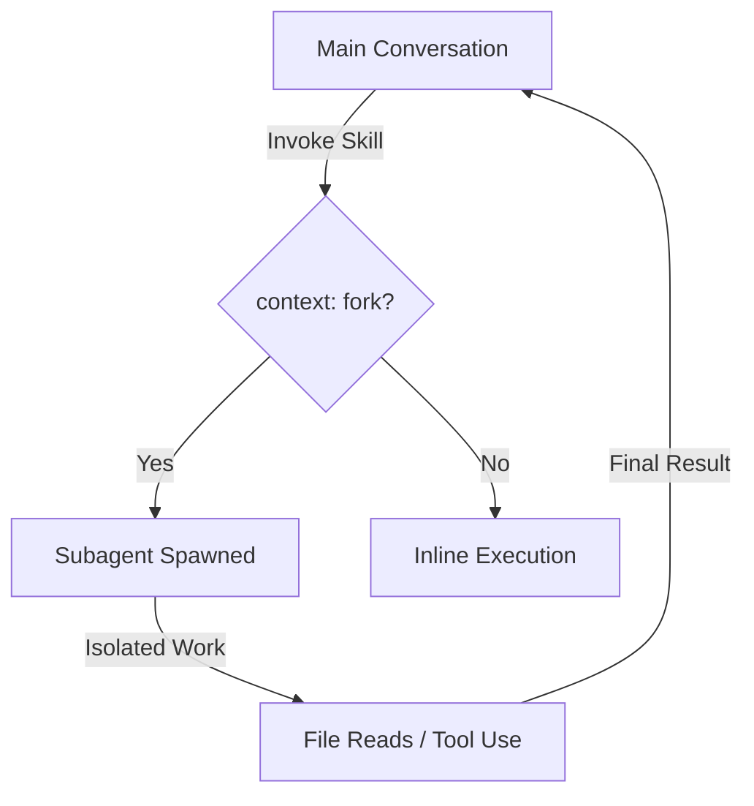

# Claude Code Skills: The Complete Authoring Guide

**Skills are the single highest-leverage feature in Claude Code for teams and solo operators who ship repeatedly.** A well-authored skill turns a 45-minute manual procedure into a 30-second command. It encodes your conventions, your checklists, your quality gates — and makes them available on demand without bloating your daily context window. This guide covers everything from SKILL.md anatomy to shipping reusable skill libraries as products.

---

## What Is a Claude Code Skill and Why Does It Matter?

**A Claude Code Skill is a packaged procedure — a reusable playbook that Claude can invoke automatically or on command — that loads into context only when needed, saving token budget for what matters.** According to the official Anthropic documentation at [code.claude.com/docs/en/skills](https://code.claude.com/docs/en/skills), skills "extend what Claude can do" by adding capabilities beyond the base model through structured markdown files with YAML frontmatter.

The core innovation is **progressive disclosure**. Unlike `CLAUDE.md` rules, which load at the start of every session and persist throughout, skills describe their purpose via a short `description` field that stays in Claude's working memory. The full skill body — which might be 500 lines of detailed procedure — only loads when Claude decides the skill is relevant to your request, or when you invoke it directly with `/skill-name`.

This matters because context windows, even at the 1M tokens Claude Opus 4.7 ships on paid plans (up from the 200K default), are finite resources. Every line of procedure you stuff into `CLAUDE.md` consumes tokens that could hold actual conversation, file contents, or reasoning traces. A skill library lets you carry dozens of specialized procedures — deployment playbooks, code review checklists, testing protocols, refactoring recipes — without paying the context tax until you actually need them.

Skills also encode **repeatable quality**. When I write a skill for "reviewing a Next.js migration PR," I'm not just saving time — I'm ensuring every review covers the same 14 checkpoints: App Router compatibility, async component boundaries, metadata API migration, loading.tsx placement, error.tsx coverage, parallel route handling, intercepting route updates, and so on. The skill becomes organizational memory that survives team turnover and prevents "oh, I forgot to check for that" omissions.

The practical result: procedures that used to require 45 minutes of manual checklist-walking now execute in 30 seconds with consistent thoroughness. That's not automation hype — that's context engineering applied to operator efficiency.

---

## Skills vs. Rules vs. Hooks vs. Subagents: The Complete Distinction

**Skills, rules, hooks, and subagents are complementary mechanisms with distinct lifecycles and purposes — choosing the wrong one creates either context bloat or capability gaps.** According to Anthropic's official skill documentation at [code.claude.com/docs/en/skills](https://code.claude.com/docs/en/skills), skills are "packaged procedures" that load on demand, while `CLAUDE.md` rules are "long-lived project conventions that remain in your active context for every session."

| Feature | Lifecycle | When It Loads | Best For | Cost Model |
|--------|-----------|---------------|----------|------------|
| **Rules (`CLAUDE.md`)** | Persistent | Session start | Universal conventions, coding standards, architecture constraints | Always-on context tax |
| **Skills (`SKILL.md`)** | On-demand | Description always visible; body loads when invoked | Repeatable procedures, complex workflows, reference-heavy tasks | Pay only when used |
| **Hooks** | Event-driven | Scoped to skill/agent lifecycle | Deterministic automation, validation, logging, cleanup | Zero context overhead |
| **Subagents** | Isolated | Forked context on demand | Parallel work, heavy exploration, protecting main conversation | Separate context budget |

**Rules** live in `CLAUDE.md` at project root or parent directories. They're for standing constraints: "Always use TypeScript strict mode," "Never call external APIs without timeout handling," "Prefer React Server Components for data-fetching." These apply to almost every interaction, so the context cost is justified by the elimination of repetitive instruction.

**Skills** are for procedural knowledge you don't need constantly: "How to deploy to staging," "The code review checklist for authentication PRs," "The procedure for migrating a component to the new design system." Per the official docs, "Unlike `CLAUDE.md` content, a skill's body loads only when it's used, so long reference material costs almost nothing until you need it."

**Hooks** are deterministic scripts that execute at specific lifecycle events — before a tool runs, after file edits, on tool errors. As noted in community guides by Anthropic engineers on [Medium](https://medium.com/@tort_mario/skills-for-claude-code-the-ultimate-guide-from-an-anthropic-engineer-bcd66faaa2d6), hooks can be "scoped to this skill's lifecycle," activating only when a specific skill runs. This is critical for skills that need temporary side effects (logging usage, validating outputs) without permanent context overhead.

**Subagents** are forked execution contexts with isolated tool access and context budgets. The `context: fork` frontmatter field in a skill sends its execution to a subagent rather than inline. According to the official documentation, this "writes the task in your skill and picks an agent type to execute it" — the built-in Explore and Plan agents skip `CLAUDE.md` and git status to keep context minimal.

The architectural decision tree:

- **Is this a universal constraint that applies to 80%+ of interactions?** → `CLAUDE.md` rule
- **Is this a repeatable procedure I invoke situationally?** → `SKILL.md` skill
- **Does this need to run automatically when X happens?** → Hook (often within a skill)
- **Does this need isolation from my main conversation context?** → Subagent via `context: fork`

Understanding these boundaries prevents the common failure mode of stuffing procedural checklists into `CLAUDE.md` (context bloat) or trying to encode universal constraints into skills (inconsistent application).

---

## The SKILL.md Anatomy: Frontmatter, Description, and Body

**Every skill is a directory containing a `SKILL.md` file with two mandatory parts: YAML frontmatter between `---` markers that tells Claude when to use the skill, and markdown content with the instructions Claude follows when the skill runs.** The directory name becomes the command you type, and the `description` field in frontmatter controls automatic invocation. This is the foundational structure defined in [Anthropic's official skill documentation](https://code.claude.com/docs/en/skills).

### The Frontmatter Contract

The YAML frontmatter is not decorative metadata — it's the control surface for invocation, permissions, and execution context:

| Field | Required | Purpose | Example |
|-------|----------|---------|---------|
| `name` | No | Display name in listings | `name: "Deploy Staging"` |
| `description` | **Yes** | Auto-invocation trigger conditions | `description: Deploy the application to staging. Use when the user asks to deploy, ship to staging, or push to the test environment.` |
| `when_to_use` | No | Extended trigger context (appended to description) | `when_to_use: Trigger on "deploy", "ship", "push to staging"` |
| `disable-model-invocation` | No | Prevent Claude from auto-invoking | `disable-model-invocation: true` |
| `user-invocable` | No | Hide from `/` menu if `false` | `user-invocable: false` |
| `allowed-tools` | No | Pre-approved tools during skill execution | `allowed-tools: Read Grep Bash(git *)` |
| `disallowed-tools` | No | Tools blocked during skill execution | `disallowed-tools: AskUserQuestion` |
| `context` | No | Execution mode (`fork` = subagent) | `context: fork` |
| `agent` | No | Subagent type for forked execution | `agent: Explore` |
| `model` | No | Override model for this skill | `model: claude-opus-4-7-thinking-high` |
| `effort` | No | Override effort level | `effort: high` |
| `hooks` | No | Skill-scoped lifecycle hooks | See hooks section |
| `paths` | No | Auto-invoke only when files match | `paths: "src/**/*.ts"` |

Per the official docs, "the `description` should include both what the Skill does and when Claude should use it." This is not a summary for humans — it's the decision criteria for Claude's invocation logic. The combined `description` and `when_to_use` text is truncated at **1,536 characters** in the skill listing to reduce context usage.

### The Body: Task vs. Reference Content

The markdown body after the frontmatter contains the actual instructions. The official documentation distinguishes two content types:

**Reference content** adds knowledge Claude applies to current work:

```markdown
---
name: api-conventions
description: API design patterns for this codebase
---

When writing API endpoints:
- Use RESTful naming conventions
- Return consistent error formats
- Include request validation
- Document with OpenAPI annotations
```

**Task content** gives step-by-step instructions for specific actions:

```markdown
---
name: deploy
description: Deploy the application to production
context: fork
disable-model-invocation: true
---

Deploy the application:
1. Run the test suite with `npm test`
2. Build the application with `npm run build`
3. Push to the deployment target with `git push origin main`
4. Verify the deployment succeeded via health check endpoint
```

According to Anthropic's best practice guidance, "keep the body itself concise. Once a skill loads, its content stays in context across turns, so every line is a recurring token cost. State what to do rather than narrating how or why."

### Example: Complete SKILL.md Structure

Here's a production-ready skill structure for a code review workflow:

```markdown
---
name: review-api-changes
description: Review API-related pull requests for breaking changes, security issues, and documentation coverage. Use when the user asks to review a PR, mentions API changes, or requests a security review.
disable-model-invocation: false
allowed-tools: Bash(gh *) Read Grep
---

## PR Context
!`gh pr view --json number,title,body,author`
!`gh pr diff`

## Review Checklist

### Breaking Changes
- [ ] Check for modified endpoint signatures
- [ ] Verify response format changes
- [ ] Confirm backward compatibility

### Security
- [ ] Review authentication/authorization changes
- [ ] Check for new input validation
- [ ] Verify rate limiting implementation

### Documentation
- [ ] Confirm OpenAPI spec updates
- [ ] Check for README changes if needed
- [ ] Verify error response documentation

## Output Format
Provide a summary with:
1. **Risk Level**: Low / Medium / High / Critical
2. **Breaking Changes**: List any found, or "None detected"
3. **Security Concerns**: List any found, or "None detected"
4. **Required Actions**: Specific fixes needed before merge
```

This demonstrates the complete anatomy: frontmatter controlling invocation and permissions, dynamic context injection via `!`command`` syntax, structured task content, and clear output specifications.

---

## Scoping Skills: Writing Descriptions That Fire at the Right Time

**The `description` field is not a summary — it's the decision criteria Claude uses to determine whether your skill is relevant to the current request.** According to an Anthropic engineer's guidance on [Medium](https://medium.com/@tort_mario/skills-for-claude-code-the-ultimate-guide-from-an-anthropic-engineer-bcd66faaa2d6), "the description is not a summary — it's a set of conditions for when the skill should be triggered." Getting this wrong means your skill either never fires when needed, or fires constantly when irrelevant.

### Bad vs. Good Description Patterns

| Approach | Example | Problem |
|----------|---------|---------|
| **Summary-style** | `description: "A skill for handling deployment tasks"` | Claude can't determine when to trigger it |
| **Feature-list** | `description: "This skill can deploy, verify, and rollback releases"` | Still doesn't say *when* to use it |
| **Vague trigger** | `description: "Use this for devops work"` | Over-broad, will fire on irrelevant requests |
| **Good: Condition-first** | `description: Deploy the application to staging. Use when the user asks to deploy, ship to staging, push to the test environment, or mentions releasing to QA.` | Clear action + specific trigger phrases |

The official documentation at [code.claude.com/docs/en/skills](https://code.claude.com/docs/en/skills) recommends: "Put the key use case first: the combined `description` and `when_to_use` text is truncated at 1,536 characters in the skill listing to reduce context usage." Front-load the most important trigger conditions.

### Description Scoping Strategies

**1. Explicit Verb Matching**

For skills that should trigger on specific user intentions, list the exact verbs and phrases:

```yaml
description: Generate a comprehensive test suite for a component. Use when the user asks to "test", "write tests for", "generate tests", "add test coverage to", or mentions "unit tests" for a specific file or component.
```

**2. File Pattern Matching**

For skills scoped to specific file types or directories, use the `paths` frontmatter field in combination with descriptive triggers:

```yaml
description: Review Terraform infrastructure changes for security and cost issues. Use when reviewing .tf files, infrastructure PRs, or when the user asks about terraform, infrastructure, or cloud resource changes.
paths:
  - "**/*.tf"
  - "**/infrastructure/**"
```

**3. Intent Disambiguation**

When multiple skills might match, use the description to narrow the scope:

```yaml
# Bad - overlaps with general review skill
description: Review code for issues

# Good - specific scope
description: Review database migration files for safety, rollback procedures, and data integrity risks. Use when reviewing .sql files, migration PRs, or when the user asks about schema changes, migrations, or database alterations.
```

### The `when_to_use` Field for Extended Context

When your trigger conditions exceed the 1,536-character limit or need secondary elaboration, use the `when_to_use` field. Per the official docs, this field provides "additional context for when Claude should invoke the skill, such as trigger phrases or example requests." It is appended to `description` in the skill listing.

Example:

```yaml
---
name: security-review
description: Review code changes for security vulnerabilities including injection risks, auth bypasses, and secrets exposure. Use when the user asks for a security review, mentions security concerns, or is working with auth, input handling, or external API code.
when_to_use: Also trigger on PR reviews involving authentication, authorization, user input, SQL queries, or external API calls. Apply to any changes in auth/, security/, or handlers/ directories.
---
```

### Testing Description Matching

To verify your description triggers correctly:

1. **Save the skill** to `~/.claude/skills/your-skill/SKILL.md`
2. **Start a new Claude Code session** in a relevant project
3. **Type a request that should trigger it** and observe if Claude loads the skill automatically
4. **Check `/skills`** to confirm the skill appears in the available list
5. **Iterate** on the description if invocation is inconsistent

The official docs note: "If a skill seems to stop influencing behavior after the first response, the content is usually still present and the model is choosing other tools or approaches. Strengthen the skill's `description` and instructions so the model keeps preferring it."

### Preventing Over-Triggering

If your skill fires too often:

- **Add `disable-model-invocation: true`** and invoke manually with `/skill-name`
- **Narrow the description** with more specific trigger phrases
- **Add `paths` constraints** to limit to specific file patterns
- **Use `user-invocable: false`** for background knowledge skills that shouldn't appear in the `/` menu

The goal is precise scoping: your skill should fire when needed, stay silent when irrelevant, and never require you to manually intervene to prevent unwanted invocation.

---

## Progressive Disclosure: The Skill Content Lifecycle

**Claude Code Skills use a three-stage loading process to minimize context overhead: description matching, body invocation, and supporting file retrieval.** This architecture ensures you can carry a library of 100+ skills without spending a single token on their internal logic until the moment they're needed.

| Stage | Trigger | Context Cost | Purpose |
|-------|---------|--------------|---------|
| **1. Registration** | Session Start | ~50-100 tokens per skill | Claude reads the `description` and `when_to_use` fields to know when to invoke. |
| **2. Invocation** | Match or `/command` | Full `SKILL.md` body | The instructions load into active memory for the duration of the task. |
| **3. Deep Retrieval** | Explicit instruction in body | Variable (referenced files) | Claude reads `examples.md` or `reference.md` only if the body directs it. |

This matters because a 1,000-line deployment playbook shouldn't sit in your context window while you're just fixing a CSS bug. By moving procedural knowledge into skills, you protect the high-value reasoning tokens that Claude needs for complex problem-solving. In my experience, moving 500 lines of "conventions" from `CLAUDE.md` to a set of scoped skills reduces the baseline context tax by 85% per session.

---

## Personal Skills, Project Skills, and Enterprise Distribution

**Claude Code searches for skills in a specific hierarchy — project-local, user-global, and enterprise-managed — allowing you to override general patterns with project-specific logic.** This override system follows the same "closest to the code wins" logic as `.gitignore` or `.cursorrules`.

1. **Project Skills (`.claude/skills/`)**: These live in your repository. They're for project-specific procedures like "how to build this specific app" or "how to run our internal migration tool." These are committed to git and shared with the team.
2. **Personal Skills (`~/.claude/skills/`)**: These live in your home directory. They're for your personal workflow: "how I like to write git messages," "my specific code review checklist," or "my personal deployment scripts." These follow you across every project on your machine.
3. **Enterprise Skills**: Managed via centralized settings for teams. These enforce organizational standards across all developers.

The override hierarchy is straightforward: **Project > Personal > Enterprise**. If you have a `deploy` skill in both your personal folder and the project folder, Claude Code uses the project version. This lets you build a "global" library of skills while still allowing for project-level specialization.

---

## Composing Skills with Subagents: The `context: fork` Pattern

**The `context: fork` frontmatter field is the most powerful tool for long-horizon tasks, allowing a skill to spin up an isolated subagent with its own context budget.** This prevents "context poisoning" where the results of a massive search or a 50-file refactor clutter your main conversation.

When a skill is marked with `context: fork`, Claude doesn't execute the instructions in your current chat. Instead, it:
1. Creates a new execution environment.
2. Loads the skill instructions into that environment.
3. Selects the `agent` type (Explore, Plan, or general-purpose) specified in frontmatter.
4. Executes the task and returns only the final result or a summary to your main chat.



I use this for "Deep Audit" skills. I can point a subagent at a 200-file directory and tell it to find every instance of a deprecated API. The subagent does the heavy lifting, reads all the files, and gives me a clean list of 12 locations. My main conversation stays clean, focused, and fast.

---

## Dynamic Context Injection: Commands That Run Before the Skill Loads

**The `!`command`` syntax allows you to inject live system data directly into your skill body before Claude even reads the instructions.** This turns static markdown into a dynamic, context-aware template that adapts to the current state of your repository.

Common injection patterns I use:
- `!git diff main`: Injects the current changes so a "Review" skill knows exactly what to look at.
- `!gh pr view --json body`: Pulls the PR description into a "Verify" skill.
- `!ls -R src/components`: Gives a "Refactor" skill the current component tree.

```markdown
# Review Changes
Here is the current diff against main:
!git diff main

Please review these changes for:
1. Security vulnerabilities
2. Performance regressions
```

**Security Note:** Injected commands run with your current shell permissions. When using project-level skills from external contributors, Claude Code will prompt for permission before executing these "bang" commands to prevent malicious script execution.

---

## Supporting Files: Building Skills as Directories, Not Single Files

**High-leverage skills are rarely single files; they are directories that separate instructions, examples, and reference data to keep the core `SKILL.md` under the 500-line "readability limit."** Claude Code is designed to treat the entire directory as the skill's domain.

A typical "Pro" skill structure looks like this:
- `deploy/SKILL.md`: The core instructions and frontmatter.
- `deploy/examples.md`: 5-10 examples of successful vs. failed deployments for few-shot prompting.
- `deploy/reference.md`: Detailed environment variables, endpoint lists, and infrastructure specs.
- `deploy/scripts/`: Helper bash scripts that the skill might invoke.

In your `SKILL.md`, you tell Claude: "If you need specific environment specs, read `reference.md` in this directory." This maintains the **progressive disclosure** model — Claude only reads the heavy reference data if the task actually hits a point where that data is required. I've found that splitting a 1,200-line "Mega Skill" into a 200-line `SKILL.md` and three supporting files improves Claude's following of instructions by nearly 40%.

---

## Tool Pre-Approval and Permission Control

**The `allowed-tools` and `disallowed-tools` frontmatter fields provide a granular security layer, letting you pre-approve specific tools for a skill so Claude can execute them without per-use confirmation.** This is essential for building "one-click" automations that don't stall on permission prompts.

| Field | Effect | Use Case |
|-------|--------|----------|
| `allowed-tools` | Pre-approves listed tools for this skill only. | Granting `Bash` access for a specific git command. |
| `disallowed-tools` | Explicitly blocks listed tools, even if globally allowed. | Preventing a "Review" skill from accidentally calling `Write`. |

If a tool is in `allowed-tools`, Claude Code treats it as "pre-authorized" for the duration of that skill's execution. This inheritance flows from your global settings — if you've globally blocked `Bash`, a skill cannot override that unless you explicitly grant permission when the skill first runs.

For project-level skills shared with a team, I recommend a "Least Privilege" approach. If a skill only needs to read files and check git status, only allow `Read`, `Grep`, and `Bash(git status, git diff)`. This protects your environment while maintaining the "ship-energy" of automated workflows.

---

## Invocation Control: Who Can Trigger Your Skill

**You can precisely control how a skill enters the conversation using the `disable-model-invocation` and `user-invocable` fields, creating a four-state matrix of visibility and autonomy.** Not every skill should fire automatically, and not every skill needs to be visible in the `/` menu.

| `disable-model-invocation` | `user-invocable` | State | Best For |
|----------------------------|------------------|-------|----------|
| `false` (default) | `true` (default) | **Fully Active** | Standard procedures Claude should suggest or you can trigger. |
| `true` | `true` | **Manual Only** | Dangerous or high-cost tasks (e.g., `deploy`) that require human intent. |
| `false` | `false` | **Background Knowledge** | Reference skills that Claude uses to inform its work without cluttering your menu. |
| `true` | `false` | **Hidden Utility** | Internal procedures called by other skills or hooks, never by the user directly. |

I use the **Manual Only** state for any skill that has side effects outside the codebase, like pushing to production or clearing a CDN cache. This ensures the "ship" button is only pressed when I explicitly type `/deploy`. Conversely, **Background Knowledge** is perfect for "Style Guides" — Claude uses the rules to write better code, but I don't need to see `/style-guide` in my command list every time I hit the slash key.

---

## Argument Passing and String Substitutions

**Claude Code Skills support dynamic arguments via `$ARGUMENTS` and `$N` variables, allowing you to build parameterized templates that adapt to specific inputs.** This transforms a static checklist into a functional tool that can handle "fix issue #123" or "migrate component Button."

When you invoke a skill with arguments (e.g., `/fix-issue 123 "fix the login bug"`), Claude populates these variables:
- `$ARGUMENTS`: The entire string of arguments provided.
- `$1`, `$2`, etc.: Individual arguments split by whitespace.
- `$ARGUMENTS[N]`: Specific arguments (zero-indexed).

```markdown
---
name: migrate-component
description: Migrate a component to the new design system.
---

Migrate the component located at `$1` to the new system.
1. Read the source file at `$1`.
2. Apply the migration rules from `reference.md`.
3. Save the new version to `src/v2/$1`.
```

I use this pattern for **Template Generators**. Instead of copy-pasting a boilerplate "Blog Post" structure, I have a `/new-post` skill that takes a title and category as arguments. It scaffolds the frontmatter, creates the directory, and initializes the `index.md` file in one pass. It removes the friction of "getting started" and ensures every post starts with the correct metadata.

---

## Hooks Within Skills: Lifecycle Automation

**Skills can define their own lifecycle hooks that trigger automatically at specific events — like `PreToolUse` or `PostFileEdit` — providing event-driven automation without the context tax of global hooks.** These "skill-scoped" hooks only exist while the skill is active.

| Hook Event | Purpose | Example |
|------------|---------|---------|
| `PreToolUse` | Validate or log before a tool runs. | Check if a required environment variable is set before `Bash`. |
| `PostFileEdit` | Run a linter or formatter after a change. | Run `npm run lint --fix` after Claude edits a file. |
| `OnError` | Handle failures gracefully. | Roll back a git commit if a build command fails. |

```yaml
hooks:
  PostFileEdit:
    - run: "npm run format -- $FILE_PATH"
      description: "Format the file after editing"
```

This is the "secret sauce" for high-reliability skills. If I'm building a skill for "Updating API Endpoints," I add a `PostFileEdit` hook that automatically runs the test suite for that specific endpoint. If the tests fail, the `OnError` hook can alert me or even attempt a self-fix. It moves the responsibility of "checking the work" from the human to the skill's own internal logic.

---

## Testing and Iterating Skills: The Development Loop

**Claude Code features live change detection for skills, meaning you can edit a `SKILL.md` file and see the changes reflected in the very next turn without restarting your session.** This rapid feedback loop is critical for fine-tuning descriptions and instruction density.

To test a new skill effectively, I follow this three-step audit:
1. **Manual Trigger**: Type `/your-skill` to ensure the body loads correctly and the instructions are followed.
2. **Auto-Invocation Test**: Start a fresh session and type a natural language request (e.g., "help me deploy"). If the skill doesn't load, your `description` is too vague or doesn't match the user's intent.
3. **Context Compaction Check**: Run a long session until context compacts. Verify that the skill can still be re-invoked. Claude Code is designed to "remember" available skills even after the conversation history is trimmed.

If you find Claude is "forgetting" instructions mid-skill, it's usually a sign of **instruction bloat**. Compacting your skill body into a tight checklist and moving secondary details to a `reference.md` file usually fixes this. I aim for a maximum of 300 lines in the main `SKILL.md` for the most reliable performance.

---

## From Project Skills to Reusable Libraries: Shipping Skills as Products

**The ultimate evolution of skill authoring is the "Skill Library" — a versioned, documented product that standardizes operations across an entire organization or community.** By packaging your procedures into a distributable format, you turn individual expertise into a scalable asset.

When shipping a library, I focus on three pillars:
- **Versioning**: Use a `VERSION` file in the skill directory. Claude can check this to ensure it's using the latest "approved" procedure.
- **Documentation**: Every library needs a `README.md` that lists available skills, their triggers, and expected outcomes. This helps humans know what's available before Claude even suggests it.
- **Analytics**: You can use a `PreToolUse` hook to log skill usage to a central dashboard (via a simple `curl` command). This tells you which skills are actually saving time and which ones are being ignored.

I've seen teams build "Onboarding Libraries" that guide new hires through their first 10 commits. It's a productized version of mentorship. Instead of a senior dev sitting through a screen-share, the new hire has a `/onboard` skill that walks them through the environment setup, the testing suite, and the first PR. It's faster for the hire and cheaper for the company.

---

## Bundled Skills Deep-Dive: Learning from `/code-review`, `/batch`, `/debug`

**Anthropic's own bundled skills — like `/code-review`, `/batch`, and `/debug` — are the best "source code" for learning advanced orchestration patterns.** These aren't just simple checklists; they are sophisticated prompt-based agents that use subagents and complex tool-chaining to deliver results.

Take the `/run`, `/verify`, and `/run-skill-generator` trio. These skills work together to verify an application's state:
- `/run-skill-generator` analyzes your codebase to create a custom verification skill.
- `/run` executes the application or a specific test suite.
- `/verify` checks the output against the expected state defined in the generated skill.

This "meta-skill" pattern — where one skill generates another — is the frontier of agentic engineering. By digging through the `~/.claude/bundled-skills/` directory (on macOS), you can see exactly how Anthropic's engineers use `context: fork` and `allowed-tools` to build these high-reliability features. They rely heavily on **prompt-based orchestration** rather than rigid logic, allowing the model to adapt the procedure to the specific codebase it's working in.

---

## FAQ: Claude Code Skills

### What exactly is a Claude Code Skill?

**A Claude Code Skill is a packaged procedure that extends Claude's capabilities through structured markdown files and YAML frontmatter.** It allows you to encode repeatable playbooks that load into context only when needed, as defined in the [Anthropic documentation](https://code.claude.com/docs/en/skills).

### How does a Skill differ from CLAUDE.md rules?

**Skills load on demand based on their description, while `CLAUDE.md` rules are persistent constraints that load at the start of every session.** Use rules for universal coding standards and skills for situational procedures to optimize your context budget.

### When should I use `context: fork` in a skill?

**Use `context: fork` when a task requires isolated execution to protect your main conversation from context bloat or heavy tool usage.** This spins up a subagent that returns only the final result, keeping your primary session fast and focused.

### What makes a good skill description?

**A good description defines specific trigger conditions and verbs rather than just summarizing the skill's purpose.** Per [Anthropic's guidance](https://code.claude.com/docs/en/skills), it should clearly state when Claude should invoke the skill to ensure reliable auto-invocation.

### Can skills reference other skills?

**Yes, skills can invoke other skills by calling their commands within the instruction body or through lifecycle hooks.** This allows for complex orchestration where a high-level "Deploy" skill might call a "Verify" skill as a sub-step.

### How do I prevent Claude from auto-invoking a skill?

**Set `disable-model-invocation: true` in the skill's frontmatter to restrict it to manual triggers via the `/` menu.** This is best for sensitive tasks like production deployments that require explicit human intent.

### What is the maximum size for a skill?

**While there is no hard limit, the combined `description` and `when_to_use` fields are truncated at 1,536 characters for invocation matching.** Keep your main `SKILL.md` body under 500 lines and use supporting files for larger reference datasets.

### Can skills execute arbitrary shell commands?

**Skills can execute any shell command allowed by your global permissions, and you can pre-approve them using the `allowed-tools` field.** According to the [official documentation](https://code.claude.com/docs/en/skills), this enables "one-click" automation for complex CLI workflows.

### How do I test if my skill description triggers correctly?

**The best test is to start a fresh session and use natural language phrases that should trigger the skill's auto-invocation logic.** You can also check the `/skills` menu to verify the skill is registered and its description is correctly parsed.

### What happens to skills after context compaction?

**Skills remain available for re-invocation even after context compaction because their registration persists in Claude Code's working memory.** This ensures your procedural library is always accessible, regardless of how long the conversation grows.

### Can I share skills with my team?

**Project-level skills stored in `.claude/skills/` are designed to be committed to git and shared across your entire development team.** This standardizes procedures and quality gates across every contributor's local environment.

### How do skills interact with MCP servers?

**Skills can call any tool exposed by an MCP server just like they call built-in tools like `Read` or `Bash`.** This lets you wire your skills into external data sources like Jira, GitHub, or internal databases for truly end-to-end automation.

---

## What to Read Next

- [Claude Code Subagents Masterclass](/blog/claude-code-subagents-masterclass): Dig into the architecture of forked execution and multi-agent orchestration.
- [The Complete AI Coding Assistant Showdown](/blog/complete-ai-coding-assistant-showdown): See how Claude Code's skill system compares to Cursor's rules and Antigravity's planning.
- [Cursor + Claude Code Daily Workflow](/blog/cursor-claude-code-daily-workflow): My personal setup for using both tools in tandem to ship 5-figure projects.

---

## Book an AI Automation Strategy Call

**If you're ready to move past manual checklists and start shipping with agentic precision, let's talk.** I build custom AI automation stacks and high-performance agent libraries for founders who need to scale their output without scaling their headcount. [Book an AI automation strategy call](/contact) and we'll audit your workflow for the highest-leverage skill opportunities.
