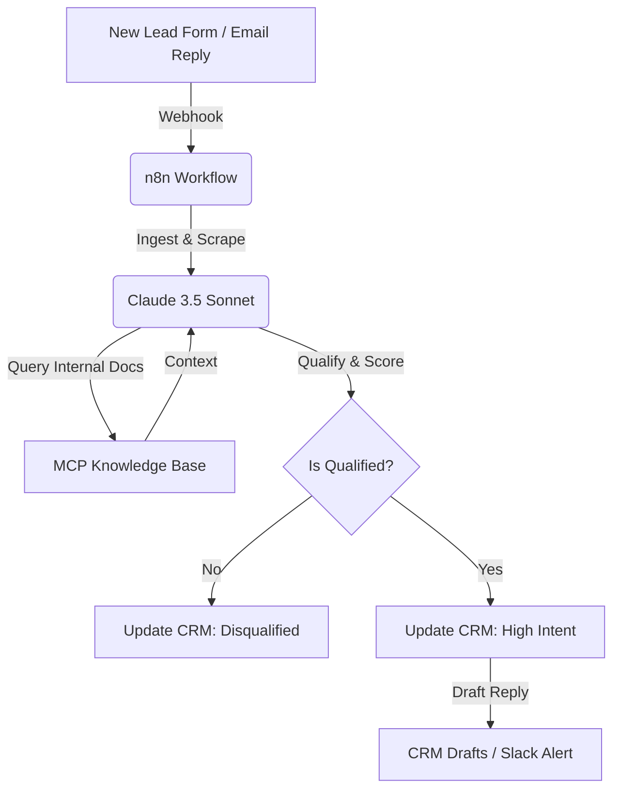

# AI Sales Systems vs Traditional CRM Automation

**Traditional CRM workflows are built on a rigid lie: that every lead fits into a predefined dropdown menu.** We spend months configuring custom fields, validation rules, and lead-scoring models, only for a high-value prospect to write a paragraph in the "Notes" field that completely bypasses our filters. I'm William Spurlock, an AI Solutions Architect and Fractional AI CTO. I build and ship systems that bridge this gap. In my client work, I see companies waste dozens of hours trying to force unstructured human intent into static database columns. The shift in 2026 is clear: traditional CRM automation is excellent at keeping records, but it is entirely blind to context. To build a pipeline that books calls while you sleep, you need to layer an AI reasoning system on top of your CRM.

If you are evaluating how to scale your sales operations, these are the exact architectural decisions you should discuss. In fact, when hiring external help, these are the core [questions to ask an AI solutions architect](/blog/questions-to-ask-an-ai-solutions-architect-before-you-hire) before signing a contract. Ripping out your CRM is a mistake; ignoring the reasoning layer is an even bigger one. This post breaks down how rules-based CRM workflows compare to agentic AI sales systems, where each wins, and how to build a hybrid architecture that gives you the best of both.

---

## How do AI sales systems differ from traditional CRM automation?

**Traditional CRM automation executes deterministic if-this-then-that rules on structured database fields, whereas AI sales systems add a reasoning layer that reads unstructured signals to score, route, and personalize.** A standard CRM like HubSpot or Salesforce is a passive database that waits for structured data. It can send an email if a checkbox is ticked, but it cannot read an email to understand why a prospect is hesitant.

Traditional systems rely on relational database schemas. They require every piece of information to be clean, categorized, and pre-sorted. If a lead leaves a critical detail in a free-text field, the automation engine ignores it because it cannot process unstructured strings. This architectural limitation forces sales teams to spend hours manually reviewing records to find the actual opportunities.

AI sales systems, powered by large language models like Claude 3.5 Sonnet, operate probabilistically. They read open-text replies, analyze website behavior, and evaluate context to make decisions. Instead of running on rigid code, they run on prompts and tools. This lets them handle the messy, unstructured ways that humans actually communicate during a sales cycle.

### The Limitations of Relational Logic in Sales Ops

Relational databases are built for storage, not comprehension. When a prospect fills out a contact form, they are forced to select options from dropdown menus that rarely capture their actual situation. If they select "Other" and write a detailed explanation of their needs in the text area, traditional CRM automation is completely blind to that text. It cannot run a regex that captures every possible variation of business intent.

AI sales systems solve this by converting text into high-dimensional vectors or feeding it directly to reasoning models. The model reads the text, extracts the semantic meaning, and maps it to your sales criteria. This means you no longer need to build hundreds of custom fields and validation rules to handle every edge case. The reasoning layer handles the edge cases naturally.

| Dimension | Traditional CRM Automation | AI Sales Systems |
| :--- | :--- | :--- |
| **Core Mechanism** | Deterministic rules (If-This-Then-That) | Probabilistic reasoning (LLMs) |
| **Input Data Type** | Structured fields (dropdowns, checkboxes) | Unstructured text (emails, call notes, bios) |
| **Adaptability** | Rigid; breaks when inputs deviate | Flexible; handles typos, slang, and context |
| **Setup Overhead** | High configuration; custom fields per rule | Low configuration; natural language prompts |
| **Failure Mode** | Silent skip or hard error | Hallucination (mitigated by guardrails) |
| **Primary Value** | System of record and database hygiene | Insight extraction and adaptive execution |

---

## How each qualifies a lead (field rules vs signal reasoning)

**CRM qualification relies on mandatory form fields and static email domains, while AI qualification reads unstructured signals like open-text replies, LinkedIn bios, and website behavior to assess actual buying intent.** Traditional CRM setups use strict rules: if the email domain is Gmail, or if the "Company Size" field is under 50, the lead is disqualified. This is a blunt instrument that throws away high-value opportunities.

Consider three common scenarios where traditional CRM qualification fails:
1. **The stealth-mode startup** — A founder uses a personal Gmail address and writes "1-10 employees" because they are operating in stealth, but they have just secured $10M in funding and need immediate enterprise-grade services.
2. **The corporate spin-off** — An executive from a Fortune 500 company uses a temporary domain to research vendors for a new subsidiary, failing the CRM's domain-authority check.
3. **The high-growth transition** — A company currently has 15 employees but is scaling to 150 over the next quarter, which means their current needs match those of an enterprise buyer.

An AI sales system reads the entire contact form submission. If a founder writes, "We have 10 employees but just raised a $5M seed round and need to scale our team to 100 next month," the AI recognizes the high-growth signal. It combs through the unstructured text, identifies the funding context, and qualifies the lead. It does this by evaluating the intent behind the words, not just matching strings in a database.

I build these qualification steps using the Model Context Protocol (MCP) to connect LLMs directly to external data sources. Below is the JSON schema for an MCP tool that qualifies lead intent by reading raw incoming messages and company context.

```json
{
  "name": "qualify_lead_intent",
  "description": "Analyzes unstructured lead signals to determine qualification status and buying intent.",
  "inputSchema": {
    "type": "object",
    "properties": {
      "raw_message": {
        "type": "string",
        "description": "The open-text message or email reply from the lead."
      },
      "company_context": {
        "type": "string",
        "description": "Scraped context about the lead's company, such as LinkedIn bios or site descriptions."
      }
    },
    "required": [
      "raw_message"
    ]
  }
}
```

### The Qualification Prompt Template

To make this qualification process reliable, I use a highly structured system prompt in the reasoning node. This prompt forces the model to act as an expert sales operations analyst, extracting specific intent markers while ignoring the noise:

```markdown
You are an expert Sales Operations Analyst. Analyze the incoming lead details and determine if they match our Ideal Customer Profile (ICP).

ICP Criteria:
- B2B companies looking for AI automation or premium full-stack web development.
- Must show signs of budget (e.g. recent funding, scaling team, complex requirements).
- Must have a clear, addressable business problem.

Analyze the following inputs:
Lead Message: {raw_message}
Company Context: {company_context}

Output your analysis in the following JSON format:
{
  "is_qualified": true/false,
  "confidence_score": 1-100,
  "reasoning_summary": "Concise explanation of your decision",
  "estimated_urgency": "Low/Medium/High/Urgent",
  "suggested_next_step": "Specific sales action"
}
```

### Case Study: Qualifying Stealth Startups with Claude

Let's walk through how this qualification prompt handles a real stealth startup lead. Suppose a prospect submits the following form:
- **Email:** `stealthfounder99@gmail.com`
- **Company Size:** `1-10`
- **Message:** "We are building an AI-driven logistics platform. Currently operating in stealth but we just closed our seed round from top-tier VCs. We need to build a premium web experience and automate our customer onboarding pipeline before our public launch next month. Looking for a partner who can start immediately."

A traditional CRM rule looking for a corporate email domain and a company size greater than 50 would instantly mark this lead as "Disqualified" and archive it. 

When passed to Claude 3.5 Sonnet through our n8n qualification node, the model generates the following structured JSON response:

```json
{
  "is_qualified": true,
  "confidence_score": 95,
  "reasoning_summary": "Prospect is a stealth-mode startup with recent seed funding from top-tier VCs. They have high-value needs (premium web experience and onboarding automation) and a tight timeline (launch next month). Personal email and small team size are expected for stealth operations and should be ignored.",
  "estimated_urgency": "Urgent",
  "suggested_next_step": "Instantly route to William Spurlock for a discovery call booking link."
}
```

This structured reasoning is then written back to HubSpot, allowing the sales team to act on a high-value lead that would have otherwise been lost in the archive.

---

## How each nurtures (drip sequences vs adaptive, context-aware follow-ups)

**Traditional CRM nurture fires static drip sequences on fixed time delays, whereas AI sales systems generate adaptive, context-aware follow-ups based on the lead's specific replies and objections.** CRM drip campaigns are completely linear. A lead receives Email 1 on Day 1, Email 2 on Day 3, and Email 3 on Day 7. If the lead replies on Day 2 with a highly specific technical question, the CRM does not adapt. It simply sends the generic Day 3 template anyway, making your brand look automated and disconnected.

This linear approach has a negative psychological impact on prospects. It signals that you are not listening to them, that they are just a record in a database, and that your sales process is completely automated. This leads to high unsubscribe rates and lower overall conversion.

AI sales systems break this linear pattern. When a lead replies with an objection—such as "We use a custom PostgreSQL setup and need to ensure SOC2 compliance"—the AI pauses the generic sequence. It reads the objection, queries your internal documentation, and drafts a custom reply addressing PostgreSQL and SOC2. It then writes this draft directly into your CRM or sends it to a Slack channel for approval.

This context-aware follow-up ensures that the lead receives a helpful, timely response. It treats the prospect as an individual, answering their exact questions instead of pushing them through a generic marketing funnel.

### Objection Handling and Retrieval-Augmented Generation (RAG)

In production, I wire n8n workflows to a vector database containing the client's technical documentation, security policies, and case studies. When a lead replies with a technical question or objection, the workflow converts the reply into an embedding, queries the vector database to retrieve the relevant paragraphs, and passes those facts to Claude 3.5 Sonnet.

This ensures that the drafted email is technically accurate and matches your official company positions. The AI is not guessing or hallucinating; it is retrieving verified facts and synthesizing them into a natural, conversational response.

To maintain context across multiple interactions, the AI system stores the conversation history in a structured format. Below is a JSON representation of how an active email thread is tracked and passed to the LLM to generate the next adaptive response:

```json
{
  "thread_id": "thread_984210",
  "lead_id": "contact_55102",
  "messages": [
    {
      "sender": "sales_agent",
      "timestamp": "2026-07-05T10:00:00Z",
      "body": "Hi Sarah, I saw your team is scaling your customer support operations. Have you considered using AI agents to handle common inquiries?"
    },
    {
      "sender": "lead",
      "timestamp": "2026-07-06T14:22:00Z",
      "body": "We are interested, but we have strict data privacy requirements. Do you support self-hosting or on-premise deployments?"
    }
  ],
  "context_tags": [
    "data_privacy",
    "self_hosting",
    "on_premise"
  ]
}
```

---

## How each routes and prioritizes (static scoring vs adaptive intent scoring)

**CRM routing uses static lead scoring based on arbitrary point values, while AI routing dynamically prioritizes leads by analyzing real-time intent signals and conversation sentiment.** Traditional lead scoring is a guessing game. You assign 10 points for a PDF download, 5 points for a pricing page visit, and 20 points for a webinar registration. A student researching a thesis can easily score 100 points, triggering an urgent sales alert, while a busy executive who visits once and sends a direct email gets ignored.

This arbitrary math leads to massive sales team fatigue. Sales representatives stop trusting "Marketing Qualified Leads" (MQLs) because they spend half their day calling students, researchers, or low-intent tire-kickers who happened to download a few whitepapers.

AI routing ignores arbitrary point systems. It reads the actual incoming communication to detect urgency, authority, and budget signals. If a lead emails, "We need to solve this problem by Friday because our current vendor is shutting down," the AI detects the extreme urgency. It immediately bypasses standard queues and routes the lead to an active Account Executive.

### Sentiment Analysis and Urgency Detection

By analyzing the semantic tone of incoming replies, the AI reasoning layer can categorize leads into four distinct priority tiers:
- **Urgent** — Immediate pain point, active buying window, explicit timeline ("We need this by Friday"). Routes to Slack for instant sales rep takeover.
- **High** — Strong interest, matches ICP, clear budget indicators. Creates a high-priority task in the CRM.
- **Medium** — General interest, matches some ICP criteria, but has no immediate timeline. Enters an adaptive email nurture sequence.
- **Low** — Low intent, student, job seeker, or out-of-scope request. Logged in the CRM but filtered out of active sales queues.

This adaptive prioritization is how I build systems that convert raw traffic into qualified meetings. By routing high-intent leads to immediate human follow-up, I've helped clients build a [lead generation pipeline that books discovery calls](/blog/lead-gen-pipeline-47-discovery-calls) without wasting sales reps' time on low-intent tire-kickers.

---

## Personalization: templates vs generated-per-lead

**CRM personalization swaps simple merge tags like `{{first_name}}` into static templates, whereas AI personalization generates custom outreach tailored to the lead's specific company news, recent posts, and pain points.** We have all received emails that say, "Hi William, I saw you work at williamspurlock.com and wanted to reach out." It is lazy, obvious, and immediately gets marked as spam.

AI personalization goes beyond basic merge tags. By using scraping tools like Firecrawl, an AI sales agent can read a prospect's recent LinkedIn posts, review their company's latest press releases, and identify their actual business focus. It then uses Claude 3.5 Sonnet to write a custom opening line that connects your service directly to their current initiatives.

For example, if a prospect recently posted about the challenges of migrating their database to the cloud, the AI can reference that exact post and explain how your team handles cloud migrations. This level of personalization is impossible with traditional CRM templates.

### Hyper-Personalization at Scale

The workflow I deploy for clients follows a structured scraping and generation sequence:
1. **Trigger** — A new lead is created in HubSpot.
2. **Scrape** — Firecrawl scrapes the lead's company homepage and extracts the main text content, converting it to clean markdown.
3. **Analyze** — Claude reads the markdown to identify the company's core value proposition, target audience, and recent announcements.
4. **Draft** — Claude drafts a custom email opening line that references a specific detail from the scraped content, linking it naturally to the client's service.
5. **Sync** — The custom opening line is written back to a HubSpot field, ready to be merged into a highly personalized outreach template.

When you combine web scraping with LLM reasoning, you get an outreach engine that scales without feeling robotic. This is the core of the [AI-powered lead generation stack](/blog/ai-powered-lead-generation-the-automation-stack-that-books-calls-while-you-sleep) that operates 24/7, crafting hyper-personalized messages that read like they were written by a dedicated researcher.

---

## Where traditional CRM automation still wins (determinism, compliance, auditability)

**Traditional CRM automation remains superior for deterministic tasks like updating lifecycle stages, syncing billing records, and enforcing strict compliance rules where hallucination is unacceptable.** While AI is incredible for reasoning, you do not want a probabilistic model deciding whether an invoice is marked as paid. You need absolute certainty for operational and financial data.

CRM workflows excel at these exact tasks. They are fast, reliable, and completely auditable. If a customer clicks "Unsubscribe," a deterministic CRM workflow must instantly update their opt-out status across all tables to comply with CAN-SPAM and GDPR regulations. Leaving this to an AI prompt is a massive compliance risk.

Furthermore, traditional CRM automation is highly auditable. You can look at a workflow history and see exactly why a contact was updated, which rule was triggered, and when the action occurred. This level of traceability is essential for legal compliance and operational troubleshooting.

The rule of thumb is simple: if a task has a single, binary, correct answer, use traditional CRM automation. If a task requires reading, writing, or evaluating human language, use an AI sales system.

### GDPR and CAN-SPAM Compliance in the Age of AI

When deploying AI sales agents, compliance is the first thing I audit. Under GDPR and CAN-SPAM, you must provide a clear, deterministic way for users to opt out of communication. If a user replies "Stop emailing me," an AI model might interpret that correctly, but you cannot risk a minor prompt variance failing to update the database.

The architecture I build forces a deterministic safety check:
- **Keyword Filters** — If an incoming email contains words like "unsubscribe," "stop," or "remove," a hard-coded regex filter instantly runs before the email ever reaches the LLM.
- **Opt-Out Sync** — The contact's `Unsubscribed` field is set to `true` via a direct database write, and their record is added to a global suppression list.
- **Asynchronous Safeguards** — The n8n workflow verifies the contact's subscription status immediately before calling any email-sending node, ensuring that no email can be sent to an unsubscribed contact, regardless of what the LLM drafts.

---

## The hybrid architecture I actually ship (CRM as system of record + AI reasoning layer via n8n + MCP)

**The most reliable sales stack uses your CRM as the deterministic system of record and n8n + MCP as the asynchronous AI reasoning layer running on top.** You do not need to throw away HubSpot or Salesforce. Ripping out a CRM is expensive, disruptive, and unnecessary. Instead, you keep the CRM as your single source of truth and build an external reasoning loop.

I build this loop using n8n as the workflow engine. When a lead is created in the CRM, HubSpot fires a webhook to n8n. The n8n workflow uses Claude 3.5 Sonnet to qualify the lead, scrape their website, and draft a personalized response. The AI then writes this data back to custom fields in HubSpot.

This architecture keeps your database clean, ensures compliance, and adds a powerful reasoning layer without changing your sales team's daily habits. They still work inside HubSpot, but they are now supported by an automated AI assistant.



To illustrate how this works in production, here is a clean JSON configuration block for an n8n AI Agent node. This node is configured to use Claude 3.5 Sonnet to process incoming lead data and determine the next sales step.

```json
{
  "parameters": {
    "model": "claude-3-5-sonnet-latest",
    "prompt": "You are an AI sales assistant. Analyze the incoming lead data and qualify them based on our ICP. If qualified, draft a personalized response using the context from our internal knowledge base.",
    "options": {
      "temperature": 0.2,
      "maxTokens": 1000
    }
  },
  "type": "@n8n/n8n-nodes-langchain.agent",
  "typeVersion": 1,
  "position": [
    250,
    300
  ]
}
```

### Designing Custom MCP Tools for CRM Integration

To let Claude interact with your CRM, we register custom MCP servers that expose specific database actions as tools. Below is the JSON schema for an MCP tool that updates a lead's qualification status and writes the AI's reasoning back to HubSpot:

```json
{
  "name": "update_crm_lead",
  "description": "Updates custom AI fields on a HubSpot contact record.",
  "inputSchema": {
    "type": "object",
    "properties": {
      "contact_id": {
        "type": "string",
        "description": "The unique HubSpot contact ID."
      },
      "ai_qualification_status": {
        "type": "string",
        "enum": ["Qualified", "Disqualified", "Needs Review"],
        "description": "The qualification status determined by the AI."
      },
      "ai_reasoning_summary": {
        "type": "string",
        "description": "The detailed explanation of the AI's qualification decision."
      }
    },
    "required": [
      "contact_id",
      "ai_qualification_status",
      "ai_reasoning_summary"
    ]
  }
}
```

---

## Cost and reliability tradeoffs (LLM cost per lead, guardrails, human-in-the-loop)

**AI sales systems introduce variable API costs and hallucination risks that require strict token budgets, prompt guardrails, and human-in-the-loop approvals for high-stakes emails.** Traditional CRM workflows have a fixed monthly cost. AI sales systems, however, incur API charges for every run.

A typical qualification and scraping run using Claude 3.5 Sonnet costs between $0.02 and $0.15 per lead, depending on the size of the scraped context. While this is incredibly cheap compared to hiring a full-time Sales Development Representative (SDR), you must set strict token limits in n8n to prevent runaway loops from draining your budget.

| Expense Category | Provider / Tool | Cost per Unit / Run | Monthly Estimate (1,000 Leads) |
| :--- | :--- | :--- | :--- |
| **LLM Inference** | Claude 3.5 Sonnet | $0.03 - $0.08 per run | $30.00 - $80.00 |
| **Web Scraping** | Firecrawl API | $0.01 per page | $10.00 |
| **Workflow Hosting** | n8n Cloud (or Self-Hosted) | $20.00/mo flat (or free) | $20.00 |
| **Total Variable Cost** | **Combined Stack** | **$0.04 - $0.10 per lead** | **$60.00 - $110.00** |

Reliability is the other major tradeoff. An LLM can hallucinate facts or misinterpret a prospect's tone. To mitigate this risk, I never recommend letting an AI send emails directly to high-value prospects without human review. Instead, use the "human-in-the-loop" pattern: the AI drafts the email and saves it as a draft in HubSpot, and a human sales rep reviews and clicks "Send."

### ROI and Payback Period of AI Sales Systems

When evaluating the cost of an AI sales system, compare it to the cost of manual labor. A typical junior SDR salary is around $4,000 to $6,000 per month. That SDR can manually qualify, scrape, and draft emails for roughly 200 to 300 leads per week. 

An AI sales system running on n8n and Claude can handle 1,000 leads per month for less than $110 in variable API costs. The system operates 24/7, responds to leads in under 5 minutes, and never forgets to follow up. The payback period for the initial setup cost is typically under 30 days, as it instantly frees up your senior sales reps to focus entirely on closing deals rather than chasing cold leads.

### Token Optimization Strategies

To keep your variable API costs low, I implement several token optimization strategies in the n8n workflows:
- **Prompt Caching** — By structuring system prompts so they remain static across calls, we take advantage of Anthropic's prompt caching, which cuts input token costs by up to 90%.
- **Context Truncation** — Instead of passing an entire scraped webpage to the LLM, we use n8n code nodes to strip out HTML tags, scripts, and navigation menus, leaving only the raw, substantive text.
- **Model Routing** — We use Claude 3.5 Sonnet for the final email drafting and complex qualification reasoning, but route simpler tasks (like initial text cleaning or language detection) to cheaper models like Gemini 3.5 Flash.

---

## How to add AI to an existing CRM without ripping it out

**You can add AI to your existing CRM in under a week by setting up n8n webhooks that trigger on new lead creation, run qualification prompts, and write the reasoning back to custom CRM fields.** You do not need a massive development budget or a three-month timeline to start using AI sales automation.

The implementation path is straightforward and follows four distinct steps:

### Step 1: Create Custom Fields in Your CRM
Add the following custom properties to your contact or lead objects in HubSpot or Salesforce:
- `AI Qualification Status` (Dropdown: Qualified, Disqualified, Needs Review)
- `AI Qualification Summary` (Multi-line text)
- `AI Intent Score` (Number: 1-100)
- `AI Suggested Next Step` (Single-line text)
- `AI Draft Reply` (Multi-line text)

### Step 2: Configure a CRM Webhook
Set up a workflow in your CRM that triggers whenever a new lead is created or a new email reply is received from an active prospect. Configure this workflow to send a POST request containing the lead's email, name, company name, and raw message to your n8n webhook URL.

### Step 3: Build the n8n Reasoning Workflow
In n8n, set up a Webhook node to receive the CRM data. Connect it to a Firecrawl node to scrape the lead's company website. Pass both the lead data and the scraped markdown context to a Claude 3.5 Sonnet node running the qualification prompt. Use LangChain parser nodes to ensure the output is returned as structured JSON.

### Step 4: Write the Data Back to the CRM
Connect the output of the Claude node to a HubSpot or Salesforce API node. Map the JSON properties from the Claude response to the custom CRM fields you created in Step 1. If the lead is marked as "Urgent," add an adjacent node to send an instant notification to your sales team's Slack channel with a link to the CRM record.

### Handling Rate Limits and API Failures in n8n

When building these workflows, you must also design for resiliency. If the CRM API goes down or rate limits your requests, n8n's native retry logic can automatically pause and retry the execution after a few minutes, ensuring that no lead data is lost. This is a critical safety net when dealing with high-volume pipelines where API rate limits are common.

---

## Frequently Asked Questions

### Do AI sales systems replace my CRM?
**AI sales systems do not replace your CRM; they run on top of it as a reasoning layer.** Your CRM remains the essential system of record for storing contact data, tracking deals, and managing pipelines. The AI system simply reads from and writes to the CRM, handling the unstructured tasks like qualification, scraping, and drafting replies while leaving the database management to HubSpot or Salesforce.

### Can AI qualify leads better than lead-scoring rules?
**Yes, AI qualifies leads far more accurately because it reads unstructured text and evaluates context rather than just matching static fields.** While CRM rules might disqualify a lead with a Gmail address or a small team, an AI sales agent can read their open-text message to identify funding, urgency, and growth plans. This prevents you from throwing away high-value opportunities that do not fit into rigid dropdown menus.

### Is AI lead nurture worth the API cost?
**Yes, AI lead nurture is highly cost-effective, costing only pennies per lead compared to the manual hours spent by human sales reps.** A typical qualification and drafting run using Claude 3.5 Sonnet costs between $0.02 and $0.15. This minor variable cost is easily offset by the increased conversion rates and the hours saved for your sales team.

### What CRMs work with AI sales automation?
**Any CRM with a modern API and webhook support works with AI sales automation, including HubSpot, Salesforce, Pipedrive, and Zoho.** Because we use n8n as the workflow engine, we can connect to virtually any CRM database. The CRM simply fires webhooks to trigger the AI loop and accepts API writes to update records with the AI's reasoning.

### How do I stop an AI sales agent from emailing the wrong thing?
**You stop AI errors by implementing strict system prompts, output schema validation, and human-in-the-loop approval steps.** For high-stakes sales outreach, the AI should never send emails directly. Instead, configure the system to write drafts into your CRM or send them to a Slack channel, allowing a human sales rep to review and approve every message before it goes out.

### Do I need n8n for an AI sales system?
**While you can use other middleware, n8n is the best workflow platform for AI sales systems because of its native LangChain nodes, self-hosting options, and robust error handling.** It allows you to build complex agentic loops with Claude 3.5 Sonnet and MCP tools without writing hundreds of lines of custom code. This makes your automation stack easier to maintain and scale over time.

### Is AI sales automation only for big companies?
**No, AI sales automation is highly beneficial for small teams and solo founders because it lets them compete with enterprise sales departments without hiring a large SDR team.** A single founder using an n8n and Claude pipeline can qualify, scrape, and draft personalized follow-ups for hundreds of leads a week. This keeps the pipeline active 24/7 while the founder focuses on delivering client work.

### How fast can I add AI to my existing sales workflow?
**You can add a basic AI qualification and drafting loop to your existing CRM in under a week using n8n and custom CRM fields.** You do not need to rebuild your database or change your team's daily habits. By starting with a simple webhook-to-draft workflow, you can see immediate time savings and value without disrupting your current sales operations.

---

## Get your sales pipeline running on reasoning

If your sales team is drowning in manual data entry or losing high-value leads to rigid CRM rules, it is time to upgrade your stack. I build custom AI sales systems and run end-to-end automation audits for business owners who need to scale their pipeline without hiring a massive SDR team.

**Book an AI automation strategy call** and we will map out your current sales workflow, identify the bottlenecks in your CRM, and design a hybrid n8n and Claude architecture that qualifies and nurtures your leads automatically. Whether you need to add custom AI qualification fields to HubSpot or build a fully automated personalization engine from scratch, I ship production-ready systems that book discovery calls while you sleep.
