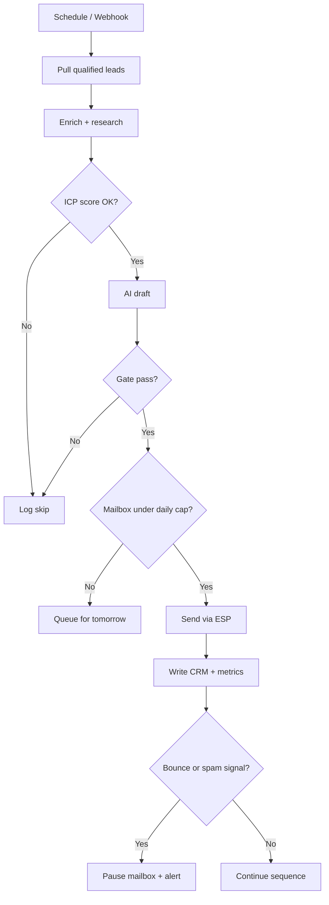

# How to Automate Your Cold Outreach Without Getting Your Domain Burned

**You can automate cold outreach with AI and still keep your domain healthy — but only if personalization, warming, and send volume are treated as one system, not three separate tools.**

Most founders burn their domain the same way: they wire a CRM to a blast tool, paste a "personalized" template that swaps first names, and hit 200 sends on day one from `you@yourbrand.com`. Inbox providers notice. Spam folders fill. Reply rates collapse. Then the primary domain that also carries invoices and client threads is radioactive for months.

I have built outbound systems for agencies, SaaS teams, and solo operators who needed volume without torching reputation. The pattern that works in mid-2026 is boring on purpose: separate sending domains, slow warming curves, AI that writes from real research (not synonym spam), and automation runners like n8n or Make that enforce caps, pauses, and human review gates.

If you want the broader lead-gen architecture this sits inside, start with [AI-powered lead generation: the automation stack that books calls while you sleep](/blog/ai-powered-lead-generation-the-automation-stack-that-books-calls-while-you-sleep). This post is the deliverability and personalization layer — the part that decides whether that stack lands in Primary or Spam.

---

## What is AI-powered personalization in email marketing?

**AI-powered personalization in email marketing is using a model to rewrite each message from prospect-specific signals — company news, role, recent posts, tech stack, or site copy — so the email only makes sense for that recipient, not a list of 500 lookalikes.**

That is different from merge tags. `{FirstName}` and `{Company}` are mail-merge. AI personalization is a draft that references a specific hiring post, a product launch, a funding note, or a broken checkout flow — then ties that observation to one clear ask.

For cold outreach, the distinction matters for two reasons:

1. **Relevance drives replies.** Generic templates get ignored or marked spam. Specific observations get replies.
2. **Spam filters punish sameness.** When thousands of messages share the same structure, subject patterns, and link layout, providers treat them as bulk. Varied, researched copy is harder to cluster as spam — when volume and authentication are also correct.

### What "AI personalization" actually looks like in a workflow

A production pattern I ship looks like this:

| Step | Tooling | Output |
|------|---------|--------|
| 1. Pull prospect row | Apollo / Clay / CRM | Name, title, company, LinkedIn URL, domain |
| 2. Enrich | Clay / Firecrawl / web search API | Recent posts, news, tech signals, site snippets |
| 3. Qualify | Rules + model score | ICP fit 0–100; skip if below threshold |
| 4. Draft | Claude Sonnet 5 or GPT-5.5 | 90–140 word email + subject variants |
| 5. Gate | Human or strict rules | Reject if no specific fact, banned phrases, or weak CTA |
| 6. Send | Instantly / Smartlead / SMTP via n8n | Cap per mailbox per day; track opens/replies |

The model is not "the outreach tool." The model is the writer inside a controlled pipeline. That is closer to [what AI automation actually means for business owners](/blog/what-is-ai-automation-a-plain-english-guide-for-business-owners) than to buying another Chrome extension.

### Personalization signals that help deliverability (and ones that hurt)

**Signals worth feeding the model:**

- A concrete change: new role, new product page, new office, new hiring burst
- A public post or podcast quote you can reference in one sentence
- A clear problem on their site (broken form, outdated pricing, missing FAQ schema)
- Mutual context: shared event, shared customer segment, shared tool stack

**Signals that look smart and still get you burned:**

- Fake intimacy ("Loved your post last Tuesday!" when you never read it)
- Over-scraped personal life details that feel invasive
- Long AI essays that read like LinkedIn carousels pasted into email
- Identical "personalization" across 50 people at the same company

Spam filters do not grade creativity. They grade patterns: identical HTML, identical link domains, identical send times, identical opening lines across thousands of recipients. AI that invents variety without inventing facts is the goal.

### Mid-2026 models I use for outreach drafts

| Job | Model | Why |
|-----|-------|-----|
| Fast draft at volume | Claude Sonnet 5 or Gemini 3.5 Flash | Cheap, strong instruction following, good at short copy |
| Harder research synthesis | Claude Opus 4.8 or Gemini 3.1 Pro | Better at compressing messy enrichment into one sharp hook |
| Alternate voice / A-B | GPT-5.5 or GPT-5.4 mini | Useful second pass when you want a different cadence |

I keep prompts short and strict: one observation, one proof of relevance, one ask, under 140 words, no buzzword filler, no fake compliments. The model writes. The automation enforces structure. You own reputation.

### A prompt pattern that stays out of spam-adjacent mush

```text
You write cold B2B email. Use ONLY facts in RESEARCH_JSON.
If RESEARCH_JSON has no specific, recent, public fact, return SKIP.
Constraints:
- 90-140 words
- One observation tied to their company or role
- One clear CTA (15-min call or reply with one answer)
- No flattery, no "I hope this finds you well", no hype adjectives
- Plain text friendly; no HTML; one optional URL max
Return JSON: { "subject": "...", "body": "...", "skip": false }
```

If the model returns `skip`, the workflow does not send. That single rule prevents more domain damage than any warming tool.

---

## How do I automate cold outreach using AI without it feeling spammy?

**You automate cold outreach without the spam feel by separating sending identity from brand identity, warming mailboxes for weeks, capping daily volume, and letting AI write only when enrichment produces a real hook — with humans or hard gates before send.**

Spammy is not "automated." Spammy is identical messages, bad authentication, burned IPs, purchased lists, and volume that outruns trust. Automation can be the thing that *prevents* spammy behavior if you encode the rules.

### Rule 1 — Never send cold volume from your primary domain

Use a secondary domain for outbound:

- Brand: `acme.com` (site, invoices, clients)
- Outbound: `tryacme.com` / `getacme.com` / `acmehq.com` (cold only)

Point SPF, DKIM, and DMARC correctly. Warm for 2–4 weeks before real campaigns. Mirror brand look carefully enough that replies feel legitimate, but keep technical reputation isolated.

When primary domains get burned, recovery is slow and expensive. Secondary domains are disposable insurance. I treat that as non-negotiable infrastructure, not a nice-to-have.

### Rule 2 — Warm before you scale

Warming is not "send 50 emails and hope." It is a measured ramp with engagement:

| Week | Daily sends / mailbox | Goal |
|------|------------------------|------|
| 1 | 5–15 | Establish positive history |
| 2 | 15–30 | Steady opens/replies from real threads |
| 3 | 30–40 | Introduce light outbound mix |
| 4+ | 40–60 (hard ceiling for most B2B) | Campaign volume with monitoring |

If bounce rate spikes above ~3%, stop. If spam complaints appear, stop. If inbox placement drops in seed tests, cut volume and fix copy or list quality before adding mailboxes.

n8n or Make should own the ramp: a schedule node + per-mailbox counters + a kill switch when metrics break thresholds. That is the same discipline I use when [connecting n8n to CRM, email, and website tooling](/blog/how-to-connect-n8n-to-your-crm-email-and-website-in-under-an-hour) — the runner is the control plane.

### Rule 3 — Personalization must be gated, not assumed

Automation without a quality gate is how you get 10,000 "Saw you're hiring SDRs…" emails that ignore the fact they hired last year.

Minimum gate checklist before send:

- [ ] Enrichment returned at least one dated, public fact
- [ ] Model draft references that fact explicitly
- [ ] Subject line is unique enough across the batch (not one template + name)
- [ ] Body under ~140 words
- [ ] One CTA only
- [ ] No attachment on first touch
- [ ] Tracking links minimized (or plain text for first touch)

I often route a sample of drafts to Slack for human spot-check in week one. After the prompt stabilizes, full auto is fine for qualified rows — with the skip path still live.

### Rule 4 — Sequence like a human, not like a drip machine

A cold sequence that protects reputation:

1. **Day 0** — Short, specific, no links or soft one-link max
2. **Day 3** — Bump with a new angle (not "just checking in")
3. **Day 7** — Value add: one useful observation or resource, still short
4. **Day 14** — Breakup email; then stop

Four touches max for most B2B. More touches without replies trains spam filters that your domain sends unwanted mail. Automation should cancel remaining steps on reply, unsubscribe, or bounce.

### Rule 5 — Choose the runner for the control you need

| Need | Prefer | Why |
|------|--------|-----|
| Complex branching, caps, self-host | n8n | Full control, custom logic, cheaper at volume |
| Visual ops for marketing teams | Make.com | Fast to ship, strong SaaS connectors |
| Simple CRM triggers only | Zapier still appears | Fine for light ops; weaker for outbound control |

For a deeper tool comparison, see [n8n vs Make vs Zapier in 2026](/blog/n8n-vs-make-vs-zapier-in-2026-which-automation-tool-is-right-for-your-business) and [whether Zapier is still worth using](/blog/is-zapier-still-worth-using-in-2026-honest-comparison-with-n8n-and-make). Outbound deliverability favors the tool that lets you enforce limits, not the tool with the prettiest template gallery.

### Example n8n pattern (conceptual)



The "feeling human" part is mostly: specific facts, short copy, sane volume, and stop rules. AI helps with the facts and copy. Automation helps with the stop rules. Neither replaces list quality.

### List quality still beats clever prompts

AI cannot save a bad list. Bought lists, scraped emails without verification, and role accounts (`info@`, `support@`) destroy reputation faster than any model can fix.

Before automation:

1. Verify emails (ZeroBounce, NeverBounce, or ESP verification)
2. Remove catch-alls when possible for first campaigns
3. Exclude recent unsubscribes and known complainers
4. Segment by ICP so the model has a coherent angle

If you are still mapping which sales and marketing processes deserve automation first, [this 2026 process guide](/blog/what-business-processes-can-you-actually-automate-with-ai-in-2026) is a useful filter.

---

## Can AI write and send my weekly newsletter automatically?

**Yes — AI can draft and help schedule a weekly newsletter — but blasting a newsletter from the same domain and mailbox pool you use for cold outreach is how you confuse reputation signals and slow-warm gains.**

Newsletters and cold outbound are different products in the eyes of inbox providers:

| Signal | Newsletter | Cold outreach |
|--------|------------|---------------|
| Consent | Explicit opt-in | No prior relationship |
| Volume | Spiky weekly batch | Steady daily drip |
| Content | Longer, branded, multi-link | Short, 1 CTA, plain |
| Expected engagement | Opens from known list | Low open/reply rates by nature |
| Domain strategy | Primary brand domain often fine | Secondary domain strongly preferred |

Mixing them on one domain is not automatically fatal, but mixing cold volume into a brand domain that also sends product email is how founders wake up with client mail in spam.

### Warming vs blast: treat them as opposite modes

**Warming mode**

- Low volume
- High intended engagement (real conversations, seed inboxes that reply)
- Gradual ramp
- Goal: build trust with providers

**Blast mode (newsletter)**

- High volume in a short window
- Engagement depends on list health and content quality
- Goal: inform and retain, not create first contact

If AI writes your newsletter, keep these rails:

1. **Human approve** the final draft for the first 4–8 weeks (or forever if brand voice matters)
2. **Send from the brand domain**, authenticated, with a dedicated newsletter subdomain or mailbox if volume is high (`news.acme.com` / `hello@acme.com`)
3. **Do not** share the cold-sending IPs/mailboxes with newsletter blasts
4. **Suppress** cold prospects who never opted in — newsletter lists and cold lists stay separate
5. **Monitor** spam rate, unsubscribe rate, and placement; pause if list hygiene slips

### Where AI helps (and where it should not auto-send)

**Safe to automate heavily:**

- Pulling weekly metrics into a brief
- Drafting section outlines from shipped product notes
- Repurposing one long-form post into newsletter sections
- Subject line variants for A/B tests
- Scheduling once a human clicks approve

**Risky to fully auto-send:**

- First newsletter to a cold-scraped list (that is not a newsletter; that is spam with a pretty header)
- Unreviewed claims, pricing, or legal statements
- Anything that could ship a wrong customer story

AI writing + human approve + separate sending identity is the pattern that keeps domains alive. Full auto-send is fine later for mature owned lists with clean history — not for day-one cold.

### Newsletter automation stack that does not fight outbound

A clean split I recommend:

- **Content brain:** CMS / Notion / blog markdown
- **Draft:** Claude Sonnet 5 or Gemini 3.5 Flash via n8n/Make
- **Approve:** Slack button or form
- **Send:** ESP (Customer.io, Beehiiv, ConvertKit, etc.) on brand domain
- **Cold outbound:** Instantly/Smartlead on secondary domains, separate workflows

Same company. Two reputations. Two purposes. That is how you automate both without burning either.

For the conceptual line between "regular automation" and AI-in-the-loop systems, see [the difference between AI automation and regular automation](/blog/the-difference-between-ai-automation-and-regular-automation-and-why-it-matters).

---

## Domain reputation checklist before you turn on volume

**If you skip this checklist, no personalization prompt will save you.**

### Technical authentication

- [ ] SPF includes your ESP/SMTP
- [ ] DKIM signing enabled and passing
- [ ] DMARC at least `p=none` with reporting, then move toward quarantine/reject when ready
- [ ] Custom tracking domain if your ESP requires it
- [ ] Reverse DNS / IP reputation healthy on dedicated IPs (if used)

### Infrastructure split

- [ ] Cold domains separate from primary brand domain
- [ ] 2–5 warmed mailboxes before scaling
- [ ] Per-mailbox daily caps encoded in n8n/Make
- [ ] Bounce and complaint webhooks that auto-pause

### Content and list

- [ ] Verified emails only for first campaigns
- [ ] AI skip path when research is empty
- [ ] Plain-text-first for early cold touches
- [ ] Unsubscribe / reply handling that cancels sequences

### Monitoring

- [ ] Seed inbox tests weekly during ramp
- [ ] Bounce rate, reply rate, and spam complaint rate logged
- [ ] Alert channel (Slack/email) when thresholds break

Treat this like production ops. Outbound is a production system with reputation as the uptime metric.

---

## Practical Make.com and n8n marketing funnel pattern

**A marketing funnel that stays deliverable is: capture → qualify → enrich → AI draft → gated send → CRM update — with cold sends on secondary domains and nurtures on the brand ESP.**

### Make.com shape (marketing-friendly)

1. **Trigger:** New lead in form / Typeform / Webflow
2. **Router:** ICP fit vs not
3. **Enrichment module:** Clearbit/Clay/HTTP
4. **OpenAI/Anthropic module:** Draft only if enrichment keys exist
5. **Filter:** Skip if draft contains banned filler or missing hook
6. **ESP module:** Add to nurture if inbound; queue to Instantly if outbound-approved
7. **CRM:** HubSpot/Pipedrive note + stage move

Make is excellent when your team thinks in scenarios and needs speed. Put hard filters on every path that can send email.

### n8n shape (control-plane friendly)

n8n wins when you need:

- Custom JavaScript for caps and randomization of send windows
- Self-hosted secrets and model calls
- Multi-step research (scrape → summarize → draft → critique)
- Shared error workflows that pause whole campaigns

I often put cold outbound on n8n even when marketing nurture lives in Make. Tool choice follows risk: the channel that can burn a domain gets the stricter runner.

---

## FAQ

### What is the best Make.com or n8n setup for a marketing funnel that includes cold outreach?

**The best setup splits inbound nurture and cold outbound into separate scenarios with separate sending domains.** Use Make or n8n to qualify leads, enrich them, and draft with Claude Sonnet 5 or GPT-5.5, then send cold mail through a dedicated outbound ESP while newsletters and product email stay on the brand ESP. Shared logic (ICP scoring, CRM updates) can live in one workflow; shared mailboxes should not. If you need branching caps and kill switches, prefer n8n; if your team ships marketing ops visually, Make is fine with strict filters.

### What is the best AI LinkedIn outreach tool in 2026?

**There is no single "best" tool — the winning stack is enrichment + AI drafting + a LinkedIn-safe sender with hard daily limits.** Tools in the Expandi / HeyReach / Waalaxy class handle connection volume; Clay or custom scrapers handle research; Claude Sonnet 5 or Gemini 3.5 Flash drafts notes that reference a real post or role change. Automating LinkedIn harder than the platform allows gets accounts restricted faster than email domains get burned. Keep connection requests low, personalize from public activity, and never paste the same AI paragraph to an entire search result page.

### How do I automate content publishing without hurting email deliverability?

**Automate publishing to your CMS and social channels first; keep email sends on a consent-based ESP with its own reputation.** An n8n workflow can take a finished blog post, push to the site, generate social variants, and only then draft a newsletter section for human approval. Do not auto-blast every new post to a cold list. Publishing automation and outbound automation can share a content source; they should not share cold-sending infrastructure. That split keeps domain health intact while still removing manual busywork.

### Can AI repurpose long-form content into social posts for outreach campaigns?

**Yes — AI is strong at turning one long-form post into LinkedIn posts, short threads, and email angles — but those assets should support warm or inbound motions more than raw cold spam.** A solid pattern: Claude Opus 4.8 or Gemini 3.1 Pro compresses the article into 5 social variants; Sonnet 5 or GPT-5.4 mini writes a cold email that cites one concrete idea from the piece as the value add in touch three of a sequence. The email still needs a prospect-specific hook. Repurposed content is the proof; it is not a substitute for research on the recipient.

### How many cold emails per day is safe per mailbox?

**Most B2B teams do well staying under 40–60 cold emails per warmed mailbox per day after a multi-week ramp — and lower is safer while reputation is young.** New domains should start in the single digits and climb only while bounce and complaint rates stay clean. Adding mailboxes scales volume more safely than overloading one inbox. Encode the cap in automation so a campaign cannot "accidentally" send 300 from one address overnight.

### Should I use open tracking and click tracking on cold email?

**For first-touch cold email, plain text with minimal or no tracking usually protects placement better than image pixels and redirect links.** Tracking helps analytics, but many corporate filters treat tracked links as bulk. A practical compromise: plain text on email one, light tracking on later touches once a thread exists, and always measure reply rate as the primary KPI. Opens are noisy in 2026; replies and meetings are not.

### Do I need a human in the loop forever?

**Not forever — but you need a human in the loop until your skip rate, reply rate, and complaint rate prove the system is stable.** Week one: review most drafts. Week two: review samples. Week three: full auto for high-confidence ICP rows with skip-on-weak-research still enabled. Reintroduce review when you change ICP, offer, or model. Reputation is easier to keep than to rebuild.

### What metrics tell me my domain is getting burned?

**Watch bounce rate, spam complaint rate, sudden drops in reply rate, and seed-test inbox placement.** Secondary warnings: ESP warnings, blocks from major providers, and clients reporting your brand mail in spam. If any hard metric spikes, pause outbound first — then fix list, copy, or authentication. Continuing to send "to hit the number" is how a recoverable dip becomes a months-long domain problem.

---

## Build the system once, protect the domain every day

Cold outreach automation is not a prompt contest. It is a reputation system with an AI writer inside it.

Get the boring parts right: secondary domains, warming curves, caps, verified lists, SPF/DKIM/DMARC, and a hard skip when research is empty. Then let Claude Sonnet 5, GPT-5.5, or Gemini 3.5 Flash write short, specific emails that only make sense for that prospect. Use n8n or Make as the control plane that enforces the rules you would follow manually if you had infinite time.

If you want help designing the outbound + deliverability architecture around your CRM and offer — not another generic blast template — book an AI automation strategy call and we will map the stack, the warming plan, and the gates before a single cold email leaves your infrastructure.
