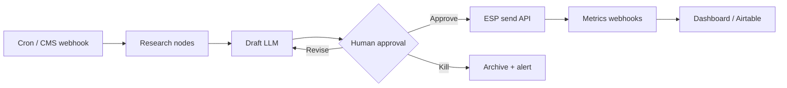

# How to Build an AI-Powered Newsletter That Writes and Sends Itself

**An AI-powered newsletter is a scheduled workflow that pulls sources, drafts copy with a language model, routes the draft through a human approval gate, then pushes a send through your ESP—without you rewriting every issue from scratch.** I've shipped versions of this stack for founders, agencies, and product teams who were stuck in the "Sunday night scramble" of research, drafting, and clicking Send. The goal is not a robot that spam-blasts your list. The goal is a repeatable research → draft → edit → send pipeline you trust enough to leave running on a calendar.

If you are still sorting [what AI automation actually is](/blog/what-is-ai-automation-a-plain-english-guide-for-business-owners) versus click-ops scripts, start there. This post assumes you want the newsletter itself to run—and you want clear places to stop the train before it leaves the station.

---

## What does the architecture of a self-writing newsletter look like?

**A production AI newsletter has five layers: triggers, research agents, draft generation, approval + revision, and ESP delivery—with logging and dead-letter handling on every hop.** Treat it like a product pipeline, not a single prompt in ChatGPT.

Here is the reference architecture I use on client builds:

| Layer | Job | Typical tools (2026) |
| :--- | :--- | :--- |
| **Trigger** | Fire on schedule or "new content ready" | n8n Cron, Make Scenario schedule, webhook from CMS |
| **Research** | Collect links, stats, internal notes | RSS, Firecrawl, Notion/Airtable, search APIs |
| **Draft** | Turn research into issue structure + body | Claude Sonnet 5 (workhorse), Claude Opus 4.8 (flagship edits), GPT-5.5, Gemini 3.5 Flash |
| **Approval** | Human yes / revise / kill | Slack, email reply, Notion status, form webhook |
| **Send** | Segment + deliver | Beehiiv, ConvertKit, Resend, HubSpot Marketing Email |
| **Observe** | Opens, clicks, bounces, model spend | ESP webhooks → warehouse or Airtable |



Two opinions I hold after shipping these:

1. **n8n wins when the newsletter runs weekly or more and touches AI loops.** Self-hosting (or n8n Cloud with sensible concurrency) avoids the "ops tax" that shows up on Make/Zapier once you add research, scoring, and revision loops. For a deeper tool pick, see [n8n vs Make vs Zapier in 2026](/blog/n8n-vs-make-vs-zapier-in-2026-which-automation-tool-is-right-for-your-business).
2. **Make still wins for low-volume visual builds** when a non-engineer owns the scenario and you send monthly. The architecture above is the same; only the execution host changes.

If you need CRM and email plumbing first, my [n8n CRM + email connect guide](/blog/how-to-connect-n8n-to-your-crm-email-and-website-in-under-an-hour) covers webhooks, HubSpot/Salesforce nodes, and transactional mail. Newsletter send is a sibling pattern: same credentials discipline, different payload.

---

## How does the research → draft → edit → send pipeline work?

**The pipeline is four stages with explicit handoffs: gather sources, generate a structured draft, apply edit rules (model + human), then call the ESP only after status = approved.** Skip a handoff and you get either bland copy or accidental publishes.

### Stage 1 — Research (inputs, not vibes)

Pull a fixed set of sources every run:

- Your own posts or changelogs (CMS RSS / Git commit summaries)
- Competitor or industry RSS (3–8 feeds max; more creates noise)
- Internal notes: Notion page, Airtable "newsletter ideas" view, Slack `#wins`
- Optional scrape of one primary URL with Firecrawl when the issue is product-led

Store research as structured JSON, not a blob of markdown. Downstream prompts stay cheaper and more consistent when each item has `title`, `url`, `summary`, `why_it_matters`, and `source_date`.

Example research item schema I keep in n8n:

```json
{
  "title": "Anthropic ships Claude Opus 4.8",
  "url": "https://example.com/release-notes",
  "summary": "Flagship model update focused on long-horizon agent work.",
  "why_it_matters": "Readers building agent loops care about reliability, not brand hype.",
  "source_date": "2026-06-15",
  "priority": 2
}
```

### Stage 2 — Draft (structure first, prose second)

I force the model to output a fixed issue skeleton before full prose:

1. Subject line (3 options)
2. Preview text
3. Hook (2–3 sentences)
4. Three sections with H2-equivalent titles
5. One CTA
6. P.S. line

Use **Claude Sonnet 5** or **Gemini 3.5 Flash** for the first draft when latency and cost matter. Escalate to **Claude Opus 4.8** or **GPT-5.5** for the edit pass when the brand voice is strict. Do not mix outdated model names into prompts or docs—your stack notes should say 2026 models, not 2024 leftovers.

Prompt pattern (paste into an n8n AI node):

```markdown
You write the {{brand}} weekly newsletter.
Audience: {{audience}}.
Tone: {{tone_rules}}. Never use banned AI-tell words from this list: {{banned_list}}.

Research JSON:
{{ $json.research_items }}

Output ONLY valid JSON with keys:
subject_options (array of 3),
preview_text,
hook,
sections (array of {heading, body_md}),
cta,
ps.

Constraints:
- Max 700 words total body.
- Every section must cite at least one research URL inline.
- No fabricated stats. If a number is missing, omit it.
```

### Stage 3 — Edit (rules, then human)

Automated edit checks before a human sees anything:

| Check | Pass condition |
| :--- | :--- |
| Length | Body under word budget |
| Banned phrases | Zero hits against your brand ban list |
| Link validity | URLs present in research set or allowlist |
| Claims | No naked percentages without a source field |
| CTA | Exactly one primary CTA |

Only then push to Slack/Notion for human review.

### Stage 4 — Send

On approval, map JSON → ESP template variables and call the send or "schedule" endpoint. Prefer **schedule for a fixed send window** over fire-and-forget at approval time—approval at 11pm should not equal inbox delivery at 11pm unless that is intentional.

This is also where [AI automation differs from regular automation](/blog/the-difference-between-ai-automation-and-regular-automation-and-why-it-matters): the draft step is probabilistic; the send step must stay deterministic. Keep those worlds separate in the workflow graph.

---

## Where should human approval gates sit?

**Put a hard gate between "draft ready" and "ESP API call," and a soft gate earlier if the research set can include sensitive or off-brand sources.** One button in Slack is enough for most teams. Two buttons (Approve / Needs revision) plus a Kill path is better.

### Soft gate — research triage (optional)

If your research agent can pull competitor claims or unverified blog stats, have a human (or a stricter model) mark items `include: true/false` before drafting. This is cheap insurance against inventing a narrative around junk sources.

### Hard gate — send authority

Never let the model hold ESP API keys in a path that can send without a recorded human decision. In practice:

1. Draft lands in Slack with Subject A/B/C and a preview link (or HTML screenshot).
2. Approver reacts with Approve, Revise, or Kill (or clicks buttons if you use Slack interactivity).
3. n8n Wait / webhook resumes only on Approve.
4. Revise re-enters the draft node with the approver's comment as edit instructions.
5. Kill archives the run, posts to `#newsletter-ops`, and does not retry.

Minimum audit fields to log on every approval:

- `run_id`
- `approver_user_id`
- `decision` (`approve` | `revise` | `kill`)
- `subject_chosen`
- `model_draft` + `model_edit`
- `timestamp`

If legal or brand wants a second signature on sponsored issues, add a second Wait node. Do not invent "AI approved itself" paths for paid sends.

### What approval is *not*

Approval is not "skim the subject line." Train your team to read the claims and the CTA. A five-minute review beats a three-day apology email.

---

## How do you wire ESP integration without breaking deliverability?

**Treat the ESP as a system of record for subscribers and reputation; treat n8n/Make as the content factory that only pushes approved payloads.** Do not rebuild list management inside your automation tool.

### ESP choices that work cleanly with automation

| ESP | Best fit | Automation notes |
| :--- | :--- | :--- |
| **Beehiiv** | Creator / media newsletters | Strong API for posts + sends; good webhooks for opens/clicks |
| **ConvertKit (Kit)** | Creator + course funnels | Sequences + broadcasts; map tags carefully |
| **Resend** | Transactional + simple broadcasts | Excellent for HTML you already generated; watch list hygiene |
| **HubSpot** | B2B with CRM already in HubSpot | Marketing Email + lists; CRM sync is the win |
| **Salesforce Marketing Cloud** | Enterprise | Heavier auth; worth it only if SF is already canonical |

### Integration rules I enforce on every build

1. **One write path for content.** Draft JSON → template → send. No parallel "someone also pasted into the ESP UI" unless you freeze the automation for that issue.
2. **Idempotent send keys.** Pass a `newsletter_run_id` as an external id so retries do not double-send.
3. **Segment in the ESP, personalize in the payload.** Keep complex segments where suppression and unsubscribe already live.
4. **Respect quiet hours and timezone.** Schedule in the ESP or compute send_at in the workflow; do not spam at 2am local because Cron is UTC-only in your head.
5. **Bounce and complaint webhooks must update your CRM.** A newsletter that "works" while burning domain reputation is a failure mode, not a win.

For HubSpot or Salesforce as the CRM spine of a broader stack (not just newsletters), the same credential and webhook patterns apply as in the [CRM connect guide](/blog/how-to-connect-n8n-to-your-crm-email-and-website-in-under-an-hour). Newsletter sends are another consumer of that spine.

---

## How far should personalization go?

**Personalize with first-party data you already trust—name, plan tier, last product used, content affinity tags—not with creepy inference that invents preferences.** AI personalization that guesses wrong reads worse than a good generic issue.

### Levels of personalization (pick one and stick to it)

| Level | What changes | Risk |
| :--- | :--- | :--- |
| **L0 — None** | Same HTML to all | Lowest risk; fine for early lists |
| **L1 — Merge fields** | First name, company, plan | Low; ESP-native |
| **L2 — Section swap** | Different middle section by segment | Medium; needs QA per segment |
| **L3 — Full rewrite** | Model rewrites body per cohort | High cost + high inconsistency |

Most B2B lists should stop at **L1 or L2**. L3 is for large media brands with dedicated deliverability and brand editors—not for a founder writing one newsletter a week.

### Practical L2 pattern

1. Tag subscribers in the ESP: `segment=builders`, `segment=buyers`, `segment=investors`.
2. Draft once with three optional middle sections in JSON.
3. At send time, select the section by segment tag.
4. Keep hook + CTA identical so brand memory stays consistent.

Prompt note for L2: tell the model to write *all three* optional sections in one draft so voice stays aligned. Do not run three separate generation jobs with different temperatures—you will get three different brands.

### What I refuse to automate

- Fake "I noticed you visited pricing three times" lines without a verified event store
- Fake case studies or invented customer names
- Subject lines that promise a PDF that is not attached

Personalization without receipts is just spam with better grammar.

---

## What failure modes kill AI newsletters?

**The usual killers are hallucinated facts, silent double-sends, approval bypasses, dead research feeds, and deliverability decay from bad list hygiene.** Design for each explicitly.

### Failure mode table

| Failure | Symptom | Fix |
| :--- | :--- | :--- |
| **Hallucinated stats** | Reader replies "source?" | Ban naked numbers; require `source_url` in JSON |
| **Stale research** | Same three links every week | Expire items older than N days; alert on empty feed |
| **Double send** | Two emails same day | Idempotency key + ESP external id |
| **Approval bypass** | Draft auto-sent after Wait timeout | Never default Wait to approve; default to kill/alert |
| **Model outage** | Empty draft | Fallback model (e.g. Sonnet 5 → GPT-5.4 mini) + Slack alert |
| **ESP rate limit** | 429 errors | Queue with backoff; surface in ops channel |
| **Voice drift** | "Sounds like a chatbot" | Ban list + few-shot past issues in prompt |
| **Unsubscribe spike** | Complaints up | Soften frequency; review subject aggression |

### Dead-letter and retry policy

Every failed node should:

1. Write the payload to a dead-letter table (Airtable / Postgres)
2. Notify Slack with `run_id` and error snippet
3. Retry only safe nodes (research, draft)—never blind-retry send

I keep a weekly "newsletter autopsy" of 10 minutes: open rate, click rate, one qualitative note from the approver, one prompt tweak. That habit beats a 40-page analytics dashboard nobody opens.

---

## Which metrics actually matter?

**Track deliverability and engagement first, model cost second, and vanity AI metrics never.** If the newsletter does not get opened or clicked, the pipeline is a toy.

### Core dashboard (keep it to one screen)

| Metric | Target mindset | Source |
| :--- | :--- | :--- |
| **Delivery rate** | Near 100% of attempted sends | ESP |
| **Bounce rate** | Keep hard bounces near zero; scrub list | ESP |
| **Open rate** | Trend by segment, not absolute bragging | ESP (privacy caveats apply) |
| **Click rate** | Primary truth for "was this useful?" | ESP |
| **Unsubscribe / spam complaint** | Watch spikes after tone or frequency changes | ESP |
| **Time-to-approve** | How long drafts sit in Slack | Workflow logs |
| **Revision loops per issue** | Prompt quality signal | Workflow logs |
| **Model $ / issue** | Cap and alert on drift | Provider usage API |
| **Human minutes / issue** | Should fall over 4–6 issues | Manual log |

### How to read the numbers

- Rising revisions + flat click rate → voice/prompt problem, not ESP problem.
- Falling opens after a domain change → DNS/auth (SPF/DKIM/DMARC), not "AI quality."
- High opens + low clicks → weak CTA or mismatched subject/body promise.
- Low model cost + high human minutes → you automated the wrong stage (often research is still manual).

Do not optimize for "AI wrote 100% of it." Optimize for **consistent quality at lower human minutes**. That is the business outcome.

---

## Adjacent automation: outreach, lead gen, and CRM (same skills, different product)

**The same research → draft → approve → send pattern powers influencer outreach and lead qualification—but those systems target *prospects*, not *subscribers*, so the risk profile and CRM wiring change.** If your Airtable brief mixed newsletter questions with outreach questions, here is how they connect without confusing the products.

### Can I automate influencer outreach with AI?

**Yes—with a scrape/enrich → qualify → draft DM/email → human approve → send stack, not a blast from your newsletter ESP.** Influencer outreach should live in a separate workflow with stricter rate limits, platform ToS awareness, and CRM ownership of every touch. Use the newsletter architecture for *owned audience*; use an outreach architecture for *earned relationships*. For a full lead-gen stack that books calls while you sleep, see [AI-powered lead generation](/blog/ai-powered-lead-generation-the-automation-stack-that-books-calls-while-you-sleep).

### How do I build an AI system that automatically finds and qualifies leads?

**Combine enrichment (website, LinkedIn public data, firmographics) with an LLM scorer that outputs fit + intent + next action, then write results into HubSpot or Salesforce—not into your newsletter list.** Qualification is a CRM problem. Newsletter is a content problem. Share models and n8n skills; do not share send paths.

A minimal qualification output:

```json
{
  "company": "Example Co",
  "fit_score": 8,
  "intent_score": 6,
  "reasons": ["Hiring AI ops roles", "Stack mentions n8n"],
  "next_action": "book_demo",
  "do_not_contact": false
}
```

### What AI tools integrate best with HubSpot or Salesforce for automation?

**n8n and Make both integrate well; pick n8n when volume and AI loops are high, Make when ops owns a visual scenario and volume is low.** Native HubSpot/Salesforce nodes, plus OpenAI/Anthropic/Google AI nodes, cover most 2026 stacks. For agent-style tool use, MCP servers into CRM APIs are showing up in more client builds—still behind a human gate for outbound messages.

---

## FAQ

### How do I build an AI-powered newsletter that writes and sends itself?

**Wire a scheduled workflow that researches sources, drafts structured JSON with a 2026 model (Claude Sonnet 5 / GPT-5.5 / Gemini 3.5 Flash), requires human approval, then calls your ESP send API with an idempotency key.** Start with one weekly issue and L1 personalization before adding segments or multi-model edit passes.

### Do I need n8n, or is Make.com enough?

**Make.com is enough for monthly or low-volume newsletters with simple research; n8n is the better default for weekly AI loops and self-hosted cost control.** Compare platforms in [n8n vs Make vs Zapier in 2026](/blog/n8n-vs-make-vs-zapier-in-2026-which-automation-tool-is-right-for-your-business) using your expected monthly runs, not marketing pages.

### How do I stop the AI from inventing statistics?

**Forbid naked numbers in the system prompt, require every numeric claim to map to a research item with `source_url`, and reject drafts that fail that check before Slack approval.** If the number is missing from research, the model must omit it—not invent it.

### Should the newsletter auto-send without a human?

**No for brand and paid sends. Auto-send is only sane for purely transactional digests with no generative claims (e.g. "here are your 5 unread docs").** Generative marketing email needs a recorded human decision.

### Can I automate influencer outreach with AI?

**Yes, but run it as a separate outreach pipeline with enrichment, qualification, draft, and approval—never as a newsletter blast.** Rate limits, platform rules, and CRM logging matter more than clever copy. Pair this with a dedicated [lead generation automation stack](/blog/ai-powered-lead-generation-the-automation-stack-that-books-calls-while-you-sleep) when the goal is booked calls.

### How do I build an AI system that automatically finds and qualifies leads?

**Scrape or enrich leads, score fit/intent with an LLM against your ICP rubric, write scores into HubSpot/Salesforce, and only then trigger human-approved outreach.** Do not dump unqualified leads onto your newsletter list; that destroys deliverability and trust.

### What AI tools integrate best with HubSpot or Salesforce for automation?

**n8n and Make both have first-class HubSpot and Salesforce nodes; add Claude Sonnet 5, GPT-5.5, or Gemini 3.5 Flash for reasoning steps.** For high-volume agent loops, n8n plus MCP-style tool access into CRM objects is the pattern I ship most often in 2026.

### How do I automate my agency's client reporting with AI?

**Pull metrics from Ads/Analytics/CRM APIs on a schedule, ask a model to draft a narrative from the numbers (not invent them), push a PDF or Notion page, and require AE approval before client send.** Same research → draft → approve → deliver shape as the newsletter—different data sources and a stricter "numbers come from APIs only" rule.

### Which model should write the first draft?

**Claude Sonnet 5 or Gemini 3.5 Flash for speed and cost; Claude Opus 4.8 or GPT-5.5 for brand-sensitive edit passes.** Keep a fallback model configured so provider outages do not kill the weekly cadence.

### How is this different from a Zap that posts ChatGPT output to email?

**A Zap that pastes chat output into email skips research structure, approval audit trails, idempotent sends, and deliverability feedback loops.** That is regular automation with an LLM taped on. Real [AI automation](/blog/the-difference-between-ai-automation-and-regular-automation-and-why-it-matters) owns the whole loop—including failure modes and metrics.

---

## Build this if you want the Sunday scramble gone

If you want a newsletter that actually ships every week without eating your weekend, the stack above is enough to start: research JSON, draft with a current model, hard approval gate, ESP send with idempotency, metrics back into one dashboard.

I design and ship these pipelines as part of AI Automation + Growth work—n8n/Make workflows, ESP wiring, and the approval UX your team will actually use. If you want help mapping this onto your list, CRM, and brand voice, [book an AI automation strategy call](/contact) and bring your current ESP plus one past issue you liked. We will sketch the workflow graph before anyone writes a prompt.
