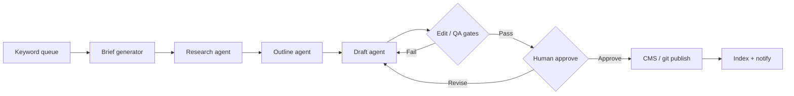

# How to Use AI to Research, Outline, and Draft a Blog Post in 30 Minutes

**You can research, outline, and draft a publishable first pass of a blog post in about 30 minutes if you split the clock into fixed phases, feed the model structured inputs, and refuse to "just chat" your way through the draft.** The 30-minute loop is the human+AI sprint. The rest of this post shows how that same loop becomes a keyword-to-publish pipeline, how edit/QA gets automated without shipping mush, and how you scale production without burning the brand.

I run this pattern for client content systems and for my own site. The goal is not "AI wrote a blog." The goal is a repeatable factory: timed drafting when a human is in the seat, automated hops when the seat is empty, and hard gates before anything goes live.

If you care about citation-ready structure after the draft exists, pair this with [the question-first content model](/blog/the-question-first-content-model-that-gets-you-cited-by-ai) and [how to write content that AI wants to quote](/blog/how-to-write-content-that-ai-wants-to-quote). For the full factory that aims at ~30 posts/month, see [the AI content pipeline pillar](/blog/the-ai-content-pipeline-that-publishes-30-seo-articles-a-month-without-burning-out). This post stays on the 30-minute production machine.

---

## The 30-minute research → outline → draft sprint

**Block 30 minutes on the calendar, open one doc (or one Airtable/Notion record), and run three timed phases: research (10), outline (8), draft (12). Do not open a second chat. Do not "polish" mid-draft.** The sprint produces a first pass with sources attached—not a polished publish. Editing is a separate gate later.

### Phase clock (total: 30 minutes)

| Phase | Minutes | Output you must have before the next phase |
| :--- | ---: | :--- |
| **Research** | 10 | 5–8 source cards with URL, date, one-line claim, and "why it matters" |
| **Outline** | 8 | H1 intent, 3–5 H2s as questions, FAQ list, CTA, internal-link candidates |
| **Draft** | 12 | Lead answer under each H2, one table or list per section, rough FAQ bullets |

If a phase slips, cut scope—not quality of inputs. A 1,200-word draft with solid sources beats a 2,500-word draft built on vibes.

### Model routing for the sprint

| Job | Model (mid-2026) | Why |
| :--- | :--- | :--- |
| Research compression | Gemini 3.5 Flash or GPT-5.4 mini | Fast, cheap, good at turning URLs/notes into cards |
| Outline + structure | Claude Sonnet 5 or Gemini 3.1 Pro | Strong at question clusters and section order |
| First-pass prose | Claude Sonnet 5 | Workhorse draft quality for brand-adjacent copy |
| Flagship rewrite (later) | Claude Opus 4.8 or GPT-5.5 | Voice, argument density, edit pass—not the 12-minute sprint |

Keep **Llama 4** as an offline/self-hosted option for draft generation when data cannot leave your VPC. Do not mix stale model names into prompts or runbooks.

### Research prompt pattern (minutes 0–10)

Paste this into Claude Sonnet 5 / Gemini 3.5 Flash with your keyword and any seed URLs:

```markdown
Role: research assistant for a B2B blog post.
Primary query: {{primary_query}}
Audience: {{audience}}
Constraints:
- Output ONLY JSON array of 6–8 source cards.
- Each card: title, url, source_date (YYYY-MM-DD or "unknown"), claim (1 sentence), why_it_matters (1 sentence), confidence (high|medium|estimate).
- Prefer primary sources (docs, filings, official blogs) over roundups.
- If a number lacks a source, omit the number.
- No prose outside the JSON.
```

Human job in this phase: verify two high-confidence cards yourself. Skim the URLs. Kill anything that is a recycled listicle with no primary link.

Store cards in a structured place—Airtable row, Notion database, or a JSON file the later n8n workflow can read. Unstructured paste into ChatGPT is how 30-minute sprints turn into 90-minute archaeology.

### Outline prompt pattern (minutes 10–18)

```markdown
Role: content architect.
Primary query: {{primary_query}}
Research cards JSON: {{research_cards}}
Voice register: AI Solutions Architect — direct, mechanism-level, no AI-tell filler.
Build an outline that:
1. Opens with a bold lead answer to the primary query.
2. Uses 3–5 H2s phrased as buyer questions (not topic labels).
3. Lists ~8 FAQ H3 questions adjacent to the cluster.
4. Names one CTA matching service track: AI automation strategy call.
5. Suggests 2–3 internal link anchors ONLY from this allowlist: {{existing_slugs}}.
Output markdown outline only. No full prose.
```

Human job: reorder H2s so the arc is clear. For this post's pattern, the arc is: timed human+AI draft → keyword-to-publish automation → edit/QA → scale. Kill cute section titles that do not answer a question.

### Draft prompt pattern (minutes 18–30)

```markdown
Role: draft writer for {{brand}}.
Outline: {{outline}}
Research cards: {{research_cards}}
Rules:
- Lead every H2 with a bold 1–2 sentence direct answer.
- Include ≥1 table or list per H2.
- Cite research cards inline; never invent stats.
- Banned phrases: delve, leverage, seamless, robust, cutting-edge, game-changing,
  paradigm shift, tapestry, unleash, navigate the complexities, to summarize.
- Models named must be from this set only: Claude Opus 4.8, Claude Sonnet 5,
  Gemini 3.1 Pro, Gemini 3.5 Flash, GPT-5.5, GPT-5.4 mini, Llama 4.
- Stop after first-pass draft. Do not self-edit for polish.
Output full markdown draft.
```

Human job during the 12 minutes: steer, do not rewrite paragraph-by-paragraph. If a section is wrong, cut it and re-prompt that H2 only with the outline slice + the two relevant research cards. Whole-document "make it better" prompts burn the clock.

### What "done" means at minute 30

| Done | Not done |
| :--- | :--- |
| Every H2 has a lead answer | Perfect SEO title options |
| Sources attached to claims | Final proofread |
| FAQ questions listed (answers can be stubs) | Cover image |
| Draft lives in CMS/git/Airtable status = Draft | Published |

Treat the sprint like a factory station. The next stations—automation, edit gates, scale—are where volume and quality compound.

---

## How do I create a workflow that goes from keyword to published article automatically?

**Build a keyword → brief → research → outline → draft → edit gates → CMS publish pipeline in n8n (or Make for low volume), with a human approval status before any live publish.** "Automatically" does not mean "no humans." It means humans only touch decisions that need taste, risk, or brand judgment—everything else is nodes and retries.

### The keyword-to-publish graph



| Stage | Input | Output | Owner |
| :--- | :--- | :--- | :--- |
| **Keyword intake** | Sheet / Airtable / GSC export | Queue row with PrimaryQuery, cluster, date | Human (weekly) or scraper |
| **Brief** | Keyword + ICP | Brief JSON: angle, register, CTA, word target | LLM node |
| **Research** | Brief + allowlisted domains | Source cards JSON | LLM + Firecrawl / RSS |
| **Outline** | Brief + cards | Question-led H2/FAQ skeleton | LLM |
| **Draft** | Outline + cards | Markdown body | Claude Sonnet 5 / GPT-5.5 |
| **Edit gates** | Draft | Pass/fail report | Rules + LLM judge |
| **Approve** | Pass report | Status = Approved | Human in Slack/Notion |
| **Publish** | Approved markdown | Live URL + cover | CMS API / git push job |
| **Observe** | Live URL | Rank/citation notes, errors | Webhooks → Airtable |

### Minimum brief JSON (keep this boring on purpose)

```json
{
  "primary_query": "How do I create a workflow that goes from keyword to published article automatically?",
  "slug": "how-to-use-ai-to-research-outline-and-draft-a-blog-post-in-30-minutes",
  "service_track": "ai-automation",
  "register": "AI Solutions Architect",
  "content_cluster": "automating-content-creation-seo-with-ai",
  "word_target_min": 1800,
  "cta": "AI automation strategy call",
  "internal_link_allowlist": [
    "how-to-build-an-ai-powered-newsletter-that-writes-and-sends-itself",
    "refreshing-old-content-for-the-ai-era-a-practical-framework",
    "the-question-first-content-model-that-gets-you-cited-by-ai",
    "how-to-write-content-that-ai-wants-to-quote",
    "n8n-mcp-guide"
  ],
  "banned_phrases": ["delve", "leverage", "seamless", "game-changing"]
}
```

The allowlist matters. Automated internal linking without a disk-verified slug list creates 404s. On this site, link targets are only posts that already exist under `content/blog/`. Same rule in your CMS: the workflow may only pick from published URLs.

### n8n skeleton (production shape)

I wire this in n8n more than Make when the content factory runs weekly or daily and includes AI loops. For tool-calling and agent hops, see the [n8n MCP guide](/blog/n8n-mcp-guide)—MCP is how you give the draft agent controlled tools (fetch URL, write Airtable, open a PR) without dumping raw API keys into prompts.

Typical node chain:

1. **Cron or webhook** — new keyword row status = Ready
2. **Airtable/Notion get** — load brief fields
3. **HTTP / Firecrawl** — pull 3–6 URLs from brief or SERP shortlist
4. **AI node (research)** — Gemini 3.5 Flash → source cards
5. **AI node (outline)** — Claude Sonnet 5 → outline markdown
6. **AI node (draft)** — Claude Sonnet 5 or GPT-5.5 → full markdown
7. **Code / IF** — run edit gates (banned words, missing H2 lead answers, claim without URL)
8. **Slack / email** — approval with Approve / Revise / Kill buttons
9. **CMS or git** — publish only on Approve; write `FilePath`, `WordCount`, `LastModified` back to Airtable
10. **Error workflow** — dead-letter failed runs with the node name and last model response truncated

Idempotency: store a `run_id` and refuse to publish twice for the same slug unless status was rolled back to Draft. Accidental double-publishes are how you earn angry Slack threads at 2 a.m.

### Human gates (non-negotiable)

| Gate | When | What the human checks |
| :--- | :--- | :--- |
| **Angle lock** | After brief | PrimaryQuery is not cannibalizing another post |
| **Claims skim** | After research | Numbers map to cards; estimates labeled |
| **Publish approve** | After edit gates pass | Voice, legal/risk, CTA correctness |

Skip the publish approve and you do not have a content factory—you have a spam cannon. Same philosophy as the [AI newsletter that writes and sends itself](/blog/how-to-build-an-ai-powered-newsletter-that-writes-and-sends-itself): generative marketing content needs a recorded human decision before it leaves the building.

### CMS publish options

| Destination | Pattern | Notes |
| :--- | :--- | :--- |
| **Git markdown site** (this repo) | Workflow writes `.md` + cover path, opens PR or commits on approve | Best audit trail |
| **Headless CMS** | POST body + fields via API | Map frontmatter 1:1 |
| **WordPress** | Application password / REST | Strip AI-tell spam before HTML convert |
| **Webflow / Framer** | API or middle DB | Keep markdown canonical elsewhere |

For SEO refreshes of already-live URLs, do not invent a second slug—use a refresh workflow. The practical framework is in [refreshing old content for the AI era](/blog/refreshing-old-content-for-the-ai-era-a-practical-framework).

---

## How do I automate the content editing and proofreading process with AI?

**Automate editing as a stack of deterministic gates plus one LLM judge pass—never as a single "proofread this" prompt that returns vibes.** Proofreading is spelling and grammar. Editing is structure, claims, voice, and publish risk. Automate both, but keep separate nodes so you know which gate failed.

### Gate stack (run in this order)

| # | Gate | Type | Fail condition |
| ---: | :--- | :--- | :--- |
| 1 | **Schema** | Deterministic | Missing title, slug, H1, or closing FAQ |
| 2 | **Banned phrases** | Regex / list | Any hard-ban AI-tell word in prose |
| 3 | **Lead answers** | Heuristic + LLM | H2 not followed by bold lead within ~2 sentences |
| 4 | **Claims** | LLM + research cards | Number or absolute claim with no matching card/URL |
| 5 | **Internal links** | Deterministic | Href slug not in allowlist / not published |
| 6 | **Model currency** | Regex | Any pre-2026 model string (old GPT / Claude / Gemini / Llama major versions) |
| 7 | **Voice judge** | LLM | Off-register, corporate "we", filler openers |
| 8 | **Length / structure** | Deterministic | Below min lines or missing table/list per H2 |

Gates 1, 2, 5, 6, and 8 should be code nodes. Do not burn tokens on what a 20-line script can catch. Use Claude Sonnet 5 or GPT-5.4 mini for claims + voice. Escalate to Claude Opus 4.8 when the brand voice is strict or the piece is a pillar.

### Edit-judge prompt pattern

```markdown
You are an edit judge, not a rewriter.
Return ONLY JSON:
{
  "pass": boolean,
  "failures": [{"gate":"","excerpt":"","fix":""}],
  "score_voice": 1-10,
  "score_claims": 1-10
}
Rules:
- Do not rewrite the article.
- Flag invented stats (numbers without a research card match).
- Flag banned phrases from {{banned_list}}.
- Flag stale model names.
- Flag missing lead answers under H2s.
Draft:
{{draft_markdown}}
Research cards:
{{research_cards}}
```

If `pass` is false, route back to the draft node with `failures` as the only revision instructions. Whole-document "improve the tone" loops are how edit automation becomes infinite.

### Proofreading vs editing (split the jobs)

| Job | Automate with | Human still owns |
| :--- | :--- | :--- |
| Spelling / grammar | LanguageTool / LLM micro-pass | Proper nouns, product names |
| Consistency (US/UK, serial comma) | Style config in prompt | Exceptions in brand book |
| Factual claims | Research-card matching | Legal, medical, financial risk |
| Brand voice | Register rubric + banned list | Final taste on flagship posts |
| SEO title/meta | Template + LLM options | Clickbait vs brand risk |

### Diff-based revision (saves money and voice)

When a gate fails, do not re-generate the full post. Pass:

1. The failing H2 or FAQ block only
2. The specific failure objects
3. The 1–2 research cards that section needs

Ask for a patched block. Splice it back in code. Full regenerations are how your carefully structured outline turns into a different article on attempt three.

### What automated editing cannot fix

- A weak PrimaryQuery that cannibalizes another post
- A research pack with zero primary sources
- A CTA that does not match the service track
- "Original insight" that was never in the brief

Those are upstream failures. Fix the brief and research stations; do not ask the editor model to invent taste.

---

## What is the best way to use AI to scale content production?

**Scale with a factory: one brief template, one question-cluster method, parallel draft agents, shared edit gates, and a human bottleneck only at angle lock and publish approve—not at every paragraph.** The best way is not "hire more people to prompt ChatGPT." The best way is throughput with identical quality controls.

### Throughput model (realistic)

| Cadence | Human hours / week | Automation load | Notes |
| :--- | :--- | :--- | :--- |
| **4 posts / month** | 4–6 hrs | Light n8n | 30-min sprints + manual publish OK |
| **12 posts / month** | 6–10 hrs | Full keyword→publish | Approvals in Slack batches |
| **30 posts / month** | 10–15 hrs | Queue + parallel drafts + refresh mix | Needs Airtable schedule + dead letters |
| **Refresh-heavy** | Lower new-draft hours | Refresh workflow dominant | Pair with old-content framework |

Thirty posts a month is a staffing and systems problem, not a "better prompt" problem. Mix new spokes with refreshes so you are not inventing 30 net-new PrimaryQueries from thin air.

### Parallelization rules

1. **One PrimaryQuery per post.** No two queue rows share the same target question.
2. **Cluster before draft.** 3–5 TargetQuestions → H2s; ~8 FAQQuestions → H3s.
3. **Disjoint ownership when using multiple agents.** Agent A owns research+outline; Agent B owns draft; Agent C owns edit judge—or parallelize by slug, never by overlapping sections of the same file.
4. **Shared allowlists.** Banned words, model names, internal link slugs, CTA map—one source of truth.
5. **Batch approvals.** Review 5 Approve packs in one sitting instead of context-switching per post.

### Where the 30-minute sprint still fits at scale

Even with a full pipeline, keep the timed sprint for:

- Pillar posts where taste matters more than speed
- First posts in a new cluster (template calibration)
- Crisis or newsjack pieces that skip the overnight queue
- Training a new teammate on the factory rules

Automation handles the boring hops. The sprint keeps humans calibrated to what "good" feels like so approvals stay sharp.

### Tooling stack for an AI content factory

| Layer | Tools I actually ship | Role |
| :--- | :--- | :--- |
| **Queue / schedule** | Airtable, Notion | Dates, status, clusters, claims |
| **Orchestration** | n8n (default), Make (low volume) | Keyword→publish graph |
| **Research fetch** | Firecrawl, RSS, Search APIs | Source cards |
| **Models** | Claude Sonnet 5, Claude Opus 4.8, Gemini 3.5 Flash, Gemini 3.1 Pro, GPT-5.5, GPT-5.4 mini, Llama 4 | Draft / judge / compress |
| **CMS** | Git markdown, headless CMS, WP | Publish artifact |
| **Observability** | Slack alerts, Airtable run log | Failures, spend, approvals |

If newsletter is a sibling channel, reuse the same research cards and approval UX—see the [self-writing newsletter pipeline](/blog/how-to-build-an-ai-powered-newsletter-that-writes-and-sends-itself). Do not build a second research brain for email.

### Quality does not scale by accident

| Metric | Target | How you measure |
| :--- | :--- | :--- |
| Gate pass rate first try | ≥60% after week 4 | Edit-judge logs |
| Human revise rate | Declining month over month | Approve vs Revise counts |
| Claim defects on live posts | Near zero | Spot audits + reader flags |
| Cannibalization | Zero shared PrimaryQuery | Airtable uniqueness |
| Time-to-publish from Ready | <48 hours for spokes | Queue timestamps |

If first-try pass rate stays under 40%, your brief or research station is broken. Pouring more draft agents on a bad brief only makes garbage faster.

### Scaling anti-patterns

- One mega-prompt that "does SEO, draft, and publish"
- Auto-publish with no Approve status
- Internal links to posts that do not exist yet
- Mixing 2024 model names into 2026 runbooks
- Measuring success only by word count or post count
- Refreshing nothing while shipping thin new URLs

Scale the system that already produces one good post in 30 minutes of focused time. Do not scale chaos.

---

## Putting the arc together: sprint → automate → edit → scale

**Start with the 30-minute human+AI loop until the brief, research card schema, and edit gates are stable—then wrap that loop in n8n, then raise cadence.** Most teams invert this: they buy "AI content tools," skip the timed loop, and wonder why volume went up while trust went down.

Recommended rollout:

| Week | Ship | Success signal |
| ---: | :--- | :--- |
| 1 | Timed sprint on 2 posts; freeze brief JSON + banned list | Two drafts you would actually edit |
| 2 | n8n research→outline→draft; Slack approve; manual CMS | One approved auto-draft live |
| 3 | Full edit-gate stack; allowlisted internal links | First-try pass ≥50% |
| 4 | Queue 8–12 keywords; batch approvals | Cadence without weekend panic |
| 5+ | Add refresh workflow + newsletter sibling | Same research cards, two channels |

This is the same operating model I use when a founder says "we need more content" and what they actually need is a content control plane.

---

## FAQ

### Can AI automatically create content from my podcast transcripts?

**Yes—treat the transcript as a research source, not as the published article.** Chunk the transcript, extract claims and stories into source cards, then run the same outline→draft→edit gates. Auto-publishing raw transcript cleanup usually reads like a meeting dump. Use Claude Sonnet 5 for structure extraction and Claude Opus 4.8 when the episode voice must survive into the post.

### How do I use n8n to build an automated content publishing workflow?

**Chain Cron/Airtable → research → outline → draft → deterministic + LLM edit gates → Slack approve → CMS/git publish, with a dead-letter error workflow and a `run_id` for idempotency.** For agent-style tool use (fetch, write DB, open PR), wire MCP as described in the [n8n MCP guide](/blog/n8n-mcp-guide). Keep publish behind Approve.

### What tools do I need to run an AI content factory for my business?

**Minimum viable factory: a queue (Airtable/Notion), an orchestrator (n8n), one fast model + one flagship model, a research fetch tool, a CMS, and Slack/email for approvals.** Add Firecrawl when URLs matter, Llama 4 when data must stay private, and a refresh workflow before you chase vanity volume. Tools without gates are just expensive autocomplete.

### How does automated AI content affect search rankings?

**Automation itself does not rank—useful, sourced, non-cannibalizing pages do.** Thin spun posts at high volume tend to underperform and can waste crawl budget. Question-led structure, unique PrimaryQueries, and refresh of decaying URLs matter more than whether a human typed every sentence. For citation-oriented structure after you can produce drafts, use [question-first content](/blog/the-question-first-content-model-that-gets-you-cited-by-ai) and [quote-ready writing](/blog/how-to-write-content-that-ai-wants-to-quote).

### Should I auto-publish AI drafts without a human review?

**No for brand, legal, or YMYL-adjacent topics. Auto-publish is only sane for low-risk templates with zero generative claims (e.g. changelog digests).** If a model can invent a statistic, a human must own the Approve click. Record who approved and when.

### How long should the research phase take if I am not doing the 30-minute sprint?

**For automated runs, cap research at a fixed card count (6–8) and a time budget on fetch nodes (e.g. 3 minutes wall clock), not open-ended browsing.** Unlimited research is how pipelines stall. If cards are weak, fail the run and alert—do not draft on empty calories.

### Which model should write vs edit?

**Claude Sonnet 5 or Gemini 3.5 Flash for first drafts and compression; Claude Opus 4.8 or GPT-5.5 for flagship edits and voice; GPT-5.4 mini or Gemini 3.5 Flash for cheap judge/compression hops; Llama 4 when you need local inference.** Pin versions in the workflow so a provider rename does not silently change quality.

### How do I keep AI drafts from inventing statistics?

**Forbid naked numbers in the system prompt, require every numeric claim to map to a research card with `url` + `source_date`, and fail the claims gate before Slack approval.** If the card set has no number, the draft must omit the number—not "estimate confidently."

### Can I reuse the same pipeline for newsletters and blog posts?

**Yes—share research cards, banned lists, and approval UX; diverge at outline templates and publish destinations.** Newsletter issues want shorter sections and ESP fields; blog posts want H2 question clusters and FAQ schema. The [AI newsletter pipeline](/blog/how-to-build-an-ai-powered-newsletter-that-writes-and-sends-itself) is the sibling pattern.

### What is the fastest way to improve a low gate-pass rate?

**Audit the last 20 failures by gate name. If bans and schema dominate, fix prompts and templates. If claims dominate, fix research fetch and card quality. If voice dominates, tighten the register rubric and examples—not the draft temperature alone.** More volume before you fix the top failure mode just creates more Revise clicks.

---

## Ship the 30-minute loop, then the factory

If you only take one thing: **time-box research, outline, and draft into a 30-minute sprint with structured cards—then wrap that exact contract in n8n with edit gates and a human Approve before publish.** Scaling is a queue and parallel agents on top of that contract, not a substitute for it.

I design and ship these content pipelines as part of AI Automation + Growth work—Airtable schedules, n8n graphs, model routing, and the approval UX your team will actually click. If you want this mapped onto your CMS, keyword queue, and brand voice, [book an AI automation strategy call](/contact) and bring one recent post you liked plus where drafts currently die (Doc, Notion, Slack, nowhere). We will sketch the workflow graph before anyone buys another "AI writer" seat.
