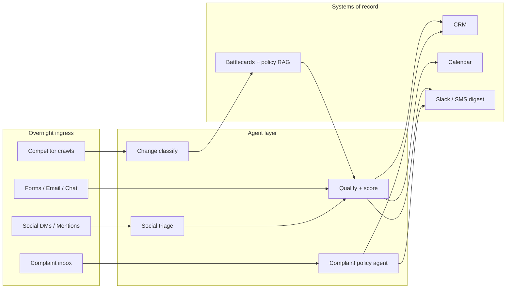

# How to Use an AI Agent to Handle Inbound Leads While You Sleep

**The inbound lead that arrives at 1:14 a.m. should not wait until you open Slack at 9.** An overnight AI agent can capture the form/email/chat, score fit against your ICP, write the CRM record, route the hot ones to a human, and book or queue the rest — without inventing pricing, promising SLAs you don't have, or waking you for every "just browsing" inquiry.

I'm William Spurlock, an AI Solutions Architect and Fractional AI CTO. I ship these systems for operators who already get inbound and lose deals to slow follow-up, not for people who still need product-market fit. The stack below is the same pattern I use when a client says "handle leads while I sleep" and then immediately asks about competitors, social, and complaints. Those are not separate hobbies. They are the overnight ops layer that feeds and protects inbound.

This post is a spoke under my pillar on [AI sales agents in 2026](/blog/ai-sales-agents-in-2026-what-they-can-do-what-they-can-t-and-when-to-deploy-one). If you want the scoring math in isolation, read [AI lead scoring](/blog/ai-lead-scoring-how-to-automatically-prioritize-the-leads-worth-your-time) next. Here we wire the full overnight loop.

---

## What "handle inbound while you sleep" actually means

**It means a closed loop: capture → qualify → route → book or alert — with hard stop rules so the agent cannot negotiate, invent discounts, or send legal commitments unsupervised.** Anything softer is a chatbot with a CRM webhook, and those quietly burn trust.

Here is the overnight contract I put in every SOW:

| Stage | Agent job | Human job | Default SLA |
|---|---|---|---|
| Capture | Normalize form, email, chat, calendar invite into one lead object | Fix broken tracking sources | < 2 minutes |
| Qualify | Score ICP fit, intent, urgency, spam risk | Tune rubric weekly | < 5 minutes |
| Route | Assign owner, stage, sequence, or nurture list | Override ownership conflicts | Immediate |
| Book / alert | Offer slots, confirm booking, or page owner | Take the call | Hot: page now; warm: morning digest |
| Audit | Log every tool call + draft | Spot-check 10% of replies | Daily |

If any of those stages is missing, you do not have an overnight agent. You have a delayed notification dressed up as autonomy.

### The four tools the agent must touch

1. **Inbox / form / chat ingress** — Webhook into n8n (or equivalent) from HubSpot forms, Typeform, Intercom, Gmail/Outlook, website chat.
2. **CRM write-back** — Create/update contact + deal + activity. No "shadow spreadsheet" that diverges by Friday.
3. **Calendar + booking** — Read free/busy, propose 2–3 slots, confirm only after the human policy allows auto-book.
4. **Alert channel** — Slack/Teams/SMS for hot leads; morning digest for everything else.

Model choice for mid-2026 overnight work:

| Job | Model I default to | Why |
|---|---|---|
| High-volume qualify + draft reply | Claude Sonnet 5 | Fast, cheap enough for every form submit |
| Ambiguous ICP / enterprise thread | Claude Opus 4.8 or GPT-5.5 | Better judgment on "is this real budget?" |
| Long thread + attachments | Gemini 3.1 Pro | Multimodal context when they attach a deck |
| Cheap classification / spam gate | GPT-5.4 mini or Gemini 3.5 Flash | Kill junk before it burns tokens |

Do not run Opus 4.8 on every "unsubscribe" email. That is how overnight agents become overnight invoices.

---

## The overnight inbound pipeline (capture → qualify → route → book)

**Build the inbound agent as a state machine with confidence thresholds, not as a free-form chat that "figures it out."** Free-form overnight agents invent urgency, invent pricing, and invent your calendar.

### Step 1 — Capture into a single lead object

Normalize every channel into the same schema. I keep it boring on purpose:

```json
{
  "lead_id": "uuid",
  "source": "website_form | email | chat | social_dm | referral",
  "received_at": "ISO-8601",
  "contact": {
    "name": "",
    "email": "",
    "company": "",
    "role": "",
    "phone": ""
  },
  "raw_message": "",
  "utm": {},
  "attachments": []
}
```

If social DMs and website forms land in different shapes, your qualifier will score inconsistently and your CRM will lie.

### Step 2 — Qualify with a rubric, not vibes

I score four axes (0–5 each), then map to action:

| Axis | What the agent looks for | Examples that raise score |
|---|---|---|
| ICP fit | Industry, company size, geography, role | Matches ICP doc + decision-maker title |
| Intent | Specific problem + timeline | "Need this live before Q4 launch" |
| Budget signal | Explicit budget, paid tools already in stack | Mentions current spend or RFP |
| Risk / spam | Disposable email, nonsense company, scrape patterns | LinkedIn + domain mismatch |

Action map I ship most often:

- **16–20** — Auto-book if slots exist; page owner if none
- **11–15** — Personalized reply + 2 slot options; no hard book without reply
- **6–10** — Nurture sequence + morning digest
- **0–5** — Soft decline or spam folder; never auto-book

For the full scoring design, the spoke on [AI lead scoring](/blog/ai-lead-scoring-how-to-automatically-prioritize-the-leads-worth-your-time) goes deeper on weights and false positives.

### Step 3 — Route with ownership rules

Routing fails when two humans both "own inbound." Encode it:

1. Round-robin among on-call owners for score ≥ 16
2. Territory / vertical rules if you have them
3. Sticky owner if the contact already exists in CRM
4. Escalation queue if the owner is OOO

The agent should never invent a new owner. It assigns from a closed list.

### Step 4 — Book or alert — never both blindly

Overnight booking is where brands get hurt. Rules I refuse to relax:

- Auto-book only for score ≥ threshold **and** email domain verified **and** no pricing negotiation in the thread
- If the lead asks for a discount, custom legal terms, or "can you guarantee X," escalate — do not book
- Confirmation email must use approved templates; the model fills slots and names, not claims
- Hot alert (SMS/Slack) for score ≥ 16 even if booked, so the human can prep

A useful system prompt fragment for the booking gate:

```text
You are the overnight inbound booking gate for {{company}}.
You may propose calendar slots and confirm a booking ONLY when:
1) ICP score >= {{threshold}}
2) Email domain is corporate (not freeweb/disposable) OR prior CRM trust flag is true
3) The lead has not requested pricing exceptions, legal review, or guarantees
4) Free/busy returns at least one slot in the next {{days}} business days

If any check fails: draft a polite reply, set CRM stage to "Needs human",
and notify {{on_call_channel}}. Never invent pricing, timelines, or case studies.
```

Wire that gate through MCP tools (CRM, calendar, Slack) or n8n HTTP nodes. Same logic either way.

### What "done" looks like when you wake up

Your morning digest should show:

- New leads by score band
- Bookings confirmed overnight
- Escalations waiting
- Drafts the agent sent (for audit)
- Anything that hit a kill switch

If your digest is only "3 new form fills," you rebuilt email, not an agent.

---

## How do I use an AI agent to monitor competitors and alert me to changes?

**Yes — a competitor-monitoring agent should watch pricing pages, feature changelogs, job posts, and review sites on a schedule, then alert only on material deltas that change how you position inbound replies.** It does not replace strategy. It stops you from learning about a competitor's new packaging from a prospect at 10 a.m.

Overnight inbound and competitive intel belong together. When a lead asks "how are you different from X?" at midnight, the qualifier should have last night's delta in context — not a stale battlecard from Q1.

### What to monitor (and what to ignore)

| Signal | Why it matters for inbound | Alert urgency |
|---|---|---|
| Pricing / packaging page change | Changes objection handling and proposal floors | High |
| New feature / product launch post | Updates "do you support X?" answers | High |
| Hiring spikes (sales, eng, support) | Early signal of GTM push | Medium |
| Review-site rating swings | Trust / objection patterns | Medium |
| Blog SEO fluff | Noise | Low / digest only |
| Social brag posts | Noise unless product-tied | Low |

I do **not** ask the agent to "summarize the competitive landscape" every night. Vague summaries create fake certainty. I ask for **diff-first** output: what changed since last crawl, with URLs and a one-line inbound implication.

### A practical overnight competitor loop

1. **Schedule** — n8n cron every 6–12 hours (not every 5 minutes; you will get rate-limited and hallucinated "changes").
2. **Fetch** — Firecrawl / HTTP / site RSS for a fixed allowlist of URLs (never open-web "find competitors").
3. **Diff** — Store previous hash + extracted text; only call the LLM when the hash changes.
4. **Classify** — Claude Sonnet 5 labels change type: pricing, feature, hiring, messaging, noise.
5. **Alert** — Slack for High; weekly briefing for Medium/Low.
6. **Feed inbound** — Write a short "battlecard delta" into the knowledge store the lead agent reads.

Prompt pattern that keeps the output usable:

```text
Compare PREVIOUS_EXTRACT to CURRENT_EXTRACT for {{competitor}}.
Return JSON only:
{
  "material_change": true|false,
  "change_type": "pricing|feature|hiring|messaging|noise",
  "what_changed": "2 sentences max",
  "inbound_implication": "how our overnight lead replies should adjust",
  "cite_urls": ["..."]
}
If nothing material changed, material_change=false and keep fields empty.
Do not invent features not present in CURRENT_EXTRACT.
```

### Guardrails so competitor agents do not poison inbound

- Allowlist domains. No "research the market" open browsing overnight.
- Require citations (URL + quote span) before a delta enters the battlecard store.
- Separate **intel** from **claims you can say externally**. A competitor hiring 40 SDRs is intel. "They are failing" is not a claim your lead agent may send.
- Human review before any competitive claim becomes a public reply template.

When this layer is healthy, overnight inbound replies stay current without you refreshing five tabs before bed.

---

## Can an AI agent manage my social media presence?

**An AI agent can draft, schedule, reply to routine comments/DMs, and escalate brand-risk threads — it should not become the unsupervised voice of your brand overnight.** Treat social as an inbound channel first, a content factory second.

Most teams ask this question backwards. They want 30 posts a week. What actually moves pipeline is: DMs and comments that are buying signals get captured into the same lead object as website forms — within minutes, at 2 a.m., with the same qualifier.

### Split the social agent into three jobs

| Job | Automate overnight? | Human required? |
|---|---|---|
| Content drafting from approved briefs | Yes (queue, not auto-publish unless you accept risk) | Editor pass for brand voice |
| Scheduling + UTM hygiene | Yes | Policy only |
| Comment / DM triage → CRM | Yes | Escalation for complaints, press, legal |
| Hot takes / controversy / politics | Never unsupervised | Always human |
| Paid ads budget changes | No for agents without hard caps | Always human + platform UI |

If you only automate posting, you get more content debt. If you automate **ingress**, social starts feeding the overnight lead pipeline.

### Social → inbound capture rules

Map these social events into the lead schema from earlier:

1. DM that asks about pricing, demos, or "do you work with companies like ours?"
2. Comment that names a competitor or a buying trigger
3. Mentions that include intent phrases ("looking for," "evaluating," "need a vendor")
4. Creator / partner inbound that looks like BD, not fan mail

Everything else stays in a social queue. Do not create CRM contacts for emoji replies.

### Reply policy that protects the brand at 3 a.m.

- **Allowlisted intents only** — FAQ answers, link to booking, thank-you + route to support
- **Banned topics** — pricing exceptions, legal, medical/financial advice (if relevant), competitor attacks
- **Tone pack** — short approved voice samples; Sonnet 5 drafts; Opus 4.8 only for delicate escalations waiting for morning
- **Escalation tags** — `complaint`, `press`, `security`, `vip` → human, no auto-reply beyond "we got this"

For client-facing hallucination failure modes (invented features, fake case studies in replies), pair this with [how to stop client-facing AI agents from hallucinating](/blog/how-to-stop-client-facing-ai-agents-from-hallucinating). Social is where hallucination becomes a screenshot.

### What "managed presence" should look like in the morning digest

- Posts published / queued
- DMs converted to leads (with scores)
- Comments auto-replied vs escalated
- Any brand-risk thread paused for you

If the digest is only "we posted 4 times," your social agent is a scheduler with better marketing copy.

---

## How do I build an AI agent that handles customer complaints?

**Build a complaint agent that acknowledges fast, classifies severity, pulls account context, drafts a policy-safe reply, and escalates money/legal/safety issues — it should not issue refunds or admissions of fault without a human gate.** Speed without policy is how overnight agents create lawsuits.

Complaints are inbound too. A furious email at midnight is still a lead-adjacent signal: churn risk, upsell salvage, or public-review time bomb. The overnight stack that books demos should share tooling with the stack that catches "this is unacceptable" messages — same CRM, same audit log, different policy pack.

### Severity ladder (encode this before you write prompts)

| Severity | Examples | Overnight agent may | Must escalate |
|---|---|---|---|
| S1 — Safety / legal / data | Breach claims, threats, counsel CC'd | Acknowledge + freeze account actions | Immediate human + legal path |
| S2 — Money | Refund demands, chargebacks, invoice disputes | Draft options from policy table | Human approve before send |
| S3 — Service failure | Missed SLA, bug with workaround | Apology template + status + next step | If VIP or public thread |
| S4 — Frustration | Tone, delays, confusion | Empathy + clarify + link to fix | Only if sentiment worsens twice |

I put the severity classifier on Gemini 3.5 Flash or GPT-5.4 mini first, then escalate the draft to Claude Sonnet 5. Do not burn Opus 4.8 classifying "where is my tracking number?"

### The complaint loop

1. **Ingest** — Support inbox, chat, social mention tagged `complaint`, app review webhook
2. **Identify** — Match CRM contact + open tickets + recent shipments/invoices via MCP tools
3. **Classify** — Severity + category (billing, product, shipping, trust)
4. **Policy retrieve** — Pull the exact refund / replacement / SLA rules (RAG over policy docs, not model memory)
5. **Draft** — Empathy + facts + next step + no admissions beyond approved language
6. **Gate** — Auto-send only for S4 (and some S3) when confidence is high; otherwise queue
7. **Log** — Every tool call, every draft, every policy chunk cited

If you want a deeper ticket-deflection architecture, use [how to build an AI support agent that handles 80% of tickets automatically](/blog/how-to-build-an-ai-support-agent-that-handles-80-of-tickets-automatically) as the companion spoke. This section is specifically about **complaint** policy, not general Tier-1 FAQ deflection.

### Prompt skeleton for policy-safe drafts

```text
You draft complaint replies for {{company}}.
Severity={{severity}}. Category={{category}}.
Allowed actions from POLICY_JSON: {{allowed_actions}}.
Forbidden: invent refunds, admit legal fault, blame named employees,
promise timelines not in POLICY_JSON, or quote competitor failures.

Output:
- customer_reply (email-ready)
- internal_note (for human)
- recommended_action (from allowed list only)
- confidence (0-1)
If confidence < 0.75 or severity is S1/S2: set send=false.
```

### Why complaint handling belongs in the overnight inbound story

- A complaint that becomes a public review kills tomorrow's inbound conversion.
- A well-handled S3 at 1 a.m. often becomes a renewal conversation.
- Shared tooling means you do not maintain three disconnected "AI bots" with three CRM truths.

Pair chat handoff design with [AI chat vs live chat](/blog/ai-chat-vs-live-chat-when-to-use-each-and-how-to-set-up-the-handoff) when the complaint starts in on-site chat and needs a human by morning.

---

## How the three overnight agents feed one inbound system

**Competitor intel sharpens positioning, social captures new demand, complaint handling protects reputation — all three write into the same CRM and knowledge layer the lead agent reads.** That is the coherent overnight stack. Separate tools with separate memories is how you wake up to contradictory replies.



### Shared infrastructure checklist

- One CRM as source of truth
- One audit log for tool calls (you will need it when something weird sends at 3:12 a.m.)
- One embedding / RAG store with namespaces: `policy`, `battlecards`, `product_facts`, `tone`
- One on-call escalation path
- Kill switches per channel (social pause, booking pause, complaint auto-send pause)

For production hardening — retries, sandboxes, staged rollouts — see [how to deploy an AI agent to production without breaking everything](/blog/how-to-deploy-an-ai-agent-to-production-without-breaking-everything). Overnight agents fail louder than midday demos because nobody is watching the first reply.

### Opinionated defaults I ship

1. **Sonnet 5 for volume, Opus 4.8 / GPT-5.5 for judgment** — do not invert that for cost theater
2. **Diff-first competitor watch** — no nightly essay briefs unless a human asked
3. **Social auto-publish off by default** — auto-triage on by default
4. **Complaint auto-send only below S2** — money and legal always gated
5. **Morning digest beats 40 Slack pings** — page only for hot leads and S1/S2

If a vendor demo skips kill switches and audit logs, it is a demo, not an operations agent.

---

## What to measure after 30 nights

**Measure reply latency, qualified booking rate, escalation precision, and brand incidents — not "messages sent."** Overnight agents that optimize for activity create cleanup work for humans.

| Metric | Healthy direction | Red flag |
|---|---|---|
| Median first response (inbound) | Falling toward minutes | Still hours for hot scores |
| Booked / qualified lead rate | Rising without rising no-shows | Bookings up, show rate collapses |
| Human override rate | 10–25% early, trending down | >40% after week 4 (rubric broken) |
| Hallucinated claim incidents | Near zero | Any public screenshot |
| Complaint reopen rate | Flat or down | Up after auto-send enabled |
| Competitor alert precision | Mostly material | Daily noise fatigue |

Estimates vary by industry and traffic mix; treat the bands above as operating targets from client builds, not universal benchmarks. As of 2026, the teams that win are the ones who tune the rubric weekly, not the ones who chase a magic model upgrade.

---

## Ready to put an overnight agent on your inbound?

If you want this built as a real system — n8n + MCP tools, CRM write-back, booking gates, competitor diffs, social triage, complaint policy — book an AI automation strategy call and we will map your channels, thresholds, and kill switches before a single prompt goes live. I design the agent architecture and ship the workflows; you keep ownership of brand voice and final commercial judgment.

[Book an AI automation strategy call](/contact) when you are ready to stop losing midnight leads to morning silence.

---

## FAQ

### Can an AI agent do market research and deliver weekly briefings?

**Yes — if you constrain sources, force citations, and separate facts from recommendations.** A useful weekly briefing agent crawls an allowlisted set of industry pubs, competitor URLs, and your own analytics exports, then produces a short brief with links. It should not open-web "research the market" and invent charts. I schedule research weekly (not nightly) unless a competitor hash changes; overnight is for diffs and alerts, not essays.

### How do I use an AI agent to automate my internal reporting?

**Pipe warehouse / CRM / ad exports into a scheduled agent that fills a fixed report template and flags anomalies — do not ask the model to invent KPIs.** The winning pattern is: deterministic queries pull numbers, the model writes narrative around deltas ("pipeline down 12% WoW because Stage-2 stalled"), and a human reviews before exec Slack. GPT-5.4 mini or Gemini 3.5 Flash is enough for narrative; keep Sonnet 5 for anomaly explanation when multiple metrics move together.

### What is an AI operations agent and how does it improve business efficiency?

**An AI operations agent is a tool-using loop that watches business systems, takes routine actions, and escalates exceptions — measured in hours of busywork removed, not in "autonomy" marketing.** In practice that means overnight lead handling, reporting, competitor diffs, ticket triage, and project nudges under shared policy. Efficiency shows up as faster first response, fewer missed handoffs, and fewer Monday archaeology sessions in the inbox. It does not show up as firing your ops lead.

### How can an AI agent help me manage projects and deadlines?

**Use it for status collection, risk flags, and reminder loops — not for inventing ship dates.** An agent can ping owners for updates, summarize blockers into a standup digest, and escalate tasks that slipped past SLA. It should read your project tool via API/MCP, not guess progress from Slack vibes. Keep commitment changes human-owned; the agent drafts the nudge, you move the deadline.

### Can an AI agent analyze my business data and give me strategic recommendations?

**It can surface patterns and draft options; it should not own strategy without a human who knows the P&L.** Give the agent clean exports, a metric dictionary, and a request like "list three hypotheses for churn uptick with supporting queries." Require citations back to rows or dashboards. Strategic calls — kill a product line, raise prices, enter a market — stay with operators. As of 2026, models are strong at structured analysis and still weak at owning consequences.

### Can an AI agent qualify leads and book sales calls automatically?

**Yes, with a score threshold, calendar access, and a kill switch for negotiation or legal topics.** Qualification is rubric + tools; booking is calendar + confirmation templates. Auto-book the clear ICP fits; draft-and-wait for the messy middle. This is the core of the overnight inbound loop above, and it pairs with the broader sales-agent scope in the [AI sales agents pillar](/blog/ai-sales-agents-in-2026-what-they-can-do-what-they-can-t-and-when-to-deploy-one).

### Can an AI agent manage my entire email inbox?

**It can triage, draft, label, and archive at high volume — full unsupervised send across every thread is how you get accidental commitments.** Start with: spam/newsletter sorting, CRM logging for sales threads, draft replies for FAQs, and escalation for anything with money, legal, or anger. Shared inboxes need ownership rules or the agent will ping the wrong human at 4 a.m.

### How do I build an AI agent that handles my customer onboarding?

**Model onboarding as a checklist state machine: welcome, access, data import, first win, QBR — with the agent advancing steps and escalating blockers.** Pull status from your product/CRM, send the next approved email, and open a ticket when a step stalls past SLA. Do not let the model invent onboarding promises. Onboarding agents pair cleanly with complaint agents because both need policy RAG and account context; they differ in tone and success metric (activation vs resolution).
