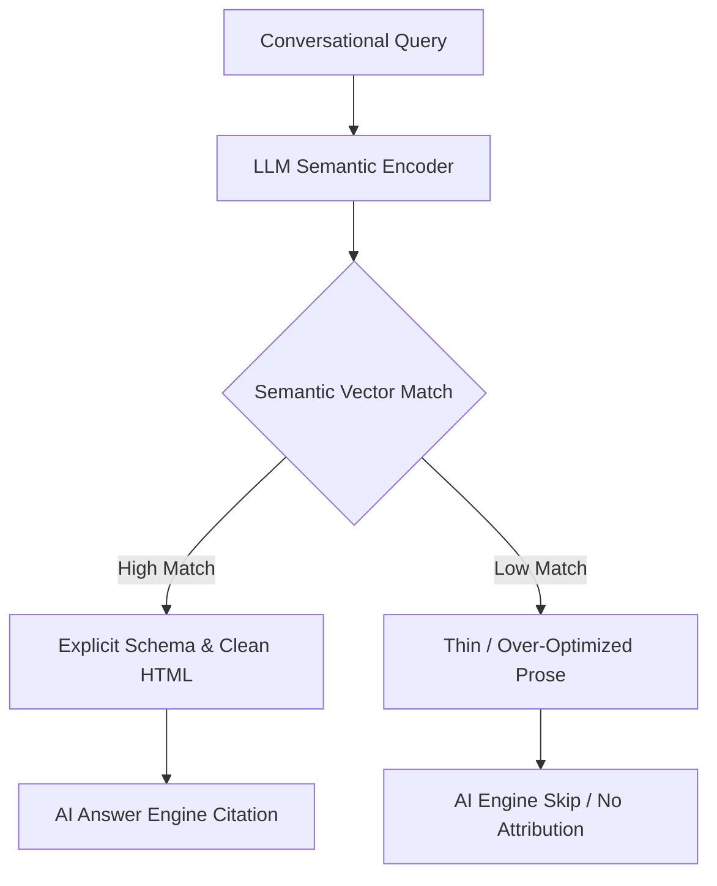

# Is SEO Dead? What Still Works and What Doesn't in the AI Era

The short answer is no, SEO is not dead, but the traditional playbooks business owners have relied on for a decade are rapidly breaking. As Google AI Overviews, ChatGPT, and Perplexity become the primary interfaces for user discovery, the metrics of success have pivoted from rankings to citations. I’m William Spurlock, an AI solutions architect and custom web designer, and in this post, we are going to look at the exact technical shifts happening on the ground—and answer the critical question: **What SEO tactics are now irrelevant because of AI search?**

For years, search engine optimization was a game of matching keywords and building a volume of backlinks. You wrote content for search crawlers first and humans second, hoping to climb to the top spot of the search engine results page. If you hit that coveted position, you were rewarded with clicks, traffic, and leads. The traditional search funnel was direct and predictable: rank high, get clicked, capture the lead. 

Today, that direct funnel is dissolving. AI answer engines read, synthesize, and present information directly on the search page, removing the need for users to click through to your website for simple queries. If your site merely summarizes public facts, you will see your traffic dry up as zero-click searches dominate. To survive, you must adapt your strategy to focus on AI visibility—ensuring that when these engines answer a user's question, your business is the one they cite as the authority.

In my hands-on client work building and shipping custom web systems, I have watched traditional organic traffic patterns break. I've designed and launched hundreds of production websites and built over 500 n8n automations. I am certified in SEO and deep search structures. This experience has shown me that when Google Gemini or OpenAI's web search tools crawl the web, they completely bypass over-optimized, low-information pages. Let's look at what tactics are obsolete and what fundamentals still hold.

---

## What SEO Tactics Are Now Irrelevant Because of AI Search?

**Keyword stuffing, low-quality programmatic content generation, and arbitrary directory link-building are completely dead and actively penalized by modern AI answer engines.** Because AI search models synthesize and cite sources based on information density and factual correctness, tactics designed to cheat search engine algorithms no longer pass the semantic filters of LLM-based crawlers.

The first major shift is the death of exact-match keyword optimization. Traditional SEO focused on inserting specific phrases a set number of times within a page to signal relevance to crawlers. AI engines use semantic vector embeddings to understand the underlying intent of a query, meaning they can easily connect a user's conversational question with an article that answers it, even if the exact words do not match. Over-optimizing for exact terms now makes your text look robotic, which LLM-based filtering systems flag as low-quality content.

Programmatic content farms designed to publish thousands of thin pages have also lost their efficacy. Google's March 2024 Core Update actively targeted these programmatic setups, and modern AI engines have no incentive to cite pages that merely repackage existing web data. If your page does not provide original research, proprietary data, or unique case studies, crawlers will bypass it entirely. AI engines look for primary sources and unique information, meaning secondary summaries are filtered out of the retrieval index.

Low-tier directory link-building and forum backlink spam have also lost their impact on AI visibility. AI models construct their databases by mapping verified real-world entities and analyzing citation graphs. They look at verified authority hubs rather than arbitrary domain authority scores, rendering old-school backlink packages completely useless. A high link count from low-quality, irrelevant blogs no longer moves the needle when Perplexity decides which agency or brand to recommend to a user.

Finally, long-form content filled with fluff is actively penalized. In the traditional search era, writers often added thousands of words of filler to satisfy perceived length requirements. AI models prefer dense, factual paragraphs that they can easily parse and extract. Writing long intro paragraphs and repeating the same points in different ways only serves to hide your key insights from semantic search crawlers, reducing your chances of being selected as a source.

| Traditional SEO Tactic | AI Search Era Status | Why It Changed | The New Playbook |
| :--- | :--- | :--- | :--- |
| **Exact-Match Keywords** | Obsolete | LLMs use semantic embeddings to match intent rather than exact text strings. | Author-intent optimization with deep, contextual answers. |
| **Programmatic Page Farms** | Ignored / Penalized | Algorithms penalize thin, repetitive, low-information pages. | High-density content with unique receipts and proprietary data. |
| **Directory Backlinks** | Useless | AI search maps verified real-world entities, ignoring spammy directories. | Digital PR and getting cited in high-authority journals or industry hubs. |
| **Thin Target Pages** | Filtered Out | Crawlers ignore pages that simply restate facts without providing deep value. | Content with proprietary facts, tables, and structured data. |
| **Fluffy Filler Prose** | Hidden From AI | AI crawlers look for dense, factual claims and skip wordy explanations. | Clear, structured formatting with direct answer-first writing. |

---

## What SEO Fundamentals Still Matter in the Age of AI Search?

**Strong technical foundation—including clean schema.org JSON-LD structured data, mobile-first performance, and strict adherence to E-E-A-T principles—remains the backbone of AI discoverability.** AI engines do not guess; they crawl structured code to extract facts, making clean HTML semantically readable and easily verifiable for LLM parsing.

To understand how these traditional fundamentals overlap with AIO and where they diverge, read my deep breakdown of [the overlap between SEO and AI visibility and where they split](/blog/the-overlap-between-seo-and-ai-visibility-and-where-they-split).

Schema markup (JSON-LD) is more important than ever. When Perplexity or ChatGPT crawls your site, they look for explicit entity definitions. If you use structured schema.org data to define your business, your services, your location, your authors, and your organization, you make it extremely easy for the AI to parse your information and include it in its knowledge graph. Without this structured foundation, your business remains a collection of unverified text blocks that the AI cannot confidently recommend to users who ask for verified solutions.

Furthermore, technical website health still dictates your visibility. Page speed, mobile-first design, and clean indexing configurations are essential. If your website is slow, or if heavy JavaScript frameworks prevent crawlers from reading your content immediately, AI search bots will throttle their crawl budget. A fast, performant platform ensures that your content is indexed the moment it is updated, allowing your brand to be cited for real-time news and fresh industry developments.

Finally, E-E-A-T (Experience, Expertise, Authoritativeness, Trustworthiness) is the ultimate filter. AI search engines want to cite verified experts. This means having real author profiles, clear editorial standards, links to trusted external sources, and verified credentials. If you're managing an established site, learning [how to transition your SEO strategy to AI visibility without losing rankings](/blog/how-to-transition-your-seo-strategy-to-ai-visibility-without-losing-rankings) is the first step toward reclaiming your search real estate.

```json
{
  "@context": "https://schema.org",
  "@type": "BlogPosting",
  "headline": "Is SEO Dead? What Still Works and What Doesn't in the AI Era",
  "author": {
    "@type": "Person",
    "name": "William Spurlock",
    "jobTitle": "AI Solutions Architect"
  },
  "publisher": {
    "@type": "Organization",
    "name": "William Spurlock Studio",
    "logo": {
      "@type": "ImageObject",
      "url": "https://williamspurlock.com/logo.png"
    }
  },
  "datePublished": "2026-07-01",
  "dateModified": "2026-07-01",
  "mainEntityOfPage": "https://williamspurlock.com/blog/is-seo-dead-what-still-works-and-what-doesn-t-in-the-ai-era"
}
```

Beyond schema, your website's crawlability is determined by clean, semantic HTML structure. AI crawlers are text-extractors first. If your content is buried behind complex tabs, nested sliders, or heavy client-side rendering engines that require intense CPU execution to load, crawlers will miss the context. Building sites with clean Server Components, static-first generation frameworks like Astro, and minimal DOM nesting ensures that any AI bot—from GoogleBot to GPTBot—can read and extract your core claims within milliseconds.

---

## Is Keyword Research Still Important for AI Visibility?

**Keyword research is still highly important, but it has evolved from tracking isolated high-volume keywords to identifying user intent clusters and semantic query vectors.** AI search systems process natural language queries, meaning your content must target complete questions and conversational query patterns rather than disjointed head terms.

Traditional keyword research focused on finding high-volume search phrases and creating a page for each one. This approach created massive, fragmented websites with thin content. In the AI era, search queries are conversational. Users no longer type "web designer New York." Instead, they ask Perplexity, "Who is the best web designer in New York who works with AI automation and has transparent pricing?"

Your keyword research must now map out intent clusters. You need to identify the exact questions, pain points, and comparison scenarios your customers are searching for. This involves researching long-tail, question-based keywords and grouping them into a singular, comprehensive resource. For a deeper look at how this changes the actual writing process, see my analysis of [geo vs seo and what actually changes in how you create content](/blog/geo-vs-seo-what-actually-changes-in-how-you-create-content).



To guide your content strategy effectively, you can instruct AI models to assist you in mapping out these semantic intent clusters. Rather than relying on simple search volume metrics, use structured prompt engineering to discover the deeper question networks your buyers are asking. Below is a practical prompt template I use during client discovery to map conversational query matrices:

```markdown
Role: AI Visibility and Semantic Search Strategist
Task: Generate a semantic intent cluster matrix for a high-value B2B service.
Inputs:
- Core Service: [e.g., AI Automation Consulting]
- Target Audience: [e.g., Small Business Owners, Operations Directors]

Instructions:
1. Map out the conversational query journey across 3 phases: Discovery (informational questions), Comparison (versus queries), and Decision (buying criteria/reviews).
2. For each query, identify the core entity associations the writer must establish.
3. Define the structured data format (table, list, or schema) required to make the answer easily extractable for Perplexity and ChatGPT.
```

To align your keyword strategy with semantic search patterns, shift your research toward these four specific areas:

1. **Target conversational long-tail queries:** Analyze natural phrasing used in voice searches, community forums, and customer support channels to capture real-world questions.
2. **Focus on entity associations:** Research how search engines map your industry. Map your business name alongside core service definitions (e.g., mapping "William Spurlock" to "custom web design and AI automation").
3. **Analyze People Also Ask (PAA) boxes:** Collect the questions Google already maps as highly relevant to your core topics, as these are the exact questions AI engines synthesize first.
4. **Identify comparison and transactional intents:** Research queries where users compare options (e.g., "service A vs service B") or seek specific outcomes, as these represent high-value leads looking for immediate recommendations.

For instance, when designing websites for client bands or businesses, we don't just optimize for search volume. We identify the high-intent long-tail phrases that indicate a customer is ready to buy or book. This means we write answers to specific technical challenges or custom workflows, directly showing our expertise with screenshots, prompts, and config files. When an AI search bot reads these clear, evidence-based details, it selects our client's site as the authoritative citation.

---

## Frequently Asked Questions

### Do backlinks still matter for AI visibility?

**Backlinks still matter, but their primary value has shifted from PageRank calculations to establishing topical authority and trust.** AI engines like Perplexity use high-authority backlinks to verify the credibility of a source before citing it. Getting cited on reputable sites is far more valuable than accumulating hundreds of low-quality links. If a reputable industry journal links to your case study, that link validates your brand entity as an authority, making ChatGPT or Claude more likely to recommend your services.

### How does page speed affect AI visibility vs. traditional SEO?

**Page speed remains a critical factor because it directly impacts crawl efficiency for both traditional search crawlers and AI search bots.** If your website loads slowly, search engines and LLM crawlers will throttle their crawl budget, meaning your newest updates might not be crawled or indexed. A fast-loading site ensures your content is indexed quickly and cited accurately. Fast static sites built with modern frameworks also provide a superior user experience, keeping human visitors on the page once they click through from an AI search citation.

### Is blogging still worth it in 2026 with AI search dominating?

**Blogging is absolutely worth it, but only if you write high-information-density content that answers real user questions.** AI search engines require source text to synthesize answers, meaning websites that publish original research, proprietary data, and case studies will receive the majority of AI citations. Blogs that continue publishing generic summaries will see their traffic dwindle. Instead of writing general topic summaries, focus on publishing deep case studies, configuration files, and proprietary findings that AI crawlers must cite because the data exists nowhere else.

### Does AI search favor longer or shorter content?

**AI search engines do not favor content based on word count, but rather on its information density and structural clarity.** A short, highly-focused post with clear schema markup and a clean table will easily outperform a 3,000-word article filled with generic text. Focus on answering the target query thoroughly in as few words as possible. AI models are trained on extracting concise facts, so structuring your content with clear, direct headers and short paragraphs makes it significantly easier to parse and quote.

### How do Google AI Overviews cite sources?

**Google AI Overviews cite sources that rank highly in traditional search results and contain highly structured, semantically clear answers.** The algorithm extracts matching paragraphs from high-ranking pages that align perfectly with the user's conversational intent. Implementing FAQ schema and direct answer-first formatting increases your citation chances. To determine if these overviews are impacting your current traffic, read my diagnostic guide on [did Google AI Overviews cause your traffic drop and how to tell](/blog/did-google-ai-overviews-cause-your-traffic-drop-how-to-tell).

### Does duplicate content affect AI visibility?

**Duplicate content severely hurts your chances of being cited because AI search engines prioritize unique, primary sources of information.** If your site merely republishes or slightly rephrases existing articles, LLM crawlers will skip your pages in favor of the original source. Always lead with proprietary data, case studies, and personal receipts to stand out. Publishing repetitive or spun content across multiple URLs on your own site will also dilute your topical authority, confusing crawlers and reducing your overall citation share.

### Should you block AI crawlers (like GPTBot) from your website?

**You should not block AI crawlers unless you want your business to be completely invisible in AI-generated answers and recommendations.** Blocking crawlers like GPTBot, ClaudeBot, or PerplexityBot prevents them from reading your site, which means they will never cite or recommend your business to their users. Keep your site open to these crawlers to capture AI-driven lead generation. While blocking AI scrapers might prevent temporary scrapers, blocking the major search crawlers removes your brand from the future of user discovery.

### How does E-E-A-T affect citations in Perplexity and ChatGPT?

**E-E-A-T is highly influential because AI models are trained to extract information from verified, trustworthy entities and authors.** By establishing clear author bios, linking to verified social profiles, and using schema.org markup, you prove your authority to LLM crawlers. This makes your content significantly more likely to be selected as a trusted source for synthesis. AI search systems cross-reference claims against external databases, so keeping your offline credentials, reviews, and professional profiles updated is key.

### What is the difference between AEO and traditional SEO?

**Traditional SEO optimizes websites to rank in search engines, while Answer Engine Optimization (AEO) structures content to be extracted, synthesized, and cited by AI models.** SEO focuses on keyword density and link-building to gain clicks. AEO focuses on entity-first writing, extreme information density, and structured schema so AI agents can trust and quote your business directly in conversational answers.

### Can schema markup alone get my site cited by AI search engines?

**Schema markup is necessary for providing machine-readable structure, but it must be paired with high-quality, unique content to secure citations.** Schema helps crawlers index your business entities, but the AI's generation systems will only cite your page if the underlying prose provides a direct, accurate answer to the user's query. Both structured code and information-dense writing are required to build visibility.

---

## Secure Your Business Citation in the AI Era

If you are ready to secure your citations in Google AI Overviews, Perplexity, and ChatGPT, I can help. I audit existing websites for AI visibility and build premium, high-converting platforms designed from the ground up to be easily crawled, structured, and cited by AI engines. [Book an AI visibility audit today](/contact) and let's make sure your business is the one the AI recommendations prefer.
