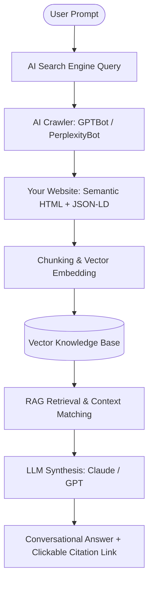
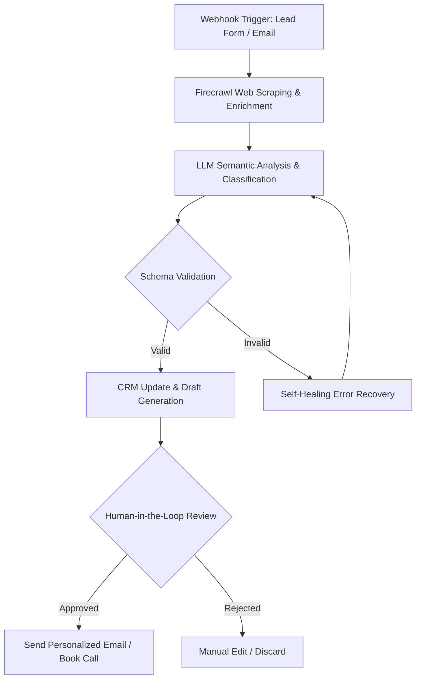

# 14 Questions to Ask an AI Solutions Architect Before You Hire One (Answered)

The best hires start with the buyer asking hard questions.
When prospects book a discovery call on this site—which I've designed to be as
low-friction as possible—I genuinely enjoy it when they come prepared with
tough, direct questions.
It shows they aren't looking for a generic agency that promises the moon and
delivers a template.
They want to know exactly how an operator thinks, builds, and measures success.

I'm William Spurlock, an AI Solutions Architect, Fractional AI CTO, and solo
studio founder who gets paid five figures to ship high-impact web experiences
and custom automations.
I've spent over 10,000 hours architecting agentic systems, built more than 500
automations, and shipped hundreds of production websites.
I don't talk like a LinkedIn thought leader, and I don't write code from scratch
when AI can generate it cleaner in seconds under my direction.
I focus on prompt design, context limits, and hard business outcomes like
conversion rates and hours saved.

If you are looking to hire an AI consultant or solutions architect in 2026, you
shouldn't just ask about their hourly rate.
You should interview them like you're hiring a fractional executive.
Here are the 14 questions I'd want you to ask me before you hire me—and exactly
how I answer them.

## AI Visibility & Discovery

**AI Visibility is the practice of structuring your digital footprint so AI
answer engines—Google AI Overviews, ChatGPT, and Perplexity—can extract, trust,
and cite your brand as an authority.**
Traditional search is shifting from ten blue links to synthesized inline
answers.
If your business isn't structured to feed these retrieval-augmented generation
(RAG) systems, you are invisible to the next generation of buyers.
Here is how we solve that.

### How does your AI Visibility framework get my business into answers on Perplexity and ChatGPT?

**My AI Visibility framework structures your site's data and content so
retrieval-augmented generation (RAG) pipelines can easily extract, trust, and
cite your brand.**
We do this by focusing on entity anchoring, semantic relevance, and structured
extraction patterns rather than old-school keyword stuffing.
When ChatGPT or Perplexity runs a web search to answer a user's prompt, they
don't look for keyword density.
They look for the most authoritative, structured, and direct answer available.

To understand why this works, you have to understand how modern answer engines
operate.
They don't just return a list of links.
They use a multi-step retrieval and synthesis process:



When an AI crawler visits your site, it converts your text into vector
embeddings—mathematical representations of meaning.
If your content is vague or buried under marketing fluff, the embedding vector
will be weak, and the RAG pipeline will ignore your page.
My framework ensures your content has a strong semantic signature by organizing
every page into self-contained, high-density information chunks.
We make sure that each chunk answers a specific search intent completely,
allowing the retrieval model to lift your text directly into its context window.

My framework is built on four distinct pillars that map directly to how LLMs
retrieve and synthesize web data:

| Pillar | What We Build | Why It Gets Cited |
|---|---|---|
| **Entity Anchoring** | Structured JSON-LD schema, dedicated About pages, and consistent brand strings across the web. | Establishes your business as a recognized entity in the model's knowledge graph. |
| **Question-First Clusters** | H2 and H3 headings structured as real questions buyers ask, followed by direct answers. | Matches the semantic intent of conversational user prompts 1:1. |
| **Extraction Patterns** | Comparison tables, bulleted lists, and definition blocks built directly in clean HTML. | Allows retrieval models to pull structured facts without having to condense long prose. |
| **Citation Authority** | Outbound links to primary documentation, dated facts, and clear author credentials. | Satisfies the model's trust filters, reducing the risk of hallucination. |

By aligning your site with these four pillars, we make your content highly
citable.
If you've noticed your organic traffic flattening, you can read my guide on [why
your business isn't showing up in Google AI Overviews](/blog/why-your-business-
isn-t-showing-up-in-google-ai-overviews-and-how-to-fix-it) to see the exact
mechanics of how these systems extract data.

### What are the biggest mistakes that hide traditional websites from AI search engines?

**The biggest mistake hiding traditional websites from AI search engines is
burying key facts inside long, unstructured prose blocks with vague, thematic
headings.**
AI crawlers like GPTBot and PerplexityBot are built to extract information
quickly.
If they have to sift through 400 words of marketing fluff before finding a
concrete stat or price, they will skip your page for a competitor who leads with
the answer.

In my audits, I consistently see three major technical and editorial mistakes
that blind AI models to otherwise great businesses:

1. **Vague, Creative Headings:** Using headings like "Our Philosophy" or "A New Way Forward" instead of "How much does a custom AI automation cost?" AI engines match user queries directly to headings. Creative titles destroy this match.
2. **JavaScript-Only Rendering:** Hiding your core content behind heavy client-side JavaScript frameworks without server-side rendering (SSR) fallbacks. If an AI crawler fetches your page and gets an empty `div` while waiting for JS to execute, it reads your site as blank.
3. **Unsourced Claims and Fabricated Stats:** Presenting numbers or claims without clear citations or dates. Models are trained to avoid hallucination, so they prioritize pages that cite primary sources (like official documentation or industry benchmarks) over anonymous blog posts.

To help clients visualize this, I use a simple comparison of how traditional
SEO-optimized pages look to an AI crawler versus how a GEO-optimized page looks:

| Traditional SEO Pattern (AI-Blind) | GEO-Optimized Pattern (AI-Visible) |
|---|---|
| Vague, thematic headings ("Our Approach to Scaling") | Question-first headings ("How do you scale an n8n workflow?") |
| Long, narrative paragraphs with buried facts | Bold, direct answer in the first 1–2 sentences of each section |
| Heavy client-side JS rendering (empty initial HTML) | Pre-rendered static HTML served from global edge networks |
| No structured schema or anonymous author bylines | Rich JSON-LD schema linking to verified author entities |
| Unsourced or fabricated statistics ("99% of clients love us") | Sourced, dated facts with direct outbound citations |

I've documented these and other critical errors in detail in my breakdown of
[website mistakes that hide your business from AI search engines](/blog/website-
mistakes-that-hide-your-business-from-ai-search-engines), which serves as a
checklist for my client audits.

### How do you measure a website's "AI rank" vs traditional Google SEO?

**We measure "AI rank" by tracking your brand's citation share and
recommendation frequency across a fixed query bank of 15–20 high-intent customer
questions run directly in ChatGPT, Perplexity, and Google AI Mode.**
Traditional SEO relies on tracking keyword positions in a static search index,
but AI visibility is fluid, conversational, and personalized.

Because there is no official "Google Search Console" for ChatGPT, we have to
build our own measurement systems.
We run a biweekly audit of your target query bank across the major answer
engines and score each result using a proprietary citation index:

- **Score 0 (Invisible):** Your brand is not mentioned or cited in the generated answer.
- **Score 1 (Mentioned):** Your brand name is mentioned in the text, but there is no clickable link or citation.
- **Score 2 (Cited Link):** Your brand is cited with a clickable link in the source panel or inline text.
- **Score 3 (Primary Recommendation):** Your brand is the primary recommendation in the text, with a direct citation link.

We aggregate these scores to calculate your **Citation Share**—the percentage of
high-intent queries where your business owns a cited link or primary
recommendation.
Here is how traditional SEO tracking compares to how I measure AI visibility for
my clients:

| Metric Dimension | Traditional SEO | AI Visibility (GEO) |
|---|---|---|
| **Primary Goal** | Rank #1–3 in ten blue links. | Get cited as a primary source in the synthesized answer. |
| **Tracking Method** | Automated rank trackers (Ahrefs, Semrush) scraping SERPs. | Biweekly manual and automated query runs across ChatGPT, Perplexity, and Gemini. |
| **Core Metric** | Organic impressions and click-through rate (CTR). | Citation share (percentage of target queries where your URL is cited). |
| **User Action** | User clicks a link to find the answer on your site. | User reads the answer inline; clicks are low but highly qualified. |
| **Value Signal** | High traffic volume, often with high bounce rates. | High branded search lift and direct "found you on ChatGPT" leads. |

Instead of chasing vanity traffic metrics, we focus on owning the citation share
for your most profitable customer questions.
To understand how to set up these tracking systems yourself, look at my guide on
[how to measure AI visibility and the metrics that actually matter in
2026](/blog/how-to-measure-ai-visibility-the-metrics-that-actually-matter-
in-2026).

### Will optimizing for AI crawlers hurt my normal Google rankings?

**Optimizing for AI crawlers will not hurt your traditional Google rankings; in
fact, it actively improves them because Google's own search engine uses the same
semantic understanding and information density signals to rank pages.**
Google's helpful content system and Core Web Vitals guidelines are designed to
reward fast, structured, and authoritative pages—which is exactly what AI models
need to retrieve and synthesize answers.

When we optimize a page for Generative Engine Optimization (GEO), we are making
it:
- Faster and more readable by using clean, semantic HTML.
- More authoritative by adding clear schema markup and sourcing all claims.
- More useful by leading with direct answers and structuring data into tables.

Google's traditional algorithm loves these changes.
For example, when we structure a comparison into a clean HTML table, Google's
traditional crawler often extracts that table directly into a featured snippet
at position zero, while Google's AI Overview extracts it into the generative
summary box.

I've run this playbook across dozens of client sites, and we consistently see
traditional organic impressions rise alongside AI citations.
If you want to see the performance data and why this fear is unfounded, read my
analysis on [whether optimizing for AI search hurts your Google
rankings](/blog/does-optimizing-for-ai-search-hurt-your-google-rankings).

## Tech Stack & Website Frameworks

**A modern brand website must serve two distinct audiences: human buyers who
demand high-end aesthetics, and AI models that require clean, machine-readable
structure.**
If your developer builds a visually stunning site that is a black box of
unindexed JavaScript, you will lose your AI visibility.
If they build a plain, text-only site to please the crawlers, you will lose your
human conversions.
Here is how we balance both.

### Can you walk me through how your 3-step premium website framework future-proofs a brand?

**My premium website framework future-proofs a brand by splitting the build into
three distinct, high-performance phases: semantic content architecture, static-
first edge rendering, and interactive visual polish.**
This phased approach ensures that your site is instantly readable by AI crawlers
while delivering a 100-score Lighthouse experience and modern animations to
human visitors.

Let's break down exactly what happens in each of these three steps and how they
protect your brand's digital presence:

1. **Semantic Content Architecture:** We start by defining your content model. We map your primary services, customer questions, and brand entities into a clean Markdown or headless CMS structure. We configure rich JSON-LD schema to establish your brand, author, and services in the global knowledge graph. This step ensures that before we even think about design, your site's data is structured for easy extraction by AI search engines.
2. **Static-First Edge Rendering:** We build the site using modern, static-first frameworks like Astro or Next.js App Router, deployed on global edge networks like Netlify or Cloudflare Pages. This guarantees that when a human or an AI crawler requests a page, they get pre-rendered, static HTML in under 100 milliseconds. There are no heavy client-side JavaScript bundles to delay rendering or block crawlers.
3. **Interactive Visual Polish:** Once the semantic foundation is solid, we layer on the visual magic. We use GreenSock Animation Platform (GSAP) and hardware-accelerated CSS to create custom scroll-driven storytelling, kinetic typography, and immersive layouts. Because these animations are layered on top of clean HTML, they never interfere with how AI models read the page.

Here is how the deliverables and technical choices map across the three phases:

| Phase | Core Deliverables | Primary Technical Stack | AI & Human Benefit |
|---|---|---|---|
| **1. Semantic Architecture** | Markdown content models, JSON-LD schema, entity mapping. | Markdown, YAML, Schema.org JSON-LD. | AI crawlers instantly resolve brand entities and relationships. |
| **2. Static-First Build** | Pre-rendered static pages, global edge routing, API endpoints. | Astro, Next.js, Netlify, Cloudflare Pages. | Page loads in <100ms; zero JS execution required for crawlers to read text. |
| **3. Visual Polish** | Scroll-driven animations, kinetic typography, immersive layouts. | GSAP, Tailwind CSS, hardware-accelerated CSS. | High-end, memorable brand experience that drives human conversions. |

### How do you balance bold aesthetics (Neo-Brutalism, Glassmorphism) with the clean structure AI models need?

**We balance bold aesthetics like Neo-Brutalism and Glassmorphism with machine-
readable structure by separating the visual styling layer from the underlying
semantic HTML document.**
AI models read the raw, structured DOM, while human visitors experience the
hardware-accelerated CSS and GSAP animations layered on top.

Traditional web design agencies often make the mistake of using nested, unstyled
`div` tags and heavy JavaScript libraries to achieve complex visual effects like
glassmorphism or kinetic scroll animations.
This creates "DOM soup" that confuses AI parsers and tanks your page speed.

By using utility-first styling with Tailwind CSS and semantic HTML5 tags, we
keep the document outline perfectly clean.
For example, to build a Glassmorphic card, we don't use a heavy JS library.
We use standard Tailwind utility classes like `backdrop-blur-md bg-white/30
border border-white/20` directly on a semantic `<article>` or `<section>` tag.

```html
<!-- Example of a visually bold, glassmorphic card that remains perfectly semantic -->
<article class="p-6 rounded-2xl backdrop-blur-md bg-white/30 border border-white/20 shadow-xl">
  <h3 class="text-2xl font-bold text-black">How do you balance design and structure?</h3>
  <p class="mt-2 text-gray-800">By separating the visual styling layer from the semantic DOM...</p>
</article>
```

A crawler sees a beautifully organized hierarchy of headings and paragraphs.
A human sees a high-end, immersive digital experience.
I've broken down the exact code patterns and visual trade-offs of this approach
in my guide on [bold design vs machine-readable structure in Neo-Brutalism and
semantic architecture](/blog/bold-design-vs-machine-readable-structure-neo-
brutalism-and-semantic-architecture).

### What business outcomes come from a 6-dimensional UI/UX audit?

**A 6-dimensional UI/UX audit identifies friction points across performance,
mobile responsiveness, accessibility, conversion psychology, brand alignment,
and machine readability to unlock immediate revenue and visibility gains.**
By analyzing how both humans and AI crawlers interact with your site, we turn a
beautiful design into a high-converting business asset.

When I run an audit for a client, I don't just look at whether the colors match
the brand guidelines.
We score the site across six distinct dimensions:

| Dimension | What We Measure | Business Outcome |
|---|---|---|
| **Performance** | Core Web Vitals (LCP, INP, CLS) on mobile and desktop. | Lower bounce rates and higher traditional search rankings. |
| **Mobile-First** | Touch targets, viewport scaling, and mobile navigation friction. | Increased conversion rates for mobile traffic (often 50%+ of users). |
| **Accessibility** | Semantic HTML structure, ARIA roles, and color contrast. | Compliance with legal standards and cleaner parsing for search bots. |
| **Conversion Psychology** | Visual hierarchy, micro-copy, and CTA friction. | More booked calls and product sales from your existing traffic. |
| **Brand Polish** | Typography systems, spacing consistency, and custom animations. | Premium positioning that justifies 5-figure pricing. |
| **Machine Readability** | Crawler access, schema validity, and extractability. | Higher citation rates in ChatGPT, Perplexity, and Google AI Overviews. |

By addressing the gaps identified in these six dimensions, we ensure your site
is optimized for every possible interaction—whether it's a human buyer scrolling
on an iPhone or an AI crawler parsing your sitemap.

### Why this agentic design stack (Cursor, Claude Code, AI Studio) over others?

**I use an agentic design stack of Cursor, Claude Code, and Google AI Studio
because it allows me to generate clean, production-ready React and GSAP code in
seconds under strict architectural guidelines, bypassing the slow, error-prone
manual coding of traditional agencies.**
This stack keeps the feedback loop tight, letting me focus on high-level system
design, conversion psychology, and brand taste while the AI handles the syntax.

Traditional agencies take weeks to move from Figma mockups to working code,
often introducing bugs and layout shifts along the way.
By directing AI models with precise prompts and strict rules files, I can ship
custom, high-performance layouts in a fraction of the time.

Here is how I split my development tasks across this agentic stack to maximize
speed and code quality:

- **Cursor (by Anysphere):** My primary AI-first code editor. I use it for real-time pair programming, rapid refactoring, and inline code generation. Its tab-completion model is unmatched for writing clean CSS and React components.
- **Claude Code (by Anthropic):** A terminal-native agent used for long-horizon autonomous tasks. I use it to run repository-wide audits, update multiple files in parallel, or manage complex git operations.
- **Google AI Studio:** Used for large-context reasoning, vision-based design analysis, and rapid prototyping with Gemini 3.5 Flash and Gemini 3.1 Pro. I can feed an entire brand PDF or Figma export into Gemini's massive context window and ask it to generate the exact Tailwind spacing system we need.

This isn't "no-code" or "low-code" templates.
This is custom, hand-crafted code written at the speed of thought by directing
the world's best models.
It allows a solo operator to deliver the output of a 5-person engineering team
with zero communication overhead.

## Custom Automation & Agents

**Custom AI agents and automated workflows are the engines that buy back your
time and scale your operations without adding headcount.**
But building a reliable agent requires more than just writing a prompt and
hoping for the best.
It requires strict context engineering, schema validation, and secure data
pipelines.
Here is how I build production-grade automations that run 24/7.

### Which manual workflows give the highest ROI when replaced by AI agents?

**The highest ROI manual workflows to replace with AI agents are high-volume,
repetitive data-handling processes that require some level of cognitive
decision-making, such as lead enrichment, content generation, and customer
support triage.**
By wrapping these workflows in n8n pipelines and connecting them to specialized
LLMs, we save clients dozens of hours per week while eliminating human data-
entry errors.

To understand how a production-grade automation pipeline operates, look at this
diagram of a lead enrichment and outreach workflow:



In my client work, we focus on three high-impact automation tracks:

| Workflow Area | Manual Process | AI Agent Solution | Typical Time Saved |
|---|---|---|---|
| **Lead Enrichment** | Copying emails, searching LinkedIn, and writing custom outreach drafts. | Spotify/Firecrawl scraping → LLM copy generation → CRM upload. | 10–15 hours/week |
| **Content Operations** | Writing, formatting, and publishing blog posts from raw notes. | Airtable trigger → n8n workflow → Markdown file generation → Git commit. | 8–12 hours/week |
| **Support Triage** | Reading support tickets, classifying issues, and drafting replies. | Email webhook → LLM classification → Draft response generated in CRM. | 15–20 hours/week |

If you are looking to audit your own operations for automation opportunities,
look at my guide on [manual workflows with the highest ROI when replaced by AI
agents](/blog/manual-workflows-with-the-highest-roi-when-replaced-by-ai-agents).

### How do your AI sales systems qualify and nurture leads differently than CRM automation?

**AI sales systems qualify and nurture leads by analyzing the semantic context
of a prospect's message to generate personalized, value-driven responses,
whereas traditional CRM automation relies on rigid, pre-written email sequences
triggered by simple rules.**
This allows the system to engage in genuine, multi-turn conversations that
address a prospect's specific pain points, significantly increasing booking
rates.

Traditional CRM automation is blind to what a prospect actually writes.
If a prospect replies, "I'm interested, but we use PostgreSQL instead of MySQL,"
a traditional sequence either stops or sends a generic "Thanks for your reply!"
email.
An AI-driven sales system reads the reply, extracts the technical objection,
queries your internal knowledge base, and drafts a precise, helpful response.

Here is how the two approaches compare side-by-side:

| Feature Dimension | Traditional CRM Automation | AI-Driven Sales System |
|---|---|---|
| **Conversation Model** | One-way broadcast (rigid sequences). | Multi-turn, context-aware dialogue. |
| **Objection Handling** | None (requires manual human takeover). | Automated query of internal knowledge base to draft answers. |
| **Personalization** | Simple merge tags (`{First_Name}`, `{Company}`). | Deep semantic personalization based on prospect's actual message. |
| **Lead Qualification** | Rule-based scoring (clicks, opens). | Semantic analysis of business size, pain points, and intent. |
| **Handoff Trigger** | Static form submission or link click. | Conversational intent (e.g., "Yes, let's book a call next Tuesday"). |

I've compared these approaches in detail in my article on [AI sales systems vs
traditional CRM automation](/blog/ai-sales-systems-vs-traditional-crm-
automation).

### What security protocols protect proprietary data in agentic workflows?

**We protect proprietary data in agentic workflows by implementing strict API
schema validation, using zero-data-retention LLM endpoints, and restricting
agent permissions to sandboxed environments.**
This prevents agents from executing destructive commands or leaking sensitive
client information, ensuring your data remains secure.

When you give an AI agent access to your tools (like your CRM, email, or
database), you must treat it like an untrusted third-party developer.
You never give an agent raw, unvalidated access to system commands or database
queries.
Instead, we use Model Context Protocol (MCP) to expose highly specific, typed
tools that only accept structured JSON payloads.

The danger of ignoring these guardrails was made clear during the [OpenClaw
collapse security crisis](/blog/openclaw-collapse-security-crisis), where poorly
secured agentic loops allowed models to execute destructive shell commands after
reading malicious user inputs.
In my builds, every tool call is validated against a strict JSON schema, and any
destructive action (like deleting data or sending outbound emails to clients)
requires a human-in-the-loop approval step.

### How do you keep client-facing agents from hallucinating?

**We prevent client-facing agents from hallucinating by grounding their
responses in a verified vector knowledge base (RAG), setting model temperatures
to 0.1 or 0.2, and implementing strict system instructions that force the model
to say "I don't know" when the answer is not present in the retrieved context.**
This ensures the agent only shares accurate, approved information with your
customers.

LLMs are pattern-completion engines; if they don't know the answer, their default behavior is to guess a plausible-sounding pattern.
To stop this in production, we use a three-layered defense:

1. **Retrieval-Augmented Generation (RAG):** We store your product documentation, FAQs, and brand guidelines in a vector database like Pinecone or Supabase pgvector. When a user asks a question, the system searches the database for the exact relevant paragraphs and hands them to the model as context.
2. **Strict System Prompting:** We instruct the model: "Base your answer *only* on the provided context. If the answer is not in the context, reply verbatim with: 'I do not have that information, but I can get a human to help.'"
3. **Low Temperature:** We set the model's temperature parameter to 0.1 or 0.2. This reduces the model's "creativity" and forces it to select the highest-probability, most factual tokens.

By combining these three techniques, we reduce the hallucination rate to near-
zero.
For a step-by-step guide on how to wire this up in n8n, read my tutorial on [how
to stop client-facing AI agents from hallucinating](/blog/how-to-stop-client-
facing-ai-agents-from-hallucinating).

## Implementation & ROI

**Hiring an AI solutions architect is an investment in your company's
operational efficiency and future market share.**
To ensure a high return, you need a clear implementation roadmap with defined
milestones and measurable key performance indicators (KPIs).
Here is how we move from a discovery call to a live, high-performing system.

### What does a typical timeline and onboarding look like?

**A typical implementation timeline ranges from 4 to 12 weeks, starting with a
1-week discovery and audit phase, followed by 4–8 weeks of development and
content structuring, and wrapping up with a 2-week testing and handoff phase.**
This structured timeline ensures that we move from strategy to live production
with zero downtime or disruption to your daily operations.

Here is how a typical 8-week engagement is structured:

| Phase | Duration | Core Deliverables | Your Time Commitment |
|---|---|---|---|
| **1. Discovery & Audit** | Week 1 | 6-dimensional UI/UX audit, GEO scorecard, and a 20-query target bank. | 2 hours (Kickoff call) |
| **2. Architecture & Content** | Weeks 2–4 | Question-first content clusters, JSON-LD schema, and Markdown content models. | 1 hour (Review pass) |
| **3. Development & Pipelines** | Weeks 5–6 | Astro/Next.js site build, n8n workflow pipelines, and MCP tool registration. | 0 hours |
| **4. Testing & Grounding** | Weeks 7–8 | RAG grounding validation, Lighthouse speed optimization, and query runs. | 1 hour (Handoff call) |

By the end of week 8, your new site is live, your automations are running, and
your team is trained to manage the systems.

### What KPIs should I track to measure an AI visibility overhaul?

**You should track citation share across target query clusters, branded search
volume, AI-driven referral traffic, and assisted conversion rates to measure the
success of an AI visibility overhaul.**
These metrics provide a direct, honest picture of how well your brand is being
retrieved and recommended by generative engines.

Because AI visibility is a relatively new field, many agencies try to sell vague
metrics like "AI sentiment scores."
I prefer to focus on hard, actionable numbers:

- **Citation Share:** The percentage of target queries where your URL is cited as a primary source in ChatGPT, Perplexity, and Google AI Overviews. We track this biweekly using our query bank.
- **Branded Search Lift:** The increase in users searching for your brand name directly on Google. When users see your brand recommended in ChatGPT or Perplexity, they often open a new tab and search for you directly.
- **AI Referral Traffic:** The volume of visitors clicking through from AI interfaces. We track this in your analytics dashboard by filtering for referrers like `chatgpt.com` or `perplexity.ai`.
- **Assisted Conversions:** The number of booked calls or sales from users who mention they found you through an AI answer engine. We capture this using a simple, open-text field on your contact form.

These four metrics tell us exactly whether our GEO and content strategy is
driving real business value.

## How to prepare for the call

**To make our 30-minute discovery call as productive as possible, I ask that you
spend five minutes gathering some basic context about your business operations
and current digital presence.**
You don't need to write a detailed brief; just having these four points in mind
allows us to skip the generic introductions and dig straight into your technical
bottlenecks:

- **Your Industry and Core Offer:** What do you sell, who is your ideal buyer, and what is your average deal size?
- **Your Biggest Operational Bottleneck:** Which manual workflow is eating up most of your team's hours? Is it lead qualification, content publishing, data entry, or customer support?
- **Your Current Tech Stack:** What tools do you use daily? (e.g., HubSpot, Salesforce, n8n, Make, WordPress, Webflow, custom React apps).
- **Your Primary Goal:** Are you looking to recover search traffic lost to Google AI Overviews, scale your lead generation, or automate a specific manual process?

Having these details ready lets us map out a high-level solution and estimate
your potential ROI during our very first conversation.

## Frequently Asked Questions

### How much does it cost to hire an AI solutions architect?

**Hiring a premium AI solutions architect typically costs between $5,000 and
$15,000+ per month on a fractional basis, or $15,000 to $50,000+ for a full-
scale custom implementation project.**
Pricing depends on the complexity of your technical stack, the number of custom
workflows to automate, and whether you need a complete website rebuild.
I structure my projects around clear deliverables and business outcomes rather
than hourly rates, so you know exactly what you are paying for and what return
to expect.

### What's the difference between an AI solutions architect and an AI consultant?

**An AI consultant focuses on strategy, research, and high-level
recommendations, whereas an AI solutions architect actually designs, builds, and
deploys the technical systems, databases, and automated pipelines.**
Consultants tell you what is possible and write PDF reports; architects ship the
working code, wire up the n8n workflows, and configure the JSON-LD schema.
If you need someone to analyze your market, hire a consultant; if you need
someone to build systems that save your team 20 hours a week, hire an architect.

### Do I need an AI solutions architect or just an automation freelancer?

**You need an automation freelancer if you have a single, straightforward task
like connecting Typeform to Slack, but you need an AI solutions architect if you
are building complex, multi-system agentic workflows that require custom
schemas, vector databases, and long-term security guardrails.**
Architects design end-to-end systems that scale, handle errors gracefully, and
protect your proprietary data.
Freelancers build isolated, single-step connections that often break when an API
payload changes or a model updates.

### How long before I see results from AI visibility work?

**Most businesses start seeing early citation signals in ChatGPT and Perplexity
within 6 to 12 weeks of publishing optimized content, with meaningful referral
traffic and branded search lift compounding over 3 to 6 months.**
This timeline depends on your existing domain authority and how quickly search
engine crawlers index your new semantic structure.
Because AI visibility is about information density and structured data rather
than backlink volume, well-optimized pages can get cited much faster than they
would rank in traditional search.

### Can you work with my existing website or do you rebuild it?

**I can work with your existing website if it supports server-side rendering and
clean HTML output, but if your current site is built on a slow page-builder or a
heavy client-side JavaScript framework, a rebuild is often necessary to achieve
a 100-score Lighthouse performance and clean machine-readability.**
We assess this during our initial 6-dimensional audit.
If a rebuild is needed, we typically use Astro or Next.js App Router to ensure
your site is lightning-fast and perfectly structured for both humans and AI
crawlers.

### Do you offer ongoing retainers or one-time projects?

**I offer both one-time implementation projects for building your core website
and automation pipelines, and ongoing fractional CTO retainers for continuous
optimization, model updates, and workflow expansion.**
Most clients start with a focused implementation project to build their
foundational systems and then transition to a retainer once their core pipelines
are live.
This ensures your systems stay secure and performant as new models and tools are
released.

### What industries do you work with?

**I work primarily with high-growth B2B service providers, SaaS companies,
premium web design agencies, and health and wellness brands that need to scale
their operations and protect their search visibility.**
These industries have the highest density of manual cognitive workflows and the
most to gain from owning high-value question clusters in AI search.
I do not work with local retail stores or low-ticket e-commerce brands, as their
conversion models are better suited for traditional local SEO or paid ads.

### Can you integrate AI with my existing CRM like HubSpot or Salesforce?

**Yes, I can integrate custom AI agents and automated pipelines with any modern
CRM that exposes a REST API, including HubSpot, Salesforce, Pipedrive, and
Zoho.**
By using n8n as our central integration hub, we can sync lead data, trigger
automated research, and draft personalized follow-ups directly inside your
existing sales pipeline.
This ensures your sales team can review and send AI-generated drafts without
ever leaving the tools they already use.

### How do I book a call?

**You can book a call directly on my site by clicking the "Book an AI visibility
audit" button and selecting a time that works for you.**
The form is designed to be low-friction, taking less than two minutes to fill
out so we can get straight to discussing your business bottlenecks.
Once you book, you'll receive a calendar invite and a short checklist to help
you prepare for our conversation.

## Get cited, not just ranked

If your traffic graph looks fine but leads are drying up, you are probably
losing the queries AI answers before the click.
I build AI-visibility-ready sites and run custom automation pipelines for
business owners who need to show up in Google AI Overviews, ChatGPT, and
Perplexity—not just position six on a page nobody scrolls.

**Book an AI visibility audit** and I'll score your top pages against my five-
pass framework, prioritize fixes, and map a question-cluster calendar that
compounds citations instead of chasing dead keywords.
If you need your site rebuilt for AEO/GEO from the ground up—fast pages, FAQ
schema, entity-first content architecture—or custom n8n workflows that buy back
your team's hours, that's the premium track I ship for clients who are done
watching AI summarize their competitors.

The window is early enough that a ten-page cluster, formatted correctly, can
still own a niche.
It won't stay that way forever.
