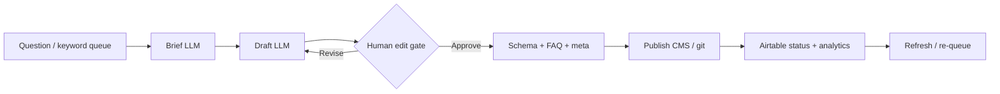

# The AI Content Pipeline That Publishes 30 SEO Articles a Month Without Burning Out

**Automating content creation with AI means wiring a staged pipeline—brief → draft → human edit → schema/FAQ → publish—so models do the volume work and humans own judgment, claims, and brand.** Thirty SEO articles a month is not a prompt problem. It is an operations problem: queue management, QA gates, model routing, and a cadence your team can sustain for a year.

I'm William Spurlock — AI Solutions Architect and Fractional AI CTO. I run a daily publishing engine on this site and build the same class of systems for founders and growth teams who need content output without hiring a ten-person editorial department. This pillar is the mechanism-level playbook: architecture, tools, stages, QA gates, and the math behind ~30 posts/month.

If you already run a sibling loop for email, see [how to build an AI-powered newsletter that writes and sends itself](/blog/how-to-build-an-ai-powered-newsletter-that-writes-and-sends-itself). For tool host choice, see [n8n vs Make vs Zapier in 2026](/blog/n8n-vs-make-vs-zapier-in-2026-which-automation-tool-is-right-for-your-business). For the content strategy layer that feeds this pipeline, see [the AI visibility content strategy](/blog/the-ai-visibility-content-strategy-writing-for-humans-and-answer-engines) and [the question-first content model](/blog/the-question-first-content-model-that-gets-you-cited-by-ai).

---

## How do I automate content creation with AI?

**You automate content creation by treating each article as a ticket that moves through fixed stages with machine work and human gates—not by pasting a keyword into ChatGPT and hoping the CMS publish button feels lucky.** The winning shape in 2026 looks like a factory: inputs (questions, keywords, cluster maps), transforms (briefs, drafts, schema), inspection (edit + claims), and shipping (CMS/git deploy).

### The factory metaphor that actually maps to ops

| Factory concept | Content pipeline equivalent |
| :--- | :--- |
| **Raw materials** | Question bank, keyword list, SERP notes, internal links, brand voice rules |
| **Work order** | Airtable (or Notion) Post row with status, slug, date, cluster, primary query |
| **Station 1** | Brief generation (outline, H2s, FAQ list, entities, claims checklist) |
| **Station 2** | Draft generation (model write into markdown/CMS) |
| **Station 3** | Human edit + claims gate |
| **Station 4** | Schema / FAQ / meta packaging |
| **Shipping dock** | Publish + Airtable status flip + internal link audit |
| **Quality lab** | Rank/citation checks, refresh queue, failure alerts |

If any station is "whoever feels like it this week," you do not have a pipeline. You have a vibe.

### Reference architecture (mid-2026)



| Layer | Job | Typical tools |
| :--- | :--- | :--- |
| **Source of truth** | Schedule, status, questions, claims | Airtable (`WS Blog` style base) |
| **Orchestration** | Move tickets, call models, write files | n8n (primary), Make for lighter stacks |
| **Authoring IDE** | Long-form draft + repo edits | Cursor + skill/rules files |
| **Draft models** | Volume prose | Claude Sonnet 5, Gemini 3.5 Flash, GPT-5.4 mini |
| **Edit / hard sections** | Brand, claims, architecture | Claude Opus 4.8, GPT-5.5, Gemini 3.1 Pro |
| **Research assist** | SERP notes, source pulls | Firecrawl, search APIs, internal docs |
| **Publish** | Site artifact | Markdown under `content/blog/`, CMS API, or headless |
| **Observe** | Rankings, citations, failures | GSC, analytics webhooks → Airtable |

### The five stages you must not skip

1. **Brief** — Primary query, H2 questions, FAQ list, entities, internal link targets, claims to source.
2. **Draft** — Full article from the brief, answer-first H2s, tables where comparisons exist.
3. **Human edit** — Voice, accuracy, banned AI-tells, no invented stats, link verification.
4. **Schema / FAQ packaging** — FAQ H3s that render FAQPage JSON-LD, meta, OG, entity clarity.
5. **Publish** — Ship the artifact, flip Airtable to Published, schedule the next ticket.

Skip stage 1 and drafts wander. Skip stage 3 and you ship confident nonsense. Skip stage 4 and you leave citation-ready structure on the table. Skip stage 5 discipline and your "pipeline" becomes a folder of drafts nobody ships.

### What "automation" owns vs what humans own

| Owns | Machine | Human |
| :--- | :--- | :--- |
| Pull next Queued post from Airtable | Yes | No |
| Generate brief from TargetQuestions | Yes | Spot-check |
| First draft markdown | Yes | No (unless brand is ultra-sensitive) |
| Claims sourcing / hedge decisions | Assist | Final call |
| Voice pass + banned-word scrub | Assist | Final call |
| Internal link disk-verification | Script + human | Confirm |
| Cover image generation | Yes | Approve aesthetic |
| CMS/git publish | Yes (after approve) | Approve button |
| Strategy: which clusters to prioritize | Suggest | Decide |

**Opinion:** If your "AI content automation" has no human edit gate, you are not building a publishing system. You are building a spam cannon with better grammar.

### Minimum viable pipeline (2 weeks to first ship)

Week 1:

1. Stand up Airtable tables: Posts, Questions, Schedule, Claims (or equivalent).
2. Define statuses: `Queued` → `In Progress` → `Edit` → `Published` → `Refresh`.
3. Write a brief prompt + draft prompt that force JSON/markdown schemas.
4. Wire n8n: Cron or webhook → fetch next Queued row → call model → write draft to Notion/Drive/git branch.

Week 2:

5. Add Slack/email approval with Approve / Revise / Kill.
6. Add FAQ + meta generation step.
7. Add publish step (CMS API or PR merge).
8. Add failure alerts + idempotency keys so retries do not double-publish.

That is enough to ship. Scale comes from queue depth and editor hours, not from a prettier prompt.

---

## Can AI write my blog posts automatically?

**Yes—AI can draft complete posts on a schedule—but "automatically" only works when you define auto as "machine-generated draft + required human approve," not "model presses Publish alone."** Fully unattended generative publishing is how brands get hallucinated product claims, thin SERP clones, and Google quality problems.

### What automatic actually means in production

| Mode | What runs without a human | When I use it |
| :--- | :--- | :--- |
| **Draft-auto** | Brief + first draft | Default for most B2B / SEO programs |
| **Assist-auto** | Research pull + outline only | Regulated niches, legal, medical-adjacent |
| **Ship-auto** | Publish after approve token | Mature pipelines with trusted editors |
| **Full-auto** | Model publishes with no gate | Almost never for public SEO brand content |

Full-auto is acceptable for a few narrow cases: changelog digests that only restate committed release notes, internal knowledge base stubs, or sandbox blogs you treat as experiments. It is not acceptable for client-facing SEO pillars with revenue claims.

### The human minutes budget (this is the burnout math)

Thirty posts/month sounds impossible until you stop writing from a blank page.

| Role | Minutes per post (mature pipeline) | Notes |
| :--- | :--- | :--- |
| Brief review | 5–10 | Mostly accept/amend H2s |
| Draft skim + structural fix | 15–25 | Headings, tables, missing sections |
| Claims / accuracy pass | 10–20 | Kill unsourced numbers |
| Voice + banned-word pass | 10–15 | Faster with lint scripts |
| Link + schema check | 5–10 | Automate what you can |
| Cover approve | 2–5 | GenerateImage then glance |
| **Total human** | **~50–85 min** | vs 4–8 hours blank-page writing |

At 60 minutes average × 30 posts = **30 human hours/month**. That is one half-time editor equivalent—not a five-writer agency. Burnout happens when teams keep the blank-page process and bolt a chatbot onto it.

### Prompt contract that keeps drafts shippable

I force drafts into a fixed contract. Example prompt skeleton for an n8n AI node or Cursor skill:

```markdown
You are drafting a blog post for {{brand}}.
Register: AI Solutions Architect — mechanism-level, specific, no fluff.
Primary query: {{primary_query}}
Target H2 questions (answer each; bold lead answer first):
{{h2_list}}
FAQ H3 questions (2–4 sentence answers; bold lead fact):
{{faq_list}}
Internal links allowed (ONLY these slugs; format (/blog/<slug>)):
{{verified_slugs}}
Banned words (never use in prose): delve, leverage, seamless, cutting-edge,
state-of-the-art, game-changer, robust solution, holistic, streamline, utilize,
empower, unleash, "to summarize", "in conclusion", standalone "dynamic".
Models you may mention: Claude Opus 4.8, Claude Sonnet 5, Gemini 3.1 Pro,
Gemini 3.5 Flash, GPT-5.5, GPT-5.4 mini, Llama 4. Never use retired 2024–2025 model names.
Claims rule: no naked statistics without a source URL or an explicit hedge.
Output: full markdown with camelCase frontmatter fields as specified.
```

That contract is what makes "AI wrote it" compatible with "humans can edit it in under an hour."

### Failure modes I see every quarter

1. **SERP cloning** — Draft mirrors the top 5 results with no original mechanism. Fix: require one opinion + one architecture table per H2.
2. **Invented benchmarks** — Model invents "47% CTR lift." Fix: Claims table + reject gate.
3. **Orphan drafts** — Beautiful markdown that never hits the CMS. Fix: Airtable status ownership + weekly publish SLO.
4. **Link rot inside drafts** — Links to posts that do not exist. Fix: disk-verify or allowlist slugs only.
5. **Model name drift** — Prompts still list retired mid-decade model names. Fix: pin the current model table in the skill/system prompt.
6. **Editor as rewriter** — Human rewrites 80% because brief was garbage. Fix: improve brief stage before blaming the draft model.

### Can AI write *your* posts automatically?

If you have:

- a question bank or keyword map,
- a brand voice doc,
- a human who will spend ~1 hour/post,
- and a publish path that is not tribal knowledge,

then yes. If you have none of those, AI will accelerate chaos.

---

## What is the best AI tool for automated SEO content in 2026?

**There is no single best AI tool for automated SEO content in 2026—there is a best stack: Airtable (or equivalent) as source of truth, n8n as orchestrator, Cursor for long-form repo authoring, and a model roster of Claude Sonnet 5 / Opus 4.8, Gemini 3.5 Flash / 3.1 Pro, and GPT-5.4 mini / GPT-5.5.** "Best tool" shopping is how teams buy another SaaS seat and still publish four posts a month.

### Tool scorecard (use this, not vendor landing pages)

| Job | Winner on my builds | Runner-up | Avoid for volume SEO |
| :--- | :--- | :--- | :--- |
| Queue + editorial SoT | Airtable | Notion databases | Spreadsheets with no status API |
| Workflow host | n8n | Make (lighter volume) | Zapier-only for multi-step AI loops |
| Long-form in git/CMS repos | Cursor | Claude Code for long horizons | Chat UI copy-paste forever |
| Cheap/fast drafts | Claude Sonnet 5, Gemini 3.5 Flash, GPT-5.4 mini | Llama 4 (self-host / privacy) | Random "SEO writer" wrappers with stale models |
| Hard edit / architecture | Claude Opus 4.8, GPT-5.5, Gemini 3.1 Pro | — | Using Flash-class models for final brand voice |
| Research fetch | Firecrawl + APIs | Manual SERP notes | Uncited web browse hallucinations |
| Cover images | Image gen in pipeline | Designer batch | Stock photo graves |
| Rank / refresh signal | GSC + your own citation checks | Third-party rank tools | Vanity dashboard with no re-queue |

### Model routing I actually use

| Stage | Primary | Fallback | Why |
| :--- | :--- | :--- | :--- |
| Brief JSON | Gemini 3.5 Flash or GPT-5.4 mini | Claude Sonnet 5 | Structured, cheap, fast |
| Draft (spokes) | Claude Sonnet 5 | Gemini 3.5 Flash | Voice + instruction following |
| Draft (pillars) | Claude Opus 4.8 or GPT-5.5 | Claude Sonnet 5 + human expand | Long coherence |
| Claims / skepticism pass | GPT-5.5 or Gemini 3.1 Pro | Claude Opus 4.8 | Different model catches different confabulations |
| Meta + FAQ compression | Gemini 3.5 Flash | GPT-5.4 mini | Short-form is fine on Flash |
| On-prem / sensitive | Llama 4 | — | When data cannot leave the VPC |

### Why "all-in-one SEO AI writers" usually lose

They optimize for demo screenshots: keyword in → article out. Production SEO needs:

- cluster ownership (no cannibalization),
- parent pillar linkage,
- FAQ schema,
- internal link graphs,
- refresh loops,
- human approval audit trails,
- model upgrades without rewriting the product.

An all-in-one tool that locks you into last year's model names and a closed CMS is a ceiling, not a foundation. Build the pipeline around APIs you control.

### n8n vs Make vs Zapier for this specific job

Short version (full comparison lives in the [n8n vs Make vs Zapier 2026 guide](/blog/n8n-vs-make-vs-zapier-in-2026-which-automation-tool-is-right-for-your-business)):

| Need | Pick |
| :--- | :--- |
| 20–40 posts/month, branching, retries, self-host option | **n8n** |
| Marketing ops owner, <10 posts/month, visual scenarios | **Make** |
| Simple "new Airtable row → Slack ping" glue | **Zapier** is fine as glue, not as the brain |

For a 30-post cadence with AI loops, I default to n8n.

### Cursor's role (people underuse this)

Cursor is not "just a coding IDE" in this stack. For markdown-first sites (like this one), Cursor + skills/rules is the authoring surface:

- Skills encode voice, frontmatter contract, link rules, model currency.
- Agents draft into the correct path under `content/blog/YYYY/MM/`.
- Validation scripts (`validate-blog-frontmatter`, `audit-blog-links`) run before push.
- Airtable sync scripts close the loop (`blog-sync.mjs push`).

That is how you get mechanism-level consistency across hundreds of posts without a style guide PDF nobody opens.

---

## Pipeline stages in depth: brief → draft → edit → schema → publish

**If you only remember one diagram from this pillar, remember the five-stage handoff with explicit artifacts at each gate.** Below is the operating manual.

### Stage 1 — Brief

**Artifact out:** Brief JSON (or Notion/Airtable rich text) with primary query, H2s, FAQs, entities, link allowlist, claims checklist.

Brief fields I require:

```json
{
  "slug": "example-post-slug",
  "primaryQuery": "How do I automate content creation with AI?",
  "h2Questions": ["...", "...", "..."],
  "faqQuestions": ["...", "..."],
  "entities": ["n8n", "Airtable", "Claude Sonnet 5"],
  "internalLinkAllowlist": [
    "how-to-build-an-ai-powered-newsletter-that-writes-and-sends-itself"
  ],
  "claimsToSource": [
    "Any traffic % or ranking claim"
  ],
  "serviceTrack": "ai-automation",
  "pillarPost": false,
  "targetLines": 400
}
```

Brief QA gate:

- [ ] Primary query is unique vs other Published posts
- [ ] Every H2 is a real question someone searches
- [ ] Internal links verified on disk before draft starts
- [ ] Claims list is non-empty if the draft will include numbers

### Stage 2 — Draft

**Artifact out:** Full markdown with frontmatter + body.

Draft rules that save editor hours:

1. Lead every H2 with a **bold 1–2 sentence answer**.
2. One structured element (table, list, mermaid, or prompt/config block) per major section.
3. No code tutorials unless they are n8n/MCP/schema/prompt configs.
4. Length targets: spokes 400–600 lines; pillars 600–1000+.
5. Model must refuse unsourced hard stats.

Draft QA gate (automated where possible):

- [ ] Frontmatter camelCase complete
- [ ] No banned AI-tell words (script)
- [ ] No stale model names (grep)
- [ ] Word count / line count within band
- [ ] Cover path matches slug

### Stage 3 — Human edit

**Artifact out:** Approved markdown + ClaimsValidated = true (when claims exist).

Editor checklist (print this):

1. Read the first paragraph out loud. Press-release tone? Rewrite.
2. Spot-check three factual claims.
3. Confirm every `/blog/<slug>` target exists.
4. Kill generic CTAs; match `serviceTrack`.
5. Ensure FAQ answers are 2–4 sentences with a bold lead fact.
6. Approve or send back with structured revision notes (not "make it better").

Revision notes format that models understand:

```text
REVISE:
- H2 "Can AI write..." paragraph 2 invents a 40% figure — remove or source
- Add table comparing draft-auto vs ship-auto
- Replace closing CTA with AI automation strategy call → /contact
```

### Stage 4 — Schema / FAQ / meta

**Artifact out:** FAQ H3s present, seoTitle/seoDescription filled, entities listed, OG image path set.

Why this stage is separate: draft models under-invest in packaging. A dedicated compression pass (Flash-class model) is cheaper and cleaner.

Packaging checklist:

- [ ] `seoTitle` < 60 chars where possible
- [ ] `seoDescription` ~150–160 chars
- [ ] `aioTargetQueries` mirrors real H2/FAQ questions
- [ ] ≥2 FAQ H3s for FAQPage JSON-LD emission
- [ ] `coverImage` exists under `public/images/blog/`

### Stage 5 — Publish

**Artifact out:** Live URL + Airtable Published + Schedule date marked.

Publish sequence I use on markdown sites:

1. Validation scripts pass.
2. Cover committed.
3. `blog-sync.mjs push --slug=...` (or CMS publish API).
4. Spot-check live URL + FAQ schema in view-source / rich results test when stakes are high.
5. Move next Queued item to In Progress for tomorrow.

Idempotency rule: publish actions key on `slug + content hash`. Retries must not create duplicates.

---

## Cadence design for ~30 SEO articles a month

**Thirty posts a month is ~1 post/day with weekends optional, or ~1.5 posts/weekday—either way, the constraint is editor hours and queue quality, not model tokens.** Design the calendar before you buy more AI credits.

### Throughput math

| Cadence | Posts/month | Editor hours @ 60 min | Notes |
| :--- | :--- | :--- | :--- |
| 1/day | ~30 | ~30h | Sustainable with one trained editor |
| 5/week | ~20–22 | ~20–22h | Good for smaller teams |
| 2/day | ~40–60 | 40–60h | Needs two editors or tighter briefs |
| Pillar-heavy weeks | fewer posts, more lines | same hours | Trade count for depth |

### Weekly operating rhythm

| Day | Machine work | Human work |
| :--- | :--- | :--- |
| **Sunday** | Generate next week's briefs from Queued questions | Approve / amend briefs (60–90 min) |
| **Mon–Fri AM** | Draft 1–2 posts overnight / morning batch | Edit + approve morning drafts (2–3h) |
| **Mon–Fri PM** | Package schema/meta + cover gen | Final publish click + spot checks (30–60 min) |
| **Friday** | Refresh candidates from GSC losers | Pick 2–3 URLs for refresh queue |
| **Monthly** | Cluster cannibalization report | Kill/merge overlapping PrimaryQueries |

### Queue depth rules

- Keep **14–21 days** of Queued briefs ready. Less = panic. More = stale SERP assumptions.
- Cap **In Progress** at 3–5 items so WIP does not hide blockers.
- Separate **Pillar** slots (1–2/month) from **Spoke** slots (the rest). Pillars eat editor hours differently.

### Airtable fields that make cadence real

Minimum Post fields:

- `Status`, `Date`, `Slug`, `PrimaryQuery`, `Part`, `Category`, `ContentCluster`
- `PillarPost`, `ParentPillar`, `ServiceTrack`
- `TargetQuestions`, `FAQQuestions`, `ClaimsValidated`
- `FilePath`, `WordCount`, `CoverImage`, `LastModified`

If Status is a free-text vibe field, your cadence will lie to you.

### Burnout prevention (ops, not wellness posters)

1. **Hard WIP limits.** No "just one more draft" beyond the daily cap.
2. **Template the edit.** Checklists beat heroic rereads.
3. **Rotate claim-heavy posts.** Do not schedule five data posts on the same day.
4. **Refresh days count as content days.** Updating old posts is part of the 30, not extracurricular. Pair with [refreshing old content for the AI era](/blog/refreshing-old-content-for-the-ai-era-a-practical-framework).
5. **Kill vanity metrics in the war room.** Published count matters; "AI words generated" does not.

---

## QA gates: the difference between a pipeline and a content firehose

**QA gates are binary checkpoints that can fail a ticket back to a previous stage—without them, automation only accelerates publishing mistakes.** Here is the gate stack I install.

### Gate 0 — Intake

Fail if:

- PrimaryQuery duplicates an existing Published post
- Cluster/parent pillar missing on spokes
- No TargetQuestions linked

### Gate 1 — Brief

Fail if:

- Fewer than 3 H2 questions
- Internal link allowlist includes missing files
- ServiceTrack CTA mismatch vs intended offer

### Gate 2 — Draft lint

Fail if:

- Banned words present
- Stale model names present
- Frontmatter casing wrong / draft: true accidentally
- Body under minimum lines for post type

### Gate 3 — Human approve

Fail if:

- Editor selects Revise or Kill
- ClaimsValidated false while claims exist

### Gate 4 — Pre-publish

Fail if:

- `audit-blog-links` reports problems
- Cover image missing
- FAQ count < 2 when FAQPage expected

### Gate 5 — Post-publish observe

Not a blocker—creates tickets:

- Indexing errors
- Sharp ranking drops → refresh candidate
- Citation absence on target queries after N weeks → brief rewrite

### Example n8n gate node logic (conceptual)

```json
{
  "name": "Draft Lint Gate",
  "type": "n8n-nodes-base.if",
  "parameters": {
    "conditions": {
      "boolean": [
        { "value1": "={{$json.bannedWordCount}}", "operation": "equal", "value2": 0 },
        { "value1": "={{$json.staleModelCount}}", "operation": "equal", "value2": 0 },
        { "value1": "={{$json.lineCount}}", "operation": "largerEqual", "value2": 250 }
      ]
    }
  }
}
```

Wire the `false` branch back to Draft with the lint report attached. Do not Slack the editor for machine-detectable failures.

---

## Keyword research and briefs: automating the front of the funnel

**You can automate keyword research and brief creation by scoring questions against cluster maps and SERP features, then emitting a structured brief—humans still choose which clusters deserve budget.** The automation removes spreadsheet slavery; it does not remove strategy.

### Inputs that beat "dump Ahrefs into GPT"

1. **Question bank** organized by Part/Category (AI Visibility / Automation / Agents).
2. **Existing Post PrimaryQueries** for cannibalization checks.
3. **Search Console queries** you already almost rank for (positions 4–20).
4. **Sales/call transcripts** — real buyer language beats tool keyword difficulty scores alone.
5. **Competitor URL samples** — for gap finding, not for cloning.

### Automated brief scoring rubric

| Signal | Weight | Notes |
| :--- | :--- | :--- |
| Fits active cluster | High | Prefer depth over random topics |
| Cannibalization risk | High (negative) | Block near-duplicate PrimaryQuery |
| SERP is answerable with experience | Medium | Prefer questions you can answer with receipts |
| Business track alignment | High | Visibility vs Automation vs Agents CTA fit |
| Refresh vs new | Medium | Sometimes refresh wins over new URL |

### Brief generation prompt (compressed)

```markdown
Given unused questions + existing primary queries + cluster map,
propose the next spoke OR pillar brief.
Return JSON with: primaryQuery, h2Questions[3-5], faqQuestions[~8],
parentPillar, serviceTrack, whyNow (2 sentences), risks (cannibalization).
Do not invent search volumes. If volume unknown, omit.
```

### What to keep human at the front

- Annual/quarterly cluster bets
- Offers and CTAs tied to service tracks
- Anything that could create legal/compliance exposure
- "Should we publish this under our brand at all?"

---

## Refresh loops: AI that updates old posts instead of only creating new ones

**A mature AI content pipeline spends a fixed share of capacity refreshing aging URLs—new posts alone create a graveyard.** Automating refreshes means detecting decay, drafting a diff-oriented update, and re-running QA gates.

For the full framework, use [refreshing old content for the AI era](/blog/refreshing-old-content-for-the-ai-era-a-practical-framework). The pipeline integration looks like this:

| Step | Automation | Human |
| :--- | :--- | :--- |
| Detect decay (traffic, position, outdated models) | GSC export → n8n score | Confirm priority |
| Generate refresh brief (what changed since lastModified) | LLM | Approve scope |
| Draft surgical update (not full rewrite by default) | LLM | Edit |
| Update lastModified + claims | Script | Approve |
| Re-push / re-index request | Script | Spot-check |

### Refresh triggers worth automating

- Model names older than current allowlist
- Stats older than 12–18 months without hedges
- Broken internal links
- Missing FAQ section on high-traffic URLs
- Primary query now dominated by AI Overview SERPs (needs answer-first rewrite)

### Capacity split I recommend

| Bucket | Share of monthly posts |
| :--- | :--- |
| New spokes | 60–70% |
| Pillars / major guides | 5–10% |
| Refreshes | 20–30% |

If refreshes are "when we have time," they never happen.

---

## Can AI content actually rank — and get cited?

**Yes, AI-assisted content can rank and get cited when it is answer-first, entity-clear, experience-backed, and operated under quality gates—Google and answer engines reward pages that resolve questions, not pages that brag about being written by hand or by AI.** The failure mode is unedited commodity text at scale.

### What still matters in mid-2026

| Factor | Still matters? | Pipeline implication |
| :--- | :--- | :--- |
| Clear answer near the top of sections | Yes | Enforce bold lead answers in draft contract |
| Topical cluster depth | Yes | Airtable clusters + parent pillars |
| Technical crawl/index health | Yes | Separate from writing automation |
| Original experience / opinions | Yes | Human edit must add or preserve receipts |
| Thin spun duplicates | Negative | Similarity checks / editor kill power |
| FAQ + schema | Yes | Dedicated packaging stage |
| Entity consistency | Yes | `entityMentions` + same names sitewide |
| AI-generated disclaimer theater | No | Do not waste the lede on "this was written with AI" |

### Alignment with answer engines

Your pipeline should produce pages that work for classic SEO *and* AI Overviews / answer engines. That means:

- question-shaped H2/H3s,
- concise definitions,
- tables for comparisons,
- citeable facts with sources when you state hard numbers,
- internal links to supporting spokes.

Pair this pillar with [the question-first content model](/blog/the-question-first-content-model-that-gets-you-cited-by-ai) and [the AI visibility content strategy](/blog/the-ai-visibility-content-strategy-writing-for-humans-and-answer-engines) so the automation layer is fed by a strategy layer—not the other way around.

### Honest limits

- AI will not invent domain authority.
- AI will not fix a site that cannot be crawled.
- AI will not replace subject-matter expertise in YMYL niches without heavy human control.
- AI will not make a confused offer coherent. Fix positioning first.

---

## Reference stack: wiring Airtable + n8n + Cursor

**The production pattern is Airtable as editorial brain, n8n as nervous system, Cursor as hands on the repo—models are interchangeable workers behind API nodes.** Here is a concrete wiring sketch.

### Airtable → n8n

Trigger options:

1. **Cron** every morning: fetch `Status = Queued` sorted by Date, limit 1–2.
2. **Webhook** when Status flips to `In Progress`.
3. **Button** in Airtable interface for manual runs.

n8n pulls:

- slug, title, primaryQuery, target questions, cluster, serviceTrack, pillar flag

### n8n → model → artifact

1. Build brief (or load human-approved brief).
2. Call draft model with contract prompt.
3. Write file to git branch / CMS draft.
4. Run lint commands.
5. Notify Slack with preview + Approve buttons.

### Human → Cursor (when the site is markdown-first)

For pillars and sensitive posts, I often keep draft generation *inside* Cursor with the authoring skill, then use n8n for queue, reminders, refresh detection, and Airtable push. Hybrid is fine. Purity is not the goal—ship rate with quality is.

### n8n → Airtable push

On publish:

- Status = Published
- FilePath, WordCount, ReadingTime, CoverImage, Excerpt, LastModified
- Flip linked Questions to Published
- Mark Schedule date complete

This site's `blog-sync.mjs` is that sync contract. Your CMS may use native APIs; the field names change, the loop does not.

### Observability fields worth logging

| Event | Log where |
| :--- | :--- |
| Model + token usage per stage | Airtable or warehouse |
| Lint fail reasons | n8n execution data |
| Editor approve latency | Timestamp delta |
| Publish success/fail | Airtable + alert |
| Post-publish indexing | Weekly rollup |

---

## Team roles for a 30-post machine

**You do not need a newsroom. You need clear ownership across four seats—even if two seats are the same person on different days.**

| Seat | Owns | Does not own |
| :--- | :--- | :--- |
| **Strategist** | Clusters, PrimaryQueries, offer/CTA mapping | Line edits |
| **Pipeline engineer** | n8n, Airtable fields, lint scripts, model routing | Brand voice taste |
| **Editor** | Approve/revise/kill, claims, voice | Building workflows |
| **SME (as needed)** | Fact review on hard topics | Daily queue ops |

Solo operators (me, often): wear all four hats but timebox them. Strategy on Fridays. Editing in morning blocks. Engineering when the pipeline breaks—not during every draft.

### RACI for a single article

| Activity | Strategist | Engineer | Editor | SME |
| :--- | :--- | :--- | :--- | :--- |
| Pick question cluster | A | C | C | C |
| Brief approve | C | I | A | C |
| Draft generate | I | A (system) | I | I |
| Edit approve | I | I | A | C |
| Publish | I | A/C | A | I |
| Refresh decide | A | C | C | I |

A = accountable, C = consulted, I = informed.

---

## Cost shape (tokens, tools, humans)

**Token cost is usually the smallest line item once you hit 30 posts/month; editor time and tool sprawl dominate.** Still, route models on purpose.

### Rough unit economics (order-of-magnitude, mid-2026)

| Item | Per post (spoke) | Notes |
| :--- | :--- | :--- |
| Brief tokens | Low | Flash / mini class |
| Draft tokens | Medium | Sonnet / Flash class |
| Edit pass tokens | Low–medium | Only on revise |
| Image gen | Low–medium | One cover |
| Human edit | Highest | 50–85 minutes |
| Tool seats | Amortized | n8n + Airtable + Cursor |

Pillars cost more tokens and more editor minutes. Budget them explicitly.

### Cost control tactics

1. Do not use Opus/GPT-5.5 for every spoke draft.
2. Cache brand voice + banned lists in the system prompt; do not resend giant histories.
3. Reject at lint *before* human time.
4. Prefer refresh over new URL when the SERP is already yours to lose.
5. Cap parallel model calls to avoid retry storms.

---

## Implementation blueprint: first 30 days

**Ship a thin pipeline in week 1–2, hit a steady 1.0 post/day by week 4, and only then add fancy agents.** Most teams invert this and never publish.

### Days 1–7 — Foundations

- Airtable schema live
- Voice doc + banned list in one canonical file
- One draft prompt + one brief prompt
- Manual publish path works

### Days 8–14 — First automation

- n8n pulls Queued → drafts → Slack approve
- Lint scripts in CI or local pre-push
- Three real posts shipped through the loop

### Days 15–21 — Packaging + covers

- FAQ/meta pass automated
- Cover generation hooked
- Airtable push on publish

### Days 22–30 — Cadence lock

- Daily SLO: 1 approved publish on weekdays
- Friday refresh slot
- Retro: where did editor minutes go? Fix that stage

### Exit criteria for "we have a pipeline"

- [ ] 10+ posts shipped through the same statuses
- [ ] Mean editor time < 90 minutes/post
- [ ] Zero publishes with broken internal links in the last 10
- [ ] Model roster documented and current
- [ ] Someone besides the founder can approve a draft using the checklist

---

## Anti-patterns (steal these for your kill list)

| Anti-pattern | Why it fails | Replace with |
| :--- | :--- | :--- |
| One mega-prompt "write a 2000 word SEO blog" | No stages, no gates | Five-stage pipeline |
| Ten SEO tools + no SoT | Status lies | Airtable (or one DB) as brain |
| Publishing straight from chat UI | No audit trail | Artifact in CMS/git + status |
| Measuring words generated | Vanity | Published + indexed + useful |
| No refresh budget | Decay | 20–30% capacity |
| Identical CTA on every track | Confused conversion | serviceTrack-matched CTA |
| Ignoring cannibalization | Rankings fight themselves | PrimaryQuery uniqueness gate |
| Stale model names in prompts | Silent quality drop | Quarterly model table update |

---

## FAQ

### How do I build an AI content pipeline for my website?

**Start with a source-of-truth queue (Airtable), a five-stage flow (brief → draft → human edit → schema/FAQ → publish), and an orchestrator (n8n) that moves one ticket at a time through lint and approval gates.** Do not begin with agent swarms. Ship three posts through a boring loop, then automate the handoffs you trust.

### Can I automate keyword research and content brief creation with AI?

**Yes—score unused questions against your cluster map, cannibalization list, and GSC opportunities, then emit a structured brief JSON for human approve.** Keep strategy (which clusters get budget) human. Automate the spreadsheet grind, not the bet.

### How do I use AI to automatically update old blog posts for SEO?

**Detect decay with GSC/position/model-staleness signals, generate a refresh brief, draft a surgical update, re-run QA gates, and bump `lastModified`.** Treat refreshes as first-class calendar slots. Details: [refreshing old content for the AI era](/blog/refreshing-old-content-for-the-ai-era-a-practical-framework).

### Can AI generate content that actually ranks on Google?

**AI-assisted pages rank when they are answer-first, clustered, technically healthy, and human-edited for experience and accuracy—commodity unedited AI text at scale usually does not.** Automation raises throughput; it does not replace topical authority or crawl health.

### How many human hours does a 30-post month really take?

**Plan ~25–40 editor hours/month once briefs and linting are mature—roughly 50–85 minutes per post—not the 120+ hours blank-page writing would consume.** If you are over 2 hours/post after month two, your brief stage or voice contract is broken.

### Should I use Claude, Gemini, or GPT for SEO drafts?

**Use Claude Sonnet 5 or Gemini 3.5 Flash for most drafts, escalate to Claude Opus 4.8 / GPT-5.5 / Gemini 3.1 Pro for pillars and hard edits, and keep GPT-5.4 mini for cheap structured steps.** Multi-model routing beats loyalty to one logo.

### Where does Cursor fit if n8n already calls the model?

**Cursor shines for markdown-first repos, skill-enforced voice/frontmatter, and multi-file fixes; n8n shines for schedule, integrations, and approvals.** Many production stacks use both: Cursor for authoring quality, n8n for ops glue.

### What QA checks should block publish automatically?

**Block on banned AI-tell words, stale model names, broken internal links, missing cover, failed frontmatter contract, and missing human approval token.** Soft-fail (ticket only) on post-publish ranking decay and citation gaps.

### How do I keep AI drafts from cannibalizing each other?

**Enforce a unique PrimaryQuery per Published post, assign ParentPillar on spokes, and reject briefs that overlap existing queries above a similarity threshold.** Clusters exist to prevent your own library from competing with itself.

### Do I need a separate pipeline for newsletters vs blog posts?

**Share the research → draft → approve → deliver shape, but keep separate workflows, prompts, and ESPs/CMS targets—newsletter cadence and blog SEO constraints differ.** The [AI newsletter pipeline guide](/blog/how-to-build-an-ai-powered-newsletter-that-writes-and-sends-itself) is the email sibling of this pillar.

---

## Build the factory, not another prompt

If you want ~30 SEO articles a month without burning out, stop hunting for a magic writer tool. Install a factory: Airtable for the queue, n8n for the handoffs, Cursor for repo-quality drafts, current models for volume and edits, and humans for judgment.

I design and ship these systems as part of AI Automation + Growth work—editorial Airtable bases, n8n content workflows, lint gates, and model routing your team will actually run. If you want this mapped onto your CMS, brand voice, and monthly capacity, [book an AI automation strategy call](/contact) and bring: your current publishing tool, how many posts you ship today, and one URL you are proud of. We will sketch the stage map and WIP limits before anyone writes a prompt.
