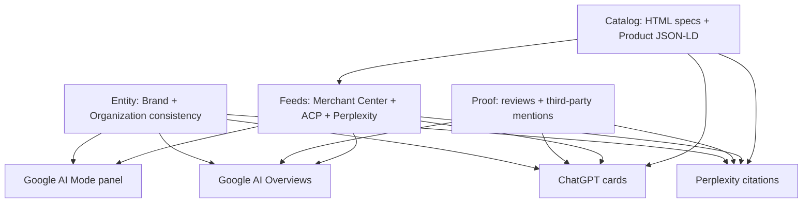

# AI Visibility for E-commerce: Getting Your Products Recommended by AI

**AI recommends your products when it can verify them as real SKUs with extractable facts — identifiers, price, stock, reviews, and a brand entity that matches across the web.** Pretty storefronts without a machine-readable catalog get skipped. The engines do not "browse" your theme. They pull product records, merchant feeds, and third-party corroboration, then name a shortlist.

I'm William Spurlock — founder, AI Solutions Architect, and Fractional AI CTO. I've built 500+ automations, spent **20,000+ hours** architecting agentic systems, and helped clients delete **35,000+ hours** of busywork. I've also shipped hundreds of production websites and been SEO-certified since 2021 (now AEO / AIO / GEO). This post is the Category 8 pillar for ecommerce AI visibility: the umbrella for getting products *recommended*, not just ranked.

Three spokes already cover the deep cuts. Do not treat this page as a rewrite of those:

| Spoke | What it owns | When to read it |
|---|---|---|
| [Why AI shopping assistants skip your store](/blog/why-ai-shopping-assistants-skip-your-store-and-how-to-fix-it) | Failure modes and the skip diagnosis | You already have a store and nothing shows up |
| [How to get products mentioned in Google AI Overviews](/blog/how-to-get-your-products-mentioned-in-google-ai-overviews) | PDP copy, conversion math, Overview mentions | Google shopping answers are the money surface |
| [Product schema for AI catalogs](/blog/product-schema-for-ai-making-your-catalog-machine-readable) | JSON-LD fields, identifiers, Amazon-as-data-source | Your catalog is HTML cards with no Product markup |

This pillar answers the three buyer questions I hear on ecommerce audits, then maps ChatGPT vs Perplexity vs Google AI Mode vs AI Overviews so you stop treating "AI shopping" as one channel.

---

## How do I get my products recommended by AI?

**You get products recommended by making every money SKU extractable, feed-synced, review-backed, and entity-consistent — then testing the exact prompts buyers type into ChatGPT, Perplexity, and Google.** Recommendation is a retrieval problem, not a brand-story problem. If a model cannot load your offer as facts, it will recommend a denser catalog. Amazon wins by default when your page is lifestyle adjectives and a checkout button.

That is the whole job in one sentence. The rest of this section is the stack you actually ship.

### What "recommended" means in 2026

A recommendation is not a #1 blue link. It is a **named shortlist**: product name, brand, a reason, sometimes a price band, sometimes a merchant. The shopper may click. They may buy later on a brand search. They may never visit you at all. If you are not named, you are not in the consideration set.

| Surface | What a win looks like | What a miss looks like |
|---|---|---|
| ChatGPT shopping / product answers | Your SKU appears on a product card with price and a reason | "Here are some popular options" from Amazon and two marketplaces |
| Perplexity shopping | Cited product card plus a source you can click | A competitor's roundup is the only cited page |
| Google AI Mode | Your listing appears in the shopping panel as the conversation narrows | Fan-out finds your category, then fills the panel from Merchant Center competitors |
| Google AI Overviews | Brand + product mentioned inside the Overview | Overview names three substitutes; your organic listing sits below unused |

I treat that named shortlist as unpaid demand capture. You cannot buy the citation the way you buy a Product Listing Ad. You earn it with data the engine can trust.

### The four-layer recommendation stack

Every store I audit fails on at least one of these. Most fail on two.

| Layer | Job | If you skip it |
|---|---|---|
| **Catalog (on-page Product schema + attributes)** | Give the model a public API for each SKU | The engine guesses — then prefers Amazon |
| **Feed (Google Merchant Center, ChatGPT ACP, Perplexity merchant feed)** | Keep price, stock, and identifiers current at scale | Shopping graphs never ingest you |
| **Proof (reviews, roundups, affiliate mentions)** | Give the model a reason that is not your own homepage | You look like an unverified first-party claim |
| **Entity (Organization + Brand consistency)** | Make "your brand" one thing across the web | The model cannot attach SKUs to a real company |

Schema details live in [product schema for AI](/blog/product-schema-for-ai-making-your-catalog-machine-readable). The broader markup and entity layer sits in [schema, structured data, and entity SEO](/blog/schema-structured-data-and-entity-seo-the-technical-core-of-ai-visibility). This pillar stays at the operator level: what to ship, in what order, and how the engines differ.

### Layer 1 — Make the catalog extractable

A machine-readable catalog is not a PDF price list. It is a consistent product record on every product detail page (PDP):

- Visible HTML specs (not only a React drawer)
- Valid `Product` + `Offer` JSON-LD
- Stable URL per product (split variants only when the spec actually changes)
- Identifiers: SKU plus GTIN/MPN when you have them
- Honest `AggregateRating` only when reviews exist

Here is a starting JSON-LD pattern. Replace every value with your real catalog. Do not invent ratings.

```json
{
  "@context": "https://schema.org",
  "@type": "Product",
  "name": "TrailForge Wide-Fit Runner",
  "description": "Trail running shoe. Width: 2E. Drop: 8mm. Weight: 10.2 oz (men's 9). Rubber outsole for wet rock.",
  "image": "https://example.com/images/trailforge-wide-runner.jpg",
  "sku": "TF-WR-2E",
  "gtin13": "0123456789012",
  "brand": {
    "@type": "Brand",
    "name": "TrailForge"
  },
  "offers": {
    "@type": "Offer",
    "price": "149.00",
    "priceCurrency": "USD",
    "availability": "https://schema.org/InStock",
    "url": "https://example.com/products/trailforge-wide-fit-runner"
  }
}
```

The [schema.org/Product](https://schema.org/Product) spec is the field list. Google's [product structured data documentation](https://developers.google.com/search/docs/appearance/structured-data/product) is the eligibility list for rich results. Run your top 10 PDPs through the [Rich Results Test](https://search.google.com/test/rich-results) before you rewrite a single adjective.

### Layer 2 — Sync the feeds the engines actually read

On-page schema is the public record. Feeds are the bulk sync. Google said at I/O 2025 that its Shopping Graph holds more than **50 billion** product listings and refreshes more than **2 billion** of those listings every hour ([Google shopping / AI Mode update, May 2025](https://blog.google/products-and-platforms/products/shopping/google-shopping-ai-mode-virtual-try-on-update/)). That graph is not reading your homepage hero. It is reading merchant data.

Minimum feed work for a serious catalog:

1. **Google Merchant Center** with free listings enabled — this is the path into Google Shopping, AI Overviews shopping modules, and AI Mode product panels. Google now exposes an [AI performance insights](https://support.google.com/merchants/answer/17200695) report under Analytics → Products for how brands show up in AI Mode and AI Overviews (organic / free listings, not paid Shopping).
2. **Conversational attributes** in the Merchant Center spec — optional fields Google documents for AI surfaces such as AI Mode ([conversational attributes help](https://support.google.com/merchants/answer/17085370)).
3. **ChatGPT product discovery via the Agentic Commerce Protocol (ACP)** — OpenAI's [product discovery announcement](https://openai.com/index/powering-product-discovery-in-chatgpt/) describes merchants sharing product feeds so catalogs are represented inside ChatGPT. Shopify and Etsy catalogs are called out as already integrated on [ChatGPT's merchant page](https://chatgpt.com/merchants/); other merchants apply.
4. **Perplexity Merchant Program** — Perplexity's [shopping / merchant program post](https://www.perplexity.ai/hub/blog/shop-like-a-pro) is the official invitation to share live product specs so recommendations can use current details.

If price on the PDP, price in Merchant Center, and price in a ChatGPT feed disagree, the engine will distrust the sloppy source. That source is usually you.

### Layer 3 — Earn proof the model can cite

First-party pages are necessary and not sufficient. ChatGPT and Perplexity still synthesize from the open web. If the only page that names your SKU is your own PDP, you look like an advertisement talking to itself.

Proof that actually moves recommendations:

- Review themes written as text on the PDP (fit, durability, battery life) plus honest star aggregates
- Third-party roundups that name the product, not just the brand
- Retailer or affiliate pages with matching identifiers
- A comparison table *you* publish that a model can lift without inventing contrast

The skip-diagnosis version of this is in [why AI shopping assistants skip your store](/blog/why-ai-shopping-assistants-skip-your-store-and-how-to-fix-it). The owner-level version for service businesses (same proof logic, different entity) is [how to get ChatGPT and Perplexity to recommend your business](/blog/how-to-get-chatgpt-and-perplexity-to-recommend-your-business).

### Layer 4 — Make the brand one entity

A product recommendation still has to attach to a company. If your legal name, storefront name, Instagram handle, and schema `Brand` are four different strings, retrieval gets messy.

Entity hygiene for ecommerce:

- One canonical brand name in title, H1, Organization schema, and Merchant Center
- Same domain on Organization `url` and offer URLs
- Same logo file referenced in schema and social
- Same category language ("trail running shoes," not "performance footwear system") on PDP, feed, and about page

I will not pretend a cute origin story replaces GTINs. Story helps after the record exists.

### The weekly prompt test (do this before you change the theme)

Recommendation work without a prompt panel is interior decorating. Write 15–25 prompts your buyers actually type, then re-run them monthly in ChatGPT, Perplexity, Google AI Mode, and a logged-out AI Overview check.

Use this prompt as the scoring rubric (paste your category and three competitor names):

```text
You are scoring ecommerce AI visibility, not writing ads.

Category: {category}
My brand: {brand}
My hero SKU: {sku name and one-line spec}
Competitors: {comp A}, {comp B}, {comp C}

For each user prompt below, answer as you normally would for a shopper.
Then add a scorecard:
- Named my brand? yes/no
- Named my SKU? yes/no
- Named a competitor? which
- Cited a URL? which
- Reason given: spec / price / review / generic

Prompts:
1. Best {category} for {use case} under ${price}
2. {sku type} for {constraint: wide feet, BPA-free, waterproof}
3. {brand} vs {competitor} for {use case}
4. Where to buy {brand} {sku} official site
5. Alternatives to {competitor hero product}
```

Score share of shortlist, not vibes. If you are unnamed on 20 of 25 money prompts, you do not have a content problem yet. You have a catalog-and-proof problem.

### What I tell operators to ship in the first 14 days

Do not rewrite 2,000 PDPs. Pick the SKUs that already make revenue or that map to "best X under $Y" queries.

1. Validate Product JSON-LD on those PDPs (Rich Results Test).
2. Fix Merchant Center errors and turn on free listings if they are off.
3. Add a visible attribute table (material, size system, warranty, weight, constraints).
4. Publish one comparison page that a model can quote.
5. Run the prompt panel and screenshot the misses.

That sequence is boring. It is also how products start getting named.

---

## Why isn't ChatGPT recommending my online store?

**ChatGPT is not recommending your store because it cannot resolve your products as complete, corroborated records — no feed, thin PDPs, no third-party mentions, or a brand entity it has never seen attached to that category.** It is usually not a conspiracy against independents. It is a retrieval miss. OpenAI has been explicit that shopping results are organic and unsponsored; the September 2025 Instant Checkout post states product results are ranked on relevance, not paid placement ([Buy it in ChatGPT](https://openai.com/index/buy-it-in-chatgpt/)). Relevance still requires data.

If you asked ChatGPT "best {your category} under $150" this morning and got Amazon, REI, and a Wirecutter-style list, that is the system working as designed. Those sources are dense. Yours is not — yet.

### The diagnosis table I use on store audits

| Symptom | Likely cause | Fix this week |
|---|---|---|
| ChatGPT names the category and never you | No third-party corroboration; weak entity | Get one honest roundup + clean Organization/Brand schema |
| ChatGPT names a competitor SKU with specs it invents for you | Your PDP has no extractable attributes | Ship an attribute table + Product JSON-LD |
| ChatGPT names you as a brand, never a product | Catalog is not in a feed ChatGPT can use | Apply / connect ACP or Shopify/Etsy catalog path ([merchant page](https://chatgpt.com/merchants/)) |
| ChatGPT quotes a stale price | Feed drift or schema/price mismatch | Make PDP, Merchant Center, and ACP feed the same offer |
| ChatGPT recommends a marketplace listing of *your* product | Identifiers live on Amazon, not on your PDP | Publish GTIN/MPN on your official URL |
| ChatGPT says it cannot find official stock | `robots.txt` or JS-only content blocking crawlers | Allow `OAI-SearchBot` / relevant bots; render specs in HTML |

The shopping-assistant skip list is expanded in [why AI shopping assistants skip your store](/blog/why-ai-shopping-assistants-skip-your-store-and-how-to-fix-it). Use that post when you need the failure-mode catalog. Stay here for the ChatGPT-specific recommendation path.

### Training memory vs live shopping vs a storefront crawl

Owners collapse three different ChatGPT behaviors into one complaint.

| Mode | What it knows | What it cannot do for you |
|---|---|---|
| **Parametric memory** | Famous brands and products that appeared often in training | Invent your 2024 SKU if the open web never described it |
| **Search / browse** | Pages it can retrieve right now | Cite a PDP it cannot crawl or that answers nothing |
| **Shopping / ACP feed** | Structured catalog rows (images, price, key details) | Recommend a SKU that is not in the feed and not on a retrieveable page |

OpenAI's later product-discovery writeup is the one to read in 2026: they expanded ACP so merchants share feeds and promotions, and they said the first Instant Checkout version did not give merchants the flexibility they wanted — purchases complete on the merchant site while ChatGPT focuses on discovery ([Powering product discovery in ChatGPT](https://openai.com/index/powering-product-discovery-in-chatgpt/)). Plan for **discovery inside ChatGPT, conversion on your checkout**. Do not wait for an in-chat buy button to save a thin catalog.

### Why "we rank #1 for our brand name" is irrelevant

Brand-name queries are navigational. Recommendation queries are comparative:

- best trail shoe for wide feet under $150
- BPA-free 32oz bottle that keeps ice 24 hours
- quiet portable power station for van life

ChatGPT answers those by synthesizing constraints. Your homepage tagline ("gear for people who go further") supplies zero constraints. Your competitor's PDP that lists width, drop, weight, and outsole compound supplies all of them.

I have watched owners celebrate ranking for `{brand} official` while losing every "best for" prompt in their category. That is not a ranking win. That is a recommendation loss.

### Shopify is not the problem (and not a free pass)

A Shopify store can be recommended. A Shopify store can also be invisible. The platform does not decide. The payload does.

What I see on Shopify audits:

- Theme apps injected Product schema three years ago; a theme update broke the snippet; nobody retested
- Specs live in metafields that never render in HTML
- Collection pages marked up as `Product`
- Variant URLs that all share one thin description
- Merchant Center connected for ads, free listings never enabled

If you sell on Shopify or Etsy, OpenAI's merchant page says your catalog is already integrated for ChatGPT shopping discovery and no extra application is required ([ChatGPT merchants](https://chatgpt.com/merchants/)). That is distribution, not quality. A connected empty catalog is still an empty catalog.

### Third-party surfaces ChatGPT actually borrows

When ChatGPT cannot load your feed, it still has the web. The pages that show up in those answers, in my prompt panels, are boringly consistent:

1. Retailer PDPs with attribute tables (Amazon, specialty retailers)
2. Editorial roundups that compare SKUs on constraints
3. Reddit and forum threads with repeated fit/quality themes (noisy, but present)
4. Your official PDP — only when it is as extractable as the retailer page

You do not need to "win Reddit." You need enough independent pages that a retrieval pass can find your name next to a category and a constraint. One good review plus one comparison article plus a clean official PDP beats a 40-post brand blog that never mentions SKUs.

### A ChatGPT-specific week plan

| Day | Action | Done when |
|---|---|---|
| 1 | Run 15 recommendation prompts; screenshot shortlists | You have a miss list |
| 2 | Rich Results Test on the 10 SKUs that should have won | Valid Product + Offer or a punch list |
| 3 | Confirm bot access and HTML specs | View-source shows the attribute table |
| 4 | Submit or verify ChatGPT merchant / Shopify catalog path | Application sent or Shopify confirmed |
| 5 | Align prices and availability across PDP and feeds | No $10 deltas |
| 6 | Pitch or publish one third-party mention (honest review, retailer, or comparison) | A URL that is not yours names the SKU |
| 7 | Re-run the 5 highest-revenue prompts | You know if anything moved (often it will not in 7 days — you are installing the pipes) |

ChatGPT recommendations for a mid-market catalog are slower than Perplexity citations in my experience. Perplexity will often reflect a dense new page in weeks. ChatGPT shopping cards wait on feed ingestion and repeated retrieval. I treat ChatGPT as a 60–90 day surface and Perplexity as a 2–6 week surface. Those are working ranges from audits, not guarantees.

If you want the non-ecommerce (service business) version of this fight, use [how to get ChatGPT and Perplexity to recommend your business](/blog/how-to-get-chatgpt-and-perplexity-to-recommend-your-business). The proof-and-entity logic is the same. The payload here is SKUs.

---

## How does Google AI Mode handle product search queries?

**Google AI Mode handles product queries by fanning one shopping question into many sub-searches, then filling a conversational answer and a product panel from the Shopping Graph — Merchant Center listings, reviews, prices, variants, and availability — not from your homepage copy.** Google documented this shopping experience at I/O 2025: Gemini capabilities plus the Shopping Graph, query fan-out for constraints (weather, trip length, pocket access), and a product panel that updates as the shopper narrows ([Shopping on Google: AI Mode](https://blog.google/products-and-platforms/products/shopping/google-shopping-ai-mode-virtual-try-on-update/)). Google's consumer help page describes the same fan-out pattern for AI Mode in general ([AI Mode in Google Search](https://support.google.com/websearch/answer/16011537)).

If you remember one mechanic, remember **fan-out**. The shopper says "cute travel bag for Portland in May." AI Mode does not match that string to a keyword page. It explodes the question into waterproofing, carry-on size, pockets, weather, and taste, then retrieves listings that satisfy those attributes.

### Fan-out in store-owner English

| Shopper prompt | Sub-queries the system is likely running | What your listing must contain |
|---|---|---|
| Travel bag for a rainy weekend in Portland | waterproof, carry-on, weekend volume, weather | Material, water resistance, dimensions, use case |
| Running shoes for wide feet under $150 | width system, price, terrain, cushioning | Width (2E/4E), price, drop, terrain |
| Quiet power station for van life | noise, watt-hours, outlets, weight | dB if you have it, Wh, ports, weight |
| Gift for a ceramics beginner under $80 | skill level, kit vs single tool, price | Audience, kit contents, price |

Your PDP and your Merchant Center attributes are the answers to those sub-queries. If waterproof lives in a lifestyle sentence and nowhere in the feed, fan-out will pick a listing that marked `water_resistance` as a field.

The ranking-and-conversation playbook for AI Mode (non-shopping) is [Google AI Mode explained](/blog/google-ai-mode-explained-how-to-rank-when-search-becomes-a-conversation). This section is the product-query slice.

### Shopping Graph vs your website

Google's I/O 2025 shopping post is blunt about where the data lives: the Shopping Graph, with tens of billions of listings and hourly refresh at billion-listing scale ([same Google post](https://blog.google/products-and-platforms/products/shopping/google-shopping-ai-mode-virtual-try-on-update/)). Your website still matters as a verification and conversion layer. It is not the primary shopping index.

Practical translation:

- **Merchant Center is eligibility** for organic AI shopping modules.
- **Free listings** are the organic inventory those modules read. Paid Shopping is a different pipe. Google's [AI performance insights](https://support.google.com/merchants/answer/17200695) help page states current report data is limited to organic AI traffic (for example, free listings), not paid ads.
- **On-page Product schema** is how Google checks that the feed is not lying.
- **PDP copy** is how the model explains *why* this bag fits Portland in May — after the listing qualifies.

I still see brands pouring budget into homepage motion and skipping feed errors. AI Mode will not invent a clean listing from a cinematic hero.

### Conversational attributes are the new spec sheet

Google added [conversational attributes](https://support.google.com/merchants/answer/17085370) to the Merchant Center product data spec so AI systems can read nuances that classic Shopping titles never held: product highlights, product details, related products, variant options, and similar fields. They are optional. They are also how you stop losing fan-out to a retailer who filled them in.

What I tell catalog teams to add first:

1. `product_detail` rows that match the attribute table on the PDP (material, width, capacity)
2. `product_highlight` lines that are facts, not slogans ("Keeps ice 24 hours" beats "adventure ready")
3. `variant_option` that matches real purchasable variants
4. Question-and-answer style rows only when the answer is true and specific

If the feed says 24-hour ice and the PDP says 12, you taught Google to distrust both.

### AI Mode vs AI Overviews vs classic Shopping (product queries)

These three get mashed together in Slack threads. They share data. They do not share the same job.

| Surface | Shopper behavior | How products appear | Your job |
|---|---|---|---|
| **Classic Shopping / free listings** | Scan a grid | Product cards from Merchant Center | Feed health, GTINs, competitive price |
| **AI Overviews** | Read a synthesized SERP answer | Mentions + sometimes shopping units | Citeable PDP + feed; see the [AI Overviews product spoke](/blog/how-to-get-your-products-mentioned-in-google-ai-overviews) |
| **AI Mode** | Stay in a conversation and narrow | Panel + prose that update with follow-ups | Attributes for every fan-out constraint |

AI Overviews is the "answer on the results page." AI Mode is the "keep talking." A product can win Overviews and still lose Mode if follow-up constraints (color, weather, gift recipient) are missing from the record.

### What Google AI Mode will not do for you

- It will not fix a sold-out feed that still says `in_stock`.
- It will not prefer your brand because the site is beautiful.
- It will not wait for your JS bundle to paint specs.
- It will not treat a collection page as a product.
- It will not keep recommending a SKU whose identifiers collide with a marketplace listing that looks more complete.

Eligibility is crawl + feed + consistency. Preference is completeness + reviews + constraint match. Those are different gates.

### A Merchant Center punch list for product AI Mode

| Check | Pass condition | Fail I see weekly |
|---|---|---|
| Free listings program | Enabled | Ads-only account, organic inventory off |
| Feed errors | Zero blocking errors on money SKUs | Disapproved GTINs, missing images |
| Price parity | Feed price = PDP price = schema price | Sale price in theme, MSRP in feed |
| Availability | Matches warehouse truth same day | Weekend stockouts linger until Monday |
| Identifiers | GTIN/MPN on branded goods | Internal SKU only |
| Conversational attributes | Highlights + details on hero SKUs | Empty optional fields |
| AI performance tab | You can open [the report](https://support.google.com/merchants/answer/17200695) if eligible | Team has never looked; "we use Search Console" |

Search Console still matters for crawl and page indexing. It is a weak shopping-AI dashboard. Merchant Center is where Google put AI Mode / Overview shopping reporting first.

### How I would brief a catalog team this month

Write the briefing as constraints, not "more content":

- Every hero SKU must answer the five fan-out questions buyers ask in your category.
- Those answers must appear in HTML, JSON-LD, and the feed as the same words and numbers.
- Reviews must contribute themes, not empty stars.
- The AI Mode conversation should still land on a PDP that converts — Mode is discovery, not a replacement for offer and checkout.

If you only have time for one Google surface this quarter, I would pick **Merchant Center health + conversational attributes + AI performance insights**. Homepage copy can wait.

---

## How do ChatGPT, Perplexity, Google AI Mode, and AI Overviews differ for product discovery?

**They share a need for extractable product facts, but they do not share a retrieval pipe: ChatGPT blends memory, browse, and ACP feeds; Perplexity cites live web pages plus a merchant catalog; Google AI Mode and AI Overviews both draw on Search plus the Shopping Graph, with Mode staying conversational and Overviews sitting on the results page.** Treat them as four surfaces with one catalog, not four separate SEO projects.

If you only remember the table, remember this row: **same SKU record, different proof and freshness requirements.**

### Product discovery comparison (the map)

| Dimension | ChatGPT | Perplexity | Google AI Mode | Google AI Overviews |
|---|---|---|---|---|
| Primary job | Conversational shortlist + visual product cards | Cited answer + product cards | Multi-turn shopping conversation | One-shot synthesized SERP answer |
| Product data pipe | ACP / merchant feed + retrieved pages | Merchant program feed + live citations | Shopping Graph (Merchant Center) + web | Shopping Graph + ranked web passages |
| Checkout (as of mid-2026) | Discovery in chat; purchase on merchant site per OpenAI's product-discovery post | Merchant site, or Buy with Pro for some US Pro users per [Perplexity's shopping post](https://www.perplexity.ai/hub/blog/shop-like-a-pro) | Agentic checkout Google described at I/O 2025; still merchant-dependent | Usually click out to merchant or Shopping unit |
| Paid placement for the *mention*? | OpenAI: shopping results organic / unsponsored ([Instant Checkout post](https://openai.com/index/buy-it-in-chatgpt/)) | Perplexity: product cards described as not sponsored ([shop like a pro](https://www.perplexity.ai/hub/blog/shop-like-a-pro)) | Ads can sit near AI surfaces; organic listings are a separate free-listings path | Ads and Shopping units can appear; Overview *mentions* are earned |
| Freshness | Feed + browse; memory can lag | Live retrieval; faster reflection of new pages | Hourly graph refresh at Google's stated scale | Same Google systems, less follow-up depth |
| What it quotes | Specs, prices, sometimes reviews | Numbered sources you can open | Attributes + panel listings + citations | Short reasons + brand/SKU names |
| Best first investment | Feed + official PDP + one third-party mention | Citeable comparison page + feed | Merchant Center + conversational attributes | Extractable PDP + feed parity |
| Typical miss | Famous retailers fill the card grid | A roundup domain gets the citation, not you | Feed errors / free listings off | Thin PDP; Overview names substitutes |
| Measurement | Monthly prompt panel | Prompt panel + cited URLs | [Merchant Center AI performance](https://support.google.com/merchants/answer/17200695) + prompt panel | SERP spot-checks + same MC report |

That table is the operating system for this pillar. Everything below is how to spend a quarter without cloning four teams.

### Where I would put the first 40 hours

| If this is your reality | Spend the 40 hours here | Why |
|---|---|---|
| Google already sends you Shopping traffic | Merchant Center conversational attributes + AI performance insights | You are already in the graph; Mode/Overviews are the next read |
| You are DTC-only, no Merchant Center | Enable Merchant Center + free listings before any blog sprint | Google cannot recommend a listing it never ingested |
| ChatGPT never names you; Perplexity sometimes does | Third-party corroboration + ChatGPT merchant / Shopify path | ChatGPT is hungrier for repeated entity evidence |
| Perplexity never cites you | One constraint-heavy comparison URL + Product schema | Perplexity needs a page it can footnote |
| Amazon owns every shortlist | Identifiers + official PDP density + specialty retailer mentions | You are losing the record, not the ad auction |

I do not split "GEO budget" into four equal piles. I pick the surface that already has a pulse, then make the catalog good enough that the other three can reuse it.

### Engine-specific playbooks (short, so you do not rebuild four sites)

**ChatGPT.** Apply or confirm catalog access ([merchants](https://chatgpt.com/merchants/)). Keep `OAI-SearchBot` allowed. Write PDPs that answer constraint prompts in the first screen. Earn one non-owned URL that names the SKU. Re-test monthly. Details on the skip side: [shopping assistants](/blog/why-ai-shopping-assistants-skip-your-store-and-how-to-fix-it). Details on the business-recommendation side: [ChatGPT and Perplexity for businesses](/blog/how-to-get-chatgpt-and-perplexity-to-recommend-your-business).

**Perplexity.** Official path is the [Merchant Program](https://www.perplexity.ai/hub/blog/shop-like-a-pro). Unofficial path that still works: publish a page so complete that Perplexity's retrieval would be foolish to skip — comparison table, specs, price, who it is for, and a crawlable URL. Allow `PerplexityBot`. Measure by whether your URL appears in the citation stack, not by whether the prose "feels" on-brand.

**Google AI Mode.** Feed first. Conversational attributes second. Fan-out questions third. See the previous section and the [AI Mode pillar](/blog/google-ai-mode-explained-how-to-rank-when-search-becomes-a-conversation).

**Google AI Overviews.** Mentions, not ranks. PDP structure and conversion implications are the [Overview product spoke](/blog/how-to-get-your-products-mentioned-in-google-ai-overviews). Do not paste that post into your content calendar as "done" and skip Merchant Center. Overview shopping units still eat feed data.

### A mermaid view of the same idea



If any box on the left is empty, the right side stays empty. That is the whole architecture.

---

## What stack do I actually ship on the store (without rebuilding the spokes)?

**Ship one source of product truth — attributes, identifiers, price, stock — then publish it three times: HTML, JSON-LD, and merchant feeds.** The spokes already teach the field lists. This section is the operator checklist so your team does not fork three truths.

### Source-of-truth rules

1. **PIM or spreadsheet is canonical.** Theme copy is a render. If a writer "improves" capacity from 32 oz to "generous," you just broke every feed.
2. **Identifiers never get creative.** GTIN, MPN, and SKU are matching keys. Changing them to look prettier is how you donate the recommendation to Amazon's listing.
3. **Reviews are data, not decoration.** Themes and counts belong in `AggregateRating` only when they are real. Fake stars are a trust cut, not a ranking hack.
4. **Variants split on performance, not color swatches.** If the only change is Pantone, keep one URL and structured variant options. If width or watt-hours change, split.

### Structured-data types that matter for ecommerce (and which post owns the depth)

| Type | Why AI cares | Depth lives here |
|---|---|---|
| `Product` + `Offer` | Name, price, availability, URL | [Product schema for AI](/blog/product-schema-for-ai-making-your-catalog-machine-readable) |
| `Brand` / `Organization` | Attach SKUs to a company | [Schema + entity SEO](/blog/schema-structured-data-and-entity-seo-the-technical-core-of-ai-visibility) |
| `AggregateRating` / `Review` | Justification language for the shortlist | This pillar's FAQ + Overview spoke |
| `BreadcrumbList` | Category path as a hint | Entity/schema pillar |
| `FAQPage` on buying guides | Extractable Q&A for comparison queries | Overview spoke + this FAQ section |
| Merchant feed fields (not schema.org) | Shopping Graph + conversational AI | This section + Google help links above |

I do not add 12 schema types to a PDP to look sophisticated. I add the types that match visible facts.

### Feed vs page vs marketplace listing

| Record | Who controls it | Risk if it is the *only* complete record |
|---|---|---|
| Your PDP + JSON-LD | You | ChatGPT/Perplexity can still miss you without third-party proof |
| Google Merchant Center | You (if you bother) | Google AI shopping stays empty |
| Amazon / big-box listing | Retailer + your brand registry (maybe) | AI recommends *their* URL, not yours |
| Affiliate / editorial | Someone else | Great proof; stale specs if you never send a fact sheet |

The win condition is: **your official URL is as complete as the marketplace URL, and at least one independent page agrees you exist.** Anything less and the engines have a rational reason to send the click to Amazon.

### Reviews as recommendation fuel

Models justify a pick with themes. "People mention the wide toe box" is usable. "5 stars" with no text is not.

What I want on a PDP:

- Aggregate score and count that match the widget
- Three to five quoted themes pulled from real reviews (fit, durability, noise, smell, battery)
- A return/warranty fact next to the stars so the model can answer risk questions
- No `AggregateRating` if you have seven reviews from the founding team

Product reviews also leak onto third-party domains. That leakage is useful. A specialty retailer review of your SKU is a citation the model can use without trusting your homepage.

### Merchant listings are not optional "if we get to ads"

Free listings are the organic inventory for Google AI shopping. I repeat that because I keep finding Performance Max accounts with a rotting free-listings feed. Ads can buy a grid slot. They do not buy an Overview sentence.

Minimum Merchant Center bar for this pillar:

- Free listings on
- Money SKUs approved
- Identifiers present
- Daily (or better) availability ping
- Images that match the purchasable variant
- Conversational attributes on the SKUs you expect to win Mode follow-ups

Google's merchant help is the spec: start at [Merchant Center](https://support.google.com/merchants) and the two AI-specific pages already linked ([AI performance insights](https://support.google.com/merchants/answer/17200695), [conversational attributes](https://support.google.com/merchants/answer/17085370)).

---

## How do comparison queries like "best X under $100" decide who gets named?

**Comparison and price-band queries are the highest-value recommendation prompts in ecommerce, and they reward SKUs with explicit constraints — price, audience, and a contrast row a model can lift.** If your page never says who it is for, what it costs, and how it differs from the adjacent SKU, you will not make the shortlist. The Overview spoke covers conversion fallout. Here is the catalog implication.

### Query shapes that trigger product shortlists

| Query shape | Example | What must be extractable |
|---|---|---|
| Best + category + constraint | best trail shoe for wide feet | Width system, terrain, category |
| Best + category + price | best 32oz bottle under $40 | Capacity, price, material |
| Alternative to + SKU | alternatives to Yeti Rambler 26 | Capacity, insulation claim, lid type |
| Gift + recipient + budget | gift for new potter under $80 | Audience, kit contents, price |
| Brand vs brand | TrailForge vs BigCo for wet rock | Contrast table, outsole, warranty |
| Official / where to buy | where to buy TrailForge wide runner | Canonical URL, stock, brand entity |

I build the content calendar from this table, not from "thought leadership about the future of retail."

### The comparison page that models actually use

A usable comparison page is a table plus a verdict per row, not a 2,000-word essay that never picks.

| Product | Price | Constraint win | Constraint lose | Official URL |
|---|---|---|---|---|
| Your hero SKU | $149 | Wide 2E, wet rock | Heavy for road | your PDP |
| Mid competitor | $129 | Lighter | Narrow last | their PDP |
| Budget pick | $89 | Price | Poor wet grip | retailer |

Write the verdict in the next paragraph in plain language: "Pick ours if you need 2E and rain. Pick theirs if you run mostly dry road and want less weight." Models can lift that. Shoppers can too. That is not a conflict.

Do this for the five queries that already make you money. Then stop. A sitewide "ultimate guide to our catalog" is how teams hide from shipping tables.

### Buying guides vs PDPs (do not mix the jobs)

| Page type | Job | Failure mode |
|---|---|---|
| PDP | Be the record for one SKU | Lifestyle fluff, no specs |
| Buying guide | Map query → 2–4 SKUs | Never names products or prices |
| Collection | Browse / filter | Marked up as a single Product |
| Blog essay | Brand, SEO leftovers | Used as a substitute for PDPs |

AI Overviews and Mode will steal from whichever page answers the fan-out sub-query. If the guide is denser than the PDP, the guide gets cited and the PDP never becomes the destination. Keep the guide as a map. Keep the PDP as the record. Link them.

### Affiliate content about your products

Affiliate pages can help or hijack. If a well-structured affiliate PDP is the only complete record, ChatGPT and Perplexity will cite *them*. That is still a recommendation of your product. It is not a recommendation of your store.

What I tell brands:

- Send affiliates a fact sheet with identifiers and constraint language
- Keep your official PDP at least as complete
- Treat a strong affiliate mention as proof layer, not as a reason to starve your own schema

The skip-diagnosis post covers affiliate effects in more depth. Here the rule is simpler: **do not let an affiliate be the only machine-readable version of your SKU.**

---

## How do I measure whether AI is recommending my products?

**Measure named-shortlist share on a fixed prompt panel, then overlay Merchant Center AI performance for Google surfaces — do not use organic sessions as the only KPI.** Sessions can fall while mentions rise, or rise while you are still unnamed on the prompts that matter. The Overview spoke walks through that conversion trap. This is the instrumentation.

### The four numbers I actually want in a monthly report

| KPI | How you get it | What "good" looks like |
|---|---|---|
| **Prompt-panel mention rate** | 25 prompts × 4 surfaces, scored monthly | Directionally up on money prompts |
| **SKU mention rate** | Same panel; brand-only does not count as a product win | Hero SKUs named, not just the company |
| **Google AI shopping visibility** | [Merchant Center AI performance insights](https://support.google.com/merchants/answer/17200695) where the tab exists | Share of voice on terms you care about, organic only |
| **Official-URL share** | Count how often the cited link is yours vs Amazon | Your domain appears as a destination, not only a brand string |

I do not report "we did GEO" without those four. Traffic is a lagging shadow.

### Prompt panel protocol (steal this)

1. Freeze 25 prompts. Do not "improve" them mid-quarter or you lose the trend.
2. Mix five query shapes from the comparison table above.
3. Run logged-out / fresh-context where you can. ChatGPT memory will flatter you if you have been arguing with it about your brand all week.
4. Score yes/no for brand, SKU, competitor, and cited URL.
5. Screenshot the first screen. Models rewrite. Evidence expires.

Cadence I use: monthly for ChatGPT, twice a month for Perplexity and AI Overviews if a category is moving, Merchant Center weekly if the AI performance tab is live.

### What Google Analytics will not tell you

GA4 can show referral hostnames when a click happens. Many AI recommendations never click. Overview and Mode answers often resolve the shortlist on the results page. ChatGPT may send a visitor through an in-app browser that looks like direct or a weird referrer.

So:

- Use UTM on the official URLs you control in feeds if the platform lets you (many will not)
- Watch branded search and direct as *assisted* clues, not as proof
- Never claim "X% of revenue from AI" unless you have a measurement design that can support it — estimates vary, and most stores I audit cannot isolate it cleanly yet

If a vendor sells you a single "AI traffic" percentage with no methodology, treat it as marketing.

### A simple scoreboard you can run in a spreadsheet

| Prompt | ChatGPT brand | ChatGPT SKU | Perplexity cite | AI Mode listing | Overview mention | Notes |
|---|---|---|---|---|---|---|
| best {cat} under $Y | n | n | competitor.com | competitor listing | n | Missing price in schema |
| {constraint} {cat} | y | n | your guide | your listing | y | Brand yes, SKU no — title too vague |
| {brand} vs {comp} | y | y | your compare URL | both | y | Protect this page |

Three columns of "n" on a money prompt is a ticket, not a feeling.

---

## What should an ecommerce team do in 30, 60, and 90 days?

**Days 1–30 install eligibility (schema, feed, crawl). Days 31–60 install proof and comparison pages. Days 61–90 operationalize the prompt panel and Merchant Center AI reporting.** That sequence matches how the engines actually ingest you. Reverse it — blog first, feed never — and you will have essays nobody recommends.

### Days 1–30: stop being unreadable

| Workstream | Output | Owner |
|---|---|---|
| Schema QA | Top 20 PDPs pass Rich Results Test | Dev / SEO |
| Feed QA | Merchant Center free listings on; blocking errors cleared | Ads / merchandising |
| Crawl QA | Specs in HTML; bots allowed | Dev |
| Identifier QA | GTIN/MPN on branded goods | Ops |
| Prompt baseline | 25-prompt scoreboard v0 | Marketing |
| ChatGPT path | Merchant apply or Shopify/Etsy confirm | Founder / ops |
| Perplexity path | Merchant apply + `PerplexityBot` allowed | Founder / ops |

Done looks like: a machine can load your hero offers without guessing.

### Days 31–60: become shortlist-shaped

| Workstream | Output | Owner |
|---|---|---|
| Attribute tables | Hero SKUs answer fan-out constraints | Copy + PIM |
| Conversational attributes | Highlights/details in Merchant Center | Feed manager |
| One comparison URL | Table + verdicts for a money query | Content |
| Review themes | Honest quotes + matching `AggregateRating` | PDP owner |
| One third-party mention | Roundup, retailer, or expert review | PR / partnerships |
| PDP/feed parity | Weekly price/stock diff report | Ops |

Done looks like: at least two surfaces can explain *why* a SKU fits a constraint.

### Days 61–90: make it a system

| Workstream | Output | Owner |
|---|---|---|
| Prompt panel ops | Calendar reminder + stored screenshots | Marketing |
| MC AI insights | Monthly share-of-voice notes (if eligible) | Ads / SEO |
| SKU expansion | Next 20 PDPs through the same template | Catalog |
| Variant cleanup | Cosmetic variants collapsed | Dev + merchandising |
| Failure log | Recurring misses mapped to a layer (catalog/feed/proof/entity) | Founder |

Done looks like: you can tell a partner which layer failed last month without a slide titled "AI strategy."

### What I would not do in the first 90 days

- A 40-post "thought leadership" blog that never names SKUs
- Buying fake reviews to stuff `AggregateRating`
- Commissioning a custom GPT that "represents the brand" and calling it visibility
- Replatforming Shopify because a thread blamed the theme
- Spending the quarter on homepage 3D when Merchant Center is disapproved

Those projects can be useful later. They do not get you recommended.

---

## Frequently Asked Questions

### How do I get my ecommerce products to show up in AI Overviews?

**You get products into Google AI Overviews by shipping extractable PDPs, valid Product schema, and a healthy Merchant Center feed — Overviews mention products they can verify, they do not "rank" lifestyle pages.** Treat the Overview as a citation surface: attributes, price, availability, and a reason the model can quote. The full PDP and conversion playbook is [how to get your products mentioned in Google AI Overviews](/blog/how-to-get-your-products-mentioned-in-google-ai-overviews). Do not duplicate that rewrite here; pair this pillar's stack with that spoke's page-level work.

### Does product schema markup help with AI visibility?

**Yes — Product JSON-LD is the public API for each SKU, and missing or mismatched schema is one of the fastest ways to get skipped.** It will not invent reputation, and it will not forgive an empty description. It will stop the engine from guessing price, brand, and availability. Field-by-field implementation, identifiers, and the Amazon-as-data-source problem live in [product schema for AI](/blog/product-schema-for-ai-making-your-catalog-machine-readable). Sitewide entity types sit in [schema, structured data, and entity SEO](/blog/schema-structured-data-and-entity-seo-the-technical-core-of-ai-visibility).

### How do I get Perplexity to recommend my products?

**Give Perplexity a live catalog it can trust and a page it can cite — apply to the [Perplexity Merchant Program](https://www.perplexity.ai/hub/blog/shop-like-a-pro), keep specs and price current, and publish at least one constraint-heavy URL (PDP or comparison) that answers the shopping question in the open.** Perplexity's shopping post says merchant data raises the odds of being a recommended product because the index can use current details; product cards are described as not sponsored. Allow `PerplexityBot`. Then test with the same prompt panel you use for ChatGPT and score whether *your* URL is in the citation list.

### What is AI-powered product discovery and how does it affect my store?

**AI-powered product discovery is shoppers asking ChatGPT, Perplexity, or Google to shortlist products in conversation — which moves the first cut off your site and onto whoever supplied the cleanest, most corroborated product record.** Your store still has to convert the click. It no longer automatically *gets* the click. Google's I/O 2025 shopping writeup and OpenAI's product-discovery post are the primary-source versions of that shift: graphs and feeds in, tab-hopping out. If your catalog is not in those pipes, discovery happens without you.

### What role do product reviews play in AI recommendation?

**Reviews give the model justification language — repeated themes like fit, durability, and battery life — and honest aggregates raise confidence; empty or fake stars do the opposite.** Put themes in visible text, keep `AggregateRating` matched to real counts, and let third-party review surfaces exist (they are proof). I would rather have 40 specific reviews and a clean schema than 400 unlabeled stars and a mismatch with Merchant Center.

### What are the most important structured data types for ecommerce AI visibility?

**`Product` + `Offer` on every PDP, `Brand`/`Organization` sitewide, and honest `AggregateRating` when reviews exist — plus a Merchant Center feed, which is structured data even though it is not JSON-LD.** Breadcrumbs and FAQ schema help buying guides. The rest is usually noise. Implement against [schema.org/Product](https://schema.org/Product) and Google's [product structured data docs](https://developers.google.com/search/docs/appearance/structured-data/product), then go deeper in the [product schema spoke](/blog/product-schema-for-ai-making-your-catalog-machine-readable) and the [entity/schema pillar](/blog/schema-structured-data-and-entity-seo-the-technical-core-of-ai-visibility).

### How do I get my brand mentioned when someone asks AI for product recommendations in my category?

**Resolve the brand as one entity, attach complete product records to it, and earn at least one independent page that names you in that category.** Entity without SKUs is a company the model cannot shop. SKUs without an entity are orphan listings that marketplaces will happily host. Say the same brand string on the PDP, in Organization schema, in Merchant Center, and on the about page. Then give ChatGPT and Perplexity a third-party sentence to repeat. The schema spoke's "brand mentioned in category" section is the catalog-layer version of this; this pillar adds the multi-engine feed and proof layers.

### How do I compete with Amazon and big retailers in AI product search?

**Compete on record completeness and official-destination clarity — Amazon shows up because its product data is dense and identifier-backed, not because AI signed an exclusive.** Publish GTIN/MPN on your PDP, match or beat the retailer's attribute table, keep Merchant Center cleaner than a neglected vendor feed, and make "where to buy official" an easy retrieval. Niche and specialty queries ("independent brand," "wide-fit only," "made in X") are winnable when the big-box listing is generic. The [product schema spoke](/blog/product-schema-for-ai-making-your-catalog-machine-readable) is the Amazon-as-data-source deep dive. Your job here is not to out-advertise Amazon. It is to stop being the incomplete record.

---

## Get your catalog recommended — then convert the click

If AI shopping is already shortlisting your category, waiting for "regular SEO to come back" is how you become the brand nobody names. I build this stack into AIO/AEO-ready storefronts: extractable PDPs, honest schema, Merchant Center and feed hygiene, and a prompt panel you can run without a 40-slide deck.

I run a fixed-scope **$500 AI Visibility Audit** — published pricing on williamspurlock.com and Spurlock Studios — that crawls your machine surfaces, runs your category's product prompt panel, benchmarks mention share against the competitors already getting named, and hands back a ranked fix list. The fee credits toward a build. If the foundation is the bottleneck, I design a custom AI-visibility-ready site so ChatGPT, Perplexity, Google AI Mode, and AI Overviews have something they can actually recommend.

[Book the audit or the build](/contact). Bring your top 20 SKUs and the 15 prompts you are already losing. That is enough to start.
