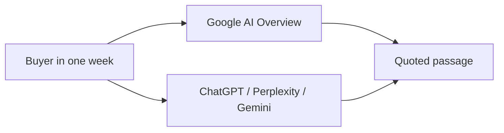

# GEO vs AEO vs AIO: What Each One Means and Why Your Business Needs All Three

**GEO, AEO, and AIO are three jobs, not three names for SEO — and the question I get every week is what GEO vs AEO vs AIO actually means and why a business needs all three.** If you only fund the acronym your agency rebranded last quarter, you will win one surface and lose the buyer on the other two.

I'm **William Spurlock** — AI Solutions Architect, Fractional AI CTO, and studio founder. I've been SEO-certified since 2021; the work now sits under AEO, AIO, and GEO. I've shipped hundreds of production sites and logged **20,000+ hours** inside agentic systems. I do not invent client names or fake citation lifts. I do tell owners when they are paying for a rename.

This post is the three-way map. June already covers [what GEO changes in how you write](/blog/geo-vs-seo-what-actually-changes-in-how-you-create-content) and [how AIO differs from traditional SEO](/blog/what-is-the-difference-between-aio-and-traditional-seo). July already answers [what AIO optimization is and why traffic can fall while you still rank](/blog/why-your-traffic-is-dropping-even-though-you-still-rank-on-google). I am not rewriting those. I am answering the staffing question those posts leave open: which job owns which surface, and why a buyer who hits Google on Monday and ChatGPT on Thursday needs all three.

---

## What is GEO and how is it different from SEO?

**GEO (Generative Engine Optimization) is the job of getting cited inside synthesized answers from ChatGPT, Perplexity, and Gemini — not the job of ranking a blue link.** SEO still owns crawl, index, and the classic results list. GEO owns whether a generative engine names you when it writes the answer.

That split is the whole point. SEO asks: "Do we appear in the list?" GEO asks: "When GPT-5.5, Gemini 3.1 Pro, or Perplexity composes a reply, are we in the sentence?"

The academic name is not a marketing invention. [Aggarwal et al., *GEO: Generative Engine Optimization*](https://dl.acm.org/doi/10.1145/3637528.3671900) (ACM KDD 2024; [arXiv:2311.09735](https://arxiv.org/abs/2311.09735)) formalized GEO as a black-box method for raising visibility inside generative-engine responses. They reported visibility gains of **up to 40%** on GEO-bench, with the strongest lifts from citing sources, adding statistics, and adding attributed quotations — not from keyword stuffing.

I treat that paper as a ceiling from a 2024 harness, not a promise for your domain in August 2026. The useful takeaway still holds: generative engines reward passage quality and checkable facts more than they reward the exact-match title tag you bought links for.

### The job GEO actually owns

When I staff GEO, I am not "doing SEO harder." I am trying to win citation inside engines that retrieve, synthesize, and optionally show sources:

- **ChatGPT** (OpenAI, GPT-5.5 / GPT-5.4 mini class, with browsing or search tools on)
- **Perplexity** — citation-first research answers with numbered sources
- **Gemini** (Google, Gemini 3.1 Pro / Gemini 3.5 Flash) when the buyer is inside Gemini, not just Google Search
- Adjacent chat surfaces — Claude Opus 4.8 / Claude Sonnet 5 and Copilot — when they retrieve the open web

GEO does **not** own Google's AI Overview block. That is AIO. Mixing those two is how a team spends a quarter "doing GEO" and never screenshots an Overview.

| Axis | SEO | GEO |
|------|-----|-----|
| Unit of competition | The URL in a ranked list | The passage inside a generated answer |
| Win condition | Position and the click | Named, quoted, or linked in the synthesis |
| Primary surfaces | Classic Google / Bing results | ChatGPT, Perplexity, Gemini answers |
| Content move | Coverage + relevance + links | Answer-first claims, dated stats, entity clarity |
| Metric | Rank, impressions, clicks | Citation share across a fixed prompt panel |

### Where GEO still needs SEO

GEO does not replace the crawl. If the page is blocked, thin, or only painted in client-side JavaScript, a generative engine has nothing clean to retrieve.

What GEO changes is the passage, not the hosting invoice:

1. Lead every section with a sentence a model can lift without the next three paragraphs.
2. Put comparisons in tables, not in a 900-word wander.
3. Date facts. "As of August 2026" beats "recently."
4. Name the business, the service, and the city the same way on every page.

If you want the writing-room version of that list — drafts, FAQ craft, what dies in paragraph seven — use the June post on [what actually changes in how you create content](/blog/geo-vs-seo-what-actually-changes-in-how-you-create-content). For the owner playbook, including the KDD methods and a 90-day rollout, use the [2026 GEO playbook](/blog/generative-engine-optimization-geo-the-2026-playbook-for-business-owners). This section stops at the job boundary.

### What GEO is not

GEO is not a plugin, a `llms.txt` file you ship and forget, or a slide that says "we are now AI-first."

GEO is also not a license to abandon money pages. A chat engine that cannot find a clear service definition will invent a generic category answer and name whoever published a tighter paragraph.

My opinion: if your GEO proposal does not name ChatGPT, Perplexity, and Gemini as weekly test surfaces, it is an SEO retainer with new letterhead.

---

## What is AEO and how does it relate to AI search?

**AEO (Answer Engine Optimization) is the job of becoming the quoted answer — the sentence an AI search system extracts and attributes — not the job of collecting another ranking screenshot.** AI search is the market. AEO is the quote.

An **answer engine** is any system that returns a synthesized answer instead of (or on top of) a list of links. That includes ChatGPT, Perplexity, Google AI Overviews, Gemini, Claude, and Copilot. AEO relates to all of them the same way featured-snippet work related to classic search: you win by being the cleanest extractable answer to a question a buyer already asks.

The difference from GEO is the unit of success.

- GEO asks: "Are we in the generated answer at all?"
- AEO asks: "Are we the source the engine quotes — by name, with our fact, in our wording?"

You can be GEO-visible (mentioned in a mashup) and still lose AEO (the quote goes to a competitor's FAQ). You can rank #1 on Google and lose both.

### How AEO shows up inside AI search

Buyers do not experience "AEO." They experience a paragraph that names a vendor.

| Buyer action | Engine behavior | AEO win | AEO miss |
|--------------|-----------------|---------|----------|
| "Best commercial HVAC company in Traverse City that does same-day service" | Synthesizes a shortlist | Your service sentence is the one it quotes | A directory or a competitor's FAQ is the quote |
| "What does a kitchen remodel in [city] cost in 2026?" | Wants a ranged, dated number | Your price band with an "as of" date | A national average with no constraint |
| "Who should I hire for X vs Y?" | Wants a verdict with a skip condition | Your two-sentence verdict | A hedge that names nobody |

That is why I call AEO the operator language. Owners understand "become the answer." They do not need a second research paper to start rewriting the five pages that already get sales questions.

### What AEO borrows from featured snippets — and what it does not

AEO grew out of featured-snippet craft: question headings, 40–60 word definition blocks, lists Google could lift. [Google still documents featured snippets](https://developers.google.com/search/docs/appearance/featured-snippets) as a classic Search feature. AI answers are not the same feature.

Google's own [AI features documentation](https://developers.google.com/search/docs/appearance/ai-features) says AI Mode and AI Overviews may use different models and techniques, so the links they show will vary. Snippet wins do not transfer one-to-one. Treat snippet structure as a useful habit, not a trophy you can cash at ChatGPT.

### AEO content moves I will actually bill for

I do not bill "AEO" as a vibe. I bill a short list:

- **Question-mapped H2s** that match the words buyers type into chat
- **Lead answers** in the first two sentences of every section
- **FAQ pairs** that map 1:1 to sales objections
- **Organization / Person consistency** so the quote has a name attached
- **A weekly citation log** — engine, query, quoted Y/N, competitor named

The full operator sequence lives in [Answer Engine Optimization: how to become the answer AI gives](/blog/answer-engine-optimization-how-to-become-the-answer-ai-gives). This post only needs you to see AEO as a distinct job: the quote, not the rank, not the Overview card.

If someone sells you AEO as "we added FAQ schema and we are done," they sold you a checkbox. Schema helps machines label a Q&A you already wrote. It does not invent the answer.

---

## What AIO owns on Google that the other two do not

**AIO (AI Overview Optimization) is Google AI Overviews optimization — the job of getting extracted and cited inside the AI summary block on a Google results page.** It is not "GEO for Google" as a slogan. It is a Google Search surface with its own triggers, its own click economics, and its own report in Search Console.

I already answered "What is AIO optimization and should my business care about it?" in [why your traffic is dropping even though you still rank on Google](/blog/why-your-traffic-is-dropping-even-though-you-still-rank-on-google). I am not making that the primary query here. I am placing AIO next to GEO and AEO so you stop staffing one job and hoping the other two appear.

### Why AIO is a separate payroll line

Google Search is still where a huge share of discovery starts. [SparkToro's 2026 clickstream study](https://sparktoro.com/blog/in-2026-less-than-one-third-of-google-searches-still-send-a-click/) (Similarweb panel, US searches, January–April 2026) found **68.01%** of those searches ended without a click to the open web, up from 60.45% in 2024. SparkToro points at AI Overviews — now on **20%+** of searches per the [Ahrefs trigger data they cite](https://ahrefs.com/blog/ai-overview-triggers/) — and at [Ahrefs' finding that Overviews cut click-through by nearly 60% when they appear](https://ahrefs.com/blog/ai-overviews-reduce-clicks-update/).

Those are Google-SERP numbers. They do not tell you whether ChatGPT named you on Thursday. That is why AIO cannot absorb GEO, and GEO cannot absorb AIO.

| AIO-specific fact | Why it is not GEO or AEO |
|-------------------|--------------------------|
| Lives on a Google results page next to classic links | ChatGPT and Perplexity never show that chrome |
| Impression can count while the click dies | Rank trackers stay green; sessions fall |
| Triggered by informational / comparison / multi-step queries more than pure navigational ones | Your branded query may never grow an Overview |
| Measured in Search Console + Overview screenshots | A ChatGPT prompt log will not catch it |

Google's [guidance on succeeding in AI search](https://developers.google.com/search/docs/fundamentals/ai-optimization-guide) is still mostly "make helpful, crawlable pages" plus a reminder that there is no special "AI Overview" schema type. Useful. Incomplete as a staffing plan. You still have to write extractable answers for the queries that actually grow a summary.

### What AIO work looks like when I do it

AIO work is Overview-shaped:

- Export the queries where impressions rose and clicks fell
- Spot-check which of those queries grow an AI Overview
- Rewrite the money URL so the lead answer, table, and FAQ can be lifted into that block
- Confirm the citation in a dated screenshot, not a vibe

The two-way AIO-vs-SEO mechanics — crawl foundation, extraction, what traditional SEO still owns — are in [what is the difference between AIO and traditional SEO](/blog/what-is-the-difference-between-aio-and-traditional-seo). Read that when you need the Google-only comparison. Come back here when someone asks you to pick one acronym.

AIO is how you stay in the conversation on Google after the click leaves. GEO is how you stay in the conversation when the buyer never opened Google. AEO is how either conversation quotes you instead of a competitor.

---

## GEO vs AEO vs AIO: what each one actually owns

**GEO owns generative-engine citation in ChatGPT, Perplexity, and Gemini answers; AEO owns becoming the quoted answer; AIO owns Google AI Overviews.** You need all three because the same buyer will bounce across those surfaces in one week — and winning Monday on Google does not transfer to Thursday in chat.

Agencies collapse the three into one slide. I split them when I have to assign work. Doctrine can stay unified ("get cited by machines that write answers"). Operations cannot. If one person "owns GEO" and never opens an Overview, you have a hole. If one person "owns AIO" and never runs a ChatGPT panel, you have a different hole.

### The three-job table

| | **GEO** | **AEO** | **AIO** |
|---|---------|---------|---------|
| **Job** | Get cited inside a generated answer from a generative engine | Become the quoted answer — your fact, your wording, your name | Get extracted and cited inside Google AI Overviews (and related Google AI search chrome) |
| **Surfaces** | ChatGPT, Perplexity, Gemini answers; Claude / Copilot when they retrieve the web | Any answer engine that extracts a passage and attributes it | Google Search AI Overviews; adjacent Google AI Mode summaries |
| **Content moves** | Entity-clear clusters, dated stats, third-party corroboration, prompt-panel testing | Question H2s, 2-sentence lead answers, FAQ pairs, verdict + skip conditions | Overview-eligible query rewrites, tables, FAQ, Search Console + screenshot loop |
| **Metrics** | Citation share on a fixed ChatGPT / Perplexity / Gemini prompt bank | "Quoted as the answer" rate; brand named with your claim | Overview present Y/N; cited Y/N; impressions↑ clicks↓ pattern on those queries |

SEO is the floor under all three: crawlable HTML, indexation, speed, consistent entities. It is not a fourth column in this table because it is not a generative job. It is the reason the other three have a page to read.

### Why "GEO as the umbrella" still gets people fired

In June I said GEO can sit as the umbrella term and AIO / AEO as subsets. That is still a fine teaching sentence. It is a bad org chart.

If GEO is the umbrella, someone will staff one "GEO lead," buy one tool, and report one score. Then you will discover — in month three — that you are cited on Perplexity for a definitional query and invisible in the Overview that sits on your highest-impression commercial keyword.

Use the umbrella in a strategy conversation. Use the three jobs in a sprint board.

### The one-week bounce (this is why you need all three)

Here is the week I keep seeing from owners, not from a named case study:

| Day | What the buyer does | Surface | Job that wins or loses |
|-----|---------------------|---------|------------------------|
| Monday | Googles "best [category] near me" on a phone | Google AI Overview above the map pack | **AIO** |
| Wednesday | Asks ChatGPT for a shortlist with constraints | ChatGPT (GPT-5.5 class, tools on) | **GEO** |
| Friday | Asks Perplexity "who should I hire" and reads the numbered sources | Perplexity citations | **GEO** + **AEO** (the quote) |
| Next Monday | Googles your brand after a peer mention | Classic results + possible Overview | **SEO** + **AIO** |

That is one buyer. Four sessions. Three generative jobs. If you only funded SEO, you might still rank on Monday and lose the Overview, lose the ChatGPT shortlist, and lose the Perplexity quote.

You do not need three agencies. You need one program that refuses to pretend those rows are the same ticket.

The diagram is the argument. The table is the staffing plan. The rest of this post is what happens when you ignore both.

---

## Why your buyer hits all three surfaces in one week

**Buyers do not pick a channel and stay loyal to it — they ask Google, then a chat engine, then a second chat engine, often before they fill a form.** SparkToro's 2026 write-up also notes that **20%+ of Americans now use an AI tool 10+ times a month** ([their AI-tool usage research](https://sparktoro.com/blog/new-research-20-of-americans-use-ai-tools-10x-month-but-growth-is-slowing-and-traditional-search-hasnt-dipped/)). That is not "Gen Z only." That is your commercial buyer doing homework.

I do not need a proprietary panel to believe the bounce. I watch it in intake notes: "I asked ChatGPT," "I saw you in the Google summary," "Perplexity listed three shops." Those sentences show up in the same week, from the same person, for the same job.

### What each hop costs you if you skip a job

Skip **AIO** and the Overview cites a competitor or a directory while your classic result still sits at position two. The buyer thinks they already got the answer. Your rank tracker still looks fine. That pattern is the July post.

Skip **GEO** and ChatGPT / Perplexity / Gemini assemble a shortlist from whoever published a clearer entity + a third-party mention. You can be the best operator in the county and still not exist in that paragraph.

Skip **AEO** and you get a vague mention ("local contractors include several options") with the quotable sentence pulled from someone else's FAQ. Mention without a quote is how you become wallpaper.

Skip **SEO** and none of the above have a durable URL to retrieve. Then you are paying for social and ads to explain a business the machines cannot read.

### A 30-minute proof you can run this afternoon

Pick one money question. Run it in four places. Log what happens. Do not argue labels until the grid is full.

| Surface | What to paste | What to record |
|---------|---------------|----------------|
| Google (logged-out, same city) | The question as a search | Overview Y/N; who is cited; your classic position |
| ChatGPT | The question verbatim | Named Y/N; quoted Y/N; competitors |
| Perplexity | The same question | Source list; your URL Y/N |
| Gemini | The same question | Named Y/N; whether it invents a fact |

If you win one cell and lose three, you do not have "an SEO problem." You have a three-job gap. That grid is also how I keep an agency honest: they cannot hide a missing surface behind a ranking PDF.

---

## Do I need a completely different strategy for AI visibility vs. SEO?

**No. You need a stacked strategy: SEO as the crawl-and-index floor, then AIO, GEO, and AEO as three jobs on top — not a second company, not a rip-and-replace content calendar.** The teams that fail are the ones who treat AI visibility as "SEO with extra acronyms" *or* as a total replacement. Both are how you waste a quarter.

Different strategy would mean: new domain, new CMS, new writers who have never talked to sales, pause all technical SEO. I have watched that movie. The sequel is a thin site that ranks for nothing and still is not citable.

Same strategy would mean: keep publishing 2019 listicles, add "AI" to the title tag, buy a GEO dashboard. That movie is worse, because it looks like motion.

### What stays from SEO

Keep these. They are not nostalgic. They are load-bearing.

- Crawlable, indexable HTML ([how Search works](https://developers.google.com/search/docs/fundamentals/how-search-works) still starts with crawl → index → serve)
- Unique URLs for unique questions — one primary query per page
- Internal links with descriptive anchors
- Author and organization identity that matches the real human
- Speed and render that do not hide the body from a bot

Google's AI-search guidance is explicit that structured data is not a magic ticket into generative features. It still wants the visible page to match the markup. That is SEO hygiene, not a new religion.

### What changes when you add the three jobs

| SEO habit you can keep | What you add for AI visibility |
|------------------------|--------------------------------|
| Keyword research | A **question bank** you will paste into ChatGPT, Perplexity, Gemini, and Google |
| Monthly content volume | **Money-page rewrites** before you add more URLs |
| Rank tracking | **Citation logs** and Overview screenshots |
| Backlink reports | **Entity corroboration** — the same name, service, and city off-site |
| "Comprehensive guide" word counts | **Extractable blocks**: lead answer, table, FAQ, dated claim |

The writing craft change is already documented in the June GEO-vs-SEO post. I will not repeat the inverted-pyramid tutorial. The strategic change is this: you measure three jobs, you do not retire the fourth.

### The decision I want you to make

If organic revenue still depends on informational and comparison queries, you cannot "wait out" Overviews and chat. SparkToro's 2026 zero-click read is the directional evidence; methodology across 2016/2019/2024/2026 panels is not identical, and they say so. The direction is not a debate I will have in a planning meeting.

If nearly all revenue is branded navigational demand, you still want AEO on the service pages — because the first time a buyer asks ChatGPT *before* they know your name, branded SEO cannot save you.

You do not need a completely different strategy. You need to stop pretending a rank tracker is a citation tracker.

---

## Why treating GEO as "SEO with extra acronyms" wastes 90 days

**Treating GEO as "SEO with extra acronyms" is how agencies waste 90 days — they ship more keyword pages, never run a prompt panel, and call the ranking PDF a GEO report.** I have sat through those reviews. The slides are prettier. The buyer still hears a competitor's sentence in chat.

This is the strong opinion the rest of the post is built to justify. I will not soften it.

### The 90-day pattern

Week 1–2: rebrand the retainer. New deck. "Generative engine" in the header. Same keyword map.

Week 3–8: twelve blog posts. H2s like "Our Approach" and "Why Quality Matters." No lead answers. No query-level Overview check. No ChatGPT / Perplexity / Gemini log.

Week 9–12: "early signals." Impressions are fine. A few new URLs indexed. Nobody can show a screenshot of your URL inside an answer. The proposed next step is another quarter of volume.

That is not a slow GEO ramp. That is SEO theater. Aggarwal et al. already showed keyword stuffing did not win their generative-engine tests. Shipping more of it under a new acronym is not a delayed win. It is a miss.

### What a real 90 days looks like instead

| Window | If you are doing the three jobs | If you bought the rename |
|--------|--------------------------------|--------------------------|
| Days 1–14 | Money pages rewritten with lead answers; query bank of 15–25 questions; baseline screenshots on four surfaces | Kickoff, keyword refresh, "content pillars" workshop |
| Days 15–45 | Five Overview-eligible URLs fixed; FAQ pairs live; first citation log with owners | 6–8 new posts, no rewrites of the pages that already rank |
| Days 46–90 | Second prompt-panel pass; cluster spokes only after the hub quotes cleanly; decide what to kill | "We need more content"; dashboard demo; no Overview row on the report |

I do not promise citations on day 30. I do refuse to call a ranking report a GEO deliverable.

### How to spot the rename in a proposal

Walk away — or rewrite the SOW — if you see most of these:

- Success defined only as rankings, DA, or "AI traffic" with no engine named
- No weekly prompt list printed in the appendix
- No AIO row (Overview present / cited)
- No AEO row (quoted vs merely mentioned)
- "GEO content calendar" that never touches the five URLs sales already uses
- A tool score in place of screenshots

A serious proposal names the three jobs, names the surfaces, and names the first ten questions. If it cannot do that, it is not an AI-visibility engagement. It is SEO with extra acronyms.

---

## The 30-day order of operations if you refuse three agencies

**Work AEO on money pages first, AIO on Overview-eligible queries second, GEO cluster and off-site entity proof third — with SEO hygiene running the whole month.** That order is how a small team gets one program instead of three retainers.

I use this sequence because quotes on the pages you already have move faster than a new topical cluster, and Overviews sit on queries you can already see in Search Console. Chat-engine entity recognition is slower. Starting there is how people disappear into "thought leadership" for a quarter.

### Week 1 — Baseline the three jobs

1. Export the top 50 non-branded queries from Search Console.
2. Flag informational / comparison / "best" / "cost" / "vs" rows.
3. Build a 15–25 question bank from those rows plus the questions sales already hears.
4. Run the four-surface grid (Google, ChatGPT, Perplexity, Gemini) once. Screenshot everything.
5. Pick five URLs that should already answer those questions.

Do not start a blog series in week 1. You do not know which job is empty yet.

### Week 2 — AEO on the five URLs

Rewrite each URL so a stranger (or a model) can steal the answer from the first two sentences of each H2.

- One primary question per URL
- A table or a numbered process — not both buried in prose
- An FAQ of real objections, not "Do you offer quality?"
- The same legal business name in the first screen and the footer

This is AEO. It also feeds AIO and GEO, because both extract passages. You are not doing the jobs in isolation. You are sequencing the work that unlocks the others.

### Week 3 — AIO on the Overview-eligible subset

From the week-1 grid, take every query that grew an Overview.

- Match each Overview query to one URL
- Put the missing fact on the page in a form a summary can lift (range, date, constraint)
- Re-check those queries logged-out
- Log cited / not cited — not "we think we might be in there"

If impressions are up and clicks are down on those queries, you now have the July diagnosis with a week-3 action attached.

### Week 4 — GEO without a new agency

Now, and only now, look at chat engines as a market:

- Re-run the same 15–25 questions in ChatGPT, Perplexity, and Gemini
- Note which competitors appear and which third-party pages they seem to draw from
- Fix entity drift (NAP, service names, author byline)
- Publish **one** cluster spoke that answers a question the hub cannot answer in two sentences
- Do not publish eight spokes to "look active"

The [GEO playbook](/blog/generative-engine-optimization-geo-the-2026-playbook-for-business-owners) is the longer version of week 4 and beyond. This month's job is to prove you can log citations, not to announce a content factory.

### Who does this on a small team

| Seat | Owns | Does not own |
|------|------|--------------|
| Owner / operator | Question bank, "is this true" review, 30-minute Friday log | Fancy dashboards |
| Writer (or you) | Lead answers, tables, FAQ | Keyword theater |
| Web / contractor | Render, schema that matches visible Q&A, speed | A new design system "for AI" |
| Agency (optional) | Extra hands on the same grid | A parallel GEO brand that never opens ChatGPT |

One program. Three jobs. One Friday ritual. That is the entire staffing model.

---

## How I measure the three jobs without a fake GEO score

**I measure AIO with Overviews and Search Console, GEO with a fixed ChatGPT / Perplexity / Gemini prompt panel, and AEO with a quoted-vs-mentioned tag — I do not buy a single "GEO score" and manage to it.** Most of those scores cannot tell you which job moved.

If a vendor cannot export the raw queries and the screenshots behind the number, treat the number as decoration.

### The scoreboard I will defend in a meeting

| Job | Primary evidence | Secondary evidence | Vanity I ignore |
|-----|------------------|--------------------|-----------------|
| **AIO** | Dated Overview screenshots; cited URL | GSC impressions↑ clicks↓ on those queries | Average position alone |
| **GEO** | Prompt-panel rows: ChatGPT / Perplexity / Gemini | AI-referred visits if you can tag them; "I found you in ChatGPT" intake notes | Unnamed "AI traffic" |
| **AEO** | Quoted (your sentence) vs mentioned (your name in a mashup) | Branded search lift after citation weeks | Word count shipped |
| **SEO** | Indexation, crawl errors, classic clicks on queries with no Overview | Core Web Vitals as a floor | Domain Authority as a KPI |

Run the prompt panel every two weeks at first, monthly once the grid is boring. Fifteen to twenty-five questions. More than that and a small team quits. Fewer than that and you are guessing.

### What "working" looks like at 30 / 60 / 90

These are ranges from client work and public studies, not guarantees.

- **~30 days:** money pages quote-clean; you have a baseline grid; one or two Overview-eligible pages stop being a mystery
- **~60 days:** Perplexity often moves first (live retrieval, visible sources) — I have seen 2–6 week windows on well-structured pages, and I have seen nothing move when the entity is a mess
- **~90 days:** ChatGPT entity recognition is the slow one (often 2–6 months in the playbook ranges); Overviews 4–12 weeks after passage work is a working band, not a contract clause

If nothing in the grid moved at day 90 and you only published new blogs, you ran the rename. Rewrite the five URLs or stop calling it AI visibility.

---

## FAQ

### What's the best strategy for getting found in AI search in 2026?

**The best strategy is one program with three jobs: AEO on money pages, AIO on Overview-eligible Google queries, and GEO on a ChatGPT / Perplexity / Gemini prompt panel — sitting on a crawlable SEO floor.** Do not hire three agencies to rename the same rewrite. Start with the five URLs sales already uses, log four surfaces, and only then add cluster spokes. Volume without a citation grid is how you stay invisible in the answers buyers actually read.

### Can a small business compete with big brands in AI search results?

**Yes — generative engines can cite a clearer, better-sourced page even when a bigger domain ranks higher in classic search.** Aggarwal et al. (KDD 2024) reported that lower-ranked sites in their tests could see large relative visibility gains inside generative answers when passages improved; treat the "up to 115.1%" figure as a 2024-benchmark result, not your forecast. Your advantage is specificity: city, constraint, dated price band, and a sentence a model can lift. Your disadvantage is a thin entity. Fix the pages and the name consistency before you try to out-publish a publisher.

### What does AI optimization actually mean for a local business owner?

**For a local owner it means your service, city, hours, and proof are extractable on the site and consistent off the site — so Google Overviews, ChatGPT, and Perplexity can name you for "near me" and category questions.** It does not mean a new brand video. It means the money pages answer the questions people already ask, the name/address/phone does not drift, and you spend 30 minutes every Friday checking whether the machines quote you. If you only "do SEO" for the map pack, you still lose the Overview and the chat shortlist.

### Is AI visibility replacing SEO or just adding to it?

**Adding to it.** SEO still decides whether a page can be crawled and indexed; AI visibility decides whether an answer engine extracts you after that. SparkToro's 2026 study shows the click is disappearing from a large share of Google searches, which is why rank-only reporting is now a partial scoreboard — not because Googlebot retired. Kill SEO and you starve AIO, GEO, and AEO of a URL. Keep SEO and ignore the three jobs and you keep the rank while the buyer reads someone else.

### What order should I work GEO, AEO, and AIO if I only have 30 days?

**AEO first on five money pages, AIO second on the queries that already grow Overviews, GEO third as a chat-engine panel and entity cleanup — SEO hygiene the whole time.** That order matches how fast each surface can move and what a small team can finish. Starting with a "GEO content calendar" of new posts is how you skip the pages that already have demand. If you only have ten hours in the month, spend them on the four-surface grid and two rewrites, not on a strategy offsite.

### Should I hire a GEO agency or keep this in-house?

**Keep the question bank, the screenshots, and the Friday log in-house; hire help for rewrites and technical cleanup only if they work that grid.** A GEO agency is useful when they attach names to surfaces and show cited / not cited. It is a waste when they sell a score and a calendar. I would rather you run the $500-level diagnosis yourself for two weeks than sign a six-month rename. If you hire, put the three-job table in the contract.

### Does AEO overlap with featured snippets, or is that a different game?

**It overlaps in craft and splits in the product.** Question headings, short definition blocks, and lists still help extraction — that habit came from featured snippets, which [Google still documents separately](https://developers.google.com/search/docs/appearance/featured-snippets). AI Overviews and chat answers are not snippet slots. Winning a snippet does not mean ChatGPT will quote you, and losing a snippet does not mean AEO is dead. Run both checks. Do not cash one trophy at the other window.

### How long until I start seeing AI citations after I change the pages?

**Perplexity can move in a few weeks; Overviews often take 4–12 weeks after passage work; ChatGPT entity citations often take 2–6 months — ranges, not guarantees.** Fresh, clean domains with a tight cluster move faster; legacy sites with conflicting duplicates move slower. If you changed titles and not lead answers, the clock did not start. Re-run the same prompt panel on a fixed cadence and let the grid report; do not wait for a vendor score to turn green.

---

## Get the three-job map on your site, not in a slide

If your agency is selling GEO as SEO with extra acronyms, you do not need another quarter of volume. You need a diagnosis that names the empty cells on the four-surface grid, then a site that can be extracted on all three jobs.

I run a fixed-scope **AI Visibility Audit ($500)** that crawls the machine surfaces, runs your category's prompt panel, benchmarks citation share against the competitors the engines already name, and hands back a ranked fix list. The fee credits toward a build.

If the foundation is the bottleneck — thin money pages, entity drift, a theme that hides the body — I build **AIO/AEO-ready custom sites** so the quote, the Overview, and the chat citation have one URL to read.

[Book the audit or the site conversation](/contact). Bring the ten questions your buyers already ask AI. I will tell you which job is empty before anyone sells you a fourth acronym.
