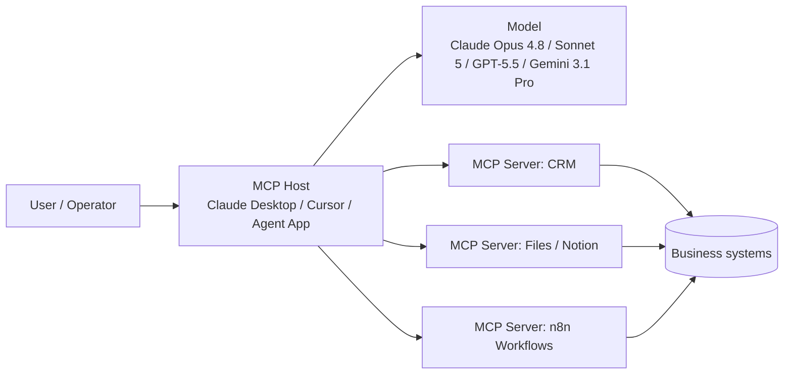

# Model Context Protocol (MCP) Explained: Why Every AI Agent Will Run on This

**MCP is the open standard that lets an AI agent discover and use tools, files, and data sources through one consistent connection — instead of a custom integration for every app and every model.** If you are deciding whether agents are worth building for your business, this protocol is the piece that makes the stack portable, maintainable, and less expensive to grow.

I'm William Spurlock. I build AI agent and automation systems for founders and operators. Across **20,000+ hours** architecting agentic systems and **500+ automations** shipped, the pattern that kept breaking client stacks was the same: every new tool meant another one-off connector, another auth path, another place for the agent to fail. MCP is what I standardize on now when an agent needs reliable access to real systems — Claude Desktop, Cursor, n8n, custom servers, the whole loop.

This post is the plain-English pillar: what MCP is, why it matters, how it works, and how it compares to regular APIs and model function calling. It is not a build diary. If you want the prompt-first production server walkthrough, read [How I Prompted AI to Build a Production-Grade MCP Server in 20 Minutes](/blog/mcp-architecture-guide). If you still need the agent vs chatbot vs automation framing, start with [What Is an AI Agent? A Business Owner's Guide to Autonomous AI](/blog/what-is-an-ai-agent-a-business-owner-s-guide-to-autonomous-ai).

---

## What Is MCP (Model Context Protocol) and Why Does It Matter?

**Model Context Protocol (MCP) is an open protocol for connecting AI applications to external tools and data in a standard way.** Anthropic introduced it on [November 25, 2024](https://www.anthropic.com/news/model-context-protocol). In December 2025 it moved under the [Linux Foundation's Agentic AI Foundation](https://www.linuxfoundation.org/press/announcements/2025/12/agentic-ai-foundation-launches-to-advance-open-standards-for-ai-interoperability), which is the institutional signal that this is infrastructure, not a vendor feature.

Here is the business version: your agent needs CRM records, calendar slots, Notion pages, Slack threads, GitHub issues, and n8n workflows. Before MCP, each of those was a custom bridge. After MCP, you stand up (or install) an MCP server for that system once, and any MCP-compatible client can use it.

Anthropic's docs describe this as the **N×M integration problem**: N AI apps times M data sources equals a mess of one-off connectors. MCP turns that into N + M — each client speaks MCP, each server speaks MCP, and they plug together. Official overview: [modelcontextprotocol.io](https://modelcontextprotocol.io/introduction).

### Why this matters if you buy or build agents

Agents without tool access are fancy chatbots. Tools without a standard are a maintenance tax. MCP sits in the middle as the contract both sides agree on.

| Stakeholder | Why MCP matters |
|-------------|-----------------|
| Business owner | You stop paying to re-integrate the same CRM every time you change models or IDEs |
| Technical founder | You write one server surface; Claude Desktop, Cursor, and n8n can all call it |
| Ops / automation lead | Workflows and agents share the same tool layer instead of competing stacks |
| Agency / fractional CTO | Client handoff is cleaner: document the MCP servers, not a pile of private adapters |

I treat MCP as table stakes for production agents the same way I treat HTTPS as table stakes for production websites. You can still ship without it. You will regret the glue code later.

### What MCP is *not*

MCP is not a model. It is not a replacement for Claude Opus 4.8, Claude Sonnet 5, GPT-5.5, Gemini 3.1 Pro, or Llama 4. Those models still do the reasoning. MCP is how those models (through a host app) reach your world.

MCP is also not a full agent framework. It does not decide goals, run the loop, or own memory. That sits in your agent runtime — Cursor agent mode, Claude Desktop, an n8n AI Agent node, a custom orchestrator. MCP supplies the tool and context interface those runtimes call.

And MCP is not "magic autonomy." Bad permissions, vague goals, and missing human checkpoints still produce bad outcomes. The protocol removes integration friction. It does not remove judgment.

### The receipt from real stacks

On client work I wire MCP in three places constantly:

1. **Claude Desktop** — operators talking to business systems in natural language with audited tool lists
2. **Cursor** — builders directing agents against repos, docs, and internal MCP servers while shipping product
3. **n8n** — automation graphs that expose workflows as MCP tools so agents trigger proven paths instead of inventing new ones

That combo is why I say every serious agent stack will run on this. Not because a blog said so — because rebuilding Slack + Notion + CRM connectors per client, per model host, does not scale past the first three projects. For the n8n-specific playbook, see [The Ultimate Guide to n8n MCP](/blog/n8n-mcp-guide).

---

## How Does MCP Work in Simple Terms?

**MCP works like a USB standard for AI tools: a host app (the AI client) connects to one or more MCP servers, discovers what each server offers, then calls those capabilities during a conversation or agent loop.** The model never hardcodes your CRM's REST paths. It asks the host what tools exist, picks one, and the host executes the call through the MCP server.

Think of three roles:

| Role | What it is | Everyday analogy |
|------|------------|------------------|
| **Host / client** | Claude Desktop, Cursor, an IDE, a custom agent app | The laptop |
| **MCP server** | A process that exposes tools, resources, and prompts for one domain | The USB device (CRM, files, n8n) |
| **Transport** | How client and server talk (local stdio, HTTP/SSE, etc.) | The cable / wireless link |

### The three primitives you actually care about

MCP servers typically advertise three capability types. Names come from the protocol; the meanings are practical:

| Primitive | Plain meaning | Example |
|-----------|---------------|---------|
| **Tools** | Actions the agent can take | `create_ticket`, `search_contacts`, `run_workflow` |
| **Resources** | Readable context the agent can pull in | A file, a DB view, a Notion page URI |
| **Prompts** | Reusable prompt templates the server ships | "Weekly ops summary" with filled slots |

If you only remember one row: **tools are verbs, resources are nouns, prompts are recipes.**

### The loop in plain English

1. You open Claude Desktop or Cursor with MCP servers configured.
2. The client starts those servers (or connects to remote ones) and asks what they support.
3. You give the agent a goal: "Pull open deals over $10k and draft a follow-up plan."
4. The model (for example Claude Sonnet 5 or Claude Opus 4.8 inside that host) chooses tools from the discovered list.
5. The host runs each tool call through the right MCP server with your credentials and permissions.
6. Results come back as structured context. The model continues until the goal is done or it needs you.

That is the same agent loop I describe in the [AI agent fundamentals guide](/blog/what-is-an-ai-agent-a-business-owner-s-guide-to-autonomous-ai) — MCP is the tool socket, not the loop itself.

### A concrete Claude Desktop mental model

You install a filesystem server, a Notion server, and an n8n MCP bridge. In Claude Desktop's config you point at those servers. Next chat, Claude can list files, read a Notion database, and trigger an n8n workflow — without you pasting API docs into the prompt every time.

Business-owner translation: your team talks to one assistant surface; the MCP layer is what keeps that assistant plugged into the real systems of record.

### A concrete Cursor mental model

In Cursor, MCP servers extend what the agent can touch beyond the open repo: internal docs search, deployment status, ticket systems, browser tools, custom studio servers. When I direct Cursor to ship a feature, MCP is often how the agent checks the adjacent systems without me copy-pasting JSON into chat.

### A concrete n8n mental model

n8n already runs your deterministic workflows. MCP lets an agent call those workflows as tools. The agent decides *when*; n8n decides *how* with the path you already tested. That split — agent judgment plus workflow reliability — is the pattern I use most for production. Deeper wiring lives in the [n8n MCP guide](/blog/n8n-mcp-guide). For a production ops story in that family, see the [ops team n8n MCP pipeline case study](/blog/ops-team-n8n-mcp-pipeline-case-study).

### Mermaid: the shape of a real session



The model proposes tool use. The host enforces policy and executes. The servers touch your systems. That separation is why MCP is safer to reason about than "give the model a raw API key and hope."

---

## What Is the Difference Between MCP and a Regular API?

**A regular API is how software talks to one product. MCP is how AI hosts discover and call many tools through one protocol — including tools that wrap those same APIs underneath.** MCP does not kill APIs. It standardizes the AI-facing edge so you are not rebuilding that edge for every model host.

### Side-by-side: MCP vs API vs function calling

| Dimension | Regular API | Model function calling | MCP |
|-----------|-------------|------------------------|-----|
| Primary audience | Developers / other services | A specific model vendor's tool schema | Any MCP-compatible AI host |
| Discovery | Read docs, hardcode endpoints | Tools declared in the request for that session | Client queries server capabilities at connect time |
| Portability | Reuse across apps that speak HTTP | Often tied to one provider's format | One server, many hosts (Claude Desktop, Cursor, custom) |
| Auth & transport | Whatever that product invented | Embedded in the model API call | Protocol-level client/server connection + server-side secrets |
| Best at | Stable product integrations | Quick tools inside one chat completion | Agent ecosystems that outlive a single model vendor |
| Weak without the others | No AI-native discovery | No shared server ecosystem | Still needs real APIs under the servers |

### MCP vs "just call the API from the agent"

You can absolutely teach an agent to call HubSpot's REST API with fetch wrappers. I did that for years. The costs show up later:

- Every new host (Cursor vs Claude Desktop vs a custom runner) needs the wrapper again or a private SDK
- Tool descriptions drift; the model sees inconsistent names and schemas
- Auth tokens end up in more places than you want
- Swapping Claude Sonnet 5 for GPT-5.5 or Gemini 3.1 Pro means re-validating every glue path

MCP pushes the product API behind a server boundary. The AI host only sees MCP tools with clear names and schemas. When HubSpot changes a field, you update one server — not every prompt and every client.

### MCP vs function calling

Function calling (tool calling) is how a model API says "I want to run `get_order` with these arguments." It is necessary and still used *inside* MCP hosts. The difference is scope:

- **Function calling** = the model's turn-taking format for tools in a single provider API
- **MCP** = the ecosystem protocol for hosting, discovering, and sharing those tools across apps

In practice: Claude or GPT-5.5 still does tool calls. MCP is how Cursor or Claude Desktop knows which tools exist before that call happens, and how those tools stay consistent across sessions and products.

### When a plain API is still the right call

Use a direct API (or a fixed n8n HTTP node) when:

- The path is fully deterministic and never needs model judgment
- Latency budgets are tight and you do not want an agent loop
- Compliance requires a locked integration with no discovery surface
- You are building service-to-service automation with no AI in the middle

That is the same split as [AI agents vs AI automation](/blog/ai-agents-vs-ai-automation-what-s-the-difference-and-which-do-you-need): automation for fixed paths, agents for goals that need decisions. MCP belongs with the agent side — and with the bridge where agents call automations as tools.

### Decision table for founders

| Situation | Prefer |
|-----------|--------|
| Nightly sync from Stripe → Sheets, same mapping every time | Regular API / n8n workflow |
| "Look up this account, decide next step, update CRM, ping Slack" | Agent + MCP tools |
| One prototype chatbot with two hard-coded functions | Provider function calling alone |
| Studio standard across Claude Desktop + Cursor + n8n for 12 months | MCP servers as the shared layer |

---

## Why Every AI Agent Stack Is Converging on MCP

**Because agent value compounds with the number of reliable tools, and proprietary tool formats do not compound across vendors.** Once Claude Desktop, Cursor, n8n, and a growing list of hosts speak the same protocol, the rational move for builders is to invest in MCP servers — not private adapters.

### The economics are blunt

| Approach | Cost curve as you add tools |
|----------|-----------------------------|
| Custom per host | Roughly tools × hosts |
| MCP servers | Roughly tools + hosts |

That is the N×M story again, measured in billable hours. On a solo studio clock, that difference is the line between shipping four client agent systems a quarter and drowning in connector debt.

### Governance and open stewardship

MCP starting at Anthropic mattered for adoption. Moving into the Linux Foundation / Agentic AI Foundation mattered for trust. Enterprises buy standards they believe will outlive a single lab's product roadmap. I still build with Anthropic's clients heavily — Claude Opus 4.8 and Claude Sonnet 5 show up in a lot of my stacks — but I do not want client infrastructure trapped there.

### What "standard" means in 2026 practice

"Standard" does not mean every vendor implements every optional feature the same week. It means:

- You can hire or contract against a known shape (tools / resources / prompts)
- Open and commercial servers are publishable and shareable
- Switching hosts does not mean rewriting your entire tool layer
- Security reviews can target the MCP boundary instead of twenty ad hoc scripts

If a vendor only offers closed tool plugins with no MCP path, I treat that as lock-in risk and price the project accordingly.

---

## MCP in the Wild: Claude Desktop, Cursor, and n8n

**The fastest way to understand MCP is to see the same server idea show up in three products you might already use.** Same protocol, different jobs.

### Claude Desktop — operator surface

Claude Desktop is where non-engineer operators feel MCP first. Configure servers, open a chat, ask for work that requires tools. The value is conversational access to systems that used to require six browser tabs and a junior ops hire.

Typical pattern I ship:

- Filesystem or Drive-style server for approved folders only
- CRM / Notion / ticket server scoped to the team's workspace
- Optional n8n bridge for "run the already-approved workflow"

Guardrails matter: least-privilege directories, write tools behind confirmation, logging on tool calls. MCP makes those guardrails attach to a server boundary instead of tribal knowledge in Slack.

### Cursor — builder surface

Cursor is where I live day to day. MCP extends the coding agent into the rest of the operating system of a project: issue trackers, design specs, internal search, deployment helpers, browser tools. When I say I directed AI to build an MCP server in the [architecture guide](/blog/mcp-architecture-guide), Cursor was the host that made that loop tight.

For technical founders: if your engineers already work in Cursor, MCP is how agent coding stops at "code that compiles" and starts including "code that talks to our real tools under policy."

### n8n — automation surface

n8n is the reliability layer. Agents are good at judgment and bad at pretending to be a tested state machine. I keep the messy branching in n8n, then expose `run_onboarding_sequence` or `sync_lead_to_crm` as MCP tools. The agent picks the tool; n8n executes the path ops already trusts.

That is also how you avoid the false choice between agents and automation. You need both. MCP is the handshake.

### Mini comparison

| Host | Who uses it daily | MCP job |
|------|-------------------|---------|
| Claude Desktop | Founders, ops, PMs | Natural-language ops against live tools |
| Cursor | Engineers, technical founders | Agent coding + project-adjacent tools |
| n8n (as server / bridge) | Automation leads | Deterministic workflows as callable tools |

---

## How MCP Helps AI Agents Connect to Tools and Data

**MCP gives agents a discoverable catalog of actions and context sources, then a standard way to invoke them with structured arguments and structured results.** Connection is not "paste the API key in the system prompt." Connection is a running server the host manages.

### Tools: actions with schemas

A tool definition tells the model:

- Name (what to call)
- Description (when to use it)
- Input schema (what arguments are required)

Good descriptions beat clever model choice. I have watched Claude Opus 4.8 and GPT-5.5 both fail on the same vague tool list, then succeed after we rewrote three sentences of tool docs. The protocol carries the schema; you still have to write the contract like a product surface.

### Resources: context without pretending it is an action

Resources are how you attach files, documents, or addressable data without turning every read into a pseudo-tool. Agents can subscribe to or fetch resources when they need grounding. For business owners: this is how "use our pricing sheet" becomes a real reference instead of a hallucinated number.

### Prompts: packaged playbooks

Server-side prompts are reusable recipes — onboarding checklist, weekly report, incident summary — with slots for arguments. They encode process so every agent host does not invent a slightly wrong version of your SOP.

### Data path, simply

```text
User goal
  → Host + model plan
    → MCP tool/resource call
      → Server enforces auth + business rules
        → Underlying API / DB / workflow
          → Structured result back to model
            → Next step or final answer
```

Every arrow is a place you can log, rate-limit, or require approval. That is why I push MCP for client-facing agents that touch real data — the control points are obvious.

---

## MCP Security and Permissions (What Buyers Should Ask)

**MCP improves structure; it does not automatically make an agent safe.** You still decide which servers run, which tools can write, and which actions need a human click.

### Questions I put in every discovery call

1. Which MCP servers are allowed in production vs local-only?
2. Which tools are read-only vs write?
3. Do write tools require user confirmation in the host?
4. Where do secrets live (server env, never in prompts)?
5. What is logged on each tool call, and who reviews failures?
6. What is the blast radius if a server credential leaks?

### Practical defaults I use

| Control | Default |
|---------|---------|
| Filesystem roots | Narrow directories, never `$HOME` |
| CRM writes | Separate tools; confirm on create/update |
| Email send | Human approval or staged draft-only tool |
| n8n triggers | Only workflows tagged agent-safe |
| Secrets | Server environment / secret manager |
| New servers | Staging host before production Claude Desktop rollouts |

If a vendor demo "connects everything" with one toggle and no permission story, that is a sales demo, not an architecture.

---

## How to Think About Setup Without Turning This Into a Tutorial

**Setup is: install or build MCP servers, register them in your host config, verify discovery, then test tools with a boring goal before a risky one.** Exact JSON varies by host; the sequence does not.

### High-level setup sequence

1. **Pick the host** — Claude Desktop for operators, Cursor for builders, or both
2. **Pick the first system of record** — usually files + one SaaS source of truth
3. **Install a maintained server** or commission a custom one for internal APIs
4. **Register the server** in the host's MCP config (command/args or URL)
5. **Confirm the tool list** appears in the host
6. **Run a read-only task** ("list open tickets") before any write task
7. **Add n8n** when you want agents to call proven workflows
8. **Document the allowlist** for anyone else who will use the host

Allowed illustrative config shape (Claude Desktop / Cursor-style local server entry):

```json
{
  "mcpServers": {
    "filesystem": {
      "command": "npx",
      "args": ["-y", "@modelcontextprotocol/server-filesystem", "/Users/you/approved-folder"]
    },
    "n8n": {
      "command": "npx",
      "args": ["-y", "mcp-remote", "https://your-n8n-mcp-endpoint"]
    }
  }
}
```

Treat that as a pattern, not a copy-paste guarantee for your environment. Paths, packages, and auth differ. For a production-minded server build process, use the [MCP architecture guide](/blog/mcp-architecture-guide). For n8n exposure patterns, use the [n8n MCP guide](/blog/n8n-mcp-guide).

### Who should do the setup

| You are… | Realistic path |
|----------|----------------|
| Technical founder | Stand up 1–2 official servers this week; custom server next |
| Non-technical owner | Buy a configured Claude Desktop / agent package; do not DIY remote servers on day one |
| Ops lead with n8n | Expose 3 agent-safe workflows first; expand after a clean week of logs |
| Team with compliance needs | Start read-only; add writes behind approval gates |

---

## What Platforms and Tools Support MCP in 2026?

**Support is widest in Anthropic-centered and developer-tool ecosystems, with automation platforms and open hosts catching up fast.** Exact feature parity changes by release; evaluate your host's current MCP docs before you promise a client timeline.

### Categories that matter for buyers

| Category | Examples of where MCP shows up | Why you care |
|----------|--------------------------------|--------------|
| AI desktop hosts | Claude Desktop and similar assistant hosts | Operator access to tools |
| AI coding hosts | Cursor and other agent IDEs | Builders with repo + tool access |
| Automation | n8n MCP bridges / servers | Agents calling workflows |
| Custom servers | Internal TypeScript/Python MCP servers | Your proprietary systems |
| Model providers | Claude (Opus 4.8 / Sonnet 5), plus hosts that wire GPT-5.5, Gemini 3.1 Pro, Gemini 3.5 Flash, Llama 4 | Models vary; the host MCP layer is the constant |

I do not claim every SaaS product ships a first-party MCP server. Many do not. The winning pattern in client work is still: wrap the systems you need behind your own MCP servers (or trusted open servers), then point every host at that layer.

### How to evaluate a platform's "MCP support" claim

Ask:

- Can it act as an MCP **client/host** (consume servers)?
- Can it act as an MCP **server** (expose tools)?
- Which transports are supported in production?
- How are secrets and tool confirmations handled?
- Is support current in 2026 docs, or a blog announcement from launch week?

Marketing pages inflate. Your test is: discover tools, call one read tool, call one write tool with confirmation, restart the host, confirm it still works.

---

## MCP vs Building Agents Without It

**You can build agents without MCP. You will rebuild your tool layer every time the host or vendor mix changes.** That is the whole argument in one sentence.

### Cost of skipping MCP

| Year-1 move | What you feel in year-2 |
|-------------|-------------------------|
| Hard-coded tools in one chatbot | Migration project when you adopt Cursor or a new desktop host |
| Per-client Python glue | No shared library of business tools across accounts |
| Prompt-stuffed API docs | Token waste and brittle instructions |
| Vendor plugin marketplace only | Roadmap risk outside your control |

### When I still skip MCP on purpose

- Single-use demo with two functions, thrown away in a week
- Strict batch job with zero natural-language interface
- Environment where process policies forbid local helper servers and no approved remote MCP path exists yet

Otherwise MCP is the default in my architectures.

---

## How MCP Fits Agents, Automations, and Your Business Stack

**MCP is the tool interface; agents are the decision loop; automations are the reliable paths.** Confusing those three is how budgets burn.

| Layer | Job | Example |
|-------|-----|---------|
| Automation | Fixed path, same steps | New Stripe payment → invoice → Slack |
| Agent | Goal + judgment + tools | Triage inbound lead and choose next action |
| MCP | Standard tool/context access | CRM search, file read, `run_qualified_lead_flow` |

If you want the automation layer explained without agent jargon, read [What Is AI Automation? A Plain-English Guide for Business Owners](/blog/what-is-ai-automation-a-plain-english-guide-for-business-owners). If you are choosing agent vs automation for a specific initiative, use [AI Agents vs AI Automation](/blog/ai-agents-vs-ai-automation-what-s-the-difference-and-which-do-you-need).

### A sane adoption ladder

1. Document the top 10 repetitive decisions your team still makes by hand
2. Automate the fully fixed ones in n8n (no agent required)
3. For the judgment-heavy ones, define agent goals and success checks
4. Expose the systems those agents need as MCP servers
5. Put operators on Claude Desktop; put builders on Cursor
6. Log tool calls for two weeks; tighten permissions
7. Only then expand write access and customer-facing agents

That ladder is boring. Boring is how production agents survive.

---

## Common Failure Modes I See With MCP Projects

**Most MCP failures are product and permission failures, not protocol failures.** The spec is not what lights the dumpster.

### Failure mode 1: Too many write tools on day one

Teams expose `delete_record`, `send_email`, and `charge_customer` before the org trusts the agent on `search_record`. Start read-heavy.

### Failure mode 2: Tool descriptions written like internal code names

`sync_v2_final` means nothing to a model. `Sync the approved HubSpot contact fields into the ops Airtable base` does. Descriptions are UX for the model.

### Failure mode 3: One giant server for the whole company

A monolith MCP server becomes an unreviewable permission surface. Prefer domain servers: CRM, docs, billing, workflows.

### Failure mode 4: Ignoring the automation layer

Agents reinvent workflows that already exist in n8n. Wire the workflow as a tool. Do not let the model freestyle a 12-step CRM update.

### Failure mode 5: Treating MCP as the strategy

MCP is plumbing. Strategy is which goals the agent owns, which KPIs move, and who is on-call when a tool call fails at 6am. Plumbing without strategy is an expensive science fair.

---

## Buying MCP-Based Agent Work: What Good Looks Like

**A good MCP engagement leaves you with a documented server inventory, host configs, permission matrix, and a short list of agent goals in production — not a slide deck about 'agentic transformation.'**

### Deliverables I consider complete

| Deliverable | Why it matters |
|-------------|----------------|
| Server inventory | What can the agent touch? |
| Tool catalog with read/write flags | What can it change? |
| Host configs (Desktop / Cursor) | How do humans actually use it? |
| n8n agent-safe workflow list | Which automations are callable? |
| Logging / failure runbook | What happens at 2am? |
| 30-day expansion plan | What is intentionally *not* connected yet? |

### Red flags

- "We'll connect every SaaS app in week one"
- No staging host
- Secrets in prompts or chat history
- No distinction between demo tools and production tools
- Model name worship without a tool audit ("we use Claude Opus 4.8" is not an architecture)

---

## FAQ: Model Context Protocol

### How does MCP help AI agents connect to tools and data?

**MCP gives the agent host a standard way to discover tools and resources, then call them with structured inputs and get structured results back.** Instead of stuffing API documentation into a prompt, you run MCP servers that wrap CRM, files, Notion, n8n, or internal APIs. The model proposes a tool; the host executes it through the server under your auth and permissions. That is what makes agents operational instead of conversational-only.

### Why is MCP considered the standard for AI agent infrastructure in 2026?

**Because major AI hosts and automation stacks converged on it, and stewardship moved into the Linux Foundation's Agentic AI Foundation after Anthropic's launch — which is what standards need to survive vendor cycles.** Practically, builders invest in MCP servers when Claude Desktop, Cursor, and n8n can share them. The N×M integration math is the business reason; open governance is the institutional reason. Feature depth still varies by product, so verify your host's current MCP support before you commit a roadmap.

### How do I set up MCP for my AI agent?

**Install or build the MCP servers you need, register them in your host (Claude Desktop, Cursor, or another MCP client), verify the tool list loads, then test read-only goals before write goals.** Non-technical teams should start from a configured host and a short allowlist rather than remote server DIY. Technical teams can add custom servers for internal APIs and bridge n8n workflows as tools. Step-by-step production server prompting is covered in the [MCP architecture guide](/blog/mcp-architecture-guide); n8n-specific deployment patterns are in the [n8n MCP guide](/blog/n8n-mcp-guide).

### What tools and platforms support MCP in 2026?

**Claude Desktop and Cursor are the hosts I see most in client work; n8n is the automation bridge; custom MCP servers cover proprietary systems.** Model-wise you will see stacks around Claude Opus 4.8, Claude Sonnet 5, GPT-5.5, GPT-5.4 mini, Gemini 3.1 Pro, Gemini 3.5 Flash, and Llama 4 — but MCP support is a property of the **host and servers**, not of the raw model weights alone. Always check the product's current docs for client vs server support, transports, and confirmation UX.

### Is MCP only for Claude and Anthropic?

**No. MCP started at Anthropic and is widely associated with Claude hosts, but it is an open protocol with multi-vendor stewardship momentum — not a Claude-only API.** You will still see the deepest day-to-day polish in Anthropic-centered tools, which is why many of my production paths start there. The point of the standard is that servers remain useful when your host mix includes other models and products.

### Do I need MCP if I already use Zapier, Make, or n8n?

**You need MCP when an AI agent must discover and call capabilities across hosts; you still need Zapier/Make/n8n when the path should stay deterministic.** They are complementary. My default is n8n for fixed workflows, MCP so agents can trigger the safe ones and reach systems that are not worth reinventing inside the model. If every process is a fixed zap with no judgment, you may not need agents — or MCP — yet. See [AI agents vs AI automation](/blog/ai-agents-vs-ai-automation-what-s-the-difference-and-which-do-you-need).

### What is the difference between MCP tools, resources, and prompts?

**Tools are actions, resources are readable context, prompts are reusable recipes the server provides.** Tools change or query systems (`create_ticket`). Resources attach documents or addressable data the model can read. Prompts package a known procedure with variables so hosts do not improvise your SOP. Most business deployments start with tools, add resources for grounding documents, then add prompts once the same asks repeat weekly.

### Is MCP secure enough for production business data?

**It can be — if you treat servers as a permission boundary: least privilege, secret hygiene, write confirmations, logging, and staged rollouts.** MCP is not insecure by default, and it is not safe by default either. The protocol gives you a cleaner place to enforce policy than scattered scripts. Production readiness is about your allowlist and ops practices, not the acronym on the architecture diagram.

### Can a non-technical business owner benefit from MCP without building servers?

**Yes — by using a configured MCP-enabled host and servers someone else maintains, while you manage goals and approvals.** You should still understand the allowlist: which systems the assistant can read, which it can write, and what needs your confirmation. Building custom MCP servers is optional. Living with the consequences of connected tools is not.

---

## What to Do Next

If you are evaluating agents for a real pipeline — inbound leads, ops triage, research, client reporting — start with the tool layer, not the model beauty contest. Claude Opus 4.8 vs GPT-5.5 vs Gemini 3.1 Pro matters. Whether those models can touch your CRM safely through a maintainable interface matters more.

**I design and ship custom agent builds and AI automation systems with MCP as the default tool layer** — Claude Desktop for operators, Cursor for builders, n8n for the workflows you do not want an agent to freestyle.

[Book an AI automation strategy call](/contact) if you want a clear map of which processes should stay automations, which deserve agents, and which MCP servers you actually need in the first 30 days.

Related reading:

- [How I Prompted AI to Build a Production-Grade MCP Server in 20 Minutes](/blog/mcp-architecture-guide)
- [The Ultimate Guide to n8n MCP](/blog/n8n-mcp-guide)
- [What Is an AI Agent? A Business Owner's Guide to Autonomous AI](/blog/what-is-an-ai-agent-a-business-owner-s-guide-to-autonomous-ai)
- [AI Agents vs AI Automation: What's the Difference and Which Do You Need?](/blog/ai-agents-vs-ai-automation-what-s-the-difference-and-which-do-you-need)
