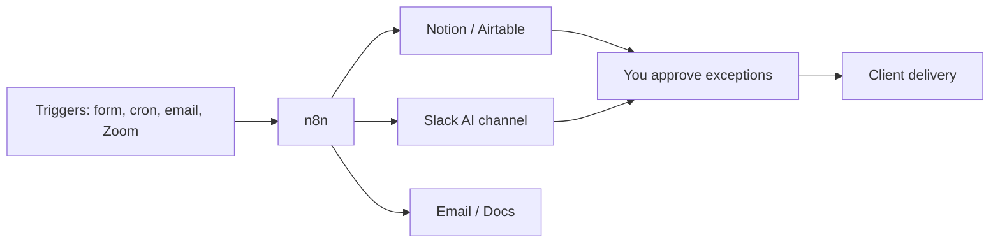

# Running a One-Person Business With AI: The Stack That Replaces a Part-Time Hire

A part-time hire is often a bundle of predictable weekly tasks dressed up as a job title. If those tasks are pull-data, draft-report, chase-invoice, triage-inbox, and update-the-tracker, you can wire most of them with a no-code AI stack and keep the human hours for judgment, sales, and delivery.

I'm William Spurlock, an AI Solutions Architect and Fractional AI CTO. I have built **500+ automations**, spent **20,000+ hours** architecting agentic systems, and tracked **35,000+ hours saved for clients** across service businesses that look a lot like a one-person shop: one calendar, one inbox, and too many "I'll do that Sunday" tabs.

This spoke sits under the pillar on [AI automation for solopreneurs](/blog/ai-automation-for-solopreneurs-the-5-workflows-that-save-the-most-time). Here the focus is narrower: the stack that replaces a **part-time admin / reporting hire** — especially client reporting — without pretending AI can close deals or rebuild broken client relationships for you.

---

## How Do I Automate Client Reporting for My Freelance Business?

**You automate client reporting by treating the report as a pipeline: scheduled pull → clean numbers → AI first draft → human approval → send — not as a blank document you rewrite from scratch every Monday.** The freelance version of this is boring on purpose. Boring is what ships.

Most freelancers lose 2–6 hours per client per month to the same ritual: open four tabs, export CSVs, paste into a slide or Notion page, write three paragraphs of "here's what happened," attach a PDF, email it. None of that needs your taste. It needs a trigger and a checklist.

### The reporting pipeline in plain steps

1. **Trigger** — cron every Monday 8am, or "project status = week complete"
2. **Pull** — Google Analytics, ads platforms, CRM, Stripe, time tracker, or your project board
3. **Normalize** — drop the fields you actually report (sessions, spend, leads, hours, tickets closed)
4. **Draft** — send a structured prompt to a model with last week's numbers + your voice rules
5. **Gate** — post the draft to Slack or email yourself; you edit or approve
6. **Deliver** — Notion page, Google Doc, PDF, or email to the client

That is the whole job. If a step needs a human every time (pricing excuses, scope fights, bad news), keep it out of auto-send.

### What "good enough" looks like in n8n

I wire most of these in **n8n** because the graph stays readable when you come back in three months. Drag a Schedule Trigger. Click Add node for each data source. Map fields into a single object. Add an AI node with a short prompt. Route the draft to Slack. Add an IF node so nothing sends until you react with ✅ or click Approve.

A real pattern from my library: **AI marketing report (Google Analytics & Ads, Meta Ads), sent via email/Telegram**. Same shape — pull the ad and analytics data, draft the narrative, ship the report through a channel the operator already checks. Your freelance version may use fewer platforms and a Notion page instead of Telegram. The graph stays the same.

### A prompt template that stays honest

Use a fixed prompt so the model cannot invent wins:

```text
You are drafting a weekly client report for {{client_name}}.
Use ONLY the metrics in the JSON below. If a metric is missing, say "not available."
Tone: plain, specific, no hype. 3 short sections:
1) What happened (facts)
2) What it means (1-2 sentences)
3) Next week focus (max 3 bullets)
Do not invent ROI, conversions, or anecdotes.
METRICS_JSON: {{metrics_json}}
```

Paste that into your AI node. Add variables for `client_name` and `metrics_json`. Run it on last week's data until the draft sounds like you after a coffee, not like a press release.

### Delivery options that clients actually open

| Delivery | Best when | Watch-out |
|---|---|---|
| Notion page link | Retainer clients who live in Notion | Permissions and guest access |
| Email + PDF | Corporate clients who want a file | PDF generation adds a node |
| Slack / Telegram | Internal or tech-forward clients | Wrong channel = missed report |
| Shared Google Doc | Clients who leave comments | Version chaos if you overwrite |

Start with one delivery method. Dual-channel "everywhere" reporting is how stacks break in month two.

### Week-one build for one client only

Do not automate your whole book of business on day one.

1. Pick your calmest retainer client
2. List the five numbers you always include
3. Build pull → draft → Slack approval
4. Send the first three reports yourself after editing
5. Only then turn on auto-send for that client

### Example n8n shape (config sketch, not paste-and-pray)

```json
{
  "name": "weekly-client-report",
  "trigger": "cron.monday_0800",
  "steps": [
    { "id": "pull_ga", "action": "googleAnalytics.report", "metrics": ["sessions", "conversions"] },
    { "id": "pull_ads", "action": "ads.spend_summary", "optional": true },
    { "id": "merge", "action": "set", "fields": ["client_name", "metrics_json"] },
    { "id": "draft", "action": "llm.draft", "model": "claude-sonnet-5", "autoSend": false },
    { "id": "approve", "action": "slack.post", "channel": "#client-reports" },
    { "id": "send", "action": "email.send", "when": "approval == true" }
  ]
}
```

Your node names will differ. The shape is what matters: schedule → pull → merge → draft → approve → send.

If you want the plain-English foundation for what these workflows even are, read [what AI automation means for business owners](/blog/what-is-ai-automation-a-plain-english-guide-for-business-owners).

---

## What Weekly Work Can a No-Code AI Stack Replace for a Solo Operator?

**A no-code AI stack can replace the weekly admin that is repetitive, field-based, and low-emotion: reporting, invoice chase, inbox triage, meeting notes, spend logging, and content first drafts — usually a part-time hire's busywork, not their judgment.** If a task needs empathy, negotiation, or taste under pressure, keep a human in the loop.

Think in hours, not vibes. Track one normal week. Highlight every block that looks like this: open app → copy data → rewrite same structure → send. Those blocks are automation candidates.

### The weekly work map

| Weekly task | Automate? | Why |
|---|---|---|
| Client status / metrics report | Yes, with approval | Structured numbers + fixed narrative |
| Invoice reminders | Yes | Rules + calendar, little taste needed |
| Lead first reply | Draft-only first | Brand voice still matters |
| Meeting notes → action list | Yes | Summaries are commodity work |
| Inbox triage / labels | Yes | Classification is cheap |
| Expense / payment logging | Yes | Extract + sheet row |
| Proposal pricing exceptions | No | Money + relationship risk |
| Scope change calls | No | Human conversation |
| Creative direction | No | Taste is the product |

### Meeting notes and action chase

A part-time assistant often "owns" Zoom follow-up. You can own the pipeline instead. In my n8n library, **Zoom PA | Zoom API -> Meeting Summary -> Action Steps -> Clickup** is the exact pattern: meeting ends → summary → action steps → task tool. Drag the Zoom trigger, add the AI summary node, map action items into ClickUp (or Notion / Asana). Run until the tasks look right. You still run the meeting. The stack runs the paperwork.

### Spend and payment logging

Solo operators leak hours hunting receipts. **Spending Manager | Extract Payments from Gmail -> Parse -> Add to Sheets** is the receipt-name pattern: Gmail payment emails → extract fields → sheet row. Same idea works for Stripe payouts or PayPal confirmations. Click the Gmail trigger, add the extraction step, map columns, run on a folder of labeled emails until the sheet rows match reality.

### Content and newsletter first drafts

If you publish weekly, the first draft is part-time-hire work. The send decision is not. The newsletter build in [how to build an AI-powered newsletter that writes and sends itself](/blog/how-to-build-an-ai-powered-newsletter-that-writes-and-sends-itself) is the same philosophy: research → draft → human gate → send. Do not skip the gate.

### Hours you can usually reclaim (ranges, not promises)

| Bundle | Typical reclaim | Notes |
|---|---|---|
| Weekly client reporting (2–5 clients) | 2–8 hrs/week | Highest ROI for retainers |
| Invoice reminders + payment logging | 1–3 hrs/week | Cash-flow insurance |
| Meeting notes → tasks | 1–4 hrs/week | Scales with call volume |
| Inbox triage labels | 1–3 hrs/week | Draft replies stay human at first |
| Combined admin pack | often **6–15 hrs/week** | Depends on volume and how messy tools are |

Those ranges come from solo and small-operator builds in the same family as the **500+ automations** I have shipped. Your week will differ. Measure two baseline weeks before you brag about savings.

### What this replaces in dollar terms

A solid part-time VA in the US often lands around **$800–$2,000/month** for 10–20 hours/week, depending on skill and timezone. A focused automation stack for reporting + reminders + notes often lands in the **$50–$200/month** tool range once built, plus your setup time. That is not "AI replaces people." That is "stop paying recurring hours for work a Schedule Trigger can do."

If your VA is already doing high-trust client communication and messy exception handling, keep them. Automate the spreadsheet hours around them.

---

## What Does a Realistic One-Person AI Stack Look Like in 2026?

**A realistic 2026 solo stack is n8n as the spine, plus the AI already inside the tools you live in — Notion AI, Airtable AI, Slack AI — with a strong model (Claude Sonnet 5 or GPT-5.4 mini) only where a workflow needs a real first draft.** You do not need an enterprise "AI platform." You need five tools that talk to each other and one operator who will fix a broken OAuth token on a Tuesday.

### The stack diagram



### Tool roles (keep them boring)

| Layer | Tool | Job |
|---|---|---|
| Spine | **n8n** | Triggers, joins data, calls models, routes approvals |
| Source of truth | **Airtable** or Notion DB | Clients, projects, report status, send dates |
| Writing surface | **Notion AI** | In-doc cleanup, meeting notes polish, page drafts |
| Ops chat | **Slack AI** | Summarize threads, find "where did we leave this?" |
| Model calls | **Claude Sonnet 5**, **GPT-5.4 mini**, **Gemini 3.5 Flash** | Drafts, classification, extraction inside n8n |
| Hard problems | **Claude Opus 4.8** (sparingly) | Long messy briefs, multi-file research — not weekly reports |

### Why this beats "buy one enterprise AI suite"

Enterprise suites sell dashboards. Solo operators need pipelines. Your reporting data already lives in Google Analytics, Stripe, HubSpot, or a spreadsheet. Your clients already live in email or Slack. n8n sits in the middle and moves facts. Notion AI / Airtable AI / Slack AI handle the in-place "rewrite this paragraph" moments without another login.

If you are choosing between automation platforms, the comparison in [n8n vs Make vs Zapier in 2026](/blog/n8n-vs-make-vs-zapier-in-2026-which-automation-tool-is-right-for-your-business) is the decision guide. Short version for this post: **n8n** if you want control and readable graphs; **Make** if you want faster light builds; **Zapier** if your stack is already Zapier-native and you value support over flexibility.

### In-platform AI: what to use it for

- **Notion AI** — turn messy meeting bullets into a clean client update page; rewrite your draft report for clarity after n8n drops numbers in
- **Airtable AI** — fill a "summary" field from status + hours columns; classify project health without leaving the base
- **Slack AI** — catch up on a client channel before the Monday call; ask "what blockers were mentioned this week?" instead of scrolling

None of those replace the n8n pull. They replace the "stare at the page and retype" minutes.

### A realistic monthly cost band (estimates)

| Item | Typical solo range | Notes |
|---|---|---|
| n8n Cloud or VPS | $0–$50+ | Self-host can be cheaper; your time is the tax |
| Notion / Airtable / Slack | often already paid | AI add-ons vary by plan |
| Model API usage | $10–$80 | Reporting drafts are cheap; research loops cost more |
| Total tools | often **under $150/mo** | Vs part-time hire at many times that |

These are operating ranges from builds I ship, not a quote. Your ads APIs and email volume change the bill.

### What I would not put in the solo stack

- A second CRM "because AI"
- Five overlapping AI writing apps
- Unattended agents with write-access to client email
- Custom code for problems a node already solves

One spine. One source of truth. One approval channel. That is enough.

### Operator maintenance tax (budget this or the stack dies)

| Cadence | Task | Time |
|---|---|---|
| Weekly | Skim error channel; re-approve one draft | 15–30 min |
| Monthly | Rotate any shared keys; check unused nodes | 30–45 min |
| After tool changes | Re-test the pull that broke (GA, ads, CRM) | 30–90 min |
| Quarterly | Kill workflows you no longer need | 20 min |

If you will not own that tax, hire someone who will — or stay manual. Abandoned automation is worse than no automation because it fails politely while you assume Monday reports still went out.

---

## How Do You Keep Quality High When AI Does the First Draft of Reporting and Admin?

**You keep quality high by constraining inputs, freezing voice rules, requiring human approval on anything client-facing, and failing loud when data is missing — not by hoping the model "gets it."** AI is a junior analyst who never sleeps and never remembers your brand unless you put the rules in the prompt every run.

### Quality rules that actually hold

1. **Numbers first, narrative second** — the model only sees a JSON of metrics you already trust
2. **Missing data must say "not available"** — never invent a conversion rate
3. **Approval before send** for the first 30 days on every new client
4. **One voice card** — three sample paragraphs of your real writing, pasted into the system prompt
5. **Fail loud** — if Google Analytics auth dies, Slack you immediately; do not send last week's ghost report

### The two-lane review

| Lane | AI may auto-finish? | Human must touch? |
|---|---|---|
| Internal triage labels | Yes | Spot-check weekly |
| Expense sheet rows | Yes, with anomaly flag | Review flags |
| Client report draft | No until trusted | Always for week 1–4 |
| Invoice reminder | Yes after template lock | Exceptions only |
| Apology / scope email | Never | Always |

### A 10-minute Monday QA checklist

- Open the draft in Slack / Notion
- Check the five hero metrics against the source tabs
- Kill any sentence that sounds like a brochure
- Add one human observation only you would know ("creative v2 landed Thursday")
- Approve send

That is the hire you are replacing: the person who assembled the pack. You keep the editor hat. Editors are cheap in minutes when the pack arrives pre-built.

### Voice card example

```text
VOICE CARD
- Short sentences. Specific numbers.
- Never say "excited to share" or "thrilled."
- Prefer "Sessions were flat week over week" over "performance was solid."
- If results are bad, say so in one clear sentence, then the next test.
```

Put the voice card above the metrics JSON. Models follow the nearest instructions when you keep them short.

### Common failure modes (and the fix)

| Failure | What you see | Fix |
|---|---|---|
| Hallucinated metric | "ROAS hit 6.2x" when field was empty | Require "not available"; validate required keys before AI node |
| Wrong client name | Template bleed across clients | Pass `client_name` as a variable; never hardcode in prompt |
| Stale OAuth | Empty pull, cheerful draft | Error workflow → Slack alert; skip send if metrics null |
| Tone drift | Soft corporate filler | Voice card + ban list in prompt |
| Over-automation | Auto-sent bad news | Keep emotion / money / legal on human send |

Quality is a process design problem. If your process allows empty data into a send node, the model is not the villain.

---

## When Should You Still Hire a Human Instead of Automating?

**Hire a human when the work is messy, emotional, relationship-heavy, or higher-stakes than a wrong Slack message — automation wins on repetition; people win on exceptions.** The goal of this stack is not a ghost business. It is a calmer operator who spends hire-budget on taste and trust, not CSV exports.

### Hire (or keep) a human when…

- Clients expect a named person on status calls
- You are in a turnaround month with angry stakeholders
- The "report" is really a strategy conversation with slides as props
- Legal, medical, financial advice sits in the deliverable
- You hate maintaining tools and would rather pay someone who will
- Volume spikes faster than you can harden workflows

### Automate first when…

- The task repeats weekly with the same fields
- A wrong draft is easy to catch before send
- Tool APIs are stable and documented
- You can name the hours saved on a calendar
- You are the bottleneck and sales/delivery pay more than admin

### The hybrid that works for most freelancers

| Work | Owner |
|---|---|
| Data pull + first draft | n8n + model |
| Tone pass + bad-news framing | You |
| Inbox sort + reminders | Automation |
| Relationship repair | You or a sharp VA |
| Tool babysitting | You (30 min/week) or ops VA |

Many solo operators end up here: automation for the predictable 70%, a human for the awkward 30%. That hybrid usually beats "AI will run it" theater and "hire for everything" burn.

### A simple decision test

Ask three questions before you post a job listing for part-time admin:

1. Can I write the steps as a checklist a stranger could follow?
2. Does the task happen at least weekly?
3. Is the blast radius of a mistake an edit — not a lawsuit or a lost retainer?

If yes to all three, build the workflow. If no to any, hire or keep doing it yourself until the process stabilizes.

---

## Frequently Asked Questions

### What is the minimum stack to replace a part-time reporting hire?

**n8n (or Make), one source of truth (Airtable or Notion), Slack or email for approvals, and one model for drafts — that is enough.** Add Notion AI / Airtable AI / Slack AI only where you already work. More tools do not equal more hours saved.

### How much does a solo AI reporting stack cost per month versus a part-time hire?

**Tooling often lands under about $150/month once built; a part-time admin hire commonly runs many times that in wages alone.** Your real cost is setup hours and weekly QA. If you will not protect 30 minutes a week for maintenance, do not automate yet.

### Can Notion AI or Airtable AI replace n8n for client reporting?

**Not for multi-app pulls on a schedule.** Notion AI and Airtable AI are strong inside their surfaces. They do not replace a spine that joins Google Analytics, ads, Stripe, and email on Monday at 8am. Use them for polish and field fills; use n8n for the pipeline.

### How do I stop AI from inventing metrics in client reports?

**Only pass verified JSON fields into the prompt, ban invention in the instructions, and block send when required keys are missing.** If the model has no number, it must say "not available." That one rule prevents most trust damage.

### What should I automate in week one as a freelancer?

**One client, one report, draft-only delivery to yourself.** Get three clean weeks. Then enable client send. Week one is not the time to automate proposals, refunds, and five dashboards.

### What are the most common failure modes in a one-person AI stack?

**Dead OAuth tokens, empty data still reaching the draft node, voice drift, and auto-send turned on too early.** Fix with error alerts, null checks, a voice card, and a human approval gate. Silent failure is the expensive kind.

### Do I need Claude Opus 4.8 for weekly client reporting?

**No. Claude Sonnet 5, GPT-5.4 mini, or Gemini 3.5 Flash is plenty for structured weekly drafts.** Save Opus-class models for long messy research or high-stakes writing. Reporting is a template job with fresh numbers.

### Can this stack replace my VA completely?

**It can replace the VA's repetitive reporting and logging hours; it does not replace a VA who handles upset clients, messy exceptions, and calendar politics.** Many freelancers keep a smaller human retainer and let automation eat the spreadsheet work.

### How do I keep client data safe in these workflows?

**Use least-privilege API keys, separate client folders or bases, avoid pasting secrets into prompts, and keep send nodes on approval until you trust the path.** If a client requires strict compliance language, get that in writing before you connect their accounts.

### Is Make or Zapier fine if I do not want to self-host n8n?

**Yes — pick the tool you will actually maintain.** The reporting shape (pull → draft → approve → send) ports across platforms. n8n wins for control in my builds; Make and Zapier win for speed and comfort for many solo operators. Choose based on your stack and patience, not Twitter arguments.

---

## Book an AI Automation Strategy Call

If you want this stack mapped to your real clients, tools, and weekly hours — not a generic AI tour — [book an AI automation strategy call](/contact). We will pick the first reporting or admin workflow, set the approval gates, and keep the hire budget pointed at work that still needs a human.
