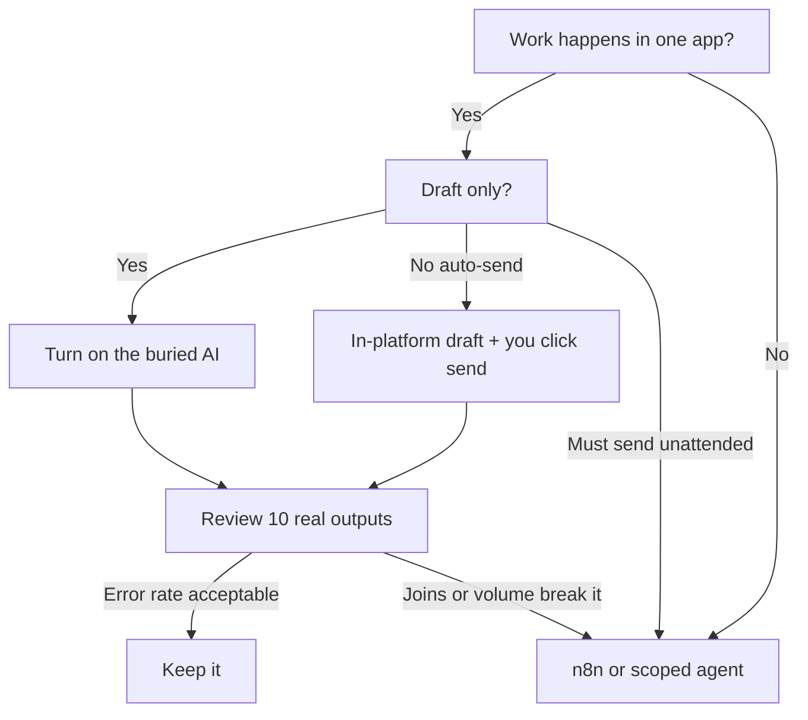

# The AI Already Inside Your Tools (And Why Most Owners Never Turn It On)

**The AI most owners need first is already sitting inside Notion, Airtable, HubSpot, Slack, Shopify, and Google Workspace — usually behind a plan toggle, a credit pack, or a settings checkbox they never opened.** Buying a new agent before you flip those switches is how you pay twice for the same first draft.

I'm William Spurlock, an AI Solutions Architect and Fractional AI CTO. I have built **500+ automations**, spent **20,000+ hours** architecting agentic systems, and tracked **35,000+ hours saved for clients**. The pattern I keep seeing in 2026 is not "we have no AI." It is "we bought ChatGPT Plus, then a second writing app, then an agent demo — and Slack recap, Notion Autofill, and Shopify Magic are still off."

This spoke sits under [the one-person stack that replaces a part-time hire](/blog/running-a-one-person-business-with-ai-the-stack-that-replaces-a-part-time-hire). That post owns the **hire-replacement pipeline**: n8n as the spine, report pull, approval, send. This post owns a narrower question: **what is already inside the tools you pay for, and when is that enough?** I mention Shopify Magic and HubSpot Breeze as examples here. I am not writing a product tour of either one.

If you still need the plain-English definition of a workflow vs a model, start with [what AI automation actually is](/blog/what-is-ai-automation-a-plain-english-guide-for-business-owners).

---

## What In-Platform AI Features Are Already Inside the Business Tools I Pay For?

**In-platform AI is the writing, search, classify, and draft-action layer the vendor already shipped inside the app you pay for — Notion Autofill and Notion Agent, Airtable Omni and field agents, HubSpot Breeze Assistant plus Agent Hub, Slack summaries and recaps, Google Workspace Gemini, Shopify Magic and Sidekick.** It lives next to the record. It is not a second login, and it is not n8n.

I split the category this way when I audit a stack:

| Layer | What it is | Example already in the product |
|---|---|---|
| In-place rewrite | Edit or fill text where you already work | Notion inline AI, Shopify Magic product copy, Gemini in Gmail/Docs |
| In-base classify / fill | Write a field from other fields or a file | Notion Autofill, Airtable field agents |
| In-app ask | Question over data you can already see | Slack search answers, Airtable Omni, Breeze Assistant |
| In-app draft action | Propose a change; you confirm | Shopify Sidekick, HubSpot Agent Hub agents |
| Cross-app spine | Trigger, join systems, approve, send | **n8n** (or Make / Zapier) — not buried; you build it |

The buried features I actually turn on first, as of **30 August 2026**, look like this. Feature names move. I cite the vendor help page and I hedge the label.

| Tool you already pay for | Buried AI feature (as labeled in vendor help) | Enough when | Still need n8n or a custom agent when |
|---|---|---|---|
| **Notion** | [Basic Autofill](https://www.notion.com/help/autofill) and Custom Agent Autofill; [Notion Agent](https://www.notion.com/help/notion-ai-faqs) / [Custom Agents](https://www.notion.com/help/custom-agents) | Summaries, tags, translations, in-doc cleanup, meeting notes polish | You need a Monday pull from analytics + CRM, then an approved send |
| **Airtable** | [Omni](https://support.airtable.com/docs/using-omni-ai-in-airtable); [field agents](https://support.airtable.com/docs/using-airtable-ai-in-fields) | Fill or classify cells in one base; ask the base a question | You must join Stripe, Gmail, and a second CRM on a schedule |
| **HubSpot** | [Breeze Assistant](https://www.hubspot.com/products/artificial-intelligence/breeze-ai-assistant) (included); [Agent Hub](https://knowledge.hubspot.com/ai/understand-agent-hub) (BETA, updated 21 Aug 2026) | Meeting prep, CRM-native drafts, HubSpot-only prospecting/support agents | The work lives outside HubSpot, or you need a hard approval graph |
| **Slack** | [Conversation summaries, huddle notes, search answers, recaps, Slackbot](https://slack.com/help/articles/25076892548883-Guide-to-AI-features-in-Slack) | Catch-up, "where did we leave this?", huddle notes canvas | You need the recap to create a task, invoice, or ticket in another app |
| **Google Workspace** | [Gemini in Gmail, Docs, Sheets, Meet](https://support.google.com/a/users/answer/15146419) ("Help me write", "Take notes for me") | First draft in the file you already share | The draft must also update Airtable and ping Slack on a cron |
| **Shopify** | [Shopify Magic](https://help.shopify.com/en/manual/shopify-admin/productivity-tools/shopify-magic) text generation; [Sidekick](https://help.shopify.com/en/manual/ai-powered-tools/sidekick) | Product/blog/email drafts; admin changes **for review** | Inventory, 3PL, ads, and wholesale rules span apps Sidekick cannot join |

That table is the whole post. Everything below is how I prove each row and how I stop owners from treating the table as a shopping list.

### What "already inside" actually means

**Already inside** means the feature ships in the product you log into every morning. It may still be:

- **Plan-gated** — Slack search answers and recaps sit on Business+ and Enterprise+ in Slack's own [plan table](https://slack.com/help/articles/25076892548883-Guide-to-AI-features-in-Slack); Notion Autofill is documented on Business and Enterprise
- **Credit-gated** — Notion Custom Agent Autofill uses [Notion credits](https://www.notion.com/help/buy-and-track-notion-credits-for-custom-agents); Airtable Omni analysis and field-agent runs consume [AI credits](https://support.airtable.com/docs/airtable-ai-billing)
- **Admin-gated** — a Workspace admin can turn Gemini off; a Slack owner can restrict AI; HubSpot AI settings control what data Breeze can see

None of those are "you need a new vendor." They are "you need to open Settings."

### What I do not count as in-platform AI

- A browser extension that rewrites Gmail from a third-party account
- A standalone agent that asks for your Notion token on day one
- An MCP server you have not built yet — useful later; [your first MCP server](/blog/your-first-mcp-server-without-a-developer-what-it-takes-and-what-it-does) is a different job
- A model API call you wired yourself in n8n (that is the spine, not the buried switch)

If the feature requires a second product name on the credit card, it is not "already inside."

---

## Why Do Most Owners Never Turn Those Features On?

**Most owners never turn in-platform AI on because the switch is buried under plan, credits, and admin settings — and a new agent demo feels like progress while a settings checkbox does not.** The second reason is fear: they have seen a bad auto-send, so they leave the useful draft layer off too.

I have sat on calls where the founder already pays for Notion Business, Slack paid, Shopify, and Google Workspace. They still ask me which agent to buy. When I open Settings with them, the AI row is Off, or the AI add-on was never purchased, or an admin locked Gemini because "we are not ready." That is not a tooling gap. That is an attention gap.

### The five reasons I see most often

| Reason | What it looks like | What I do instead |
|---|---|---|
| Buried UI | The sparkle icon is one more toolbar button they trained themselves to ignore | I book 20 minutes and we click it together on one real record |
| Plan confusion | They are on Slack Pro and expect recaps; recaps sit on Business+ / Enterprise+ per Slack's [guide](https://slack.com/help/articles/25076892548883-Guide-to-AI-features-in-Slack) | We match feature to plan before we buy anything else |
| Credit anxiety | They heard "AI credits" and assumed a surprise bill | We read Notion / Airtable credit docs, then run one cheap fill |
| Admin lock | Workspace or Slack owner turned AI off for the whole org | We ask for a single OU or workspace exception, not a company-wide flip |
| Demo theater | A vendor showed a shiny agent; their own Autofill never got a prompt | We win one boring field first, then talk agents |

### The "new agent" reflex

Buying a new agent feels like a decision. Turning on Autofill feels like homework. Founders are addicted to decisions. I am not being cute about that. I do the same thing when I am tired.

The cost of the reflex is real:

1. You pay a second subscription for a first draft the CRM or store can already propose
2. You create a second place where "the AI" lives, so nobody knows which prompt is canonical
3. You skip the review habit you already needed inside the tool you trust

If you want the hire-vs-stack math, that lives in [what AI automation actually costs](/blog/what-does-ai-automation-actually-cost-a-realistic-breakdown-for-2026). This post stays on the unused switch.

### What I tell them in the first ten minutes

- **Do not buy a new chat product** until you have used the AI already in the app you open every day
- **Do not grant write-access** to a new agent until the in-platform draft has survived two weeks of your edits
- **Do not turn on every toggle.** Pick one surface: meeting notes, product copy, or CRM meeting prep

That last line is the whole discipline. Unused AI is waste. Unattended AI is a different, worse waste. The middle is a draft you read.

---

## What Notion AI Can Already Do Inside a Workspace You Pay For

**Notion AI can already summarize pages, rewrite inline, Autofill database properties, take meeting notes, and run a Notion Agent or Custom Agent on the pages you grant — if you are on a plan that includes it.** [Notion's own FAQ](https://www.notion.com/help/notion-ai-faqs) states Notion AI is available on Business and Enterprise. Free and Plus users should confirm current complimentary limits in that same article; I do not treat those as "full Notion AI."

I use Notion as a writing surface, not as a spine. That is the same split I wrote in the [one-person hire-replacement stack](/blog/running-a-one-person-business-with-ai-the-stack-that-replaces-a-part-time-hire). Here I get specific about the switches.

### The two Autofill modes (names as of this writing)

Notion's [Autofill help](https://www.notion.com/help/autofill) splits the feature in two. If the UI label moves, the job stays:

| Autofill mode | Notion documents it as | Enough for | Not enough for |
|---|---|---|---|
| **Basic Autofill** | Simple fills: summaries, tagging, translation; included on Business and Enterprise; **does not use Notion credits** | "Summary" and "next action" columns on a meeting-notes database | Anything that needs other pages, Slack, or the web |
| **Custom Agent Autofill** | Multi-step instructions; optional workspace or web search; **uses Notion credits** | A property that must read more than the current row | A scheduled email to a client with numbers from Google Analytics |

Basic Autofill only reads **that row / page**. Owners get angry when it "doesn't know the rest of the workspace." That is the documented limit, not a bug. If you need workspace or web search in the fill, Notion tells you to switch to Custom Agent Autofill and turn search on in the agent settings.

### Notion Agent vs Custom Agents

[Notion's Custom Agents help](https://www.notion.com/help/custom-agents) draws a clean line I repeat to clients:

- **Notion Agent** — on-demand chat. You ask. It edits pages and databases you can access.
- **Custom Agents** — background runs on triggers and schedules. They only touch the pages, databases, and apps you grant. Notion says they never get full workspace access by default.

Custom Agents require Business or Enterprise, and they burn [Notion credits](https://www.notion.com/help/buy-and-track-notion-credits-for-custom-agents). Notion recommends **Auto** for model choice so the workspace does not default to the most expensive model on every run. As of this writing, Notion lists Claude Sonnet 5, current GPT models, Gemini, Grok, and (on Business/Enterprise, admin-gated) Claude Fable 5. I treat that list as vendor-current and I re-check Settings → Notion AI before I quote a model name on a call.

### A one-hour Notion setup I actually run

1. Open the database you already live in (clients, meetings, or content)
2. Add a **Summary** property → AI Autofill → Basic
3. Add a **Status tag** property → Basic Autofill with a closed list of tags you already use
4. Run it on ten rows. Edit the bad ones. Tighten the instruction. Do not add web search yet
5. Only then consider Custom Agent Autofill for a property that must cite another page

### When Notion AI is enough vs when I still open n8n

| Job | Notion AI | n8n / custom agent |
|---|---|---|
| Clean up messy meeting bullets into a page | Yes | No |
| Autofill "health" from status + notes on that row | Yes (Basic) | No |
| Pull last week's ad spend into the same page, every Monday | No | Yes |
| Send the page to the client after you approve | Notion cannot own that reliably across email tools | Yes |

If your whole week is "rewrite this page," stop shopping. Turn Autofill on. If your week is "join three systems and send," Notion is the document, not the engine.

For a Notion-native triage pattern I already published, see [Notion for a solo studio](/blog/notion-solo-studio-ai-triage). That post is studio ops. This one is the unused switch.

---

## What Airtable Omni and Field Agents Can Do Without Leaving the Base

**Airtable already ships Omni as an in-app assistant and field agents as AI columns that fill, classify, or extract at the cell — if workspace AI is on and you have [AI credits](https://support.airtable.com/docs/airtable-ai-billing).** [Airtable's Omni help](https://support.airtable.com/docs/using-omni-ai-in-airtable) describes Omni as the assistant that builds apps, researches the web, analyzes data and documents, creates or updates records, and answers questions in plain language.

I treat Airtable as a source of truth, not as a replacement for n8n. Omni can sketch tables, interfaces, and Airtable automations. It does not become your Stripe-to-Gmail-to-Slack spine.

### Field agents vs Omni (do not mix the jobs)

Airtable's [AI-in-fields help](https://support.airtable.com/docs/using-airtable-ai-in-fields) calls most AI-enabled columns **field agents**. They retrieve, analyze, or generate at the cell. Owners or Creators add them. Editors can click Generate. AI credits and workspace-level AI must be on.

| Feature | Job | Credit note (Airtable's billing help) |
|---|---|---|
| **Omni** — ask / build | "Build me an interface," "what's late this week?" | Building and iterating apps with Omni is documented as **not** consuming AI credits; analysis questions do |
| **Field agent** | Fill a Summary, extract a PDF, classify feedback | Runs consume credits; more capable models cost more |
| **Airtable automations with AI actions** | Recurring in-base fills | Ongoing credit burn — Airtable warns when an action will keep consuming |

I do not quote a hard credit price here. Packs and included monthly credits change by plan. I send operators to [Airtable AI billing](https://support.airtable.com/docs/airtable-ai-billing) the week they turn this on. Enterprise admins also choose which model families are allowed; Airtable documents that Omni can fail if the org only enabled certain non-OpenAI / non-Amazon model sets. Confirm in admin panel. Do not assume every workspace can run Omni.

### A field-agent prompt I actually use

Keep the instruction short and closed. This is a prompt, not a code tutorial:

```text
You are filling the Summary field for this Airtable record.
Use ONLY: Status, Hours this week, Blocker, Client name.
Write 2 sentences. If Hours this week is empty, write "hours not logged."
Do not invent revenue, ROI, or a next meeting date.
Tone: plain, specific, no hype.
```

Paste that into Custom instructions. Run ten records. Compare to what you would have typed. If it invents a meeting, the instruction is too loose — not "AI is broken."

### When Omni / field agents are enough vs when I still need n8n

| Job | In-platform Airtable AI | Still need n8n / an agent |
|---|---|---|
| Classify inbound form notes into a Status | Field agent | No |
| Extract line items from an attached invoice PDF into fields | Field agent (document extraction) | Only if the PDF lives in Gmail, not the record |
| Ask "which retainers have no update this week?" | Omni | No — if the dates live in this base |
| Create the Stripe invoice, wait for paid, then flip Status | No | Yes |
| Email the client a report assembled from GA + this base | No | Yes |

Omni is excellent at "make the base I described." It is average at "talk to five vendors I did not give you." When a shop tells me Omni will replace their automation platform, I walk the Stripe / email / calendar path with them until they see the hole. Then we pick n8n. The platform comparison is in [n8n vs Make vs Zapier in 2026](/blog/n8n-vs-make-vs-zapier-in-2026-which-automation-tool-is-right-for-your-business).

---

## What HubSpot Breeze and Agent Hub Already Cover (And What They Do Not)

**HubSpot already includes Breeze Assistant as the in-app helper on the subscription, and it now parks agents in Agent Hub — formerly labeled Breeze Agents — where you activate Data, Prospecting, Customer, Deal progression, and custom agents.** I hedge the names on purpose. HubSpot's own [Breeze Assistant page](https://www.hubspot.com/products/artificial-intelligence/breeze-ai-assistant) says Assistant is included at no extra cost, and it states **Agent Hub, formerly Breeze Agents**. The [Agent Hub knowledge article](https://knowledge.hubspot.com/ai/understand-agent-hub) was last updated **21 August 2026** and still marks Agent Hub as BETA. If your UI still says Breeze Studio, HubSpot now calls that **Agent builder**.

This is not a HubSpot-Breeze product clone. I am answering one owner question: **what is already in the CRM you pay for?**

### Two different products, one login

| Surface | What HubSpot documents | Enough when | Not enough when |
|---|---|---|---|
| **Breeze Assistant** | In-app helper that uses CRM records, HubSpot Academy, and (if connected) Workspace / Microsoft 365 / Slack | Meeting prep, "what should I do on this deal," draft copy you paste yourself | You need a hard outbound send with an approval graph across non-HubSpot tools |
| **Agent Hub (BETA)** | One place to activate, monitor, and build agents; HubSpot Credits required | CRM-native prospecting, data enrichment, support replies, deal nudges inside HubSpot | The system of record is Airtable, a trade dispatch tool, or a custom shop |

Agent Hub's Intro tab, as of the 21 Aug 2026 article, lists cards I treat as examples — not a promise every portal has every card:

- **AEO** — brand visibility in AI search (HubSpot's label; different job than this post)
- **Data agent** — enrich and clean CRM fields
- **Prospecting agent** — research accounts, draft outreach
- **Deal progression** — pipeline recommendations
- **Customer agent** — support conversations

Professional or Enterprise on the relevant Hub is the documented gate. Super admins still have to turn generative AI and data-sharing on in AI settings. I have watched owners assume "we bought Marketing Hub" meant every agent was live. It was not. The card said Activate.

### What I turn on first in HubSpot (and what I leave off)

1. **Breeze Assistant** — already included; use it for meeting prep on one real deal this week
2. **AI settings** — confirm what data is shared; read HubSpot's AI Trust FAQs before you let an agent write
3. **One Agent Hub card** — Data agent *or* Customer agent, not five
4. **Context tab** — company voice, ICP, a small knowledge vault. An agent without context writes generic email. That is on you.

I do not activate Prospecting agent on day one if the owner has never reviewed a Breeze draft. Unattended outreach is how you burn a domain. For the wider "which ops tasks even belong on an agent" map, use [AI agents for operations](/blog/ai-agents-for-operations-replacing-the-repetitive-tasks-that-drain-your-team). That post owns the agent. This post owns the unused CRM switch.

### Marketing numbers I will not launder

HubSpot's Assistant marketing page cites deal and lead multiples. Those are vendor averages on their page, not my client results, and I will not repeat them as if I measured them. If a number is not on a dated help article I can defend, it stays off this page.

---

## What Slack AI and Google Workspace Gemini Already Do for Chat and Docs

**Slack already summarizes channels and threads, takes huddle notes into a canvas, and — on Business+ and Enterprise+ — answers search questions, writes daily recaps, and offers Slackbot as a personal agent.** Google Workspace already puts Gemini in Gmail, Docs, Sheets, Slides, Drive, Chat, and Meet ("Help me write," "Take notes for me") if the admin and the user both leave smart features on.

These two are the "I already live here" layer. Most owners treat them as chat and email. The AI is a sidebar they never opened.

### Slack: what is on which plan

Slack's own [Guide to AI features](https://slack.com/help/articles/25076892548883-Guide-to-AI-features-in-Slack) is the table I trust. I compress it for operators:

| Feature | Pro | Business+ / Enterprise+ |
|---|---|---|
| Conversation summaries (channel, DM, thread) | Yes | Yes |
| Huddle notes (canvas with topics + action items) | Yes | Yes |
| Automatic search filters | Yes | Yes |
| Search answers with citations | No | Yes |
| Daily recaps | No | Yes |
| File summaries, translations, canvas generation | No | Yes |
| Slackbot (personal AI agent) | Preview / limited on free and Pro, per Slack | Yes |
| Enterprise search across connected apps | No | Enterprise+ |

Legacy Business+ or Enterprise Grid **without** the Slack AI add-on only gets the Pro set. Slack says that in the same guide. If recap is missing, you do not have a "Slack is dumb" problem. You have a plan or add-on problem.

Slack also documents that AI answers only use content **you can already see**. That is the permission model I want. It is also why Slack AI cannot invent a decision that lived in a private channel you are not in.

### What I use Slack AI for (and what I refuse)

| Use | I do this | I do not do this |
|---|---|---|
| Monday catch-up | Recap or Summarize on the client channel before the call | Paste the recap to the client without reading sources |
| Huddle | AI notes on, then I edit the action list | Auto-create Asana tasks from a messy huddle |
| Search | "What did we decide on the September ship date?" | Treat the answer as a contract without clicking citations |
| Slackbot | Draft a canvas *inside Slack* | Let Slackbot email a customer |

Slack AI is a catch-up tool. It is not a dispatcher. When the recap needs to become a ClickUp task, a Stripe reminder, or a Notion page on a schedule, that is n8n.

### Google Workspace Gemini: the switches people miss

Google documents [Workspace with Gemini](https://support.google.com/a/users/answer/15146419) as a side panel plus inline help. The admin article on [managing Gemini access](https://knowledge.workspace.google.com/admin/generative-ai/workspace-with-gemini/manage-access-to-gemini-features-in-workspace-services) is the one that surprises owners: the admin can disable Gemini per service (Gmail, Calendar, Drive/Docs/Sheets/Slides, Meet, Chat, Workspace Studio), and **users still have to turn on smart features and personalization**. I have watched a founder swear Gemini "isn't in Gmail" while both toggles were off.

As of Google's [July 2026 Workspace feature drop](https://workspace.google.com/blog/product-announcements/july-2026-workspace-feature-drop), Gemini in Docs can help action comments and suggest edits you accept. Meet still has "take notes for me," and admins can block that separately. Feature names will move. The job will not: **draft in the file, notes in the meeting, you accept.**

| Workspace surface | Buried AI job | Enough when | Still need n8n |
|---|---|---|---|
| Gmail | Help me write / refine | First reply you will edit | Auto-send + CRM write-back |
| Docs | Draft, summarize, action comments | Internal briefs | Client-facing send on a cron |
| Sheets | Tables, formulas, analysis | One-off cleanup | Nightly join from three APIs |
| Meet | Take notes for me | You were on the call | Notes → tasks in another tool, every time |

I use Gemini 3.5 Flash-class speed for cheap drafts when I am in an API, and I keep Claude Sonnet 5 or GPT-5.4 mini for voice-sensitive copy inside n8n. Inside Workspace, I use whatever Gemini the tenant is on. I do not fight the vendor model for a meeting-notes first pass.

---

## What Shopify Magic and Sidekick Already Do for a Store You Run

**Shopify Magic is the free in-admin text (and related) generation layer; Sidekick is the commerce assistant that drafts content, answers store questions, and prepares admin changes for you to review.** Shopify's [Magic help](https://help.shopify.com/en/manual/shopify-admin/productivity-tools/shopify-magic) calls Magic a suite of free AI-powered features across admin workflows. Shopify's [Sidekick help](https://help.shopify.com/en/manual/ai-powered-tools/sidekick) says Sidekick works from store context and **presents changes for review before applying them**. That last clause is the whole product, if you use it.

I am not writing a Magic/Sidekick sibling post. I am putting both on the same "already inside" map as Notion and Slack.

### Magic vs Sidekick (stop treating them as one blob)

| Feature | Official job | Enough when | Still need n8n / an agent |
|---|---|---|---|
| **Shopify Magic** | Generate suggestions for product descriptions, blog posts, email subject lines, theme headings, Inbox-style replies, segment descriptions | You need a first draft on a product you can fact-check | Catalog-wide unique copy from a PIM, plus SEO rules, plus a human queue in another tool |
| **Sidekick** | Chat or Pulse recommendations; analyze data; edit products; prepare order or theme changes; generate apps; saved skills | One-off admin work you will click Review on | 3PL, wholesale rules, ads, and a second storefront the assistant cannot see |

Shopify's product-description help is blunt: give a title plus at least two features or keywords, then **edit before you save**. Published products go live with whatever you left in the box. That is not "AI failed." That is you skipping the review Shopify already designed.

Sidekick can keep working in the background after you close chat and notify you when a longer task is ready for review. I like that. I still do not let it own inventory truth if a 3PL or a spreadsheet is the real count.

### A Magic prompt I use for a product draft

```text
Write a product description for {{title}}.
Facts you may use: {{feature_1}}, {{feature_2}}, {{material}}, {{size}}.
Do not invent certifications, lab results, or "bestseller" claims.
Tone: plain, specific, no hype. 120-160 words.
If a fact is missing, omit it. Do not guess.
```

Then I read every number and every material. If Magic added a benefit I did not type, I delete it. The store owner is responsible for accuracy — Shopify says that; I agree.

### Store jobs that still want a spine

- Nightly inventory reconcile against a 3PL
- Wholesale price lists that are not the retail catalog
- Ad creative + spend sitting in Meta, not in Shopify
- A blog program that also has to hit a separate CMS

Those are n8n (or a scoped agent) jobs. Sidekick is the admin copilot. It is not the warehouse.

---

## When Is In-Platform AI Enough vs When Do You Still Need n8n or a Custom Agent?

**In-platform AI is enough when the work starts and ends in one product, the output is a draft you will read, and no money or client send happens without you.** You still need n8n or a custom agent when two or more systems must join on a trigger, a record must be written in a second app, or the action is irreversible if the model is wrong.

That is the rule I use on strategy calls. It is boring. Boring is what ships.

### The decision table I actually run

| Test | If yes → stay in-platform | If yes → n8n or a scoped agent |
|---|---|---|
| One app owns the data and the output | Notion Autofill, Airtable field agent, Magic, Gemini in Docs | — |
| You will read every output this month | Summaries, recaps, meeting notes, product drafts | — |
| Two or more apps must agree on a number | — | Reporting, invoicing, inventory |
| A trigger must fire when you are not in the tab | Custom Agent / Airtable automation *inside that vendor* can cover some of this | Cron + Gmail + Stripe + Slack is n8n |
| The blast radius is money, legal, or a customer send | — | Approval node, then send |
| The vendor cannot see the other system | — | n8n, or an agent with a tight tool list |

If you want the "what is an agent vs a workflow" split in more depth, [the difference between AI automation and regular automation](/blog/the-difference-between-ai-automation-and-regular-automation-and-why-it-matters) is the sibling. This table is the in-platform cut.

### A mermaid I draw on the whiteboard



### What I refuse to call "enough"

- A Slack recap that someone forwards to a client as the official status
- A HubSpot prospecting agent with send enabled on week one
- A Sidekick theme edit merged without a preview
- An Airtable field agent that writes "revenue" from vibes in the notes field
- A Notion Custom Agent with web search on, writing prices

Enough means **the draft is cheaper than you, and the mistake is cheap to catch.** The moment the mistake is a wrong invoice or a public product claim, you add a human gate. I have not changed that rule in 500+ automations.

### Model choice when you do leave the vendor box

When I do open n8n, I do not pick a model for brand reasons:

| Job | Model I reach for | Why |
|---|---|---|
| Classify, extract, short draft | Claude Sonnet 5, GPT-5.4 mini, Gemini 3.5 Flash | Cheap, fast, good enough with a tight prompt |
| Long messy brief, high cost of error | Claude Opus 4.8, GPT-5.5, Gemini 3.1 Pro | Rare; I do not put these on weekly report crons |
| In-vendor AI | Whatever Notion / Airtable / HubSpot / Slack / Google / Shopify attached | You do not pick the weights; you pick the prompt and the gate |

I do not run unattended customer email on the flash-tier models without a template and a closed fact block. The model is not the product. The gate is.

---

## How Do I Audit the Unused AI Switches in My Stack This Week?

**You audit unused in-platform AI by listing the six apps you already pay for, opening each vendor's AI settings page, matching features to your actual plan, and turning on one draft-only feature against ten real records — not by buying a seventh app.** Time-box it to two hours. If it takes a week, you are shopping again.

### The 120-minute pass

| Minute | App | Click this | Done when |
|---|---|---|---|
| 0–15 | **Billing / admin** | Confirm who is the owner. You cannot flip a Workspace or Slack org lock without them | You know who can say yes |
| 15–35 | **Notion** | Settings → Notion AI; one database Autofill (Basic) | Ten rows have a Summary you edited |
| 35–55 | **Airtable** | Workspace AI on; one field agent; check [credit balance](https://support.airtable.com/docs/airtable-ai-billing) | Ten records filled; you know remaining credits |
| 55–75 | **HubSpot** | AI settings + Breeze Assistant on one live deal; Agent Hub Intro tab — do **not** Activate five cards | One meeting-prep note you used |
| 75–95 | **Slack + Workspace** | Slack Preferences → AI; Gmail/Docs Ask Gemini; confirm admin did not kill smart features | One recap or one Gemini draft you sent after edits |
| 95–120 | **Shopify** (if you have a store) | Magic on one unpublished product; Sidekick question, Review only | One description you rewrote before publish |

Skip any row you do not pay for. Do not install a tool to complete the table.

### The scorecard I email myself

| App | Feature found | On / Off / Plan-blocked | Draft-only this week? | Still needs n8n? |
|---|---|---|---|---|
| Notion | Autofill Basic | | | |
| Airtable | Field agent | | | |
| HubSpot | Breeze Assistant | | | |
| Slack | Summarize / Recap | | | |
| Workspace | Gemini in Gmail | | | |
| Shopify | Magic / Sidekick | | | |

If four rows are Off and you were about to buy an agent, you do not have an agent problem. You have an unused-inventory problem.

### What "good" looks like on Friday

- You can name the one feature you left on
- You have ten before/after examples, even if they are ugly
- You have not granted a new vendor write-access to email
- You know which next job is a spine job (join + send) vs a rewrite job

If Friday arrives and you still want a custom agent, good. Now you are buying it for a hole you can point at, not a vibe. That is also when [an automation strategy call](/contact) is useful — I will tell you if the hole is n8n or still just Autofill.

For ROI math before you spend on a build, use [how to calculate automation ROI before you build](/blog/how-to-calculate-the-roi-of-ai-automation-before-you-build-anything). Do not skip it because the feature was "already included." Credits and mistake-cleanup are still cost.

---

## What Breaks If You Leave In-Platform AI on Autopilot?

**Autopilot breaks trust first: invented product facts, wrong CRM enrichment, recaps that miss the private-channel decision, and sends that look like you.** The vendor UI makes "Generate" feel safe because it lives next to the record. Safe is a review habit, not a button location.

I have seen this without inventing a client name: a product description that added a certification nobody has; a HubSpot note that "confirmed" a close date that was a guess in an old email; a Slack recap that skipped the one thread where the scope changed. None of those require a custom agent. They require a human who still reads.

### Failure modes by tool

| Tool | Autopilot failure | How I block it |
|---|---|---|
| Notion Autofill | Tags drift; summaries flatten a fight into "alignment" | Closed tag list; you read summaries that mention money or scope |
| Notion Custom Agent | Web search writes a stale price onto a page | No web search on price fields; credits alert |
| Airtable field agent | Credit burn on "run automatically" across a big table | Manual Generate for week one; watch the billing page |
| HubSpot agents | Outreach or support replies with wrong policy | Draft / recommend only until you have a scored sample |
| Slack recap | Client gets an internal recap forwarded as gospel | Recap stays internal; you write the status |
| Gemini in Gmail | A polished wrong answer hits send | Help me write, then you hit send |
| Shopify Magic | Benefit you cannot defend goes live | Unpublished draft; two-person read if you have a partner |
| Sidekick | Theme or order change you rubber-stamped | Preview and Review. Always. |

### The three rules I do not relax

1. **Facts come from fields you typed or systems you trust** — not from "the model probably knows"
2. **Send and money stay behind a click you make** until the error rate is boring for two weeks
3. **One owner reads the failure** — if nobody owns the digest, turn the feature back off

In-platform AI fails politely. That is worse than a red n8n error. n8n yells. Autofill just writes something that sounds like you.

If you want the first spine I usually build after the unused switches are on, it is still [intake and onboarding](/blog/the-first-ai-automation-every-small-business-should-build) — form to CRM to confirmation — not a new chatbot.

---

## FAQ: In-Platform AI You Already Pay For

**Plan gates, credits, Breeze vs Agent Hub, Slack send limits, Magic vs Sidekick, Gemini admin locks, and when you still need n8n — short answers with dated vendor docs.**

### Do I already pay for in-platform AI if I am on a paid Notion, Slack, or Shopify plan?

**Sometimes — paid is not the same as "every AI feature is on."** Shopify documents [Magic](https://help.shopify.com/en/manual/shopify-admin/productivity-tools/shopify-magic) as a free suite inside admin. Slack puts summaries and huddle notes on Pro, but search answers, recaps, and Slackbot on Business+ / Enterprise+ in its [AI feature guide](https://slack.com/help/articles/25076892548883-Guide-to-AI-features-in-Slack). Notion documents full Notion AI on Business and Enterprise. Check the vendor table for your exact plan before you buy a new agent.

### Is Notion AI included on every Notion plan?

**No. Notion's [FAQ](https://www.notion.com/help/notion-ai-faqs) says Notion AI is available on Business and Enterprise.** Basic Autofill is included on those plans and does not use credits; Custom Agent Autofill and Custom Agents use [Notion credits](https://www.notion.com/help/buy-and-track-notion-credits-for-custom-agents). Free and Plus complimentary limits change — I re-read the FAQ the week I set a workspace up. Do not assume the sparkle icon on a Plus workspace is the same product.

### Does Airtable Omni replace n8n?

**No. Omni builds and asks inside Airtable; n8n joins Airtable to the rest of the stack.** [Airtable's Omni help](https://support.airtable.com/docs/using-omni-ai-in-airtable) is about apps, interfaces, records, and questions in one product. Field agents fill cells. When Stripe, Gmail, and Slack have to agree on a Monday morning, I still use n8n. Building with Omni is documented as credit-free; analysis and field-agent runs are not.

### Is HubSpot Breeze the same thing as Agent Hub?

**No. Breeze Assistant is the included in-app helper; Agent Hub is the (BETA) home for agents, formerly called Breeze Agents.** HubSpot's [Assistant page](https://www.hubspot.com/products/artificial-intelligence/breeze-ai-assistant) states that rename. The [Agent Hub article](https://knowledge.hubspot.com/ai/understand-agent-hub) updated **21 August 2026** still marks the hub BETA and lists Data, Prospecting, Customer, Deal progression, and AEO cards. If your UI still says Breeze Studio, look for Agent builder. Super admin AI settings still gate what any of this can see.

### Can Slack AI send messages or update other tools for me?

**Not as a general-purpose dispatcher. Slack AI summarizes, recaps, answers, and notes — it does not become your CRM write-back.** Search answers include citations you should open. Slackbot can draft canvases inside Slack; I still do not let it email a customer. Enterprise+ enterprise search can include connected apps if an Org Owner enables it. Actions in Asana, Stripe, or Notion on a schedule are n8n (or Slack workflow steps you review), not "the recap sent it."

### Is Shopify Magic free, and does Sidekick publish without me?

**Magic is documented as a free suite in admin. Sidekick prepares changes for review; you still apply them.** [Magic](https://help.shopify.com/en/manual/shopify-admin/productivity-tools/shopify-magic) generates suggestions (product copy, subjects, headings, and more). [Sidekick](https://help.shopify.com/en/manual/ai-powered-tools/sidekick) says it presents changes for review before applying them. If you click through Review asleep, that is on you. I never publish a Magic description I have not fact-checked against the product I can hold or photograph.

### Does Google Workspace Gemini work if my admin turned smart features off?

**No. Admin service toggles and the user's smart-features setting both have to be on.** Google's [access article](https://knowledge.workspace.google.com/admin/generative-ai/workspace-with-gemini/manage-access-to-gemini-features-in-workspace-services) lets admins disable Gemini per app, including Meet note-taking and Workspace Studio. Users still enable smart features and personalization. If Ask Gemini is missing, check both layers before you buy a third writing app.

### Should I turn on every AI toggle this week?

**No. Turn on one draft-only feature and read ten real outputs.** Five toggles on day one is how you get credit burn (Airtable, Notion Custom Agents, HubSpot Credits) and a week of junk tags. Pick the surface you already open: meeting notes, product copy, or CRM prep. Leave send, money, and web-search-on-price-fields off until the drafts are boring.

### When do I still need a custom agent instead of in-platform AI?

**When two or more systems must join, a trigger must fire while you are not in the tab, or the vendor cannot see the other app.** In-platform AI wins rewrite and classify in one product. A custom agent (or n8n plus a model) wins "when X happens in A, write Y in B, then ask me before Z." If the job is still "rewrite this page," you do not need an agent. You need Autofill.

### How do I keep in-platform AI from inventing product or CRM facts?

**Put the allowed facts in the prompt or the fields, ban invention in the instruction, and read anything that mentions money, legal, or a customer.** Notion Basic Autofill can only see that row — use that as a feature. Airtable field agents should list the source fields. Magic should get two real features, not "make it sound premium." HubSpot agents need a Context tab and a knowledge vault, not a blank brand. If a fact is missing, the model should say so, not guess.

### What is the first unused AI switch I should flip?

**The one attached to the app you already open every morning, set to draft-only, on a record you can check in two minutes.** For most service operators that is Slack Summarize or Notion Autofill on meeting notes. For a store it is Magic on one unpublished product. For a HubSpot shop it is Breeze Assistant on one live deal — not Prospecting agent with send on. If you cannot name the app you live in, you are not ready for a custom agent.

### Do I need MCP if my tools already have built-in AI?

**Not for the first week. MCP is how an external agent talks to tools; in-platform AI already sits inside the tool.** Build MCP when you have a real agent that must call several systems with a schema you control. The starter path is [your first MCP server without a developer](/blog/your-first-mcp-server-without-a-developer-what-it-takes-and-what-it-does). Do not use MCP as an excuse to skip Autofill.

---

## Book an AI Automation Strategy Call

**If you want a 30-minute map of which buried switches to flip, which credits to watch, and which jobs still need n8n — [book an AI automation strategy call](/contact).** Bring the six apps you already pay for and one process that still eats a morning. I will tell you if the next move is a settings checkbox or a real spine. I will not sell you a seventh app so we can ignore the six you have.
