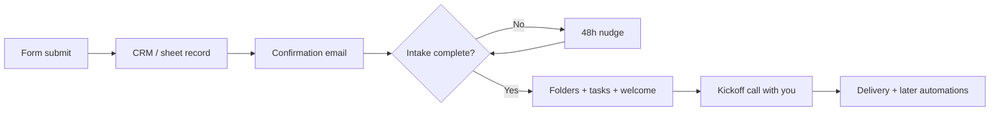

# The First AI Automation Every Small Business Should Build

The first AI automation a small business should build is almost never "a chatbot" or "a full AI employee." It is **intake and onboarding**: a form submits, a CRM or sheet gets the record, the client gets a confirmation, and a follow-up sequence starts — without you copying fields by hand.

I'm William Spurlock, an AI Solutions Architect and Fractional AI CTO. I have built **500+ automations**, spent **20,000+ hours** architecting agentic systems, and tracked **35,000+ hours saved for clients**. The pattern that pays first, across solo consultants and small service shops, is the same: stop rebuilding the kickoff packet every time someone says yes.

You build this in a tool like **n8n**. Drag nodes onto a canvas. Click to connect them. Map fields with variables. Hit run. Fix what broke. Run again. You can even talk to n8n's AI helper to sketch or repair the flow when you get stuck. This is not software architecture class. It is a short chain that fires the same way every time a lead becomes a client.

If you want the wider "which five workflows pay first" map, start with the parent pillar: [AI automation for solopreneurs — the five workflows that save the most time](/blog/ai-automation-for-solopreneurs-the-5-workflows-that-save-the-most-time). This post is the spoke that answers one question hard: **what do you build first, and how do you make onboarding actually automatic?**

---

## Can I Automate My Entire Onboarding Process With AI?

**Yes for the repeatable shell — intake form, CRM record, folders, welcome email, task list, and timed follow-ups. No for judgment: pricing exceptions, scope fights, and the first real strategy call still need you.** Aim for "entire admin path," not "AI runs the relationship."

### What "entire onboarding" actually means

When business owners ask this, they usually mean one of three things:

| What they mean | Can AI automation handle it? | Reality check |
|---|---|---|
| Stop retyping form answers into the CRM | Yes | This is the highest-ROI first win |
| Send the same welcome packet every time | Yes | Templates + variables beat rewriting |
| Let AI decide project scope and price | No | Keep humans on money and taste |
| Create Drive folders, tasks, Slack channel | Yes | Classic n8n multi-tool hop |
| Personalize a kickoff brief from intake answers | Partially | Model drafts; you approve edge cases |

The plain-English framing: [what AI automation is for business owners](/blog/what-is-ai-automation-a-plain-english-guide-for-business-owners) is wiring a model and rules into a process you already run. Onboarding is a perfect candidate because the steps barely change from client to client.

### The first workflow shape (form → CRM → confirm → follow-up)

Build this before anything clever:

1. **Trigger** — Typeform, Tally, Webflow form, or an n8n Form node fires on submit
2. **Normalize** — map name, email, company, package, start date into clean fields
3. **Write the record** — create or update Airtable / HubSpot / Google Sheets
4. **Confirm** — send a branded "we got it" email with next steps and booking link
5. **Follow up** — if intake is incomplete after 48 hours, send one nudge (draft or auto)
6. **Notify you** — Slack or email ping so you know a new client entered the pipe

That is the whole "first automation." Drag five to seven nodes. Click credentials. Map `{{ $json.email }}` style variables. Test with your own submission. Done.

### A real pattern I have shipped: Client Onboarding Workflow

One workflow in my library is named exactly **Client Onboarding Workflow**. On form submit it:

- Pulls client details from the submission / proposal fields
- Creates a Google Drive folder structure
- Spins up a ClickUp project with AI-generated starter tasks
- Opens a Slack channel for the engagement
- Sends the welcome email

Same idea shows up in lighter lead pipes like **TypeForm → Airtable & Slack Lead Capture** and **Lead Capture with Enrichment and CRM Update** (Typeform → enrichment → Airtable → Slack). Intake and onboarding are cousins: one catches the lead, the other stands up the paid project. Start with whichever currently burns the most hours this week.

### Where AI belongs inside the onboarding chain

Not every step needs a model. Rules move data. Models read and write language.

| Step | Tool type | Example |
|---|---|---|
| Form → CRM field mapping | Rules / variables | Email to Contact Email |
| Welcome email body | Template | Static HTML with merge fields |
| Intake summary → one-page brief | AI model | Claude Sonnet 5 drafts a kickoff brief |
| "Is this intake complete?" check | Rules + light AI | Missing fields → nudge sequence |
| Task list from package type | AI or template | Template wins until packages vary a lot |

A kickoff-brief prompt that stays honest:

```text
Summarize this client intake into a one-page kickoff brief.
Client: {{client_name}}
Package: {{package}}
Intake answers:
{{intake_json}}

Rules:
- Only use facts in the intake. Do not invent metrics, budgets, or deadlines.
- Flag missing fields under "Open questions."
- Output: Goals, Constraints, Deliverables, Timeline, Open questions.
```

Use **Claude Sonnet 5** or **Gemini 3.5 Flash** for the draft. Keep **Claude Opus 4.8** for messier intakes where the answers are long and contradictory. Use **GPT-5.4 mini** when you want a cheap classify-or-tag step ("complete" vs "needs nudge").

### What you should not automate on day one

- Auto-sending legal language you have not reviewed
- Auto-promising delivery dates the calendar cannot support
- Letting a model invent case studies or "typical results"
- Full payment collection without your Stripe / accounting system of record

Automate the path. Keep the handshake human.

### Build order if you are starting from zero

| Week | Ship this | Why |
|---|---|---|
| 1 | Form → CRM + Slack ping | Stops lost submissions |
| 1–2 | Confirmation email | Client feels caught, not ignored |
| 2 | Incomplete-intake nudge | Closes the loop without chasing |
| 3 | Drive / project / channel create | Removes kickoff busywork |
| 4 | AI intake summary (approve first) | Cuts prep time before the call |

If kickoff is already clean but leads go cold, flip week 1 to lead follow-up instead. The parent pillar covers that choice in depth.

---

## How Do Small Businesses Compete With Larger Companies Using AI Automation?

**Small businesses compete by matching response speed and process consistency — not by matching headcount.** A five-person shop with a tight onboarding and follow-up stack can answer, enroll, and start work faster than a bigger firm waiting on three handoffs.

### Speed beats org charts

Large companies buy process with people: SDR → AE → CS → ops. You buy process with workflows. When a form lands at 9:14 p.m., their ticket might sit until morning. Your n8n flow already:

- Wrote the CRM row
- Sent confirmation
- Booked the next step or queued the intake
- Pinged your phone

That is not "competing with enterprise AI." That is removing the lag that loses deals.

### Where small operators win with automation

| Advantage | How automation creates it | What big firms still win on |
|---|---|---|
| Faster first response | Instant confirm + follow-up | Brand budget |
| Cleaner handoffs | One record, one source of truth | Specialized departments |
| Lower cost per client | No ops hire for copy-paste work | Deep tooling budgets |
| Personal delivery | You still do the strategy call | Volume at scale |
| Faster iteration | Change one node, redeploy | Change control committees |

The [difference between AI automation and regular automation](/blog/the-difference-between-ai-automation-and-regular-automation-and-why-it-matters) matters here: regular automation moves fields. AI automation can draft the brief, classify the lead, and write the nudge in the client's language. You get "junior ops + junior writer" behavior without a hire.

### A competition playbook that stays practical

1. **Own the first five minutes after submit** — confirmation + CRM write is non-negotiable
2. **Own the first 48 hours** — intake complete or nudged
3. **Own kickoff day** — folders, tasks, welcome packet already exist before the call
4. **Measure lag** — minutes to first reply, hours to intake complete, days to kickoff
5. **Only then** expand into content, invoicing chase, and inbox triage

### What not to chase while you are still small

- A custom agent platform before your form→CRM path works
- Six tools that each do one slice of onboarding
- "AI receptionist" theater that cannot write a correct CRM record
- Automating marketing before revenue ops is boring and reliable

Boring wins. The shop that confirms in 30 seconds and kicks off clean beats the shop with a flashy demo and a messy Google Drive.

### Receipt from the build pattern, not a fake case study

I will not invent a client name or a fake ROI percentage. What I can say from the book of work: intake and CRM write paths like **MCD | Webform → CRM** and onboarding packs like **Client Onboarding Workflow** show up again and again because they delete the same unpaid hour — the "let me set everything up for you" hour after the contract is signed. Across **500+ automations**, that shape is one of the first I reach for when a small business is drowning in kickoff admin.

---

## What's the Best AI Stack for a Solo Consultant in 2026?

**The best solo-consultant stack in 2026 is boring and short: one automation tool (n8n), one CRM/database (Airtable or HubSpot), one form, one email/calendar pair, and one workhorse model (Claude Sonnet 5) with a cheap model for classification.** Add Make.com or Zapier only if you already live there. Do not collect seven AI subscriptions "just in case."

### The stack that covers 80% of the work

| Layer | Pick | Job |
|---|---|---|
| Automation | **n8n** (self-host or cloud) | Drag-and-click workflows, webhooks, AI nodes |
| Lighter alternative | Make.com or Zapier | Faster start if you hate hosting |
| CRM / ops DB | Airtable or HubSpot | Single client record |
| Forms | Typeform, Tally, or n8n Form | Intake + lead capture |
| Email + calendar | Gmail/Outlook + Cal.com/Calendly | Confirmations and booking |
| Docs / files | Google Drive or Notion | Folders and kickoff docs |
| Workhorse model | Claude Sonnet 5 | Briefs, emails, summaries |
| Flagship model | Claude Opus 4.8 | Hard intakes, long messy context |
| Cheap model | GPT-5.4 mini or Gemini 3.5 Flash | Tags, complete/incomplete checks |
| Payments | Stripe | Invoices and webhooks later |

For tool choice between the big three automation platforms, use [n8n vs Make vs Zapier in 2026](/blog/n8n-vs-make-vs-zapier-in-2026-which-automation-tool-is-right-for-your-business). My bias for client builds is n8n: full control, clear variables, and you can talk to the product's AI assist while you assemble nodes.

### How a solo consultant actually clicks this together

No architecture diagram required. The build session looks like this:

1. Open n8n → new workflow
2. Drop a **Form Trigger** or Typeform trigger
3. Drop an **Airtable** (or Sheets) create/update node
4. Drop a **Gmail/Outlook** send node for confirmation
5. Drop a **Wait** or schedule path for the 48-hour nudge
6. Drop an **AI** node only where language is needed (brief or nudge copy)
7. Click **Execute workflow**, submit a test form, fix the red nodes
8. Ask n8n's AI helper: "Why is this Airtable node failing?" when a field map is wrong
9. Activate when three clean test runs pass

That is the whole craft. Drag. Click. Map variables. Run until green.

### Monthly cost ranges (estimates, not quotes)

| Stack size | Typical monthly range | What you get |
|---|---|---|
| Starter | $20–$80 | Form + Sheets/Airtable + email + light AI |
| Working solo | $80–$250 | n8n cloud or VPS, CRM, model usage, booking |
| Heavy volume | $250–$600+ | Higher model spend, more executions, Slack ops |

Model spend stays low if you reserve Opus for hard briefs and use Sonnet 5 / GPT-5.4 mini / Gemini 3.5 Flash for the daily path.

### Stack mistakes that burn solo consultants

| Mistake | What happens | Fix |
|---|---|---|
| Five AI apps, zero CRM home | Answers scatter; nothing compounds | One record system first |
| Auto-send on day one | Wrong package details hit a client | Draft-only for a week |
| Building agents before intake | Cool demo, still copy-pasting | Ship form→CRM first |
| No error alert | Silent breakage for days | Slack/SMS on workflow fail |
| Prompt without fact guardrails | Model invents client goals | "Only use intake fields" rule |

### Minimal vs nice-to-have

**Must have for the first automation**

- Form
- CRM or sheet
- Confirmation email
- Your eyes on exceptions

**Nice later**

- Enrichment (Dropcontact-style)
- AI task generation in ClickUp/Asana
- Slack channel creation
- Contract e-sign → onboarding trigger
- Payment webhook → kickoff start

Ship the must-have. Earn the right to get fancy.

---

## How the First Automation Fits the Rest of the Business

**Intake/onboarding is the hinge between "sold" and "delivered."** Once it runs, every later automation has a clean client record to hang on.



### Why this beats starting with content or chatbots

| First build choice | Week-1 pain relieved | Revenue effect |
|---|---|---|
| Onboarding / intake | Kickoff chaos | Protects margin on every new client |
| Lead follow-up | Slow replies | Protects close rate |
| Content repurposing | Marketing backlog | Helps later; weaker if ops is messy |
| Public chatbot | Inbox novelty | Rarely fixes unpaid admin |

If you lose deals to slow replies, lead follow-up can go first. If every "yes" creates a scramble, onboarding goes first. Most small service businesses feel the scramble harder than they admit.

### A 90-minute build checklist

Use this the next time you block a morning:

1. Write the manual steps you already do after a signed client (10 min)
2. Circle every step that is copy-paste or "same email every time" (5 min)
3. Create the form fields you actually need — not twenty vanity questions (15 min)
4. Build form → CRM → confirm in n8n (30 min)
5. Test three fake clients, including a messy incomplete one (20 min)
6. Turn on a single failure alert (10 min)

If step 4 takes longer, you are overbuilding. Delete nodes until the happy path is five clicks to understand.

### Fields worth collecting on day one

Keep the intake short enough that clients finish it. Long forms create the "incomplete" problem your nudge then has to fix.

| Field | Why it matters | Required? |
|---|---|---|
| Full name + email | CRM identity | Yes |
| Company / brand | Folder naming, Slack channel | Yes for B2B |
| Package or offer selected | Routes tasks and welcome copy | Yes |
| Preferred start window | Scheduling, not a hard promise | Nice |
| Goals in their words | Feeds the AI brief | Yes |
| Assets / logins needed | Prevents week-one stall | Nice |
| Billing contact | Invoice path later | Yes if not the same person |

If a question does not change kickoff, cut it. You can always ask on the call.

---

## FAQ: First Automations, Onboarding, and Solo Ops

### How do I use AI to automate my bookkeeping and financial reporting?

**Start with capture and categorization, not "AI CFO."** Forward receipts to a mailbox or form, extract vendor/amount/date into Airtable or your accounting tool, and let a model suggest categories you approve. Keep balances in Stripe, QuickBooks, or Xero as source of truth. Weekly, auto-build a digest: open invoices, paid this week, expenses logged — a model can write the narrative summary from those numbers, not invent them.

### Can I automate project management and client updates with AI?

**Yes for status collection and draft updates; no for promising dates the team has not confirmed.** Pattern: task tool (ClickUp, Asana, Notion) → weekly n8n pull of open tasks → model drafts a client update email → you send. Onboarding can create the project and starter tasks automatically (as in **Client Onboarding Workflow**). Client-facing auto-send waits until the draft quality is boringly reliable.

### How much time per week can AI automation realistically save a solopreneur?

**For the core five workflows — lead follow-up, onboarding, invoicing, content, inbox triage — client builds commonly land in the 8–20 hours/week range depending on volume.** Onboarding alone often returns about **1.5–4 hours/week** once kickoff stops being handmade. That is a range from shipped work, not a guarantee. If you only have two new clients a month, absolute hours are lower — but the quality jump (fewer missed fields, faster start) still matters.

### What AI tools help freelancers automate proposals and contracts?

**Use your proposal tool as source of truth, then automate the handoff.** Typical path: PandaDoc / DocuSign / HelloSign completes → webhook → CRM stage update → onboarding workflow starts. For drafting proposals, Claude Sonnet 5 can turn a call transcript + package menu into a first draft; you edit price and scope. Do not let a model invent legal clauses. Templates plus variables beat freeform AI contracts.

### What should I automate first if I am a one-person service business?

**Automate the path that loses money or margin this month.** Slow lead reply → follow-up first. Chaotic kickoff → onboarding first. Late invoices → billing chase first. If you are unsure, ship form → CRM → confirmation in one afternoon. It is the smallest complete win and teaches you the n8n click-path for everything else.

### Do I need to know how to code to build this in n8n?

**No.** You need patience for field mapping. n8n is drag nodes, click credentials, set variables, run tests. When a node errors, read the message, fix the field, run again. n8n's AI assist can explain failures and suggest node setups in plain language. Coding is optional later for edge cases — not required for the first onboarding flow.

### How is AI automation different from plain Zapier-style automation for onboarding?

**Plain automation moves data. AI automation reads and writes language inside the same flow.** Form → CRM → email can be pure rules. Intake answers → kickoff brief, or "incomplete field" → polite nudge copy, is where Claude Sonnet 5 or Gemini 3.5 Flash earns its seat. Both layers belong in one workflow. For the fuller distinction, see [AI automation vs regular automation](/blog/the-difference-between-ai-automation-and-regular-automation-and-why-it-matters).

### What does a simple onboarding workflow cost to run each month?

**Often under $100/month at low volume if you already pay for email and a form tool.** Add n8n cloud or a small VPS, Airtable/CRM, and modest model usage for briefs. Costs climb with high submission volume or Opus-heavy summarization. Track cost per new client, not vanity tool count — if onboarding automation costs $40/month and saves even three hours, it is already cheap.

### How do I keep the automation from sending the wrong thing to a client?

**Draft-only mode, test clients, and hard prompt rules.** For the first week, write drafts to yourself or a review folder. Include "only use fields from the intake; never invent deadlines or results" in every AI node. Put a human approval step on anything that touches money, legal, or unhappy clients. Activate auto-send only after three clean weeks.

### Can I start in Make.com or Zapier instead of n8n?

**Yes.** If you already live in Zapier or Make.com, build form → CRM → email there first. Switch or add n8n when you need branching, self-hosting, or denser AI-node control. The business outcome matters more than the logo on the canvas. Compare tradeoffs in [n8n vs Make vs Zapier in 2026](/blog/n8n-vs-make-vs-zapier-in-2026-which-automation-tool-is-right-for-your-business).

---

## Build the First One This Week

You do not need a transformation program. You need one green workflow:

1. Form submits
2. Record lands in the CRM
3. Client gets confirmation
4. You get a ping
5. Incomplete intakes get one nudge
6. Kickoff assets create themselves when the intake is complete

That is the first AI automation every small business should build. Drag it. Click it. Run it until it works. Then layer AI summaries on top once the pipes are trustworthy.

For the full set of high-payoff solo workflows around this spoke, keep [the solopreneur five-workflow pillar](/blog/ai-automation-for-solopreneurs-the-5-workflows-that-save-the-most-time) open while you plan week two.

---

## Book an AI Automation Strategy Call

If you want this onboarding path mapped to your real form, CRM, and package menu — not a generic tool tour — [book an AI automation strategy call](/contact). We will pick the first build, keep the stack small, and get a workflow running you can actually maintain as a solo operator or small team.
