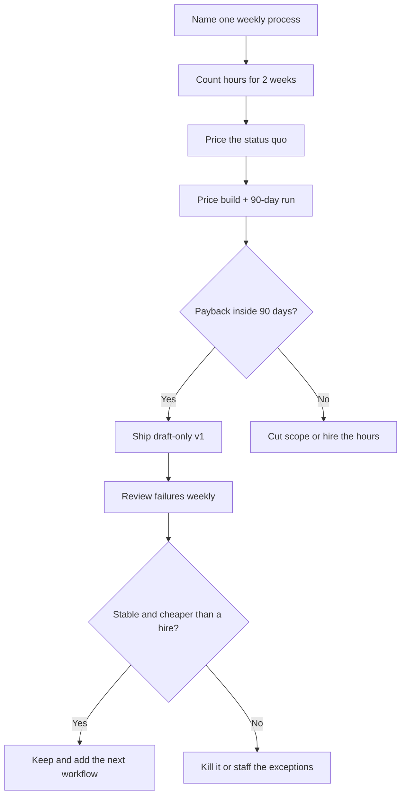

# What Does AI Automation Actually Cost? A Realistic Breakdown for 2026

**A fully loaded US ops or admin hire is usually a five-figure annual commitment. A production AI automation stack in 2026 is usually a few hundred dollars a month plus a one-time build.** That is the comparison founders actually need — not a vendor landing-page sticker, and not a made-up "10x ROI" slide.

I am William Spurlock, an AI Solutions Architect and Fractional AI CTO. I have built **500+ automations**, spent **20,000+ hours** architecting agentic systems, hold the Make.com AI Automation certifications, and have worked directly with the n8n team. Across client work I have tracked **35,000+ hours saved** — that is client busywork removed, not the same number as my personal hours. I will not invent a client name or a guaranteed payback to make this post feel sexier.

This spoke owns **hiring vs automating cost** and the **business-case / payback** story. If you still need the plain-English definition of the category, start with [what AI automation is](/blog/what-is-ai-automation-a-plain-english-guide-for-business-owners). If you need the first workflow to ship, use [the first AI automation every small business should build](/blog/the-first-ai-automation-every-small-business-should-build). The five workflows that usually return the most hours are in [AI automation for solopreneurs](/blog/ai-automation-for-solopreneurs-the-5-workflows-that-save-the-most-time).

Vendor prices move. Every dollar figure below is either a **published list price I checked in August 2026**, a **dated government series**, or a **hedged planning range**. Confirm live pages before you put a number in a board deck.

---

## How do I build a business case for investing in AI automation?

**You build the business case as a one-page cost-of-status-quo vs cost-to-change argument: what the work costs today (hire hours or founder hours), what the stack and build will cost, how fast the spend comes back, and what breaks if the workflow fails.** You do not need a finance model with twelve tabs. You need numbers a skeptical owner can audit in fifteen minutes.

I treat the case as a hiring decision in reverse. You are not "buying AI." You are choosing whether the next increment of capacity is a person, a contractor, or a workflow that runs without a timesheet.

### The one-pager I actually want in a founder’s hands

| Block | What you write | What I reject |
|---|---|---|
| **Job to be done** | The weekly process in 8 steps or fewer | "We need to be more automated" |
| **Current cost** | Hours × loaded wage, or the contractor invoice | Vague "it takes a lot of time" |
| **Failure cost** | Missed leads, late invoices, refunds, owner nights | Adjective-only risk language |
| **Proposed build** | Platform + model + CRM + who maintains it | A tool logo collage |
| **Investment** | Build (hours or invoice) + 12 months of run cost | Year-one software only |
| **Return window** | Months until build + run < avoided cost | A hockey-stick slide |
| **Guardrails** | Draft-only, money gates, named owner | "The agent will handle it" |
| **Kill criteria** | What makes you stop or hire instead | No exit |

That table is the case. If a row is empty, you are not ready to spend.

### Status-quo cost: three honest ways to count it

Pick one primary number. Mixing all three without labeling them is how decks get laughed out of a meeting.

1. **Founder opportunity cost** — hours you spend on the process × the rate you can actually sell. A $150/hour consultant doing 8 hours/week of inbox and invoice chase is staring at about **$4,800/month** of capacity, not a $29 Zapier invoice.
2. **Avoided hire** — the fully loaded cost of the VA / coordinator / ops seat you would post next. That is the primary comparison later in this post.
3. **Leakage** — cash you already lose when the process is late: uncollected invoices, leads that go cold, refunds from sloppy onboarding. Use last quarter’s real numbers, not a hope.

If you cannot fill at least (1) or (2) from a two-week calendar audit, do not ask a stakeholder for a build budget yet. Audit first. The [solopreneur workflow set](/blog/ai-automation-for-solopreneurs-the-5-workflows-that-save-the-most-time) is the shortlist I use when the calendar is a mess and you need to name the bleed.

### What belongs in "investment" (and what people leave off)

| Line | Include? | Why |
|---|---|---|
| Platform subscription (n8n / Make / Zapier) | Yes | Recurring, visible |
| Model API (Claude Sonnet 5, Gemini 3.5 Flash, GPT-5.4 mini, etc.) | Yes | Climbs with volume |
| Airtable / CRM / email seats you add for the workflow | Yes | Easy to "forget" |
| One-time build (your hours or a contractor invoice) | Yes | This is usually the real check |
| Monthly maintenance hours | Yes | Auth drift is not free |
| Training the team to trust drafts | Yes | Adoption is a cost |
| A second tool "just in case" | No | That is scope creep |
| A flagship model on every email | No | That is vanity spend |

**n8n** is an open-source workflow automation platform with a paid cloud and a free self-hosted Community Edition. **Make.com** is a visual, credit-billed automation platform. **Zapier** is a task-billed connector with the widest app list. I hold Make.com certifications and I default to n8n for AI-native production work — that is a fit opinion, not a claim that Make or Zapier are "wrong."

### A 90-day pilot, not a transformation program



The decision rule I use with owners: **if the 90-day stack + build is not cheaper than 90 days of the hire or the founder hours it replaces, you do not have a case yet.** Shrink the workflow. Do not inflate the savings.

### Prompt I give founders before they write the deck

Use this with Claude Sonnet 5 or GPT-5.5 on a transcript of how the work actually happens. It is a briefing prompt, not a magic ROI engine.

```text
You are helping me write a one-page business case for an AI automation.
Do not invent savings. Use only numbers I provide. If a number is missing, ask.

Process name:
Steps today (numbered):
Hours per week (measured, not guessed):
Who does it now (founder / W-2 / contractor) and their loaded hourly rate:
What breaks when it is late (money or hours, last 90 days):
Tools already paid for:
Proposed platform (n8n / Make / Zapier):
Build quote or DIY hours:
Monthly run budget I will actually pay:

Return:
1) Status-quo monthly cost
2) Proposed monthly run + amortized build over 12 months
3) Months to recover the build if hours actually come back
4) Three risks and a kill criterion
5) A 8-line exec summary a skeptical investor can audit
```

If the model starts writing "industry studies show," delete that paragraph. Your calendar is the dataset.

### Who has to sign, and what they need to see

| Audience | They care about | Put this on page one |
|---|---|---|
| Solo operator | Cash and calendar | Hours back this month vs subscription |
| Ops manager | Ticket pile and error rate | Failure rate + who gets paged |
| Finance / bookkeeper | Predictable spend | 12-month run + build, no mystery overages |
| Investor / board | Capacity without headcount | Avoided seat vs stack, with a kill date |

Do not lead with model names. Lead with the seat you are not posting. The model is a line item.

If the process is still "a person reads email and decides," you may need [the difference between AI automation and regular automation](/blog/the-difference-between-ai-automation-and-regular-automation-and-why-it-matters) before you price a Claude Opus 4.8 step you do not need. Rules are cheaper than models.

---

## How quickly can AI automation pay for itself?

**Most small-business automations I ship pay back in weeks to a few months when they replace a real weekly time sink — and they never pay back when they replace a process you have not measured.** Payback is build cost plus run cost, recovered from avoided hire cost or recovered founder hours. It is not a vibe.

I will not give you a fake "average ROI." What I will give you is planning math I use on real scopes, with ranges instead of theater.

### The payback definition I use (and the one I do not)

**Payback months ≈ (one-time build) ÷ (monthly avoided cost − monthly run cost).**

That is a recovery clock, not a valuation model. It tells you when the checking account is even. It does not tell you the "value of AI" or a net-present-value story. If someone wants a full pre-build ROI methodology, that is a different post. This one stays on **cost and time-to-even**.

| Input | How I source it | Common lie |
|---|---|---|
| Build | Contractor invoice, or DIY hours × your real rate | "Evenings are free" |
| Monthly run | Platform + models + extra seats + maintenance hours | Software sticker only |
| Avoided cost | Loaded hire, contractor invoice, or sold hours | "We'll be more productive" with no hours |
| Start date | The week the workflow is live in production | The day you bought the tool |

If monthly run is higher than monthly avoided cost, payback is infinite. That happens when people automate a rare process with Zapier task overages and a flagship model.

### Planning scenarios (ranges, not promises)

These are **illustrative bands** from scopes I see in US small businesses. Your volume moves the clock.

| Situation | Typical build | Typical monthly run | Avoided monthly cost | Planning payback |
|---|---|---|---|---|
| Solo, one workflow (intake or invoice chase) | $0–$2,500 DIY / small contractor | $40–$150 | $800–$3,000 in hours or a slice of a VA | **2–8 weeks** if you finish the build |
| Solo, five core workflows | $2,000–$8,000 | $100–$300 | $2,000–$6,000 vs a part-time VA | **1–4 months** |
| 5–20 person shop, ops coordinator seat | $5,000–$15,000 | $200–$600 | $4,000–$8,000 loaded part-time / contractor | **2–5 months** |
| High-volume Zapier replacement | Migration hours + overlap month | Often **down** vs old task bill | Old Zapier overages + staff time | **1–3 months** on the software line alone, if volume is real |

I have seen a single invoicing chase workflow cover its stack in the first recovered invoice. I have also seen a "smart inbox agent" burn six weeks and never go live. The clock starts when production traffic hits the workflow, not when the canvas looks pretty.

### What speeds payback up

- **You already pay for the CRM, email, and payments.** Adding n8n or Make on top of Stripe + HubSpot is cheaper than buying a new system of record.
- **The process already has rules.** If you can write the happy path on one page, a workhorse model (Claude Sonnet 5, Gemini 3.5 Flash, GPT-5.4 mini) is enough.
- **Draft-only for week one.** You catch bad sends before they create refunds — refunds destroy payback.
- **You pick a platform whose bill matches the shape of the work.** n8n bills per workflow execution on cloud; Make bills credits per module; Zapier bills tasks per successful step. The wrong meter is how "cheap" tools get expensive. That comparison lives in [n8n vs Make vs Zapier in 2026](/blog/n8n-vs-make-vs-zapier-in-2026-which-automation-tool-is-right-for-your-business) and [whether Zapier is still worth it](/blog/is-zapier-still-worth-using-in-2026-honest-comparison-with-n8n-and-make).

### What slows payback down (or kills it)

| Drag | How it shows up | Fix |
|---|---|---|
| Unfinished DIY | Tool subscriptions with no live workflow | Time-box v1 to one week or hire the build |
| Flagship models on labels | Claude Opus 4.8 or GPT-5.5 classifying "urgent / not" | Drop to Gemini 3.5 Flash or GPT-5.4 mini |
| Chatty Zaps | 8-step Zap × hundreds of rows/day | Batch, or move the heavy job to n8n |
| Unstable process | You change the SOP every Friday | Run it manually for two more weeks |
| No owner | "The intern will watch it" | Named human, weekly failure review |
| Scope parade | Five tools, three CRMs, one "agent platform" | One canvas, one source of truth |

**My opinion:** payback failure is almost never "AI is too expensive." It is "we never shipped," or "we shipped a process we do not understand."

### A napkin example you can copy (not a case study)

Assume a US consultant who can sell time at **$150/hour**. They spend **6 hours/week** on lead follow-up and invoice reminders — measured, not guessed.

- Monthly hours: ~24
- Status-quo cost: **~$3,600/month** in capacity
- Stack: n8n Cloud or Make in the **$20–$60** band, models **$25–$80**, Airtable/CRM they already have
- Run total: **~$80–$180/month**
- DIY build: **12 hours** × $150 = **$1,800** opportunity, or a contractor at a similar invoice

If the workflow returns even **half** those hours (12 hours/month is the conservative bar, not the sales-page bar):

- Monthly net: ~$1,800 − $150 run ≈ **$1,650**
- Payback on a $1,800 build: **about one month**

If it returns zero hours because they never finish the mapping, payback is never. That is why I care more about "will this be live on Friday" than about a prettier model.

### When I tell people not to expect a fast payback

- You are automating a process that happens **monthly**, not weekly
- The "savings" are brand feelings, not hours or cash
- You need a human in the loop on every send and you will not reduce review time
- You are buying an agent demo to impress a board

Those projects can still be worth doing as insurance or as a quality floor. They are not payback projects. Price them as insurance.

Hidden costs (auth failures, prompt rewrites, a week of silent errors) stretch the clock. I preview them in the hire-vs-automate table and unpack them in the FAQ. Do not ignore them — and do not let them become an excuse to hire a full-time coordinator for copy-paste work.

---

## What is the average cost of hiring someone vs. automating with AI?

**There is no single "average," but for a US small business the honest band looks like this: a W-2 ops/admin seat is typically tens of thousands per year once you load benefits, while a contractor VA is typically four figures a month, and a production AI automation stack is typically hundreds a month plus a one-time build.** The hire wins when the work is judgment, relationships, or physical presence. The stack wins when the work is repetitive reading, routing, drafting, and chasing.

That is the primary question of this post. I am going to be annoying about sources.

### What "fully loaded" means (US, dated)

Wage is not what you pay.

The U.S. Bureau of Labor Statistics **May 2025** Occupational Employment and Wage Statistics series puts **secretaries and administrative assistants, except legal, medical, and executive** at a **mean hourly wage of $23.73** (about **$49,350** a year) and a **median hourly wage of $22.86**. That is [BLS OEWS national Table 1, May 2025](https://www.bls.gov/news.release/ocwage.t01.htm) — a government wage series, not a job-board anecdote.

Benefits sit on top of wage. BLS **Employer Costs for Employee Compensation (March 2026)** reports private-industry employers paying about **$32.60/hour in wages** and **$14.01/hour in benefits**, or **30.1% of total compensation** in benefits ([ECEC summary, March 2026](https://www.bls.gov/news.release/ecec.nr0.htm)). Wages are 69.9% of the total, which is a **~1.43×** multiplier from wage to fully loaded compensation at the private-industry average.

For **office and administrative support** specifically, the civilian ECEC table shows benefits as a **larger slice** of the package (about one-third of total compensation in the March 2026 occupational breakout). Small firms often run leaner benefits than that average. I still budget **1.25×–1.45× wage** for a W-2 ops hire in a US small business, then add tools, recruiting, and management time.

| Hire type (US small-business framing) | Pay you see | Planning fully loaded / monthly | What you actually bought |
|---|---|---|---|
| W-2 admin / coordinator (full-time) | ~$45k–$55k wage near the BLS admin median/mean | **~$55k–$80k/year** (~$4,600–$6,700/mo) after a 1.25–1.45× load + seats | A person, 40 hours, PTO, management |
| W-2 ops, part-time 20 hrs | ~half the wage if you pro-rate | **~$2,000–$3,800/mo** if benefits are thin; more if you offer a real package | A person who still needs SOPs |
| US-based VA / ops contractor | Market ranges I see in 2026 often **$25–$45/hour** | **~$2,200–$3,900/mo** at 20 hrs/week | Hours you can cut; quality varies |
| Offshore VA / ops contractor | Market ranges often **$8–$20/hour** as of 2026 | **~$700–$1,700/mo** at 20 hrs/week | Hours + timezone + process risk |
| Founder doing the work | $0 on payroll | Your billable rate × hours | The most expensive "cheap" option |

Contractor and offshore bands are **2026 market ranges, not a BLS series.** Job posts and agency retainers move by city, English requirement, and whether you want someone in your Slack at 9am Eastern. Do not treat them as official averages.

**My opinion:** if you are about to post a $20/hour W-2 for "inbox, CRM, invoices, and follow-up," you are shopping for a workflow with a human costume. Price the costume.

### The 2026 cost stack (tools + build + run)

Published automation prices below are **as of August 2026**. I am citing vendor pages, not converting a tweet into a list price.

**n8n Cloud** publishes in euros on [n8n.io/pricing](https://n8n.io/pricing): **Starter 20€/month billed annually** (2,500 executions, unlimited steps per execution) and **Pro 50€/month billed annually** (10,000 executions). Monthly billing is higher. **Community Edition** is free to self-host under n8n's fair-code / Sustainable Use License for your own internal use. **Business** publishes at **667€/month billed annually** (40,000 executions, self-hosted, SSO/SAML). Enterprise is sales-quoted. USD equivalents move with FX — I will not invent a dollar list price n8n did not print.

**Make.com** bills **credits** (a module action is typically one credit). On [Make pricing](https://www.make.com/en/pricing) in August 2026, the paid **Core / Pro / Teams** cards for a **10,000-credit** starting bucket sat in the **low-teens to high-thirties of dollars per month** on the monthly view I checked; annual billing is discounted. Free is **1,000 credits/month**. Confirm the live toggle (monthly vs annual) before you budget.

**Zapier** bills **tasks** (successful steps). The official pricing reference on [zapier.com/pricing](https://zapier.com/pricing) (checked August 2026) lists **Professional at $19.99/month billed annually** (or **$29.99** month-to-month) for **750 tasks**, then **$49 / $73.50** at 2,000 tasks, **$129 / $193.50** at 10,000 tasks, and **$489 / $733.50** at 100,000 tasks on Pro annual vs monthly. Team starts higher. That is why high-volume, many-step Zaps become the "Zapier tax."

**Airtable** publishes **Team at $20/user/month billed annually** ($24 month-to-month) and **Business at $45/user/month billed annually** ($54 month-to-month) on [Airtable pricing](https://airtable.com/pricing) / [plans overview](https://support.airtable.com/docs/airtable-plans). Free exists with collaborator caps.

**Model APIs** (Claude Sonnet 5, Claude Opus 4.8, Gemini 3.5 Flash, Gemini 3.1 Pro, GPT-5.4 mini, GPT-5.5, Llama 4 via a host) are usage-priced and change. I budget **$10–$80/month** for workhorse classification and drafts on small-business volume, and **$80–$250+** if you put a flagship model on every record or you generate a lot of long content. I do not paste a token price here that will be stale next month — check the vendor’s current API page.

| Stack line | Low (careful solo) | Typical small-business run | Higher volume / hosted convenience | Notes (August 2026) |
|---|---|---|---|---|
| **n8n Cloud** | Starter **20€/mo** annual | Pro **50€/mo** annual | Business **667€/mo** annual if you need the published governance pack | Per **execution**, not per step — [n8n pricing](https://n8n.io/pricing) |
| **n8n self-host** | **$0 license** + VPS often **~$5–$20/mo** | Same license + a bigger box / backups | Your time, or a managed host | See [is n8n free / when to self-host](/blog/is-n8n-free-what-you-get-on-the-free-plan-and-when-to-self-host) |
| **Make.com** | Free 1k credits | Core/Pro roughly **$9–$21/mo** band for 10k credits | Teams ~**$29–$38/mo** band + more credits | Credits per module; confirm [Make pricing](https://www.make.com/en/pricing) |
| **Zapier** | Free 100 tasks, 2-step | Pro **~$20–$49/mo** at 750–2,000 tasks annual | **$129–$489/mo** at 10k–100k tasks annual | Tasks per step; [Zapier pricing](https://zapier.com/pricing) |
| **Model API** | $10–$25 workhorse | $25–$80 mixed | $80–$250+ flagship-heavy | Sonnet 5 / Flash / GPT-5.4 mini for volume |
| **Airtable / CRM** | $0–$20 | $20–$50 (Team seat or HubSpot starter) | $45–$100+ per extra editor | [Airtable](https://airtable.com/pricing) is per editor on paid plans |
| **Maintenance hours** | 1–2 hrs/mo | 2–6 hrs/mo | 8+ hrs/mo or a retainer | Auth, prompt drift, vendor UI changes |
| **One-time build** | 8–20 DIY hours | $2k–$8k contractor | $8k–$20k+ multi-workflow | Not a monthly line; amortize it |

Add the rows you will actually pay. A **typical solo production stack** I see lands around **$80–$250/month** to run, plus the build. A **Zapier-heavy, high-task** shop can put **four figures a month** on the platform line alone — that is when I push people toward n8n or Make.

### Side-by-side: the decision in dollars

| You need… | Hire path (planning) | Automate path (planning) | Who usually wins |
|---|---|---|---|
| 15–20 hrs/week of CRM updates, reminders, routing | US VA **~$2.2k–$3.9k/mo** or offshore **~$0.7k–$1.7k/mo** | Stack **~$80–$250/mo** + build | **Automation**, if the rules are stable |
| Full-time admin presence (phones, walk-ins, "can you just") | W-2 **~$55k–$80k** loaded | Stack cannot sit at the front desk | **Hire** |
| Fast follow-up on inbound leads | A person who is sometimes in a meeting | Workflow that drafts in seconds | **Automation** + you on exceptions |
| Client relationships and custom scopes | A closer / account lead | Drafts only | **Hire** (or you) |
| High-volume data movement | A tired coordinator + error rate | n8n execution or Make credits | **Automation** |
| Unstable, political, exception-heavy ops | A senior generalist | Brittle workflow | **Hire** until the process settles |

### Hidden costs (preview — full list in FAQ)

The stack table is incomplete if you only count subscriptions.

- **Build time you treat as free** — it is not. Twelve unfinished evenings is a real invoice to yourself.
- **Auth drift** — Google, Microsoft, and Slack tokens expire. Budget minutes every month.
- **Silent failures** — a workflow that "ran" and wrote garbage is more expensive than one that errors.
- **Model overspend** — Opus 4.8 / GPT-5.5 / Gemini 3.1 Pro on jobs Flash or Sonnet 5 can do.
- **Deliverability and brand** — automated email can hurt inbox placement if you spray.
- **Migration** — leaving Zapier after you have 80 Zaps is a project, not a toggle.

Price those as hours. If you ignore them, your payback math is fan fiction.

### How I actually instrument the comparison

I want a weekly digest: executions, failures, estimated model spend, and hours you did **not** spend. Here is the shape of an n8n workflow I use as a skeleton — not a full production export.

```json
{
  "name": "Weekly automation cost digest",
  "nodes": [
    {
      "id": "cron-monday",
      "type": "n8n-nodes-base.cron",
      "parameters": {
        "triggerTimes": { "item": [{ "hour": 8, "minute": 0 }] }
      }
    },
    {
      "id": "pull-execution-counts",
      "type": "n8n-nodes-base.n8n",
      "parameters": {
        "operation": "getAll",
        "resource": "execution"
      }
    },
    {
      "id": "draft-digest",
      "type": "@n8n/n8n-nodes-langchain.chainLlm",
      "parameters": {
        "model": "claude-sonnet-5",
        "text": "Summarize execution counts, failed runs, and estimated hours saved from the attached log. Do not invent a dollar ROI. Flag any failure rate over 3%."
      }
    },
    {
      "id": "email-owner",
      "type": "n8n-nodes-base.emailSend",
      "parameters": {
        "subject": "Weekly automation cost digest"
      }
    }
  ]
}
```

If you cannot get a digest, you cannot defend the spend. Stakeholders do not buy "we automated." They buy a Tuesday email that says "47 runs, 1 failure, 6 hours not spent chasing invoices."

### Regular automation vs AI automation in the cost picture

A filter-and-route Zap is cheap per decision and expensive per task. An AI step is the opposite: it can collapse messy text into a label, but it adds tokens. Use rules when the field is already structured. Use Claude Sonnet 5, Gemini 3.5 Flash, or GPT-5.4 mini when the input is language. Use Claude Opus 4.8, GPT-5.5, or Gemini 3.1 Pro when the mistake is expensive and rare. That split is the whole point of [AI automation vs regular automation](/blog/the-difference-between-ai-automation-and-regular-automation-and-why-it-matters).

Llama 4 belongs in the conversation if you are self-hosting inference to cap API spend. It does not belong in the conversation if you do not have anyone to operate the box.

---

## FAQ: Cost, Payback, and Hiring vs Automating

**Hidden costs, measurement, n8n cloud vs self-host, stakeholder justification, build vs buy, contractor math, failed-build cost, and when a hire still wins — answered short, with dated prices where they exist.**

### Are there hidden costs to AI automation I should know about?

**Yes — the subscriptions are the visible third of the bill.** The rest is build time, monthly maintenance (token refreshes, vendor UI changes, prompt drift), failed or silent-wrong runs, deliverability if you auto-email, and the cost of a half-built workflow that creates a second source of truth. I also count "owner attention": someone has to read the failure digest. If you skip that, you will pay in customer-facing mistakes, which is the most expensive line on this list.

### How do I measure productivity gains from AI workflow automation?

**Measure hours not spent and errors not made, on a two-week baseline vs a two-week live period — not "we feel faster."** Pick one process. Time it. Ship the workflow. Time it again. Add a failure count and a "human edited the draft" count. If review time does not fall by week four, you automated a mess. For solo operators, I still use the 8–20 hours/week band on the [five-workflow set](/blog/ai-automation-for-solopreneurs-the-5-workflows-that-save-the-most-time) as a planning range from shipped work, not a guarantee for your inbox.

### What's the cost of n8n cloud vs. self-hosted for a growing business?

**Cloud is a low, predictable euro subscription; self-host is a $0 license plus a VPS and your ops time.** As of August 2026, [n8n Cloud Starter is 20€/month billed annually](https://n8n.io/pricing) (2,500 executions) and **Pro is 50€/month billed annually** (10,000 executions). Self-hosted Community Edition has no per-execution license fee; you pay a small VPS (often single-digit to low-twenty dollars a month) and you own updates, backups, and uptime. Growing teams that need SSO, environments, and a published execution pack look at **Business (667€/month billed annually)** or Enterprise. I put founders on Cloud until execution volume or data-residency makes the VPS cheaper than their time — the full split is in [is n8n free, and when to self-host](/blog/is-n8n-free-what-you-get-on-the-free-plan-and-when-to-self-host).

### How do I justify AI automation costs to stakeholders or investors?

**Put the avoided seat and the 90-day kill date on page one.** Show BLS-loaded wage math or the actual VA invoice next to 90 days of stack + amortized build. Show the digest: runs, failures, hours. Promise a pilot, not a culture change. Investors have seen too many "AI transformation" slides; they have not seen enough "we did not hire the $3,000/month coordinator because the workflow cleared the queue." If they want tool theology, send them the [n8n vs Make vs Zapier](/blog/n8n-vs-make-vs-zapier-in-2026-which-automation-tool-is-right-for-your-business) comparison and keep your deck on cash.

### Should I build the automations myself or hire a contractor?

**DIY if you will finish a v1 in a week and you already live in the tools; hire a contractor if the calendar keeps eating the project.** Unfinished DIY is the most common way a "cheap" stack becomes expensive — you pay Zapier or n8n for two months and still chase invoices by hand. A contractor invoice of a few thousand dollars that is live on Friday beats a $0 build that ships in November. Buy a template only for generic plumbing (form → sheet). Buy custom when the SOP is yours. I build this work for a living; I still tell capable operators to DIY the first [onboarding workflow](/blog/the-first-ai-automation-every-small-business-should-build) so they can maintain it.

### Is a freelance automation contractor cheaper than doing it myself?

**Cheaper in calendar time, not always cheaper in cash.** Price your DIY hours at the rate you can sell. If you bill $150/hour and the build takes 20 unfocused hours, you "saved" your way into a $3,000 opportunity cost — often more than a tight contractor scope. A cheap contractor who does not document credentials or error paths is not cheaper; you will pay a second time to make it maintainable. Ask for: a recording of the happy path, a credential list, a failure alert, and draft-only mode for week one.

### What does a failed AI automation actually cost a small business?

**The failed build costs the invoice plus the months you delayed a hire or a simpler workflow — and a failed send can cost a client.** I split "failed" into three bills: (1) money spent on a workflow that never went live, (2) money spent on a workflow that went live and created cleanup (wrong invoices, spammy follow-up, duplicate CRM records), and (3) trust. (2) and (3) are why I ship draft-only and put a human gate on money. A dead project that taught you the SOP is tuition. A live project that emailed the wrong price is a refund.

### When does hiring a person still beat automating the work?

**Hire when the job is presence, taste, negotiation, or exceptions that will not stabilize.** Front-of-house, custom sales, upset customers, physical ops, and "this is different every time" work still want a human. Also hire when volume is high **and** the exceptions are the product — a coordinator who handles the weird cases while automation does the boring 80%. Automation wins the copy-paste. People win the relationship. If you are a one-person shop, that person is often still you — automate the rest so you can stay in the room where the money is.

---

## The cost question, answered in one pass

**Plan a few hundred dollars a month to run a serious small-business stack, a one-time build you can count in hours or a few thousand dollars, and compare that to a loaded US ops seat or a VA retainer — not to a vendor sticker.**

If you came here for a single number: **plan a few hundred dollars a month to run a serious small-business stack, a one-time build you can count in hours or a few thousand dollars, and compare that to a loaded US ops seat in the tens of thousands per year or a VA at four figures a month.** Check [n8n](https://n8n.io/pricing), [Make](https://www.make.com/en/pricing), and [Zapier](https://zapier.com/pricing) the week you buy — I dated this to August 2026 on purpose.

Start with one workflow that already has a pulse. Measure two weeks. Price the hire you were about to post. Then decide.

---

## Book an AI Automation Strategy Call

**If you want this math run on your actual hours, tools, and the next hire you are tempted to post, [book an AI automation strategy call](/contact).** I will price the status quo, pick a platform that will not surprise you at 10,000 runs, and tell you honestly if a person still wins.
