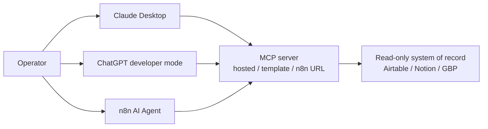

# Your First MCP Server Without a Developer: What It Takes and What It Does

An MCP server is not a product you buy, and it is not a TypeScript repo you commission on day one. **It is a connector that advertises a short list of tools — look up this Airtable base, search this Notion workspace, read this Google Business Profile — so Claude Desktop, ChatGPT, or n8n can call those tools instead of guessing from a pasted CSV.**

I'm William Spurlock. I architect agent stacks for operators who do not want to hire a developer to touch every tool. Across **500+ automations** and **20,000+ hours** on agentic systems — including direct collaborations with the n8n team — the first MCP win is almost never a custom server. It is a **read-only** connection to a system you already trust.

This spoke is the operator companion to the protocol pillar. If you want the "what MCP is and why agents standardize on it" map, read [Model Context Protocol (MCP) explained](/blog/model-context-protocol-mcp-explained-why-every-ai-agent-will-run-on-this). If you want the prompt-first custom server build, that is a different job and lives in [how I prompted a production MCP server](/blog/mcp-architecture-guide). Here I stay on one question: **what does a server do for the business, and how do you connect to one without writing a Node SDK?**

---

## What is an MCP server and how do I build or connect to one?

**An MCP server is a small process that exposes named tools, readable resources, and optional prompt recipes to an AI host. You connect first — Claude Desktop config, a hosted remote server, ChatGPT connectors, or n8n as a tool host — and "build" without a developer means installing a template or hosted server, not writing TypeScript.**

The protocol itself is [Model Context Protocol](https://modelcontextprotocol.io/introduction), introduced by Anthropic on [November 25, 2024](https://www.anthropic.com/news/model-context-protocol) and later moved under the [Linux Foundation's Agentic AI Foundation](https://www.linuxfoundation.org/press/announcements/2025/12/agentic-ai-foundation-launches-to-advance-open-standards-for-ai-interoperability). I am not re-teaching that stack here. The business object you actually buy, install, or point at is the **server**.

### What an MCP server does for a business

A server does one job: it turns a messy product API into a **short, named menu** the model can see.

Without that menu, your assistant lives on whatever you pasted into the chat. With it, Claude Sonnet 5 inside Claude Desktop — or GPT-5.5 inside ChatGPT, or Gemini 3.1 Pro inside a host that speaks MCP — can request `search_records` and get rows back. The model still reasons. The server still talks to Airtable, Notion, or your n8n workflow. You stop treating "I uploaded a spreadsheet" as a data strategy.

| Business pain | What the server changes |
|---------------|-------------------------|
| Weekly "what's in the pipeline" Slack ask | A lookup tool returns live deals instead of last Tuesday's export |
| Support agent invents a policy | A read tool pulls the actual Notion page or help article |
| Founder pastes CRM CSV into Claude | One Airtable/Notion search tool replaces the paste ritual |
| Ops wants an agent to "just update HubSpot" | That is a **later** write tool — not day one |
| Same tools needed in Claude Desktop *and* n8n | One server, two hosts, no second integration project |

That last row is the reason I bother with MCP for operators at all. The value is reuse. You do not want a Claude-only zap, a ChatGPT-only action, and an n8n-only HTTP node that all mean "get the client record."

### Connect before you "build"

Most people who type "build an MCP server" into a search bar do not need a build. They need a **connection**.

| Path | What you actually do | Developer required? |
|------|----------------------|---------------------|
| **Claude Desktop config** | Paste a JSON block that starts a local or remote server | No, if a package or URL already exists |
| **Hosted / remote MCP** | Point the host at an HTTPS endpoint someone else runs | No for first-party and catalog servers |
| **ChatGPT connectors** | Add a remote MCP app in developer mode | No for connect; yes if the remote server does not exist yet |
| **n8n as tool host** | Expose a workflow as an MCP tool, or call an external server from an Agent node | No if you can ship an n8n workflow |
| **Custom Node SDK** | Direct an engineer (or Cursor) to write a server | Yes — that is the [architecture guide](/blog/mcp-architecture-guide), not this post |

My rule: **if a hosted server or a template already covers the system, you connect. You do not "build."** Building starts when no server exists for your internal API, your auth story is custom, or you need write tools with real side effects.

### Path 1 — Claude Desktop (the operator default)

Claude Desktop is the surface I put in front of non-technical operators first. Anthropic's own MCP docs treat it as a first-class host: you register servers, the app starts them, Claude Opus 4.8 or Claude Sonnet 5 sees the tool list, and you chat.

On a Mac, the config file lives at `~/Library/Application Support/Claude/claude_desktop_config.json`. You do not have to hunt the path. In Claude Desktop: **Settings → Developer → Edit Config**. Paste, save, restart Claude Desktop. Then ask: "List the MCP tools you can see."

A local (stdio) server looks like this — command plus args, secrets in `env`, never in the chat:

```json
{
  "mcpServers": {
    "airtable-readonly": {
      "command": "npx",
      "args": ["-y", "@modelcontextprotocol/server-airtable"],
      "env": {
        "AIRTABLE_API_KEY": "YOUR_READ_SCOPED_TOKEN"
      }
    }
  }
}
```

A remote hosted server often uses a small bridge (`mcp-remote` or the host's native remote transport) so Claude Desktop can reach an HTTPS endpoint:

```json
{
  "mcpServers": {
    "hosted-notion": {
      "command": "npx",
      "args": [
        "-y",
        "mcp-remote",
        "https://mcp.notion.com/mcp"
      ]
    }
  }
}
```

Treat those blocks as **shape**, not gospel. Package names and hosted URLs move. The operator skill is the same every time: one named server, one command or one URL, one secret in `env`, restart, then list tools.

What "success" looks like on day one:

1. Claude Desktop shows the server as connected (no red error on that entry).
2. You ask it to list tools and it names them in plain English.
3. You ask a question that **requires** a tool (`Find the Airtable record for invoice INV-1042`) and it calls the tool.
4. You ask a question the server **cannot** answer (`Update that invoice to paid`) and it refuses or says it has no write tool — that refusal is a feature.

If step 4 succeeds as a write, you configured the wrong token.

### Path 2 — Hosted MCP servers (the actual "no developer" build)

This is what "building" means when you are not writing a Node SDK: **you pick a server someone already shipped, you authenticate, you scope it, you connect a host.**

Hosted options I see operators actually finish:

| Source | Typical first job | Why it fits a non-developer |
|--------|-------------------|-----------------------------|
| Official / first-party MCP (Notion, GitHub, and a growing vendor list) | Search and read the system of record | Vendor maintains the schema |
| n8n Cloud or self-hosted MCP URL | Expose one workflow as a tool | You already think in canvases, not repos |
| Catalog / remote MCP (HTTPS + OAuth) | One login, then the host keeps the session | No `npx` on a laptop if the host supports remote natively |
| A contractor-delivered **read-only** server you never open | One internal lookup your team cannot find in a catalog | You paid for a server; you still only *connect* |

You are not "building infrastructure." You are choosing a socket. The server process — local `npx` or remote HTTP — is someone else's binary. Your job is permissions, naming, and the first test prompt.

A prompt I use to prove a hosted read server is actually live:

```
You are connected to a read-only MCP server.
1) List every tool and a one-line description.
2) Call the search or list tool for {{OBJECT}} matching "{{QUERY}}".
3) Reply with the IDs and fields the tool returned.
4) If a tool errors, quote the error. Do not invent a record.
5) If no write tools exist, say so in one sentence.
```

If the model invents a record after a tool error, the connection is not the problem. The prompt and the eval are. Keep that prompt. Re-run it after every config change.

### Path 3 — ChatGPT connectors (remote MCP, plan-gated)

ChatGPT is not Claude Desktop with a different skin. OpenAI's [developer mode / MCP apps](https://help.openai.com/en/articles/12584461-developer-mode-and-full-mcp-apps-in-chatgpt) path is **remote MCP** — SSE or streaming HTTP — added as an app, then used in a conversation. [OpenAI's developer-mode guide](https://developers.openai.com/api/docs/guides/developer-mode) is explicit: it is a full MCP client for read and write tools, and write tools are dangerous.

Operator translation:

- **Claude Desktop** wants a JSON file on your machine (local stdio *or* a remote bridge).
- **ChatGPT** wants a **URL** and an auth flow (often OAuth). There is no `claude_desktop_config.json` equivalent you edit in a text editor.
- Plan gates matter. OpenAI's help article has treated full MCP apps as a Business / Enterprise / Edu capability, with Pro closer to read/fetch in developer mode. Check the live help article before you promise a client "we'll just add it to ChatGPT."
- OpenAI-built apps have been search-only; custom MCP apps are how write/modify shows up. That is another reason your first server should not have write tools.

If your only host is ChatGPT, "connect" means: admin enables developer mode, someone pastes the remote MCP URL, you complete OAuth, you toggle tools on the app details page, you test with a read query. If you do not have a remote URL, you do not have a ChatGPT MCP server yet — you have a wish.

### Path 4 — n8n exposing tools (the operator's custom server)

n8n is how I let a non-developer "build" a server without a repo.

You already have a workflow that talks to Airtable, Notion, or Google Business Profile. You put an **MCP Server Trigger** on that workflow (n8n documents this as [MCP Server Trigger](https://docs.n8n.io/integrations/builtin/core-nodes/n8n-nodes-langchain.mcptrigger/)), attach the tool nodes you want advertised, publish, copy the MCP URL, and paste that URL into Claude Desktop or ChatGPT. n8n also ships [instance-level MCP access](https://docs.n8n.io/connect/connect-to-n8n-mcp-server/) so a client can see workflows you explicitly enable — still not a TypeScript project.

The "server" in that sentence is **the workflow**. The schema the model sees is the tool name, description, and inputs you typed in the node. If those descriptions are sloppy, Claude Sonnet 5 will call the wrong tool. That is not an MCP bug. That is a labeling bug.

I will not dump a 40-node canvas here. The deeper n8n wiring — client vs server, auth, what to expose — is the next section and the [n8n MCP guide](/blog/n8n-mcp-guide).

### What "building" is, and is not, without a developer

| Phrase people use | What it should mean | What it should not mean |
|-------------------|---------------------|-------------------------|
| "Build me an MCP server" | Pick a hosted/template server or expose one n8n workflow | Stand up a Node monorepo |
| "Connect MCP" | Host config + auth + a test prompt that forces a tool call | Pasting API docs into a custom GPT |
| "Our agent has MCP" | Named tools with scoped tokens and a refuse-to-write path | A slide that says "MCP-ready" |
| "We need a developer" | Internal API, custom OAuth, write tools, compliance review | Installing Notion's official server |

If a vendor already published an MCP server for the product, you are in the connect column. If your "server" is a private ERP with a 2004 SOAP API and three environments, you are in the developer column. Do not mix those meetings.

### Opinion: the first server is read-only, or I walk

I will take a hard line because I have watched the other line fail.

**Your first MCP server should be a lookup.** Airtable list/search. Notion search. Google Business Profile read. A published n8n workflow that returns a record and writes nothing. Never `create_invoice`, `send_email`, `update_deal`, or `post_to_wordpress` on day one.

Why I will not start with writes:

- A wrong tool call on a read server wastes a turn. A wrong tool call on a write server creates a customer-facing mess.
- Tokens that can write are more interesting to steal. Start with a token that cannot.
- You cannot eval accuracy if the agent is also mutating the dataset you would use as ground truth.
- Operators trust a system that answers "what's on the calendar" before they trust a system that "handles the calendar."

When you are ready to write, you do not "turn on writes" on the same server. You add a **second** server or a second n8n workflow with a human approval step, and you treat that like a production agent deploy — the checklist in [how to deploy an AI agent without breaking everything](/blog/how-to-deploy-an-ai-agent-to-production-without-breaking-everything).

### A one-week connect plan I actually assign

| Day | Operator task | Done when |
|-----|---------------|-----------|
| 1 | Pick one system of record (Airtable, Notion, or GBP) | You can name the base/workspace and the question you ask every Monday |
| 2 | Create a **read-scoped** token or OAuth app | The token cannot create or update records |
| 3 | Connect Claude Desktop **or** ChatGPT **or** n8n — one host only | "List your MCP tools" returns the real names |
| 4 | Run the read-only test prompt on five known records | 5/5 IDs match; zero invented rows |
| 5 | Add a second host to the **same** server | Same tools appear; answers still match |
| 6–7 | Write the "this tool cannot…" card for your team | Everyone knows what the agent is *not* allowed to do |

If day 4 fails, do not add hosts. Fix the tool descriptions, the token scope, or the filter. Adding ChatGPT on top of a lying Airtable connection just gives you two surfaces that lie.

### Mermaid: the connect graph, not the protocol lecture



Three hosts. One server. One read-only system. That is a first MCP server. A custom TypeScript SDK is a later server.

---

## Does n8n support MCP for AI agent workflows?

**Yes. n8n speaks MCP on both sides: as a client that calls external MCP tools from an AI Agent workflow, and as a server / tool host that exposes your workflows to Claude Desktop, ChatGPT, and other MCP clients.** You do not need a TypeScript walkthrough to use either side.

I work with n8n constantly — including collaborations with the n8n team — and this is the part operators miss: **n8n is not "instead of MCP."** It is often the cheapest way to *be* the MCP server, and the cleanest way to let an agent call tools you already tested as automations.

The full deployment playbook — instance flags, trigger URLs, auth, what not to expose — is [The Ultimate Guide to n8n MCP](/blog/n8n-mcp-guide). This section is the decision layer so you pick the right seat.

### Two seats, one product

| Seat | n8n's job | You use it when |
|------|-----------|-----------------|
| **MCP client** | An AI Agent node (or MCP Client Tool) calls tools on someone else's server | Notion/GitHub/Airtable already have a server; n8n should consume it |
| **MCP server / tool host** | MCP Server Trigger or instance-level MCP advertises *your* workflows as tools | Claude Desktop or ChatGPT should run a path you already trust |
| **Both** | Agent in n8n calls a vendor MCP, then a second workflow is exposed outward | You want one canvas as the company tool layer |

n8n documents the server seat on the [MCP Server Trigger](https://docs.n8n.io/integrations/builtin/core-nodes/n8n-nodes-langchain.mcptrigger/) page (SSE and streamable HTTP; not stdio) and the instance seat on [Connect to n8n MCP server](https://docs.n8n.io/connect/connect-to-n8n-mcp-server/). The client seat is the MCP Client Tool sub-node on an AI Agent.

If a vendor says "n8n doesn't do MCP," they are a year late. If a vendor says "just enable MCP and every workflow is an agent," they are selling you an incident.

### When n8n is the client

This is the quieter win.

You already run n8n for deterministic work — form to CRM, invoice to folder, nightly digest. Now you drop an AI Agent node on a canvas and attach **MCP Client Tool** so that agent can search Notion or list Airtable records through a server you did not write.

A node-shaped example (parameters only — this is not a full workflow export):

```json
{
  "parameters": {
    "endpointUrl": "https://mcp.example.com/mcp",
    "serverTransport": "httpStreamable",
    "authentication": "headerAuth",
    "include": "selected",
    "tool": "search_records"
  },
  "type": "n8n-nodes-langchain.toolmcp",
  "name": "Read-only records MCP"
}
```

What I care about in that node:

- **Transport:** HTTP streamable is the modern default in n8n's docs; SSE is the older path. Match what the server actually speaks.
- **Auth:** Bearer, header, or OAuth2 — pick what the server published. Do not stuff a god-mode key into a workflow that five contractors can open.
- **Tool include:** Selected, not "all tools on the server," until you have read the list.
- **Model in the Agent node:** Claude Sonnet 5 or GPT-5.4 mini for cheap lookup loops; Claude Opus 4.8 or GPT-5.5 when the next step is a judgment call. Gemini 3.5 Flash is fine for high-volume classify-then-lookup. Llama 4 belongs where you self-host the model, not where you still need the host's MCP client.

The agent decides *when* to search. The MCP server decides *how* the search hits the API. The rest of the n8n canvas decides *whether* anything writes. That split is the reliability play.

### When n8n is the server

This is the path that replaces "we need a developer to wrap our API."

You build a workflow a human could run: webhook or schedule in, HTTP or native node to Airtable, clean JSON out. You put **MCP Server Trigger** at the front, give the tool a name a model can read (`lookup_client_by_email`, not `WF_37_v3`), write a description that includes "Use this when…" and "Do not use this to…", publish, copy the production MCP URL.

Claude Desktop or ChatGPT then call that URL the way they would call any remote MCP server. They never see the twelve nodes behind it. They see one tool.

Instance-level MCP (n8n's newer seat) is for "this client may discover and work with workflows I enabled," with OAuth or an access token from **Settings → Instance-level MCP**. I treat that as a **team** feature, not a first-server feature. Day one is still one workflow, one tool, read-only.

### What I refuse to expose from n8n

| Workflow type | MCP-expose on week one? | Why |
|---------------|-------------------------|-----|
| Lookup client / invoice / GBP listing | Yes | Read, bounded, easy to eval |
| Draft a reply into a Google Doc | Maybe | Write-adjacent; keep it in a staging folder |
| Send email / SMS / Slack to a customer | No | Side effects you cannot undo in the chat |
| Update CRM stage or deal amount | No | That is a production write |
| Delete, refund, or provision access | Never via a chat host | Human in another system |
| "Admin: run any workflow" | Never | That is a skeleton key |

If the workflow can move money, change a customer's record, or message a human who did not ask, it is not an MCP tool yet. It is an automation with a button a person presses — or an agent behind the deploy checklist I already pointed at.

### Operator checklist (no raw TypeScript)

1. Pick **one** existing n8n workflow that only reads.
2. Rename the tool in language you would text a VA.
3. Add MCP Server Trigger, set auth, publish, copy the production URL.
4. Connect **one** host (Claude Desktop first, in my stacks).
5. Run five known lookups. Screenshot the n8n execution and the chat. They must match.
6. Only then add a second host or a second tool.

If you cannot finish that list without a developer, you do not have an n8n problem. You have an access-to-n8n problem. Fix the login. Do not hire someone to write an SDK you will not maintain.

---

## How does MCP improve AI agent reliability and accuracy?

**MCP improves reliability because the agent must call a named tool with a schema and use the returned payload — instead of performing confidence theater on a paste — which cuts hallucinated "I checked the CRM" answers as long as the tools return real records and you start read-only.**

Accuracy is not a model-family property here. Claude Opus 4.8, GPT-5.5, Gemini 3.1 Pro, and Llama 4 will all invent a friendly CRM row if you give them a screenshot and a deadline. The protocol does not make them honest. **Constrained tools make dishonesty harder to hide.**

### Pasted context vs constrained tools

| Setup | What the model sees | Failure mode I keep seeing |
|-------|---------------------|----------------------------|
| CSV / PDF / "here's our HubSpot export" in the prompt | A stale slice, plus your wording | Invents a deal that was on last week's export, or "helpfully" fills a blank |
| RAG over a dump of tickets | Similar text, not a live record | Cites a ticket that sounds right and is closed |
| Custom GPT Actions with a vague OpenAPI spec | Endpoints the model may or may not call | Claims it called the API; the network log is empty |
| MCP tool with a required `record_id` or `email` | A schema. No id, no call | It has to ask you, or call search, or admit it cannot |

The reliability gain is mechanical:

1. **Discovery.** The host asks the server what exists. The model cannot "remember" a tool you did not register.
2. **Schema.** Required fields are required. "Update the Acme deal" without an id should fail closed.
3. **Payload over vibe.** The next turn is grounded on JSON the server returned, not on the model's impression of a paste.
4. **One place to fix a lie.** If Airtable's field name changed, you fix the server or the n8n node — not seventeen prompts.

MCP does not replace evals. It gives you something to eval: tool name, arguments, status, payload. A chat that never called a tool and still said "I checked" is a failed eval, not a "creative agent."

### The "I checked the CRM" lie

This is the sentence that made me push operators onto MCP.

An agent without tools will say it checked. It is trying to be useful. Your sales lead hears "checked" and books a forecast meeting on fiction.

An agent with a read-only CRM MCP tool has three honest exits:

| Exit | What you want the model to say | How you get it |
|------|--------------------------------|----------------|
| Tool succeeded | "Airtable returned record `recXXX`; stage is Proposal; amount is $12,400." | Force IDs in the prompt. Ban paraphrase-only answers on lookup tasks. |
| Tool succeeded, empty | "Search returned zero rows for that email." | Treat empty as a first-class result, not a failure. |
| Tool failed | "The lookup tool returned 401 / 429 / timeout. I did not see the record." | Prompt: quote the error, do not invent. |
| No matching tool | "I have no CRM write tool. I can only search." | Do not ship a write tool until this sentence is boring. |

I make operators run a **trap question** in week one: ask for a client you know is **not** in the base. If the agent produces a plausible record, the project is not ready — no matter how pretty the Claude Desktop connection looks.

### What I measure (and what I do not)

| Signal | Why it matters | Vanity trap |
|--------|----------------|-------------|
| Tool-call rate on lookup questions | If it is near zero, you built a chatbot with extra config | "The agent feels smarter" |
| Exact-id match vs a known sample of 20 records | Accuracy you can defend in a meeting | BLEU-style prose scores |
| Invented-row rate on trap questions | The lie you are actually buying MCP to kill | Star ratings from the team |
| Time-to-first-correct-lookup | Operator adoption | Tokens spent in week one |
| Write attempts against a read-only server | Permission design is working if they fail | "It tried to be helpful" |

I do not measure "how natural the answer sounded." Natural is how the lie arrives.

### What MCP does not fix

Say this out loud before you buy a hosted server:

- **Garbage in the base stays garbage.** MCP will faithfully return the wrong stage if a human entered the wrong stage.
- **Bad tool names stay bad.** `doStuff` and `handler2` will get mis-called by Claude Sonnet 5 and GPT-5.5 alike.
- **A 40-tool dump is not a product.** The model will pick the wrong verb. Start with two tools.
- **Latency and rate limits still exist.** A "reliable" agent that waits 20 seconds on every GBP call will get bypassed.
- **The host still has to execute the call.** If Claude Desktop failed to start the process, or ChatGPT never finished OAuth, you have no tools. The model will fall back to guessing unless you trained it to stop.

Reliability is **tools + scope + evals + a host that is actually connected.** MCP is the middle two letters of that sentence, not the whole word.

### Prompt I pin on every first server

```
Lookup policy:
- If the question needs a live record, you must call an MCP tool before you answer.
- After a tool call, quote record IDs and the fields you used.
- If the tool returns an error or zero rows, say that. Do not invent a row, email, or amount.
- If you do not have a tool for the action, say "I cannot do that with the current MCP tools."
- You have no write tools. Do not claim you updated, emailed, or booked anything.
```

That block is boring on purpose. Boring prompts plus read-only tools are how non-developers get accuracy without a platform team.

---

## Frequently Asked Questions

### How does MCP change the way businesses build AI-powered products?

**MCP moves the product boundary from "our model" to "our tools."** You ship a server (or connect a vendor's server) once, then Claude Desktop, ChatGPT, n8n, and the next host reuse it — instead of rebuilding a ChatGPT Action, a Claude Project, and a private webhook for the same CRM field. Anthropic framed this as the [N×M integration problem](https://modelcontextprotocol.io/introduction); the business version is fewer one-off connectors and a tool layer you can permission. The model — Claude Opus 4.8, GPT-5.5, Gemini 3.1 Pro, Llama 4 — stays swappable. The server is the asset.

### Is MCP only for developers or can non-technical people use it?

**Non-technical people can use MCP today if they connect to a hosted or template server, or expose an n8n workflow, and they stay on read-only tools.** Developers show up when you need a custom API wrapper, a write path, SSO that no catalog supports, or a compliance review. Claude Desktop's JSON config and ChatGPT's remote app flow are operator work. Writing a Node SDK is not. If someone tells you MCP is "only for engineers," they are describing 2024 demos, not 2026 hosts.

### What is the relationship between MCP and Claude?

**MCP started at Anthropic and Claude Desktop is still the smoothest operator host, but MCP is not a Claude-only feature.** Claude Opus 4.8 and Claude Sonnet 5 are models; MCP is the tool socket those models use *through* a host. ChatGPT (GPT-5.5 / GPT-5.4 mini), Gemini 3.1 Pro / Gemini 3.5 Flash hosts, Cursor, and n8n all speak the same protocol to different degrees. I still start a lot of operators on Claude Desktop because the config is a file they can see. I do not lock their servers to Anthropic.

### How does MCP affect AI agent security and data privacy?

**MCP improves the *shape* of security — secrets live on the server, tools can be scoped, hosts can require OAuth — and it does not forgive a write-capable token on a shared laptop.** A read-only Airtable token in Claude Desktop's `env` is a smaller blast radius than pasting a CRM key into a custom GPT instruction. A remote server with OAuth and per-tool toggles is better than that. A server that can refund or delete, pointed at ChatGPT developer mode, is a privacy and integrity incident waiting for one bad prompt. Treat the MCP boundary like a production API: least privilege, audit the tool list, no day-one writes.

### What's the difference between connecting MCP in ChatGPT and Claude Desktop?

**Claude Desktop is a local config file (stdio or a remote bridge). ChatGPT is a remote MCP app behind developer mode, usually OAuth, and plan-gated.** On Claude Desktop you edit JSON, restart, and list tools. On ChatGPT an admin enables developer mode, you add the HTTPS endpoint, you complete the vendor login, and you toggle tools on the app details page — per [OpenAI's developer-mode docs](https://developers.openai.com/api/docs/guides/developer-mode). Same server can serve both if it speaks remote HTTP. A laptop-only `npx` server will not show up in ChatGPT until you host it.

### Do I need OAuth to use an MCP server?

**No for many local Claude Desktop servers (API key in `env`). Yes for most remote / ChatGPT / team-hosted servers, and n8n now recommends OAuth for instance-level MCP.** OAuth is the right default when more than one human will connect, when the server is on the public internet, or when you need revocable per-user access. A personal read-only Notion token on your Mac is acceptable for a week-one test. That same token in a shared ChatGPT workspace is not a plan. If the connector UI only offers OAuth, do not try to jam a static key into Client ID — get a server that speaks the flow the host supports.

### Why should the first MCP server be read-only?

**Because a wrong lookup wastes a turn, and a wrong write creates a customer-facing record you now have to unwind.** Read-only Airtable, Notion, or Google Business Profile lookups give you something to eval: did the IDs match? Write tools (`update_deal`, `send_email`) belong on a second server after the first one is boringly correct — and after you treat the write path like a [production agent deploy](/blog/how-to-deploy-an-ai-agent-to-production-without-breaking-everything). I will not start a first-server project with write-to-production. If that is the only brief, the brief is wrong.

### When do I need a developer to build an MCP server?

**You need a developer when no hosted or n8n-shaped server exists for the system, when auth is custom, when tools must write with side effects, or when legal wants a reviewed binary.** Catalog Notion/Airtable/GitHub, Claude Desktop JSON, ChatGPT remote URL, and n8n MCP Server Trigger are operator work. Internal ERP, multi-tenant keys, VPC, SSO, and anything that moves money are not. That custom build is the [production MCP architecture](/blog/mcp-architecture-guide) path — prompt-directed, not a weekend of copied TypeScript from a random gist.

---

## What to do next

Pick one system of record. Create a read-scoped token. Connect **one** host. Run the trap question. Do not add a write tool until the lookups are dull.

If you want that first server chosen, scoped, and wired into Claude Desktop, ChatGPT, or n8n without turning it into a science project, [book an AI automation strategy call](/contact). I will tell you whether you are in the connect column or the custom-agent-build column — and I will not sell you a Node SDK for a Notion search.

The protocol map is in the [MCP explained pillar](/blog/model-context-protocol-mcp-explained-why-every-ai-agent-will-run-on-this). The n8n-specific wiring is in the [n8n MCP guide](/blog/n8n-mcp-guide). This post ends when the first server is read-only and actually called.
