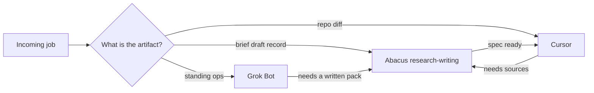

# When Do I Use Abacus AI Instead of Grok Bot or Cursor?

**I use Abacus AI when the job is research, long-form writing, or structured-data work. I use Grok Bot when the job is the always-on ops teammate. I use Cursor when the job is a repo.** Those are three seats. They are not three tabs for the same prompt.

I'm William Spurlock — founder, AI Systems Architect, and Fractional AI CTO. I've built 600+ automations with 500+ still live, spent 20,000+ hours on agentic systems, and helped clients delete 35,000+ hours of busywork. I do not run Monday as one chat that "does AI."

This post is seat assignment. It is not a harness bake-off. If you want Hermes vs OpenClaw vs Agent Zero, that decision already lives in the [2026 personal super-agent framework](/blog/hermes-openclaw-agent-zero-decision-framework). It is also not a refresh of the May ChatLLM line-item in my [2026 solo consultant stack](/blog/solo-ai-consultant-tech-stack-2026). Price gets one sentence here. The seat gets the rest.

As of Monday, September 8, 2026, this is how I pick. The parent for the operating picture is [what an agentic OS means day to day](/blog/what-an-agentic-os-means-for-running-your-business-day-to-day). This spoke is the research-writing chair inside that picture.

---

## When do I use Abacus AI instead of Grok Bot or Cursor?

**Use Abacus AI when the artifact is a brief, a draft, a research pack, or a structured record. Use Grok Bot when the artifact is a standing ops teammate that stays up without you opening a chat. Use Cursor when the artifact is code in a git repo.** If two of those artifacts show up in one request, split the request. Do not mash the seats.

Abacus.AI sells [ChatLLM Teams](https://abacus.ai/teams/) as the Super Assistant: one subscription that puts a large model picker, an agent that can act, a cloud computer, and a creative studio in one interface. That product surface is real. My assignment is narrower. I take the research, writing, and structured-data slice. I do not staff Abacus as the always-on ops computer, and I do not let it pretend it can see my Mac disk.

| Axis | Abacus AI (ChatLLM) | Grok Bot | Cursor |
|------|---------------------|----------|--------|
| Job I assign | Research, long-form writing, structured-data CRUD | Always-on ops teammate | Repo implementer |
| Artifact | Briefs, drafts, source packs, records | Standing ops loop | Commits, diffs, reviews |
| Filesystem I give it | None on my Mac | Not the git working tree | The local repo |
| Official extra | [SuperComputer](https://abacus.ai/help/chatllm-ai-super-assistant/introduction) is a cloud Ubuntu VM | Teammate product, not a model ID | Editor + Task hops on disk |
| When I pick it | The work is language + records, not a deploy | The work must run whether I opened a tab | The work changes files I ship |

Pick rule I actually run:

1. **Writing or research first** → Abacus.
2. **A repo will change** → Cursor.
3. **Ops has to keep running after I close the laptop** → Grok Bot.
4. **Airtable row is the artifact** → Abacus may do the CRUD. Cursor may later read an export. Grok Bot does not become my schema editor.

If you flatten those four into "just ask the smartest chat," you will get a fluent draft that never lands in git, or a bot that starts rewriting copy it should only flag.

A Monday I actually run looks like this. Three jobs. Three seats. No hero tab.

| Monday job | Artifact | Seat | Handoff |
|------------|----------|------|---------|
| "Write the Abacus seat post with official cites" | Draft + source list | Abacus | Cursor only if the markdown already lives in the repo and needs a commit |
| "Flag overnight mail I have to answer" | Ops flag | Grok Bot | Abacus only if I then want a written pack |
| "Fix the frontmatter validator miss" | Diff | Cursor | Abacus only if I need a source I do not have |

I do not ask Grok Bot to draft the article. I do not ask ChatLLM to patch the validator. I do not ask Cursor to babysit overnight mail. The cost of getting that wrong is not a bad sentence. The cost is a dirty tree, a silent ops gap, or a confident paragraph with no URL I can open.

---

## What is Abacus.AI ChatLLM Teams on September 8, 2026?

**ChatLLM Teams is Abacus.AI's Super Assistant: a multi-model chat plus an agent, a cloud computer, and a studio, documented on the [product intro](https://abacus.ai/help/chatllm-ai-super-assistant/introduction) and sold on the [Teams page](https://abacus.ai/teams/).** I treat that as the vendor map. I do not treat every tile on that map as a seat I occupy.

The [intro](https://abacus.ai/help/chatllm-ai-super-assistant/introduction) splits the product into four blocks:

- **Model access** — GPT-6 Astra, GPT-5.6 Sol, Claude Opus 5, Claude Fable 5.1, Grok 4.6, and more, with [RouteLLM](https://abacus.ai/help/chatllm-ai-super-assistant/introduction) as the default router and a custom-router option.
- **Abacus AI Agent** — build apps, run scheduled tasks, write decks and docs, and do deep research with live browsing.
- **SuperComputer** — a persistent Ubuntu VM with root, SSH, databases, storage, and public URLs.
- **Studio** — image, video, music, and voice tools in the same account.

The [homepage](https://abacus.ai/) and [Teams page](https://abacus.ai/teams/) repeat the "100+ models" claim and list current names including Gemini 3.1 Pro, Gemini 3.8 Flash, DeepSeek v4, Kimi K3, and GLM 5.3. [Platform updates](https://abacus.ai/help/platform-updates) keep adding models and admin controls (SCIM, connectors policy, global context, self-improving tasks). That is the live catalog as of this Monday. It is not my org chart.

Price, one sentence, then we leave it: the public Teams page on September 8 showed a first-month discounted rate and then a listed $10 monthly price, while SuperComputer help still describes a Pro tier at $20/month with 30,000 credits — I do not treat either figure as a locked invoice, and the older ChatLLM line still sits in the [May 2026 stack post](/blog/solo-ai-consultant-tech-stack-2026) if you want the cost table. This post owns the seat, not the invoice.

---

## What job does the Abacus research-writing seat own?

**Abacus owns language work and structured-data work. It does not own my local filesystem, and it does not own deploys.** If the output is a paragraph, a source list, or a record, I start here. If the output is a file in a repo, I leave.

The jobs I actually put in this chair:

| Job | Why Abacus | What I do not ask it |
|-----|------------|----------------------|
| Long-form draft | Multi-model chat plus an agent that will sit in a research loop | Commit the markdown for me |
| Source pack | Official agent path includes deep research with live browsing | Invent a citation I cannot open |
| Structured-data CRUD | Connectors exist; Airtable create/read/update/delete is a fair capability | Tour my bases or invent a schema I did not approve |
| Side-by-side model check | ChatLLM is built as a picker + RouteLLM | Crown one vendor as the studio religion |
| Deck / memo / sheet | Official agent path includes office artifacts | Turn the memo into production UI |

I will name Airtable CRUD as a capability because that is how I use the seat when the row is the work. I will not walk a public post through my tables. A capability is not a tour.

Hard no on this seat:

- No Mac filesystem. If the file lives on disk, Cursor opens it.
- No "just push this branch." That is a human go-ahead in Cursor, not a ChatLLM courtesy.
- No always-on ops. Grok Bot already has that job.
- No harness religion. SuperComputer marketing can mention long-running agents. That does not rewrite the [Hermes / OpenClaw / Agent Zero](/blog/hermes-openclaw-agent-zero-decision-framework) post.

The useful test: **if I closed the browser, would the work still need a human to paste it into git?** If yes, Abacus drafted. Cursor still ships.

---

## Does Abacus SuperComputer replace Grok Bot as the always-on ops computer?

**No. SuperComputer is Abacus.AI's always-on cloud VM. Grok Bot is my always-on ops teammate. I do not use Abacus as the always-on ops computer.** Official docs are allowed to sell a 24/7 Ubuntu box. My seat map is allowed to refuse that box the ops job.

The [intro](https://abacus.ai/help/chatllm-ai-super-assistant/introduction) is explicit: the Agent is the brain; SuperComputer is the infra. The [SuperComputer guide](https://abacus.ai/help/chatllm-ai-super-assistant/supercomputer) describes a full Ubuntu VM with root, SSH, a persistent filesystem, Docker, public URLs, and an Always On toggle. That is a cloud machine. It is not Grok Bot.

| Question | SuperComputer (official) | How I assign it |
|----------|--------------------------|-----------------|
| What is it? | Persistent Ubuntu VM in Abacus's cloud | A product I can buy. Not my ops seat |
| Does it stay up? | Yes, if you leave Always On on | I still do not park studio ops there |
| Can it host agents? | Docs say yes, including long-running agents | Harness choice stays in the Hermes post |
| Is it Grok Bot? | No | No |
| Do I use it as the always-on ops computer? | Vendor would like that | I do not |

I am not going to pretend SuperComputer is fake. I am also not going to flatten it into "same as Grok Bot, different logo." One is a VM you can SSH. The other is a teammate product I staff for ops. If a sentence needs both names, it needs both jobs.

Self-improving tasks and scheduled Agent jobs on the [platform updates](https://abacus.ai/help/platform-updates) page are still Abacus product features. They do not move my ops teammate.

---

## When should I pick Cursor instead of Abacus AI?

**Pick Cursor when the next honest output is a diff in a repo I maintain.** ChatLLM can emit code-shaped text. Cursor can open the tree, run the Task hop, and leave a reviewable change. Those are different verbs.

Cursor is the implementer seat: Anysphere's AI-first editor, local working tree, rules, and Task workers. I pin the cheap default on those hops. I do not ask Abacus to "just apply this across the site."

I move to Cursor when any of these are true:

- A file already exists in git and must change.
- The work needs the repo's rules, not a fresh chat persona.
- I need a reviewable diff, not a paste buffer.
- Deploy, commit, or push is even in the neighborhood — those stay human-gated in Cursor.
- The model choice is a Task slug, not a ChatLLM picker mood.

Abacus can still write the spec. That is the handoff, not a failure. I want the research-writing seat to finish the brief. I want the implementer seat to touch the files. If I let ChatLLM "finish the site," I get a zip of vibes and a dirty tree.

The anti-pattern I keep killing: pasting a whole repo into ChatLLM because the model list looks longer. A longer picker is not a working tree.

---

## When should I pick Grok Bot instead of Abacus AI?

**Pick Grok Bot when the job is a standing ops teammate that has to keep the picture of the business without me babysitting a ChatLLM tab.** Grok Bot is not a model ID. It is not Cursor's Task slug. It is not SuperComputer with a different coat of paint.

I move to Grok Bot when any of these are true:

- The work is ops, not a draft.
- The teammate has to exist after I close the research tab.
- The ask is "watch / flag / recap," not "write the article."
- I would be angry if the thing stopped because I logged out of ChatLLM.

I do not move to Grok Bot when the ask is "write 2,000 words with sources" or "update these records." That is Abacus. I do not move to Grok Bot when the ask is "refactor this route." That is Cursor.

People flatten Grok Bot into Grok 4.6 because the names share four letters. ChatLLM will happily serve Grok 4.6 as one model in the picker. That still does not make the picker my ops teammate. A model in a dropdown is a brain you call. A bot you staff is a seat.

---

## Which models sit in ChatLLM right now?

**As of September 8, 2026, the public ChatLLM pages list GPT-6 Astra, GPT-5.6 Sol / Terra / Luna, Claude Opus 5, Claude Fable 5.1, Claude Sonnet 5, Gemini 3.1 Pro, Gemini 3.8 Flash, Grok 4.6, DeepSeek v4, Kimi K3, and GLM 5.3, plus RouteLLM as the auto-router.** I use that list. I do not use last year's invoice names.

| Vendor | Name on the public ChatLLM pages | How I treat it in this seat |
|--------|----------------------------------|-----------------------------|
| OpenAI | GPT-6 Astra; GPT-5.6 Sol, Terra, Luna | Hard reasoning / coding-shaped drafts inside ChatLLM, not a Cursor Task |
| Anthropic | Claude Opus 5; Claude Fable 5.1; Claude Sonnet 5 | Long-form and stubborn edits. Fable after Opus fails, not before |
| Google | Gemini 3.1 Pro; Gemini 3.8 Flash | Volume and cheap passes. The Teams page also flashes other Gemini 3.x labels |
| xAI | Grok 4.6 | A model in the picker. Not Grok Bot |
| Others | DeepSeek v4; Kimi K3; GLM 5.3; Abacus Smaug | Comparison passes, not a religion |
| Router | RouteLLM + custom routers | Default when I do not have a named pick |

[RouteLLM](https://abacus.ai/help/chatllm-ai-super-assistant/introduction) is the official "leave it on auto" control. Custom routers can send a class of prompts to a bot you already built. That is still inside Abacus. It is not a replacement for Cursor rules and not a replacement for the ops teammate.

Studio names on the same marketing pages (Nano Banana Pro, GPT Image-2, Seedance 2.5, Kling 3.0) are image and video tools. They are not the research-writing seat. I do not assign a video model the article.

I will not treat 2024-era model names as current. If a page still prints last year's invoice list, I ignore it.

---

## How do I keep three seats from collapsing into one chat?

**I write the job on the first line, then I refuse any seat that cannot produce the artifact.** If I cannot name the artifact in one noun — draft, record, diff, ops flag — I do not start the run.

The Monday checklist I actually use:

1. **Name the artifact.** Draft, record, diff, or ops flag. One of those. Not "help with AI."
2. **Name the filesystem.** None, cloud VM I am not using for ops, or the local repo. Abacus gets none.
3. **Name the human gate.** I still approve sends, spend, commits, and deploys. Seats do not inherit those rights because the model list got longer.
4. **Refuse souvenir features.** SuperComputer, Studio, and self-improving tasks can stay on the vendor page. They do not get a job unless I write one.
5. **Handoff on purpose.** Abacus → Cursor is a finished brief. Grok Bot → Abacus is a request for a written pack. Cursor → Abacus is "go get sources." None of those handoffs is a merge of the seats.

This is the same discipline as the agentic OS post: jobs, a shared picture, and an approval layer. The research-writing seat is one job. It is not the OS.

What I refuse to flatten, in writing:

- **ChatLLM ≠ the whole stack.** It is one product. The seat map is the stack.
- **Grok 4.6 ≠ Grok Bot.** One is a picker row. One is a teammate.
- **SuperComputer ≠ Grok Bot.** One is a cloud VM. One is ops.
- **A 100-model catalog ≠ a working tree.** Cursor still opens the files.
- **Airtable CRUD ≠ a public base tour.** Capability stays. Inventory stays private.
- **A hosted-agent marketing tile ≠ a harness decision.** That decision already shipped.

If a vendor page tempts me to collapse two of those rows, I reread this list before I change a seat.

I reread it on days I am tired. Those are the days a long picker looks like a whole company.

It is not.

If you want a second operator in the room for this map — research-ops seat design, not an AI-visibility audit — that is an automation strategy call at [/contact](/contact).

---

## Frequently asked questions

### When do I use Abacus AI instead of Grok Bot or Cursor?

**I use Abacus AI for research, writing, and structured-data work.** I use Grok Bot for the always-on ops teammate. I use Cursor when a repo has to change. If the request mixes those artifacts, I split it before I open a tab. The vendor can sell one Super Assistant. I still assign three seats.

### Can Abacus AI edit my local git repo?

**No. This seat does not get a Mac filesystem.** ChatLLM can draft a patch in a chat. Cursor is the editor that opens the working tree. If the file must land in git, I move the brief to Cursor and I keep commit and deploy as human gates.

### Is Abacus SuperComputer the same as Grok Bot?

**No. SuperComputer is an always-on Ubuntu VM in Abacus's cloud, per the [official SuperComputer guide](https://abacus.ai/help/chatllm-ai-super-assistant/supercomputer).** Grok Bot is the ops teammate I staff. I do not use Abacus as the always-on ops computer. A VM you can SSH is not a teammate product, even when both stay up at night.

### How much does ChatLLM Teams cost?

**Treat the public price as promotional until your invoice says otherwise.** On September 8 the [Teams page](https://abacus.ai/teams/) showed a first-month discount and then a listed $10 monthly rate, while SuperComputer help still names a Pro tier at $20/month with 30,000 credits. I am not remaking the May $20 ChatLLM blurb here; that line still lives in the [solo stack post](/blog/solo-ai-consultant-tech-stack-2026).

### What is RouteLLM in ChatLLM?

**RouteLLM is Abacus.AI's automatic model router inside ChatLLM, described on the [Super Assistant intro](https://abacus.ai/help/chatllm-ai-super-assistant/introduction).** Leave it on when you do not have a named pick. Build a custom router when a class of prompts should hit a bot you already designed. It does not replace Cursor rules and it does not staff Grok Bot.

### Can I use Abacus AI for Airtable CRUD?

**Yes, as a capability, when the record is the artifact.** I will let this seat create, read, update, and delete rows when structured data is the work. I will not publish a tour of my bases, and I will not let a chat invent a schema I did not approve. If the next step is code that talks to Airtable from a repo, that hop moves to Cursor.

### Does a 100-model picker mean I should drop Cursor?

**No. A picker is not a working tree.** The [Teams page](https://abacus.ai/teams/) markets 100+ models. That is a catalog claim. Cursor still owns files I ship. I will use ChatLLM to compare outputs. I will not uninstall the editor because the dropdown got longer.

### Where does Hermes vs OpenClaw sit if Abacus can host agents?

**Harness choice stays in the [Hermes / OpenClaw / Agent Zero framework](/blog/hermes-openclaw-agent-zero-decision-framework).** SuperComputer docs can talk about hosting long-running agents. That is infra marketing. It is not this post, and it is not a reason to flatten Abacus into my ops computer. I keep the bake-off where it already shipped.

---

If you are assigning seats across research, writing, structured data, ops, and the repo, I will map that on an automation strategy call. The close is research-ops seat design at [williamspurlock.com/contact](/contact) — not an AIO audit, and not a request to turn one chat into the whole company.
