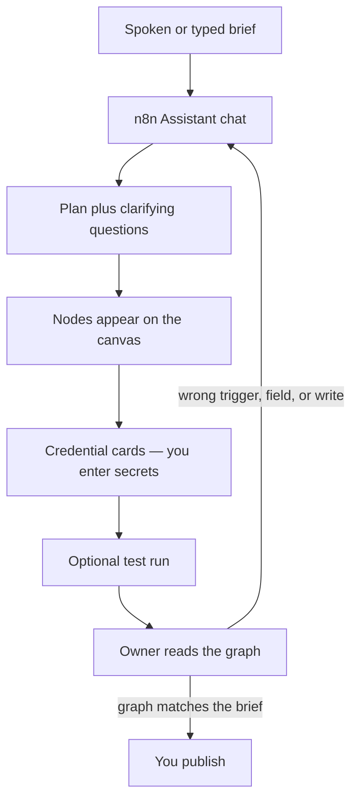
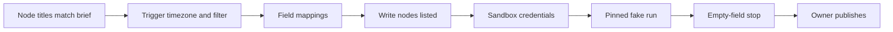

# Building an n8n Workflow by Describing It Out Loud to n8n's AI

**Yes. As of September 2026, n8n's built-in product for that job is [n8n Assistant](https://docs.n8n.io/build/ways-of-building-workflows/n8n-assistant/): you describe the automation in plain language — typed, or spoken into the chat with your OS dictation — and it can plan a workflow, drop nodes on your canvas, ask for credentials, and run what it built.** It is a chat agent inside n8n, not a separate voice app. The output is a normal n8n workflow you open, inspect, and publish like any other graph.

I am **William Spurlock**, founder of Spurlock Studios, AI Systems Architect, and Fractional AI CTO. I have shipped **600+ automations** with **500+ live**, logged **20,000+ hours** inside agentic systems, and deleted **35,000+ hours** of client busywork across that book of work. I sit next to owners who can describe the job in one breath and freeze when the canvas is blank. This spoke is that door.

This is not the drag-click agent lesson. If you already know the nodes and the question is "which field do I map," that loop lives in [no-code AI agents: drag, click, add the variables, run until it works](/blog/no-code-ai-agents-drag-click-add-the-variables-run-until-it-works). Stay here if the question is whether you can **build an n8n workflow by describing it out loud to n8n's built-in AI**, what the first graph is good for, where it breaks, and how an owner checks it before anything live.

If you still need to pick a platform, start with [n8n vs Make vs Zapier in 2026](/blog/n8n-vs-make-vs-zapier-in-2026-which-automation-tool-is-right-for-your-business). If n8n is already the call and you need CRM, email, and the site wired, use [how to connect n8n to your CRM, email, and website in under an hour](/blog/how-to-connect-n8n-to-your-crm-email-and-website-in-under-an-hour). This page does not pick the stack. It talks the first graph into existence, then makes you read it.

---

## Can I build an n8n workflow by describing it out loud to n8n's built-in AI?

**Yes — you describe the outcome to n8n Assistant, and it builds a real canvas workflow. "Out loud" is how you get the brief into the chat, not a second product.** n8n's docs call it a [chat-based agent](https://docs.n8n.io/build/ways-of-building-workflows/n8n-assistant/) that creates, edits, tests, and troubleshoots workflows from natural language. I have not found a separate n8n "voice composer" SKU as of September 11, 2026. You talk. The chat box receives text. The canvas receives nodes.

Paul Gordon's [September 9, 2026 product post](https://blog.n8n.io/introducing-n8n-assistant/) is the cleanest owner sentence: you describe the automation in plain language and n8n Assistant plans it, builds it on your canvas, asks for the credentials it needs, runs it, works out what broke, and iterates with you. The changelog first framed that loop on [July 9, 2026 in n8n 2.29.9](https://docs.n8n.io/changelog/) as "describe a goal, get a working automation." Same job. The shipping name to use now is **n8n Assistant**.

Three n8n AI surfaces get mixed in sales calls. Keep them separate or you will demo the wrong one.

| Surface | What it is in September 2026 | What I use it for |
| --- | --- | --- |
| **n8n Assistant** | Chat agent that plans, builds, runs, and can edit a **normal n8n workflow** on your canvas. [Docs](https://docs.n8n.io/build/ways-of-building-workflows/n8n-assistant/). | The first graph from a spoken or typed brief. |
| **AI Workflow Builder** | Older one-shot generator. n8n says Assistant [supersedes it](https://blog.n8n.io/introducing-n8n-assistant/). | History. Do not promise it as the current product. |
| **Ask n8n AI** | Built-in help panel for docs, expressions, and node questions. n8n says it is [no longer actively developed](https://docs.n8n.io/build/ways-of-building-workflows/use-the-ai-assistant/). | "What does this node do?" — not "build me the workflow." |

That last row matters. Ask n8n AI can still sit in an instance and look like "the AI." It answers questions. It does not own this spoke. If a teammate says "just ask n8n to fix it," that is a different job. This page is the first graph from a description.



What you get at the end is not a hosted script and not a one-off chat that forgets the run. n8n's own argument in that September 9 post is the one I already make to owners: code an intern cannot read is a liability; a chat that did the task once is not a system. **The Assistant builds the same workflow you would have built by hand, in the same project, with the same execution log.** A colleague who never heard your prompt can open a node next week.

Availability is Preview and it is moving. I am not going to freeze a price, and I am not going to pretend every instance has the same toggle.

- n8n's Assistant docs (as of mid-September 2026) list **n8n Cloud Starter and Pro**, plus **self-hosted Community, Registered Community, and Business**. Cloud Enterprise and self-hosted Enterprise are not in that list. n8n tells Enterprise customers to ask their Customer Success Manager about preview access.
- The September 9 post adds: Cloud is on by default for **new** instances; Enterprise Cloud is excluded from that default; self-hosted **Docker** needs n8n **2.36+** and your own model keys; **npm installs are not supported**.
- The feature still ships behind a **preview flag**. n8n says it can make mistakes. Review before production.

If the chat panel is missing, you do not have a prompting problem. You have an instance problem. Check plan, version, and the Preview toggle before you sit an owner down and say "just talk to it."

### What "out loud" actually is

I have owners talk the job the way they would brief a new coordinator. Then I put that sentence in the Assistant chat. On a laptop that is macOS dictation, Windows Voice Access, or whatever the browser already uses. The product still sees text.

That is enough. You do not need a headset SKU. You do need to watch the transcript.

Dictation turns "HubSpot" into "our spot," "sheet" into "Slack," and "do not send" into "do send." The Assistant will happily build the wrong graph from a confident wrong noun. **I read the chat line out loud a second time before I let it build.** If the transcript is wrong, I fix the words. I do not "trust the vibe" and hope the canvas guessed.

Spoken briefs also ramble. That is fine for a human. It is expensive for a Preview agent that burns [credits on tokens](https://docs.n8n.io/build/ways-of-building-workflows/n8n-assistant/). I let the owner talk once. Then I cut the speech down to trigger, apps, fields, success, failure, and "ask before publishing." That edited line is the prompt. The rant stays in the room.

---

## What is n8n Assistant good for, and where does the first graph break?

**n8n Assistant is good for a first graph of a job you can already say in one business sentence. It breaks when the sentence hides the system, the field, or the write.** It is a translator from outcome-language into nodes. It is not a replacement for knowing what "live" means on your CRM.

I use it when the owner can say the loop and cannot name the nodes. "New form row, look up the company, draft a reply, do not send." That is a real brief. "Make sales run itself" is not.

Here is the split I actually use after the September 9 launch note and a week of sitting on the canvas with it.

| It earns the first pass when… | It wastes a pass when… |
| --- | --- |
| The trigger is one system you can name (Gmail, a form, a schedule, a webhook). | The trigger is "when something important happens." |
| The apps already exist and you can log into them. | The Assistant has to invent an internal API you have never shipped. |
| Success is a row, a draft, or a channel message you will read. | Success is "the AI handles it" with a live send on run one. |
| Failure is a stop, a retry, or a Slack you will see. | Failure is silent, or "just keep trying." |
| You will open every node before publish. | You treat the chat as the audit. |

n8n's own product example is the right shape. Someone wants inbound form submissions triaged: enrich the company, check whether they are already a customer, then route to sales or send a templated reply. They know that as a sentence and none of it as a node graph. The Assistant plans, builds, asks for the CRM credential when it hits that node, runs a test submission, and finds the enrichment step returns an empty array for sole traders. It patches that case, runs again, and hands over a workflow with eight nodes and a clean execution. A week later someone who was not in the room edits a node. They do not need the original prompt.

That story is also the warning. **The first graph can look finished and still miss a real-world empty array.** Sole traders, missing emails, "Company" as a person's first name, a form field that is blank on mobile — those are the breaks I see. The Assistant is not psychic about your data. It is optimistic about your nouns.

### Where I let it build

- **Scaffold a known sentence.** Form → sheet or Data Table → Slack. Invoice PDF from Gmail → Drive → a row. Daily failed-execution summary to a channel. n8n's get-started list in the September 9 post is this class of work.
- **Name the nodes for an owner who refuses to learn the palette.** They can say "Gmail" and "Drive." They cannot find the node. The Assistant can.
- **Force a clarifying question.** "Send new form responses to my team" should get "which form, which channel." If it builds without asking, I stop it. Ambiguity that becomes architecture is how you email the wrong Slack.
- **Attach credentials at the moment a node needs them.** Secrets stay in n8n's credential screen. They do not go in the chat. n8n is explicit: [the AI never sees credential secrets](https://docs.n8n.io/build/ways-of-building-workflows/n8n-assistant/).
- **Keep high-impact actions behind a human.** Publishing, deleting, and other consequential moves wait for confirmation. That is n8n's rule. I treat it as mine too.

### Where I do not let the first graph go live

- **Any send or CRM write on the first green run.** Draft, Data Table, or a private channel. Then a human. The parent spoke is the click loop for variables. This spoke does not get to skip that loop because the nodes appeared by voice.
- **Custom auth, private APIs, and "the thing our contractor built."** The Assistant will guess a generic HTTP node and a happy JSON shape. Guessing an internal contract is how you write to the wrong environment.
- **A brief that names a model and no job.** "Add Claude Sonnet 5" is not a workflow. "Classify this inbox into invoice / not-invoice, write the label to a Data Table, stop if the PDF is missing" is a workflow. The model is a node, not the product.
- **Regenerating the same graph because the first one felt ugly.** Credits track tokens. n8n says longer conversations, larger workflows, debugging sessions, and repeated iterations use more. I review the plan, then I edit nodes by hand when the shape is 80 percent right.
- **Enterprise instances that do not have the feature yet.** Do not invent a workaround on a sales call. Check the instance.
- **Pasting customer rows into the chat "so it understands."** n8n warns you not to paste sensitive data unless the task requires it. I use a fake row. I do not dump last Tuesday's real inbox.

n8n also lists limits I repeat to owners because they sound like bugs and they are product facts: it is not proactive, it does not watch your instance overnight, it does not suggest automations you did not ask for, it works on one instance, and it does not drive your computer or browser. Browser-assisted credential setup is on their future list, not this release. If the owner expects a ghost employee, they bought the wrong story.

The August 31 parent post still mentions **AI Workflow Builder** credits resetting on the 1st and not topping up. That was the old helper. Assistant usage is a **separate meter** in the September 9 post. I am not going to reprint a dollar price or a credit pack. [n8n's plans page](https://n8n.io/pricing/) is the live source. If someone quotes a number in Slack, open that page the same hour.

---

## How do I describe the workflow so n8n Assistant builds a usable graph?

**Name the trigger, the apps, the fields, what success writes, what failure does, and tell it not to publish.** That is the whole prompt. Outcome-language is fine. Missing nouns are not.

n8n's own prompt checklist is the one I keep on the desk. When you write — or speak, then edit — include:

1. What should trigger the workflow.
2. Which apps or services it should use.
3. What data it should read, send, or update.
4. What should happen when it succeeds.
5. What should happen when it fails.
6. Whether n8n Assistant should ask before publishing.

I add a seventh because owners skip it: **which writes are forbidden on the first run.** "Draft only. No email send. No CRM update. Ask me before publishing." If you do not say that, a Preview agent can build a live send because you said "then email them."

Here is n8n's own create-workflow example from the Assistant docs. I use it as the floor, not as a client build.

```text
Create a workflow that checks Gmail every morning for invoices,
saves PDF attachments to Google Drive, and adds a row to a Data Table.
Ask me before publishing the workflow.
```

That prompt is usable because every noun is an app or an object you can open. Gmail. Morning. Invoice. PDF. Google Drive. Data Table. Ask before publishing. I can sit next to an owner, open those five things, and say yes or no.

Here is the same job as I hear it in a room, before I edit.

> "Yeah so like when invoices come in can we just grab those and put them somewhere and maybe track them so I'm not hunting my inbox?"

That sentence is the need. It is not the prompt. If I paste it raw, I get a graph that guesses "somewhere" and "track them." Somewhere becomes the wrong Drive folder. Track them becomes a sheet the Assistant created without asking. I let the owner talk. Then I say the edited line back. Then I send the edited line.

### A spoken brief I will send, and one I will not

| I will send this | I will not send this |
| --- | --- |
| "Webhook from the site contact form. Read `email`, `company`, `ask`. Append one Data Table row. Post a Slack draft to `#leads-review`. Do not email the lead. Do not write HubSpot. Ask before publishing." | "Automate the inbound a bit and ping the team if it's good." |
| "Every weekday 7:00 America/New_York, search Gmail for `has:attachment filename:pdf newer_than:1d`, save each PDF to Drive folder Invoices-2026, write date, from, filename, Drive URL to a Data Table. If no PDF, stop. Ask before publishing." | "Do the invoice thing we talked about." |
| "On new Typeform completion, create a Gmail draft to the submitter that only uses `email` and `first_name` from the payload. If `email` is empty, stop. Do not send. Ask before publishing." | "Make it follow up so we look responsive." |

Notice what the good column does. It names the trigger. It names fields. It names the stop. It forbids the dangerous verb. It keeps publish as a human click.

When I am in the room I talk in that table's left column on purpose. I do not perform a clever prompt. I perform a boring contract.

### How I talk when I am sitting next to the owner

I do not start with architecture. I start with one run they already hate.

1. **I ask them to say the last time they did the job by hand.** "Tuesday I downloaded the PDF, dropped it in Drive, typed the vendor into the sheet." That is the workflow. The Assistant should hear those verbs.
2. **I write the six n8n bullets on a note, then we fill them.** Trigger. Apps. Fields. Success. Failure. Do not publish. If a bullet is blank, we do not open the chat yet.
3. **I dictate or type the filled note into n8n Assistant.** I do not dictate the fifteen-minute backstory.
4. **I stop at the plan.** n8n says to review the plan before you ask it to build. I do. If the plan invents a node we did not name, I reject it in chat: "Do not add HubSpot. We did not ask for a CRM write."
5. **I let it build only after the plan matches the note.** Nodes on the canvas are cheap to edit and expensive to undo if you already connected production credentials.
6. **I refuse a second full rebuild** unless the plan was wrong. If the graph is close, I click the node. That is the parent spoke. Voice got us onto the canvas. Hands finish the mapping.

If the Assistant asks a clarifying question, that is a win. "Which Gmail account?" "Which Drive folder?" "Which Data Table?" Answer with a name you can see in the picker. Do not answer with "the usual one."

### What I never put in the chat

- API keys, app passwords, tokens, or "just this once" secrets. n8n will show a credential card. You fill the normal credential screen.
- A real customer's email body "as an example." Use `jane@example.com`, `Acme Test`, `Need a quote on two rooftop units`.
- A request to publish, activate, or delete unless you mean that click right now.
- A request to "make it smarter" with no field list. Smarter is how a classifier starts rewriting prices.

If you want a model in the graph, name the job and the cheap default. On my work that is usually **Claude Sonnet 5** for a judgment draft, **GPT-5.4 mini** or **Gemini 3.5 Flash** for a boring label. I still keep send off. The Assistant can attach an AI node. It cannot decide your risk.

Web access is a separate toggle. When it is on, n8n Assistant asks before it hits an external domain. Read the domain. "Approved websites" is not "the open web." If you do not need a docs page, leave web access off for the first build.

---

## How does an owner check the n8n Assistant graph before anything goes live?

**You check the graph the same way you check a contractor's first draft: open the canvas, read every node, run one fake payload, and refuse publish until the write nodes are dark.** The chat is not the audit. The execution log is not the audit by itself. The owner is the audit.

n8n's review list is short and I run it in this order:

1. Review the workflow logic.
2. Check node configuration and credentials.
3. Test with expected input data.
4. Check execution results and error handling.
5. Confirm the workflow does not do unintended actions.

I turn that into an owner pass I can finish in one sitting. If the pass is unfinished, the workflow is not going live. Preview software does not get a pass because the demo was pretty.

### The owner pass I actually run

**1. Read the plan, then the titles.**
Before I click around, I match node titles to the brief. If I asked for Gmail → Drive → Data Table and I see Gmail → Drive → Gmail send, the graph already failed. I do not "see what it does." I stop.

**2. Open the trigger like it is a contract.**
Schedule or poll time, timezone, webhook path, form ID, mailbox, label, search string. Assistant-generated triggers love `every morning` and then pick a UTC cron the owner does not work in. I set **America/New_York** myself when the business is Eastern. I do not leave "morning" as a vibe.

**3. Open every mapping.**
This is where the parent spoke takes over. Voice created boxes. Boxes still need `email`, `company`, `ask`, `amount` pointed at real payload fields. If a field is empty, a model will guess. Guessing is how you get a confident wrong CRM update. I pin one fake item and I watch the input panel. If `{{email}}` still points at the test user, we are not done.

**4. Count the write nodes.**
I list them on paper: Drive upload, Data Table row, Slack post, Gmail send, CRM create, HTTP POST. Each write gets a yes, a draft-only, or a delete. Day one I want at most one write, and it should be a row or a draft I can delete. If the Assistant added two sends "to be helpful," I disable them.

**5. Credentials, by card, not by paste.**
When the chat shows a credential card, I pick an existing credential I already trust or I create a new one in the standard screen. I do not type a key into the thread. I also do not attach the production HubSpot key to a graph I have not run on fake data. A sandbox key, or no CRM node at all, is the first pass.

**6. One pinned execution.**
I run the workflow once with a payload I wrote. I open each node's output. I want to see the PDF land in the folder I named, the row I can delete, the Slack I can remove. I do not want a surprise second item. If the Assistant already ran the workflow during the build, I still run **my** item. Their happy execution is not my sample.

**7. The empty-field test.**
I delete `email` or the PDF from a copy of the payload and run again. The graph should stop. If it invents an address, we failed. This is the same test I run on a hand-built agent. Voice does not retire it.

**8. Publish is a human click.**
n8n Assistant asks before high-impact actions. I still treat publish as mine. Inactive is a legal state. Active-and-wrong is an incident.



### What I look at inside one node

Owners glaze over parameters. I do not make them love JSON. I make them answer four questions out loud.

| Question | Pass | Fail |
| --- | --- | --- |
| What starts this node? | A named trigger or the previous node's named field | "Whatever it got" |
| What is it allowed to write? | One object you can delete | "The CRM" as a blob |
| What happens if the field is missing? | Stop, or a branch you can see | The model fills it in |
| Who sees the result? | A private channel, a draft, a table | A customer, a public channel, a production record |

If the owner cannot answer those four, we are not activating. I will sit there and click with them. That is the job. The Assistant saved us the palette search. It did not save us the read.

### What I do when the first run fails

I read the node error myself. Then I decide whether the fix is a mapping, a credential, or a prompt.

- **Mapping.** Wrong field, wrong folder, wrong sheet tab. I click. I do not open a new chat essay.
- **Credential.** Missing scope, wrong mailbox, Drive folder the user cannot see. I fix the credential screen. I do not paste a new key into chat.
- **Shape.** The Assistant built the wrong story — extra send, missing stop, enrichment that assumes a company domain. I tell it the correction in one sentence: "Remove the Gmail send. Keep the Data Table row. Stop if the PDF is missing." Then I re-check the canvas. I do not say "fix it" and walk away.

n8n will let the Assistant inspect a failed execution and propose a change. That is useful. It is also how a Preview agent "helps" by widening a filter or adding a retry that writes twice. **I apply a fix only after I can say the new node list out loud.** If I cannot, I revert.

This is as far as I go on repair in this spoke. A full "talk the Assistant through a production outage" is a different page. If the graph is already live and hurting people, turn it off. Do not chat at a burning send.

---

## When should I still drag nodes instead of talking to n8n Assistant?

**Drag when you already know the nodes, when the whole job is variable mapping, or when a write can hurt someone.** Talk when the canvas is blank and the sentence is clear. Those are different minutes.

I like n8n Assistant. I do not start every build there. After 600+ automations I can place an Error Trigger, a webhook, and a Gmail node faster than I can wait on a Preview plan. The Assistant wins the empty-canvas tax. It loses the last twenty minutes of a real workflow, every time.

Use hands, not voice, when:

- **You can already name the eight nodes.** Searching the palette is cheaper than a credit burn and a cleanup.
- **The brief is "map these fields."** That is the [drag-click-variables loop](/blog/no-code-ai-agents-drag-click-add-the-variables-run-until-it-works). Talking "make the email go to the email" will still leave `{{email}}` on the test user if you do not open the panel.
- **The first live action is a send, a charge, a delete, or a production CRM write.** Scaffold with Assistant if you want. Connect those nodes yourself. Watch the first draft like it can ruin a Tuesday — because it can.
- **The integration is a custom HTTP contract.** You own the URL, the header, the JSON. The Assistant will invent a polite version of that contract. Polite is wrong.
- **You are on an instance where Assistant is off.** Self-hosted npm, some Enterprise, an old version. Build the graph. Do not stall the business waiting on a Preview flag.
- **You are choosing n8n versus Make versus Zapier.** That is a platform decision. [The 2026 comparison](/blog/n8n-vs-make-vs-zapier-in-2026-which-automation-tool-is-right-for-your-business) is the page. Assistant does not pick your vendor.

Use voice-plus-Assistant when:

- The owner can do the job by hand and freezes at a blank canvas.
- You want a first graph in the same meeting as the brief.
- You will stay for the owner pass above.
- The first write is a row or a draft you can delete in thirty seconds.

I also still hand-build the "form → CRM → confirmation" first automation when the shop has never run n8n. The [under-an-hour CRM, email, and website wire-up](/blog/how-to-connect-n8n-to-your-crm-email-and-website-in-under-an-hour) is that path. Assistant can sketch it. I still want the owner to click the webhook once so they believe the site is talking to the instance.

### A 20-minute meeting shape that does not lie

This is the meeting I will sell. It is not "inbound goes live in twenty minutes." It is "you leave with a graph you can see."

| Minute | What we do | What we refuse |
| --- | --- | --- |
| 0–4 | Owner says the last manual run. I write the six prompt bullets. | Recording a rant into chat. |
| 4–6 | Edited brief into n8n Assistant. Stop at the plan. | "Just build it." |
| 6–10 | Build. Credential cards for **sandbox** only. | Production HubSpot. |
| 10–16 | Owner pass: titles, trigger, mappings, write list, one fake run, empty-field stop. | Calling a green run "done." |
| 16–20 | Save inactive. Name the person who will watch the next three runs. | Publish because the meeting is ending. |

If minute 16 is still a mess, the workflow stays inactive. The Assistant did not fail you. The brief was missing a noun. That is a cheaper miss than a live send.

### Nodes I often delete after a voice build

n8n Assistant likes to be complete. Complete is how a first graph grows a second write.

I keep a strike list next to the canvas:

- **A Gmail or Slack send I did not name.** Draft is a node. Send is a different node. If I said draft, send goes.
- **A CRM create "so the team has it."** A Data Table row is enough proof. HubSpot on day one is a second system to clean up.
- **An IF node that routes on a sentiment the payload does not contain.** If the form has no `urgency` field, I will not let a model invent one and then branch on it.
- **A retry that writes again.** One failed Drive upload plus a retry can create two files and two rows. I want a stop I can see, then a human.
- **An extra AI Agent node on a job that is a filter.** "Is this an invoice PDF?" can be a filename rule. I do not pay a model to read every receipt if `filename:pdf` plus a vendor list already works.

The Assistant can also offer to [build agents](https://docs.n8n.io/build/ways-of-building-workflows/n8n-assistant/) — instructions, tools, skills — and to connect an MCP server from n8n's registry. That is a later conversation. This spoke is a workflow from a spoken brief. If the owner actually needs an agent canvas, I send them to the [drag-click parent](/blog/no-code-ai-agents-drag-click-add-the-variables-run-until-it-works) after the first graph exists. I do not let Assistant drop an agent, a tool cluster, and a live send in one breath.

I keep webhook hosts and instance URLs in the infrastructure bucket. They are not the mailbox. If you want to talk about a build, use [/contact](/contact). Do not mail a production webhook.

---

## Frequently Asked Questions

### Can I build an n8n workflow by describing it out loud to n8n's built-in AI?

**Yes. You describe the job to n8n Assistant in plain language — typed or spoken into the chat — and it can plan, build, and test a normal n8n workflow on your canvas.** As of September 2026 there is not a separate n8n voice-composer product. Dictation is how speech becomes the prompt. You still open the graph before anything live. See [n8n's Assistant docs](https://docs.n8n.io/build/ways-of-building-workflows/n8n-assistant/).

### Is n8n Assistant the same as Ask n8n AI?

**No. n8n Assistant builds and runs workflows from a chat. Ask n8n AI is the older help panel for docs, expressions, and node questions, and n8n says it is no longer actively developed.** If your teammate "asked n8n AI" and only got a paragraph, they used the help surface. If nodes appeared on the canvas, they used Assistant. Do not demo the wrong one.

### Does n8n Assistant work on self-hosted n8n?

**Sometimes. Current Assistant docs list self-hosted Community, Registered Community, and Business. The September 9, 2026 post says Docker from n8n 2.36 with your own keys, and npm is not supported.** Enterprise self-hosted is not in the ready list. Check version, modules, and the Preview flag on your instance before you promise a talk-to-build session.

### Do I paste API keys into the n8n Assistant chat?

**No. n8n says credential secrets are never sent to the AI and the AI never sees them.** When a node needs an account, Assistant shows a credential card. You pick an existing credential or you create one in the normal n8n screen. If you paste a token into the thread, that is your leak, not the product design.

### Will n8n Assistant publish a workflow without asking?

**It should not. n8n says Assistant asks for confirmation before high-impact actions such as publishing or deleting.** I still treat publish as an owner click. Inactive plus a clean fake run is a finished meeting. Active-and-unread is how a Preview graph emails a real customer.

### Does talking to n8n Assistant replace mapping variables on the canvas?

**No. Voice creates the boxes. You still map `email`, `company`, and `ask` so the model cannot invent them.** That click loop is the [no-code AI agents spoke](/blog/no-code-ai-agents-drag-click-add-the-variables-run-until-it-works). If you skip it, the first pretty execution is a test-user address waiting to go live.

### How is this different from asking ChatGPT or Claude to write an n8n workflow?

**n8n Assistant writes onto your canvas, uses your n8n nodes, and leaves an execution log in the same project. A chat model hands you JSON or steps you now have to host, paste, and debug.** n8n's September 9 post is blunt about that gap: generated code is a new system to own; a one-off assistant run disappears. I will use Claude Sonnet 5 to help me think. I will not paste unverified workflow JSON from a generic chat into production.

### What should I say in the first prompt to n8n Assistant?

**Trigger, apps, fields, success, failure, and "ask me before publishing." Add "draft only" if a send is even possible.** n8n's own floor is: check Gmail each morning for invoices, save PDFs to Google Drive, add a Data Table row, ask before publishing. Say the folder. Say the stop. Say the forbidden write. Then read the plan before you let it build.

---

## Book the automation call if you want the first graph checked

n8n Assistant is a real door. It is not a replacement for an owner who can name the trigger and refuse a surprise send.

I will sit on the canvas with you, cut the spoken rant into a six-bullet brief, let Assistant place the first nodes, and run the owner pass before anyone publishes. That is the [AI automation](/blog/category/ai-automation) work I already do across 600+ builds and 500+ live workflows. The site is the personal brand. The studio build conversation starts at [/contact](/contact).

Bring one job you already do by hand. Bring the apps you can log into. Leave the production send off. If the instance does not show n8n Assistant yet, we build the graph the old way and we do not wait on a Preview flag to unblock Tuesday.
