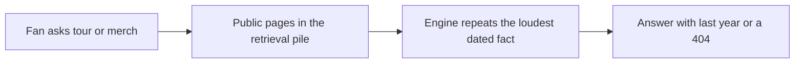

# ChatGPT Is Sending Fans to Last Year's Tour and a Dead Merch Link

**ChatGPT and Perplexity send fans to last year's tour dates and a dead merch URL because they repeat the most available public fact, not the newest note on your phone.** Search does not prefer your `/tour` page because you own it. It prefers the page that still names a city, a year, and a store link — often a Bandsintown leftover, a Songkick history block, a Wikipedia tour table, or a Big Cartel URL that already 404s.

I'm William Spurlock, founder of Spurlock Studios, AI Systems Architect, and Fractional AI CTO. I have been SEO-certified since 2021; the work now sits under AEO, AIO, and GEO. I have shipped **600+ automations** with **500+ live**, logged **20,000+ hours** inside agentic systems, and deleted **35,000+ hours** of client busywork. I do not invent streaming counts, merch revenue, or fake artist names here. This spoke owns one stale-fact problem for a working independent artist or a small label: **the answer is last year's calendar and a store that is gone.**

I already wrote how I built [Fordo's official artist website](/blog/building-fordo-immersive-artist-website-ai-studio-cursor). The site is the source. This post is what happens when that source rots. I am not rebuilding a homepage. I am not walking a merch theme. I am not selling a "you need a website" lecture to someone who already has URLs. If ChatGPT still recites 2025 dates the week you announce 2026, the public record is lying in more than one place.

How the engines pick names at all lives in [how ChatGPT and Perplexity actually decide which businesses to recommend](/blog/how-chatgpt-and-perplexity-actually-decide-which-businesses-to-recommend). How to earn a first recommendation lives in [how to get ChatGPT and Perplexity to recommend your business](/blog/how-to-get-chatgpt-and-perplexity-to-recommend-your-business). Come back here for the freshness failure after they already know your name.

I keep owned facts and borrowed facts on different lists so a manager (or you, at 11pm) knows what to touch first.

| Owned | Borrowed | Why the split matters |
|---|---|---|
| `/tour`, `/merch`, official schema | Bandsintown, Songkick, Spotify live module | You can ship owned in an hour. Borrowed only moves after you log in there |
| Current EPK you still host | Wikipedia tour table, old interviews | You can replace a PDF. You cannot force a volunteer edit the same night |
| 301s on old store hosts | Ticket vendor leftovers | A 301 is yours. Eventbrite still needs a cancel click |

If the stale answer cites an owned URL, that is on you tonight. If it cites a borrowed URL, that is still on you this week — you just have a second login.

---

## Why is ChatGPT sending fans to last year's tour dates and a dead merch URL?

**ChatGPT is sending fans to last year's tour dates and a dead merch URL because those facts still sit on pages the engine can retrieve, and newer facts either are missing, hidden in JavaScript, or contradicted by a louder third-party copy.** OpenAI launched [ChatGPT search on October 31, 2024](https://openai.com/index/introducing-chatgpt-search/) and later opened it to everyone. That did not make the model a live ops manager. OpenAI's own help text says [search results and citations can be incomplete, outdated, or incorrect](https://help.openai.com/en/articles/9237897-searching-the-web-with-chatgpt). A tour question is exactly the kind of prompt that looks current and still lifts a year-old table.

Perplexity is not a cleaner clock. Its help center says it [searches the web in real time and attaches numbered citations](https://www.perplexity.ai/help-center/en/articles/10352895-how-does-perplexity-work). Real-time retrieval of a stale Bandsintown page is still a stale answer. The citation is honest about the URL. It is not honest about the year.

I split the failure into four layers so you stop blaming "the AI" and start blaming the public fact:

| Layer | What the engine is doing | What you experience |
|---|---|---|
| **Training memory** | A past dump still holds "on tour fall 2025" from a bio or interview | A no-search chat recites last year with no link |
| **Retrieval pile** | Search rewrites "when is [artist] on tour" and opens the pages that already rank for that string | Bandsintown, Songkick, or Wikipedia beat your `/tour` page |
| **Conflict** | Two years exist in the pile; the repeated year wins | Your site says 2026; the answer still lists 2025 cities |
| **Dead URL** | An old store, collection, or product path is still in bios, PDFs, and external-link blocks | The merch citation 404s when the fan taps it |

The path looks like this:

If a box in that pile still publishes 2025 as if it were current, GPT-6 Astra with search on can cite it this week. Gemini 3.8 Flash and Grok 4.6 will do the same job on the same pile. Claude Fable 5.1 with a browse tool is not a different physics. The model name does not retire a leftover date.

Search-off and search-on fail in different clothes. I treat them as two tests, not one vibe.

| Mode | What I see | What I do |
|---|---|---|
| **ChatGPT, search off** | Last year's routing with no URL, or a merch host you retired | That is training memory. You cannot "refresh" it. You can only publish a louder living source for the next dump and for search-on |
| **ChatGPT, search on** | A citation to Bandsintown, Wikipedia, Songkick, or your own `/tour` | Open the cited URL. If that page is last year, search did its job on a rotten source |
| **Perplexity** | Numbered sources, often the same aggregators | Same open-the-URL rule. Real-time is not the same as current |

OpenAI says ChatGPT search [rewrites your question into targeted queries and sends those to search providers](https://help.openai.com/en/articles/9237897-searching-the-web-with-chatgpt). "When is [artist] on tour" is a query the aggregators already won in classic search. Your official page only wins that rewrite if it is a complete, dated, indexable calendar — not a hero animation that says "dates soon."

A 404 merch URL survives for a blunt reason: the citing page still prints the string. Interviews, Wikipedia external links, and old EPKs do not 404 just because Shopify did. The engine cites the page that still names the store. The fan is the person who discovers the cart is gone.

I would rather you fix five public URLs this week than commission a new homepage. A prettier site that still 404s `/store` is a new source of the same lie.

---

## Which public pages freeze a dead date or a dead store link into the answer?

**The pages that freeze a dead date or a dead store link are the ones answer engines already treat as music-entity evidence: your own tour and shop URLs, Bandsintown, Songkick, Wikipedia tour tables, the Spotify artist profile, leftover press kits, and any same-name artist those sources failed to separate.** This is the same consistency problem I wrote about for [brand consistency and NAP schema](/blog/how-brand-consistency-and-nap-schema-build-entity-authority-for-ai), except the "address" is a date and a cart URL.

I keep a surface map for artists. If you only update the site, you lose.

| Surface | What freezes | How it leaks into ChatGPT or Perplexity |
|---|---|---|
| **Official `/tour` or `/dates`** | Last year's list still titled "On tour" with `EventScheduled` markup | The engine trusts your domain and still reads 2025 |
| **Official `/merch` or `/shop`** | A moved store, a killed collection, a seasonal drop URL | The citation is your brand and a 404 |
| **[Bandsintown](https://www.artist.bandsintown.com/)** | Dates you never archived; auto-imported leftover shows | Bandsintown sells distribution into Spotify, Google, and site widgets. A stale listing can copy itself off-site |
| **[Songkick](https://www.songkick.com/)** | Upcoming vs past mixed in one artist folder | Wikipedia even ships a [Songkick template](https://en.wikipedia.org/wiki/Template:Songkick) keyed to Wikidata `P3478`. That is a join, not a vibe |
| **Wikipedia tour table** | A completed-year table that still reads like the current story | Ahrefs' [June 11, 2025](https://ahrefs.com/blog/top-10-most-cited-domains-ai-assistants/) Brand Radar pass put Wikipedia at **16.3%** mention share on ChatGPT. A stale table on a heavily cited domain travels |
| **Spotify artist profile** | A bio line that still says "on the road this fall" plus a Bandsintown-fed live module | Fans ask ChatGPT after they hear you. The profile is high-trust music-entity text |
| **Press kit / EPK PDF** | A 2024 Dropbox or publicity URL with last year's routing and a Big Cartel link | PDFs almost never get unpublished. Search still opens them |
| **Link-in-bio and social bios** | One shortener that still points at `/products/tour-tee-2025` | The engine repeats the short URL; the fan hits 404 |
| **Same-name artist pages** | A different act's dates and store on Songkick, Wikipedia, or Spotify | The answer is true for someone else |

Three freeze patterns show up over and over. I would rather you hunt these than rewrite the About page.

1. **The leftover current label.** Past dates stay under "Upcoming." Schema still says `EventScheduled`. The HTML never got an "Archive" heading.
2. **The migrated store.** Big Cartel to Shopify, Shopify to a new shop subdomain, a Printful season that died. The old host still gets cited because interviews and Wikipedia external links were never changed.
3. **The aggregator that outranks you.** [Bandsintown for Artists](https://www.artist.bandsintown.com/) tells artists it will push dates onto major platforms. If that dashboard is the complete calendar and your site is a teaser, the engine treats Bandsintown as the official record — including dates you forgot to close.

Merch has the same shape as a catalog problem. Answer engines do not "shop" a theme. They lift a product record and a URL. I covered that mechanism for SKUs in [product schema for AI](/blog/product-schema-for-ai-making-your-catalog-machine-readable). A hoodie page that 404s is not a catalog. It is a tombstone the model can still quote.

Ticket vendors freeze dates too. I add them to the map when a leftover event page is still public.

| Vendor leftover | What it still says | Why an engine likes it |
|---|---|---|
| **Eventbrite / Dice / AXS event URL** | A 2025 night with a "view event" title | Unique URL, venue + date + artist in one block |
| **Ticketmaster event URL** | A closed sale that still names the city | High-authority domain, easy to retrieve |
| **Venue "past shows" page** | Your name next to last year's calendar | Local source with a clean date string |
| **YouTube About / a 2025 recap video description** | "On tour now" under a video that still ranks | The description is text. The engine can lift it |
| **Apple Music or Amazon Music profile copy** | A pasted bio you never touched after the last date | Second music-entity page next to Spotify |

A Linktree that is newer than the site is not a living source. It is a second official door. If Linktree points at the 2026 merch door and the site still links last year's Big Cartel, the pile contains both. I have watched Perplexity cite the dead one because a press page repeated it.

JavaScript-only calendars freeze in a quieter way. The fan sees dates. A crawler that does not run your bundle sees last deploy's HTML, or nothing. Bandsintown's own [best-practices note](https://www.artist.bandsintown.com/tutorials/best-practices-tutorial) pushes an events widget and an Events API onto the artist site. A widget is a convenience for humans. It is not a promise that GPT-6 Astra received the current JSON. I still want the dates in the HTML and in JSON-LD on `/tour`.

Do not confuse a freeze with a missing website. Plenty of working artists have a site. The site is just no longer the living source.

---

## How do I publish a living tour + merch source that answer engines can re-read?

**Publish one canonical tour URL and one canonical merch URL, write the dates and the store as visible HTML, mark current shows as `MusicEvent` with an honest `eventStatus`, 301 every dead cart path, and update Bandsintown, Songkick, bios, and leftover PDFs the same day — not "when we have time after the drop."** Structured data is how a machine rereads the page without guessing. The broader stack is in [how structured data helps AI understand and cite your business](/blog/how-structured-data-helps-ai-understand-and-cite-your-business). This section is only tour plus merch.

I want one official pair. Not a new subdomain every cycle. Not a Linktree that is newer than the site.

| URL | Job | What must be true this week |
|---|---|---|
| `yoursite.com/tour` | Living calendar | Upcoming dates in HTML. Past dates under Archive or removed from current markup |
| `yoursite.com/merch` | Living store door | 200. Every old store host 301s here or to the matching product |
| Bandsintown artist page | Mirror, not source | Same cities, same years, closed leftovers |
| Songkick artist page | Mirror, not source | Upcoming vs past split the way the site splits them |
| Spotify bio + live module | Short facts, no expired season | No "on tour now" after the last date |

For each current date I want a `MusicEvent` (or `Event`) record a crawler can extract without running your React island. [schema.org/MusicEvent](https://schema.org/MusicEvent) is the type. Google's [Event structured data](https://developers.google.com/search/docs/appearance/structured-data/event) is the field list I actually fill.

| Field | What I put | What I refuse |
|---|---|---|
| `@type` | `MusicEvent` | A generic `Article` that happens to mention cities |
| `name` | Artist plus city or tour leg | "Don't miss this unforgettable night" |
| `startDate` | ISO-8601 with timezone | "This Saturday" |
| `location` | Venue `Place` plus address | "TBA" left as if it were a venue |
| `performer` | `MusicGroup` with the official name | A nickname that does not match Spotify |
| `url` | The canonical event or `/tour` row | A tracking shortener that dies next month |
| `offers.url` | A ticket URL that 200s | A sold-out stub that 404s |
| `eventStatus` | `EventScheduled`, `EventPostponed`, `EventRescheduled`, or `EventCancelled` | Silence after a cancel |

Google documented the status rules when it shipped [virtual, postponed, and canceled event properties in March 2020](https://developers.google.com/search/blog/2020/03/new-properties-virtual-or-canceled-events). Cancelled keeps the original `startDate` and sets `EventCancelled`. Postponed keeps the old date until you know the new one. Rescheduled updates `startDate` and can add `previousStartDate`. I follow that on artist pages because answer engines read the same JSON-LD Google does. A cancelled club date that still looks scheduled is how a fan buys a flight to an empty room.

Past dates do not stay `EventScheduled`. I archive them or drop the current markup. A 2025 table that is still marked as upcoming is the exact freeze this post is about.

Merch gets a door, not a graveyard of drop URLs.

1. **Pick one merch host.** Shopify, Big Cartel, a first-party `/merch` — I do not care which, as long as it 200s.
2. **301 the losers.** Old Big Cartel, old `shop.` subdomain, last year's collection path. A 404 teaches the index the product is gone and still leaves the old URL in citations until recrawl.
3. **Put `Product` + `Offer` on the items you actually sell.** `offers.url` must 200. `availability` should be `InStock` or `OutOfStock`, not a dead path. That is the catalog layer from the [product schema post](/blog/product-schema-for-ai-making-your-catalog-machine-readable), applied to tees and vinyl.
4. **Point `sameAs` at the real music IDs.** Spotify artist URI, Bandsintown, Songkick, MusicBrainz, Wikipedia if you already have a stable page. The official site is the hub. The aggregators are aliases, not competing homes.
5. **Rewrite the bio stack the same day.** Spotify artist bio, Instagram, Linktree, the EPK. A living `/tour` page cannot beat a PDF that still sells the 2025 routing.
6. **Show a visible updated date** on `/tour` and `/merch`. Models do not owe you a recrawl, but a dated page is easier to trust than an undated list.

Bandsintown's own Spotify write-up says new and updated listings [can appear on Spotify and other platforms within 24 hours](https://www.artist.bandsintown.com/integrations/spotify). That is a distribution clock, not a freshness guarantee. If you skip the dashboard, the 24-hour pipe keeps last year's leftover.

I do not hide the calendar in a client-only widget and call it "live." If the dates are not in the HTML and the JSON-LD, a crawler that does not execute your bundle will keep the last static copy it has.

HTTP status is part of the source, not a developer footnote.

| Status | What I use it for | What the fan and the engine see |
|---|---|---|
| **200** | Living `/tour` and living merch door | The fact can be reread |
| **301** | Old Big Cartel, old `shop.`, last year's collection, retired ticket stubs | The old string still exists, but it should resolve to the living door |
| **302 / 307** | Temporary hop I intend to retire | I do not leave a seasonal drop on a temporary redirect |
| **404** | Nothing I still want cited | A tombstone. Cite this and the answer is already wrong |

`sameAs` is how I tell a machine the aggregator is me, not a competing home. I put this on the official `MusicGroup` / `Organization` node, not on a random blog post.

| Alias | Why it is there | What I check |
|---|---|---|
| Spotify artist URI | Highest-trust music ID most fans already know | The URI is yours, not the same-name act |
| Bandsintown artist URL | Distribution mirror | Dates match `/tour` |
| Songkick artist URL | Venue + Wikipedia join (`P3478`) | Upcoming vs past matches `/tour` |
| MusicBrainz MBID | Disambiguation | One MBID, one official site |
| Wikipedia article | Only if it already exists and is stable | External merch link is the living door |

I publish in one sitting, in this order, so the pile does not contain a half-updated week:

1. Official `/tour` HTML + `MusicEvent` rows
2. Official merch door + 301s
3. Bandsintown leftovers closed, new dates added
4. Songkick the same
5. Spotify bio (and the live module, if Bandsintown feeds it)
6. Link-in-bio and Instagram
7. EPK / press PDF replaced
8. Ticket leftovers: cancel or close Eventbrite / Dice pages that still look on-sale

What I refuse, because they fake a living source:

- A new homepage with the same 404 `/store`
- A new Linktree while the site and the PDF still sell Big Cartel
- A seasonal collection URL as the "official store"
- Editing Wikipedia from an account that is obviously you
- Leaving last year's dates on `/tour` "for the memories" under an Upcoming heading

The memories belong under Archive. Upcoming is a contract with the next fan who asks ChatGPT.

---

## How do I audit my own name this week and catch the stale fact before a drop week?

**Audit your own name by freezing a small prompt panel, running it in ChatGPT, Perplexity, and one more engine, then opening every cited URL and scoring the year, the merch HTTP status, and whether the act is actually you.** The general measurement method is in [how to track when AI tools cite or recommend your business](/blog/how-to-track-when-ai-tools-cite-or-recommend-your-business). This is the artist version you can finish before a Friday announce.

I run this two weeks before a single, a merch drop, or a tour poster. Monthly is enough in a quiet month. The morning of the drop is too late. The pile will still hold last week.

### The prompt panel I actually type

Freeze the wording. Do not improvise a new sentence every run.

1. "When is [legal artist name] on tour?"
2. "What are [artist] tour dates this year?"
3. "Is [artist] playing [your next city] in 2026?"
4. "Where can I buy official [artist] merch?"
5. "What is the official [artist] store URL?"
6. "Who is [artist] the musician, and what is their official website?"
7. If you share a name: "When is [artist] the [genre] artist from [city/label] on tour — not [the other act]?"

I run the panel in **ChatGPT (GPT-6 Astra, search on)**, **Perplexity**, and **Gemini 3.8 Flash**. Grok 4.6 is a fourth pass when I have time. I do not average the engines. One stale cite is enough to send a fan to a dead cart.

### What I score on every answer

| Score | Pass | Fail |
|---|---|---|
| **Year** | 2026 dates, or a clear "no upcoming dates" | 2025 (or older) presented as current |
| **City set** | Matches `/tour` | Matches last year's routing or a different act |
| **Merch URL** | Official door, HTTP 200 | 404, parked host, or last year's collection |
| **Source** | Official site, current aggregator, current ticket page | Wikipedia 2025 table, old PDF, dead store |
| **Identity** | The right MusicGroup | Same-name collision |

Then I open every citation. I do not trust the sentence. I trust the URL. If Perplexity cites Bandsintown, I load Bandsintown. If ChatGPT cites a Shopify path, I `curl -I` it — or I open it in a private window and read the status. A confident answer that cites a 404 is the whole problem.

### The public-page pass I run the same hour

The prompt panel finds the leak. This pass kills it.

1. Official `/tour` — upcoming vs archive. JSON-LD `eventStatus` on each current row.
2. Official merch door — 200. Old hosts — 301.
3. Bandsintown — leftover dates closed.
4. Songkick — upcoming vs past matches the site.
5. Wikipedia — tour table year and external merch link. I do not sockpuppet-edit. I note the freeze and fix every URL I control.
6. Spotify bio — no expired season. Live module matches Bandsintown if that pipe is on.
7. EPK / press PDF — replace or unpublish. A "final" PDF from 2024 is still a source.
8. Link-in-bio — one merch URL, the living one.
9. Same-name — Spotify URI and official site on your entity home so the next retrieval can tell you apart.

Write the date on the sheet. Screenshot the answers. The next run is a comparison. If ChatGPT still lists 2025 after you cleaned `/tour` and Bandsintown, the leftover is Wikipedia, a PDF, or a same-name page. That is a different ticket than "rebuild the site."

I care about the merch prompt as much as the tour prompt. A fan who gets the right city and a dead store still did not buy a shirt.

### The drop-week clock I actually keep

I do not run this the night before a poster. The retrieval pile is slower than Instagram.

| When | What I do | What I refuse |
|---|---|---|
| **T-14** | Full prompt panel + public-page pass. Fix every 404 and leftover date I control | "We'll update bios after the announce" |
| **T-7** | Re-run tour + merch prompts. Confirm Bandsintown and Songkick match `/tour` | Adding a second merch host "just for this drop" |
| **T-1** | Spot-check the two merch prompts and the next-city prompt | Publishing a new EPK that still lists last year's store |
| **T+3 to T+7** | Re-run the panel. Note which engines still cite the old URL | Declaring victory because the site looks right to you |

A filled scorecard looks like this. These rows are a pattern, not a client.

| Engine | Tour prompt | Merch prompt | Cited merch URL | Decision |
|---|---|---|---|---|
| ChatGPT, GPT-6 Astra, search on | 2025 cities, Bandsintown cited | Official name, Big Cartel 404 | `*.bigcartel.com/products/tour-tee` | Close Bandsintown leftovers. 301 Big Cartel. Rewrite the EPK that still prints that path |
| Perplexity | 2026 `/tour` cited, plus a Wikipedia 2025 table | Shopify door 200 | `yoursite.com/merch` | Site is living. Wikipedia is the freeze. Do not sockpuppet. Out-publish |
| Gemini 3.8 Flash | Same-name act's routing | Absent | — | Entity collision. Add Spotify URI + city on the official entity home |

If only Wikipedia is stale and every URL you control 200s with the current year, you are done with the ops pass. The encyclopedia updates on a volunteer clock. Your job is to make sure the next retrieval has a living official page that disagrees in public, with dates a machine can extract.

If ChatGPT search-off still recites 2025 after search-on is clean, that is leftover memory. I do not wait for a dump. I keep the living source in place so the next search-on answer has something current to cite. Training will catch up or it will not. Fans asking this week are on search-on more often than they are on a frozen chat with search off — and OpenAI already told you the citations can be outdated anyway.

### A one-hour version if you have no manager

You do not need a full-time manager to catch a dead merch link. You need one hour and a sheet.

1. Run the seven prompts in ChatGPT with search on.
2. Run the tour and merch prompts in Perplexity.
3. Open every citation. Write the year and the HTTP status.
4. Load `/tour`, Bandsintown, Songkick, Spotify bio, Linktree, and the last EPK.
5. Close leftovers. 301 the 404. Replace the PDF.
6. Screenshot the answers and the URLs. Put a reminder at T+7.

If step 3 shows a 200 on a 2026 `/tour` and a 404 on merch, skip the brand workshop. Fix the door. That is the whole post.

---

## FAQ

### Should I treat Bandsintown as the official tour page, or my site?

**Treat the official site as the source and Bandsintown as a mirror you must keep honest.** [Bandsintown for Artists](https://www.artist.bandsintown.com/) is built to distribute dates onto other platforms. If that dashboard is complete and `/tour` is a teaser, ChatGPT will treat Bandsintown as official. If Bandsintown still holds last year and the site is clean, retrieval can still pick Bandsintown. Update both the same day. Do not pick a favorite and ignore the other.

### Does updating Songkick fix ChatGPT if my site is still last year?

**No. Songkick is one page in the pile. A current Songkick row cannot outvote an official `/tour` page that still publishes 2025 as upcoming.** Songkick matters because venues use it and Wikipedia links it through [Template:Songkick](https://en.wikipedia.org/wiki/Template:Songkick). Clean Songkick. Clean the site. If you only clean Songkick, the engine can still cite you — and still be wrong.

### Why does ChatGPT still send fans to a Shopify or Big Cartel 404?

**Because the dead path is still a public fact: an old interview, a Wikipedia external link, a Linktree, or a press PDF.** The platform swap does not rewrite those pages. Shopify and Big Cartel both 404 abandoned product URLs. Search keeps the old string until something 301s it or the citing page changes. Stand up one merch door, 301 the losers, and rewrite every bio that still sells the corpse.

### Do Wikipedia tour tables freeze last year's dates into answers?

**They can, because Wikipedia is already a heavily cited domain and tour tables are easy to lift.** Ahrefs' [June 11, 2025](https://ahrefs.com/blog/top-10-most-cited-domains-ai-assistants/) pass put Wikipedia at **16.3%** mention share on ChatGPT. That is the encyclopedia domain, not a promise that your article is current. A completed-year table with an old merch external link is a freeze. Do not write your own article to "fix" it. Fix the URLs you control, and treat the wiki table as a source you must out-publish.

### Does the Spotify artist bio count as a living tour source?

**No. The bio is a static blurb. The live-events module is only as current as the feed behind it.** A sentence that still says "on the road this fall" will get quoted after the last date. If you connected [Bandsintown to Spotify](https://www.artist.bandsintown.com/integrations/spotify), a leftover Bandsintown date can show up next to the player. I treat Spotify as high-trust identity text plus an optional mirror. I do not treat it as the calendar of record.

### Can an old press kit or EPK PDF still feed a dead merch URL?

**Yes. Publicity PDFs stay online, stay indexed, and still name last year's routing and store.** Publicists send a file once and move on. ChatGPT search will open that file if it still matches "official [artist] merch." Replace the file, change the share URL, and remove the old Dropbox or Drive link from the electronic press page. A "final" kit is not final if the store moved.

### What if ChatGPT mixes me up with another artist who has the same name?

**That is an entity collision, not a tour-ops miss — put the official site, Spotify URI, genre, and city on one entity home and repeat those same aliases on Bandsintown and Songkick.** The engine cannot prefer your 2026 dates if it has joined you to someone else's page. This is the music version of a NAP mismatch. I walked the consistency rule in [brand consistency and NAP schema](/blog/how-brand-consistency-and-nap-schema-build-entity-authority-for-ai). Do not win the collision by stuffing Wikipedia. Win it by making the official record unambiguous.

### If I 301 the dead merch URL, how fast do answer engines stop citing it?

**There is no published SLA. A 301 is the correct HTTP move; citations change after recrawl and after the pages that still print the old URL change.** OpenAI already warns that [citations can be outdated](https://help.openai.com/en/articles/9237897-searching-the-web-with-chatgpt). Perplexity will keep citing the old path if a press page still publishes it. I 301 first, then I rewrite bios, Wikipedia external links I can request through normal channels, and the EPK. I re-run the merch prompts a week later. I do not promise a same-day purge.

### Can a leftover Eventbrite or Dice page freeze last year's date the same way Bandsintown does?

**Yes. A leftover ticket URL is a dated, high-signal event page, and search will open it for "when is [artist] on tour."** Close or cancel the event on the vendor. Do not leave a 2025 night in an on-sale state. If the vendor keeps a past-event page, make sure `/tour` and Bandsintown disagree with it in public so the living source is available to cite. A closed ticket page plus a living official calendar is recoverable. A closed ticket page plus a silent official site is how last year stays the answer.

---

## Get an AI-visibility-ready tour and merch source

If ChatGPT still sends fans to last year's dates or a 404 store, the job is not another homepage concept. **The job is a living source: one tour URL, one merch door, honest `MusicEvent` and `Product` markup, and every aggregator and leftover PDF brought in line the same week.** I build that layer into Premium AIO/AEO websites for operators — including working artists and small labels — who already have traffic and still lose the answer.

I will not invent a merch-revenue lift. I will not retell a site build you can already read. I will tell you which cited URL is lying and what to publish so GPT-6 Astra, Perplexity, Gemini 3.8 Flash, and Grok 4.6 can reread the current year.

If you want that audit or that build, use [/contact](/contact) and say the answers are last year's tour and a dead merch link. Bring the prompt screenshots if you already ran the panel. Bring the 404. That is enough to start.

SEO-certified since 2021. Founder, AI Systems Architect, Fractional AI CTO. The site is the source. Keep the source from rotting.
