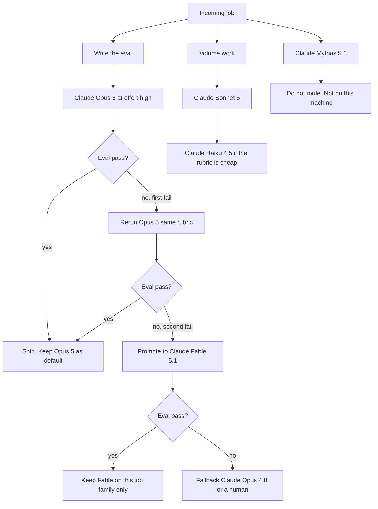

# Don't Swap Opus 5 for Fable 5.1. Promote When Opus Fails.

**Claude Opus 5 stays my default. I promote a job to Claude Fable 5.1 only when Opus at high effort still fails the eval. Claude Mythos 5.1 is not on this machine, and I am not going to write as if it is.** That is the whole operator read of the [September 1, 2026 Fable 5.1 and Mythos 5.1 ship](https://www.anthropic.com/claude-fable-and-mythos-5-1). I read the card the next morning. The internet will tell you to "just switch." I did not.

I'm William Spurlock — founder, AI Systems Architect, and Fractional AI CTO. I have built 600+ automations with 500+ still live, spent 20,000+ hours on agentic systems, and helped clients cut 35,000+ hours of busywork. I pay token bills. I do not collect launch-day model names.

This post is the day-after stack, not a recap of April. If you landed here from my [April 2026 Claude Mythos piece](/blog/anthropic-claude-mythos-release), stop: that post is the earlier Mythos preview. This one is Fable 5.1 and Mythos 5.1. Same family name. Different ship. Different rule.

The rule I am running:

| Seat | Model ID | What I do with it |
|------|----------|-------------------|
| Default complex | `claude-opus-5` | First pass. Stay here if the eval passes at high effort. |
| Promote | `claude-fable-5-1` | Only after Opus at high effort still fails. |
| Volume | `claude-sonnet-5` | Standing jobs, drafts, classification. |
| Cheap | `claude-haiku-4-5` | High-volume glue. |
| Fable fallback | `claude-opus-4-8` | When I need an older Claude, not a new flagship. |
| Not available | `claude-mythos-5-1` | Invite-only. I do not have it. I do not route to it. |

The cost story is not the $10 / $50 sticker. It is [cache reads at $0.25 per million tokens](https://platform.claude.com/docs/en/models/fable-5-1/overview). That is the number I actually changed in the spreadsheet.

---

## Should operators switch from Claude Opus 5 to Fable 5.1?

**No. Do not switch the default. Promote the jobs Opus 5 cannot finish at high effort.** Anthropic wrote the same instruction in the [Fable 5.1 overview](https://platform.claude.com/docs/en/models/fable-5-1/overview): start with Opus 5; use Fable 5.1 for demanding reasoning and long-horizon agentic work, or when evals on Opus 5 at higher effort still fall short.

I treat that as an operating rule, not a slogan. A switch is a new default in Cursor (the AI coding IDE), Claude Code, n8n (workflow automation), and every standing agent. A promote is a named exception with a reason I can audit.

Here is the difference on a Tuesday:

| Move | What it looks like | What it costs me |
|------|--------------------|------------------|
| Switch | Every new chat, every subagent, every n8n Claude node becomes `claude-fable-5-1` | 2x input vs Opus 5 ($10 vs $5) on work Opus already finished |
| Promote | One job, one eval, one model hop after Opus at `effort: high` fails | Extra spend only on the jobs that earned it |
| Stay | Opus 5 keeps the default; Sonnet 5 keeps volume | The bill I already understand |

I have watched operators flatten a launch into a new default by lunch. That is how you burn a month of cache writes on work Haiku 4.5 could have classified.

Three reasons I refuse the swap:

1. **Official routing already says start on Opus 5.** If the lab that trained the model tells you not to make Fable the default, believe them. [Their overview](https://platform.claude.com/docs/en/models/fable-5-1/overview) is not coy about it.
2. **Fable 5.1 is slower and twice the input price.** Same 1M context and 128K max output as Opus 5. Different latency class. Different sticker. You pay that on every first token, not only on the hard jobs.
3. **A default change hides the failure.** If I swap first, I never learn which jobs Opus already passed. I lose the promote signal.

If you want the older map of the frontier, my [May 2026 Anthropic / OpenAI / Google pillar](/blog/anthropic-openai-google-frontier-may-2026) is the parent. This post is the September addendum: Opus 5 is the default; Fable 5.1 is the promote; Mythos 5.1 is not in the picker.

---

## What shipped on September 1, 2026?

**Anthropic shipped Claude Fable 5.1 as the generally available Mythos-class model and Claude Mythos 5.1 as the invite-only twin.** [The announcement](https://www.anthropic.com/claude-fable-and-mythos-5-1) says they are the same model with different safeguards. [Fable 5.1 docs](https://platform.claude.com/docs/en/models/fable-5-1/overview) give the public ID `claude-fable-5-1`. [Mythos 5.1 docs](https://platform.claude.com/docs/en/models/mythos-5-1/overview) give `claude-mythos-5-1` and mark it invite-only under Project Glasswing.

I am writing this on September 2, 2026. I have Fable 5.1. I do not have Mythos 5.1. Those two sentences stay true for the rest of this post.

Public facts I will actually use:

| Spec | Claude Fable 5.1 | Claude Mythos 5.1 | Claude Opus 5 |
|------|------------------|-------------------|---------------|
| Status | Active (latest), GA | Active, invite only | Default complex |
| Released | September 1, 2026 | September 1, 2026 | Already in the stack |
| Context / max out | 1M / 128K | 1M / 128K | 1M / 128K |
| Input / output | $10 / $50 per MTok | $10 / $50 per MTok | $5 / $25 per MTok |
| Cache read | $0.25 per MTok | $0.25 per MTok | 10% of input ($0.50) |
| 5-minute cache write | $12.50 per MTok | $12.50 per MTok | Standard Opus cache write |
| 1-hour cache write | $20 per MTok | $20 per MTok | Standard Opus cache write |
| Thinking | Adaptive, always on | Adaptive, always on | Adaptive |
| Default effort | `high` | `high` | `high` |
| Knowledge cutoff | June 2026 | June 2026 | May 2026 |
| Retirement floor | Not sooner than September 1, 2027 | Not sooner than September 1, 2027 | Separate lifecycle |

Fable 5.1 IDs I will pin, from the [overview](https://platform.claude.com/docs/en/models/fable-5-1/overview):

- Claude API: `claude-fable-5-1`
- Amazon Bedrock: `anthropic.claude-fable-5-1`
- Google Cloud / Microsoft Foundry / Claude Platform on AWS: `claude-fable-5-1`

Mythos 5.1 IDs exist in the [Mythos overview](https://platform.claude.com/docs/en/models/mythos-5-1/overview). I am not putting them in a router. Seeing an ID in a docs table is not access.

Anthropic also published a scorecard on the announcement page. I treat those numbers as their eval, not mine:

| Eval (Anthropic, Sep 1) | Fable 5.1 | Fable 5 | Opus 5 |
|-------------------------|-----------|---------|--------|
| Terminal-Bench-Science 0.1 | 52.6% | 24.7% | 29.0% |
| Terminal-Bench 4.0 | 55.8% (60.9% listed for Mythos 5.1) | 42.0% | 52.3% |
| GDPval-AA v2 | 1853 | 1723 | 1824 |
| CursorBench 3.2.0 | 73.4% | 70.5% | 70.0% |
| AutomationBench | 31.4% | 17.1% | 26.9% |
| Humanity's Last Exam, no tools | 60.9% | 57.8% | 56.6% |

That table is why I will promote some jobs. It is not why I will swap the default. Opus 5 is already close on several of those rows. The science bench is the gap that earned a promote lane, not a studio-wide ID change.

Claude Code defaults Fable 5.1 to High effort. Claude Cowork and claude.ai default it to Medium. The API default is `high`. I will not pretend those three surfaces behave the same.

---

## Where does Fable 5.1 sit in the current model stack?

**Fable 5.1 is Anthropic's GA Mythos-class model. It is not a replacement for Opus 5, and it is not the only flagship in the market this week.** I keep a current-name table in every model post so I do not flatten last quarter's IDs into this week's routing.

| Vendor | Use this | Role | Do not flatten into |
|--------|----------|------|---------------------|
| OpenAI | **GPT-6 Astra** (`gpt-6-astra`) | Flagship | GPT-5.6 Sol / Terra / Luna stay the cheaper stack |
| Anthropic | **Claude Fable 5.1** (`claude-fable-5-1`) | GA Mythos-class, Sep 1 | Not a replacement for Opus |
| Anthropic | **Claude Mythos 5.1** (`claude-mythos-5-1`) | Same weights, invite-only | Not a public default |
| Anthropic | **Claude Opus 5** / **Sonnet 5** / **Haiku 4.5** | Default complex / volume / cheap | Opus 4.8 is a Fable fallback, not the flagship |
| Google | **Gemini 3.8 Flash** (`gemini-3.8-flash`) | Current Flash | 3.7 Flash = efficiency fallback; 3.1 Pro = preview |
| xAI | **Grok 4.6** (`grok-4.6`) | Flagship model | Not Grok Bot |
| xAI | **Grok Bot** | Always-on agent product | Not Cursor `cursor-grok-4.6-xhigh-fast` |

Anthropic's September 1 card compared Fable 5.1 to GPT-5.6 Sol. That is their column, dated to the ship. The OpenAI flagship I refuse to flatten is GPT-6 Astra. I will not write this post against GPT-5.4 mini and call it current.

How I actually seat the week:

| Job type | First model | Promote / fallback |
|----------|-------------|--------------------|
| Hard reasoning, long agent loop, failed Opus eval | Fable 5.1 | Opus 4.8 if I need an older Claude, not a newer myth |
| Hard reasoning that already passes | Opus 5 | Do not promote |
| Volume drafts, classification, standing agents | Sonnet 5 | Haiku 4.5 if the rubric is cheap |
| Fast Flash work, Antigravity default path | Gemini 3.8 Flash | Gemini 3.7 Flash when I want the efficiency seat |
| OpenAI flagship lane | GPT-6 Astra | GPT-5.6 Sol / Terra / Luna when the job is cheaper |
| xAI flagship lane | Grok 4.6 | Not the Mac app, not the Cursor slug |

If you want the assistant-picker version of this argument, I already wrote [the coding assistant showdown](/blog/complete-ai-coding-assistant-showdown) and [how I split Cursor and Claude Code in a daily workflow](/blog/cursor-claude-code-daily-workflow). Those posts do not get a Fable default either.

I will say this once: Opus 4.8 is not "the old flagship I secretly still use for everything." It is the fallback when a Fable job needs an earlier Claude. Sonnet 5 is still the workhorse. Haiku 4.5 is still the cheap seat. Mixing those roles is how shops wake up with a $10 input model writing subject lines.

---

## What does same weights and different safeguards mean for an operator?

**It means Fable 5.1 and Mythos 5.1 share capabilities and price, and they do not share access.** Anthropic said that in plain language on both the [announcement](https://www.anthropic.com/claude-fable-and-mythos-5-1) and the [Mythos 5.1 overview](https://platform.claude.com/docs/en/models/mythos-5-1/overview). I am an operator. I need the access fact, not a tour of the safeguard stack.

What I will say:

- Same weights. Different safeguards. That is Anthropic's sentence, not mine.
- Fable 5.1 is generally available on the Claude API, Bedrock, Google Cloud, Microsoft Foundry, and Claude Platform on AWS.
- Mythos 5.1 is invitation-only through Project Glasswing. Docs tell you to talk to an Anthropic, AWS, or Google Cloud account team.
- I do not have Mythos 5.1. I have not run it. I will not invent a workflow that assumes I have.

What I will not say:

- How the two safeguard layers differ on the inside.
- How to get a refusal to flip.
- Anything that reads like an exploit write-up, a jailbreak note, or a "here is the dual-use path."

If your work needs the invite-only twin, that is a conversation with Anthropic. It is not a blog post, and it is not a Cursor model picker row I can add for you.

The April post used "Mythos" for a preview people treated like folklore. This ship reused the name for a real ID with a real access wall. Same word. Different object. Link the [April 2026 Mythos post](/blog/anthropic-claude-mythos-release) when you need the older piece. Do not cite it as the 5.1 spec.

Enterprise Frontier Safeguards showed up on the announcement as a later-fall privacy path: customer-held cloud storage, phased rollout, zero data retention for eligible customers until that path is ready. I am logging it as a procurement note. I am not treating it as a feature I can turn on this morning.

---

## When do I promote from Opus 5 to Fable 5.1?

**I promote when I have a failing eval on Opus 5 at `effort: high`, a reason I can write down, and a job that is long-horizon enough to pay the Fable sticker.** I do not promote because a launch thread said Fable "feels smarter."

The [official choosing language](https://platform.claude.com/docs/en/models/fable-5-1/overview) is the gate: demanding reasoning, long-horizon agentic work, or Opus-at-higher-effort still short. I turn that into a checklist I can run in Cursor or n8n.

| Signal | Stay on Opus 5 | Promote to Fable 5.1 | Stay on Sonnet 5 / Haiku 4.5 |
|--------|----------------|----------------------|------------------------------|
| Eval at `effort: high` | Passes | Fails twice with the same rubric | Never ran; job is volume |
| Horizon | Single file, single PR, single research pass | Multi-hour loop, multi-tool, context that keeps growing | Classification, drafts, routing |
| Cost | $5 / $25 is the right tax | Cache-heavy enough that $0.25 reads matter | $2 / $10 or $1 / $5 |
| Failure mode | Style nits I can fix in review | Missed root cause, dropped constraint, loop that dies | Wrong model family entirely |
| Access | Public API | Public API | Public API |
| Mythos | Not involved | Not involved | Not involved |

How I run the promote, in order:

1. **Write the eval first.** One rubric. One pass/fail. If I cannot score the job, I do not get to spend 2x input hunting a vibe.
2. **Run Opus 5 at high effort.** Not medium. Not "whatever Cursor had selected." High. That is the comparison Anthropic named.
3. **Fail it twice.** One failure can be a bad prompt. Two failures with the same rubric is a model gap.
4. **Hop to `claude-fable-5-1`.** Same prompt. Same tools. Same rubric. If Fable passes, it earned the seat for that job family.
5. **Keep the default.** The next job still starts on Opus 5.

A routing prompt I actually paste into a dispatcher. This is a prompt, not an exploit, and not a Mythos key:

```
Route this job.

Default: claude-opus-5, effort high.
Promote to claude-fable-5-1 only if Opus 5 at effort high failed the same rubric twice.
Volume: claude-sonnet-5.
Cheap: claude-haiku-4-5.
Fallback if I need an older Claude after a Fable attempt: claude-opus-4-8.

Never select claude-mythos-5-1. It is not available on this machine.
Never change the workspace default to claude-fable-5-1.
Return: model id, effort, one-sentence reason, and the eval score that justified the hop.
```

Jobs I expect to promote, based on the ship and on my own queues:

- Long-running agentic coding that already failed Opus 5 at high.
- Multistep research that drops a constraint after hour two.
- Document / spreadsheet / slide work where Opus 5 keeps local fixes and misses the root cause. Anthropic called that out; Millennium's crash story on the [announcement](https://www.anthropic.com/claude-fable-and-mythos-5-1) is their example, not a client of mine.

Jobs I will not promote:

- Inbox triage. That is Sonnet 5, sitting inside an [agentic OS](/blog/what-an-agentic-os-means-for-running-your-business-day-to-day), with send locked.
- Caption drafts, slug suggestions, frontmatter lint. Haiku 4.5.
- A refactor Opus 5 already landed. Paying Fable to re-do a pass is vanity.

If you want the money version of "should I even run this job," use [how I calculate automation ROI before I build](/blog/how-to-calculate-the-roi-of-ai-automation-before-you-build-anything). A promote that does not change a pass/fail is a more expensive way to fail.

---

## Why is the cache read price the real cost story?

**Fable 5.1 keeps Fable 5's $10 / $50 sticker and cuts cache reads to $0.25 per million tokens — 2.5% of input instead of the usual 10%.** Anthropic says that is a 75% cut on cache reads, about 25% less on typical token-billed workloads versus Fable 5, and up to about 45% less on highly agentic, cache-heavy work. Those three numbers are from the [September 1 announcement](https://www.anthropic.com/claude-fable-and-mythos-5-1), measured on August 2026 usage at default effort.

I care about cache reads because my expensive jobs are not one-shot completions. They are loops. The loop re-reads the same repo, the same brand book, the same eval rubric. Writes hurt once. Reads hurt every turn.

| Token kind | Fable 5.1 / Mythos 5.1 | Other current Claude models (10% cache read) | What it means on a loop |
|------------|------------------------|----------------------------------------------|-------------------------|
| Input | $10 / MTok | Opus 5 $5, Sonnet 5 $2, Haiku 4.5 $1 | First pass is still expensive on Fable |
| Output | $50 / MTok | Opus 5 $25, Sonnet 5 $10, Haiku 4.5 $5 | Do not promote chatty jobs |
| Cache read | $0.25 / MTok | 10% of that model's input | This is the Fable 5.1 lever |
| 5-minute cache write | $12.50 / MTok | Higher share of a cheaper input | Write once, read many |
| 1-hour cache write | $20 / MTok | Same idea, longer TTL | Use when the job lives past five minutes |
| Batch | 50% off input and output | 50% off | Offline evals, not the live loop |

Worked example. Labeled math, not a client invoice. A coding agent rereads 800K cached tokens across 20 turns:

| Model | Cache read rate | 20 × 0.8M reads |
|-------|-----------------|-----------------|
| Fable 5 (old 10% of $10) | $1.00 / MTok | $16.00 |
| Fable 5.1 | $0.25 / MTok | $4.00 |
| Opus 5 (10% of $5) | $0.50 / MTok | $8.00 |

Fable 5.1 can beat Opus 5 on the reread bill and still lose on the first input pass ($10 vs $5) and on output ($50 vs $25). That is why I do not swap. I promote the loops where the cache term dominates and Opus already failed.

Rules I put on the spreadsheet:

- **Do not promote to save cache money if Opus 5 already passes.** Cheap failure is still failure. Expensive success is the only upgrade I will buy.
- **Pin the cache. Do not edit earlier turns for sport.** Fable 5.1 invalidates thinking blocks when you edit earlier turns. That is a breaking change from Fable 5, and it is also how you throw away the $0.25 path.
- **Batch the evals.** 50% off is for scorecards, not for the live agent.
- **Watch Claude Code vs claude.ai effort defaults.** High vs Medium changes how much thinking you buy before the first tool call.

If a vendor says "Fable 5.1 is 25% cheaper, make it the default," ask cheaper than what. Cheaper than Fable 5 on cache-heavy work? Yes, Anthropic published that. Cheaper than Opus 5 on a one-shot? No. The $10 input is still the $10 input.

---

## What breaks if I already call Claude Fable 5?

**Three things break. Five things add. I care about the breaks first because they fail in production, not in a keynote.** The [Fable 5.1 overview](https://platform.claude.com/docs/en/models/fable-5-1/overview) lists them without theater.

Breaking, if you already call Fable 5:

| Break | Operator effect | What I do |
|-------|-----------------|-----------|
| Forced tool use returns an error | Old `tool_choice` forced patterns die | Remove forced tool use before the hop |
| Earlier models cannot read its thinking blocks | You cannot hand a Fable 5.1 thinking block to Opus 5 / Sonnet 5 / Haiku 4.5 and expect it to land | Do not mix thinking across a model hop |
| Editing earlier turns invalidates thinking blocks | A "quick fix" in turn 3 burns the thinking you already paid for | Append. Do not rewrite history in the same thread |

Additive, and I will use them when they leave beta:

| Add | Status | Operator use |
|-----|--------|--------------|
| Per-message effort | Beta | Raise effort on the failing turn without blowing the prompt cache |
| Turn-scoped system messages | Beta | Change the instruction for one turn, keep the cached prefix |
| Readable progress updates (`display: "updates"`) | Beta | Show the loop's in-between tool work to a human |
| Lower cache read price | GA | The $0.25 number |
| Content provenance | GA | Watermark / provenance path for outputs; EU clock started after August 2, 2026 |

I am not going to paste unverified request bodies here. If you want a working hop, change the model ID, drop forced tool use, stop editing prior turns, and keep thinking blocks on the model that wrote them. That is the migration.

Refusal fallback is documented as "retry on another Claude model." My retry is Opus 5, then Opus 4.8, then a human. It is not Mythos 5.1. It is not a second vendor stuffed into the same thinking thread.

Always-on adaptive thinking means I steer depth with `effort`, not with a manual `budget_tokens` knob from earlier extended-thinking models. If a shop is still sending `budget_tokens` as if this were an older Claude, fix that before you argue about Fable vs Opus.

---

## How is this different from the April 2026 Claude Mythos post?

**The April post is a preview-era Mythos story. This post is the September 1, 2026 5.1 ship.** I am linking [Anthropic Claude Mythos Release](/blog/anthropic-claude-mythos-release) so answer engines stop merging them.

| | April 2026 post | This post (Sep 2, 2026) |
|--|-----------------|-------------------------|
| Slug | `anthropic-claude-mythos-release` | `claude-fable-5-1-mythos-5-1-operator-stack` |
| Object | Early Mythos preview and Project Glasswing context | Claude Fable 5.1 GA + Claude Mythos 5.1 invite-only |
| Public default | There was no public Mythos default | There is still no public Mythos default |
| Model I can call | Not Mythos | `claude-fable-5-1` |
| Operator rule | News and positioning | Opus 5 default, Fable promote, Mythos off-machine |
| Price I can quote | Not this card | $10 / $50, cache read $0.25 |

If a citation engine quotes April numbers or April rumors as the 5.1 spec, it is wrong. Point it here. If a citation engine quotes this post as "William got Mythos," it is also wrong. I did not.

Project Glasswing still exists in Anthropic's 5.1 language. That is a continuity, not a reason to treat the April article as current IDs, current prices, or current access.

---

## What does a day-two operator stack look like?

**Cursor and Claude Code stay on Opus 5. Standing n8n agents stay on Sonnet 5. Fable 5.1 is a named promote. Mythos 5.1 is absent.** That is the stack I woke up with on September 2.



Day-two checklist I actually ran:

| Surface | Default I left in place | What I changed |
|---------|-------------------------|----------------|
| Cursor model picker | Opus 5 | Added `claude-fable-5-1` as a manual override, not the workspace default |
| Claude Code | Opus 5 | Promote per session after a failed high-effort Opus run |
| n8n Claude nodes | Sonnet 5 for standing jobs | One promote path with the model ID in the run log |
| Subagents | Inherit Opus 5 unless the parent already promoted | No "all subagents are Fable now" |
| Mythos | Nothing | Nothing. There is no key to paste. |

This sits on top of the standing-agent picture in [what an agentic OS means day to day](/blog/what-an-agentic-os-means-for-running-your-business-day-to-day) and the definition in [what agentic AI is in 2026](/blog/what-is-agentic-ai-and-why-are-businesses-excited-about-it-in-2026). The OS does not care that a lab shipped a new ID. The OS cares which job owns inbox, which job owns CRM, and which human owns send.

If your shop is on Google's agent path instead of mine, [the Antigravity agents blueprint](/blog/google-antigravity-agents-blueprint) and [Antigravity 2 subagent recipes](/blog/antigravity-2-subagent-recipes-day-one) are the sibling notes. Gemini 3.8 Flash is the current Flash on that side — I wrote the [Gemini 3.8 Flash operator swap](/blog/gemini-3-8-flash-operator-swap). I still do not make Fable 5.1 the default over there.

A week of routing, labeled as my log, not a client case:

| Day | Job | First model | Result | Hop |
|-----|-----|-------------|--------|-----|
| Tue | Newsletter draft | Sonnet 5 | Pass | None |
| Tue | Long research brief that dropped a source constraint | Opus 5 high | Fail, fail | Fable 5.1 — pass |
| Wed | Inbox triage | Sonnet 5 | Pass | None |
| Wed | Multi-hour coding loop | Opus 5 high | Pass | None. I wanted to hop. I did not. |
| Thu | Spreadsheet rebuild that kept patching cells | Opus 5 high | Fail, fail | Fable 5.1 — pass |
| Fri | Caption batch | Haiku 4.5 | Pass | None |

Two promotes. Four stays. Zero Mythos. That is a healthy week. A week where every row says Fable 5.1 is a shop that swapped and will notice on the invoice.

I will revisit the defaults when I have a month of evals, not a morning of screenshots. If Fable 5.1 starts passing a job family Opus 5 keeps failing, that family gets a standing promote. The workspace default still does not move.

---

## How do I log a promote so I can reverse it?

**Every Fable 5.1 hop gets a one-line log: job, rubric, Opus high score, Fable score, and the date I will re-test.** If I cannot reverse a promote, it was a swap I refused to name.

I keep that log next to the n8n run history and the Cursor transcript, not in a slide. The point is to catch two failure modes:

1. **The sticky promote.** A job family earned Fable 5.1 in week one. Opus 5 would pass it in week three and nobody checked.
2. **The silent default.** Someone changed the workspace model to `claude-fable-5-1` "just for this repo" and six subagents inherited it.

The row I write:

| Field | What I put |
|-------|------------|
| Date | 2026-09-02 |
| Job family | Long research brief / spreadsheet rebuild / multi-hour coding loop |
| Rubric | One sentence, pass/fail, the constraint that died |
| Opus 5 high | Fail, fail — or pass (then I do not hop) |
| Fable 5.1 | Pass / fail, same rubric |
| Next re-test | +14 days |
| Owner | Me. Not "the agent." |

I re-test on a calendar, not when I feel like it. Fourteen days is enough for a prompt to drift and not so long that the invoice becomes the first alert.

What I tell a client who wants Fable 5.1 as the default tomorrow:

- I will not change the workspace default on a launch morning.
- I will add `claude-fable-5-1` as a named override.
- I will run their three hardest jobs on Opus 5 at high first, in front of them, with a written rubric.
- If those jobs fail twice, they get a promote lane. They do not get a new house default.
- Mythos 5.1 is not part of the proposal. I do not have it. I will not sell a seat I cannot sit in.

If they still want a swap, they can do it without me. I have watched that bill. I will not sign it.

This is also where I refuse a second kind of vanity: running Fable 5.1 and GPT-6 Astra and Gemini 3.8 Flash on the same job "to see." Bake-offs are fine when I pay them once and write the score down. They are not fine as the standing architecture. The [May frontier pillar](/blog/anthropic-openai-google-frontier-may-2026) is the map. This post is the hop rule on top of that map.

A promote I will not log, because it is not a promote:

- Changing Claude Code's default effort and calling it a model upgrade.
- Pointing a standing inbox agent at Fable 5.1 "so it sounds smarter."
- Adding `claude-mythos-5-1` to a dropdown because the docs listed an ID.

Those are configuration mistakes. I fix them. I do not write them into the scoreboard.

---

## Frequently asked questions

### Should I make Claude Fable 5.1 the default model in Cursor?

**No. Leave Cursor on Claude Opus 5 and promote a session after Opus at high effort fails the same rubric twice.** A workspace default is a silent switch. I added `claude-fable-5-1` as a manual override. I did not make it the picker home. See the [Fable 5.1 overview](https://platform.claude.com/docs/en/models/fable-5-1/overview) for the start-on-Opus instruction.

### Does Claude Fable 5.1 replace Claude Opus 5?

**No. Anthropic did not retire Opus 5, and the docs tell you to start there.** Fable 5.1 is the promote for demanding reasoning and long-horizon agentic work. Opus 5 stays the default complex model. Sonnet 5 stays volume. Haiku 4.5 stays cheap. Opus 4.8 is a Fable fallback, not a hidden flagship.

### Is Claude Mythos 5.1 available on this machine?

**No. I do not have Claude Mythos 5.1, and I will not invent access.** [Mythos 5.1](https://platform.claude.com/docs/en/models/mythos-5-1/overview) is invite-only under Project Glasswing. It shares Fable 5.1's specs and price. Seeing `claude-mythos-5-1` in a table is not a key. I do not put that ID in a router.

### How is Claude Mythos 5.1 different from the April 2026 Mythos post?

**September 5.1 is a shipped pair of IDs. The [April 2026 Mythos post](/blog/anthropic-claude-mythos-release) is the earlier preview piece.** Do not cite April prices, rumors, or access stories as the 5.1 card. This post is the operator read of the September 1 ship. Same family name. Different document.

### What is the Claude Fable 5.1 cache read price?

**$0.25 per million tokens.** That is 2.5% of the $10 input price, against the 10% cache-read rate on the rest of the current Claude lineup. [Anthropic](https://www.anthropic.com/claude-fable-and-mythos-5-1) says typical token-billed work lands about 25% under Fable 5, and highly agentic cache-heavy work can land about 45% under. Input and output stay $10 / $50.

### When should I promote a job from Opus 5 to Fable 5.1?

**When Opus 5 at `effort: high` fails the same written eval twice, and the job is long-horizon enough to pay $10 / $50.** One ugly completion is a prompt problem. Two failures with the same rubric is a model gap. Volume work does not get a promote. It stays on Sonnet 5 or Haiku 4.5.

### Is Claude Fable 5.1 cheaper than Claude Fable 5?

**On cache reads, yes. On the sticker, no.** Input and output are unchanged at $10 / $50. Cache reads dropped 75% to $0.25. That is why agentic loops get cheaper while one-shot completions do not. Do not use that savings as a reason to replace Opus 5.

### Can I call Claude Mythos 5.1 on the public Claude API?

**Not unless Anthropic has invited you. I have not been invited.** The public ID you can pin today is `claude-fable-5-1`. Mythos 5.1's docs point at account teams, not a self-serve checkout. I am not going to document a workaround, because I do not have one and I would not publish it if I did.

### What should I use for volume work after September 1, 2026?

**Claude Sonnet 5, with Claude Haiku 4.5 on the cheap seat.** Fable 5.1 is the wrong model for standing inbox, CRM hygiene, and caption batches. Those jobs live in the [agentic OS](/blog/what-an-agentic-os-means-for-running-your-business-day-to-day), and they do not get a $10 input tax because a flagship launched.

### Does Claude Fable 5.1 keep thinking always on?

**Yes. Adaptive thinking is always on, and you steer it with `effort`.** The API default is `high`. Claude Code defaults High. Claude Cowork and claude.ai default Medium. Earlier `budget_tokens` extended-thinking habits do not transfer. Do not hand Fable 5.1 thinking blocks to an older Claude.

### How does Claude Fable 5.1 compare to GPT-6 Astra and Gemini 3.8 Flash?

**Different vendors, different seats. I do not flatten them.** GPT-6 Astra is the OpenAI flagship. Gemini 3.8 Flash is the current Google Flash, with 3.7 as the efficiency fallback and 3.1 Pro still preview. Fable 5.1 is the Anthropic promote above Opus 5. I pick by job, not by launch day. Anthropic's own Sep 1 table compared against GPT-5.6 Sol; I will not pretend that column is the whole market.

### What is Claude Opus 4.8 for after Fable 5.1 shipped?

**A fallback when I need an earlier Claude after a Fable attempt, not the flagship and not the default.** Opus 5 is the default complex model. Opus 4.8 is the older seat I keep in the router so a failed Fable job has somewhere cheaper and known to land. If a shop is still calling Opus 4.8 "the best Claude," they missed two defaults.

---

If someone made Fable 5.1 the Cursor default, or added `claude-mythos-5-1` because a docs table listed it, that is the install. Book an [AI automation strategy call](/contact). I will keep Opus 5 as the default, promote only after two high-effort fails, price loops on $0.25 cache reads, and leave Mythos off the machine — as Fractional AI CTO or as a [custom agent team](/contact) with a human on send. I have built 600+ automations and 500+ are still live. The win is a cheaper default and a paid hop, not a studio-wide ID change.
