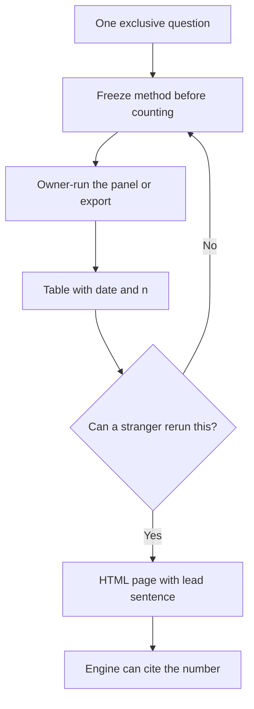

# Does Original Research Help You Get Cited by AI?

**Yes — original research helps you get cited by AI when you publish a dated measurement an answer engine cannot copy from a competitor, a press release, or last year's Ahrefs recap.** Restating a public industry stat is not research. It is a reprint. Engines already have the reprint. They need a number that only exists because you ran the panel, counted the tickets, or timed the shop.

I am William Spurlock — Founder, AI Systems Architect, and Fractional AI CTO. I have built 600+ automations with 500+ live, spent 20,000+ hours on agentic systems, and deleted 35,000+ hours of client busywork. SEO certified since 2021; the work now sits under AEO, AIO, and GEO. Monday, September 14, 2026, I am still watching sites lose citations because they published adjectives where a table should be.

This spoke owns one job: **how to produce citeable primary data.** Owner-run prompt panels. Dated tables. Unique measurements. The reason engines prefer a number they can only get from you.

It does not own how to read a vendor PDF. That is the September 9 [believable AI visibility case study](/blog/what-a-believable-ai-visibility-case-study-looks-like-and-what-to-ignore) spoke. If someone mailed you a "+400% ChatGPT traffic" deck, score their evidence there. This page is how you make a measurement they would have to cite *you* for.

It also does not own the weekly AI Overview fraction. That lives on the [share-of-voice benchmark](/blog/ai-overview-share-of-voice-a-benchmark-small-teams-can-track-weekly). Keep the scorecard in the sheet if you want. Publish a table on a public URL if you want an engine to quote it.

The [content strategy pillar](/blog/the-ai-visibility-content-strategy-writing-for-humans-and-answer-engines) already said original research helps when it is specific, dated, and sitting in HTML — not buried in a PDF. This post is the production manual behind that sentence.

---

## Does original research help you get cited by AI?

**It helps when the finding is exclusive, dated, extractable, and honest about n — it does not help when you remix a public study and call the remix "our research."** Answer engines cite sources that reduce their uncertainty. A unique measurement does that. A rewritten SparkToro paragraph does not.

I treat "original research" as a production label, not a vibe. If a second operator in your category could publish the same number without talking to you, it is not original. If they would have to run your panel, open your tickets, or time your shop, it is.

| Artifact | Original? | Citeable? | Why an engine would skip it |
|---|---|---|---|
| "Studies show AI Overviews cut clicks" with no study name | No | No | The model already has the generic claim |
| Ahrefs or Seer CTR recap, correctly linked | No — you are the reporter | Soft | Useful context; not *your* number |
| "Our clients see 3x citations" with no n, no dates, no engine | Invented | No | Unsourced precision reads as sales copy |
| Owner-run panel, 2026-09-14, 15 prompts, ChatGPT search + Perplexity + Google AI Overviews, named / cited / recommended counts | Yes | Yes | The count does not exist until you ran it |
| Last-90-day inbound reason mix from *your* inbox, n and date range on the page | Yes | Yes | A competitor cannot reprint your ticket pile |
| Warranty / callback / size-exchange rate from *your* shop, method in two sentences | Yes | Yes | The model cannot invent your denominator |

The published GEO paper is the receipt I will keep pointing at, not a client lift I invented. [Aggarwal et al., *GEO: Generative Engine Optimization*](https://arxiv.org/abs/2311.09735) (arXiv November 17, 2023; [KDD 2024](https://dl.acm.org/doi/10.1145/3637528.3671900)) ran GEO-bench — 10,000 queries — and found **Cite Sources, Quotation Addition, and Statistics Addition** lifted position-adjusted visibility by **30–40%** relative to the unoptimized page. On Perplexity.ai they reported visibility gains **up to 37%**. Those figures are share-of-answer visibility, not traffic, not revenue, and not a promise that your HVAC page will move 40% next month.

Read that finding the way a producer should: **even adding sourced statistics to an existing page helped.** Exclusive measurements go further for a boring reason. Once ten blogs have copied the same Ahrefs sentence, the engine can pick any of them. Once only you have the 2026-09-14 panel table, the engine has one URL.

Google's [helpful, people-first content](https://developers.google.com/search/docs/fundamentals/creating-helpful-content) guidance still asks for first-hand experience and original information. Answer engines add a second filter: can this paragraph stand alone as a quote? A dated table with a method sentence can. A thought-leadership essay about "the importance of data" cannot.

Three tests I run before I let a page wear the word research:

1. **Exclusivity.** Would a competitor have to repeat *your* work to reprint the number?
2. **Date and n.** Can a stranger write the when and the sample size without emailing you?
3. **Extractable sentence.** Is there a lead line an engine can lift without rewriting your adjectives?

Fail one and you have a blog post. Pass all three and you have a source.

I am opinionated here. Most "original research" on AI visibility sites is a literature review with a new H1. Literature reviews get cited when the author is already the canonical explainer. You are probably not that author yet. Become the canonical *measurer* in a narrow slice instead.

---

## Why do answer engines prefer a number they can only get from you?

**Because a unique number is a retrieval key — the model cannot substitute a rival page without changing the answer.** Shared stats are commodities. Exclusive stats are addresses.

Think about what ChatGPT, Perplexity, Google AI Overviews, Gemini, and Claude are doing when they write a sentence that needs a figure. They retrieve candidate passages. They pick the ones that look specific and attributable. They hedge or omit when every source says the same vague thing.

A commodity stat creates a pile. "AI Overviews reduce clicks" is now a pile. Ahrefs published the dated versions — [April 17, 2025](https://ahrefs.com/blog/ai-overviews-reduce-clicks/) (34.5% lower average CTR for the top page on Overview-present informational keywords) and the [February 4, 2026](https://ahrefs.com/blog/ai-overviews-reduce-clicks-update/) update (58% lower on the later sample). [Seer Interactive's September 2025 CTR update](https://www.seerinteractive.com/insights/aio-impact-on-google-ctr-september-2025-update) and [SparkToro's June 9, 2026](https://sparktoro.com/blog/in-2026-less-than-one-third-of-google-searches-still-send-a-click/) no-click work sit in the same pile. Those pages deserve citations. Your remix of them does not.

An exclusive stat creates a pointer. "On 2026-09-14, a logged-out en-US pass of 15 buyer prompts named Brand X on 4 prompts in ChatGPT search, cited Brand X on 2 prompts in Perplexity, and showed Brand X as a source in 1 Google AI Overview." That sentence has one honest home: the page that published the table.

| What the engine needs | Commodity page | Exclusive page |
|---|---|---|
| A number | Many URLs, same figure | One URL, your figure |
| A date | Often missing or "recently" | ISO date on the table |
| A method | "we analyzed" | Panel size, engine, locale, account state |
| A substitute | Any competitor recap | None — skip you and the number disappears |
| A quote | Adjectives the model already owns | A row it can repeat |

That last row is the whole game. Models already invent "best," "leading," and "trusted." They do not invent your September 14 count unless they hallucinate — and hallucination is exactly what a dated table is there to prevent.

I see three failure modes when operators hear "original research" and then ship the wrong object:

**They reprint the pile.** A 900-word recap of Ahrefs plus a take. Fine as a spoke if you add a method they did not have. Useless as research if the only number on the page already lives on ahrefs.com.

**They invent a lift.** A before/after percentage with no baseline file and no n. I will not mint one here. If you do not have the before, publish the after as a single dated measurement. One honest point beats a fake slope. The September 9 case-study spoke is how a buyer should reject the fake slope when a vendor sends it. This post is how you refuse to become that vendor.

**They hide the number in a PDF.** Engines extract HTML. A gated whitepaper is a brochure with a lock. If the finding cannot sit in a public table, it is not a citation strategy. It is a lead magnet.

The stake is not academic pride. [SparkToro](https://sparktoro.com/blog/in-2026-less-than-one-third-of-google-searches-still-send-a-click/) put US Google no-click at **68.01%** for January–April 2026. If more searches never leave the answer, the remaining prize is being the source inside the answer. Commodity copy competes with every other commodity page. Exclusive measurements compete with silence.

I would rather you publish a 12-row table from your own shop than a 2,000-word essay about why research matters. The essay is what the model already knows how to write.

---

## How do I produce citeable primary data?

**Pick one exclusive question, freeze the method before you count, run the measurement yourself, and write the result as a dated table with n — then stop.** Production is a sequence. It is not a brainstorm.

I use three artifacts. That is the whole kit. If you cannot name which artifact you are making, you are not doing research. You are blogging.

1. **Owner-run prompt panel** — you ask the engines the questions your buyers ask, on a date, in a named state, and you count named / cited / recommended.
2. **Dated operations table** — you count something only your systems know: ticket reasons, callbacks, exchanges, time-to-first-response, SKU defects.
3. **Unique measurement note** — one number, one denominator, one method paragraph, one date. Not a dashboard. A note.

The [measurement pillar](/blog/how-to-measure-ai-visibility-the-metrics-that-actually-matter-in-2026) owns the taxonomy: Share of Model, citation rate, Search Console behavior on Overview queries. Use that vocabulary. Do not invent a fourth "visibility index." This post owns how those counts become a *public* source.

### Step 1 — Write the question the engine cannot answer without you

Bad questions are already answered on the open web.

- "Do AI Overviews reduce clicks?" — Ahrefs and Seer already published this.
- "What is GEO?" — definition pages already exist, including the [content strategy pillar](/blog/the-ai-visibility-content-strategy-writing-for-humans-and-answer-engines).
- "Are we the best roofer in [city]?" — that is a slogan.

Good questions require your files.

- "On this date, on this buyer panel, which engines name us, cite us, or recommend us?"
- "In the last 90 days, what share of inbound tickets were 'we found you in ChatGPT' versus 'Google ad' versus 'repeat customer'?"
- "What is our callback rate on the job type we actually sell, for this date range, with this denominator?"

If you cannot point at a file that would change the number, the question is not a research question.

### Step 2 — Freeze the method before the first count

Write the method while you are still allowed to be honest. After you see an ugly number, you will want to change the rules. That is how fake research gets made.

Freeze these fields:

| Field | What you write | What you do not write |
|---|---|---|
| Question | One sentence | A theme |
| Date range or run date | ISO dates | "Q3" with no days |
| Population | Who or what is in | "customers" with no filter |
| Denominator | The exact count in the bottom of the fraction | A vibe |
| Engine / system | ChatGPT search, Perplexity, Google AI Overviews, Gemini, Claude, or the ops tool | "AI" |
| Account state | Logged out, memory off, locale, device | Silent personalization |
| Exclusion rules | Staff tests, duplicates, voids | "we cleaned the data" |
| Stop rule | One pass, or three days, disclosed | "until it looked right" |

I prefer one honest pass with the n printed. I will accept three dated reruns if you say they are reruns. I will not accept "we ran it until ChatGPT agreed with the homepage."

### Step 3 — Run it yourself

Owner-run means a person at the company executed the method. A vendor can assist. A vendor cannot be the only pair of eyes. If you cannot rerun the panel next Monday, you do not own the research.

For a prompt panel, I sit in a clean profile and I type. Current surfaces I actually open in 2026: ChatGPT search, Perplexity, Google AI Overviews, Google AI Mode, Gemini (Gemini 3.1 Pro when I am in the app), and Claude (Claude Opus 4.8 or Claude Sonnet 5 when I need a second chat engine). I name the product on the row. "The LLM" is not a product.

For an operations table, I export from the system of record — inbox, PSA, Shopify, warranty log — and I count in the sheet. I do not ask a model to "estimate our callback rate." That is how you publish a hallucination with your logo on it.

### Step 4 — Write the result as a table, not a story

The first public artifact is a table. The prose comes after, to explain the table. If you write the story first, you will sand off the misses.

Minimum columns for a prompt-panel publication:

- Run date
- Prompt (verbatim)
- Engine / surface
- Locale and account state
- Named (yes/no)
- Cited (yes/no, plus URL if shown)
- Recommended (yes/no)
- Notes (wrong entity, refused, no sources)

Minimum columns for an operations publication:

- Metric name
- Date range
- n
- Count or rate
- Denominator in words
- Source system
- Exclusions

If a column is empty, the row is not ready. Empty is not "clean design." Empty is a missing fact.

### Step 5 — Stop

One question. One method. One table. Then you publish. A "research hub" with twelve unfinished tabs is how small teams quit.

Here is the sequence I actually keep:

If you want a weekly ritual after that, the [AI Overview share-of-voice spoke](/blog/ai-overview-share-of-voice-a-benchmark-small-teams-can-track-weekly) is the scorecard. Do not merge the scorecard and the published table into one object. The scorecard can stay private. The table has to be crawlable.

---

## What belongs in an owner-run prompt panel and a dated table?

**A prompt panel is a frozen list of buyer questions plus a scoring grid. A dated table is the public extract of that grid — or of an operations count — with the date, n, and method on the same page.** If either object is missing, you have notes. Notes do not get cited.

This is the production spec. It is not a reading guide for someone else's PDF.

### The owner-run prompt panel

I cap a published panel at **12 to 20 prompts**. Fewer than 12 and you are sampling a mood. More than 20 and you will not finish the pass, and an unfinished pass should not be published.

Prompts are buyer language. Not your homepage headline. Not "why we are the best."

Examples of the shape — not a real client list:

- "Who should I hire for [job] in [market]?"
- "Best [category] for [constraint]."
- "[Category] vs [category] for [use case]."
- "Does [specific risk] matter when I pick a [vendor type]?"

Score three outcomes. Do not collapse them.

| Outcome | What you mark | What you do not mark |
|---|---|---|
| **Named** | The brand string appears in the answer | A competitor with a similar name |
| **Cited** | Your URL or a clear source chip | A blue link under a Google AI Overview with no source credit |
| **Recommended** | The engine tells the user to pick you | A mention in a list of "options" with no preference |

Write the environment in the table header every time: date, locale, logged-out or account, memory on or off, model if the product shows one. I write **GPT-5.5** or **GPT-5.4 mini** when ChatGPT shows it, **Claude Opus 4.8** or **Claude Sonnet 5** when Claude shows it, **Gemini 3.1 Pro** or **Gemini 3.5 Flash** when Gemini shows it. If the UI hides the model, write the product name and "model not shown." Do not guess.

Publish the *summary* table on the page. You can keep the ugly screenshot folder in Drive. The engine needs the summary. The folder is how you defend the summary if someone asks.

A summary table that is ready to publish looks like this shape:

| Engine | Prompts run | Named | Cited | Recommended | Run date | State |
|---|---|---|---|---|---|---|
| ChatGPT search | 15 | 4 | 2 | 1 | 2026-09-14 | Logged out, en-US, memory off |
| Perplexity | 15 | 5 | 3 | 1 | 2026-09-14 | Logged out, en-US |
| Google AI Overviews | 15 | 2 | 1 | n/a | 2026-09-14 | Logged out, US, desktop |

Those digits are a **shape**. I am not claiming a client hit 4 / 2 / 1. If your row is 0 / 0 / 0, publish that. Zero is a measurement. Hiding zero is a press release.

### The dated operations table

Prompt panels are not the only primary data. For a lot of shops they are not even the best first artifact. Your ticket pile is.

Pick one operations question a buyer already asks out loud:

- "How often do you come back?"
- "What do people actually call you about?"
- "How fast do you answer?"
- "What fails on the product I am about to buy?"

Then publish a table only you can fill.

| Metric | Date range | n | Result | Denominator | Source |
|---|---|---|---|---|---|
| Inbound reason: "found you in ChatGPT" | 2026-06-01 to 2026-08-31 | 47 tickets | 6 tickets | All non-spam inbound in range | Help desk export |
| Callback within 14 days, install jobs | 2026-06-01 to 2026-08-31 | 112 jobs | 9 jobs | Completed installs, staff tests excluded | PSA |
| Size-exchange rate, SKU family A | 2026-07-01 to 2026-08-31 | 80 orders | 11 orders | Shipped orders in family A | Store admin |

Again: **shape, not a named shop.** Fill it with your export. If you do not have the export, you do not have the research yet. Go get the export. Do not invent the rate so the blog can ship on Monday.

### What never belongs in either object

I keep a refuse list next to the method. If a cell would require one of these, I delete the cell.

- A before/after percentage I do not have a before-file for
- A blended "AI score" that mixes ChatGPT, Perplexity, and Google into one vanity number
- A competitor I did not pre-commit to track
- A model name I did not see in the UI
- A client name I do not have permission to publish
- A revenue or monthly USD figure I will not put my name under
- The words "recently," "significant," and "industry-leading" as substitutes for a date, an n, and a rate

If you want to know whether a *vendor's* table is real, leave this page and use the [case-study reading guide](/blog/what-a-believable-ai-visibility-case-study-looks-like-and-what-to-ignore). Different job. Different questions. Do not mix them on the same afternoon.

---

## How do I publish primary data so a model can extract it?

**Put the number in HTML, lead with a self-contained sentence, keep the method in the next paragraph, and give the table real headers — do not lead with a PDF, a screenshot gallery, or a 40-line throat-clear.** Extraction is a publishing problem. You already did the hard part when you counted.

Google's [AI features documentation](https://developers.google.com/search/docs/appearance/ai-features) is still the adult description of Overviews and AI Mode as surfaces. Those surfaces pull passages. They do not "browse your brand story." If the number is not in the HTML, it is not in the candidate set.

### The page shape I ship

One URL. One primary question. This is the skeleton:

1. **H1 is the question** the buyer or the engine would ask.
2. **First two sentences are the answer**, including the date and the n if they fit.
3. **A table** with the rows. Not a chart you have to describe in alt text because the numbers never appear as text.
4. **A method paragraph** — how you counted, what you excluded, what you will not claim.
5. **A limits paragraph** — sample size, one market, one week, one engine set.
6. **FAQ H3s** for the adjacent questions, each with a bold lead fact.

That is the same skeleton the [content strategy pillar](/blog/the-ai-visibility-content-strategy-writing-for-humans-and-answer-engines) already teaches for citeable pages. Research pages fail when they invert it: 800 words of motivation, then a screenshot, then a CTA.

A lead sentence that is ready to steal:

> **On 2026-09-14, a logged-out en-US owner-run panel of 15 buyer prompts named us on 4 ChatGPT search answers, cited us on 3 Perplexity answers, and credited us as a source in 1 Google AI Overview.**

A lead sentence that will not get stolen:

> "We doubled down on our commitment to thought leadership in the AI era, delivering new insights for brands like yours."

If you caught yourself writing the second one, delete the draft. You do not have a research page yet. You have a newsletter.

### HTML beats PDF. Text beats images of text.

I am blunt about format because I have watched good measurements die in the wrong container.

| Container | Engine can extract? | Use it for |
|---|---|---|
| HTML table on a public URL | Yes | The citation object |
| Numbered list of findings | Yes | A three-bullet digest above the table |
| FAQ H3 with a bold first sentence | Yes | Adjacent questions |
| PNG of a spreadsheet | Weak | Appendix, not the source |
| PDF whitepaper behind email | No | Sales, not citation |
| Notion page, noindex, random subdomain | Coin flip | Working notes |

If you love the PDF, publish the table first. Link the PDF as "full appendix." Never the reverse.

### Method, then humility

The method paragraph is not decoration. It is how you stay out of the invented-lift business.

Write it like this:

- **What you ran.** 15 prompts, three surfaces, one locale.
- **When.** 2026-09-14, 9:00–10:10 a.m. Eastern.
- **State.** Logged out. Memory off. Desktop.
- **What you did not do.** No reruns after a miss. No prompt edits mid-pass. No averaging with a second day unless that day is a second table.
- **What you will not claim.** No traffic lift. No revenue. No "this will transfer to your category."

Humility is citeable. "n=15, one morning, one market" is a sentence a careful model can repeat. "Transformative results across the industry" is a sentence a careful model should ignore.

### Freshness is a new row, not a fake "updated" stamp

Content freshness helps citation when the *measurement* is new, not when you bump a date in the footer. If you rerun the panel on 2026-10-12, add a row or a second table. Keep the September 14 table on the page. That is a time series. That is research. Replacing the old table so the page always looks like a win is how you create a vanished baseline — the thing the September 9 spoke tells buyers to reject.

I review research URLs when the method changes or when a surface changes enough that the old row is no longer comparable. Google AI Overviews and ChatGPT search are not the same object they were in 2024. Name the surface on every new row.

### Internal links that do not steal the primary

This page's primary query is **Does original research help you get cited by AI?** Do not open a second URL that targets the same question. Point measurement how-to at the [metrics pillar](/blog/how-to-measure-ai-visibility-the-metrics-that-actually-matter-in-2026). Point the weekly Google fraction at the [share-of-voice spoke](/blog/ai-overview-share-of-voice-a-benchmark-small-teams-can-track-weekly). Point vendor-PDF scoring at the [case-study spoke](/blog/what-a-believable-ai-visibility-case-study-looks-like-and-what-to-ignore). Point the writing system at the [content strategy pillar](/blog/the-ai-visibility-content-strategy-writing-for-humans-and-answer-engines). Four jobs. Four URLs. One primary each.

---

## Frequently Asked Questions

### What is a citeable piece of content and how do I create one?

**A citeable page gives an answer engine a self-contained factual sentence it can quote with almost no editing.** Create one by opening with the answer, putting the date and the n in that answer or in the next sentence, and pairing it with a table. Adjectives are optional. The table is not.

### How do statistics and data in content affect AI citation rates?

**Sourced, exclusive statistics give the model a reason to pick your URL; unsourced numbers give it a reason to skip you.** [Aggarwal et al. (KDD 2024)](https://dl.acm.org/doi/10.1145/3637528.3671900) already showed Statistics Addition, Cite Sources, and Quotation Addition lifting position-adjusted visibility **30–40%** on GEO-bench. That is visibility inside the generated answer, not a traffic SLA. Attach a study name and a date, or publish *your* measurement. Do not publish a precise percentage with no source.

### Does a ten-customer survey count as original research for AI citation?

**Yes, if you print n=10, the dates, the exact question, and the limits — no, if you inflate it into "customers say."** Small and honest beats large and imaginary. A ten-row table with a method sentence is a source. A "survey of our community" with no n is a slogan. I would rather cite n=10 than a "majority" with no denominator.

### Should I publish the methodology or only the headline number?

**Publish both, on the same URL, with the method directly under the table.** A headline number without a method is how rumor pages get born. A method without a number is a tutorial. Engines quote the pair: the figure, then the constraint that keeps the figure from being misused.

### How often should I rerun an owner-run prompt panel before I publish it?

**Publish the first complete pass, then rerun on a fixed cadence — weekly if this is your scorecard, monthly if this is a public research note.** Do not rerun the same morning until the screenshot looks kind. Disclose the n of passes. The [weekly share-of-voice spoke](/blog/ai-overview-share-of-voice-a-benchmark-small-teams-can-track-weekly) is the ritual for Google AI Overviews. A public research page can update slower. It cannot update "whenever we like the answer."

### Can I cite a vendor study and still have original research?

**You can cite a vendor study as context. You do not get to call the citation original research.** Original starts at the first number you produced. Use the vendor paper the way I use Ahrefs and the GEO paper: dated, linked, scoped. Then put your table underneath. If the page is only their numbers, you are a reporter. That is a fine job. It is a different job.

### Does original research have to be a large sample to get cited by AI?

**No. It has to be exclusive, dated, and extractable.** GEO-bench itself is large because it is a benchmark paper. Your shop is not a benchmark paper. A 15-prompt panel or a 47-ticket export is enough to be the only source for that sentence. Inflating sample size in the prose without inflating it in the file is how you lose the only advantage you had: honesty.

### What if my category has no public benchmark?

**Then you are early, which is the best time to become the source.** Publish the first dated table in the category. Name the method. Keep the n small and visible. Later entrants will reprint you, and some of them will forget the link. That is still a win. The engine learned the number from your URL first.

---

## Bring the measurement. I will help you put it on a page an engine can cite.

If the numbers already live in a sheet and the public site still talks in adjectives, that is the gap. I do not need a fake before/after to start. I need the export, the date you ran it, and the question you actually asked.

I build **AI-visibility-ready pages** for operators who want AIO / AEO / GEO wired into the HTML: question-shaped URLs, tables a model can lift, method sentences that keep the claim honest. If you want a second pair of eyes on whether a measurement is ready to publish — or a page that can hold it — that is the conversation.

Bring the sheet, the run date, and the engine names. I will tell you whether you have research or a recap.

[Send the measurement](/contact)

**William Spurlock** is the founder of a hybrid AI automation and premium web studio, an AI Systems Architect, and a Fractional AI CTO. 600+ automations built, 500+ live. 20,000+ hours on agentic systems. 35,000+ hours of client busywork removed. SEO certified since 2021. He writes from Northern Michigan and works in Eastern time.
