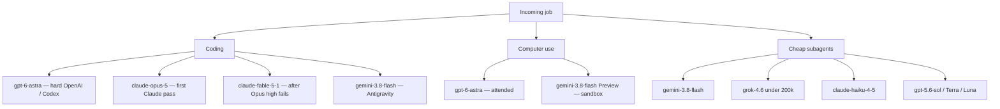

# September 2026 Frontier Routing: Astra, Fable, 3.8 Flash, Grok 4.6.

**I do not pick one frontier model in September 2026. I pick by job: GPT-6 Astra for hard coding and attended computer use, Claude Opus 5 first on Claude routes with Fable 5.1 only after Opus at high effort still fails, Gemini 3.8 Flash for cheap volume and Antigravity, Grok 4.6 under 200k for Grok-native and Cursor subagents.** Always-on ops is Grok Bot — xAI's teammate product, not a model ID — I run one primary that knows the business, then additive specialists.

I'm William Spurlock — founder, AI Systems Architect, and Fractional AI CTO. I've built 600+ automations with 500+ still live, spent 20,000+ hours on agentic systems, and helped clients delete 35,000+ hours of busywork. I pay token bills. I do not collect a weekly religion.

If you want last spring's three-vendor map, I already wrote the [May 2026 frontier comparison](/blog/anthropic-openai-google-frontier-may-2026). That post is history. This one is the board I am running on September 5, after Fable 5.1 on the 1st, 3.8 Flash on the 2nd, Astra on the 3rd, and Grok 4.6 sitting since August 12.

The names so I do not flatten them:

| Vendor | Use this | Role | Do not flatten into |
|--------|----------|------|---------------------|
| OpenAI | **GPT-6 Astra** (`gpt-6-astra`) | Flagship, September 3 | GPT-5.6 Sol / Terra / Luna stay the cheaper stack |
| Anthropic | **Claude Fable 5.1** (`claude-fable-5-1`) | GA Mythos-class, September 1 | Not a replacement for Opus |
| Anthropic | **Claude Mythos 5.1** (`claude-mythos-5-1`) | Same weights, invite-only | Not a public default |
| Anthropic | **Claude Opus 5** / **Sonnet 5** / **Haiku 4.5** | Default complex / volume / cheap | Opus 4.8 is a Fable fallback, not the flagship |
| Google | **Gemini 3.8 Flash** (`gemini-3.8-flash`) | Current Flash, September 2 | 3.7 Flash = efficiency fallback; 3.1 Pro = preview |
| xAI | **Grok 4.6** (`grok-4.6`) | Flagship model, August 12 | Not Grok Bot |
| xAI | **Grok Bot** | Always-on agent product, August 11 | Not Cursor `cursor-grok-4.6-xhigh-fast` |

I will not write "the new GPT" and leave it there. Astra is one seat. Sol still exists. Fable is a promote, not an Opus swap. 3.8 Flash is a Flash swap, not a flagship. Grok 4.6 is a model ID. Those five sentences are the week.

---

## Which frontier model should an operator use in September 2026?

**None of them as a default for every job. The operator pick is a board: coding, computer use, and cheap subagents get model IDs; always-on ops gets a product seat.** If someone asks me "which model" and expects one string, they are shopping a keynote. I am shopping an invoice.

The board I am taping next to the router today:

| Job | First pick | ID I pin | Promote / stay / refuse |
|-----|------------|----------|-------------------------|
| Hard OpenAI coding, long Codex, messy repo | GPT-6 Astra at `high` | `gpt-6-astra` | `xhigh` / `max` only if I am reading the session |
| Claude coding that already passes | Claude Opus 5 | `claude-opus-5` | Do not hop |
| Claude coding Opus fails at high effort | Claude Fable 5.1 | `claude-fable-5-1` | Opus 4.8 if I need an older Claude, not a newer myth |
| Google / Antigravity coding | Gemini 3.8 Flash | `gemini-3.8-flash` | Keep 3.7 on cheap loops |
| Attended computer use, OpenAI lane | GPT-6 Astra | `gpt-6-astra` | Human on the desktop. Extra tool fees. |
| Attended computer use, Google lane | Gemini 3.8 Flash (Preview) | `gemini-3.8-flash` | Sandbox. Not a standing OS write path. |
| Cheap Cursor / n8n subagents | Gemini 3.8 Flash or Grok 4.6 under 200k | `gemini-3.8-flash` / `grok-4.6` | Not Astra. Not Fable. |
| Claude cheap glue | Claude Haiku 4.5 | `claude-haiku-4-5` | Sonnet 5 if the rubric needs a workhorse |
| OpenAI volume that already passes | GPT-5.6 Sol / Terra / Luna | Existing 5.6 IDs | Do not "upgrade" a labeler |
| Invite-only / Fairwind-only SKUs | Nowhere | — | Mythos 5.1 and 3.8 Flash Cyber are not on this machine |
| Always-on ops | Grok Bot (product) | Not a model ID | See the board note above — not a Cursor pin |

That table is the post. The rest is receipts so nobody "upgrades" a classifier into a $50-output heater, or files a ticket asking me to turn on Mythos.

I already wrote the day-one cards this week. Use them when you need the spec, not a second religion:

- [GPT-6 Astra operator spec card](/blog/gpt-6-astra-launch-operator-spec-card)
- [Where Astra goes and where it doesn't](/blog/gpt-6-astra-routing-effort-cache-math)
- [Astra field guide for this week](/blog/gpt-6-astra-operator-field-guide)
- [Don't swap Opus 5 for Fable 5.1](/blog/claude-fable-5-1-mythos-5-1-operator-stack)
- [Gemini 3.8 Flash operator swap](/blog/gemini-3-8-flash-operator-swap)
- [Grok 4.6 and the 200k cliff](/blog/grok-4-6-xhigh-and-the-200k-billing-cliff)
- [Grok 4.6 Extra High Fast in Cursor](/blog/grok-4-6-extra-high-fast-in-cursor)

This page is the picker. Those pages are the cards.



I keep vendor lanes. I do not move a Claude route to Gemini because a Terminal-Bench row moved. I do not move a Flash loop to Fable because Fable is new. Cross-vendor "upgrades" are how you break evals you already trust.

---

## What do I pick for coding?

**Astra on the hard OpenAI / Codex jobs. Opus 5 first on Claude. Fable 5.1 only after Opus at high effort still fails. 3.8 Flash on Antigravity and Google coding agents. Grok 4.6 when the caller is already Grok.** That is four IDs and one promote rule. It is not "use the newest name."

I already run a daily split between Cursor, Claude Code, and Antigravity. The [coding assistant showdown](/blog/complete-ai-coding-assistant-showdown) and the [Cursor / Claude Code daily workflow](/blog/cursor-claude-code-daily-workflow) are still the tool-picker posts. This week did not ship a new IDE. It shipped model IDs those tools can call.

How I seat a coding job on September 5:

| Coding job | First ID | Effort I start at | Why that seat |
|------------|----------|-------------------|---------------|
| Long Codex refactor, notes across windows, messy repo | `gpt-6-astra` | `high` | [API page](https://developers.openai.com/api/docs/models/gpt-6-astra) built Astra for hard end-to-end coding. [Launch post](https://openai.com/index/gpt-6-astra/) puts the updated Codex harness 1.9x faster on Mind2Web than the current Sol setup. |
| OpenAI volume that already passes | `gpt-5.6-sol` / Terra / Luna | Existing | There is no GPT-6 cheap trio. Sol stays. |
| Claude hard reasoning that already passes | `claude-opus-5` | high | [Fable 5.1 overview](https://platform.claude.com/docs/en/models/fable-5-1/overview) says start on Opus 5. |
| Claude job Opus fails at high | `claude-fable-5-1` | high (API default) | Promote, not a default swap. Same $10 / $50 sticker as Astra. Cache reads are $0.25. |
| Antigravity / Google-native coding agent | `gemini-3.8-flash` | `MEDIUM` or `HIGH` | Current Flash. Default on `antigravity-preview-05-2026`. Intro $0.75 / $3.75 through December 31, 2026. |
| Google classifier already good enough | `gemini-3.7-flash` | `LOW` | Official efficiency fallback. 3.8 works harder and burns more tokens. |
| Grok-native coding in a caller I own | `grok-4.6` | `high`, `xhigh` only if I sit with it | 500k window. $2 / $6 under 200k. No official `grok-4.6-fast`. |
| Cursor disposable subagent | `cursor-grok-4.6-xhigh-fast` or `gemini-3.8-flash` | Task slug / Flash enum | A Task dies when the job dies. It does not know the shop. |

Official coding receipts I will cite, not invent, from [OpenAI's September 3 comparison tables](https://openai.com/index/gpt-6-astra/):

| Eval (OpenAI, Sep 3) | GPT-6 Astra | GPT-5.6 Sol | Claude Fable 5.1 | Gemini 3.8 Flash |
|----------------------|-------------|-------------|------------------|------------------|
| Terminal-Bench 4.0 | 57.9% | 37.3% | 55.8% | 19.1% |
| DeepSWE v1.1 | 74.1% | 72.7% | 67.4% | 73.8% |
| BenchCAD | 95.9% | 83.3% | 84.3% | — |
| Artificial Analysis Intelligence Index v4.1.1 | 61.2 | 60.9 | 65.7 | 58.7 |

Read that like an operator. Coding is not a wipeout. DeepSWE is a photo finish. Fable 5.1 still wins the intelligence index in OpenAI's own chart. Astra's gap that earns a new ID is computer use and long science loops, not "delete every other coding model."

Three coding rules I will not break this week:

1. **Do not make Astra the default on every OpenAI node.** Sol, Terra, and Luna still exist. A labeler does not need $50 output.
2. **Do not make Fable 5.1 the default in Cursor.** I wrote that rule the morning after the [September 1 ship](https://www.anthropic.com/claude-fable-and-mythos-5-1). A switch hides the jobs Opus already passed.
3. **Do not point a Flash ID at an Astra job because the windows look similar.** 1,048,576 versus 1,050,000 is not the difference. Output cap is: Astra 128,000, Flash 65,536.

If the job is "write the brand site," Astra can draft and QA. ChatGPT Sites is a beta host, not my production stack. I already said that on the [Astra spec card](/blog/gpt-6-astra-launch-operator-spec-card). For the week-of prompts and fences, use the [Astra field guide](/blog/gpt-6-astra-operator-field-guide).

How I decide a coding hop on a live job:

| Signal | Stay | Hop |
|--------|------|-----|
| Opus 5 at high passes the eval | Stay on Opus 5 | — |
| Opus 5 at high fails twice on the same rubric | — | `claude-fable-5-1` |
| Sol already ships the patch | Stay on 5.6 | — |
| Sol burns three retries on a messy repo | — | `gpt-6-astra` at `high` |
| Antigravity default is doing the work | Stay on 3.8 Flash | Do not cross-wire Astra into Antigravity |
| Cursor Task is a file edit | `cursor-grok-4.6-xhigh-fast` or 3.8 Flash | Not a flagship sticker |

I log the hop. If I cannot write one sentence for why I left the first ID, I did not earn the second ID. That log is how I reverse a promote next week without guessing.

---

## What do I pick for computer use?

**Astra on the OpenAI lane, attended. 3.8 Flash Preview on the Google lane, sandboxed. I do not have a standing unattended desktop writer, and I will not write one from a launch post.** Computer use is a tool with its own fees, its own stop conditions, and a human on send.

What I will actually pin:

| Lane | Model | Status I treat it as | Operator fence |
|------|-------|----------------------|----------------|
| OpenAI | `gpt-6-astra` | Generally deployed tool on Responses | Human watches the desktop. Search and computer-use calls bill extra on top of $10 / $50. |
| Google | `gemini-3.8-flash` | Computer use = Preview on the [Gemini API page](https://ai.google.dev/gemini-api/docs/models/gemini-3.8-flash) | Sandbox. Not a standing OS write path. |
| Anthropic | Opus 5 / Fable 5.1 | Not a computer-use card I am publishing this week | I will not invent a Fable clicker. |
| xAI | `grok-4.6` | Model ID | Pin the ID. Do not invent a Fast SKU. |
| Enterprise ChatGPT | Astra | [Off by default](https://openai.com/index/gpt-6-astra/) | Admin enablement. Early Model Access does not carry over. |

[The Astra launch post](https://openai.com/index/gpt-6-astra/) is the receipt that moved computer use for me: OSWorld 2.0 offline partial at 72.6% in about 40 minutes per task versus Sol at 65.7% in about 75 minutes. That is the gap I will pay $10 / $50 for. I will not flatten it into "Astra is cheaper." Price per task can fall if retries die. Price per million does not.

Computer-use rules I run this week:

1. **Attended or off.** A loop that clicks a real desktop without me in the room is a different product than a coding agent.
2. **Responses, not a copied Chat Completions payload,** on the OpenAI lane. The [API page](https://developers.openai.com/api/docs/models/gpt-6-astra) lists computer use on Responses. If the tool is not on the endpoint, the pin is theater.
3. **Preview means preview** on Gemini. I already wrote that in the [3.8 Flash swap](/blog/gemini-3-8-flash-operator-swap). Preview is not a standing write path onto a client's machine.
4. **No exploit write-ups.** Astra is the first broadly deployed OpenAI model to hit the Critical cybersecurity threshold on the [Deployment Safety Hub](https://deploymentsafety.openai.com/gpt-6-astra). Daybreak sits first. I will not paste, "summarize," or reconstruct an exploit path from a system card.
5. **Count the tool fees.** Token stickers are not the whole bill when the model is clicking.

What I will not do, even if a Slack says "just let it drive":

- I will not turn computer use on for a classifier.
- I will not publish a ChatGPT Site to the open web from an Enterprise workspace as a computer-use demo.
- I will not treat Daybreak access as something I already have.
- I will not route anything that smells like exploit development. Nowhere. I will not route it.

If the job is "the agent should keep working when I close the lid," that is not a computer-use model pick. That is a product seat, and I already named it once above.

A computer-use pass I will accept this week has four checks. Miss one and the run is a fail, even if the screenshot looks clever:

1. **I started it.** No overnight clicker on a real desktop.
2. **I can stop it.** A hung OSWorld-style loop is a failed run, not a "long think."
3. **I can see the bill.** Token sticker plus tool fees, written down before the session.
4. **Nothing left the sandbox I did not name.** Preview stays preview. Enterprise stays off until an admin flips it.

I will test Astra computer use on a disposable VM with me in the chair. I will not claim a client desktop win from OpenAI's 40-minute OSWorld number. That number is their bench. My pass is the four checks.

---

## What do I pick for cheap subagents?

**Gemini 3.8 Flash on Google volume, Gemini 3.7 Flash on the loops that are already good enough, Grok 4.6 under 200k when the caller is Grok or a Cursor Task, Haiku 4.5 on Claude glue, Sol / Terra / Luna on OpenAI volume.** Astra and Fable stay off this row. Cheap is a seat. Flagship stickers are not a personality.

The cheap board:

| Cheap job | ID | Sticker I budget | Cliff I watch |
|-----------|----|------------------|---------------|
| Google agent / Antigravity default / cheap-but-strong coding loop | `gemini-3.8-flash` | Intro $0.75 / $3.75 per 1M through December 31, 2026, then $1.50 / $7.50 | Thinking tokens. 3.8 works harder than 3.7. Output cap 65,536. |
| Google high-QPS labeler, draft, classify | `gemini-3.7-flash` | Same intro family | Do not "upgrade" a 10k-call/day loop to 3.8 without a token log. |
| Cursor disposable Task | `cursor-grok-4.6-xhigh-fast` | Cursor plan, not the xAI API card | A Task dies when the job dies. It does not know the shop. |
| Grok API / n8n Grok node, prompt under 200k | `grok-4.6` | $2 / $6 per 1M; cached $0.50 | Whole request doubles at 200k. Confirm on the live sheet. |
| Grok prompt at or over 200k | Still `grok-4.6`, or split the prompt | $4 / $12 class if the double holds | Do not dump a repo "just in case." |
| Claude glue, subject lines, high-volume tags | `claude-haiku-4-5` | Cheap Claude seat | Do not put Fable on subject lines. |
| Claude volume drafts | `claude-sonnet-5` | Workhorse | Stay here if the eval passes. |
| OpenAI standing volume | GPT-5.6 Sol / Terra / Luna | Cheaper than Astra | Do not hop to `gpt-6-astra` because the flagship is new. |

Google's own warning, in the [September 2 launch post](https://blog.google/innovation-and-ai/models-and-research/gemini-models/3-8-flash-and-3-8-flash-cyber/) and the [Gemini API model page](https://ai.google.dev/gemini-api/docs/models/gemini-3.8-flash), is that 3.8 Flash takes extra reasoning steps and extra tool calls on complex tasks. That is a bill. I set `thinking_level` to `LOW` on classifiers and `MEDIUM` / `HIGH` on agents. I deleted `thinking_budget`. An integer budget on a 3.8 payload is a copied 3.7 mistake.

Grok 4.6 cheap math I actually run, from the [Grok 4.6 docs](https://docs.x.ai/developers/grok-4-6) and the [August 12 announcement](https://x.ai/news/grok-4-6):

| Prompt size | What I assume | What I refuse |
|-------------|---------------|---------------|
| Under 200k | $2 in / $6 out per million, cache $0.50 when it hits | `xhigh` on a spam tag |
| At or over 200k | The **whole request** doubles | A 400k "just in case" dump |
| Invented `grok-4.6-fast` | No official ID | I send the node back |

Astra cheap math I will not pretend exists: Standard is $10 / $50, cache $1, cache writes $12.50. Cross 272K input and the full request doubles input/cache and multiplies output by 1.5. Fast is 2x. Batch and Flex are half. That is the [API model page](https://developers.openai.com/api/docs/models/gpt-6-astra). A subagent that classifies tickets does not belong on that card.

Fable cheap math is the same trap with a prettier cache: $10 / $50 sticker, [cache reads at $0.25](https://platform.claude.com/docs/en/models/fable-5-1/overview). Cache-heavy Claude loops can beat Astra on the invoice. They still should not classify spam. Haiku 4.5 exists for a reason.

If you want the habit behind the cheap row — name the hours, name the token path, name the failure cost — I already wrote [how to calculate the ROI of AI automation before you build](/blog/how-to-calculate-the-roi-of-ai-automation-before-you-build-anything). This board is the September inputs. The Grok cliff write-up is [pin the ID, watch 200k](/blog/grok-4-6-xhigh-and-the-200k-billing-cliff). The Astra surcharge write-up is [where Astra goes](/blog/gpt-6-astra-routing-effort-cache-math).

Cheap-subagent pass/fail I actually use:

| Check | Pass | Fail |
|-------|------|------|
| ID matches the cheap seat | Flash, 3.7, Grok under 200k, Haiku, 5.6 | Astra or Fable on a labeler |
| Effort matches the job | `LOW` / `low` / no `xhigh` | `HIGH` or `max` "just in case" |
| Tokens per successful task logged | I can name last week's number | "It felt cheap" |
| Retry count | One pass, or a named second pass | Silent three-retry loops |
| Caller | n8n / MCP / Cursor Task I own | A copied payload with last month's ID |

I will not claim a dollar-per-draft winner from a vibe bake-off. I will claim the ID, the cliff, and whether the eval passed. If you want a same-brief bake-off later, bring a rubric. Do not bring a winner you invented on the flight home.

---

## How do prices and windows change the pick?

**The sticker is not the job. The cliff is.** Astra has a 272K surcharge. Grok 4.6 has a 200k whole-request double. 3.8 Flash has an intro clock and a 65,536 output cap. Fable's real number is the $0.25 cache read. I pick the ID, then I pick the cliff I am willing to stand on.

The window and price card I am running today:

| Seat | ID | Window / max out | Standard sticker | Cliff |
|------|----|------------------|------------------|-------|
| OpenAI flagship | `gpt-6-astra` | 1,050,000 / 128,000 | $10 / $50; cache $1; cache write $12.50 | >272K input: 2x in/cache, 1.5x out on the **full request**. Fast = 2x. |
| OpenAI cheap stack | GPT-5.6 Sol / Terra / Luna | Existing 5.6 windows | Cheaper than Astra | Do not flatten into GPT-6 |
| Anthropic promote | `claude-fable-5-1` | 1M / 128K | $10 / $50; cache read $0.25 | Always-on thinking. 2x input vs Opus 5 ($5 / $25). |
| Anthropic default complex | `claude-opus-5` | 1M / 128K | $5 / $25 | First pass. Stay if the eval passes. |
| Anthropic volume / cheap | `claude-sonnet-5` / `claude-haiku-4-5` | Existing | Workhorse / glue | Do not promote these to Fable for vibes |
| Google current Flash | `gemini-3.8-flash` | 1,048,576 / 65,536 | Intro $0.75 / $3.75 through Dec 31, 2026 | Then $1.50 / $7.50. thinking_level LOW / MEDIUM / HIGH. `minimal` errors. |
| Google efficiency | `gemini-3.7-flash` | Same Flash window | Same intro family | Keep on high-QPS loops |
| Google preview reasoner | `gemini-3.1-pro` | Preview | Preview card | Not this week's volume ID |
| xAI flagship | `grok-4.6` | 500,000 | $2 / $6 under 200k; cache $0.50 | Whole request doubles at 200k. Effort adds `xhigh`. No Fast ID. |

Worked Astra example I will put on the finance sheet. Assume Standard, no cache, no Fast, no tool fees, from the same [API page](https://developers.openai.com/api/docs/models/gpt-6-astra):

| Request | Input | Output | Math | Ballpark |
|---------|-------|--------|------|----------|
| Under the line | 200,000 | 8,000 | 0.2 × $10 + 0.008 × $50 | $2.40 |
| Over the line | 400,000 | 8,000 | Full request at 2x in / 1.5x out: 0.4 × $20 + 0.008 × $75 | $8.60 |
| Same 400K, `max` bloats out to 40,000 | 400,000 | 40,000 | 0.4 × $20 + 0.04 × $75 | $11.00 |

The jump is not "twice the tokens, twice the money." Crossing 272K reprices the tokens you already sent. If a Cursor or n8n route dumps a repo "just in case," you pay the surcharge even when the model only needed the failing file.

Worked Grok 4.6 example I run the same way. Assume the docs card and the 200k double:

| Request | Input | What I budget |
|---------|-------|---------------|
| 80k prompt, 4k out | Under the line | 0.08 × $2 + 0.004 × $6 = $0.18 |
| 220k prompt, 4k out | Over the line | Whole request at the doubled card if the live sheet still says so |
| Same 220k with `xhigh` | Over the line + thinking | The cheap seat just stopped being cheap |

I do not write "Grok" next to a raw 500k. I write the ID, then the integer, then the caller. I do not write "Gemini" next to a raw million. I write `gemini-3.8-flash`, then 1,048,576 in, then 65,536 out.

Knowledge cutoff on Astra is April 30, 2026 on the [API page](https://developers.openai.com/api/docs/models/gpt-6-astra). Today is September 5. Fable 5.1, 3.8 Flash, and Astra's own launch are after that cutoff unless I attach docs or turn on web search. I will not ask Astra to "recall" this board from training. I will paste the board.

---

## Which effort knobs do I actually set?

**Medium or high on flagship work I will read. Low on classifiers. xhigh and max are rare, attended, and named.** Effort is how a $2 card still hurts and how a $10 card becomes a heater.

| Model | Knob | Values I will set | Default I start at | What I refuse |
|-------|------|-------------------|--------------------|---------------|
| GPT-6 Astra | `reasoning.effort` | `low`, `medium`, `high`, `xhigh`, `max` | `medium` or `high` | `max` on a classifier. Fast mode studio-wide. |
| Claude Fable 5.1 | Effort / thinking | Always-on thinking. Claude Code defaults High. claude.ai defaults Medium. API default `high`. | API `high` on a promote | Making Fable the Cursor default |
| Claude Opus 5 | Effort | High on the first hard pass | high | Promoting before the high-effort fail |
| Gemini 3.8 Flash | `thinking_level` | `LOW` / `MEDIUM` / `HIGH` | `LOW` cheap, `MEDIUM`/`HIGH` agents | `thinking_budget` integers. `minimal`. |
| Grok 4.6 | Effort | `low`, `medium`, `high`, `xhigh` | `high` on messy judgment | `xhigh` on every Task "just in case" |

OpenAI's evals in [the Astra launch post](https://openai.com/index/gpt-6-astra/) are "maximum at any effort." That is how you print a chart. That is not how I price a standing agent.

Grok `xhigh` is 4.6-only. There is no official Fast ID next to it. If a contractor writes `grok-4.6-fast` into an n8n node, I send it back. Invented IDs are how weekend invoices happen.

Gemini `thinking_level` replaced `thinking_budget`. I already wrote the swap. If your payload still sends an integer budget, you are a string edit behind the current Flash — not a research project.

---

## What will I not flatten this week?

**I will not flatten a flagship, a promote, a Flash, a cheap stack, an invite-only twin, and a teammate product into "the new model."** Launch week is when operators lose IDs. I keep them.

The flatten list I am refusing:

| Flatten | What it actually is | What I do |
|---------|---------------------|-----------|
| "Just use Astra" | OpenAI flagship at $10 / $50 with a 272K surcharge | Add a lane. Keep Sol. |
| "Switch to Fable" | GA Mythos-class promote at 2x Opus input | Promote after Opus at high fails. |
| "Mythos 5.1" as a public default | Invite-only twin. Same weights, different safeguards. Project Glasswing. | I do not have it. I do not route to it. Distinct from the [April 2026 Mythos post](/blog/anthropic-claude-mythos-release). |
| "3.8 everywhere" | Current Flash that works harder and burns more tokens | Swap coding/agent IDs. Keep 3.7 on cheap loops. |
| "3.8 Flash Cyber" | Fairwind-only defender SKU | We do not have Fairwind. Public ID stays `gemini-3.8-flash`. |
| "Grok" as one noun | Model `grok-4.6` plus a separate product | Pin the model. Do not call the product a model ID. |
| `cursor-grok-4.6-xhigh-fast` as a teammate | Disposable Cursor Task | Cheap subagent seat. It forgets the shop. |
| "GPT-6 Sol" | Does not exist | Cheap OpenAI stack is still 5.6. |
| Gemini 3.1 Pro as the Flash | Preview reasoner | Preview stays preview. |
| Opus 4.8 as the secret flagship | Fable fallback | Older Claude when I need one, not a new default. |

I do not have Claude Mythos 5.1. I do not have Gemini 3.8 Flash Cyber. I will not write as if I do. Anthropic said Fable and Mythos are the same weights with different safeguards on the [September 1 announcement](https://www.anthropic.com/claude-fable-and-mythos-5-1). Google said Cyber is a Fairwind SKU on the [3.8 launch post](https://blog.google/innovation-and-ai/models-and-research/gemini-models/3-8-flash-and-3-8-flash-cyber/). Access is the operator fact. A blog post is not an invite.

I also will not flatten this board into an agentic operating system. If you want the OS layer — standing jobs, shared picture, approvals — I already wrote [what an agentic OS means day to day](/blog/what-an-agentic-os-means-for-running-your-business-day-to-day) and [what agentic AI is in 2026](/blog/what-is-agentic-ai-and-why-are-businesses-excited-about-it-in-2026). This page is which brain I call. The OS is which job stays standing.

---

## How does this update the May 2026 frontier pillar?

**The method stays. The names do not.** The [May 2026 Anthropic / OpenAI / Google pillar](/blog/anthropic-openai-google-frontier-may-2026) still wins as a way to compare context, price, and the job. The IDs in that piece are dated. Use this board.

What changed since May that I will actually act on:

| May habit | September 5 fact | Operator move |
|-----------|------------------|---------------|
| Compare three vendors | Four vendors, plus a product seat that is not a model | Add xAI as a model lane. Do not add it as a fourth "chat tab." |
| Flagship vs cheap stack | Astra is the OpenAI flagship. 5.6 is still the cheap stack. | Do not delete Sol. |
| Claude default | Opus 5 is still the default complex. Fable 5.1 is the promote. | Do not swap Cursor defaults. |
| Google Flash | 3.8 Flash is current. 3.7 is the efficiency fallback. 3.1 Pro is preview. | Swap the Flash ID. Keep the cheap loop. |
| "One best model" | The week shipped four names people will mash together | Pin the board. |

Antigravity is still Google's multi-agent IDE. The [Antigravity agents blueprint](/blog/google-antigravity-agents-blueprint) and the [Antigravity 2 subagent recipes](/blog/antigravity-2-subagent-recipes-day-one) are still the maps for that surface. Astra is not an Antigravity default. 3.8 Flash is. Do not cross-wire the IDs because both launched this week.

I am not declaring an era. I am declaring a pin table.

---

## What does a Tuesday look like on this board?

**Five jobs, five IDs, one human on send.** I am not running a model bake-off at lunch. I am running the shop.

A Tuesday I will actually recognize:

| Time | Job | ID I call | What I refuse |
|------|-----|-----------|---------------|
| 8:10 | Overnight classifier backlog | `gemini-3.7-flash` at `LOW`, or Haiku 4.5 | Astra. Fable. `xhigh`. |
| 9:00 | Client repo that failed Sol twice | `gpt-6-astra` at `high` in Cursor / Codex | Fast mode. `max`. A 400k dump. |
| 11:00 | Claude Code pass that already works | `claude-opus-5` | "Just switch the default to Fable." |
| 2:00 | Same Claude job, eval still red at high | `claude-fable-5-1`, logged | Making Fable the Cursor default |
| 3:30 | Antigravity agent on a Google route | `gemini-3.8-flash` at `MEDIUM` | Wiring Astra into Antigravity because both shipped this week |
| 4:15 | Disposable Cursor Task, file-level | `cursor-grok-4.6-xhigh-fast` | Treating the Task as a coworker that remembers the shop |
| 5:00 | Attended computer-use probe | `gpt-6-astra` on Responses, me in the chair | Unattended desktop. Exploit-shaped asks. |

n8n pins I will write down, not "upgrade in place":

| Node job | Model field | Notes I leave on the node |
|----------|-------------|---------------------------|
| OpenAI hard agent | `gpt-6-astra` | Responses. effort `high`. No Fast. Watch 272K. |
| OpenAI volume | `gpt-5.6-sol` (or Terra / Luna) | Do not rename to Astra on a Friday. |
| Claude first pass | `claude-opus-5` | Promote only after a named fail. |
| Claude promote | `claude-fable-5-1` | Cache read $0.25 is the cost story. |
| Google agent | `gemini-3.8-flash` | `thinking_level`, not `thinking_budget`. |
| Google cheap loop | `gemini-3.7-flash` | Keep. Measure tokens/task for a week. |
| Grok caller | `grok-4.6` | Stay under 200k unless I approve. No Fast ID. |

MCP is a tool pipe, not a model. If the server already works, I change the model string on the caller. I do not rebuild the server because a flagship shipped. If the tool is computer use, the caller is Responses on Astra or Preview on 3.8 Flash. A copied Chat Completions JSON that "should work" is how you ship a mute agent.

I will not claim those Tuesday rows as a client case study. They are the routing I am running on my stack. Your eval, your invoice, your hop.

---

## What will I test this week versus what I will not claim?

**I will test pins, cliffs, and attended computer use. I will not claim bake-off winners, ROI, or access I do not have.** Launch week is when blogs invent scores. I will not.

What I will test:

| Test | Pass | I will not write |
|------|------|------------------|
| Astra coding hop after Sol retries | Patch lands, I can name the 272K math | "Astra is cheaper than Sol" |
| Astra computer use on a disposable VM | Four checks above, me in the chair | A client OS takeover |
| Fable promote after Opus high fails | Eval flips, hop is logged | "Fable replaces Opus" |
| 3.8 Flash ID + `thinking_level` swap | Payload stops sending `thinking_budget` | "3.8 is the new Gemini flagship" |
| 3.7 stay on a cheap loop | Tokens/task did not jump | Delete 3.7 from production |
| Grok 4.6 under 200k | Live sheet matches the $2 / $6 card | An invented Fast ID |
| Cursor Task slug | Job finishes, Task dies | That the Task is a teammate |

What I will not claim, even if a chart is pretty:

- A studio-wide default of `gpt-6-astra`.
- A Cursor default of `claude-fable-5-1`.
- Mythos 5.1 or 3.8 Flash Cyber as something I can call.
- Daybreak extras as access I already have.
- Unattended computer use as a standing product.
- A dollar-per-draft winner across Astra, Fable, 3.8, and 4.6 without a shared rubric and a logged invoice.
- Any exploit path, "summary" of an exploit path, or reconstructed system-card attack.

If a number is not on an official page I linked, or on my invoice, it does not go on this board as a fact. Estimates stay labeled. Vendor benches stay vendor benches.

---

## What do I pin in Cursor, n8n, and Antigravity today?

**A short pin list. No architecture rewrite.** I have watched launch-week "upgrades" turn a working Sol node into a $50-output heater with Fast mode left on.

Day-of list:

1. **Inventory every model string.** Cursor rules, n8n HTTP nodes, MCP server configs, Antigravity managed agents, batch jobs, eval harnesses. Write the current ID next to the job, not next to the vendor.
2. **Add Astra as a flagship lane, not a default.** Hard OpenAI coding and attended computer use. `reasoning.effort` at `high` on those routes. Leave passing volume on 5.6.
3. **Leave Opus 5 as the Claude default.** Add `claude-fable-5-1` as a named promote with a reason you can audit. Do not rename the default.
4. **Swap Google coding/agent IDs to `gemini-3.8-flash`.** Replace `thinking_budget` with `thinking_level`. Leave 3.7 on cheap loops. Accept 3.8 as the Antigravity default.
5. **Pin `grok-4.6` where the caller is Grok.** Watch 200k. Do not invent a Fast ID. Do not write the Cursor Task slug into an API node.
6. **Keep computer use attended.** Responses + human on Astra. Preview + sandbox on 3.8 Flash. Nowhere for exploit-shaped work.
7. **Refuse the SKUs you do not have.** Mythos 5.1. 3.8 Flash Cyber. Daybreak extras you cannot call.

Prompt I paste into Cursor when I want the board applied without a creative restack:

```
Apply this routing board. Do not invent IDs.

- Hard OpenAI coding + attended computer use: gpt-6-astra, reasoning.effort=high. Do not set max on classifiers. Do not enable Fast studio-wide.
- OpenAI volume that already passes: keep GPT-5.6 Sol / Terra / Luna.
- Claude default complex: claude-opus-5. Promote to claude-fable-5-1 only after Opus at high effort fails the eval.
- Claude volume: claude-sonnet-5. Claude cheap: claude-haiku-4-5. Fable fallback: claude-opus-4-8.
- Google coding/agents/Antigravity: gemini-3.8-flash. thinking_level LOW on classify, MEDIUM or HIGH on agents. No thinking_budget. Keep gemini-3.7-flash on cheap loops.
- Grok callers: grok-4.6. Stay under 200k unless I approve the double. No grok-4.6-fast. Cursor Task slug cursor-grok-4.6-xhigh-fast is a disposable subagent, not a teammate.
- Do not route to claude-mythos-5-1 or Gemini 3.8 Flash Cyber.
- Computer use stays attended. No exploit write-ups.
```

That prompt is the board in a form a model can follow. It is not a new studio.

If a request is really "should we spend Astra tokens on this workflow," I run the ROI habit: name the hours, name the token path, name the failure cost. The [ROI post](/blog/how-to-calculate-the-roi-of-ai-automation-before-you-build-anything) is the longer version. This page is the September model inputs.

---

If your stack still treats Sol as the flagship, Fable as the new Opus, 3.8 as "the Gemini," or Grok as one noun, that is the work. Book an [AI automation strategy call](/contact) and I will seat the September board on your actual jobs — Astra for hard coding and attended computer use, Fable only after Opus 5 fails, 3.8 Flash for cheap volume, Grok 4.6 under 200k — or we scope a [custom agent](/contact) that routes by job instead of by the newest noun. I have done this across 600+ automations with 500+ still live. The win on a ship week is almost never more model. It is the right ID on the right loop before the invoice teaches you the difference.

---

## Frequently asked questions

### Which frontier model should an operator use in September 2026?

**None of them as a single default. Pick by job: Astra for hard OpenAI coding and attended computer use, Opus 5 first on Claude with Fable 5.1 after a high-effort fail, 3.8 Flash for cheap volume and Antigravity, Grok 4.6 under 200k for Grok-native and Cursor subagents.** The board above is the answer. One string is a keynote.

### Which model should I use for coding this week?

**`gpt-6-astra` for hard OpenAI / Codex work, `claude-opus-5` for Claude work that already passes, `claude-fable-5-1` only after Opus at high effort fails, `gemini-3.8-flash` for Antigravity and Google coding agents, `grok-4.6` when the caller is already Grok.** DeepSWE is a photo finish on [OpenAI's own September 3 table](https://openai.com/index/gpt-6-astra/). Do not delete Sol, Opus, or Flash because Astra shipped.

### Which model should I use for computer use?

**Astra on the OpenAI lane, attended, on Responses. Gemini 3.8 Flash on the Google lane as Preview, sandboxed.** Computer use bills extra on Astra. Preview is not a standing OS write path on Gemini. I will not invent a Fable clicker, and I will not write exploit copy from a system card.

### Which model should I use for cheap subagents?

**`gemini-3.8-flash` for cheap-but-strong Google loops, `gemini-3.7-flash` for high-QPS work that already passes, `grok-4.6` under 200k or `cursor-grok-4.6-xhigh-fast` in Cursor, `claude-haiku-4-5` for Claude glue, GPT-5.6 Sol / Terra / Luna for OpenAI volume.** Do not put Astra or Fable on a classifier. Cheap is a seat.

### Does GPT-6 Astra replace GPT-5.6 Sol?

**No. Sol, Terra, and Luna stay the cheaper OpenAI stack.** I move hard computer-use and long Codex jobs and leave passing volume on 5.6 — OpenAI did not ship a GPT-6 cheap trio on September 3. Details live on the [Astra spec card](/blog/gpt-6-astra-launch-operator-spec-card).

### Should I switch from Claude Opus 5 to Fable 5.1?

**No. Promote when Opus at high effort still fails.** That is Anthropic's own instruction in the [Fable 5.1 overview](https://platform.claude.com/docs/en/models/fable-5-1/overview) and the rule I wrote in the [Fable operator stack](/blog/claude-fable-5-1-mythos-5-1-operator-stack). A switch hides the jobs Opus already passed and doubles input versus Opus 5.

### Is Gemini 3.8 Flash a flagship?

**No. It is the current Flash.** Swap the ID, drop `thinking_budget` for `thinking_level`, keep 3.7 on cheap loops, and treat 3.8 Flash Cyber as Fairwind-only. I already wrote the [operator swap](/blog/gemini-3-8-flash-operator-swap). 3.1 Pro stays the preview reasoner.

### Is Grok Bot a model I pin in Cursor?

**No. Grok Bot is a product, not a model ID.** Pin `grok-4.6` on the API and `cursor-grok-4.6-xhigh-fast` on a Cursor Task. I already wrote the [Extra High Fast pin](/blog/grok-4-6-extra-high-fast-in-cursor). This board stays on IDs.

### What happens if a Grok 4.6 prompt crosses 200k tokens?

**The whole request doubles on the card I budget against — not just the tokens over the line.** [Docs](https://docs.x.ai/developers/grok-4-6) give the 500k window and the $2 / $6 headline. Confirm the live sheet before you pin a 400k loop. Split the prompt or stay under 200k unless I approve the cliff.

### What happens if a GPT-6 Astra prompt crosses 272K tokens?

**The full request prices at 2x input and cache and 1.5x output.** A 400k dump is not "a little more." It is a different invoice. Fast is a separate 2x tax. Numbers are on the [API model page](https://developers.openai.com/api/docs/models/gpt-6-astra).

### Do I have Claude Mythos 5.1?

**No. Mythos 5.1 is invite-only under Project Glasswing.** Same weights as Fable 5.1, different safeguards, not a public default. That is not the [April 2026 Mythos post](/blog/anthropic-claude-mythos-release). I do not route to `claude-mythos-5-1`.

### Is Gemini 3.8 Flash Cyber available on the Gemini API?

**No. Cyber is Fairwind-only.** The public ID I will pin is `gemini-3.8-flash`. If a client forwards the Cyber paragraph, the answer is we do not have Fairwind. See the [3.8 Flash swap](/blog/gemini-3-8-flash-operator-swap).

### What reasoning effort should I set on Astra?

**`medium` or `high` on work I will read. `xhigh` or `max` only on a named job with me in the session. Never `max` on a classifier.** OpenAI's charts were run at maximum effort. That is a scoreboard, not a standing-agent setting.

### Does this replace the May 2026 frontier comparison?

**It updates the names. It keeps the method.** The [May pillar](/blog/anthropic-openai-google-frontier-may-2026) still tells you to compare context, price, and the job. The IDs in that piece are dated. Use this board for September 2026.

---

If your model picker is still one dropdown and a vibes argument, that is the signal. Book the [AI automation strategy call](/contact). I will not pick one frontier model for your whole company. I will pin the board.
