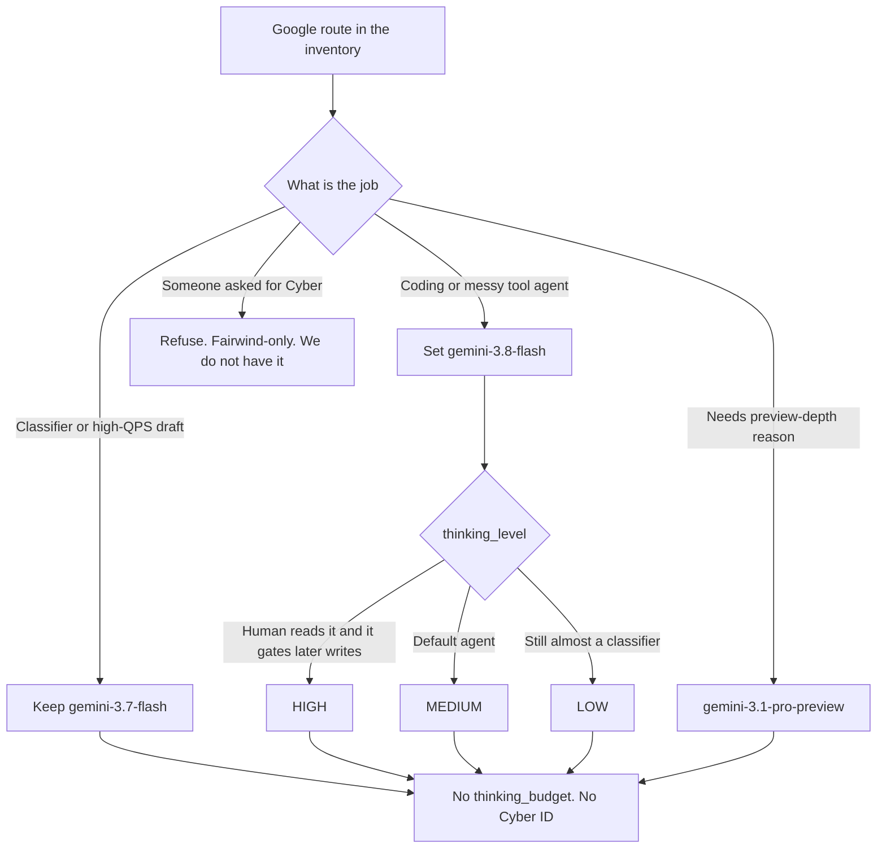

# Gemini 3.8 Flash Shipped. Here's the Operator Swap.

**Swap the ID to `gemini-3.8-flash`, drop `thinking_budget` for `thinking_level`, leave Gemini 3.7 Flash on the cheap loop, and do not ask me for Gemini 3.8 Flash Cyber — that variant is Fairwind-only and we do not have it.** That is the whole same-day change. Everything else is price calendar, token burn, and which routes stay on 3.7.

I'm William Spurlock — founder, AI Systems Architect, and Fractional AI CTO. I've built 600+ automations with 500+ still live, spent 20,000+ hours on agentic systems, and helped clients delete 35,000+ hours of busywork. Today is a model-ID day, not a strategy-offsite day. Google's [September 2, 2026 launch post](https://blog.google/innovation-and-ai/models-and-research/gemini-models/3-8-flash-and-3-8-flash-cyber/) calls 3.8 Flash the workhorse and 3.8 Flash Cyber the defender SKU. I am shipping the first and ignoring the second.

If you want the older three-vendor snapshot, I already wrote the [May 2026 frontier comparison](/blog/anthropic-openai-google-frontier-may-2026). That post is history. This one is the swap I am running on September 2.

---

## What changed for operators when Gemini 3.8 Flash shipped?

**Five production facts moved today: the Flash ID, the thinking control, the Antigravity default, the intro price clock, and a Cyber SKU I cannot call.** If your n8n workflow nodes, Model Context Protocol (MCP) servers, and Cursor IDE routes still send `gemini-3.7-flash` plus an integer budget, you are a string edit behind the current Flash — not a research project.

Google's launch post frames this as the third Flash in six weeks, three weeks after 3.7 Flash, at the same introductory dollars as 3.7. The [Gemini API model page](https://ai.google.dev/gemini-api/docs/models/gemini-3.8-flash) lists the stable code as `gemini-3.8-flash`, last updated September 2, 2026 UTC. The [Gemini Enterprise Agent Platform model page](https://docs.cloud.google.com/gemini-enterprise-agent-platform/models/gemini/3-8-flash) marks that same ID GA with release date September 2, 2026.

Here is the operator delta I care about on day one:

| Surface | Before today | After today's ship | What I do |
|---------|--------------|--------------------|-----------|
| Flash model ID | `gemini-3.7-flash` on most volume routes | `gemini-3.8-flash` is the current Flash | Swap IDs on agent and coding routes |
| Thinking control | Integer `thinking_budget` on older Gemini 3 calls | String `thinking_level`: `LOW` / `MEDIUM` / `HIGH` | Delete the integer; set the enum |
| Antigravity | Prior Flash as the daily driver | 3.8 Flash is the default on `antigravity-preview-05-2026` | Accept the default; pin 3.7 only where I want cheaper tokens |
| Price | 3.7 intro rates | Same intro rates on 3.8 through December 31, 2026 | Do not rewrite the finance sheet today |
| Cyber SKU | Not in my stack | 3.8 Flash Cyber via Fairwind only | Do not add a Cyber ID anywhere |

That table is the post. The rest is receipts so nobody "upgrades" a classification loop into a thinking-token heater, or files a ticket asking me to turn on Cyber.

Google's own warning, in both the [launch post](https://blog.google/innovation-and-ai/models-and-research/gemini-models/3-8-flash-and-3-8-flash-cyber/) and the [Cloud model page](https://docs.cloud.google.com/gemini-enterprise-agent-platform/models/gemini/3-8-flash), is that 3.8 Flash works harder on complex tasks — extra reasoning steps, extra tool calls, more tokens at higher effort. That is not a slogan. That is a bill.

I am not flattening 3.8 into "the new Gemini." Gemini 3.1 Pro stays the preview reasoning SKU. Gemini 3.7 Flash stays the efficiency fallback. 3.8 Flash is the current Flash. Three IDs. Three jobs.

---

## What model ID and token window do I swap to?

**The ID is `gemini-3.8-flash`. Input cap is 1,048,576 tokens. Output cap is 65,536 tokens.** Those three numbers come from the [Gemini API Gemini 3.8 Flash page](https://ai.google.dev/gemini-api/docs/models/gemini-3.8-flash) and match the [Cloud Agent Platform spec](https://docs.cloud.google.com/gemini-enterprise-agent-platform/models/gemini/3-8-flash). DeepMind's [3.8 Flash model card](https://deepmind.google/models/model-cards/gemini-3-8-flash/), published September 2, 2026, rounds the same window as "up to 1M" in and "64K" out.

I do not write "Gemini" next to the raw million. I write the ID, then the integer.

| Spec | Value | Official source |
|------|-------|-----------------|
| Model code | `gemini-3.8-flash` | [Gemini API model page](https://ai.google.dev/gemini-api/docs/models/gemini-3.8-flash) |
| Launch | GA, September 2, 2026 | [Cloud 3.8 Flash page](https://docs.cloud.google.com/gemini-enterprise-agent-platform/models/gemini/3-8-flash) |
| Input tokens | 1,048,576 | [Gemini API](https://ai.google.dev/gemini-api/docs/models/gemini-3.8-flash) / [Cloud](https://docs.cloud.google.com/gemini-enterprise-agent-platform/models/gemini/3-8-flash) |
| Output tokens | 65,536 | Same two pages |
| Inputs | Text, image, video, audio, PDF | [Gemini API model page](https://ai.google.dev/gemini-api/docs/models/gemini-3.8-flash) |
| Output type | Text | Same |
| Thinking | Supported: low, medium, high. `minimal` errors | [Gemini API model page](https://ai.google.dev/gemini-api/docs/models/gemini-3.8-flash) |
| Live API | Not supported | Same |
| Image generation | Not supported | Same |
| Caching / code exec / function calling / URL context / file search | Supported | Same |
| Computer use | Supported (Preview) | Same |
| Knowledge cutoff | March 2026 on some domains; other domains can still sit at January 2025 | [DeepMind model card](https://deepmind.google/models/model-cards/gemini-3-8-flash/) |

The [Cloud developer guide](https://docs.cloud.google.com/gemini-enterprise-agent-platform/models/guides/gemini-3-8-flash) puts 3.8 Flash next to the other two Gemini IDs I still keep in the rack:

| Model | ID | Stage | Thinking default | Job on my stack |
|-------|----|-------|------------------|-----------------|
| Gemini 3.8 Flash | `gemini-3.8-flash` | GA | `MEDIUM` | Current Flash — agents, coding, long-horizon loops |
| Gemini 3.7 Flash | `gemini-3.7-flash` | GA | `MEDIUM` | Efficiency fallback — cheap classification and high-QPS drafts |
| Gemini 3.1 Pro | `gemini-3.1-pro-preview` | Preview | `HIGH` | Deep reasoning when Flash is not enough |

Same 1,048,576 / 65,536 window on all three, per that guide. The swap is not "more context." The swap is quality, token appetite, and which ID Antigravity now picks when you omit config.

Where the rest of the frontier sits today — so I do not flatten 3.8 Flash into a flagship:

| Vendor | Use this | Role | Do not flatten into |
|--------|----------|------|---------------------|
| OpenAI | **GPT-6 Astra** (`gpt-6-astra`) | Flagship, September 3 | GPT-5.6 Sol / Terra / Luna stay the cheaper stack |
| Anthropic | **Claude Fable 5.1** (`claude-fable-5-1`) | GA Mythos-class, September 1 | Not a replacement for Opus |
| Anthropic | **Claude Mythos 5.1** (`claude-mythos-5-1`) | Same weights, invite-only | Not a public default |
| Anthropic | **Claude Opus 5** / **Sonnet 5** / **Haiku 4.5** | Default complex / volume / cheap | Opus 4.8 is a Fable fallback, not the flagship |
| Google | **Gemini 3.8 Flash** (`gemini-3.8-flash`) | Current Flash, September 2 | 3.7 Flash = efficiency fallback; 3.1 Pro = preview |
| xAI | **Grok 4.6** (`grok-4.6`) | Flagship model, August 12 | Not Grok Bot |
| xAI | **Grok Bot** (Mac app 0.43.0) | Always-on agent product, August 11 | Not Cursor `cursor-grok-4.6-xhigh-fast` |

3.8 Flash does not replace GPT-6 Astra, Claude Fable 5.1, or Grok 4.6. It replaces yesterday's Flash ID on Google routes. The [GPT-6 Astra operator spec card](/blog/gpt-6-astra-launch-operator-spec-card) is the OpenAI seat. This post is the Flash swap. If a client asks "is this the new best model," the answer is "it is the new Flash." That sentence saves a week of bake-off theater.

Consumer and enterprise surfaces, from the [launch post](https://blog.google/innovation-and-ai/models-and-research/gemini-models/3-8-flash-and-3-8-flash-cyber/):

- Developers: Gemini API, Google AI Studio, Android Studio, Stitch, Antigravity
- Enterprises: Gemini Enterprise
- Consumers: Google AI Pro and Ultra, Gemini app, AI Mode in Search, Gemini in Sheets
- Cyber: Fairwind Program only

I am an API and agent operator. Sheets getting a smarter completion is not my swap.

---

## What happens if I leave thinking_budget on the request?

**You are sending a deprecated integer into a model that wants a string enum — `thinking_level` set to `LOW`, `MEDIUM`, or `HIGH`.** The [Cloud developer guide](https://docs.cloud.google.com/gemini-enterprise-agent-platform/models/guides/gemini-3-8-flash) makes the migration step explicit: change the model string, then replace integer `thinking_budget` with `thinking_level`. The [Gemini API model page](https://ai.google.dev/gemini-api/docs/models/gemini-3.8-flash) adds the failure mode I actually hit in configs: `minimal` is not supported and returns an error.

Default on 3.8 Flash is `MEDIUM`, per the same Cloud guide. Gemini 3.1 Pro defaults to `HIGH`. If you copy a Pro config onto Flash, you will pay Pro-shaped thinking on a Flash invoice.

| `thinking_level` | Official guidance I am using | Where I set it today |
|------------------|------------------------------|----------------------|
| `LOW` | Cloud: fast transcript-style search, basic metadata, latency-first work | Labels, routing, "is this spam," short CRM drafts |
| `MEDIUM` | Cloud default. Balance for general agent work | Default 3.8 Flash routes after the swap |
| `HIGH` | Cloud: dense visual QA, long video, multi-step reasoning that gates later steps | Rare. Planning steps I will read, not batch classify |
| `minimal` | Unsupported. Errors | Map any leftover `minimal` to `LOW` |

The Cloud guide also strips a pile of leftover sampling knobs that will either be ignored or throw:

| Parameter | 3.8 Flash behavior | Operator move |
|-----------|--------------------|---------------|
| `thinking_budget` | Replaced by `thinking_level` | Delete the integer |
| `temperature`, `top_p`, `top_k` | Deprecated; backend ignores them | Remove so logs stop lying |
| `frequency_penalty`, `presence_penalty`, `candidate_count` | Active API error if sent | Remove before the first prod call |
| Prefill / history ending on a `model` turn | Unsupported or invalid | Clean the transcript |

Thinking tokens are not a side meter. The [Gemini API pricing page](https://ai.google.dev/gemini-api/docs/pricing) bills output "including thinking tokens." Higher `thinking_level` does not change the dollar rate. It changes how many output tokens you mint. Google already said the model will spend more tokens on hard tasks, especially at higher effort — [launch post](https://blog.google/innovation-and-ai/models-and-research/gemini-models/3-8-flash-and-3-8-flash-cyber/) and [model card](https://deepmind.google/models/model-cards/gemini-3-8-flash/).

This is the prompt I paste into Cursor when I want the swap done without a "creative" rewrite of the stack:

```
Same-day Gemini 3.8 Flash operator swap. Do not invent a new architecture.

For every Google Flash route that should move:
1. Set model to gemini-3.8-flash.
2. Delete thinking_budget. Set thinking_level to MEDIUM unless the route is a classifier — those stay LOW.
3. Remove temperature, top_p, top_k, frequency_penalty, presence_penalty, candidate_count.
4. Do not send thinking_level=minimal.
5. Leave gemini-3.7-flash pinned on the cheap classification / high-QPS draft loops I list below.
6. Do not add any Cyber model ID. We do not have Fairwind.

Then print a table: route name, old ID, new ID, thinking_level, kept-on-3.7 reason.
```

That is the whole instruction. No SDK tutorial. No "while we're here" refactor.

If a route still needs a hard token cap, 3.8 Flash will not give you the old integer budget. You lower the level, shorten the prompt, or stay on 3.7. Those are the three levers. Inventing a fourth lever in application code is how you get a silent ignore and a surprise bill.

---

## Why is Gemini 3.8 Flash the Antigravity default today?

**Because Google said so on the Antigravity agent docs: if you omit `agent_config` on `antigravity-preview-05-2026`, the agent defaults to `gemini-3.8-flash`.** That sentence is on the [Gemini API Antigravity agent page](https://ai.google.dev/gemini-api/docs/antigravity-agent), not a blog rumor. The [Antigravity team post](https://antigravity.google/blog/gemini-3-8-flash-in-google-antigravity) puts 3.8 Flash in the IDE as the daily workhorse at the same Flash intro price and keeps 3.7 Flash available when you want compute efficiency.

I already mapped the product in the [Google Antigravity agents blueprint](/blog/google-antigravity-agents-blueprint). That blueprint still describes the harness. The default brain inside the harness just changed.

Official `agent_config.model` values from that same Antigravity agent page:

| Antigravity label | `agent_config.model` | Official note |
|-------------------|----------------------|---------------|
| Gemini 3.8 Flash (default) | `gemini-3.8-flash` | Default balanced model for reasoning, coding, and tool use |
| Gemini 3.7 Flash | `gemini-3.7-flash` | Previous-generation Flash for reasoning, coding, agentic workflows |
| Gemini 3.6 Flash | `gemini-3.6-flash` | Balanced Flash for general agentic workflows |
| Gemini 3.5 Flash | `gemini-3.5-flash` | Lightweight, general workflows |
| Gemini 3.5 Flash-Lite | `gemini-3.5-flash-lite` | Low latency, cost-sensitive tasks |

I do not treat that list as a menu to sample every day. I treat it as a pin table. New Antigravity sessions inherit 3.8 Flash. Efficiency sessions get an explicit 3.7 pin. Lite stays Lite. Preview Pro stays out of the default.

Google's launch demos — castle game, DOS Maps, USGS topographic map, Hardware Anatomy in AI Studio — are marketing. Useful as a "yes, long-horizon coding is the pitch." Useless as a production test. I do not promote a client route because a wizard walked a generated hallway.

What I do change in Antigravity today:

1. **Accept the default on new agent threads.** Fighting the default on day one is how you debug the wrong ID.
2. **Pin 3.7 Flash on the loops I already measured as token-heavy and quality-saturated.** If 3.7 already files the ticket correctly, 3.8's extra diligence is a donation to Google.
3. **Set `thinking_level` in the agent config the same way I set it in the API.** IDE dropdown plus a leftover `thinking_budget` in a hooked MCP server is two sources of truth.
4. **Leave managed agents alone until I re-create them.** The Antigravity agent docs say a managed agent created with `agents.create` locks the model at create time. You cannot override it on a later turn.

If you run Antigravity as the standing layer next to inbox and CRM agents, read [what an agentic OS means day to day](/blog/what-an-agentic-os-means-for-running-your-business-day-to-day). The OS does not care that Flash got a point release. The OS cares that the coding agent and the ops agent do not silently share one unbounded `HIGH` thought budget.

---

## Why does Gemini 3.7 Flash stay on the cheap loop?

**Because Google still supports 3.7 Flash for efficiency-first workloads, and 3.8 Flash is allowed to spend more tokens to score higher.** The [launch post](https://blog.google/innovation-and-ai/models-and-research/gemini-models/3-8-flash-and-3-8-flash-cyber/) says it in plain language: use lower effort, or keep 3.7, when compute efficiency is the constraint. The [Cloud developer guide](https://docs.cloud.google.com/gemini-enterprise-agent-platform/models/guides/gemini-3-8-flash) repeats it: 3.8 is more accurate and more token-hungry; 3.7 is the efficiency option.

Same introductory sticker on both Flash IDs does not mean same cost per task. Rate × tokens is the bill. 3.8 at `HIGH` on a 40-step tool loop will beat 3.7 on the invoice even when both list $0.75 / $3.75.

My keep-vs-swap rule for today:

| Route type | Stay on 3.7 Flash | Move to 3.8 Flash |
|------------|-------------------|-------------------|
| Binary / ternary classification | Yes | No |
| High-QPS draft that a human already edits | Yes | No |
| Cheap nightly hygiene (tags, dedupe suggestions) | Yes | Only if 3.7 miss rate is the pain |
| Long-horizon coding agent | No | Yes |
| Multi-tool ops agent with messy context | No | Yes, `MEDIUM` first |
| Video / screenshot QA that gates a later write | No | Yes, `HIGH` only on that step |
| Anything I have not measured | Shadow both for a day | Do not cut 3.7 until the log exists |

Cloud's own published evals, from the [developer guide](https://docs.cloud.google.com/gemini-enterprise-agent-platform/models/guides/gemini-3-8-flash), are why I move the coding agents and not the classifiers:

| Eval (Cloud guide) | 3.8 Flash | 3.7 Flash |
|--------------------|-----------|-----------|
| Terminal-bench 2.1 | 90.8% | 81.6% |
| SWE-Bench Pro | 61.6% | 60.4% |
| SWE-Atlas | 51.9% | 48.0% |
| τ³-bench Banking | 38.1% | 30.9% |
| CharXiv (multimodal) | 86.2% | 84.5% |
| GDP.pdf | 35.0% | 34.0% |
| Humanity's Last Exam (HLE) | 45.4% | 45.7% |

Read that last row twice. On Cloud's HLE number, 3.8 is *not* a free win. The [launch post](https://blog.google/innovation-and-ai/models-and-research/gemini-models/3-8-flash-and-3-8-flash-cyber/) separately cites **54.9% on HLE-Verified**. Those are different benches. I will not mash them into one "HLE" headline. I will also not pretend a 1.2-point SWE-Bench Pro bump is why I swap a spam labeler.

The jump I actually respect is Terminal-bench 2.1: 81.6% to 90.8% on the Cloud table. That is agentic terminal work. That is why Antigravity defaulted. That is not why your webhook that returns `{route: billing}` should change IDs.

DeepMind's [model card](https://deepmind.google/models/model-cards/gemini-3-8-flash/) is honest about the downside: slowness and timeouts can show up; higher effort can mint more tokens; the cutoff is March 2026 with some domains still stuck at January 2025. If your loop needs last week's vendor blog, ground it. Do not assume Flash "knows September."

---

## What does the introductory price cover through December 31, 2026?

**Paid Gemini API traffic on `gemini-3.8-flash` is $0.75 per million input tokens and $3.75 per million output tokens through December 31, 2026, then $1.50 / $7.50 starting January 1, 2027 — output includes thinking tokens.** That clock is in the [launch post footnote](https://blog.google/innovation-and-ai/models-and-research/gemini-models/3-8-flash-and-3-8-flash-cyber/) and on the [Gemini API pricing page](https://ai.google.dev/gemini-api/docs/pricing). The Antigravity blog repeats the intro pair as "$0.75/1M input tokens and $3.75/1M output tokens."

I am not treating "same price as 3.7" as "free upgrade." I am treating it as four months of intro rates and a hard double on New Year's Day.

Paid-tier numbers from the [pricing page](https://ai.google.dev/gemini-api/docs/pricing), all per 1M tokens in USD unless noted:

| Line | Through December 31, 2026 | From January 1, 2027 |
|------|---------------------------|----------------------|
| Standard input | $0.75 | $1.50 |
| Standard output (includes thinking) | $3.75 | $7.50 |
| Context cache | $0.075 | $0.15 |
| Cache storage | $0.50 per 1M tokens per hour | $1.00 per 1M tokens per hour |
| Batch input | $0.375 | $0.75 |
| Batch output (includes thinking) | $1.875 | $3.75 |
| Batch cache | $0.0375 | $0.075 |
| Flex input | $0.375 | $0.75 |
| Flex output (includes thinking) | $1.875 | $3.75 |
| Google Search grounding | 5,000 free requests/month shared across Gemini 3.x, then $14 per 1,000 | Same structure |
| Google Maps grounding | 5,000 free prompts/month shared across Gemini 3, then $14 per 1,000 queries | Same structure |

Free tier is listed as free of charge on input/output, with content used to improve Google products. Paid says content is not used to improve products. That split is on the same [pricing page](https://ai.google.dev/gemini-api/docs/pricing). Client work I care about does not sit on the free tier.

Operator calendar I am putting on the studio wall:

1. **September 2–December 31, 2026.** Intro rates. Swap quality routes. Measure tokens per successful task, not tokens per call.
2. **December 1, 2026.** Re-forecast January with 2× input and 2× output. If a loop only works at `HIGH`, that loop gets a design review, not a hope.
3. **January 1, 2027.** Standard rates apply whether or not I remembered the footnote.

Batch at half off is the correct home for overnight evals and shadow traffic, not for the live approval queue. Flex is the correct home for traffic that can wait. Neither is a substitute for leaving 3.7 on the cheap loop.

I will not invent a "typical task costs $0.12" number. I do not have your transcript length, your tool-call count, or your `thinking_level`. Anyone selling a per-task average on launch day is guessing with a straight face.

---

## What is Gemini 3.8 Flash Cyber, and why don't we have it?

**Gemini 3.8 Flash Cyber is Google's defender-only Flash, shipped the same day, available through the Fairwind Program — not through the public Gemini API ID I am swapping to — and we do not have it.** The [launch post](https://blog.google/innovation-and-ai/models-and-research/gemini-models/3-8-flash-and-3-8-flash-cyber/) is explicit: trusted government authorities, critical infrastructure operators, and software maintainers get prioritized access. You apply. You do not pass `gemini-3.8-flash` and hope it grows cyber teeth.

I am not writing exploit walkthroughs. I am not reproducing CyberGym. I am not turning this post into a patch cookbook. Google's public claims, cited so you know why the SKU exists:

- Same foundational intelligence as 3.8 Flash, with a more permissive cyber mitigation set, which is why it is gated.
- CyberGym: Google says frontier-level autonomous vulnerability discovery, ahead of 3.5 Flash Cyber and larger frontier models.
- Internal multi-language discovery bench: Google says success above 70% across 20 languages.
- CWE-Bench (Collinear): Google cites pass@1 of 47.2% against a leading model at 47.8%, at lower cost.
- Chrome Security: Google says 2.6× more correct patches than the best larger commercial models they compared.
- Wiz: Google cites +7.5–9.7% recall on an internal pen-test bench at 2.3–5.2× lower cost.

Those are Google's numbers on Google's blog. They are not a license for me to run Cyber on a client repo. They are not a license for you to ask me to "just turn it on."

Safety split, still from the [launch post](https://blog.google/innovation-and-ai/models-and-research/gemini-models/3-8-flash-and-3-8-flash-cyber/):

| SKU | Access | Safeguards Google describes |
|-----|--------|-----------------------------|
| Gemini 3.8 Flash | API, AI Studio, Antigravity, Gemini Enterprise, consumer Gemini | CBRN and cyber-offense safeguards under the Frontier Safety Framework |
| Gemini 3.8 Flash Cyber | Fairwind Program | More permissive cyber mitigations; trusted defenders only |

DeepMind's [3.8 Flash model card](https://deepmind.google/models/model-cards/gemini-3-8-flash/) says 3.8 Flash did not show a meaningful new Frontier Safety jump over 3.7 Flash, and they treat it as unlikely to hit tracked or critical capability levels on that basis. That card is about the public Flash, not a Fairwind onboarding packet.

If a client forwards the Cyber paragraph and asks for it in n8n, the answer is one sentence: we do not have Fairwind, the public ID is `gemini-3.8-flash`, and I will not shadow-route production code to a defender model I cannot legally call.

---

## How does Gemini 3.8 Flash sit next to GPT-6 Astra, Claude Fable 5.1, and Grok 4.6?

**3.8 Flash is the Google volume brain I swap today; it is not the studio's only flagship and it does not retire Opus, Fable, Astra, or Grok.** I keep vendor lanes. I do not run a weekly religion.

How I place them on September 2:

| Job | Model I reach for | Why |
|-----|-------------------|-----|
| Google-native agents, Antigravity, cheap-but-strong coding loops | Gemini 3.8 Flash | Current Flash, Antigravity default, intro Flash price |
| Google volume that is already good enough | Gemini 3.7 Flash | Official efficiency fallback |
| Google deep-reason preview | Gemini 3.1 Pro | Preview, default `HIGH` thinking |
| Hard judgment where Opus still wins | Claude Opus 5 | Default complex lane |
| Anthropic volume | Claude Sonnet 5 | Default volume lane |
| Anthropic cheap | Claude Haiku 4.5 | Default cheap lane |
| When Opus at high effort still fails | Claude Fable 5.1 | GA Mythos-class; not an Opus replacement |
| Mythos-class invite | Claude Mythos 5.1 | Same weights, invite-only; we are not treating it as public default |
| OpenAI flagship (from tomorrow's desk) | GPT-6 Astra | Flagship lane — not this post's swap |
| xAI flagship | Grok 4.6 | Separate ID, separate bill |
| Always-on teammate product | Grok Bot | Product, not a model string in Cursor |

The May frontier post is still useful as a *method*: compare context, price, and the job, not the keynote. The names in that May piece are dated. Use the table above.

I do not move Claude routes to Gemini because Terminal-bench went up. I do not move Gemini cheap loops to Fable because Fable is new. Cross-vendor "upgrades" are how you break evals you already trust.

One opinion, loosely held on my workload: **3.8 Flash is the first Google Flash I will put on a long-horizon coding agent without a second thought, and the last Google Flash I will put on a 10k-call/day classifier without a token log.** That split is the operator swap. "Use 3.8 everywhere" is a press-release reading.

---

## What do I change in the stack before the day ends?

**Four edits: ID, thinking enum, Antigravity pin, Cyber refusal. Then I measure tokens per successful task for a week.** If I cannot finish that by tonight, I finish the ID and the enum and I leave 3.7 where it already works.

Day-one checklist:

1. **Inventory every Google model string.** n8n HTTP nodes, MCP server configs, Cursor rules, Antigravity managed agents, batch jobs, eval harnesses. If it says 3.7 and the route is a coding or messy-tool agent, it is a candidate. If it says 3.7 and the route is a labeler, it stays.
2. **Swap candidates to `gemini-3.8-flash`.** No aliases. No "latest." Pin the stable ID from the [model page](https://ai.google.dev/gemini-api/docs/models/gemini-3.8-flash).
3. **Replace `thinking_budget` with `thinking_level`.** Default `MEDIUM`. Classifiers `LOW`. Nothing `HIGH` unless a human reads the result.
4. **Strip ignored and illegal sampling fields** listed in the [Cloud developer guide](https://docs.cloud.google.com/gemini-enterprise-agent-platform/models/guides/gemini-3-8-flash).
5. **Accept Antigravity's new default** on new threads. Pin 3.7 only with an explicit `agent_config.model`.
6. **Do not add a Cyber ID.** Fairwind is not a checkbox in my `.env`.
7. **Log `thoughts` / thinking token counts** if the API returns them. Rate is not the risk. Volume is.
8. **Put December 31, 2026 on the finance calendar.** Intro ends. Standard $1.50 / $7.50 starts January 1, 2027 per [pricing](https://ai.google.dev/gemini-api/docs/pricing).

Decision flow I want every route to pass:



MCP-style pin I want in the server that talks to Gemini — config, not an SDK lesson:

```
gemini.operator_pins:
  current_flash: gemini-3.8-flash
  cheap_loop: gemini-3.7-flash
  preview_reason: gemini-3.1-pro-preview
  thinking_level_default: MEDIUM
  thinking_level_classifier: LOW
  thinking_budget: forbidden
  cyber: forbidden
  intro_rate_ends: 2026-12-31
```

If your MCP layer cannot pin two Flash IDs, you do not have a model problem. You have a config problem. Fix the pin table before you "upgrade" the cheap loop.

Shadow protocol I actually run:

- 24 hours of dual-write on one coding agent and one ops agent.
- Score: task accepted by the human, not bench screenshots.
- Kill 3.8 on that route if it spends more than I can explain and the accept rate does not move.
- Kill 3.7 on that route only after 3.8 wins on accept rate *and* I still like the token log.

I have 600+ automations in the book. The ones that survive model week are the ones with a pin table and a kill switch. The ones that blow up are the ones that search-and-replaced "Flash" like it was a brand, not an ID.

---

## When do I use standard, batch, and flex on 3.8 Flash?

**Standard for anything a human is waiting on. Batch for overnight evals and shadow traffic. Flex for jobs that can wait and can tolerate a cheaper queue.** Those three lanes are on the [Gemini API pricing page](https://ai.google.dev/gemini-api/docs/pricing). Mixing them is how you keep intro rates from turning a classification flood into a standard-output bill.

The [Cloud model page](https://docs.cloud.google.com/gemini-enterprise-agent-platform/models/gemini/3-8-flash) lists Standard PayGo, Flex PayGo, Priority PayGo, batch inference, and provisioned throughput. I do not need provisioned throughput on day one. I need to stop sending shadow evals down the same standard key as the live agent.

| Lane | Intro paid rate (per 1M) | What I put on it today | What I refuse to put on it |
|------|--------------------------|------------------------|----------------------------|
| Standard | $0.75 in / $3.75 out | Live agents, Antigravity, anything in an approval queue | Nightly 10k-prompt evals |
| Batch | $0.375 in / $1.875 out | Dual-write shadows, bench reruns, backfills | Customer-facing latency |
| Flex | $0.375 in / $1.875 out | Jobs that can wait hours | The morning inbox brief |
| Free | $0 | Personal scratch | Client data. Paid page says free-tier content can be used to improve Google products |

Grounding is a separate meter. Search grounding: 5,000 free requests a month shared across Gemini 3.x, then $14 per 1,000, per [pricing](https://ai.google.dev/gemini-api/docs/pricing). Maps grounding: 5,000 free prompts a month shared across Gemini 3, then $14 per 1,000 queries. I do not turn Search grounding on for a classifier that already has the snippet in the prompt. I turn it on when the [model card](https://deepmind.google/models/model-cards/gemini-3-8-flash/) cutoff (March 2026, some domains still January 2025) would make the model invent a vendor changelog.

Priority inference exists. I am not flipping it on launch day without a latency SLO that standard already missed. Intro rates already double in January. Do not stack a priority multiplier on a loop you have not timed.

Computer use is Preview on both the [Gemini API page](https://ai.google.dev/gemini-api/docs/models/gemini-3.8-flash) and the [Cloud page](https://docs.cloud.google.com/gemini-enterprise-agent-platform/models/gemini/3-8-flash). Preview is not a standing OS write path. If I need a clicker, it stays in a sandbox with a human on the send.

---

## Which Gemini 3.8 Flash API rules break a copied 3.7 payload?

**The Cloud guide's mandatory rules: match every `FunctionResponse` to the prior `FunctionCall`, do not end history on a model turn, do not prefill model turns, and do not send the dead sampling knobs.** That is from the [developer guide](https://docs.cloud.google.com/gemini-enterprise-agent-platform/models/guides/gemini-3-8-flash), not a forum post. A 3.7 payload that "mostly worked" can fail closed on 3.8 if you copied history hygiene from an older client.

Operator failures I check before I call the swap done:

| Gotcha | Official rule | What it looks like in production |
|--------|---------------|----------------------------------|
| Function response mismatch | `FunctionResponse` must match `id`, `name`, and execution count of the preceding `FunctionCall` | Agent retries a tool, logs look fine, API rejects the turn |
| Pre-tool chatter | Intermediate notes belong in an `update()` style function call, not raw text before the tool | `Malformed_Function_Call` after a "thinking out loud" prefix |
| History ends on `model` | History payloads cannot end on a model role | Replay of a saved thread 500s |
| Prefill | Prefill model turns are unsupported | "Start your answer with {json}" stuffed into a fake assistant turn |
| Empty turns | Empty history turns drop or error | n8n mapped a blank item into contents |
| `minimal` thinking | Not supported; errors | Old 3.7 efficiency flag still in the node |
| Live API | Not supported on 3.8 Flash | Someone wired a websocket helper to the new ID |

I am not pasting an SDK. I am pasting the prompt I give the agent that edits the MCP server:

```
Audit this Gemini client for a 3.8 Flash swap. Do not add features.

Fail the audit if any of these are still true:
- thinking_budget is present
- thinking_level is missing on 3.8 routes
- thinking_level is minimal
- temperature, top_p, top_k, frequency_penalty, presence_penalty, or candidate_count are sent
- conversation history can end on a model turn
- a FunctionResponse can ship without matching id and name
- a Cyber model ID exists
- cheap classification routes were moved off gemini-3.7-flash without a token log

Return a fail/pass table. Then make the minimum edit that turns fails into passes.
```

If that audit is red, I do not "ship the upgrade" and debug in production. I fix the payload. 3.8 Flash is not a personality. It is a stricter Gemini 3 family client plus a hungrier workhorse.

Live API is the other trap. The [model page](https://ai.google.dev/gemini-api/docs/models/gemini-3.8-flash) says Live API is not supported. If a voice or websocket helper was pointed at Flash "because Flash is fast," it stays on whatever Live-capable ID you already used. Do not test that by swapping strings at 4 p.m.

---

## Frequently asked questions

### What is the Gemini 3.8 Flash model ID?

**`gemini-3.8-flash` — that is the stable code on the [Gemini API model page](https://ai.google.dev/gemini-api/docs/models/gemini-3.8-flash) and the [Cloud GA listing](https://docs.cloud.google.com/gemini-enterprise-agent-platform/models/gemini/3-8-flash).** Do not send a preview suffix unless Google lists one. Do not send a Cyber ID. Pin the string.

### Does Gemini 3.8 Flash still take thinking_budget?

**No. The [Cloud developer guide](https://docs.cloud.google.com/gemini-enterprise-agent-platform/models/guides/gemini-3-8-flash) says to replace integer `thinking_budget` with `thinking_level` set to `LOW`, `MEDIUM`, or `HIGH`.** The [Gemini API page](https://ai.google.dev/gemini-api/docs/models/gemini-3.8-flash) says `minimal` errors. Map leftover `minimal` to `LOW`.

### Is Gemini 3.8 Flash cheaper than Gemini 3.7 Flash today?

**Not on the sticker. The [launch post](https://blog.google/innovation-and-ai/models-and-research/gemini-models/3-8-flash-and-3-8-flash-cyber/) puts 3.8 on the same introductory $0.75 / $3.75 as 3.7 through December 31, 2026.** Per-task cost can still rise because 3.8 is allowed to think longer and call more tools. Measure tokens, not the price card.

### Should I delete Gemini 3.7 Flash from production loops?

**No. Google still points efficiency-first workloads at 3.7 Flash in the [launch post](https://blog.google/innovation-and-ai/models-and-research/gemini-models/3-8-flash-and-3-8-flash-cyber/) and the [Cloud guide](https://docs.cloud.google.com/gemini-enterprise-agent-platform/models/guides/gemini-3-8-flash).** I keep 3.7 on classifiers and high-QPS drafts. I move coding and messy agents.

### What thinking_level should I set for classification routes?

**`LOW`, or keep the route on 3.7 Flash.** Cloud's own `LOW` examples are latency-first, transcript-style, metadata-style work. A labeler does not need `HIGH`. `HIGH` on a labeler is how intro pricing still hurts.

### What thinking_level should I set for long-horizon coding agents?

**`MEDIUM` first — that is the 3.8 Flash default in the [Cloud guide](https://docs.cloud.google.com/gemini-enterprise-agent-platform/models/guides/gemini-3-8-flash).** Promote a single planning step to `HIGH` only when a human reads it and later writes depend on it. Do not set the whole loop to `HIGH` because Terminal-bench went up.

### Is Gemini 3.8 Flash the default in Google Antigravity?

**Yes, on `antigravity-preview-05-2026`. The [Antigravity agent docs](https://ai.google.dev/gemini-api/docs/antigravity-agent) say omitting `agent_config` defaults the agent to `gemini-3.8-flash`.** The [Antigravity blog](https://antigravity.google/blog/gemini-3-8-flash-in-google-antigravity) also puts 3.8 in the IDE and keeps 3.7 available for efficiency.

### Is Gemini 3.8 Flash Cyber available on the Gemini API?

**Not to me, and not as a public operator default. The [launch post](https://blog.google/innovation-and-ai/models-and-research/gemini-models/3-8-flash-and-3-8-flash-cyber/) gates Cyber through the Fairwind Program.** We do not have it. I will not add a Cyber model string to n8n, MCP, or Cursor.

### When does the Gemini 3.8 Flash introductory price end?

**December 31, 2026. On January 1, 2027 the paid rates become $1.50 input and $7.50 output per million tokens, per the [launch footnote](https://blog.google/innovation-and-ai/models-and-research/gemini-models/3-8-flash-and-3-8-flash-cyber/) and the [pricing page](https://ai.google.dev/gemini-api/docs/pricing).** Cache, batch, and flex lines move on the same day. Put it on the calendar now.

### What is the context window on Gemini 3.8 Flash?

**1,048,576 input tokens and 65,536 output tokens, per the [Gemini API model page](https://ai.google.dev/gemini-api/docs/models/gemini-3.8-flash) and the [Cloud model page](https://docs.cloud.google.com/gemini-enterprise-agent-platform/models/gemini/3-8-flash).** That window matches 3.7 Flash and 3.1 Pro on the Cloud comparison table. You are not buying a bigger window. You are buying a different Flash.

### Does Gemini 3.8 Flash replace GPT-6 Astra or Claude Fable 5.1?

**No. 3.8 Flash is Google's current Flash, not a one-model shop.** Astra is the OpenAI flagship lane. Fable 5.1 is Anthropic's GA Mythos-class model and is not an Opus replacement. Grok 4.6 stays the xAI flagship. I swap Flash. I do not convert the studio to a single vendor because a keynote dropped.

### Can I send temperature or top_p to Gemini 3.8 Flash?

**The [Cloud developer guide](https://docs.cloud.google.com/gemini-enterprise-agent-platform/models/guides/gemini-3-8-flash) says `temperature`, `top_p`, and `top_k` are deprecated and ignored; `frequency_penalty`, `presence_penalty`, and `candidate_count` throw.** Control behavior with `thinking_level` and schemas. Dead knobs in the payload make logs lie.

---

If Google routes still send last month's Flash ID or an integer `thinking_budget`, that is a same-day wiring job, not a bake-off. Book an [AI automation strategy call](/contact) and I will walk the Gemini inventory — coding agents onto `gemini-3.8-flash` with `thinking_level`, classifiers left on 3.7, Cyber refused because we do not have Fairwind — as Fractional AI CTO, or we stand up a [custom agent team](/contact) with send and spend locked. I have built 600+ automations and 500+ are still live. A Flash ship is an enum and two IDs, not a new stack.
