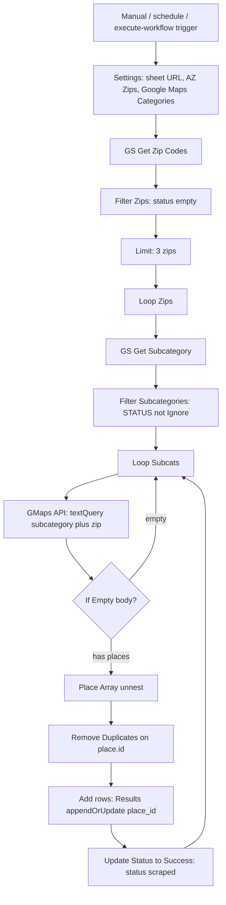

# Google Maps Lead Lists by Zip Code and Category, Written Straight to Sheets

**William's n8n Google Maps lead build writes business lists to Sheets by zip code by reading unfinished zip rows and category rows from Google Sheets, POSTing each pair as a Places [Text Search (New)](https://developers.google.com/maps/documentation/places/web-service/text-search) `textQuery`, then append-or-updating a Results tab on `place_id`.** The canvas in my library is named **Google Maps Leads | Sheets -> Maps -> Sheets** (workflow id `h1mijH34S11fmgnI`, created 15 March 2025, last saved 22 May 2025). It is a list builder. It is not a CRM, not an outreach sender, and not a Google Business Profile job.

I am **William Spurlock**, founder, AI Systems Architect, and Fractional AI CTO. I have shipped **600+ automations** with **500+ live**, logged **20,000+ hours** inside agentic systems, and deleted **35,000+ hours** of client busywork across that book of work. I built this stack. I am not going to invent a client name, a weekly lead count, or a dollar return you cannot audit.

This spoke sits under [the first AI automation every small business should build](/blog/the-first-ai-automation-every-small-business-should-build). That parent owns intake: form to record to confirmation. This page owns one later receipt: **zip × category in, business rows out**. If you still copy "plumbers 85001" by hand into a tab, this is the shape I use instead.

There is no model node on this canvas. No Claude Opus 4.8. No GPT-5.5. No Gemini 3.1 Pro. Rules read Sheets. An HTTP node hits Places. Rules write Sheets. If you want a model to draft a first-touch email later, that is a different workflow and a different approval gate.

I keep two other Maps canvases in the same library. I am not writing them here. One chats. One calls Apify. This page is only **Sheets → Places → Sheets**. If your operator opens the wrong workflow, they will look for a chat trigger that does not exist on this canvas.

### Credentials the owner has to keep alive

| Credential | Used by | What dies when it expires |
| --- | --- | --- |
| Google Sheets OAuth (or service account) | Get Zip Codes, Get Subcategory, Add rows, Update Status, GS - Get Status | Reads stop. Writes stop. Backoff cannot save a revoked token. |
| HTTP header auth for Places | GMaps API | Every `textQuery` 401s / 403s. Inner loop still ticks. Results stay thin. |

Rotate those in n8n credentials. Do not paste keys into Settings. Settings is sheet names, not secrets.

---

## How does William's n8n Google Maps lead build write business lists to Sheets by zip code?

**It nested-loops unfinished zips against allowed categories, calls `places:searchText` with `"{Subcategory} {zip}"`, unnests the `places` array, drops duplicate place ids inside that response, and writes the Results tab with Google Sheets `appendOrUpdate` matched on `place_id`.** Then it stamps the zip row `scraped` and asks the inner loop for the next category.

The Airtable library card still says "scrape." The live node does not open Maps HTML. It POSTs to `https://places.googleapis.com/v1/places:searchText` with header auth and a required [`X-Goog-FieldMask`](https://developers.google.com/maps/documentation/places/web-service/choose-fields). That is the official Places API (New) Text Search method Google documents as of the [usage and billing page last updated 10 September 2026](https://developers.google.com/maps/documentation/places/web-service/usage-and-billing).

### Three ways this canvas starts

I left three triggers on the same Settings node. You pick one. You do not fire all three at once.

| Node | Type | What it does on this canvas |
| --- | --- | --- |
| When clicking "Execute Workflow" | Manual trigger | Owner-run. This is where I start a new zip list. |
| Execute Workflow Trigger | Sub-workflow start | Another canvas can call this one with no chat UI. |
| Run workflow every hours | Schedule trigger | Interval in the saved JSON is **15 minutes**. That is a convenience, not a quota plan. |

I would rather run this from the manual trigger with the Limit node still at **3 zips** until the Results tab looks honest. The 15-minute schedule is how you burn Places SKUs and Sheets write quota while you are still spelling category names wrong.

### The nested loop, node by node

The outer loop is zip. The inner loop is category. Settings holds three strings so I am not editing five Google Sheets nodes when the workbook moves.

| Node | Job | Owner-facing fact |
| --- | --- | --- |
| Settings | Set `gs_url`, `sheet`, `catSheet` | Zip tab name in this canvas is `AZ Zips`. Category tab is `Google Maps Categories`. I am not publishing the live spreadsheet URL. |
| GS - Get Zip Codes | Read the zip tab | Reads every row. Filtering happens next. |
| Zips | Coerce `zip` to a number | Bad types here become quiet misses later. |
| Filter Zips | Keep rows whose `status` is empty | A filled status cell is a skip. This is the resume switch. |
| Set Row Number → Split Out → Limit | Prep the outer loop | **Limit is saved at `maxItems: 3`.** Forget that and you will swear the list is broken. |
| Loop Zips | SplitInBatches on zips | One zip in flight. |
| GS - Get Subcategory | Read the category tab | Runs **inside** the zip loop. Same category list for every zip. |
| Filter Subcategories | Keep rows where `STATUS` is not `Ignore` | Park a vertical without deleting the row. |
| Subcategory | Set the current `Subcategory` string | This string is half of the Places query. |
| Loop Subcats | SplitInBatches on categories | One category in flight for the current zip. |
| Set Zip | Pull `zip` from Loop Zips | Inner items do not inherit the outer zip unless you set it. |

After Set Zip, **GMaps API** builds one query. The body field is `textQuery`. The expression in the saved JSON is the current subcategory, a space, then the current zip. Google's own Text Search examples look like "pizza in New York." This canvas uses the shorter `"Plumbers 85001"` shape. Google says identical queries are [not guaranteed to return the same list](https://developers.google.com/maps/documentation/places/web-service/text-search). Treat the Results tab as a snapshot of that call, not a census of the zip.

### What the Places node asks for

The HTTP node is named **GMaps API**. Method POST. Full response on. Auth is a generic HTTP header credential — the API key stays in n8n credentials, not in the sheet.

| Request piece | Value on this canvas | Why it matters |
| --- | --- | --- |
| URL | `https://places.googleapis.com/v1/places:searchText` | Places API (New) Text Search. |
| `textQuery` | `Subcategory` + space + `zip` | One pair, one call. |
| `X-Goog-FieldMask` | `places.id`, `displayName`, `addressComponents`, `formattedAddress`, `primaryType`, `primaryTypeDisplayName`, `types`, `location`, `nationalPhoneNumber`, `rating`, `userRatingCount`, `websiteUri`, `editorialSummary`, `reviews`, `attributions` | [No FieldMask means an error](https://developers.google.com/maps/documentation/places/web-service/choose-fields). You are billed at the **highest SKU in the mask**. |
| Pagination | None | One POST per pair. No `pageToken` loop. You get one page, not every business Google could list. |

I left `reviews` and `editorialSummary` on that mask. That is an owner choice, not a free extra. Google bills Text Search at Essentials, Pro, or Enterprise (including Enterprise + Atmosphere) based on the fields you ask for. Read the current [Places SKU table](https://developers.google.com/maps/documentation/places/web-service/usage-and-billing) before you copy this mask onto a long zip list. If you only need name, phone, website, and address, trim the mask. I am not going to price your project from a blog post.

### Empty body, unnest, write

**If Empty** checks whether `$json.body` is an empty object. Empty → back to **Loop Subcats**. No Results row. No drama. That is how a dead combo exits.

If the body has places, **Place Array** (Code node) walks `items[0].json.body.places` and emits one n8n item per place. **Set Place ID** copies `place.id` onto `places.id`. **Remove Duplicates** compares `place.id` and `places.id` so the same place does not write twice inside that response.

**Add rows in Google Sheets** is `appendOrUpdate` on the tab named `Results`. The match column is `place_id`. Same place found under a second category updates the row. It does not invent a second lead.

On success, the write path hits **GS - Get Status**, then **Update Status to Success**. That update writes `status: scraped` onto the zip tab, matching **zip only**, and also writes the last `subcat` it finished. Then it returns to **Loop Subcats**.

That last sentence is the resume trap. Status is zip-level. The inner loop can still finish remaining categories **in the same run**. The next run will skip that zip as soon as `status` is filled. If the run dies after the first category succeeds, leftover categories for that zip stay uncalled until you clear the status cell.

---

## What sits in the zip and category sheets before a run?

**Two tabs in one workbook, plus a Results tab the write node already expects.** Settings points every Sheets node at the same document URL. You change tab names in Settings, not by hunting the canvas.

I am not dropping the production spreadsheet link from this receipt. You will use your own workbook. The tab names below are the ones saved in this JSON.

### Zip tab (`AZ Zips` in this canvas)

The name is Arizona-specific because that book of work started as an Arizona list. Rename the tab and the Settings `sheet` value if your list is Ohio. The filter does not care what the tab is called. It cares about `status`.

| Column | Who writes it | What this canvas does with it |
| --- | --- | --- |
| `zip` | You, before the run | Outer loop key. Coerced to a number. Used in `textQuery` and in the status update match. |
| `status` | You leave it blank; the workflow writes `scraped` | Filter Zips keeps **empty** cells only. |
| `subcat` | Workflow, on success | Last subcategory that completed for that zip. Overwritten each inner success. |
| `row_number` | Sheets / n8n | Tracking. Treat it as read-only. |

Owner rules I actually use:

1. One zip per row. No "85001-85004" ranges in a single cell.
2. Leave `status` empty for work you want done. Type anything else and that zip is skipped.
3. Do not pre-fill `subcat`. That column is a breadcrumb, not a queue.
4. If you need to redo a zip, clear `status`. Do not delete the Results rows unless you also want those `place_id` keys gone.

### Category tab (`Google Maps Categories`)

| Column | Who writes it | What this canvas does with it |
| --- | --- | --- |
| `Subcategory` | You | Exact string in the Places `textQuery`. Spelling is the query. |
| `STATUS` | You | Row is used when this is **not** `Ignore`. |

`Ignore` is how I park "roofing" for a week without deleting the vertical. Any other value, including blank, passes the filter.

Write categories the way you would type them into Maps: `Plumbers`, `HVAC contractors`, `Landscapers`. Do not stuff three verticals in one cell. The inner loop is one string per call.

### Results tab (`Results`)

Create the tab before the first write. The append-or-update node maps columns by name. If the header is missing, the write fails and the backoff path starts.

You do not type businesses into Results by hand. You type zips and categories. Results is the output.

### What you do not put in these sheets

| Temptation | Why it does not belong here |
| --- | --- |
| Decision-maker first name | This canvas never writes `firstname` / `lastname`. Those headers can exist on Results and stay empty. |
| Email | Same. The Places mapping does not include email. |
| "Do not contact" flags | Add them later in your CRM. This workflow will overwrite a Results row on `place_id` if the place comes back again. |
| Outreach copy | Wrong layer. This is a list. |

If the next hop is HubSpot or Airtable, wire that in a second workflow after a human has looked at Results. The hour-or-less connect pattern is in [how to connect n8n to your CRM, email, and website](/blog/how-to-connect-n8n-to-your-crm-email-and-website-in-under-an-hour).

### Settings I actually edit

The Settings node is a Set node, not a second spreadsheet. Three assignments, then every Sheets node reads them.

| Assignment | Saved value on this canvas | What you change |
| --- | --- | --- |
| `gs_url` | A Google Sheets document URL | Your workbook. I am not reprinting the production link. |
| `sheet` | `AZ Zips` | Zip tab name. Must match the tab exactly. |
| `catSheet` | `Google Maps Categories` | Category tab name. Same rule. |

Results is **not** in Settings. The write node hardcodes the tab name `Results`. If you rename that tab, edit **Add rows in Google Sheets**, not Settings.

### A first run that cannot wreck the list

This is the sequence I use on a new workbook. It is slow on purpose.

1. Put **two** zips in `AZ Zips` (or your renamed tab). Leave `status` empty.
2. Put **two** categories on the category tab. Set a third row to `Ignore` so you can prove the filter.
3. Leave Limit at **3**. You only have two zips anyway.
4. Fire the **manual** trigger. Do not enable the 15-minute schedule.
5. Watch GMaps API once. Confirm `textQuery` is `Category Zip` and not an empty string.
6. Open Results. You should see `place_id` and `title` on any combo that returned places.
7. Confirm the first zip that finished a category now says `scraped`.
8. Clear that status if you still need the second category and the run died early.

If step 5 shows a 403 or a missing FieldMask error, stop. That is a Cloud project problem, not an n8n mapping problem.

### Manual vs this canvas

| Step | By hand | This canvas |
| --- | --- | --- |
| Pick a zip | You remember which ones you finished | Empty `status` is the queue |
| Pick a category | You retype it | Inner loop reads the category tab |
| Search | You type into Maps | One `textQuery` POST |
| Copy name, phone, site | You paste | Write node maps ten fields |
| Skip a repeat | You eyeball the sheet | `place_id` append-or-update |
| Mark the zip done | You highlight a row | `status` = `scraped` |
| Survives a Sheet quota blip | You wait and try again | Backoff 1 / 2 / 4 / 8 / 16 seconds, five tries |

Hand work still wins when you have five businesses in one town and you already know them. This canvas wins when the zip list is longer than your patience and you are willing to accept one Text Search page per pair.

---

## Which columns land on the Results tab?

**The write node fills `place_id`, `title`, `phone`, `website`, `rating`, `reviews`, `address`, `type`, `gps_coordinates`, and `types`.** Everything else on that tab is a header I left for later hops. Empty is not a bug.

### Columns this canvas actually maps

| Results column | Expression in the write node | Source |
| --- | --- | --- |
| `place_id` | `$json.place.id` | Places id. Match key. |
| `title` | `$json.place.displayName.text` | Display name. |
| `phone` | `$json.place.nationalPhoneNumber` | National-format phone when Google returns one. |
| `website` | `$json.place.websiteUri` | Website URI when Google returns one. |
| `rating` | `$json.place.rating` | Rating. Higher SKU field. |
| `reviews` | `$json.place.reviews` | Review objects when returned. Highest-cost field on this mask. |
| `address` | `$json.place.formattedAddress` | Formatted address. |
| `type` | Current `Subcategory` | **Your** category string, not Google's `primaryType`. |
| `gps_coordinates` | JSON with `latitude` / `longitude` | Places `location`. |
| `types` | `$json.place.types` | Google type array. |

`type` is the search vertical you asked for. `types` is what Places attached to the place. They will disagree. Keep both. When I am hunting HVAC contractors and Google tags a place as a plumber, I want to see that conflict in the sheet, not hide it.

### Phone, site, and rating are optional on Google's side

Places does not owe you a complete card. I have run combos where `title` and `address` land and `phone` or `websiteUri` stay empty. The write node still upserts the row. That is a useful row. It is not a complete outreach row.

| Field | When it is often empty | What I do |
| --- | --- | --- |
| `phone` | Service-area businesses, or a listing Google never collected a number for | Leave it. Do not invent a number from a website later without a second, approved hop. |
| `website` | Places with no URI | Same. |
| `rating` | New or unrated listings | Keep the row. Rating is not a quality gate on this canvas. |
| `reviews` | Mask asked; Google returned none | Empty cell. You still paid for the SKU the mask requested. |

If your seller needs phone-or-skip, filter Results after the run. Do not add that filter inside the Places node. You will hide listings you might still want as a market map.

### Headers that exist and stay blank

The Results schema on this node also lists `ACTION`, `STATUS`, `email`, `name`, `firstname`, `lastname`, `clean url`, `WP API`, `WP`, `facebook`, and `instagram`. This workflow does not fill them. The Upwork-style library blurb that mentions email is marketing copy. The mapping does not.

If a later enrichment canvas writes email into that column, fine. Do not tell a seller this Text Search call harvested inboxes. It did not.

### Dedup and update behavior

| Event | What happens |
| --- | --- |
| New `place_id` | Append a Results row. |
| Same `place_id` again | Update the matched row. Phone, site, rating, address refresh. |
| Same business, new Places id | Second row. I have seen this when Google recatalogs a listing. You merge by hand. |
| Two categories hit the same place in one zip | One row. `type` becomes whichever category wrote last. |

That last row is why I do not treat `type` as gospel. If you need a zip × category membership table, you need a second key. This canvas is a place list, not a combo list.

### What one page of Text Search is not

Text Search returns a `places` array. This canvas does not follow `pageToken`. It does not set `maxResultCount` in the saved body. You get whatever that single POST returned.

I will not dress that up as "every business in the zip." It is every place Google put on that page for that query, on that run. If you need a fuller pull, you are in product-and-terms territory with Google, not in a blog comment asking me for a paging recipe.

---

## What fails first, and what Google will not let you do?

**Empty Places bodies, Sheets write quota, a `scraped` stamp that is too eager, and a FieldMask that bills Enterprise while you still think this is a cheap id-only search.** The canvas already retries Sheets writes. It does not invent a way around Google's quota or terms.

### Failure modes I watch as the owner

| Failure | What you see | What I do |
| --- | --- | --- |
| Limit still at 3 | Three zips processed. The rest wait with empty status. | Raise `maxItems` only after a clean test. |
| Category `STATUS` = `Ignore` | That vertical never calls Places. | Expected. Not an error. |
| Zip `status` already filled | Zip skipped at Filter Zips. | Clear the cell to redo. |
| Places body empty | If Empty returns to Loop Subcats. | Leave it. The combo had nothing to write. |
| HTTP 4xx / 5xx on Places | The HTTP node errors. No Results write for that pair. | Check credential, FieldMask, and billing on the Google Cloud project. Do not "retry harder" in a tight loop. |
| Sheets `WriteGroup` quota | Add rows / Update Status take the error output. | Backoff path. See below. |
| Run dies mid-zip | Zip may already be `scraped` after the first successful category. | Clear `status` if leftover categories still matter. |
| Duplicate place, new id | Two Results rows. | Manual merge. |
| Schedule left at 15 minutes on a long list | Places QPM and Sheets writes stack. | Turn the schedule off until the list is small and the mask is trimmed. |

### The backoff that is already on the canvas

Three write-adjacent paths use the same idea. **Exponential Backoff** (Code) reads `retryCount` or starts at 0. `maxRetries` is **5**. `initialDelay` is **1 second**. Wait time is `1 * 2^retryCount` seconds: 1, then 2, then 4, then 8, then 16. **Wait** sleeps that many seconds. **Check Max Retries** either loops back to the Sheets node or hits **Stop and Error**.

That path exists because Google Sheets will tell you the write group is exhausted. It is a polite pause. It is not a method for beating Places QPM, and I am not going to publish one.

[Places API (New) rate limits are per method per project](https://developers.google.com/maps/documentation/places/web-service/usage-and-billing). Text Search has its own bucket. Sheets has its own. Watch both. When a method hits quota, the service stops answering. Raising a Cloud quota is a console decision you make after you have read the bill. I will not walk that click-path here.

### Terms I treat as owner constraints

I am not your counsel. I am the person who has to keep this canvas from becoming a Terms problem.

Google's [Maps Platform Service Specific Terms](https://cloud.google.com/maps-platform/terms/maps-service-terms) (Places section, as published for non-EEA billing accounts; last modified 10 June 2026 on that page) say, in short:

| Rule | What it means on this canvas |
| --- | --- |
| Use the official API | This HTTP node is Places Text Search. Do not swap it for an unofficial Maps HTML pull. |
| FieldMask required | Already on the node. Do not delete it. |
| Place IDs may be stored | `place_id` as the Results match key is the intended store. |
| Lat/lng cache cap | Places latitude and longitude may be cached **up to 30 consecutive calendar days**, then deleted. `gps_coordinates` is not a forever column. |
| Attribution | You attribute Maps content per Google's documentation. A private ops sheet still has an owner who must follow the docs. |
| No Places content on a non-Google map | Do not plot these rows on a rival map product. |
| Highest SKU wins | `reviews` on the mask is how a "cheap list" becomes an Enterprise line item. |
| Monthly credit | The $200 Maps credit Google described on the billing page applied through **28 February 2025**. Do not budget 2026 runs on a credit that already ended. |

Google also points from that billing page to Places policies and the License Restrictions in the [Google Maps Platform Terms of Service](https://cloud.google.com/maps-platform/terms). Read those before you schedule anything. If your billing address is in the EEA, Google publishes a separate EEA terms set. I am not going to paraphrase that into a loophole.

What I will not do in this post: give you a browser scrape, a header spoof, a proxy pool, or a "just page until the zip is empty" recipe. If the official API and your quota cannot support the list you want, the list is too big for this canvas.

### Node inventory (this canvas only)

I counted the saved JSON. Sticky notes and the three triggers sit beside the work nodes below.

| Family | Nodes on this canvas |
| --- | --- |
| Triggers | When clicking "Execute Workflow"; Execute Workflow Trigger; Run workflow every hours |
| Config | Settings |
| Sheets read | GS - Get Zip Codes; GS - Get Subcategory; GS - Get Status |
| Sheets write | Add rows in Google Sheets; Update Status to Success |
| Loop / filter | Filter Zips; Filter Subcategories; Set Row Number; Split Out; Limit; Loop Zips; Loop Subcats; Zips; Subcategory; Set Zip |
| Places | GMaps API; If Empty; Place Array; Set Place ID; Remove Duplicates |
| Backoff | Exponential Backoff; Exponential Backoff1; Exponential Backoff2; Wait; Wait1; Wait2; Check Max Retries; Check Max Retries1; Check Max Retries2; Stop and Error; Stop and Error1; Stop and Error2 |

If a rebuild is missing Limit, Filter Zips, or the `place_id` match, it is not this receipt. It is a new canvas that will re-hit finished zips or duplicate Results rows.

### When I refuse to turn this on

I do not activate the schedule when any of these are true:

- The FieldMask still asks for `reviews` and nobody has looked at this month's Places SKU table.
- The zip tab has hundreds of empty-status rows and Limit is already raised.
- The operator wants emails, decision-maker names, or a "complete zip" guarantee from one POST.
- Someone asked to point the HTTP node at a non-Google Maps HTML source.
- Results is the same tab the sales team already uses as a live dialer with no copy.

Those are not moral lectures. They are how this canvas stays a list builder instead of a Terms incident.

### What this receipt is not

| Not this | Why |
| --- | --- |
| Google Business Profile work | Different product. Different terms. This page does not own local AI visibility. |
| A CRM | Results is a sheet. Contacts, stages, and do-not-contact live elsewhere. |
| An email finder | Email is an empty header on this write. |
| A Zapier clone of the same nested loop | You can start in Zapier. You will feel the zip × category fan-out. I said my piece in [n8n vs Make vs Zapier in 2026](/blog/n8n-vs-make-vs-zapier-in-2026-which-automation-tool-is-right-for-your-business). |
| A model that scores "hot leads" | No LLM node. If you add one later, keep it off send. |

---

## FAQ: Zip lists, Places fields, and resume

### Does this scrape Google Maps HTML?

**No. The live node is an official Places Text Search POST to `places.googleapis.com`.** The library brief still says "scrape" as shorthand. HTML collection is a Terms problem I will not help with. Use the API, a FieldMask, and a billed Cloud project.

### Why is the zip tab named AZ Zips?

**Because this canvas started as an Arizona zip list, and Settings hardcodes the tab name `AZ Zips`.** Change Settings `sheet` when you rename the tab. Filter Zips only cares that `status` is empty. The letters AZ are not a geo-filter inside Places. The zip in `textQuery` is.

### What happens when Places returns nothing for a zip and category?

**If Empty sends the item back to Loop Subcats. No Results row is written.** The zip is not stamped `scraped` on that empty path. A later category for the same zip can still write. If every category comes back empty and you never hit Update Status, the zip stays eligible next run.

### Does the Results sheet get emails from this Places workflow?

**No. The append-or-update mapping does not write `email`.** The Results tab can show an email header from an older schema. This canvas leaves it blank. Anyone who tells you Text Search filled inboxes from this node is reading the sales blurb, not the write node.

### How do you resume a half-finished zip list?

**Filter Zips only lets empty `status` through, and Update Status stamps the whole zip `scraped` after a successful category write.** Same-run inner categories still finish. A crash after the first success skips leftover categories on the next run until you clear `status`. There is no zip × category status grain on this canvas.

### Can I run this Places lead build every 15 minutes?

**The saved schedule node is 15 minutes. I do not leave that on for a long zip list.** Places QPM is per method per project. Sheets writes have their own quota. Backoff handles a burst of Sheet errors. It does not make a 15-minute hammer safe. Manual runs with Limit at 3 until the tab looks right.

### Is this the same as importing the list into a CRM?

**No. This workflow stops at Google Sheets.** `place_id` is a good upsert key if you later create contacts. Stages, owners, and suppression lists do not belong in Results. Connect CRM in a second workflow after a human has scanned the tab.

### What is `place_id` used for here?

**It is the append-or-update match and the Google ID this canvas is allowed to store.** Google's service terms allow caching Place IDs. That is why I match on `place_id` instead of name plus phone. Names change. Ids are the join.

### Do I need n8n Cloud, or can I self-host?

**Either. The nodes are stock: Sheets, HTTP Request, SplitInBatches, If, Code, Wait.** Credentials still have to reach Google Sheets and Places. Self-host if you want the credential on your box. Cloud if you want Google to keep the process up. The business outcome is the same list.

---

## Book an AI automation strategy call

This canvas does one job well: **zip and category in, Places page out, Results tab updated, zip stamped.** It does not send mail. It does not score intent. It does not replace the intake path I still tell people to build first.

If your first automation is still "copy the form into a sheet by hand," go back to [the first AI automation every small business should build](/blog/the-first-ai-automation-every-small-business-should-build) and ship that. If the form already lands and you are the person wasting a morning on Maps copy-paste, this is the next receipt I actually run.

Keep the Limit small. Trim the FieldMask. Read Google's current Places SKU table and the 30-day lat/lng rule. Clear `status` on purpose. Do not ask this workflow to become a shadow Maps product.

If you want a Sheets-to-Places-to-Sheets list builder mapped to your real zip tab, category list, and CRM hop — not a generic tool tour — [book an AI automation strategy call](/contact). We will pick the first canvas, keep Places on the official API, and leave send off until the rows are ones you would dial yourself.
