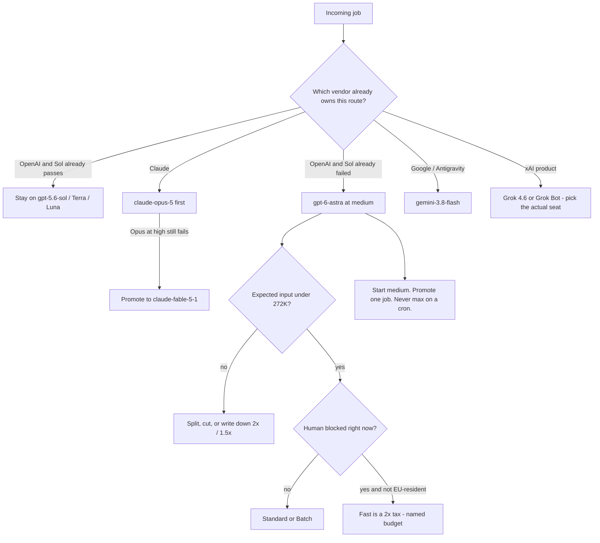

# Where GPT-6 Astra Goes — and Where It Doesn't.

**GPT-6 Astra is the OpenAI flagship seat. It is not the default. Today is September 4, 2026 — one day after ship — and I am writing the router, not a second spec card.** The ID is `gpt-6-astra`. Standard API price is $10 / $50 per million. I start `reasoning.effort` at `medium`. I treat anything past 272K input as a full-request surcharge, not overflow. Fast mode is a 2x tax with no latency SLA. If yesterday's [operator spec card](/blog/gpt-6-astra-launch-operator-spec-card) was the pin table, this post is which loops actually get the pin.

I'm William Spurlock — founder, AI Systems Architect, and Fractional AI CTO. I've built 600+ automations with 500+ still live, spent 20,000+ hours on agentic systems, helped clients delete 35,000+ hours of busywork, and shipped hundreds of production sites. I pay token bills. I do not "upgrade" a classifier because a keynote said flagship.

The cheap OpenAI stack is still GPT-5.6 Sol / Terra / Luna. Claude Fable 5.1 is a promote off Opus 5, not an Astra twin. Gemini 3.8 Flash is yesterday's Flash swap, not a flagship. Grok 4.6 is a different vendor. I will not flatten those names.

| Vendor | Use this | Role this week | Do not flatten into |
|--------|----------|----------------|---------------------|
| OpenAI | **GPT-6 Astra** (`gpt-6-astra`) | Flagship, September 3 | Sol / Terra / Luna stay the cheaper stack |
| OpenAI | **GPT-5.6 Sol** (`gpt-5.6-sol`) | Volume default | Not "old GPT" |
| Anthropic | **Claude Fable 5.1** (`claude-fable-5-1`) | Promote when Opus 5 at high effort still fails | Not a replacement for Opus |
| Google | **Gemini 3.8 Flash** (`gemini-3.8-flash`) | Current Flash, Antigravity default | 3.7 Flash stays the efficiency fallback |
| xAI | **Grok 4.6** (`grok-4.6`) | xAI flagship | Not Grok Bot, not Cursor's Grok label |

For last spring's three-vendor map, use the [May 2026 frontier comparison](/blog/anthropic-openai-google-frontier-may-2026). That post is history. This one is the September 4 invoice rule.

---

## How should operators route GPT-6 Astra vs cheaper models?

**Give Astra the hard end-to-end jobs Sol already fails. Leave passing volume on cheaper IDs. Pin `medium` effort. Split or refuse any Astra call you expect to cross 272K input. Leave Fast off unless a human is waiting and the 2x line is written down.** That is the whole router. The [API model page](https://developers.openai.com/api/docs/models/gpt-6-astra) says Astra is built for the hardest end-to-end work — reasoning, coding, computer use, research, document creation. It does not say "replace `gpt-5.6`."

I run four questions before a node gets `gpt-6-astra`:

1. Did the cheaper ID already pass the eval on this route?
2. Is the expected input under 272K, or do I have a split plan?
3. Is `reasoning.effort` named, and is it `medium` unless I have a reason?
4. Is Fast / Batch / Flex chosen on purpose, or inherited from a demo?

If (1) is yes, the route stays. Sol's [API page](https://developers.openai.com/api/docs/models/gpt-5.6-sol) still lists $4 / $20 per million on promotional rates through at least November 21, 2026, same 1,050,000-token window as Astra. Astra is 2.5x that sticker. "Same window" is how people light money on fire.

The lane card I am taping next to n8n:

| Job | ID I send | Effort I start | Hard no |
|-----|-----------|----------------|---------|
| Standing classify / extract / draft that already passes | `gpt-5.6-sol` (or Terra / Luna) | Sol default `medium`, or `none` if the route already used it | Do not "upgrade" the label |
| Hard computer-use, long Codex, research that Sol failed | `gpt-6-astra` | `medium`, promote to `high` if the first pass is thin | `max` on a cron |
| Claude hard reasoning | `claude-opus-5` first | Opus default `high` | Jump to Fable because Astra exists |
| Claude job Opus at high effort still fails | `claude-fable-5-1` | Fable default `high` | Treat Fable as the new Opus |
| Google agent / Antigravity | `gemini-3.8-flash` | `thinking_level` `MEDIUM` | Point Flash at an Astra job because both windows look like "a million" |
| Cheap Google loop | `gemini-3.7-flash` | `LOW` | Burn 3.8 `HIGH` on a classifier |
| xAI-native work | `grok-4.6` | Named, not Cursor's Extra High Fast Task slug | Send `cursor-grok-4.6-xhigh-fast` to `api.x.ai` — that slug stays in [Cursor](/blog/grok-4-6-extra-high-fast-in-cursor) |

OpenAI's [latest-model guide](https://developers.openai.com/api/docs/guides/latest-model?model=gpt-6-astra) claims Astra can finish some tasks with fewer output tokens, so estimated cost per task can fall even at $10 / $50. I will accept that as a vendor claim. I will not accept it as a standing-node default. Price-per-task is a measured retry curve. Price-per-million is the card. I already wrote how I [price an automation before I build it](/blog/how-to-calculate-the-roi-of-ai-automation-before-you-build-anything). This post is the Astra inputs to that habit.

Tool calling on Astra wants the Responses API. Chat Completions still exists. If the loop needs computer use, MCP, hosted shell, or apply patch, I do not leave it on Completions and then blame the model. That split is in the same [model guide](https://developers.openai.com/api/docs/guides/latest-model?model=gpt-6-astra).

I am not rewriting the studio because a flagship shipped. I am adding one expensive seat and keeping the cheap ones honest.



Failure modes I keep seeing on launch week, so I write them down before someone ships them:

| Move | What actually happens | What I do instead |
|------|----------------------|-------------------|
| Default every OpenAI node to Astra | $10 / $50 on work Sol already finished at $4 / $20 | Named flagship route only |
| Copy launch-bench `max` into the node | Output tokens balloon on the $50 meter | `medium`, then one promote |
| Attach the repo "for context" | 272K trapdoor reprices the files you needed and the ones you did not | Count first; split or cut |
| Enable Fast studio-wide | 2x with no SLA; 400s on EU residency | Off unless a human is waiting |
| Point a Gemini or Claude route at Astra because both windows are "a million" | You bought a vendor hop, not a better job | Keep the vendor; promote inside the family |
| Retry an API stop as if it were a timeout | You pay again for a refusal | Terminal error. Read the stop. |

---

## Where does Astra go versus Sol, Fable 5.1, and Gemini 3.8 Flash?

**Astra goes on OpenAI jobs Sol cannot finish cleanly. It does not eat Sol. It does not replace Opus 5. It does not make Gemini 3.8 Flash a flagship.** Four IDs, four bills. I already compared benches on the [spec card](/blog/gpt-6-astra-launch-operator-spec-card). Today I am comparing seats.

| Seat | ID | Window / max out | Sticker (per 1M) | Cache read | Job I give it today |
|------|----|------------------|------------------|------------|---------------------|
| OpenAI flagship | `gpt-6-astra` | 1,050,000 / 128,000 | $10 / $50 | $1.00 | Hard computer-use, long Codex I am supervising, research Sol failed |
| OpenAI volume | `gpt-5.6-sol` | 1,050,000 / 128,000 | $4 / $20 promo through Nov 21, 2026 | $0.40 | Standing volume that already passes |
| Anthropic promote | `claude-fable-5-1` | 1M / 128K | $10 / $50 | $0.25 | Jobs [Opus 5 at high effort still fails](/blog/claude-fable-5-1-mythos-5-1-operator-stack) |
| Anthropic default complex | `claude-opus-5` | 1M / 128K | $5 / $25 | 10% of input | First Claude pass |
| Google current Flash | `gemini-3.8-flash` | 1,048,576 / 65,536 | Intro $0.75 / $3.75 through Dec 31, 2026 | Flash cache card | Antigravity default, Google agent loops |
| Google efficiency | `gemini-3.7-flash` | Same Flash window | Same intro family | Same family | Classifiers, high-QPS drafts |

Official sources for that table: [Astra API page](https://developers.openai.com/api/docs/models/gpt-6-astra), [Sol API page](https://developers.openai.com/api/docs/models/gpt-5.6-sol), [Fable 5.1 overview](https://platform.claude.com/docs/en/models/fable-5-1/overview), [Gemini 3.8 Flash API page](https://ai.google.dev/gemini-api/docs/models/gemini-3.8-flash) plus Google's [September 2 launch post](https://blog.google/innovation-and-ai/models-and-research/gemini-models/3-8-flash-and-3-8-flash-cyber/).

Where Astra earns the ID on my desk:

- Computer-use loops Sol already burned retries on. OpenAI's launch numbers on the spec card put OSWorld 2.0 around 72.6% and ~40 minutes per task for Astra versus 65.7% and ~75 minutes for Sol. Faster loops can beat a cheaper sticker. Unmeasured loops cannot.
- Long Codex jobs where notes across windows matter. That is a Codex feature, not a reason to point every Cursor tab at `$50` output. Daily IDE routing still lives in the [coding assistant showdown](/blog/complete-ai-coding-assistant-showdown) and the [Cursor / Claude Code daily workflow](/blog/cursor-claude-code-daily-workflow).
- Research / document jobs that need 128K out and a human reading the artifact.

Where Astra does not go:

- Any OpenAI route that already passes on Sol, Terra, or Luna. Same 1.05M window. Different invoice.
- Claude routes. Fable is $10 / $50 with cache reads at $0.25. I [promote from Opus 5](/blog/claude-fable-5-1-mythos-5-1-operator-stack). I do not hop vendors because both stickers match.
- Google / Antigravity routes. 3.8 Flash is the current Flash at intro $0.75 / $3.75. I already wrote the [operator swap](/blog/gemini-3-8-flash-operator-swap). Output cap is 65,536 versus Astra's 128,000. If the job writes a long artifact on Google, I still do not silently move it to OpenAI.
- Grok Bot teammate work. That is a standing product, not an Astra seat. Cursor Tasks pin [Extra High Fast](/blog/grok-4-6-extra-high-fast-in-cursor).
- Anything that smells like exploit development. The [system card](https://deploymentsafety.openai.com/gpt-6-astra) is the first Critical cyber threshold ship. Default Astra refuses advanced cyber work. Daybreak is the named defensive path. I will not write a walkthrough.

Fable still wins the cache-heavy Claude loop even at the same $10 / $50 sticker. 3.8 Flash still wins the cheap Google loop even when the input caps look related. Astra wins when the OpenAI job is hard and I am willing to pay flagship rates to finish it once.

I do not pick "the new frontier model." I pick a seat.

## Why is medium the default effort — and when do xhigh and max show up?

**I start Astra at `medium`. I promote one job to `high` when the first pass is thin. `xhigh` and `max` are rare, watched, and never a cron default.** The [Astra API page](https://developers.openai.com/api/docs/models/gpt-6-astra) lists five values: `low`, `medium`, `high`, `xhigh`, `max`. The [latest-model guide](https://developers.openai.com/api/docs/guides/latest-model?model=gpt-6-astra) is explicit: Astra does **not** support `none`. Launch benches used "maximum at any effort." That is how you print a chart. That is not how I price a standing agent.

Sol is the contrast. The [Sol API page](https://developers.openai.com/api/docs/models/gpt-5.6-sol) accepts `none`, `low`, `medium` (API default), `high`, `xhigh`, and `max`. If a Sol classifier already runs at `none`, I do not migrate it to Astra and inherit a thinking meter. The guide says: if you currently use `none` or `minimal`, start Astra at `low` and compare. Otherwise keep the effective effort you already had. I still override that to `medium` on new Astra routes unless the job is a short rewrite.

| Effort | When I set it | What I refuse |
|--------|---------------|---------------|
| `low` | Migrating a Sol `none` / `minimal` route I am testing on Astra | Using `low` as a way to pretend Astra is cheap |
| `medium` | Default on every new Astra route | Leaving effort blank so a playground leftover wins |
| `high` | First promote after `medium` failed a named eval | `high` on extractors |
| `xhigh` | One-off, human watching, written budget | Nightly batch |
| `max` | Same as `xhigh`, plus I am in the session | Personality. "Just make it smarter." |

Promote rule I actually run:

1. Ship the route at `medium`.
2. If the eval fails for quality, not for missing context, retry once at `high`.
3. If `high` still fails and a human will read the output, I may spend `xhigh` or `max` on that single job.
4. If `max` fails, I do not raise effort again. I split the prompt, add the missing file, or admit the job belongs on Fable or a human.

OpenAI lets me change effort mid-conversation without rewriting the prompt prefix. The mechanism is a `configuration_update` input item on the Responses API, documented in the [latest-model guide](https://developers.openai.com/api/docs/guides/latest-model?model=gpt-6-astra). Request-level `reasoning.effort` stays put so the cache prefix lives. I use that to bump one hard turn, then drop back. I do not leave `max` sticky on a 40-turn agent because turn three was ugly.

Fable's default effort is `high` and thinking is always on — [Fable overview](https://platform.claude.com/docs/en/models/fable-5-1/overview). Gemini 3.8 Flash uses `thinking_level` `LOW` / `MEDIUM` / `HIGH`, not this enum. I already wrote that [Flash swap](/blog/gemini-3-8-flash-operator-swap). Do not copy `xhigh` into a Gemini payload. Do not copy `HIGH` into Astra.

Output tokens are the silent bill. Higher effort mints more thinking tokens. Those tokens sit on the $50 output meter, or $75 if you already crossed 272K. I do not set `max` "because the science bench moved." I set `max` when I am watching the session and I can kill it.

---

## What does the 272K surcharge actually do to the invoice?

**Cross 272,000 input tokens and OpenAI reprices the entire Astra request: 2x input and cache, 1.5x output. Not the overflow. The whole request.** That sentence is on the [Astra API page](https://developers.openai.com/api/docs/models/gpt-6-astra). Sol has the same trapdoor on its [own page](https://developers.openai.com/api/docs/models/gpt-5.6-sol). A 400K dump is not "a little more context." It is a different rate card on tokens you already sent.

Standard Astra, no Fast, no tool fees:

| Meter | Under 272K input | Over 272K input (full request) |
|-------|------------------|--------------------------------|
| Input | $10 / 1M | $20 / 1M |
| Cached input | $1 / 1M | $2 / 1M |
| Cache writes | $12.50 / 1M | $25 / 1M |
| Output | $50 / 1M | $75 / 1M |

Worked examples I put on the finance sheet. Assume Standard, no cache, no Fast, no computer-use fees:

| Request | Input | Output | Rate card | Math | Ballpark |
|---------|-------|--------|-----------|------|----------|
| Clean coding ask | 80,000 | 4,000 | Under | 0.08 × $10 + 0.004 × $50 | $1.00 |
| Same job on Sol promo | 80,000 | 4,000 | Under | 0.08 × $4 + 0.004 × $20 | $0.40 |
| Fat repo "just in case" | 300,000 | 8,000 | Over | 0.3 × $20 + 0.008 × $75 | $6.60 |
| Same 300K at `max`, out bloats to 40,000 | 300,000 | 40,000 | Over | 0.3 × $20 + 0.04 × $75 | $9.00 |
| 200K that stayed under the line | 200,000 | 8,000 | Under | 0.2 × $10 + 0.008 × $50 | $2.40 |
| 280K that tripped it by 80K | 280,000 | 8,000 | Over | 0.28 × $20 + 0.008 × $75 | $6.20 |

The last two rows are the lesson. Adding 80K of "maybe useful" files did not add 40% to the bill. It more than doubled it, because the first 200K also repriced. If a Cursor or n8n route dumps the repo because the failing file felt lonely, you pay the surcharge even when the model only needed that file.

Sol's version of the same 300K / 8K job: 2x on $4 and 1.5x on $20, so 0.3 × $8 + 0.008 × $30 = $2.64. Still cheaper than Astra under the line. Crossing 272K does not make Astra "about the same as Sol." It makes Astra more expensive than the expensive card.

Hard ask I run before any Astra call I expect near the line:

1. What is the token count of the files that failed?
2. What is the token count of the files I am attaching "for context"?
3. If (1)+(2) > 272K, what do I cut so the request stays under?
4. If I cannot cut, do I split into two under-line calls, or do I accept $20 / $75 and write it down?

I do not "just send it." The window goes to 1,050,000 with a 922,000 max input, per the [API page](https://developers.openai.com/api/docs/models/gpt-6-astra). The finance window ends at 272K. Those are different numbers. I keep both.

Split example I actually run when a 360K bundle shows up. Three files: 90K failing module, 80K tests, 190K "related" packages.

| Plan | What I send | Rate card | Why |
|------|-------------|-----------|-----|
| A — dump all 360K | One Astra call | Over: $20 / $75 | Lazy. Pays the trapdoor on the packages I never needed. |
| B — failing module + tests | 170K | Under: $10 / $50 | Usually enough. If it fails, I add one package. |
| C — two under-line calls | 170K then 90K of one package | Two Standard cards | Still cheaper than one 360K reprice if both stay under. |
| D — accept the surcharge | 360K, written down | Over: $20 / $75 | Only when B and C already failed and a human is reading. |

Plan A is how people discover the invoice. Plan B is the default. Plan C is the fallback. Plan D is a decision, not a habit.

Batch does not erase the trapdoor. Batch is 50% of the applicable card. A 360K Batch call is half of $20 / $75, not half of $10 / $50. Offline is cheaper. It is not free of the line.

Knowledge cutoff on that same page is April 30, 2026. Today is September 4. Fable 5.1, Gemini 3.8 Flash, and Astra's own launch notes are after the cutoff unless I attach docs or turn on web search. Pasting a 400K "everything we shipped this summer" bundle is how you buy the surcharge and still get a stale answer.

---

## Why is Fast mode a 2x tax, not a speed upgrade?

**Fast mode prices Astra at 2x the applicable rates. It has no latency SLA. It is unavailable with EU data residency.** The 2x line is on the [Astra API page](https://developers.openai.com/api/docs/models/gpt-6-astra). The SLA and residency limits are in the [latest-model guide](https://developers.openai.com/api/docs/guides/latest-model?model=gpt-6-astra). [The launch post](https://openai.com/index/gpt-6-astra/) sold "up to 2x Standard speed." I buy speed when a human is blocked. I do not buy a hope multiplier on a nightly job.

Applicable rates means Fast stacks. It is not 2x of the pretty $10 / $50 card no matter what.

| Mode | Under 272K in / out | Over 272K in / out | When I use it |
|------|---------------------|--------------------|---------------|
| Standard | $10 / $50 | $20 / $75 | Default Astra lane |
| Batch or Flex | 50% of applicable = $5 / $25 under | 50% of the long card | Offline evals, async backfills |
| Fast | 2x applicable = $20 / $100 under | 2x long card = $40 / $150 | Human waiting, written budget |
| Fast + over 272K + `max` out | Do not | Do not | I will not combine all three taxes |

Same 80K / 4K ask:

| Mode | Math | Ballpark |
|------|------|----------|
| Astra Standard | 0.08 × $10 + 0.004 × $50 | $1.00 |
| Astra Fast | 0.08 × $20 + 0.004 × $100 | $2.00 |
| Astra Standard over the line at 300K / 8K | 0.3 × $20 + 0.008 × $75 | $6.60 |
| Astra Fast over the line at 300K / 8K | 0.3 × $40 + 0.008 × $150 | $13.20 |
| Sol promo Standard, 80K / 4K | 0.08 × $4 + 0.004 × $20 | $0.40 |

Fast on a clean 80K job is a $1 tax to maybe return sooner, with no SLA. Fast on a 300K dump is a $13 bill that still might sit in queue. I will pay the first tax when a client is on the call and the loop is the blocker. I will not enable `service_tier: "fast"` studio-wide because a launch sentence said "up to 2x."

EU data residency: Fast and Priority are off for Astra. If the workspace is EU-resident, Standard is the lane. Do not leave Fast in the payload and debug a mystery 400.

Batch and Flex are the discount I actually use: 50% of Standard, same page. Offline evals, replay suites, overnight backfills. That is how I compare Sol versus Astra on a fixed set without paying interactive rates for a spreadsheet.

Computer-use and search still add per-call fees on top of whatever tier you picked. Fast does not include those. I will not pretend the token card is the whole invoice when the model is clicking a desktop.

---

## How do cache reads change the Astra vs Fable vs Sol math?

**Astra cache reads are $1 per million. Sol is $0.40. Fable 5.1 is $0.25. Same $10 / $50 sticker as Fable is not the same invoice if the loop is cache-heavy.** Astra and Sol numbers are on their [API pages](https://developers.openai.com/api/docs/models/gpt-6-astra). Fable's cache read is on the [Fable 5.1 overview](https://platform.claude.com/docs/en/models/fable-5-1/overview) — 2.5% of input, not the usual 10%. Cache writes on Astra are $12.50, which is the documented 1.25x uncached input.

| Model | Uncached in | Cache write | Cache read | Out |
|-------|-------------|-------------|------------|-----|
| `gpt-6-astra` | $10 | $12.50 | $1.00 | $50 |
| `gpt-5.6-sol` | $4 | 1.25 × $4 = $5.00 | $0.40 | $20 |
| `claude-fable-5-1` | $10 | $12.50 (5m) / $20 (1h) | $0.25 | $50 |
| `claude-opus-5` | $5 | 1.25x family | 10% of input | $25 |
| `gemini-3.8-flash` (intro) | $0.75 | Flash card | Flash card | $3.75 |

Eighty thousand cached input tokens plus 4,000 output, under 272K, Standard, no Fast:

| Model | Cache-read math | Ballpark |
|-------|-----------------|----------|
| Astra | 0.08 × $1 + 0.004 × $50 | $0.28 |
| Sol | 0.08 × $0.40 + 0.004 × $20 | $0.11 |
| Fable | 0.08 × $0.25 + 0.004 × $50 | $0.22 |

Uncached, that same 80K / 4K is $1.00 on Astra and $1.00 on Fable. Cached, Fable pulls ahead by a few cents per call. On a 10,000-call agent loop that hits the prefix every turn, cents become the month. That is why I keep Fable as a Claude promote with a cache story, and Astra as an OpenAI flagship with a $1 cache read — not as twins.

Rules I actually enforce:

- Stable system prompt and tool schemas go first, so the prefix can cache. Do not interpolate the date, a UUID, or the whole ticket into the first 2K tokens.
- Change effort with `configuration_update` instead of rewriting `reasoning.effort` on the request. The [guide](https://developers.openai.com/api/docs/guides/latest-model?model=gpt-6-astra) is there so the prefix survives a bump from `medium` to `high`.
- Crossing 272K doubles the cache rates too. A "cached" 300K prompt is $2 / 1M to read, not $1, and $25 / 1M to write. Cache does not save you from the trapdoor. It just makes the trapdoor 10% instead of 100% — still on the doubled card.
- Migrating from GPT-5.5 or earlier: replace `prompt_cache_retention` with `prompt_cache_options.ttl` set to `"30m"`. That is a breaking cache change in the same guide. A dead cache looks like "Astra is expensive." It is often "you are writing the prefix every call at $12.50."

I do not pick Astra to win a cache contest against Fable. I pick Astra when the OpenAI job is hard. I pick Fable when the Claude job is hard and the prefix will be reread. I pick Sol when the OpenAI job is not hard. Cache math is how I keep those three sentences from collapsing into one sticker.

## What stays on Sol, Terra, and Luna after Astra shipped?

**Anything that already passes stays on GPT-5.6.** OpenAI did not ship a GPT-6 Sol, Terra, or Luna. The cheap stack is still 5.6. The [Sol API page](https://developers.openai.com/api/docs/models/gpt-5.6-sol) still calls Sol a flagship for complex professional work, lists the `gpt-5.6` alias as routing to Sol, and keeps promotional $4 / $20 pricing through at least November 21, 2026. Astra is "most capable." Sol is still the volume ID I pay.

Terra and Luna stay in the 5.6 family for the cheaper / faster OpenAI seats I already wired. I am not publishing a new 5.6 teardown today. I am saying: do not delete those strings because Astra exists.

| Route pattern | Stays on | Moves to Astra |
|---------------|----------|----------------|
| Classifier, tagger, router, draft that already hits the eval | Sol / Terra / Luna | No |
| Structured extract with a schema that already validates | Sol | No |
| Nightly batch of 10k similar prompts | Sol on Batch, or Astra Batch only after a measured win | Not interactive Fast |
| Hard computer-use Sol already failed twice | — | Yes, `medium`, Responses API |
| Long Codex refactor I will supervise | — | Yes, notes on, effort named |
| `gpt-5.6` alias with no one sure which sibling it hits | Pin `gpt-5.6-sol` explicitly | Do not "fix" an alias by pointing it at Astra |

Sol still has the 272K full-request surcharge. It still has computer use. It still has a 1,050,000 window. The difference I care about on September 4 is the sticker and the fact that Sol accepts `none`. Astra does not. A Sol `none` classifier that "just works" is not an Astra candidate.

Promo clock: $4 / $20 is promotional through at least November 21, 2026, per Sol's page. I do not assume it is forever. I also do not panic-migrate to Astra in October "before the promo ends." If Sol's card moves, I re-price the volume routes. I do not treat a price sunset as a quality argument.

If someone on a client Slack says "swap every OpenAI node to Astra," I ask for the eval that Sol is failing. No failing eval, no swap. Launch-day energy is how you discover a $50 output meter on a job that was making $0.40 decisions.

---

## What do I pin in n8n and Cursor today?

**A short pin list. One new expensive seat. No architecture rewrite.** I have watched launch-week "upgrades" turn a working Sol node into a Fast-mode heater that also crossed 272K because someone attached the repo.

This is the prompt I paste into Cursor when I want the router written without a creative restack:

```
Same-week GPT-6 Astra router. Do not invent a new architecture.

1. Add gpt-6-astra as a named flagship route. Do not replace every OpenAI ID.
2. Leave GPT-5.6 Sol / Terra / Luna on standing volume that already passes evals.
3. Set reasoning.effort to medium on new Astra routes. Promote one job to high if medium fails a named eval. xhigh/max only when a human is watching.
4. Astra does not accept effort none. If a Sol route used none or minimal, test Astra at low or keep the route on Sol.
5. Reject or split any Astra request expected to cross 272K input. Full-request surcharge: 2x in/cache, 1.5x out.
6. Fast mode is a 2x tax, no SLA, off for EU data residency. Do not enable it studio-wide.
7. Agents that need tools go on the Responses API, not Chat Completions.
8. Change effort mid-thread with configuration_update so the cache prefix lives.
9. Do not point Claude or Gemini routes at Astra because the windows look similar.
10. Do not add Daybreak, exploit tooling, or a cyber alias.

Print a table: route, old ID, new ID, effort, expected input vs 272K, Fast/Batch/Flex, kept-on-cheap reason.
```

Checklist I tick before the PR:

| Check | Pass looks like |
|-------|-----------------|
| Model string | `gpt-6-astra` on the new lane only |
| Cheap IDs | Still present on passing volume |
| Effort | Explicit enum. Default `medium` |
| 272K | Expected input named. Split plan or written surcharge |
| Fast | Off unless the route label says human-blocked |
| Batch | Used for offline evals at 50% |
| Responses vs Completions | Agents on Responses |
| Cache prefix | Stable; no date/UUID in the first chunk |
| Stop handling | API stop is terminal, not a retry loop |
| Rollback | Old ID still in config, not in a chat log |

What I want in the PR description:

| Field | I will reject if blank |
|-------|------------------------|
| Route name | "all OpenAI calls" is not a route |
| Old ID | Must name Sol, Terra, Luna, or a leftover 5.5 string |
| New ID | `gpt-6-astra` or "no change" |
| Effort | One of the five Astra enums, or "stays on Sol" |
| Expected input size | Under or over 272K, with a reason |
| Fast / Batch / Flex | Named, not inherited |
| Eval | The check that already passed on the cheap ID |
| Rollback | The old ID still in the repo |

No eval, no ship. If the request is really "should we spend Astra tokens on this workflow," I run the [ROI habit](/blog/how-to-calculate-the-roi-of-ai-automation-before-you-build-anything): name the hours, name the token path, name the failure cost. This post is the rate card. That post is whether the workflow deserves any model.

n8n / MCP fields I look at before I call the route "pinned." I will not drop an SDK tutorial here. If the node still sends last month's 5.6 ID, that is a string edit. If the node sends 400K of repo into Astra on Fast, that is a finance edit.

| Surface | Field I pin | Wrong leftover |
|---------|-------------|----------------|
| OpenAI node / HTTP | `model`: `gpt-6-astra` on the new lane | A workspace default that silently swapped every node |
| Effort | `reasoning.effort` or `reasoning_effort` = `medium` | Blank, `max`, or Sol's `none` |
| Service tier | Standard; Batch on evals; Fast only if labeled | `fast` copied from a playground snippet |
| API | Responses for tool loops | Completions plus a comment that "tools should still work" |
| Input budget | Hard cap or split before 272K | "Send the collection; the window is a million" |
| Cache | Stable prefix; TTL `"30m"` if you migrated off `prompt_cache_retention` | Date, ticket ID, or UUID in the first chunk |
| Errors | Stop / misalignment = fail the item | Retry-until-success on a refusal |

Google Antigravity stays on 3.8 Flash unless I have a reason to leave Google. The [Antigravity agents blueprint](/blog/google-antigravity-agents-blueprint) is still the map for that IDE. Astra is not an Antigravity default.

---

## Frequently asked questions

### How should operators route GPT-6 Astra vs cheaper models?

**Astra on the hard OpenAI jobs Sol already fails. Sol / Terra / Luna on passing volume. Fable only after Opus 5 at high effort fails. 3.8 Flash on Google. `medium` effort. Split or refuse 272K. Fast off unless a human is waiting.** Full receipts sit on the [Astra API page](https://developers.openai.com/api/docs/models/gpt-6-astra), the [Sol API page](https://developers.openai.com/api/docs/models/gpt-5.6-sol), the [Fable overview](https://platform.claude.com/docs/en/models/fable-5-1/overview), and the [3.8 Flash swap](/blog/gemini-3-8-flash-operator-swap).

### Should I make gpt-6-astra the default OpenAI model?

**No.** Astra is 2.5x Sol's promotional $4 / $20 sticker, does not accept `none`, and reprices the full request past 272K. The [latest-model guide](https://developers.openai.com/api/docs/guides/latest-model?model=gpt-6-astra) tells you to set `model` to `gpt-6-astra` when you build with Astra. It does not tell you to delete `gpt-5.6-sol`. Default is a finance decision.

### What reasoning.effort should I use on GPT-6 Astra?

**`medium` on new routes. `high` as the first promote. `xhigh` / `max` only when I am watching.** The [API page](https://developers.openai.com/api/docs/models/gpt-6-astra) lists `low`, `medium`, `high`, `xhigh`, `max`. Launch benches used maximum-at-any-effort. I do not copy a bench setting into a cron.

### What happens if my prompt crosses 272K input tokens?

**The entire request bills at 2x input and cache and 1.5x output.** A 280K prompt does not pay extra only on the last 8K. The first 272K reprices too. That rule is on the [Astra API page](https://developers.openai.com/api/docs/models/gpt-6-astra). I split, cut, or write down $20 / $75 before I send.

### Is GPT-6 Astra Fast mode worth it?

**Only when a human is blocked and the 2x line is in the budget.** Fast is 2x applicable rates, has no latency SLA, and is off for EU data residency per the [model guide](https://developers.openai.com/api/docs/guides/latest-model?model=gpt-6-astra). Fast plus a 272K dump is $40 / $150. I will not enable it studio-wide.

### Does GPT-6 Astra replace GPT-5.6 Sol?

**No.** Sol, Terra, and Luna stay the cheaper OpenAI stack. Sol still has a 1,050,000-token window and $4 / $20 promotional pricing through at least November 21, 2026 on the [Sol API page](https://developers.openai.com/api/docs/models/gpt-5.6-sol). The `gpt-5.6` alias still routes to Sol. I move jobs Sol fails. I leave jobs Sol passes.

### When should I pick Claude Fable 5.1 instead of Astra?

**When the job is already on Claude and Opus 5 at high effort still fails.** Fable is $10 / $50 with cache reads at $0.25, always-on thinking, default effort `high` — [Fable overview](https://platform.claude.com/docs/en/models/fable-5-1/overview). Same sticker as Astra, better cache on a stable Claude prefix. I wrote the [promote rule](/blog/claude-fable-5-1-mythos-5-1-operator-stack). Mythos 5.1 is invite-only. I do not have it.

### When should I keep Gemini 3.8 Flash instead of Astra?

**When the job is a Google route, including Antigravity.** 3.8 Flash is intro $0.75 / $3.75 through December 31, 2026, 1,048,576 in, 65,536 out. I already published the [operator swap](/blog/gemini-3-8-flash-operator-swap). Matching "about a million" input caps is not a reason to hop vendors and pay $10 / $50.

### Does GPT-6 Astra support reasoning.effort none?

**No.** The [latest-model guide](https://developers.openai.com/api/docs/guides/latest-model?model=gpt-6-astra) says Astra does not support `none`. If a Sol route used `none` or `minimal`, start Astra at `low` and compare, or keep the route on Sol. Do not send `none` and debug a mystery 400.

### How much cheaper is GPT-5.6 Sol than Astra on the sticker?

**Sol is $4 / $20 per million on promotional rates through at least November 21, 2026. Astra is $10 / $50. That is 2.5x on both meters.** Sol cache reads are $0.40 versus Astra's $1. Both have the 272K full-request surcharge. Sources: [Sol](https://developers.openai.com/api/docs/models/gpt-5.6-sol) and [Astra](https://developers.openai.com/api/docs/models/gpt-6-astra) API pages. Tool fees sit on top of both.

### Can I change Astra effort mid-conversation without busting the cache?

**Yes, with a `configuration_update` input item on the Responses API, while leaving request-level `reasoning.effort` unchanged.** That is the [official migration note](https://developers.openai.com/api/docs/guides/latest-model?model=gpt-6-astra). I use it to bump one hard turn from `medium` to `high`, then drop back. Rewriting the request-level effort is how you pay $12.50/1M to write the same prefix again.

### Is Fast mode available with EU data residency?

**No.** The [latest-model guide](https://developers.openai.com/api/docs/guides/latest-model?model=gpt-6-astra) says Fast and Priority are unavailable for GPT-6 Astra with EU data residency. Use Standard. Do not leave `service_tier: "fast"` in the payload.

---

If Astra is the default OpenAI node, Fast is on studio-wide, or a repo dump is crossing 272K, that is the invoice I fix as Fractional AI CTO. Book an [AI automation strategy call](/contact) and I will name which loops stay on Sol, which earn `gpt-6-astra` at `medium`, and which 272K / Fast taxes you stop paying — or we staff a [custom agent team](/contact) that already has those seats written down. I have done this across 600+ automations. Flagship is a seat. It is not a studio-wide swap.
