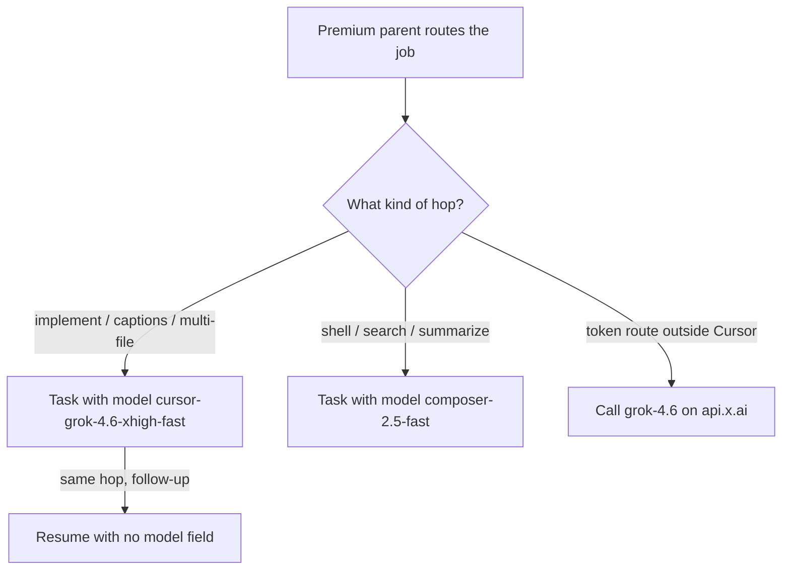

# Grok 4.6 Extra High Fast in Cursor Is the Subagent Default. Pin It.

**I daily-drive Cursor. The implementer hop is Grok 4.6 Extra High Fast. The Task allowlist slug is `cursor-grok-4.6-xhigh-fast`. I set that as the default on August 16, 2026, and every Task still has to name it — omit `model` and the hop inherits the parent.** If the parent is a premium Claude or GPT route, that inheritance is a money leak, not a convenience. The slug stays inside Cursor. It is not an API ID.

I'm William Spurlock — founder, AI Systems Architect, and Fractional AI CTO. I've built 600+ automations with 500+ still live, spent 20,000+ hours on agentic systems, helped clients delete 35,000+ hours of busywork, and shipped hundreds of production sites. I pay the Cursor bill and the xAI invoice as two different surfaces. I do not flatten them.

Today is September 3, 2026. [xAI's Grok 4.6 launch post](https://x.ai/news/grok-4-6) is three weeks old. The [developer page](https://docs.x.ai/developers/grok-4-6) still lists one public model name: `grok-4.6`. Cursor has 4.6 on every plan. Extra High Fast is how I dispatch the disposable worker. If you want the editor-plus-terminal rhythm this hop sits inside, I already wrote the [Cursor and Claude Code daily workflow](/blog/cursor-claude-code-daily-workflow). That post is the day shape. This one is the Task pin.

The API pin, the 200k whole-request double, and the missing Fast API ID live in [Grok 4.6: Pin the ID, Watch the 200k Cliff](/blog/grok-4-6-xhigh-and-the-200k-billing-cliff). This post does not own that lane. Grok Bot is a standing teammate product, not this Task slug.

---

## What is Grok 4.6 Extra High Fast in Cursor?

**Grok 4.6 Extra High Fast is Anysphere's Task/subagent route for Grok 4.6, not SpaceXAI's public model name.** I say Extra High Fast out loud. I type `cursor-grok-4.6-xhigh-fast` on the Task. I type `grok-4.6` in the picker and on `api.x.ai`. Those are three objects. One noun ("Grok") will wreck the invoice.

The [developer page](https://docs.x.ai/developers/grok-4-6) says Grok 4.6 is available in Cursor on all plans. The [launch post](https://x.ai/news/grok-4-6) said the same on August 12. Extra High Fast is the hop I added on August 16 so a premium parent can stay on the routing decision while the implementer does the file work.

| Object | Spoken name | String I type | Surface |
|--------|-------------|---------------|---------|
| Flagship model | Grok 4.6 | `grok-4.6` | Cursor picker, Grok Build, `api.x.ai` |
| Task default | Grok 4.6 Extra High Fast | `cursor-grok-4.6-xhigh-fast` | Cursor Task / subagent only |
| Slower 4.6 hop | Grok 4.6 Extra High | `cursor-grok-4.6-xhigh` | Cursor Task, only when I ask |
| Cheap floor | Composer 2.5 Fast | `composer-2.5-fast` | Shell, search, summarization |
| Teammate product | Grok Bot | A named bot in the Grok Bot app | Not a Task slug |

I do not treat Extra High Fast as "Grok, but quicker." The Fast in the spoken name is Cursor's Task variant. The [launch post](https://x.ai/news/grok-4-6) mentions a fast API variant at twice the price and does not publish a public code. I will not invent `grok-4.6-fast` because the Task slug has `-fast` on the end. That hyphen folklore is how an n8n node dies on a Saturday. The cliff post owns the no-ID rule. I just refuse to import it into Cursor.

What Extra High Fast is for, on my desk:

1. **Implementation hops.** Multi-file edits, captions, batch writes, one-job authoring.
2. **Vision-capable batch work** when the Task is looking at images and writing files.
3. **Keeping the parent expensive on purpose.** The parent decides. The hop executes.

What it is not:

| Temptation | Reality |
|------------|---------|
| "The cheap default if I omit `model`" | Omit `model` and you inherit the parent. There is no silent cheap fallback |
| "The xAI Fast ID" | There is no official Fast API ID on the [developer page](https://docs.x.ai/developers/grok-4-6) |
| "The picker string" | The picker gets `grok-4.6` |
| "A standing teammate" | Wrong object for a Task slug |

If a contractor writes "we upgraded Grok in Cursor" and cannot tell me which of those four strings left the building, they did not pin anything. They renamed a vibe.

---

## Why must every Task set model?

**Omitting `model` does not pick Extra High Fast. It inherits the parent.** If the parent is a premium Claude or GPT route, the subagent is that premium route. I have burned real money on that miss. It is the first operator rule, not a style note.

The Task contract is blunt: no `model` field means same model as the parent agent. My August 16 default is a standing instruction for *this* shop. The tool does not read my mind. If a hop ships without the field, Cursor did what the contract says.

| How the Task is launched | What actually runs | What I do |
|--------------------------|--------------------|-----------|
| `model: "cursor-grok-4.6-xhigh-fast"` | Extra High Fast | Correct default hop |
| `model` omitted, parent is premium Claude / GPT | The premium parent | Kill it. Relaunch with the slug |
| `model` omitted, parent is already Extra High Fast | Extra High Fast by accident | Still a miss. The next parent will not be cheap |
| `model: "cursor-grok-4.6-high-fast"` | Invalid. Not on the allowlist | Do not pass it |
| `model: "cursor-grok-4.5-high-fast"` | Retired 4.5 default | Do not pass it |
| `model: "cursor-grok-4.6-xhigh"` | Slower non-fast 4.6 | Only when I ask |
| `model: "composer-2.5-fast"` | Cheap floor | Shell / search / summarization |

The leak is not theoretical. A parent on a thinking-heavy Claude or GPT slug that fans out ten implementer hops without `model` is ten premium copies. Extra High Fast exists so that fan-out is cheap enough to run and sharp enough to ship. Inheritance deletes the reason I set a default.

Pre-launch check I run in my head before every Task:

1. Is `model` present on this call?
2. Is the value on the allowlist I actually use?
3. If I am launching more than one hop in the same turn, does **each** call set `model` on its own?
4. If I am resuming, did I **leave `model` off** so the prior slug stays, and did I confirm that prior slug was allowed?

Resume is the other half of the same rule. A resume keeps the prior slug. Passing `model` on resume is the wrong move. If the prior hop was a forbidden or retired slug, I do not resume it. I launch fresh with `cursor-grok-4.6-xhigh-fast`.

Parallel is not a shared setting. One message, three Tasks, three `model` fields. A hop that "should just follow the others" is the omitted-field bug with extra steps.

| Pattern | Verdict |
|---------|---------|
| One Task, `model` set to Extra High Fast | Ship |
| Three Tasks in one turn, each with `model` set | Ship |
| Three Tasks in one turn, only the first has `model` | Two inherit the parent. Kill the two |
| Resume with no `model` after a good Extra High Fast hop | Correct |
| Resume with a new `model` "just to be safe" | Wrong. Prior slug is already kept |
| Resume of a retired 4.5 slug | Do not resume. Launch fresh |

I keep the premium parent for the routing decision. I do not hop a Task onto a Claude Opus thinking slug or a GPT flagship slug "because this one is important." Importance is a briefing problem. It is not a reason to copy the parent onto the implementer.

---

## What slug do I pin — and which ones fail?

**I pin `cursor-grok-4.6-xhigh-fast`. I do not pass `cursor-grok-4.6-high-fast`. I do not pass retired `cursor-grok-4.5-high-fast`.** The first missing word (`extra` / `x`) is how people invent a slug that looks right and is not on the allowlist. The 4.5 string is last year's default wearing this year's noun.

The allowlist I actually dispatch from Cursor:

| Slug | Role | When I use it |
|------|------|----------------|
| `cursor-grok-4.6-xhigh-fast` | Default Task / subagent | Implementation, captions, multi-file edits, batch writes |
| `cursor-grok-4.6-xhigh` | Slower non-fast 4.6 | Only when I ask for the slower 4.6 |
| `composer-2.5-fast` | Floor | Shell, search, file-find, summarization, hops where reasoning depth does not matter |
| `gpt-5.4-nano-medium` | Cheapest GPT hop | Short extraction when I explicitly want GPT |
| `gpt-5.4-mini-medium` | Cost-efficient GPT hop | Longer GPT-shaped generation when I ask |
| `gemini-3-flash` / `gemini-3.5-flash` | Gemini hops | Vision or long-context reads when I prefer Gemini for that job |

The two Grok near-misses I reject on sight:

| String | Why it fails |
|--------|----------------|
| `cursor-grok-4.6-high-fast` | Not on the allowlist. Looks like Extra High Fast with the `x` dropped |
| `cursor-grok-4.5-high-fast` | Retired default. 4.5 is not the hop |
| `grok-4.6-fast` | Not a Cursor slug and not an API ID |
| `grok-4.6` on a Task that should be Extra High Fast | That is the picker / API ID. Wrong object |
| `cursor-grok-4.6-xhigh-fast` on `api.x.ai` | Cursor slug in an xAI field. Send it back |

`cursor-grok-4.6-xhigh` is real. It is the slower 4.6. I do not "upgrade" a hop to non-fast because the job feels serious. Serious jobs get a tighter brief or they stay on the premium parent. Non-fast is a latency and depth trade I make on purpose, out loud, in the request.

`composer-2.5-fast` is the floor, not a second default. If the hop is `ls`, `rg`, "summarize this log," or "find the file that owns X," Extra High Fast is wasted depth. If the hop is a 12-file edit with a gate, Composer is the wrong brain.

I do not treat the allowlist as a tasting menu. Extra High Fast is the default. Everything else is an override I can point to.

---

## When does Extra High Fast win, and when do I keep it off the hop?

**Extra High Fast wins implementation hops, captions, multi-file edits, and batch writes. It loses the routing decision, the trivial shell job, and the xAI token route.** I do not run one slug on every surface and call that a stack.

| Job | What I run | Why |
|-----|------------|-----|
| Decide which files move, which model owns the week, whether the hop is even a Task | Premium parent | Routing is the expensive thought. I keep it |
| Implement the files the parent already scoped | `cursor-grok-4.6-xhigh-fast` | This is the default I set on August 16 |
| Captions, batch markdown, multi-file writes with a gate | `cursor-grok-4.6-xhigh-fast` | One job, disjoint ownership, fast enough to fan out |
| `rg`, path lookup, "summarize these five lines," mechanical file move | `composer-2.5-fast` | Reasoning depth is irrelevant |
| Token call outside Cursor — n8n, MCP, a gateway | `grok-4.6` | Official ID on the [developer page](https://docs.x.ai/developers/grok-4-6) |
| Long API loop that might cross 200k prompt tokens | `grok-4.6` plus the 200k rule | Owned by [the cliff post](/blog/grok-4-6-xhigh-and-the-200k-billing-cliff) |
| Slower 4.6 hop I asked for by name | `cursor-grok-4.6-xhigh` | Override, not a mood |

The parent stays expensive because the parent is doing the part I will not delegate: what to build, what not to touch, which vendor noun is current. Extra High Fast is the hop that should not re-litigate the board. If I catch a Task rewriting the model table I pasted, the brief failed, not the slug.

I already compared editors in the [complete AI coding assistant showdown](/blog/complete-ai-coding-assistant-showdown). That post still describes Cursor versus the other desks. This post pins one Task slug inside Cursor. The May snapshot in the [frontier comparison](/blog/anthropic-openai-google-frontier-may-2026) is history. September 3 has a current-model table further down. Paste that table into the hop. Do not let a cheap model invent last year's names.

Where Extra High Fast has earned the default on my workload:

1. **Multi-file implementation with a hard file list.** The parent scoped it. The hop owns those paths and nothing else.
2. **Caption and content batches** that need a current-model table in the prompt so the writer does not emit stale vendor nouns.
3. **Vision plus write** — look at a cover or a screenshot, write the markdown, stop.
4. **Fan-out.** Six disjoint file owners in one turn, each with `model` set, each with a gate.

Where I refuse the default:

| Signal | Move |
|--------|------|
| The hop is "figure out the architecture" | Keep the premium parent. Do not hop it |
| The hop is one shell command and a paste-back | `composer-2.5-fast` |
| The hop will call `api.x.ai` | `grok-4.6`, never the Cursor slug |
| I said "use the slower 4.6" | `cursor-grok-4.6-xhigh` |
| The prompt is a 240k dump "because 4.6 has 500k" | That is an API cliff problem. See [the 200k post](/blog/grok-4-6-xhigh-and-the-200k-billing-cliff) |

xAI's own benches on the [launch post](https://x.ai/news/grok-4-6) are why 4.6 is on the board at all — CursorBench 69.9% at High, a real step off 4.5, not a wipe of Sol or Fable. I do not promote Extra High Fast because of that table. I promote it because it is the allowlist default I can fan out without copying the parent.

---

## How do I brief a Task so Extra High Fast ships?

**One job, disjoint file ownership, the current-model table pasted in, and a gate the hop must run before it talks.** Extra High Fast will happily rewrite the wrong repo if the brief is a vibe. The slug is not the brief.

I daily-drive Cursor the way I wrote in the [daily workflow post](/blog/cursor-claude-code-daily-workflow): parent thinks, editor implements. The Task hop is the implementer. If I skip the file list, I paid for a second architect.

The brief I actually paste:

```
You own ONLY these paths:
- <absolute/path/one>
- <absolute/path/two>
Do not edit any other file. Do not commit. Do not push.

One job: <one sentence>. Stop when that job is done.

Model on this Task is already cursor-grok-4.6-xhigh-fast.
Do not send that string to api.x.ai.
Do not invent grok-4.6-fast. The public API ID is grok-4.6.

Current-model table (stale names are errors):
| Vendor | Use this | Role | Do not flatten into |
|---|---|---|---|
| OpenAI | GPT-6 Astra (gpt-6-astra) | Flagship, Sep 3 | GPT-5.6 Sol / Terra / Luna cheaper stack |
| Anthropic | Claude Fable 5.1 (claude-fable-5-1) | GA Mythos-class | Not a replacement for Opus 5 |
| Anthropic | Claude Opus 5 / Sonnet 5 / Haiku 4.5 | Default complex / volume / cheap | Opus 4.8 is a Fable fallback |
| Google | Gemini 3.8 Flash (gemini-3.8-flash) | Current Flash | 3.7 = efficiency |
| xAI | Grok 4.6 (grok-4.6) | API / picker flagship | Not Grok Bot |
| Cursor | Grok 4.6 Extra High Fast (cursor-grok-4.6-xhigh-fast) | Default Task/subagent | Not an API ID |

Gate before you stop:
1. Run: <exact command>
2. Hard-ban grep must be empty
3. Report file:line for the H1 or the function you changed, plus what the gate printed
```

That is the whole skeleton. No SDK walkthrough. No "while you are here" refactor. If the hop needs a second job, that is a second Task with its own `model` and its own paths.

Disjoint ownership is not politeness. Two Extra High Fast hops that both "own the blog folder" will collide, and the cheaper slug will not save the merge. I split by file, not by theme.



A gate is a command, not a feeling. "Looks good" is how a hop ships a stale model name. I want `rg` empty, a frontmatter validator quiet, or a typecheck that exits 0. Extra High Fast will run the command if I write it. It will not invent a gate I was too lazy to name.

What I put in the brief versus what I keep on the parent:

| Belongs in the Task | Stays on the parent |
|---------------------|---------------------|
| Exact paths | Whether the job should exist |
| One-sentence job | Vendor choice for the week |
| Current-model table | Whether to use Astra, Fable, or 4.6 on the API |
| Gate command | Whether to spend the hop at all |
| Hard nos (no commit, no other files, no invented Fast ID) | Client politics, budget, ship/no-ship |

If the parent cannot write that table, the parent is not ready to hop. Extra High Fast is fast. It is not a substitute for a decision.

Briefing mistakes I still catch on my own desk:

| Brief I almost sent | What Extra High Fast does with it | Fix |
|---------------------|-----------------------------------|-----|
| "Clean up the blog folder" | Touches every markdown file it can see | Name two paths. Stop |
| "Use your judgment on the model" | Invents a noun or copies the parent | Paste the September 3 table |
| "And also fix the API node" | Writes a Cursor slug into xAI | Second Task, or keep API work on the parent |
| "Make it better" | Rewrites voice, structure, and scope | One sentence job. Gate named |
| "Same as the last hop" | Inherits a path list I did not repeat | Paste the paths again |

I do not brief a hop with "you are a senior engineer." I brief it with paths, a current-model table, and a command that can fail.

---

## What do I check when the hop comes back?

**I re-run the gate myself and I spot-check the file:line claims. I do not take Extra High Fast's word that it passed.** The hop is the implementer. The parent is still on the hook for the merge.

August 16 did not make me less suspicious. It made the hop cheap enough that I can afford to throw a bad one away. If the gate is green and the cited line is a different heading, I send it back. If the hop edited a third file "for consistency," I revert that file and tighten the path list.

After-hop checklist I actually use:

1. **Re-run the named gate on the parent.** The hop's paste can lie. The command cannot.
2. **Open the cited file:line.** If the H1 or the function is not where they said, the report is theater.
3. **Diff the owned paths only.** A surprise third file is a brief violation, not a bonus.
4. **Grep the stale nouns I banned in the prompt.** Cheap hops are the ones most likely to emit last year's names.
5. **Confirm no Cursor slug landed in an API field.** That is the other post's lane leaking into this one.

| Hop report says | I believe it when |
|-----------------|-------------------|
| "Gate passed" | I ran the same command and saw the same exit |
| "Only touched the owned files" | `git status` / the diff matches the path list |
| "Did not invent a Fast ID" | Grep for `grok-4.6-fast` and the Cursor slug on `api.x.ai` paths is empty |
| "Used the current-model table" | The prose names Astra, Fable 5.1, 3.8 Flash, and `grok-4.6` — not a flatten |
| "Ready to ship" | I said ship. The hop does not get that verb |

Failure modes I have already paid for, so you do not have to:

| Failure | What it cost me | Standing fix |
|---------|-----------------|--------------|
| Ten hops, no `model`, premium parent | Ten copies of the expensive route | `model` on every Task, including parallel |
| Resume of a retired 4.5 slug | A hop that looked current and was not | Launch fresh. Do not resume junk |
| One path list, two hops | Colliding writes in the same folder | Disjoint files or a single hop |
| "Also wire the xAI node" inside a Cursor Task | Cursor slug in a production HTTP field | Split the job. API gets `grok-4.6` |
| Gate described, never named | A hop that declared victory | Exact command in the brief |

The [daily workflow post](/blog/cursor-claude-code-daily-workflow) still owns morning planning versus in-editor flow. This checklist is the missing piece that post could not have: Extra High Fast did not exist as my default when I wrote it. September 3 is the pin. The day shape did not change. The hop string did.

If you run a wider agentic layer around Cursor, the OS still owns budget and approval. I already said that in [what an agentic OS means](/blog/what-an-agentic-os-means-for-running-your-business-day-to-day). Extra High Fast does not get a send button. It gets a path list and a gate.

---

## Why can't I send Extra High Fast to api.x.ai?

**Because `cursor-grok-4.6-xhigh-fast` is a Cursor Task slug. The public API ID is `grok-4.6`.** The [developer page](https://docs.x.ai/developers/grok-4-6) prints one model name. I will not type Anysphere's hop into SpaceXAI's field.

This is the only API paragraph I need here. The 200k whole-request double, cache keys, `reasoning_effort`, and the official "there is no Fast ID" rule live in [Grok 4.6: Pin the ID, Watch the 200k Cliff](/blog/grok-4-6-xhigh-and-the-200k-billing-cliff). If you want the invoice math, read that. If you want the Cursor hop, stay on this page.

| String | Valid on a Cursor Task? | Valid on `api.x.ai`? |
|--------|-------------------------|----------------------|
| `cursor-grok-4.6-xhigh-fast` | Yes. Default | No |
| `cursor-grok-4.6-xhigh` | Yes, when I ask | No |
| `grok-4.6` | Wrong object for a Task hop | Yes. Only official ID |
| `grok-4.6-fast` | No | No. Not on the developer page |

The [launch post](https://x.ai/news/grok-4-6) says a fast variant exists at twice the price. A sentence is not an ID. Extra High Fast is how Cursor sells me speed on the hop. It is not a hint that I should hyphenate `grok-4.6`.

If a pull request puts `cursor-grok-4.6-xhigh-fast` in an HTTP node, I send it back. If a Task tries to "help" by writing that slug into an env file for xAI, I send that back too. Two surfaces. Two strings.

---

## Where does Extra High Fast sit on the September 3 board?

**It is the Cursor Task default. It is not the OpenAI flagship, not Anthropic's Mythos-class GA, not Google's current Flash, and not the xAI API pin.** Today GPT-6 Astra shipped. I already wrote the [Astra operator spec card](/blog/gpt-6-astra-launch-operator-spec-card). I am not converting the studio to one vendor because xAI has a good hop inside Cursor.

The board I paste into Tasks today:

| Vendor | Use this | Role | Do not flatten into |
|--------|----------|------|---------------------|
| OpenAI | GPT-6 Astra (`gpt-6-astra`) | Flagship, Sep 3 | GPT-5.6 Sol / Terra / Luna cheaper stack |
| Anthropic | Claude Fable 5.1 (`claude-fable-5-1`) | GA Mythos-class | Not a replacement for Opus 5 |
| Anthropic | Claude Opus 5 / Sonnet 5 / Haiku 4.5 | Default complex / volume / cheap | Opus 4.8 is a Fable fallback |
| Google | Gemini 3.8 Flash (`gemini-3.8-flash`) | Current Flash | 3.7 = efficiency |
| xAI | Grok 4.6 (`grok-4.6`) | API / picker flagship | Not Grok Bot |
| Cursor | Grok 4.6 Extra High Fast (`cursor-grok-4.6-xhigh-fast`) | Default Task/subagent | Not an API ID |

Last spring's three-vendor map is the [May 2026 frontier post](/blog/anthropic-openai-google-frontier-may-2026). It is a snapshot. It is not this table. A hop that still writes last year's names failed the paste.

How I run the board inside Cursor today:

| Surface | String | Notes |
|---------|--------|-------|
| Parent / routing chat | Premium Claude or GPT, on purpose | Decides. Does not implement the folder |
| Editor picker for a 4.6 pass I will watch | `grok-4.6` | Official ID, all Cursor plans |
| Task implementer | `cursor-grok-4.6-xhigh-fast` | Default since August 16 |
| Trivial hop | `composer-2.5-fast` | Floor |
| Outside Cursor | `grok-4.6` | Plus the 200k rule on the other post |

The rest of the day still sits in an agentic OS I already described in [what an agentic OS means for running a business](/blog/what-an-agentic-os-means-for-running-your-business-day-to-day). Extra High Fast is a worker in that OS. It is not the OS.

---

## What will I not claim about Extra High Fast on September 3?

**I will not publish a Cursor price I did not measure, a Fast API ID xAI did not print, or a bake-off I did not run this morning.** A pin is a pin. It is not a keynote.

| Claim I will not make | Why |
|-----------------------|-----|
| "Extra High Fast is $X per hop" | I am not inventing Cursor pricing |
| "`grok-4.6-fast` is the latency ID" | Not on the [developer page](https://docs.x.ai/developers/grok-4-6) |
| "Omit `model` and you get the cheap default" | You inherit the parent |
| "`cursor-grok-4.6-high-fast` is close enough" | Not on the allowlist |
| "The August 12 first-week 2x Cursor promo is still on" | Launch-week offer. Ship date was August 12 |
| "Extra High Fast beats Astra / Fable / 3.8 Flash in my shop" | I did not run that bake-off today |
| "This slug replaces Grok Bot" | Different product. One sentence. Already said |

I will claim the pin: every Task sets `model`, the default is `cursor-grok-4.6-xhigh-fast` as of August 16, near-miss slugs are errors, resume keeps the prior slug, parallel hops each name their own, and the API still gets `grok-4.6`.

---

## Frequently asked questions

### How should operators use Grok 4.6 Extra High Fast in Cursor?

**Pin `cursor-grok-4.6-xhigh-fast` on every substantive Task, keep the premium parent for the routing decision, and use `composer-2.5-fast` when the hop is shell or search.** Brief one job, give disjoint paths, paste the current-model table, demand a gate. Never send the Task slug to `api.x.ai`. The API lane is [the 200k cliff post](/blog/grok-4-6-xhigh-and-the-200k-billing-cliff).

### What is the Cursor Task slug for Grok 4.6 Extra High Fast?

**`cursor-grok-4.6-xhigh-fast`.** That is the allowlist string I set as the default on August 16, 2026. The spoken name is Grok 4.6 Extra High Fast. The picker and the API still use `grok-4.6`. Do not drop the `x`. Do not write `high-fast` and hope.

### What happens if I omit the model parameter on a Cursor Task?

**The subagent inherits the parent.** If the parent is a premium Claude or GPT route, the hop is that premium route. There is no silent Extra High Fast fallback. I treat a missing `model` as a kill-and-relaunch, not a warning.

### Is cursor-grok-4.6-high-fast a valid slug?

**No. It is not on the allowlist.** The valid Fast hop is `cursor-grok-4.6-xhigh-fast`. The retired string `cursor-grok-4.5-high-fast` is also invalid. Near-miss slugs are how a hop fails before it writes a file.

### When should I use composer-2.5-fast instead?

**When the hop is shell, search, a mechanical file move, or a short summary and reasoning depth does not matter.** Extra High Fast is the default for implementation and batch writes. Composer is the floor. I do not run Extra High Fast at `ls`.

### Should I pass model when I resume a Task?

**No. Resume keeps the prior slug.** Confirm that prior slug was allowed. If it was a retired or forbidden value, do not resume — launch a new Task with `cursor-grok-4.6-xhigh-fast`. Passing `model` on resume is the wrong shape.

### Can I send cursor-grok-4.6-xhigh-fast to the xAI API?

**No. That is a Cursor Task slug.** The [developer page](https://docs.x.ai/developers/grok-4-6) lists `grok-4.6` as the model name. The [launch post](https://x.ai/news/grok-4-6) mentions a fast variant and does not give a public code. For the 200k cliff and the no-Fast-ID rule, read [the cliff post](/blog/grok-4-6-xhigh-and-the-200k-billing-cliff).

### Is Extra High Fast the same as Grok Bot?

**No. Grok Bot is a standing teammate product, not this Task slug.** Extra High Fast is a disposable Cursor worker. I do not staff a bot by typing an allowlist string, and I do not dispatch a Task by opening the bot app.

### When does Extra High Fast win versus a premium parent?

**It wins the implementer hop — files, captions, multi-file edits, batch writes.** The premium parent wins the routing decision: what to build, which vendor is current, whether to hop at all. If the Task is still deciding the architecture, I kept the wrong brain on the hop.

### Do parallel Tasks share one model setting?

**No. Each Task in the same turn needs its own `model` field.** A hop that "follows the others" inherits the parent. Three implementers means three Extra High Fast pins, three path lists, three gates.

### What is cursor-grok-4.6-xhigh used for?

**The slower non-fast 4.6 hop, and only when I ask for it.** It is on the allowlist. It is not the default. I do not "promote" a job to non-fast because it feels important. Importance stays on the parent or in the brief.

### Did I set Extra High Fast as the default on August 16?

**Yes. August 16, 2026.** The standing instruction in this shop is: every substantive Task sets `model` to `cursor-grok-4.6-xhigh-fast` unless I named a different allowlist slug. The date is the receipt. The field on the Task is the enforcement.

### Does Extra High Fast replace GPT-6 Astra or Claude Fable 5.1?

**No. Astra is today's OpenAI flagship — see the [spec card](/blog/gpt-6-astra-launch-operator-spec-card). Fable 5.1 is Anthropic's GA Mythos-class model and is not an Opus replacement.** Extra High Fast is the Cursor implementer. I pin it on Tasks. I do not flatten September into one hop.

---

If omitted-model hops are still copying a premium parent, that is Fractional AI CTO work, not a Grok upgrade. Book an [AI automation strategy call](/contact) and I will pin `cursor-grok-4.6-xhigh-fast` on the implementer Tasks, drop shell hops to `composer-2.5-fast`, and keep that slug out of `api.x.ai` — or we stand up a [custom agent team](/contact) with those gates already named. I have done this across 600+ automations. The leak is almost never "we need more Grok." It is a missing `model` field on a hop that inherited Claude.
