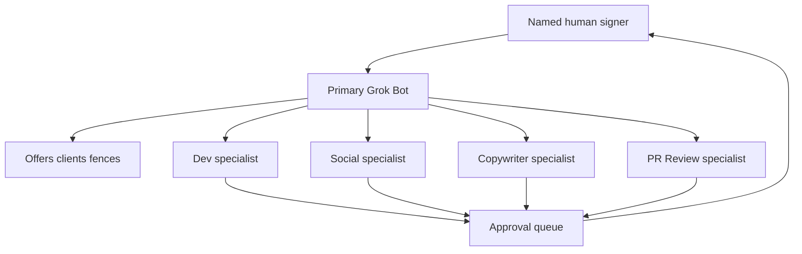

# What Is Grok Bot? Staff One Primary, Then Specialists.

**Grok Bot is xAI's always-on teammate product: I staff one primary that knows the offers, the clients, and the fences, then that primary stands up additive specialists. Those specialists draft. They do not post, ship copy, or merge pull requests while I am not looking.** That is the staffing job this page owns.

Grok Bot is a product, not the model ID `grok-4.6` and not the Cursor Task slug `cursor-grok-4.6-xhigh-fast`. I am not going to argue the nouns again.

I'm William Spurlock — founder, AI Systems Architect, and Fractional AI CTO. I've built 600+ automations with 500+ still live, spent 20,000+ hours on agentic systems, helped clients delete 35,000+ hours of busywork, and I've been SEO certified since 2021. I get paid to make standing agents behave like a shop, not like a pile of clever chats.

Today is Saturday, September 6, 2026. [xAI launched Grok Bot on August 11](https://x.ai/news/introducing-grok-bot) as a team of always-on agents with their own computer. [Access widened on August 26](https://x.ai/news/grok-bot-more-plans). [X connected on August 29](https://x.ai/news/grok-bot-and-x). [The design essay](https://x.ai/news/designing-grok-bot) and [the enterprise post](https://x.ai/news/grok-bot-for-enterprise) both landed September 3. I am writing from those pages, not from a launch deck in my head.

The day-to-day operating layer — inbox, calendar, CRM, a named human on send and spend — already lives in [what an agentic OS means day to day](/blog/what-an-agentic-os-means-for-running-your-business-day-to-day). This post is narrower. It is how I staff Grok Bot itself: one primary that holds the business, then specialists that hold a lane.

---

## What is Grok Bot, and what does staffing one actually mean?

**Grok Bot is xAI's persistent teammate product: each Bot has a name, memory, tools, and a computer of its own, and staffing means you hire a primary that already knows the shop before you add anyone else.** A chat you restart on Monday is not a staff. A specialist with no bible is not a hire. It is another intern you have to brief every morning.

xAI's [August 11 launch](https://x.ai/news/introducing-grok-bot) says the quiet part in the first line: Grok Bot is your team of always-on agents. They have their own computer. They work inside the tools you already use. They keep going when you close the laptop. You message them the way you message a colleague. They remember the thread.

That is the product. Staffing is the job I do on top of the product.

I do not open the app and mint five clever names. I staff one primary first. That primary holds the offers, the clients, the "we do not do that" list, and the fences. Then I ask that primary to create additive specialists — Dev, Social, Copywriter, PR Review — each with a smaller memory and a narrower job. xAI already sketched this shape inside the company: [one Bot manages the others, a chief of staff on top, a specialist per lane](https://x.ai/news/introducing-grok-bot). I run that shape on purpose. I do not let every Bot invent the company.

The [September 3 design essay](https://x.ai/news/designing-grok-bot) is the object list I actually teach:

| Object | What it is | What I refuse to treat it as |
|---|---|---|
| Bot | A persistent agent with identity, memory, runtime, and tools | A disposable chat you rename next week |
| Chat | The thread you use to work with that Bot | The source of truth for the business |
| Prompt | A one-shot instruction, a saved Skill, or a scheduled Routine | A second bible the specialist can rewrite |
| Tool | Account-level access to apps, APIs, the shell, or computer use | A permission to send, publish, or merge |
| Artifact | A draft, ticket, brief, or file the Bot made | A live post, a shipped page, or a merged PR |

xAI is explicit that **Tools and Skills live at the account**, while **Memory and Routines belong to the Bot**. That split is the staffing rule. Shared capability. Separate context. A Copywriter should not inherit a legal fight. A Dev specialist should not inherit last month's pricing argument unless the primary handed it over on purpose.

Staffing, in my shop, means five things are true before I add a second Bot:

1. The primary can restate the offers without me in the room.
2. The primary can name the clients and the fences.
3. The primary knows what "done" looks like for a draft versus a send.
4. The primary is the only Bot allowed to create other Bots until that roster is stable.
5. I can point at one thread and say "that is the shop," not five conflicting personalities.

If those five are not true, I do not have a team. I have a group chat of strangers wearing my logo.

xAI's own [August 26 jobs list](https://x.ai/news/grok-bot-more-plans) is useful as a menu and dangerous as a staffing plan. Researcher, writer, chief of staff — yes. "Website builder that purchases the domain and deploys" is their example, not my default. I will use the product to draft and to prepare. I will not pretend a specialist is a cofounder with a debit card.

What staffing is not:

- A new model pin. That is a different page.
- A Cursor Task hop. That is a different page.
- Five Bots that all think they own the brand voice.
- A specialist that posts because the X connector is on.
- A Dev Bot that merges because the ticket is green.

I staff Grok Bot the way I staff a tiny studio. One person who knows the book of work. Then specialists who make that person faster. The human still signs.

## Why does a shop fail when every bot starts from a blank brief?

**A blank-brief roster fails because each Bot invents a different company, and you become the paste layer between them.** That is not a team you hired. That is five interns who never read the offer doc, talking to your clients with your name on the door.

xAI will tell you Bots get sharper over time and pick up your voice. The [launch post](https://x.ai/news/introducing-grok-bot) even quotes people who stopped checking every fifteen minutes. I believe the memory works. I do not believe five separate memories will converge on the same fences unless I put those fences in one primary first.

Here is what a blank-brief shop looks like by Friday:

| Failure | What I see | What it costs |
|---|---|---|
| Five origin stories | Each Bot writes a different one-liner for the same offer | You spend the weekend correcting "who we are" |
| Fence drift | Social drafts a guarantee Dev already rejected | A human has to catch it, or a client does |
| You become the router | You paste the same context into four threads | The product's group chat never gets used |
| Tool soup | Every Bot gets every connector "just in case" | One over-scoped specialist can send or spend |
| Fake done | A Bot reports "posted" or "merged" when it only drafted | You learn about it from a customer, not a queue |
| Roster bloat | You mint a new Bot per mood | You hit xAI's [~50 Bot account cap](https://x.ai/news/designing-grok-bot) with zero institutional memory |

The design essay is blunt about why they organized the sidebar around Bots, not chats: chats are disposable. You start one, it sinks, you start another. That behavior is fine when the unit of work is a question. It is a shop-killer when the thing on the other side is supposed to know you.

Blank brief is how you recreate chat-history behavior on a Bot roster. New name. New avatar. Same amnesia.

I have watched this pattern in agent work for years — 20,000+ hours of it. The failure is rarely "the model is dumb." The failure is three specialists who never shared a picture of the business, plus a human who thought "I can just tell them in the thread." You can. You will. You will tell them again on Tuesday. That is not a team.

Three specific breaks I refuse to pay for:

1. **Offer collision.** Copywriter prices a package the primary already retired. Social writes a hook for a service I no longer sell. PR Review has nothing to review against, so it rubber-stamps tone and misses the lie.
2. **Client collision.** Dev names a client in a public draft because nobody told it the engagement is quiet. Social pulls a mention and drafts a reply that confirms a rumor. The primary would have known. The specialist did not.
3. **Fence collision.** The only rule that matters — nothing sends, nothing publishes, nothing merges, nothing spends without a named human — lives in my head. The Bots treat "draft" and "done" as synonyms because I never wrote the difference into one place.

xAI's [enterprise post](https://x.ai/news/grok-bot-for-enterprise) says a Bot has **no access by default** and reaches only the accounts you sign it into. That is the right default. Blank-brief staffing undoes it. People get excited, they sign every Bot into everything, and then they wonder why the Social specialist can see the engineering tracker.

The [August 26 expansion](https://x.ai/news/grok-bot-more-plans) makes this worse, not better. More plans now include Grok Bot. More people will mint a roster on day one because the product makes it easy. Easy is the trap. The product is built so you can stand up a researcher, a writer, and a chief of staff and drop them in a group chat. If the chief of staff does not already know the shop, the group chat is four strangers assigning each other homework.

I also will not flatten vendor examples into my SOP. xAI shows a website builder that buys a domain and deploys. xAI shows an office manager in six tools. xAI shows customer support handling routine refunds inside policy. Those are their stories. Some of them even leave the dangerous step for you — the sales prospector [leaves every send for approval](https://x.ai/news/grok-bot-more-plans). I keep that half. I throw away the half that sounds like an unattended shop.

If you skip the primary, you do not save a day. You buy a week of corrections and a quiet risk that one specialist treats a connector as a green light.

The stake is simple: Grok Bot will remember. It will remember the wrong company if that is what you staffed.

## How do you staff one primary Grok Bot, then add specialists?

**I staff one primary Grok Bot that already knows the business, then I ask that primary to create additive specialists — Dev, Social, Copywriter, PR Review — each with a lane, a draft-only definition of done, and no send, publish, or merge rights.** The primary is the shop. The specialists are extra hands. I stay the signer.

xAI's [launch post](https://x.ai/news/introducing-grok-bot) is the warrant: people inside the company run multiple Bots in parallel, with one to manage the others. The [design essay](https://x.ai/news/designing-grok-bot) names it a Chief of Staff Bot. I use "primary" because that is the job, not the costume. Chief of staff is fine if you like the title. The rule does not change.

The primary holds the shared picture. Specialists hold lane memory. Group chat is for overlap. The queue is where I show up.

### Step 1 — Create only the primary

Download the app. Make one Bot. Name it like a person you will still respect in October. Give it a title that says "primary" or "shop lead," not "intern 1."

Do not connect every tool on day one. [Enterprise Grok Bot starts with no access](https://x.ai/news/grok-bot-for-enterprise). I treat consumer the same way even when the UI lets me get sloppy. Sign the primary into the systems it needs to *know* the business. Keep send-as, publish, pay, and merge off until I have a reason — and even then, I often leave them off forever. The deny list I already wrote for agents sits in [which permissions your AI agent should never have by default](/blog/which-permissions-your-ai-agent-should-never-have-by-default). Grok Bot does not get a special exemption because the avatar is cute.

### Step 2 — Load the shop into the primary

I do not "show it a vibe." I sit with the primary and walk the book of work once. xAI's best teaching move is still the one on the [August 11 page](https://x.ai/news/introducing-grok-bot): ask the Bot to follow along the next time you do the job, then save the correction as a Routine. I use that for *how I brief*, not for *how I publish*.

The first brief I paste looks like this:

> You are the primary Grok Bot for this shop. You do not send, publish, merge, or spend. You hold the business and you create specialists later.
>
> Offers: list each offer, who it is for, what it costs only if I wrote a public number, and what we refuse.
> Clients: list active accounts, quiet accounts, and anyone we do not name in public.
> Fences: no outbound without a named human. No live copy. No merged PR. No refunds, no domain buys, no invoices paid.
> Voice: first person, specific, no hype adjectives. If you do not know, ask me. Do not invent a client, an ROI, or a price.
>
> When I ask you to staff a specialist, you write their job, their inputs, their outputs, and their forbidden actions. You do not give them my fences as optional flavor. You give them as law.

Then I make the primary repeat it back. If it cannot restate the offers and the fences in its own words, I do not add a specialist. I fix the primary.

### Step 3 — Let the primary create the specialists

This is the move most people skip. They mint Dev themselves, mint Social themselves, and hope the four Bots become a band. I ask the primary to create them so the first thing in each specialist's memory is "I report to the shop lead, not to a blank chat."

The spawn brief I have the primary send:

> Create one specialist Bot. Do not create a second until I approve this one.
>
> Role: [Dev | Social | Copywriter | PR Review]
> Reports to: the primary. Shared picture lives there.
> Inputs: only what the primary or I hand you. Do not go hunting through every connected app for sport.
> Outputs: drafts, tickets, briefs, review notes. Put the artifact where I already work. Mark it as waiting for a human.
> Forbidden: send, publish, merge, spend, refund, buy, deploy to production, change a live DNS record, or tell a client you shipped.
> If a tool lets you do a forbidden action, stop and ask. "The connector is on" is not approval.

I add four specialists, not fourteen. xAI's practical cap is [about 50 Bots per account and six per group chat](https://x.ai/news/designing-grok-bot). I will never need 50. I will absolutely ruin a six-seat group chat if I dump every mood into it.

Here is the roster I actually staff:

| Specialist | Knows | Prepares | Never does unattended |
|---|---|---|---|
| Dev | Stack, open bugs, what "done" means for a ticket | Repro notes, patch drafts, PR descriptions, test plans | Merge, production deploy, secret rotation |
| Social | Channels we use, accounts we do not joke about, X as research | Mention pulls, draft posts, reply candidates | Publish, schedule live, reply in public |
| Copywriter | Offers, voice, pages that already exist | Page drafts, email drafts, scripts, alt text | Ship copy to production, send the email |
| PR Review | Fences, brand "no," what a lie looks like in our vertical | Written review of the other specialists' drafts | Merge, publish, or override a fence |

PR Review is not optional. It is the specialist that exists because I do not want the Copywriter grading its own homework.

### Step 4 — Put them in one group chat, then get out of the middle

xAI built [group chats so Bots can pass work and share project context](https://x.ai/news/designing-grok-bot) without you becoming the dispatcher. I use one shop channel. I do not make a new group per mood.

Rules for that room:

- The primary assigns the lane. Specialists do not grab work because they are bored.
- Artifacts get a status: `draft`, `needs human`, `blocked`, `rejected`. Never `shipped` unless I typed it.
- If two specialists need the same fact, they ask the primary, not me, first.
- If the fact is a fence, the primary does not "take a vote." It restates the fence.

The [August 29 X connector](https://x.ai/news/grok-bot-and-x) belongs to Social as a research tool. Paid Grok Bot users get free X API credits to start, per that post. I use it to search posts, read a timeline, and check mentions. I do not treat "connected" as "posted."

### Step 5 — Turn repeated briefings into Routines, not into autopilot

The design essay moved Routines into the main interface because [work can start on a schedule or an event, not only on a prompt](https://x.ai/news/designing-grok-bot). I use that for prep. Morning pull of mentions. Overnight repro on a known bug. A weekly review pack the PR Review specialist leaves in the queue.

I do not use a Routine to publish. I do not use a Routine to merge. I do not use a Routine to email a client. Those are the same human-in-the-loop rule I already documented in [approve before your AI agent sends anything](/blog/human-in-the-loop-approve-before-your-ai-agent-sends-anything). Grok Bot did not repeal it on August 11.

A clean first week looks like this:

1. Monday — primary only. Brief. Restate. Correct.
2. Tuesday — primary creates Dev. One ticket, draft only.
3. Wednesday — primary creates Copywriter. One page section, draft only.
4. Thursday — primary creates Social. Mention pull, draft replies only.
5. Friday — primary creates PR Review. It reads the week's drafts. I approve or kill.

If Friday is chaos, I did not staff too slowly. I staffed the primary too thinly on Monday.

### What I tell the primary not to do

- Do not create a specialist because a blog post listed a cute job title.
- Do not copy my entire memory into every specialist. That is how a Social Bot starts arguing about a merge conflict.
- Do not accept "I shipped it" from anyone, including yourself.
- Do not invent a fifth offer to fill a quiet afternoon.

The method is boring on purpose. One brain for the shop. Four hands for the lanes. One human who still has to say yes.

## What should specialists prepare, and what must stay human?

**Specialists prepare drafts, tickets, and review notes. A named human still approves anything that leaves the shop — a send, a live page, a public reply, a merge, a payment.** Grok Bot can finish a lot of the swing. It does not get my signature.

xAI's own examples already leave the dangerous step on the table if you read them like an operator instead of a keynote. The [August 26 sales prospector](https://x.ai/news/grok-bot-more-plans) leaves every send for you to approve. The [September 3 sales write-up](https://x.ai/news/grok-bot-for-enterprise) leaves LinkedIn and email drafts for morning review. The [September 3 engineering write-up](https://x.ai/news/grok-bot-for-enterprise) keeps pull requests moving until they are ready for review. Ready for review is not merged.

I treat those sentences as the product's honest ceiling. Marketing will also show Bots that file refunds, buy domains, and sit in meetings. I do not copy those into my roster as unattended jobs.

| Action | Specialist may prepare | Human must do |
|---|---|---|
| Email or LinkedIn | Draft in the seller's voice, sitting in a queue | Click send |
| X | Search, timeline read, mention pull, draft reply | Publish or reply in public |
| Site copy | Draft section, meta, alt text | Ship to production |
| Code | Repro, patch, tests, PR description | Merge and deploy |
| Invoice / refund / domain | Flag, summarize, draft the request | Pay, refund, purchase |
| Client promise | Draft the sentence | Say it to the client |

That table is the whole fence. If a specialist's definition of done crosses the right-hand column, I rewrite the specialist.

### Dev — prepare the fix, do not land it

Dev's job is to make me faster at the hard part I already know how to do. Reproduce the bug in the actual UI. Write the ticket the way I would. Draft the patch. List what it did not touch. Hand it to PR Review, then to me.

xAI says engineering Bots [monitor PRs for bugs, security findings, failing builds, and merge conflicts](https://x.ai/news/grok-bot-for-enterprise). Monitoring is a prep job. Merging is a human job. I have never met a "the build is green" that was also "I read the auth change."

Forbidden for Dev, even if the connector exists:

- Merge to main
- Production deploy
- Rotating secrets
- "Hotfix live, you can review later"

If Dev says it shipped, the primary marks the artifact `rejected` and I look at the connector scopes that afternoon.

### Social — research the timeline, do not become the account

The [August 29 X post](https://x.ai/news/grok-bot-and-x) is a research door. Connect the account. Paid users get free X API credits to start. First version: search posts, read the timeline, check mentions, pull together what is happening. There is also an X plugin for search, timelines, trends, and bookmarks.

That is a lot of read. It is not a license to speak as me.

Social may:

- Pull mentions and cluster them by "needs a human today" versus "noise"
- Draft a reply in my voice
- Draft a post and sit it in the queue
- Flag a brand mention that looks like a support ticket

Social may not:

- Publish
- Reply in public
- Quote-post a client fight
- "Just this once" because the window is closing

If the window is closing, I still have thumbs. I can tap send. The specialist can have the draft waiting.

### Copywriter — write the words, do not ship the page

Copywriter owns the first draft of pages, emails, and scripts. It writes against the offers the primary already holds. It does not invent a fifth package because the outline looked thin. It does not put a price I did not publish. It does not name a client I marked quiet.

Done for Copywriter is "PR Review has the draft." Done is not "I dropped it on the live site."

### PR Review — kill the lie, do not override the fence

PR Review reads the other three. It checks fence, offer, client, and tone. It writes a short verdict: ship-ready after human, revise, or kill.

It does not merge. It does not publish. It does not "approve on William's behalf." The word approve in this shop belongs to a human.

If PR Review and Copywriter disagree, the primary restates the fence. I am the tie-break only when the fence is actually ambiguous. Most disagreements are a specialist trying to be helpful past the line.

### What I will not claim on September 6

I will not claim specialists post unattended.
I will not claim specialists ship copy unattended.
I will not claim specialists merge pull requests unattended.
I will not claim a Routine is a substitute for a signer.
I will not quote an xAI employee saying they "fully trust it to run forever" as my SOP. That quote is on the [launch page](https://x.ai/news/introducing-grok-bot). It is their culture. It is not my fence.

The computer of the Bot's own is real. The [design essay](https://x.ai/news/designing-grok-bot) even gives you status, preview, and takeover so you can glance or sit down. Use takeover when the Bot is stuck. Do not use "I watched it once" as a reason to leave merge on.

If you want the longer why on send gates, I already wrote it. This page only needs the Grok Bot version: specialists prepare. I still sign.

## How do you know the Grok Bot roster is working this week?

**The roster is working when the primary can restate the shop without a re-brief, specialists return drafts that already respect the fences, and the count of unattended sends, publishes, and merges stays at zero.** Hours saved are a lagging number. Fence breaks are a leading one.

I do not grade Grok Bot on how busy the avatars look. The [design essay](https://x.ai/news/designing-grok-bot) spent a lot of ink on presence — idle, working, waiting, blocked, done — because users wanted reassurance the Bot was still moving. Reassurance is not a KPI. A Bot can look busy while inventing a third pricing tier.

Here is the scoreboard I actually keep:

| Signal | Healthy this week | Broken this week |
|---|---|---|
| Primary restates offers | I ask once, it answers without a new paste | I have to re-teach the shop mid-thread |
| Specialist drafts | PR Review finds tone nits, not fence breaks | Social invents a guarantee or names a quiet client |
| Approval queue | Named artifacts with `needs human` | A Bot reports shipped, posted, or merged |
| Group chat | Primary assigns, specialists hand off | I am pasting the same paragraph into four threads |
| Scope | Four specialists, one shop room | A new Bot per mood, connectors on "just in case" |
| Unattended outbound | Zero sends, zero publishes, zero merges | Anything left the building without my yes |
| Time to a usable draft | Faster than me starting from a blank page | Slower, because I am correcting the company name |

I check that board twice: once mid-week on a live artifact, once at the end of the week on the pile. I do not need a dashboard product. I need a list I will actually read.

### The five questions I ask the primary on Friday

1. What are we selling right now, and what did we stop selling?
2. Which clients are quiet in public?
3. Which specialist produced the most `needs human` artifacts?
4. Which specialist tried to cross a fence, even as a draft?
5. If I asked you to staff a fifth specialist on Monday, what job would you refuse to create?

If question 1 or 2 wobbles, I do not add anyone. I repair the primary. If question 4 has a name, I pull that specialist's tools back to read-only and I rewrite its forbidden list in the thread so the memory sticks.

Question 5 is the vanity check. A working primary will refuse a cute hire. A failing primary will invent "Podcast Bot" because the week felt quiet.

### Proof that is not proof

I ignore these, even when they feel good:

- Avatar motion. Working is not correct.
- Token spend. A specialist can burn a lot of computer time restating the wrong offer.
- "It sounds like me." Voice without fences is how a polished lie ships.
- Vendor case studies. [xAI named Legora, Supermicro, and ServiceTitan](https://x.ai/news/grok-bot-for-enterprise) and said thousands of organizations have adopted Grok Bot since launch. That is their customer list as of September 3. It is not my scoreboard.
- A two-week enterprise free window. [As of September 3](https://x.ai/news/grok-bot-for-enterprise), Grok and Cursor Enterprise customers got free usage for the next two weeks and could invite people without an existing seat. Today is September 6, so that window may still be open if you are on those plans — confirm it on the live page. A promo is not a staffing review.

I also do not treat "included with SuperGrok / Cursor Pro / Cursor Teams" as proof I should mint eight Bots tonight. The [August 26 plans post](https://x.ai/news/grok-bot-more-plans) lists those subscriptions and still does not publish a public dollar price. I will not invent one. Separate Bot usage is a billing fact. It is not permission to skip the primary.

### A clean week versus a dirty week

**Clean week:** Dev drops one patch draft on a known bug. Copywriter drafts one section against a live offer. Social parks three reply candidates. PR Review kills one sentence that implied a result I never published. I send one email and merge one PR. The primary did not create a fifth Bot.

**Dirty week:** Four specialists each wrote a different hero line. Someone "helpfully" connected publish. The group chat is me restating the fence. I spent more time correcting origin stories than I would have spent writing the drafts myself.

If you are in a dirty week, do this in order:

1. Freeze new Bots.
2. Disconnect send, publish, and merge from every specialist.
3. Sit with the primary and reload offers, clients, fences.
4. Make the primary rewrite each specialist's job in one paragraph.
5. Delete or pause any Bot that cannot state its forbidden list.

xAI will let you run a lot of Bots. The [~50 account cap](https://x.ai/news/designing-grok-bot) is a product limit, not a target. A working roster in my shop is five names I can recite without opening the sidebar: primary, Dev, Social, Copywriter, PR Review.

### What I measure after 30 days

Not ROI theater. Three numbers:

- **Fence incidents:** unattended send / publish / merge. Target is zero. One is a postmortem, not a rounding error.
- **Re-brief count:** how many times I had to paste the shop back into the primary. If this is not falling, memory is not doing the job I paid for.
- **Human time on drafts versus on corrections.** Drafts going up is good. Corrections going up means I staffed specialists before I staffed a shop.

I have spent 20,000+ hours on agentic systems and I still trust a zero on the fence count more than a story about "the team feels 2–3x faster." That 2–3x line is on the [launch page](https://x.ai/news/introducing-grok-bot) as someone else's quote. I will take the hours when the queue is honest.

If the three numbers are ugly, the fix is not a sixth specialist. The fix is the primary.

## Frequently asked questions

### What is Grok Bot?

**Grok Bot is xAI's always-on teammate product: persistent agents with their own computer, memory, and tools, launched August 11, 2026.** You message a Bot like a colleague. It keeps working when you step away and comes back when it needs a decision. Read the [launch post](https://x.ai/news/introducing-grok-bot). It is a product you staff, not a model ID you pin.

### Is Grok Bot the same as Grok 4.6?

**No. Grok Bot is the teammate product. `grok-4.6` is a model ID. `cursor-grok-4.6-xhigh-fast` is a Cursor Task slug.** I use all three surfaces. I do not flatten them. This page is the staffing job. If you came here for a taxonomy fight, you are in the wrong thread.

### How many Grok Bots should I create first?

**One. The primary.** I do not mint Dev, Social, Copywriter, and PR Review until that primary can restate offers, clients, and fences without a fresh paste. xAI will happily let you stand up a researcher, a writer, and a chief of staff on day one — the [August 26 page](https://x.ai/news/grok-bot-more-plans) even invites it. I still start at one.

### What does the primary Grok Bot need to know?

**Offers, clients, and fences — especially what must never send, publish, merge, or spend without a named human.** It also needs the right to create specialists and the duty to refuse cute extra hires. If it cannot repeat those four buckets in its own words, it is not a primary yet. It is a blank chat with a nicer avatar.

### Can Grok Bot specialists post to X on their own?

**No in my shop. The [August 29 X integration](https://x.ai/news/grok-bot-and-x) is a research door — search, timeline, mentions, bookmarks — plus starter API credits for paid users.** Social drafts the reply and I publish. If a specialist can post, I treat that as a mis-scoped tool, not a feature.

### Can a Dev specialist merge a pull request unattended?

**No. Dev prepares the repro, the patch, and the PR write-up. A human merges.** xAI's [enterprise engineering example](https://x.ai/news/grok-bot-for-enterprise) keeps work moving until it is ready for review — not until it is merged. If merge is on for a specialist, I turn it off before I argue about the diff.

### Does Grok Bot use my SuperGrok or Cursor usage?

**No. [xAI says Grok Bot has its own usage](https://x.ai/news/introducing-grok-bot), separate from Grok and Cursor plans.** As of August 26 it is included with SuperGrok, SuperGrok Plus, SuperGrok Heavy, Cursor Pro, Pro+, Ultra, and Cursor Teams Standard and Premium, per the [plans post](https://x.ai/news/grok-bot-more-plans). That post does not publish a public dollar price, so I will not invent one. Confirm your current tier on the live page.

### How many Grok Bots can one account run?

**xAI set a practical cap of roughly 50 Bots per account and six Bots per group chat, per the [September 3 design essay](https://x.ai/news/designing-grok-bot).** I run five: one primary and four specialists. Fifty is a ceiling, not a staffing plan. If you need a sixth specialist, write the job down and make the primary refuse it first.

---

I staff Grok Bot as a tiny studio, not as a model bake-off. One primary that knows the book of work. Four specialists that make that primary faster. A human who still signs the outbound, the live copy, and the merge.

If you want that roster built against your offers, your clients, and your fences — custom agent teams, with me as Fractional AI CTO — [start here](/contact). Bring the book of work. I will not mint five blank Bots and call it a department.
