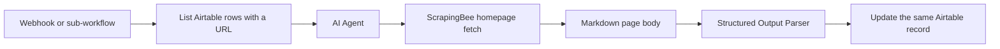

# How My Company Research Assistant Fills Airtable CRM From Any Website

**I fill Airtable CRM fields from a company website by reading a row that already has a URL, fetching that homepage through ScrapingBee, extracting a fixed JSON contract, and writing only those named fields back to the same record.** The source of truth is the live page. The write contract is the schema. The CRM does not invent the company from a prompt sitting on an empty row.

I am **William Spurlock**, founder, AI Systems Architect, and Fractional AI CTO. I have shipped **600+ automations** with **500+ live**, logged **20,000+ hours** inside agentic systems, and deleted **35,000+ hours** of client busywork across that book of work. This post is one n8n receipt: **Company Research Assistant | ScrapingBee + CRM**. I do not invent a client name for it. I do not invent hours saved for this one flow.

The parent spoke for inbound capture — form webhook, create-or-update contact, transactional email — is [how to connect n8n to your CRM, email, and website in under an hour](/blog/how-to-connect-n8n-to-your-crm-email-and-website-in-under-an-hour). That pipeline creates the row. This pipeline fills the research columns after a URL exists. If you do not have intake yet, build [the first AI automation every small business should build](/blog/the-first-ai-automation-every-small-business-should-build) first. Do not start with enrichment on a base that still has no records.

This page owns one operating question: **How does William's company research assistant fill Airtable CRM fields from a company website?**

---

## How does the company research assistant fill Airtable CRM fields from a company website?

**It loads companies that already have a website URL in Airtable, lets an n8n AI Agent call a ScrapingBee scrape tool, turns the page into markdown, extracts a fixed set of business fields, and updates that same Airtable record.** No new company is created from a guess. No free-text dump lands in a long-text cell and pretends to be a CRM.

The library row for this build sits in my n8n catalog as **Company Research Assistant | ScrapingBee + CRM**. It is a sales-category workflow. The catalog lists **nine nodes**, a **2025-03** build date, a **webhook** plus **sub-workflow** trigger, and these integrations: **n8n**, **Airtable**, **ScrapingBee**, **OpenAI**, **HTTP**, **AI Agent**. I seat the extract on a current OpenAI model now — **GPT-5.4 mini** for clean homepages, **GPT-5.5** when the page is a mess. I can swap **Claude Sonnet 5** on the same agent node. The model name is not the architecture.

Here is the path the record actually travels:



n8n's [AI Agent](https://docs.n8n.io/integrations/builtin/cluster-nodes/root-nodes/n8n-nodes-langchain.agent/) node is the decision seat. You attach a chat model and at least one tool. The agent is allowed to call the scrape tool. It is not allowed to write Airtable until the [Structured Output Parser](https://docs.n8n.io/integrations/builtin/cluster-nodes/sub-nodes/n8n-nodes-langchain.outputparserstructured/) returns fields that match the JSON Schema. That parser is the gate. Without it, you are pasting an essay into a CRM.

The scrape tool is a small n8n workflow of its own. The agent hands it a URL. The tool calls [ScrapingBee](https://www.scrapingbee.com/documentation/). ScrapingBee's `render_js` flag defaults to `true`, so a JavaScript homepage is not an empty shell unless I turn rendering off. `return_page_markdown` can come back as markdown so the model is not chewing raw HTML. I keep the tool on the **homepage** the Airtable row already stored. I do not hand the agent an open crawl of the whole domain.

Then n8n's [Airtable node](https://docs.n8n.io/integrations/builtin/app-nodes/n8n-nodes-base.airtable/) updates the record. The node can append, list, read, update, or delete. This flow uses **update**, keyed on the Airtable record ID that came in with the list. If you cannot point at that ID, you do not write.

The operating loop, in order:

1. **Trigger.** A webhook starts a batch, or a parent workflow calls this one as a sub-workflow with one record ID.
2. **Read.** List Airtable rows that have `Website` filled and `Research Status` empty or `needs_refresh`.
3. **Scrape.** The agent calls the ScrapingBee tool once per URL. Homepage only.
4. **Extract.** The model fills the schema: business area, offerings, value proposition, business model, ICP.
5. **Write.** Update those fields plus a status, a short evidence quote, and a timestamp.
6. **Stop.** If the scrape is empty, the login wall wins, or a required field is missing, write `failed` and leave the research fields alone.

That last rule matters more than the model. A half-filled "value prop" invented from the company name is worse than a blank. Blank means a human still has work. A confident fiction means outbound starts from a lie.

I treat this as enrichment, not as a researcher replacement. The assistant copies what the company already published. It does not interview the founder. It does not score the deal. It does not send the email.

| Step | System | What it is allowed to do | What it is not allowed to do |
| --- | --- | --- | --- |
| Trigger | n8n webhook or sub-workflow | Start a named batch | Invent a company that is not in the base |
| Read | Airtable List | Pull record ID + URL + name | Create a duplicate row "to be safe" |
| Fetch | ScrapingBee tool | GET the stored homepage | Follow every nav link on the domain |
| Extract | AI Agent + schema | Fill the contracted fields | Free-write a research memo into Notes |
| Write | Airtable Update | Patch named fields on that ID | Append a second company with the same URL |

If your Airtable row is only a name and a feeling, this workflow has nothing to fetch. Put the URL in first. Type it. Paste it from the form. Do not ask the model to "find their site" as a hidden first step unless you built a separate, logged search tool with its own miss rules. This receipt does not include that search tool.

The nine-node catalog row is not a mystery box. I keep the same families every time I rebuild it:

| Node family | Count I expect | Job |
| --- | --- | --- |
| Trigger | 1 | Webhook in, or a sub-workflow Execute Workflow Trigger |
| Airtable | 2 | List rows that need research; update the same record ID |
| AI Agent + model + parser | 3 | Decide to scrape, extract, fail closed on schema |
| HTTP / scrape tool | 2 | Call ScrapingBee; return markdown or an error |
| Control | 1 | IF / Switch on status so a miss does not patch research fields |

If your canvas has a Code node "to clean things up," you are usually hiding a schema miss. Fix the parser. Do not launder bad JSON through JavaScript and call it a research assistant.

I also keep one company per execution item. n8n will loop a list. The agent should see one URL, one name, one record ID. Five companies in one prompt is how Company B's ICP lands on Company A's row. Split items before the agent. Merge after the update if you want a summary.

---

## How is this different from a CRM webhook — and from Airtable writing the field itself?

**A CRM webhook creates or updates a contact from a form payload. Airtable's own AI rewrites fields from what is already in the base. This assistant fetches a live website, then writes a schema.** Those are three jobs. If you collapse them, you will debug the wrong failure.

The June CRM-connect spoke is inbound. A site form POSTs to n8n. n8n maps `email`, `name`, and `company` into HubSpot, Salesforce, or Airtable and fires a confirmation. That is [connect n8n to your CRM, email, and website](/blog/how-to-connect-n8n-to-your-crm-email-and-website-in-under-an-hour). The payload is the source of truth. There is no homepage in that path unless the visitor typed one.

This receipt is outbound research on a row you already own. The source of truth is the company's public homepage. The trigger is a webhook or a sub-workflow you fire after the URL exists. The write is a patch, not a lead-create.

Airtable can also generate field values from a prompt on the record. That path is useful when the notes are already in the base and you want a shorter summary, a tag, or a rewrite. It does not fetch the live HTML. It cannot see a pricing page you never pasted. It will happily complete a value proposition from the company name and two adjectives in the Description field. That is a different product decision, and it is a different post. I am not linking that sibling here.

I keep the three paths in separate columns in my head:

| Job | Source of truth | Typical trigger | Write shape | Failure you actually get |
| --- | --- | --- | --- | --- |
| CRM-connect webhook | Form JSON | Website submit | Create or update contact | Empty payload, duplicate email, CRM 429 |
| Airtable field AI | Cells already in the row | Field generate / button in the base | Rewrite or fill from siblings | Confident text with no page behind it |
| Company research assistant | Live homepage via ScrapingBee | Webhook or sub-workflow | Patch schema fields on the same record | Empty scrape, login wall, schema miss |

Use the webhook when the visitor just arrived and you need a row. Use in-base AI when the row is already dense and you want a shorter cell. Use this assistant when the row is a name plus a URL and the research columns are empty.

I will not run this scrape path on every new form submit. Intake should stay cheap and fast. Enrichment is a second pass you fire for rows that earned a look — inbound that asked for a call, a list you uploaded on purpose, a competitor set you named. If you enrich every spam submit, you will pay ScrapingBee and the model to describe parking pages.

The other split is **create versus patch**. The CRM-connect pattern is allowed to create. This assistant is not, unless you add a separate "create from URL list" workflow with its own dedupe on domain. I did not add that here. Patch-only keeps the miss cheap: a bad extract fails a row you already knew existed.

When people ask "why not just paste the homepage into Airtable AI," the honest answer is: you can, once. You will not do it for forty companies on a Monday. You will also paste a different slice of the page each time, so the value-prop field will not be comparable across rows. The assistant exists so every row sees the same homepage contract and the same schema. Comparability is the product. A prettier paragraph is not.

---

## What fields does the assistant write, and what stays blank on purpose?

**It writes business area, product offerings, value proposition, business model, and ideal customer profile, plus a small set of run fields. It does not write email, phone, personal names from the footer, or a score.** The catalog overview for this workflow names those five research fields. Everything else is either an input you already had or a control field I add so I can trust the run.

I keep the Airtable table boring. Fancy linked records can come later. First I want columns a human can scan in one glance.

| Field | Direction | What belongs in it | What does not |
| --- | --- | --- | --- |
| Company Name | Input | The name you already stored | A rewrite the model prefers |
| Website | Input | Canonical homepage URL | A blog post, a careers page, a PDF |
| Business Area | Output | One-line category the site claims | Your internal segment nickname |
| Product Offerings | Output | What they sell, in their words | A competitor's stack you remember |
| Value Proposition | Output | The promise on the homepage | A slogan you wish they used |
| Business Model | Output | How they charge, if the page says it | Invented "SaaS" when the page is a studio |
| Ideal Customer Profile | Output | Who the copy addresses | A persona you keep in a slide deck |
| Evidence Quote | Output | One short sentence copied from the page | A paraphrase with no quote marks |
| Research Status | Control | `ok`, `empty_scrape`, `blocked`, `schema_miss` | A paragraph of apology |
| Researched At | Control | ISO timestamp of the successful write | "this week" |
| Model | Control | The model id that filled the schema | Blank, so you cannot replay the run |

The five research fields match the catalog: **business area, product offerings, value proposition, business model, ideal customer profile**. I add Evidence Quote and the control fields because I have watched "ok" rows that were not ok. If I cannot point at the sentence the model used, I do not trust the value prop.

I do **not** write these from the homepage scrape:

- **Email or phone** scraped from a footer. That is contact data, not research. If you need it, build a separate allowlist and treat it as PII. The data rules live in [keeping customer data safe when agents touch your CRM and inbox](/blog/keeping-customer-data-safe-when-agents-touch-your-crm-and-inbox).
- **Employee names** from a team grid. Wrong person, stale title, and a creepy first line in the sequence.
- **Revenue, headcount, or funding.** The homepage almost never states these cleanly. If you need them, buy a data vendor. Do not let GPT-5.4 mini invent a Series B.
- **Lead score or "fit" (1–10).** That is your rubric, not the company's site. Keep scoring in a later node with your own weights.
- **Outreach copy.** The assistant fills the CRM. A different workflow can draft. Mixing them is how a bad extract becomes a sent email.

The allowlist is the product. If a field is not on it, the Structured Output Parser cannot emit it, and the Airtable node cannot map it. I do not "also grab anything useful." Anything useful is how a privacy policy paragraph lands in ICP.

Empty is a legal value. If the homepage never says how they charge, `Business Model` stays empty and `Research Status` can still be `ok` as long as the required fields you named as required actually filled. I mark `schema_miss` only when a required field is missing. I keep **Value Proposition** and **Product Offerings** required. I keep **Business Model** optional. A studio homepage will describe the work and stay silent on retainers. That is not a scrape failure.

I also refuse to overwrite a human-edited cell without a flag. If `Value Proposition` was touched by a person after the last run, I write the model's version into `Value Proposition (Machine)` or I skip the field. Silent overwrite is how you lose the one sentence a salesperson actually trusted.

For a first table, this is enough. You can add Industry, Competitors, or Locations later. Add them to the schema first, then to Airtable, then to the map. Do not add them in the prompt and hope the node grows a column.

---

## How do I wire n8n, ScrapingBee, and Airtable so the write stays structured?

**Stand up the Airtable table, a scrape sub-workflow, an AI Agent with a Structured Output Parser, and an Update node keyed on record ID.** The catalog calls this nine nodes. I will not paste an unverified workflow JSON. The contract below is what I actually keep tight.

### 1. Put the inputs in Airtable before you build the agent

Create the table. Put ten real companies in it. Fill `Website`. Leave the research columns empty. If you cannot list ten URLs you are allowed to fetch, you are not ready for a scraper. Respect [robots.txt](https://developers.google.com/search/docs/crawling-indexing/robots/robots_txt) and the site's terms. ScrapingBee is a fetch API, not a permission slip.

Add a formula or a lookup so each row exposes its Airtable record ID. n8n's Airtable node [needs that ID to update](https://docs.n8n.io/integrations/builtin/app-nodes/n8n-nodes-base.airtable/). List-then-update without the ID is how you append duplicates.

### 2. Build the scrape tool as its own workflow

One webhook-in, one HTTP request to ScrapingBee, one webhook-out. The agent should see a tool that takes `{ "url": "https://example.com" }` and returns markdown or a clear error. Keep the tool stupid. Smart tools hide failures.

ScrapingBee's documented defaults I actually use:

| Parameter | Why it is on | When I change it |
| --- | --- | --- |
| `render_js=true` (default) | Most marketing sites paint the hero in JavaScript | Set `false` only for a known static HTML site to save render credits |
| `return_page_markdown=true` | Fewer tokens, fewer nav dumps | Turn off if I need a specific HTML attribute I cannot see in markdown |
| `wait` / `wait_for` | Hero copy that appears after a banner | Only when a test fetch comes back empty with render on |

I pass the exact URL from Airtable. I do not let the agent "try /about" unless I add `/about` as a second, explicit tool call with its own field. Scope creep starts with "just one more page."

### 3. Attach the agent, the model, and the parser

The AI Agent node gets:

- A chat model. **GPT-5.4 mini** is the default extract seat. **GPT-5.5** when the homepage is a collage. **Claude Sonnet 5** if that is already the seat I pay for.
- The scrape tool.
- A Structured Output Parser. n8n will [generate a schema from a JSON example](https://docs.n8n.io/integrations/builtin/cluster-nodes/sub-nodes/n8n-nodes-langchain.outputparserstructured/) or accept a JSON Schema. Example-generated schemas treat every field as mandatory, so I write the schema by hand when Business Model must stay optional.

The prompt I give the agent is a job, not a vibe:

```markdown
You research one company from its homepage.

Company name: {{ $json.companyName }}
Website: {{ $json.website }}

Use the scrape tool on that exact URL. Do not invent a different host.
If the tool returns empty, blocked, or a login wall, stop. Do not guess.

Fill only the schema fields. Use the company's own words where you can.
If a field is not on the page, return an empty string for that field.
Do not invent revenue, headcount, funding, emails, or phone numbers.
Do not write outreach copy.

Return one evidenceQuote copied from the page, 25 words or fewer.
```

The parser contract I keep next to that prompt:

```json
{
  "type": "object",
  "additionalProperties": false,
  "required": ["businessArea", "productOfferings", "valueProposition", "evidenceQuote"],
  "properties": {
    "businessArea": { "type": "string" },
    "productOfferings": { "type": "string" },
    "valueProposition": { "type": "string" },
    "businessModel": { "type": "string" },
    "idealCustomerProfile": { "type": "string" },
    "evidenceQuote": { "type": "string" }
  }
}
```

That is configuration for the parser node. It is not an exported n8n workflow. If the model emits a key that is not in the schema, it drops. If a required key is missing, the node fails and the Airtable update does not run.

### 4. Update Airtable on the same record, then stop

Map parser fields to Airtable columns. Set `Research Status` to `ok` only after the update succeeds. Set `Model` to the model id. Set `Researched At` now.

On failure, I write status only:

- `empty_scrape` — tool returned no usable body
- `blocked` — 401/403, challenge page, or explicit bot wall
- `schema_miss` — parser rejected the output
- `error` — HTTP or credential failure

I do not clear good fields on a later failed refresh. I skip the patch when status is not `ok`.

### 5. Trigger it on purpose

| Trigger | When I use it | When I do not |
| --- | --- | --- |
| Webhook | A button, a Make-style "research this row," or a form that already stored a URL | Every anonymous site submit |
| Sub-workflow | A parent "new qualified row" flow calls this one with a record ID | As the only copy of the logic, duplicated in three canvases |
| Schedule | Nightly refresh of rows older than N days with `needs_refresh` | A tight loop that re-scrapes the same ten URLs every hour |

The catalog lists webhook and sub-workflow. That is the receipt. A schedule is an add-on I only attach after the manual pass looks boring.

If you already have the CRM-connect webhook from the parent pillar, do not bolt ScrapingBee onto the same execution. Let intake finish. Queue the record ID. Enrich on a second run. One execution that creates the contact, scrapes the web, calls a model, and drafts email is a demo that fails three vendors at once.

### Batch size, credits, and politeness

I run **ten to twenty URLs** in the first live pass, then widen. ScrapingBee bills on requests and JavaScript renders. A 200-row dump on day one is how you discover your wait selector is wrong after you have already paid to fetch 200 empty heroes.

I also throttle. One homepage per company, one or two seconds between items unless you have a reason. This is research, not a race. If a host returns 429, that row becomes `error` and the rest of the batch continues. I do not retry the same URL three times in ten seconds inside the agent loop. The agent will happily "try again" and you will pay for the same wall.

Credentials stay in n8n. The Airtable personal access token needs **data.records:read** and **data.records:write** on that base, not a workspace-owner god token. ScrapingBee gets its own credential. The model key is a third credential. If one leaks, you rotate one. I do not paste keys into a Set node "just for the test."

When the batch finishes I want three counts, not a feeling:

| Count | Meaning |
| --- | --- |
| `ok` | Quote-check these before anyone sells from them |
| `empty_scrape` + `blocked` | URL or render problem. Fix the fetch, not the prompt |
| `schema_miss` + `error` | Contract or credentials. Fix the node, not the company |

If `ok` is under half on a list you already looked at by hand, the workflow is not ready. Do not "let sales work through it."

---

## How do I check a filled row before anyone uses it for outreach?

**Open the row, read the evidence quote against the live homepage, and only then let a human use the fields.** The assistant is done when the cells are structured. Outreach starts when a person agrees the cells are true.

I run a five-minute pass on the first twenty rows of a new base. If those twenty are clean, I widen the batch. If three of twenty are fiction, I fix the schema or the scrape, not the sales sequence.

The check, in order:

1. **Status is `ok`.** Anything else is not a research row yet.
2. **Website still loads.** I click it. If the company rebranded or the domain died, I do not send from stale cells.
3. **Evidence quote is on the page.** Search the homepage for that sentence. If I cannot find it, the extract is a rewrite I did not ask for. I fail the row.
4. **Value proposition does not name a product they do not sell.** This is the common miss on agencies with five service lines and one hero.
5. **ICP is a buyer the copy addresses, not a buyer I wish they had.** "Mid-market RevOps" on a plumber's site is a model completing your bias.
6. **No email, phone, or person name appeared in a research field.** If it did, the allowlist leaked. Stop the workflow.

| Symptom | Likely cause | What I change |
| --- | --- | --- |
| Empty fields, status `ok` | Parser allowed empty required keys | Tighten `required`, fail the node |
| Beautiful copy, quote not on the page | Model completed from the company name | Prompt: empty string if missing; keep quote required |
| Nav + footer dumped into Offerings | Markdown included the whole chrome | Trim the tool output to main content, or raise wait and re-fetch |
| Login wall text in Value Prop | SPA hid the hero, scrape got the gate | `wait_for` a hero selector, or mark `blocked` |
| Two companies' facts in one row | Update mapped the wrong record ID | List-then-update with the ID from the same item |
| Phone number in ICP | Schema too loose / prompt too soft | `additionalProperties: false` and a deny line in the prompt |

I do not measure this flow in hours saved. I measure it in **rows a human did not have to type**, **rows I sent back to `schema_miss`**, and **rows that survived the quote check**. If the quote check fails often, the model is too hot or the page is too thin. I drop to GPT-5.4 mini and a colder prompt before I "upgrade" to a bigger model. Bigger models invent more politely.

I also keep the scrape out of the prompt log when I can. Homepages are public, but they still pick up emails, form fields, and care-widget transcripts. Least-data in the prompt still applies. The safety spoke is [keeping customer data safe when agents touch your CRM and inbox](/blog/keeping-customer-data-safe-when-agents-touch-your-crm-and-inbox). Public HTML is not a free pass to store the whole page in n8n execution data for ninety days.

After the twenty-row pass, I let a salesperson use the fields for personalization notes — not for claims. "You work with home-service operators" is allowed if the homepage said it. "You just raised a Series A" is not, unless a different, sourced workflow wrote that cell.

If you want a Monday habit: refresh rows whose `Researched At` is older than thirty days and whose Website host has not changed. Do not refresh everything nightly. Companies do not rewrite their hero every night. You will pay to rediscover the same sentence.

Here is a pass/fail pair I use when I train someone else to check the base. No live company names. Two fake homepages.

**Pass.** The site says "We install and service heat pumps for homeowners in northern Michigan." Evidence quote is that sentence. Value Proposition is a short restatement. ICP is homeowners in that region. Business Model is empty because the page never said "flat fee" or "membership." Status `ok`. A human can write a first line from the quote.

**Fail.** The site is a brand film and a "coming soon" form. The model writes Value Proposition as "a modern platform for ambitious teams" and ICP as "mid-market operators." Evidence quote is a sentence I cannot find because it was never on the page. Status might still say `ok` if you did not require the quote to be copied. That row is a miss. I send it back to `schema_miss` and I tighten the prompt until empty strings win over poetry.

I keep a `Checked By` and `Checked At` column for the human pass. The assistant does not fill those. If those stay empty, the row is not in the outbound pile. Structure is not approval. Approval is a name and a time.

When a row fails the quote check twice, I stop sending that URL through the agent. I fetch the markdown myself, read it, and decide if the page is too thin for this workflow. Some companies do not have a homepage that can fill five fields. That is a list problem. It is not a reason to raise the model.

---

## FAQ

### Do I need a full site crawl, or is the homepage enough?

**The homepage is enough for this receipt, and it is what the catalog describes.** The assistant scrapes the stored homepage, not the sitemap. A /pricing or /about fetch is a second tool call I add only when the homepage is a brand film with no offer text. Crawl-the-domain is a different workflow with a different miss rate and a different ToS conversation.

### What if the company website is a JavaScript app that returns empty HTML?

**Turn ScrapingBee `render_js` on — it already defaults to true — and wait for a hero selector if the first body is still empty.** If the rendered page is a login wall or a cookie prison with no copy, mark `blocked` and stop. Do not let the model complete the company from the domain string. An empty scrape is a status. It is not a creative brief.

### Can this write HubSpot or Salesforce instead of Airtable?

**Yes, as a different write node, not as a different research idea.** The extract contract stays the same. You swap the Airtable Update for a HubSpot company update or a Salesforce Account patch, still keyed on a stable ID. I keep Airtable in this receipt because that is the CRM the catalog names. Do not dual-write two CRMs from the first build.

### Which model should extract company fields in 2026?

**GPT-5.4 mini for most homepages. GPT-5.5 when the page is a collage. Claude Sonnet 5 if that is already your n8n seat.** The original catalog line says OpenAI. The architecture is the schema, not the logo. I do not put a frontier model on a five-field extract to feel current. I bump the model only after the quote check fails on real pages, not on a demo URL I already memorized.

### Does this replace a sales researcher?

**No. It replaces the first pass of typing what the company already published.** A researcher still decides fit, politics, timing, and whether the homepage is lying. If you fire the researcher because the cells look full, you will send confident mail from a brand film. Keep the human on "should we talk to them." Let the assistant fill "what do they say they sell."

### How do I keep scraped pages from dumping emails and phone numbers into the CRM?

**Keep those keys out of the schema, deny them in the prompt, and scan the written cells for `@` and tel patterns before you mark `ok`.** Footer contact blocks are the usual leak. The safety rules — allowlist, least-data prompt, ID-only logs — are the same ones I use when an agent reads a CRM or an inbox in [keeping customer data safe when agents touch your CRM and inbox](/blog/keeping-customer-data-safe-when-agents-touch-your-crm-and-inbox). Public page does not mean "store every string."

### What happens when the URL is a parking page, a login wall, or a dead domain?

**Write `blocked` or `empty_scrape`, leave the research fields untouched, and move on.** A parking page will otherwise become a value proposition about "domain for sale." A dead domain is not a reason to invent the company from memory. Fix the URL or drop the row. Do not "try Google" inside this workflow unless you built a separate, logged search tool.

### Should I trigger this from a webhook, a button, or a schedule?

**Webhook or sub-workflow first, the way the catalog lists it. Schedule later, and only for rows you marked `needs_refresh`.** A button on the Airtable record that hits the webhook is the honest Monday tool. A schedule that re-scrapes the whole base is how you burn render credits on pages that did not change. Intake webhooks from the [CRM-connect pillar](/blog/how-to-connect-n8n-to-your-crm-email-and-website-in-under-an-hour) should not call this on every submit.

---

## Book the automation call

If you have a list of companies with URLs and empty research columns, this is the n8n path I build: ScrapingBee on the homepage, a schema the model cannot dodge, Airtable patched on the same record ID. I do not start with a crawl. I do not start with outbound copy. I start with fields you can check against the page.

I am William Spurlock. I ship this class of work the same way I ship the rest of the book: 600+ automations built, 500+ live, 20,000+ hours in the seat. If you want that wiring mapped to your Airtable base, use [the contact form](/contact) and say you need the company research assistant. That is an AI automation strategy call, not an AI-visibility audit.
