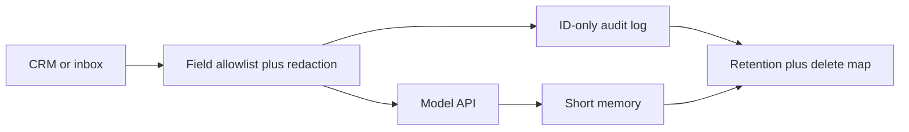

# Keeping Customer Data Safe When Agents Touch Your CRM and Inbox

**You keep customer data safe when AI agents access your CRM and inbox by treating every model call as a copy: redact before the prompt, send the least fields that still do the job, log record IDs instead of bodies, set a short retention clock, stay opted out of vendor training, and be able to export or delete every copy you made.** Scopes are the permission layer. This post is the data layer after the agent already has CRM or inbox access.

I'm William Spurlock — Founder, AI Systems Architect, and Fractional AI CTO. I've built 600+ automations, with 500+ still live. I've spent 20,000+ hours on agentic systems, and those builds have saved clients 35,000+ hours of busywork. I do not invent client names here. I will tell you what I actually put in the path between HubSpot or Gmail and GPT-6 Astra, Claude Sonnet 5, Claude Opus 5, Gemini 3.8 Flash, or Grok 4.6. The model name does not change the data rules. Claude Fable 5.1 and Mythos 5.1 (invite) do not get a looser copy of the customer's thread either.

The deny-list for send-as, delete, payments, production database write, and open web lives in [which permissions your AI agent should never have by default](/blog/which-permissions-your-ai-agent-should-never-have-by-default). I am not retelling that list. A read-only CRM token can still dump every note, every ticket, and every attached PDF into a vendor context window. A draft-only inbox token can still paste last week's refund fight into a prompt that your logger then stores for 90 days. That is a data incident with a "safe" credential.

A [human-in-the-loop approve step](/blog/human-in-the-loop-approve-before-your-ai-agent-sends-anything) is one control on outbound writes. It is not a data-handling program. The parent production checklist — staging, evals, kill switches — is in [how to deploy an AI agent to production without breaking everything](/blog/how-to-deploy-an-ai-agent-to-production-without-breaking-everything). Come back here for what happens to the record after the tool call succeeds.

---

## How do I keep customer data safe when AI agents access my CRM and inbox?

**Keep customer data safe when AI agents access your CRM and inbox by shrinking what the model sees, shrinking what you keep, and proving you can find every copy later.** I run six controls on every CRM or inbox agent. Miss one and the other five are theater.

OWASP named the leak shape in [LLM02:2025 Sensitive Information Disclosure](https://owasp.org/www-project-top-10-for-large-language-model-applications/), shipped with the [OWASP Top 10 for LLM Applications 2025 on November 18, 2024](https://github.com/OWASP/www-project-top-10-for-large-language-model-applications/releases/tag/2024). The failure is not only "the model memorized training data." It is PII in the prompt, PII in the output, PII in the log, and PII in a vector store you forgot existed. GDPR already required the same discipline before anyone called it an agent. [Article 5(1)(c)](https://eur-lex.europa.eu/eli/reg/2016/679/oj) of Regulation (EU) 2016/679 (adopted 27 April 2016) says personal data must be adequate, relevant, and limited to what is necessary for the purpose — data minimisation. An agent that pulls the whole contact object "in case the model needs it" fails that sentence on purpose.

| Control | What I actually do | What it is not |
|---|---|---|
| **Redaction** | Strip or tokenize PAN, government IDs, secrets, health notes, and raw attachments before the model node | A system prompt that says "please ignore SSNs" |
| **Least data in the prompt** | Allowlist fields for this task; one record, not the account history | Dumping the last 50 emails into context |
| **Logging** | Store workflow ID, tool name, record ID, timestamp, actor | Saving the full prompt and completion "for debugging" |
| **Retention** | A dated delete on executions, traces, memory, and embeddings | Infinite n8n history because disk is cheap |
| **No-training opt-in** | Paid API or enterprise path, training share left off, consumer chat blocked | Pasting CRM rows into a free consumer tab |
| **Export / delete** | A map of every copy plus a runbook that can erase or export them | "We use a vendor that says they are private" |

I treat the model as a contractor who is not allowed to take the file home. The contractor can read the page I hand them. They cannot keep a photocopy unless I wrote a retention rule for that photocopy.

The data path I ship looks like this:



If a box is missing, the agent is not in production. It is a demo that happens to have live customers inside it.

---

## What should I redact before a CRM or inbox record hits the model?

**Redact anything the task does not need and anything that becomes a reportable incident if it lands in a vendor log: payment numbers, government IDs, secrets, health details, and raw attachments.** I redact in the workflow, before the AI Agent node, not in a polite sentence inside the system prompt.

A model will repeat what you put in front of it. OWASP's LLM02 write-up is blunt about that: sanitization has to happen in the application, and a prompt restriction "may not always be honored." I have watched Claude Sonnet 5 and GPT-6 Astra both quote a full card number back in a "summary" when the summary prompt included the original HTML email. The model did what I paid it to do. I was the leak.

| Data class | Default action | Why |
|---|---|---|
| Card number, bank account, routing | Drop. Never tokenize into the prompt | PCI-shaped data does not belong in a completion |
| Government ID, passport, tax ID | Drop or replace with `[GOV_ID]` | One log screenshot becomes a breach narrative |
| Password, API key, magic link, reset token | Drop | The inbox is full of these. The model does not need them to classify a ticket |
| Health, diagnosis, prescription, therapy notes | Drop unless counsel signed off on that purpose | Special-category data under GDPR Art. 9 is not a "nice to have" field |
| Home address, date of birth, children's names | Drop unless the task is shipping or identity match | Most "summarize this thread" jobs do not need a street |
| Full email body with quoted history | Keep the latest customer message; drop the 14-reply stack | History is where PANs and passwords hide |
| Attachments (PDF, image, CSV) | Do not attach by default | A "quick look" is a second copy of the whole file |
| Display name + ticket ID | Keep | The agent can work without the rest |

Tokenize when the agent must *know a field exists* without seeing the value. I use boring tokens: `[CUSTOMER_NAME]`, `[EMAIL]`, `[PHONE]`, `[ACCT_ID]`, `[ORDER_ID]`. I do not invent cute aliases. I do not hash in the prompt unless I already have a stable lookup table, because a hash the model cannot resolve is just noise.

I do not redact in the model. I redact in n8n with a Set node or a small Code node that runs a field allowlist, then a second pass for regexes I actually maintain:

- Payment-shaped digit runs
- Email reset and magic-link URLs
- Strings that look like `sk-`, `ghp_`, `AKIA`, Bearer tokens
- Phone numbers when the task is not "call this person"

That second pass is a backstop. The allowlist is the control. If the CRM field is not on the list, it never reaches GPT-6 Astra or Gemini 3.8 Flash.

Inbox is worse than CRM because people paste anything into email. A support thread will contain a screenshot of a Stripe dashboard, a child's school form, and a password a customer "just needed to share this once." If your agent reads Gmail, your redaction job is "assume the body is hostile," not "assume HubSpot already cleaned it."

### Shared mailbox versus a person's mailbox

**A shared support inbox is the only inbox I connect to an agent on day one. A founder's personal Gmail is a no.** Shared mailboxes still hold secrets. They do not also hold school calendars, medical portals, and bank alerts. If the only mailbox you have is a person's, create a dedicated support user and forward the slice the agent is allowed to see. Do not "just connect Will's Gmail" because the OAuth screen was faster.

| Inbox type | I connect it? | Extra rule |
|---|---|---|
| `support@`, `hello@`, a helpdesk mailbox | Yes, after allowlist + redaction | Separate Google user. No domain-wide delegation |
| Shared label on a founder's account | No | The rest of that mailbox is still in scope if the token is |
| Personal mailbox "just for this test" | No | Tests use synthetic mail |
| CRM-side ticket body already synced from email | Prefer this over Gmail | You inherit whatever the helpdesk already stored — still redact |

### Attachments are a second copy

I do not let the model "just look at the PDF." A PDF is a file you now sent to a vendor, stored in n8n binary, and maybe embedded. Unless the written purpose is "read this invoice PDF," attachments stay off. If the purpose is real, I extract the three fields I need with a non-model step when I can, then send those fields — not the file — to Claude Sonnet 5 or GPT-6 Astra.

---

## How do I put the least customer data in the prompt and still let the agent work?

**Give the model the fields required for this one decision, for this one record, and stop.** Least data in the prompt is GDPR minimisation applied to tokens. It is also how you keep context cheap and the blast radius small when a prompt leaks.

I write the task first. Then I write the field list. If I cannot name the fields, I do not have an agent. I have a fishing expedition.

| Task | Fields I send | Fields I refuse |
|---|---|---|
| Route a support ticket | Ticket ID, subject, latest message (redacted), plan tier, open-ticket count | Full thread, billing history, other customers with the same domain |
| Draft a "where's my order" reply | Order ID, SKU, ship status, last tracking event, first name | Payment method, full address, prior orders, internal slack notes |
| Update a CRM stage | Deal ID, current stage, one next-step sentence, close date | Every activity note since 2022, personal mobile, spouse name |
| Classify inbound mail | From domain, subject, first 500 redacted characters, mailbox label | The entire mailbox, calendar, Drive attachments |
| Match a person to a CRM row | Email or phone as a lookup key in *your* database, not in the prompt | "Here are 40 similar contacts, pick one" |

The pattern I refuse: "send the object, the model will figure it out." That is how a classify-intent agent ends up with lifetime value, home address, and a private founder note about the customer's divorce. None of that changes the intent label.

In n8n I split the path:

1. **Lookup** — HubSpot / Gmail / Airtable returns the raw record to the workflow, not to the model.
2. **Shape** — a Set node keeps six fields. Everything else dies here.
3. **Redact** — the backstop pass.
4. **Model** — Claude Sonnet 5, Claude Haiku 4.5, GPT-6 Astra, Gemini 3.8 Flash, or Grok 4.6 sees only the shaped object.
5. **Write** — a later node patches one CRM field or creates a draft. The model never holds the write credential if I can avoid it.

IDs beat identities in the prompt. If the agent can work with `contact_id=12384` and your tool can resolve that ID server-side, do not also send `jane@example.com`. The tool result can come back as "plan=pro, open_tickets=2" without reprinting the email.

One record per call. I do not batch "here are 25 customers, write 25 notes." That is 25 people's data in one completion, one log line, and one paste into Slack when someone debugs. If you need throughput, loop. Do not widen the window.

Memory is a second prompt. Buffer-window memory that stores the last ten turns will re-send whatever you already redacted — unless you store the redacted shape, not the raw CRM payload. I keep memory short and ID-heavy. I do not let a "helpful" memory node become a shadow CRM.

A prompt I actually use looks like this. It is a template, not a dump:

```text
Task: classify this support ticket. Return JSON only: {intent, urgency, needs_human}.

Allowed fields (do not infer missing PII):
- ticket_id
- plan_tier
- open_ticket_count
- subject
- latest_message_redacted

Rules:
- If a value is a token like [EMAIL] or [PAN], leave it as a token.
- Do not ask for more customer fields.
- Do not quote the latest_message_redacted back in full.
```

That last line matters. A classifier that echoes the body into `reasoning` just rebuilt the leak in the output field your logger was about to save.

### Shape the tool, not just the prompt

If the agent calls CRM or Gmail through Model Context Protocol, the tool schema is the allowlist. A tool named `get_contact` that returns the raw HubSpot object is a prompt-injection of your own making. I expose a thin tool:

```json
{
  "name": "get_contact_for_routing",
  "description": "Return only routing fields for one contact ID. No notes, no emails list, no attachments.",
  "inputSchema": {
    "type": "object",
    "additionalProperties": false,
    "required": ["contact_id"],
    "properties": {
      "contact_id": { "type": "string" }
    }
  }
}
```

The server resolves `contact_id` and returns `{contact_id, plan_tier, open_ticket_count, latest_subject}`. The model never sees a parameter named `properties=all`. If a builder asks for "a generic CRM tool so we can add use cases later," I say no. Later is how notes and personal mobiles show up in a routing prompt.

n8n's HTTP Request or HubSpot node can do the same job without MCP. The rule does not change: the node that talks to the model receives the shaped object. The node that talks to HubSpot can see more. Those are different nodes.

---

## How should I log agent access to CRM and inbox data without leaking more PII?

**Log who ran what, on which record, at what time — and do not log the body by default.** A useful audit trail is a list of IDs. A dangerous audit trail is a second CRM that lives in your observability vendor.

I want to answer four questions after an incident:

- Which workflow and which model call touched this contact?
- Which tool arguments fired?
- Which human, if any, approved an outbound step?
- When is that evidence scheduled to die?

I do not need the full email in Datadog to answer those.

| Keep in the log | Leave out of the log |
|---|---|
| Workflow ID, execution ID, node name | Raw Gmail body |
| CRM record ID, ticket ID, message ID | Unredacted prompt |
| Tool name and a hash or allowlisted args | Card numbers, tokens, passwords |
| Model name and token counts | Full completion text |
| Timestamp, environment (staging / prod) | Screenshots of the n8n editor with pin data |
| Approver ID when a HITL gate ran | Slack pastes of "here's the payload" |

n8n will fight you here if you leave defaults on. Execution data includes node input and output. That is the customer's inbox sitting in your Postgres. n8n's own [privacy page](https://docs.n8n.io/privacy-and-security/) tells self-hosted operators they are responsible for deleting user data, and it recommends pruning executions so a GDPR request is not a scavenger hunt. I treat that as the default, not a later cleanup ticket.

Two logging modes I ship:

1. **Production** — save execution metadata. Strip or skip binary and large JSON. Prompt and completion stay off unless a sampled debug flag is on for a named workflow.
2. **Incident window** — for a dated period, keep redacted prompts on one workflow so I can see a failure. The flag has an owner and an end date. I have watched "temporary verbose logs" become the longest-lived copy of the customer.

If you export traces to an APM, run redaction *before* export. A collector that ships `prompt` as a string attribute is how PII leaves your VPC. I would rather debug slower than gift a second processor a mailbox.

Human-in-the-loop belongs in the log as a fact: who approved, what record, what action. The approval card itself should show the redacted draft, not the raw CRM dump. That is the one HITL mention this post needs. The send-gate design is the other article.

A production audit row I will actually keep looks like this:

| Field | Example | Why it is enough |
|---|---|---|
| `at` | `2026-09-06T14:12:03Z` | When the copy happened |
| `workflow_id` | `wf_support_router` | Which machine |
| `execution_id` | `ex_9f3a` | Which run to delete later |
| `model` | `claude-sonnet-5` | Which vendor terms apply |
| `tool` | `get_contact_for_routing` | What was requested |
| `record_id` | `contact_12384` | Who it was about |
| `approver_id` | `null` or `user_18` | Whether a human signed a write |
| `canary_clean` | `true` | Whether redaction saw a known secret |

If I cannot fill `record_id`, I cannot honor a delete. If I store `prompt_text` next to that row, I just created a second inbox. I would rather lose a pretty trace than keep a pretty leak.

---

## How long should an AI agent keep customer data, and when do I delete it?

**Keep agent copies only as long as the purpose that created them, then delete them on a clock you can point to.** Retention is not "until the disk complains." Retention is a date next to a purpose.

GDPR Article 5(1)(e) (storage limitation) says personal data should be kept in a form that identifies people for no longer than necessary for the purposes. I am not your counsel. I am the person who has to find the copies. The purpose of a routing agent is "label this ticket." That purpose dies when the label is written. The purpose of a fraud review might be "keep the packet for 18 months." Write the purpose down. Then set the clock.

Vendor clocks are not your policy. They are a floor you do not control.

| Copy | Clock I start from (confirm current terms) | What I do |
|---|---|---|
| n8n execution payloads | n8n documents a default prune of **336 hours (14 days)** or **10,000** executions, whichever hits first, in [Manage execution data](https://docs.n8n.io/deploy/host-n8n/configure-n8n/scaling/manage-execution-data) | I usually tighten age for CRM/inbox workflows. I do not disable prune |
| OpenAI API abuse-monitoring logs | [Data controls](https://developers.openai.com/api/docs/guides/your-data) say default abuse logs retain customer content **up to 30 days** as of the current platform docs (API training opt-out dated **March 1, 2023**) | I assume 30 days exists unless Zero Data Retention is approved |
| Anthropic commercial API | Commercial products do not train by default; feedback can be stored **up to 5 years** if someone hits thumbs-up, per [Anthropic's training FAQ](https://privacy.claude.com/en/articles/7996868-is-my-data-used-for-model-training) (article dated in their Privacy Center; processor note dated **16 March 2026**) | I disable casual feedback on customer workflows |
| Google Cloud / Vertex Gemini | [Service terms §17 Training Restriction](https://cloud.google.com/terms/service-terms) says Google will not train or fine-tune on your data without permission; in-memory cache can last **24 hours** per current Gemini Enterprise ZDR notes | I do not treat "no training" as "no cache" |
| Vector store / embeddings | Until you delete the vectors | I namespace by customer and delete on the same request as the CRM row |
| Chat memory | Session or 24 hours unless the product needs longer | I do not keep a rolling diary of inbox text |
| Slack debug pastes | Until someone deletes the thread | I ban raw payloads in Slack. That copy has no prune job |

n8n's documented prune defaults I actually set, then shorten for inbox agents:

```bash
EXECUTIONS_DATA_PRUNE=true
EXECUTIONS_DATA_MAX_AGE=168
EXECUTIONS_DATA_PRUNE_MAX_COUNT=10000
```

`168` is seven days. That is a choice, not a legal safe harbor. If counsel wants 30 days of executions for a regulated inbox, I raise the age and I redaction-harden the payload so the longer clock is less ugly.

Memory and embeddings are the copies operators forget. A "helpful" RAG over ticket history is a second CRM. If the source ticket is deleted and the chunk remains, you failed the delete. I store `contact_id` on every chunk and I run a delete-by-id job, not a hope that similarity search will "just stop finding them."

Do not keep customer inbox text in eval fixtures unless you synthesized it. I have seen teams snapshot 200 real Gmail threads into a repo so they can score Claude Opus 5. That repo is now a datastore with worse access control than HubSpot. Use redacted or fake threads for evals. Keep a tiny, access-controlled hold of real cases only if you have a named reason and a delete date.

---

## How do I keep vendor models from training on my CRM and inbox traffic?

**Use the paid API or enterprise path, leave training share off, and never paste CRM or inbox data into a consumer chat product.** "No training" is a contract and a dashboard switch. It is not a vibe you get because the logo looks serious.

As of **1 March 2023**, OpenAI states that data sent to the [API is not used to train or improve models unless you explicitly opt in](https://developers.openai.com/api/docs/guides/your-data). Their [business data page](https://openai.com/business-data/) repeats the default: API platform inputs and outputs are not used for training. Organization owners can still turn sharing on in data controls. I check that toggle on every project that sees customer mail. I do not assume a teammate left it off.

Anthropic's Privacy Center is equally direct for commercial products. [Is my data used for model training?](https://privacy.claude.com/en/articles/7996868-is-my-data-used-for-model-training) says they will not use inputs or outputs from Claude for Work, the Anthropic API, and similar commercial products to train models by default. A [16 March 2026](https://privacy.claude.com/en/articles/9267385-does-anthropic-act-as-a-data-processor-or-controller) processor note says the same, with an exception if you join the Development Partner Program. I do not enroll a customer-inbox workspace in a "share sessions to improve the model" program.

Google's Cloud [service-specific terms, Section 17 (Training Restriction)](https://cloud.google.com/terms/service-terms) say Google will not use your data to train or fine-tune AI/ML models without your prior permission or instruction. That is the Vertex / Google Cloud path. It is not a blanket statement about every Gemini consumer surface. If the agent is on Gemini 3.8 Flash, I want the Google Cloud endpoint and a DPA, not a browser tab.

| Path | Training default I treat as true (confirm today) | Allowed for CRM / inbox? |
|---|---|---|
| OpenAI API / ChatGPT Enterprise, share **off** | No training by default | Yes, with redaction and a DPA |
| OpenAI API, share **on** | You opted in | No for customer records |
| Anthropic API / Claude for Work, no partner program | No training by default | Yes, same controls |
| Anthropic consumer Claude | Different terms; do not assume API rules | No |
| Vertex / Gemini Enterprise on Google Cloud | No train/fine-tune without permission | Yes, confirm cache and grounding extras |
| Consumer Gemini / AI Studio free paths | Do not assume enterprise terms | No |
| Grok 4.6 via a contract you have not read | Unknown until you read it | Not until the DPA and training clause are in writing |

I do not name a Grok "fast" SKU that does not exist. If xAI is in the path, I read the current business terms the same way I read OpenAI's data-controls page. No PDF, no customer inbox.

Zero Data Retention is a separate purchase, not the default. OpenAI's table still shows **30-day** abuse-monitoring retention on `/v1/chat/completions` unless you are approved for ZDR or Modified Abuse Monitoring. "They don't train" and "they don't keep a copy for 30 days" are different sentences. I tell operators both sentences.

A Data Processing Addendum is not optional because the marketing site says "enterprise." If you are the controller and the model vendor is a processor, you want that paper before the first live Gmail tool call. n8n Cloud includes a DPA in its terms for Cloud; [self-hosted n8n is not your processor](https://docs.n8n.io/privacy-and-security/) — you are. The model vendor still is.

Consumer paste is the leak I still see in 2026. Someone hits a weird ticket, copies the thread into Claude.ai or ChatGPT, and asks for a nicer reply. That action bypasses your allowlist, your logs, and your retention job. I write it as a policy: customer CRM and inbox data do not enter consumer products. The agent exists so people stop doing that.

---

## How do I honor a customer export or delete request after an agent already touched the record?

**Honor export and delete by mapping every copy the agent made, then erasing or exporting those copies — not by deleting the HubSpot contact and calling it done.** The CRM row is one store. The agent created more.

[GDPR Article 17](https://eur-lex.europa.eu/eli/reg/2016/679/oj) (right to erasure, Regulation (EU) 2016/679, 27 April 2016) requires the controller to erase personal data without undue delay when the grounds apply — including when the data are no longer necessary for the purpose. [Article 15](https://eur-lex.europa.eu/eli/reg/2016/679/oj) is access. [Article 20](https://eur-lex.europa.eu/eli/reg/2016/679/oj) is portability. California Civil Code [§1798.105](https://leginfo.legislature.ca.gov/faces/codes_displaySection.xhtml?lawCode=CIV&sectionNum=1798.105.) (CPRA amendments operative **1 January 2023**) gives a consumer the right to request deletion of personal information collected from them, and requires the business to notify service providers and contractors to delete it too. I am not giving legal advice. I am telling you the agent made extra processors.

The copy map I keep for a CRM/inbox agent:

| Location | What might live there | Export / delete action |
|---|---|---|
| CRM (source) | Contact, notes the agent wrote | Native export / delete or suppress |
| Inbox | Drafts the agent created, labels | Delete drafts; do not pretend you can unsay a sent mail |
| n8n executions | Node JSON with fields you failed to strip | Delete matching executions; prune so this stays rare |
| Model vendor | Prompt/completion in abuse logs or stateful endpoints | You usually cannot purge on demand; minimise what you send; use ZDR if you qualify |
| Vector index | Embedded tickets or notes | Delete by `contact_id`; then confirm a query returns nothing |
| Agent memory | Buffer window, session store | Drop the session keys for that customer |
| Eval sets / fixtures | Real threads in git or a sheet | Purge or you have a shadow CRM in version control |
| Slack / email debug | Pasted payloads | Delete the thread; then stop the habit |
| Backups | Snapshots of the above | Track backup TTL; do not promise instant backup erase if you cannot do it |

If you cannot list those rows, you cannot comply. The delete request will "succeed" in HubSpot and fail in Pinecone.

I index executions and embeddings by the same customer key the CRM uses. When the request comes in, I run one job: find `contact_id`, delete chunks, delete matching execution payloads I still hold, delete memory keys, and record what I could not delete (vendor 30-day logs) so counsel is not surprised.

Export is the same map in reverse. Article 15/20 style access means "give them what you have on them," not "give them the CRM and hide the agent notes." If the agent wrote a summary into a ticket, that summary is their data too.

You will not delete OpenAI's 30-day abuse log from a self-serve button. That is why least data in the prompt is not a style preference. Every extra field you send is a field you may be unable to erase on the customer's timeline. NIST's [AI 600-1](https://www.nist.gov/publications/artificial-intelligence-risk-management-framework-generative-artificial-intelligence) (published **26 July 2024**) talks about information security and human-AI configuration for generative systems. It does not replace your delete runbook. It reminds you the model will happily keep using a chunk you forgot to drop.

Sent mail is not a delete. If the agent was allowed to send, the recipient has a copy. That is why send stays a permission-layer problem and why HITL exists. After a send, your job is honesty in the record: we sent this, we still hold that, we deleted the rest.

### The delete runbook I keep next to the workflow

I write this as a checklist the same week I ship the agent, not the week the request arrives.

1. **Verify the person.** Same bar you already use for CRM deletes. The agent runbook does not invent a second identity process.
2. **Resolve the key.** Email → `contact_id`. If you only stored email in logs, you will miss renamed contacts.
3. **CRM extras.** Delete or suppress notes the agent wrote. Export them first if the request is access/portability, not erasure.
4. **Inbox drafts.** Delete agent-created drafts. Label-only changes can stay if they hold no extra PII.
5. **Executions.** Query n8n (or your runner) by `record_id` / pinned field. Delete those executions. If you cannot query, your logging failed step one.
6. **Memory keys.** Drop `session:{contact_id}` and any buffer that still holds the redacted thread.
7. **Vectors.** `delete where contact_id = …`, then search the name and email to confirm a miss.
8. **Fixtures.** Grep eval repos and sheets. Real threads do not belong there.
9. **Vendor residual.** Note the model vendor and the estimated log TTL (OpenAI's published default is 30 days on several endpoints). Do not tell the customer you wiped a log you cannot see.
10. **Write the receipt.** What you deleted, what you exported, what you could not touch, who ran it, when.

If step 5 or 7 is "we would have to scan everything," the agent was not ready for live CRM data. That is a build defect, not a legal mystery.

---

## What data-handling checklist do I run before an agent goes live on CRM and inbox?

**I refuse to flip a CRM or inbox agent to production until redaction, allowlist, ID-only logs, retention, training-share, and the delete map all have an owner.** The production post covers staging and kill switches. This is the data gate I add on top.

1. **Purpose on one line.** "Route tickets." "Draft where-is-my-order replies." If the purpose is "see what the model can do with HubSpot," it stays in staging with fake records.
2. **Field allowlist signed.** Named fields, named by a human. No `return all properties`.
3. **Redaction node in front of the model.** Allowlist plus a secret/PAN/magic-link pass. Tested with a canary string I expect to never appear in the model request.
4. **One record per model call.** No "here is the whole company."
5. **Memory stores the redacted shape.** Or memory is off.
6. **Embeddings namespaced and deletable by customer ID.** Or there is no RAG over tickets.
7. **Logs are IDs.** Verbose prompt logging is a dated exception, not the default.
8. **n8n prune is on** and age is set for this workflow class. I have clicked the execution and confirmed I do not see a raw inbox body.
9. **Vendor path is API/enterprise.** Training share is off. Consumer paste is a written ban. DPA exists.
10. **Delete/export runbook exists** and I have run it once on a staging contact.
11. **Outbound still has a gate if anything leaves the building.** HITL is that gate. I do not re-litigate it here.
12. **Staging used synthetic customers.** The first live record is not how I discover the logger stores PANs.

I run a canary: I put `PAN-CANARY-4111111111111111` and `SECRET-CANARY-sk-test` in a staging ticket. I execute the workflow. I then grep the model request, the n8n execution, and the APM export. If the canary appears anywhere after the redaction node, the agent does not go live. That test has failed more than once. It is cheap. The alternative is finding out from a customer.

Kill switches and rollout still matter. If I need to stop the agent, I need to stop new copies. A kill switch that only pauses *sends* but keeps reading Gmail into a vector store is a half-stop. The deploy playbook is the place for that wiring. Here I only insist the kill switch also stops ingest.

---

## FAQ

### Does a read-only CRM credential keep customer data safe from an AI agent?

**No. Read-only still lets the agent copy customer data into prompts, logs, memory, and vendor logs.** A read-only token is the right permission default. It is not a data-handling control. I still allowlist fields, redact, and set retention, because the leak is the copy, not the write.

### Should I put full email threads in the agent context window?

**No. Send the latest redacted message plus a handful of structured fields, not the quoted history.** Full threads are where passwords, card numbers, and family details hide. If the agent needs prior context, pull two or three prior messages that already passed redaction, or fetch a short CRM note. Dumping the thread is how a "classify this" job becomes a mailbox export.

### Do I need a data processing agreement before an AI agent reads customer inbox mail?

**Yes if you are the controller and a vendor model or hosted runner will see personal data — get the DPA in place before the first live tool call.** OpenAI, Anthropic, Google Cloud, and n8n Cloud all publish commercial data terms; self-hosted n8n does not become your processor, but the model vendor still does. I do not put live inbox mail on a consumer plan and hope the logo counts as a contract.

### Can I store agent traces that include customer names and emails?

**You can, and I treat that as a second CRM you now have to delete.** If you need traces, store record IDs and redacted fields, or keep full traces for a short, dated incident window. Default-on prompt logging is how PII lands in an APM you never included in the delete map.

### What happens if a customer asks me to delete their data after the agent processed it?

**Delete every copy you control — CRM extras, executions, memory, embeddings, fixtures — and record what you cannot delete, such as a vendor's 30-day abuse log.** GDPR Art. 17 and California Civil Code §1798.105 both expect downstream notice, not a single-row delete. If you never indexed copies by customer ID, you will be guessing. That guess is the failure.

### Is self-hosted n8n enough to keep CRM data off vendor training sets?

**No. Self-hosted n8n keeps the workflow on your metal; the model API is still a vendor unless you run the weights yourself.** n8n's docs say they are neither controller nor processor on self-host, and they do not collect execution payloads in telemetry. Your Claude Opus 5 or GPT-6 Astra call still follows that vendor's training and retention terms. Host n8n and still leave training share off.

### Should the same agent see both CRM notes and the customer's inbox?

**Not by default. Split the tools so a ticket router does not also browse the mailbox.** Combined context is how a private CRM note ("refund, keep this quiet") ends up next to an inbound thread the model then quotes. If a task truly needs both, join *after* allowlist and redaction, on one record, for one step. Do not attach both tools "so we have them."

### Do I still need human-in-the-loop if I already redact PII?

**Yes, if anything is sent or written outbound — redaction is not consent to send.** Redaction protects the copy. HITL protects the customer from a wrong promise, wrong recipient, or wrong tone. I use both. I do not let a clean prompt become an auto-send.

---

## Book an agent-security automation review

If an agent already reads your CRM or inbox and you cannot point to the allowlist, the retention clock, and the delete map, that is the build I want to do with you. I design the data path — redaction, least-data prompts, ID-only logs, vendor training switches, export/delete — as part of the automation, not as a slide after go-live.

I am William Spurlock. I ship agent security the same way I ship the workflow: 600+ automations built, 500+ live, 20,000+ hours in the seat. If you want that review, use [the contact form](/contact) and say you need CRM/inbox agent data handling. This is an automation and agent-security working session, not an AI-visibility audit.
